# 私房菜谱

## 无肉不欢

### **台湾卤肉饭**

#### **一、 食材清单（3\-4人份）**

#### **二、 详细步骤**

**第一部分：准备工作（奠定风味基础）**

1. **制作红葱酥（灵魂步骤）**：红葱头（或洋葱）切薄片。锅中放足量油（能没过葱片），**冷油下锅**，开**中小火**慢慢炸制，不停翻动，直至葱片变得**金黄酥脆**。立即捞出沥油，即成红葱酥。**炸葱的油（葱油）保留备用**。

2. **处理肉类与配料**：五花肉切丁；干香菇泡发后切丁，**泡菇水静置澄清备用**；鸡蛋煮熟剥壳；姜切片，蒜拍扁。

**第二部分：炒制与炖煮（时间魔法）**

1. **煸炒五花肉**：锅中放入少许炸好的**葱油**，放入五花肉丁，用**中小火**慢慢煸炒，逼出多余油脂，炒至肉丁表面微焦金黄。可将部分猪油盛出，减少油腻感。

2. **爆香与调味**：加入姜片、蒜瓣、八角炒香，接着放入香菇丁翻炒。沿锅边淋入**米酒**，大火激发出香气。然后加入**生抽、老抽、冰糖**，翻炒均匀，使肉丁均匀上色。

3. **加水炖煮**：倒入**泡香菇的水**和足量**开水**，水量需没过所有食材。大火烧开后，**转最小火**，盖上锅盖慢炖**1\-1\.5小时**。中途可放入水煮蛋一同卤制。

4. **加入灵魂**：在炖煮结束前**5\-10分钟**，加入大部分炸好的**红葱酥**，搅拌均匀，继续焖煮，让葱香融入卤汁。

**第三部分：收汁与享用**

1. **大火收汁**：炖煮时间到后，打开锅盖，转**中大火**收汁。期间需不时搅拌，防止粘底。收至卤汁浓稠、能挂在勺背上即可。**切忌收得太干**，保留适量卤汁拌饭是精髓。

2. **最终调味**：尝一下味道，可根据咸度决定是否补少许盐。关火前可撒入剩余的一点红葱酥和**白胡椒粉**增香。

3. **摆盘**：碗中盛入热米饭，浇上卤肉和浓稠的卤汁，放上对半切开的卤蛋，旁边配上焯烫过的青菜（如上海青）。

#### **三、 成功关键与风味解析**

1. **灵魂红葱酥**：**自制红葱酥**是风味的关键，其焦香是市售成品难以完全替代的。炸制时需**冷油下锅、小火慢炸**，耐心至金黄酥脆，避免炸糊发苦。

2. **肉的处理哲学**：**手切五花肉丁**（非肉末）能保留肉的纤维口感，肥肉部分经过长时间炖煮会化为胶质，使卤汁浓稠，瘦肉则酥烂不柴。加入**猪皮丁**可极大提升卤汁的黏稠度和胶质感。

3. **炖煮的火候与时间**：**小火慢炖**是让五花肉达到“入口即化”境界的唯一秘诀。至少需要1小时，时间越久，肉质越酥烂，风味融合越彻底。使用**砂锅**保温性好，效果更佳。

4. **卤汁的平衡**：**冰糖**的加入至关重要，它中和酱油的咸，带来回甘，形成台式卤肉饭“咸甜适中”的经典口味。**泡香菇的水**是天然的“味精”，能极大提升鲜味层次。

5. **“隔夜更香”定律**：卤肉做好后，冷藏放置一夜再加热食用，风味会更加融合、醇厚，胶质也更明显。

#### **四、 营养价值分析与食用建议**

- **主要营养**：

    - **五花肉**：主要提供**优质蛋白质、脂肪（饱和脂肪酸为主）以及维生素B1、锌、铁**等矿物质。其脂肪经长时间炖煮，部分会融入汤汁，使肉质酥烂。

    - **香菇**：富含**膳食纤维、多糖、维生素D原**，有助于增强免疫力。

    - **鸡蛋**：提供完全蛋白质、卵磷脂及多种维生素。

- **健康提示**：

    1. **热量与脂肪**：这是一道高热量菜肴，五花肉和卤汁含较多油脂。**控制食用分量**，并搭配大量蔬菜。

    2. **钠含量**：酱油、酱油膏含盐量高，**高血压及需控盐人士**应注意。

    3. **升糖指数**：卤汁中含冰糖，米饭是精制碳水化合物，**糖尿病患者**需谨慎食用。

- **经典搭配与创意变化**：

    - **解腻标配**：搭配**烫青菜**和**腌黄萝卜**或**酸菜**，清爽解腻，平衡口感。

    - **汤品搭配**：配一碗简单的**冬瓜汤**或**紫菜蛋花汤**，非常合适。

    - **米饭选择**：选用**圆粒米**或**东北大米**，口感软糯，能更好地吸附卤汁。

    - **地域差异**：台北版本肉燥更细碎，台南版本偏甜，可依个人喜好调整冰糖用量和肉丁大小。

### **黄焖鸡**

#### **一、 食材清单（2\-3人份）**

#### **二、 详细步骤**

**第一部分：准备工作（至关重要）**

1. **处理鸡肉**：鸡腿剁成大小均匀的块（约3厘米见方），用**冷水浸泡30分钟以上**，中途换水，以充分去除血水。然后**冷水下锅**，加入几片姜和1汤匙料酒，大火煮沸后撇净浮沫，捞出用**温水**冲洗干净并沥干。**（关键：焯水后用温水冲洗，避免肉质遇冷收缩变柴）**

2. **泡发香菇**：干香菇用温水加少许白糖泡发（糖能激发鲜味）。泡发后对半切开。**将泡发香菇的水静置，取上层清澈部分备用**，这是汤汁鲜美的核心。

3. **处理配菜**：土豆去皮切滚刀块，泡入清水中防止氧化。青红椒去籽切块。姜切片，蒜拍扁。

**第二部分：烹饪核心步骤**

1. **炒糖色（决定色泽）**：锅中放比炒菜稍多的油，**冷油放入冰糖**，开**小火**慢慢搅动。观察糖液变化：从大泡变为密集小泡，最后颜色呈**深琥珀色（枣红色）**并闻到焦糖香时，**迅速**倒入焯好水的鸡块，快速翻炒均匀，使每块鸡肉都裹上糖色。**（关键：火候宁小勿大，糖色炒过会发苦；动作要快，避免糖色凝固）**

2. **爆香与调味**：鸡块上色后，放入姜片、蒜瓣、干辣椒、八角，中火翻炒出香味。接着加入**甜面酱**炒出红油和酱香。然后沿锅边淋入料酒，再加入生抽、老抽、蚝油，翻炒均匀。

3. **焖煮入味（核心环节）**：倒入**泡香菇的水**，并添加足量**开水**，水量需没过鸡肉。放入泡好的香菇。大火烧开后，**转小火，盖上锅盖焖煮20\-25分钟**。**（关键：务必加开水，加冷水会使肉质变紧）**

4. **加入配菜**：打开锅盖，放入土豆块，翻拌一下，继续盖上锅盖，小火再焖**10\-15分钟**，直至土豆软烂。

5. **最后收汁**：开盖，转大火，放入青红椒块。根据汤汁咸淡补少许盐和白胡椒粉。持续大火收汁，待汤汁变得浓稠、能挂在食材上时即可关火。**（关键：转移至砂锅，汤汁不要收得太干，留一些浓稠的汤汁拌饭是灵魂）**

#### **三、 成功关键与风味解析**

1. **选材定基调**：**鸡腿肉**是口感的保证，带骨焖煮更香。**干香菇**是风味的灵魂，其浓缩的鲜味物质是鲜香菇无法替代的。

2. 料粉配比：适量五香粉

3. **“一水”定乾坤**：**泡发干香菇的水**是这道菜的“天然味精”，富含可溶性鲜味物质，用它代替部分清水炖煮，鲜味提升不止一个层次。

4. **“两火”见功夫**：

    - **炒糖色用小火**：耐心将冰糖熬至枣红色，是成就金黄红亮色泽的关键，火大易苦。

    - **焖煮用小火**：小火慢焖能让鸡肉从外到内均匀入味，肉质酥烂而不散，汤汁味道充分融合。

5. **“三酱”塑风味**：**甜面酱**提供醇厚底味，**生抽**提鲜，**老抽**上色，三者结合构成了黄焖鸡标志性的咸鲜酱香。白糖或冰糖则平衡咸味，带来回甘。

6. **顺序是关键**：土豆需在鸡肉焖煮一段时间后再放入，避免过早放入煮得过于软烂或影响鸡肉入味。青椒一定要最后放，以保持其清脆的口感和鲜亮的颜色。

#### **四、 营养价值分析与食用建议**

- **主要营养**：

    - **鸡肉**：优质蛋白质的重要来源，富含易于吸收的**铁、锌、B族维生素（特别是B12）**，有助于维持肌肉健康和身体机能。

    - **香菇**：富含**膳食纤维、多种氨基酸（如鸟苷酸，是鲜味来源）、维生素D原（经日照转化）**，有助于增强免疫力。

    - **土豆**：提供丰富的**碳水化合物、维生素C、钾**，且饱腹感强。

- **健康提示**：

    1. **热量与脂肪**：鸡腿肉带皮，脂肪含量相对较高。追求低脂可选择去皮鸡腿肉，但风味会略有损失。

    2. **钠含量**：酱料（生抽、老抽、**甜面酱**、蚝油）均含盐，最后加盐需谨慎，高血压人群应注意控制总体摄入量。

    3. **升糖指数**：菜肴中含冰糖和土豆，**糖尿病患者**需注意食用量。

- **经典搭配与创意变化**：

    - **绝配**：与**白米饭**是天生一对，用浓稠的汤汁拌饭是这道菜的终极享受。

    - **升级版**：可加入**千张结、金针菇、木耳**等吸汁的配菜，丰富口感。喜欢辣味可增加干辣椒用量或最后淋入辣椒油。

    - **工具选择**：使用**砂锅**进行最后的焖煮和收汁，保温性好，更能锁住香气。

### **酱排骨**

#### **一、 食材清单（2\-3人份）**

#### **二、 详细步骤**

**第一部分：排骨预处理（去腥定基础）**

1. **浸泡**：排骨放入盆中，加足量**冷水**，浸泡**1小时以上**（中途换水），充分泡出血水。

2. **焯水**：排骨**冷水**下锅，加入几片姜和1汤匙料酒。大火煮沸后，用勺子仔细撇净浮沫。继续煮约2\-3分钟，捞出用**温水**冲洗干净，并彻底沥干水分。**（关键：焯水后务必用温水冲洗，避免肉质遇冷收缩变柴）**

**第二部分：煎炒与上色（激发香气）**

1. **炒糖色**：锅中放比炒菜稍多的油，放入**冰糖**，开**小火**慢慢搅动。待冰糖完全融化，颜色变为**深琥珀色（枣红色）**并冒出密集小泡时，迅速倒入沥干的排骨，快速翻炒均匀，使每块排骨都裹上糖色。**（关键：火候宁小勿大，糖色炒过会发苦；动作要快）**

2. **煎炒出香**：保持中火，将排骨翻炒约2\-3分钟，煎至表面微微焦黄，逼出部分油脂，香气四溢。

3. **加入酱料**：放入姜片、葱段、八角、桂皮、香叶、干辣椒炒香。然后加入**黄豆酱**和**甜面酱**，小火炒出红油和浓郁的酱香味。

4. **烹入酒醋**：沿锅边淋入**料酒**和**米醋**，大火快速翻炒，让高温瞬间激发香气。

**第三部分：炖煮与收汁（入味成菜）**

1. **加水炖煮**：立即倒入足量**开水**，水量需完全没过排骨。加入**生抽、老抽**。大火烧开后，**转最小火**，盖上锅盖慢炖**1\-1\.5小时**。**（关键：务必加开水，加冷水会使肉质紧缩；小火慢炖是酥烂的关键）**

2. **检查与调味**：炖煮约1小时后，用筷子戳一下排骨，若能轻松插入即可。尝一下汤汁味道，根据咸淡决定是否补盐。此时可撒入**白胡椒粉**。

3. **大火收汁**：打开锅盖，转**中大火**收汁。期间需不时翻动，防止粘底。待汤汁变得浓稠、油亮，能紧紧包裹在排骨上时，即可关火。**（关键：收汁时要不停翻动，让酱汁均匀挂上；保留少许浓汁更佳）**

#### **三、 成功关键与风味解析**

1. **选材与预处理**：**精肋排**是口感保证。**冷水浸泡和焯水**是去除肉腥味、确保汤汁清澈醇正的基础，不可省略。

2. **炒糖色的艺术**：这是成就红亮色泽和焦糖底香的关键步骤。小火慢熬至枣红色，时机一到立刻下排骨，早则色浅，晚则味苦。

3. **“双酱”合璧**：**黄豆酱**奠定咸鲜醇厚的基调，**甜面酱**增添柔和酱香与回甘，两者结合使酱香层次丰富，不单调。

4. **醋的妙用**：加入少量**米醋**，其酸性有助于分解肉质纤维，使排骨在炖煮过程中更快酥烂，且醋味在炖煮中会挥发，只留醇香，毫不酸口。

5. **火候的哲学**：全程遵循 **“大火烧开，小火慢炖，大火收汁”** 的原则。小火慢炖让味道由外至内充分渗透，肉质才能达到“骨肉分离”的酥烂状态。

6. **时间的馈赠**：如同卤肉饭，酱排骨**隔夜再加热**食用，风味会更加融合、醇厚，肉质也更为入味。

#### **四、 营养价值分析与食用建议**

- **主要营养**：

    - **猪排骨**：提供优质蛋白质、必需氨基酸，以及丰富的**钙、磷、铁、锌**等矿物质和**B族维生素**，有助于强健骨骼。

    - **酱料**：黄豆酱、甜面酱由大豆、小麦发酵制成，富含蛋白质、氨基酸及一些益生菌代谢产物。

- **健康提示**：

    1. **脂肪与热量**：排骨本身含一定脂肪，且烹饪中使用了油和糖，整体热量较高。**适量食用**，并搭配清爽蔬菜。

    2. **钠含量**：酱油、黄豆酱、甜面酱均含较高盐分。**高血压及需控盐人士**应注意食用量，并减少或省略最后加盐的步骤。

    3. **升糖指数**：冰糖的加入增加了糖分，**糖尿病患者**需留意。

- **经典搭配与创意变化**：

    - **绝佳搭档**：配上一碗**白米饭**或**手工馒头**，蘸着浓稠的酱汁，是极致享受。搭配**焯烫的西兰花**或**凉拌黄瓜**，可解腻。

    - **升级版**：在炖煮时可加入**土豆块**或**胡萝卜块**一同焖熟，吸收肉汁后非常美味。

    - **工具选择**：使用**铸铁锅**或**砂锅**进行炖煮，保温性和密封性更好，更容易炖出酥烂口感。

### **红焖羊蝎子（酱香醇厚·骨酥肉烂版）**

#### **一、 食材清单（3\-4人份）**

#### **二、 详细步骤**

**第一部分：羊蝎子预处理（去腥定成败）**

1. **浸泡**：羊蝎子用**冷水**浸泡**1\-2小时**，中途换水2\-3次，直至水色变清。这是去除血水、减轻腥味的第一步。

2. **焯水**：羊蝎子**冷水**下锅，加入几片姜、葱段和1\-2汤匙料酒。大火煮沸后，用勺子**仔细、彻底地撇净所有浮沫**。继续煮3\-5分钟，捞出用**温水**冲洗干净，沥干备用。**（关键：焯水后用温水冲洗，避免肉质遇冷收缩变柴）**

**第二部分：炒制与上色（激发复合香气）**

1. **炒糖色**：锅中放比炒菜稍多的油，放入**冰糖**，开**小火**慢慢搅动。待冰糖融化，颜色变为**深琥珀色（枣红色）**并冒出密集小泡时，迅速倒入沥干的羊蝎子，快速翻炒均匀，使每块骨头都裹上糖色。

2. **爆香香料**：保持中火，放入葱段、姜片、以及所有香料（八角、桂皮、香叶、花椒、干辣椒、白芷、草果），翻炒出浓郁香气。

3. **加入酱料**：转小火，加入**黄豆酱/豆瓣酱**和压碎的**腐乳**，炒出红油和酱香味。然后沿锅边淋入**料酒**，大火激香。

4. **调味上色**：加入**生抽、老抽**，翻炒均匀，使羊蝎子均匀上色。

**第三部分：焖炖与收汁（时间成就美味）**

1. **加水炖煮**：立即倒入足量**开水**，水量需完全没过羊蝎子。放入**山楂干**。大火烧开后，**转最小火**，盖上锅盖慢炖**1\.5\-2小时**。**（关键：务必加开水；小火慢炖是肉质酥烂脱骨的核心）**

2. **加入配菜（可选）**：炖煮约1小时后，可加入白萝卜或胡萝卜块。

3. **最终调味**：炖煮时间到后，打开锅盖，尝一下汤汁味道，根据咸淡加入适量**盐**调味。**（关键：盐一定要最后放，过早放盐会使肉质变紧，不易炖烂）**

4. **大火收汁**：转**中大火**收汁，期间需不时翻动，防止粘底。待汤汁变得浓稠、油亮，能紧紧包裹在骨头上时，即可关火。

#### **三、 成功关键与风味解析**

1. **“脱腥三部曲”**：**冷水浸泡 → 冷水焯水撇净浮沫 → 香料辅助（白芷、花椒、山楂）**，这三步是确保羊蝎子不腥不膻、只留肉香的基础。

2. **炒糖色的艺术**：小火将冰糖熬至枣红色，是赋予菜肴红亮色泽和焦糖风味的关键。糖色炒得好，成品颜色诱人，回味甘甜。

3. **香料配伍的智慧**：**白芷**是去羊肉膻味的灵魂香料。**花椒**不仅能去腥，还能提供隐约的麻香。**山楂**中的有机酸能软化肉质纤维，使羊肉更快酥烂，并解腻。

4. **“酱”与“焖”的结合**：**黄豆酱/豆瓣酱**提供咸鲜底味，**腐乳**增加发酵醇香和色泽，两者结合使酱香层次丰富。长时间的**小火慢焖**，让酱汁和香料的滋味充分渗透到骨髓深处。

5. **火候与时间的掌控**：遵循 **“大火烧开，小火慢炖，大火收汁”** 的原则。至少1\.5小时的慢炖是保证“骨肉分离”口感的关键。使用**砂锅**或**铸铁锅**保温性好，炖煮效果更佳。

6. **配菜的时机**：白萝卜或胡萝卜等根茎类配菜，应在羊肉炖煮约1小时后再放入，避免过早放入煮得过于软烂，影响口感。

#### **四、 营养价值分析与食用建议**

- **主要营养**：

    - **羊蝎子（羊脊椎骨）**：富含**优质蛋白质、钙、磷、铁、锌**等矿物质，以及**维生素B群**。其骨髓中含有丰富的**磷脂、不饱和脂肪酸和骨胶原**，有助于骨骼健康、滋阴补肾。

    - **白萝卜/胡萝卜**：富含**膳食纤维、维生素和矿物质**，能解腻助消化，平衡膳食。

- **健康提示**：

    1. **温补特性**：羊肉性温，适合秋冬季节食用，有**温中暖下、益气补虚**的功效，但**体质偏热、易上火或正在发热者**应适量食用。

    2. **脂肪与嘌呤**：羊蝎子本身含有一定脂肪，且汤汁浓郁，**高血脂、痛风患者**应控制食用量和频率。

    3. **钠含量**：酱料（生抽、老抽、黄豆酱）含盐量较高，最后加盐需谨慎，**高血压患者**应注意。

- **经典搭配与创意变化**：

    - **主食绝配**：汤汁浓稠，最适合拌**白米饭**或蘸**馒头、烧饼**食用。

    - **火锅吃法**：吃完羊蝎子后，在剩余的浓汤中加入开水，即可作为**羊蝎子火锅**锅底，涮煮白菜、豆腐、粉条、菌菇等，一锅两吃。

    - **工具选择**：使用**电压力锅**可大大缩短炖煮时间（约30\-40分钟），但风味融合可能不如小火慢炖；收汁步骤仍需回炒锅进行。

    - **解腻搭配**：建议搭配凉拌黄瓜、蒜泥茄子等清淡小菜，平衡油腻。

### **孜然羊肉（外焦里嫩·镬气十足版）**

#### **一、 食材清单（2\-3人份）**

#### **二、 详细步骤**

**第一部分：羊肉处理与腌制（嫩滑关键）**

1. **切肉**：羊肉洗净，用厨房纸吸干表面水分。**逆着羊肉的纹理**切成均匀的薄片或细条（约0\.3厘米厚，5厘米长）。逆纹切断纤维，是口感嫩滑的第一步。

2. **腌制**：将切好的羊肉放入碗中，加入**料酒、生抽、白胡椒粉、少许盐**，用手抓匀至肉片吸收调料。然后加入**玉米淀粉**继续抓匀。最后淋入**1汤匙食用油**抓匀封住表面。腌制**至少15分钟**（时间充裕可冷藏30分钟以上）。

**第二部分：爆炒成菜（镬气灵魂）**

1. **准备工作**：洋葱切丝，香菜切段，孜然粒、孜然粉、辣椒粉、白芝麻混合在一个小碟中备用。

2. **滑炒羊肉**：锅烧热，倒入比平时炒菜稍多的油。油温**六成热**（约180°C，筷子插入边缘冒小泡）时，倒入腌好的羊肉，用筷子快速划散。保持**大火**，快速翻炒至羊肉**变色约八成熟**，立即盛出沥油备用。

3. **爆香配料**：用锅中底油，放入洋葱丝和葱段/蒜末，中火翻炒至洋葱变软、边缘微黄，散发出香气。

4. **混合调味**：将滑炒好的羊肉倒回锅中，转**大火**。迅速撒入混合好的**孜然粒、孜然粉、辣椒粉、白芝麻**。快速颠锅或翻炒均匀，让每一片羊肉都裹满香料。

5. **最后出锅**：沿锅边淋入少许生抽（约半汤匙）激香，快速翻炒几下。关火，放入香菜段，利用余温翻拌均匀即可出锅。

#### **三、 成功关键与风味解析**

1. **选肉与刀工**：**羊里脊**最嫩，**羊腿肉**次之但更有嚼劲。**逆纹切割**是保证嫩滑不塞牙的物理基础。

2. **腌制“三部曲”**：**料酒/生抽去腥入味 → 淀粉锁水保嫩 → 食用油封层防粘**。这个顺序能让羊肉在高温爆炒下依然保持内部汁水。

3. **火候的掌控**：全程追求 **“快”** 和 **“猛”**。滑炒羊肉时**高油温、大火、快速**，目的是在表面迅速焦化的同时锁住内部肉汁。最后混合香料时也要大火，才能充分激发出孜然的香气（所谓“镬气”）。

4. **孜然的用法**：**孜然粒与孜然粉结合使用**是风味层次的关键。孜然粒经过高温爆炒，香气爆裂，口感丰富；孜然粉则能均匀附着，提供持续的底香。辣椒粉和白芝麻也在此刻加入，一同被热油激发香味。

5. **辅料的作用**：**洋葱**不仅提供甜味，其水分和香气在炒制过程中能形成一种“锅气”，衬托肉香。**香菜**一定要最后关火加入，以保持其翠绿和清新的风味，与浓烈的孜然羊肉形成绝妙对比。

#### **四、 营养价值分析与食用建议**

- **主要营养**：

    - **羊肉**：富含**优质蛋白质、血红素铁（易于吸收）、锌、维生素B12**，是温补佳品，有助于改善贫血、增强体力。

    - **孜然**：传统香料，富含膳食纤维和铁，中医认为其性温，有**温中行气、助消化**的作用。

    - **洋葱**：含有**槲皮素、前列腺素A**等活性物质，有助于抗氧化、维护心血管健康。

- **健康提示**：

    1. **烹饪方式**：采用**爆炒**，用时短，能较好保留营养。但油温较高，需控制用油量。

    2. **热量与钠**：羊肉本身有一定脂肪，腌制和炒制中使用了油和酱油，整体热量和钠含量不低。**适量食用**，搭配清爽蔬菜。

    3. **体质考量**：羊肉性温，孜然也属温性，**体质偏热、有炎症或易上火者**不宜多食。

- **经典搭配与创意变化**：

    - **主食搭档**：与**新疆烤馕**或**米饭**是绝配，也可卷入**单饼**或**生菜**中食用，别具风味。

    - **解腻搭配**：搭配**凉拌黄瓜**、**糖拌西红柿**或**酸辣白菜**等清爽小菜，可平衡口感。

    - **口味变化**：喜欢更浓郁风味，可在出锅前烹入少许**花椒油**或**藤椒油**。也可加入**炸过的花生米**增加口感。

### 孜然炸羊肉块

#### 🧂 食材准备参考 

这是一份风味比较均衡的食材清单，可以根据个人口味调整辣度和香料的比重。

#### 🍳 制作步骤详解 

成功的孜然炸羊肉块离不开三个关键阶段：​**充分腌制 → 挂糊裹粉与炸制 → 复炸与调味**。

1. **第一步：处理与腌制羊肉（去膻与嫩化的关键）​**

    - **羊肉处理**​：将羊肉逆着纹理切成2\-3厘米的块。用清水浸泡半小时，中途可换水，有助于去除部分血水。然后用厨房纸彻底吸干水分，这一步能让腌料更好附着。

    - **腌制**​：将羊肉放入碗中，加入料酒、生抽、盐、白胡椒粉、孜然粉等腌料，抓匀按摩。然后加入鸡蛋清和淀粉，朝着一个方向搅拌，让羊肉均匀上浆，最后可以淋入一勺食用油锁住水分。腌制**至少30分钟**​，时间充裕的话冷藏腌制1小时以上效果更佳。

2. **第二步：挂糊与初炸（定型与成熟）​**

    - **挂糊（可选增香步骤）​**​：腌制好后，可以均匀撒上一些白芝麻。如果希望外壳更酥脆，可以再均匀拍上一层薄薄的香炸裹粉或面包糠。

    - **初炸**​：锅中倒入足量的油，烧至五、六成热（约150\-180℃，筷子插入周围有密集小气泡）。将羊肉块逐个下锅，用中小火慢炸约3\-5分钟，期间轻轻滑动，防止粘连。炸至羊肉定型、表面微黄后捞出控油。**控制好油温，用中小火慢炸，可以防止外表焦糊而内部不熟**。

3. **第三步：关键复炸与调味（酥脆与香气的升华）​**

    - **复炸**​：开大火将油温升高至七、八成热（约180\-200℃，油面有轻微滚动）。将初炸的羊肉全部倒回锅中，复炸约30秒至1分钟，直到外壳金黄酥脆。**这一步是外皮焦酥的关键，并能逼出多余油脂**。

    - **爆香调味**​：锅里留少许底油，转小火。放入孜然粒、辣椒粉、白芝麻等干香料快速翻炒出香味。然后倒入复炸好的羊肉块，快速颠锅或翻炒，让羊肉均匀裹上香料即可出锅。

#### 💡 美味升级小贴士 

掌握以下几个要点，孜然炸羊肉块能再上一个台阶。

### **孜然牛肉**

#### **一、 食材清单（2\-3人份）**

#### **二、 详细步骤**

**第一部分：牛肉处理与嫩化（成败关键）**

1. **切肉**：牛肉洗净，用厨房纸吸干水分。**逆着牛肉的纹理**切成均匀的薄片或细条（约0\.2\-0\.3厘米厚）。逆纹切断长纤维是保证嫩滑的第一步。

2. **嫩化腌制**：将牛肉放入碗中，依次加入：

    - **小苏打（如有）和清水**：先抓匀，让牛肉吸收水分。

    - **生抽、料酒、蚝油、少许糖**：抓匀至调料被吸收。

    - **玉米淀粉**：再次抓匀，锁住水分。

    - **食用油**：最后淋入抓匀，封住表面。腌制**至少20分钟**（冷藏更佳）。

**第二部分：猛火快炒（锁住汁水）**

1. **准备工作**：洋葱切丝，香菜切段，将孜然粒、孜然粉、辣椒粉、花椒粉、白芝麻混合备用。

2. **滑炒牛肉**：锅烧热，倒入稍多油。油温**五成热**（约150°C，筷子插入冒细密小泡）时，放入牛肉，用筷子快速划散。**大火**快速翻炒至牛肉**刚刚变色（约七成熟）**，立即盛出沥油。**（关键：高油温、快速操作，防止牛肉出水变老）**

3. **爆香炒制**：锅中留底油，放入姜蒜末爆香，加入洋葱丝中火炒至变软、边缘微黄。

4. **混合出锅**：转**大火**，倒入滑炒好的牛肉。迅速撒入混合好的所有香料，快速颠锅翻炒均匀，让香料被热油瞬间激发香气。沿锅边淋入少许生抽（约半汤匙）激香。关火，放入香菜段，利用余温翻拌均匀即可。

#### **三、 成功关键与风味解析**

1. **逆纹切与嫩化处理**：**逆纹切割**是基础。**小苏打**是强力嫩肉剂，但必须严格控制用量（300克肉不超过1/4茶匙），过多会有碱味。**清水/蛋清\+淀粉\+封油**的腌制顺序，能最大程度锁住水分，确保牛肉嫩滑。

2. **火候是生命线**：牛肉比羊肉更易老。滑炒时**油温不能过低**，否则牛肉会出水；时间**不能过长**，一见变色立即盛出。最后混合香料时也需大火快炒，以激发“镬气”。

3. **香料组合的层次**：**孜然粒与孜然粉**的组合不可或缺。加入**花椒粉**能形成“孜然麻辣”的风味，更具冲击力。所有香料应在牛肉回锅后、大火状态下撒入，香气最浓。

4. **辅料的平衡**：**洋葱**的甜味和水分能中和油腻，其焦糖化过程产生的香气是底味的重要组成部分。**香菜**的清新是点睛之笔，与浓烈的孜然味形成绝妙对比。

5. **与孜然羊肉的对比**：牛肉纤维粗，需更注重**前期嫩化**；羊肉自带风味，需更注重**去腥**。牛肉口感更富嚼劲，羊肉则更鲜嫩。

#### **四、 营养价值分析与食用建议**

- **主要营养**：

    - **牛肉**：富含**优质蛋白质、肌氨酸、维生素B6、B12、锌、铁（血红素铁）**，有助于增强肌肉力量、补血、提高免疫力。

    - **孜然**：富含膳食纤维、铁，传统医学认为其有温中健脾、促进消化的作用。

    - **洋葱**：含硫化合物和槲皮素，有益于心血管健康。

- **健康提示**：

    1. **烹饪方式**：**爆炒**能快速锁住营养，但油温较高。控制好滑炒用油量，出锅前可将多余油沥出。

    2. **钠含量**：腌制和炒制中使用酱油，需注意钠的摄入量。

    3. **食用建议**：牛肉性温，孜然也属温性，**体质燥热者**不宜过量食用。搭配富含维生素C的蔬菜（如青椒、彩椒）一同食用，有助于铁的吸收。

- **经典搭配与创意变化**：

    - **主食搭档**：与**米饭**是绝配，也是**拌面**或**炒饼**的优质浇头。

    - **卷食乐趣**：用**生菜叶**、**薄饼**或**春饼**卷着吃，清爽解腻，别具风味。

    - **升级吃法**：可加入**炸香的土豆条**或**年糕条**一同翻炒，口感更丰富。

    - **工具选择**：使用**宽底炒锅**或**铸铁锅**，导热快且均匀，更适合猛火快炒。

### **肉沫粉丝**

#### **一、 食材清单（2\-3人份）**

#### **二、 详细步骤**

**第一部分：准备工作**

1. **泡发粉丝**：粉丝用**温水**（约40\-50°C）浸泡**15\-20分钟**，泡至变软、能用指甲掐断即可。捞出沥干水分，**用剪刀剪成两段**，防止过长缠绕。**（关键：切勿用开水久泡，否则粉丝易烂；泡好后一定要沥干）**

2. **调制酱汁**：将生抽、老抽、料酒、糖、白胡椒粉放入一个小碗中，混合均匀备用。

**第二部分：炒制肉沫与酱料**

1. **煸炒肉沫**：锅烧热，倒入比平时炒菜稍多的油。油温五成热时，放入猪绞肉，用中火煸炒，并用锅铲将其快速划散。

2. **炒至干香**：持续煸炒，直到肉沫中的水分蒸发，颜色变白，并开始出油、变得微微焦黄、酥香。此时加入**姜末、蒜末、小米辣**炒出香味。

3. **加入豆瓣酱**：转小火，加入**郫县豆瓣酱**，慢慢炒出红油和浓郁的酱香味。注意火候，避免炒糊。

**第三部分：焖煮粉丝与出锅**

1. **加水焖煮**：沿锅边淋入调好的**酱汁**，大火翻炒几下激香。然后倒入**高汤或清水**，水量以能刚好没过后续加入的粉丝为宜。

2. **下入粉丝**：汤汁烧开后，放入沥干的粉丝。用筷子轻轻拨散，确保粉丝都能浸入汤汁中。

3. **中火收汁**：保持中火，让粉丝慢慢吸收汤汁。期间需不时用筷子翻动，防止粘底。待汤汁收至浓稠，几乎全部被粉丝吸收，且粉丝呈现**油润透亮**的状态时，尝一下咸淡，酌情决定是否加盐。

4. **出锅增香**：撒入大部分**葱花**，快速翻拌均匀。关火，盛盘，再撒上剩余葱花点缀即可。

#### **三、 成功关键与风味解析**

1. **粉丝处理的奥秘**：**温水短时间泡发**是保持粉丝筋道不烂的关键。泡发后**务必沥干**，否则下锅会稀释味道，且易粘连。**剪短**便于翻炒和食用。

2. **肉沫的“干香”状态**：将肉沫煸炒至**水分蒸发、微微焦黄**，这是产生“锅气”和肉香的关键步骤。如果肉沫湿软，整道菜的风味会大打折扣。

3. **豆瓣酱的炒制**：郫县豆瓣酱一定要在**小火**下**炒出红油**，才能彻底激发其酱香和复合风味，这是整道菜酱香味的来源。

4. **汤汁与火候的掌控**：水量不宜过多，以刚好能没过粉丝为佳。用**中火**收汁，让粉丝有足够时间慢慢吸收汤汁的滋味，变得油润饱满。切忌大火，否则汤汁很快烧干而粉丝内部还未入味。

5. **防粘与成菜状态**：收汁过程中要**勤翻动**。理想的成菜状态是**盘中不见明显汤汁**，但每根粉丝都油亮饱满、根根分明，不粘连、不成坨。

#### **四、 营养价值分析与食用建议**

- **主要营养**：

    - **猪肉沫**：提供**优质蛋白质、B族维生素（尤其是B1）、铁、锌**等，是补充能量和营养的良好来源。

    - **粉丝（绿豆）**：主要成分为碳水化合物（淀粉），提供能量。绿豆粉丝相对其他淀粉粉丝，升糖指数略低，且含有少量蛋白质和膳食纤维。

- **健康提示**：

    1. **脂肪与热量**：烹饪中使用了油，且肉沫含部分脂肪，整体热量适中。可通过选择**瘦肉比例更高的绞肉**，并控制用油量来调整。

    2. **钠含量**：郫县豆瓣酱和生抽含盐量较高，**高血压及需控盐人士**需注意食用量，可减少酱料用量或使用低钠酱油。

    3. **主食搭配**：粉丝本身属于主食类，食用时可相应减少米饭等主食的摄入量，以平衡碳水。

- **经典搭配与创意变化**：

    - **下饭神器**：汤汁浓郁，是**白米饭**的绝佳搭档。

    - **升级版**：可加入**泡发的黑木耳丝**或**胡萝卜丁**一同翻炒，增加膳食纤维和色彩。

    - **口味变化**：喜欢酸辣口，可在出锅前淋入少许**香醋**。也可将猪肉沫换成**牛肉沫**，风味更醇厚。

    - **工具选择**：使用**不粘锅**能极大降低翻炒粉丝时的粘锅风险。

### **羊肉手抓饭**

#### **一、 食材清单（3\-4人份）**

#### **二、 详细步骤**

**第一部分：食材预处理（奠定风味基础）**

1. **处理羊肉**：羊肉用**冷水**浸泡**1小时**以上，中途换水2\-3次，充分去除血水。然后冷水下锅，加入姜片、花椒，大火煮沸后撇净所有浮沫，捞出用温水洗净，沥干备用。

2. **处理大米**：大米用**冷水**浸泡**30分钟**，然后捞出充分沥干水分。**（关键：米粒沥干，焖煮时才不会过于软烂）**

3. **处理蔬菜**：胡萝卜去皮切粗条，洋葱切粗丝或大块。

**第二部分：炒制与调味（激发复合香气）**

1. **煸炒羊肉**：锅烧热，倒入足量食用油（或先用羊肥肉煸出羊油）。油热后放入沥干的羊肉块，中大火煸炒至表面金黄、微微焦褐，炒出羊肉的油脂和香气。

2. **炒香蔬菜**：将羊肉拨到一边，用锅中底油（如果不够可再加点油）爆香洋葱丝，炒至透明变软、香气四溢。然后加入胡萝卜条，继续翻炒至胡萝卜边缘微微变软、油色发黄。

3. **调味加水**：将羊肉与蔬菜混合翻炒。加入**孜然粉、冰糖（如有）**翻炒均匀。然后加入足量**开水**，水量以刚好没过锅内所有食材为宜。调入**盐**（此时汤要尝起来比平时炒菜咸一些，因为后续米饭会吸收汤汁）。如使用，可加入几片干山楂。盖上锅盖，转中小火炖煮**20\-25分钟**，直至羊肉约七八分熟。

**第三部分：铺米与焖煮（成就一锅精华）**

1. **铺米**：将炖好的羊肉和胡萝卜在锅中铺平。将**沥干水分的大米**均匀地铺在食材上面，用锅铲轻轻铺平，**不要搅拌**。

2. **加水与扎孔**：将锅中炖羊肉的汤汁舀出，测量一下，然后沿着锅边缓缓倒入，**水量以刚好与大米表面齐平或略低于大米表面为准**（因大米已浸泡吸水，水量宁少勿多）。用筷子在米饭表面**扎几个透气孔**，方便蒸汽均匀上升。

3. **焖饭**：盖上锅盖，先**大火**烧至锅内蒸汽上来（可听到滋滋声），然后立刻转为**最小火**，焖煮**20\-25分钟**。关火后不要开盖，**继续焖10\-15分钟**，利用余温让米饭熟透、底部形成一层焦香的锅巴。

4. **拌饭与出锅**：开盖后，撒上葡萄干或杏干（如使用）。用饭勺从底部向上将米饭、羊肉、胡萝卜彻底翻拌均匀，让每一粒米都裹上油亮的汤汁，即可盛出。

#### **三、 成功关键与风味解析**

1. **选肉与处理**：**带骨、肥瘦相间**的羊肉（如羊排）是风味灵魂，肥肉煸出的羊油能让米饭格外油润喷香。**冷水浸泡和焯水**是去除羊肉膻味的关键步骤，务必认真执行。

2. **“宽油”与炒制**：足够的油量是手抓饭油润不干、香气扑鼻的保障。将羊肉煸炒至表面焦黄，发生美拉德反应，是产生浓郁肉香的关键。洋葱必须炒透，释放甜味。

3. **水量控制的艺术**：这是决定米饭口感成败的核心。**水量绝不能过多**，以刚好与大米齐平为最佳。因为大米已浸泡吸水，胡萝卜在焖煮中也会出水。水多则饭烂粘腻，水少则可能夹生。

4. **“铺”与“焖”的智慧**：食材必须**分层铺放**（肉菜在下，生米在上），且**焖煮过程中绝对不要翻动**，直到最后一步再拌匀。这样能保证米饭均匀受热、吸收下方汤汁的精华，同时底部形成焦脆的锅巴。**小火慢焖\+关火续焖**是让米饭熟透且粒粒分明的秘诀。

5. **风味的层次**：**胡萝卜**的天然糖分在油脂中释放，是米饭呈现金黄色和回甘的源泉。**孜然**提供了深邃的香料底色。**葡萄干/杏干**的加入是传统做法，其酸甜能巧妙解腻，丰富味觉层次。

#### **四、 营养价值分析与食用建议**

- **主要营养**：

    - **羊肉**：富含**优质蛋白质、血红素铁、锌、维生素B12**，有助于补血、增强体力、温补身体，尤其适合秋冬食用。

    - **胡萝卜**：富含**β\-胡萝卜素**（在体内转化为维生素A）、**膳食纤维**，有益于视力健康和肠道蠕动。

    - **大米**：主要提供**碳水化合物**，是能量的主要来源。长粒米升糖指数相对较低。

    - **洋葱**：含有**硫化物和槲皮素**，具有抗氧化、抗炎的特性。

- **健康提示**：

    1. **脂肪与热量**：传统做法用油较多，且羊肉本身含脂肪，整体热量较高。可通过减少煸炒用油、选择瘦肉比例稍高的部位来调整。

    2. **碳水化合物**：这是一道主食菜肴，碳水化合物含量高。**糖尿病患者或需控制碳水摄入者**应注意食用分量。

    3. **营养均衡**：作为“一锅出”的饭菜，已包含主食、肉类和蔬菜，营养相对全面。但蔬菜种类较单一，可额外搭配一份**凉拌黄瓜**或**西红柿沙拉**来补充维生素和膳食纤维。

- **经典搭配与创意变化**：

    - **绝佳伴侣**：搭配一碗**清爽的酸奶**或**新疆咸奶茶**，可以有效解腻。

    - **解腻小菜**：**皮辣红**（洋葱、青椒、西红柿凉拌）是新疆当地的经典搭配，酸甜爽口。

    - **工具选择**：使用**厚底铸铁锅**或**砂锅**保温性好，易于形成锅巴，风味更佳。使用**电饭煲**也可行，将炒好的食材连汤倒入，再铺上大米，用煮饭功能即可，但较难形成锅巴。

    - **口味变化**：可用**鸡肉**或**牛肉**替代羊肉。素食版可用**鹰嘴豆**或**蘑菇**作为蛋白质来源。

### **香煎牛排（外焦里嫩·多汁原香版）**

#### **一、 食材与工具清单（1\-2人份）**

#### **二、 详细步骤（厚切牛排经典煎法）**

**第一部分：牛排预处理（奠定基础）**

1. **充分解冻**：如果是冷冻牛排，请提前一天放入冰箱冷藏室缓慢解冻。烹饪前1\-2小时取出。

2. **回到室温**：将牛排从冰箱取出，拆开包装，放在盘子里，让其**静置30\-60分钟**，直到接近室温。**（关键：避免中心过冷导致煎制时内外熟度不均）**

3. **处理表面**：用**厨房纸**用力按压牛排的每一面，**彻底吸干表面所有血水**。这是形成完美焦脆外壳的第一步。

4. **简单腌制**：在牛排两面均匀地撒上足量的**粗海盐和现磨黑胡椒**，并用手轻轻按压。**（无需其他酱料，盐和胡椒足以激发牛肉本味）**

**第二部分：煎制过程（火候的艺术）**

1. **锅具预热**：将**厚底铸铁锅**置于炉灶上，开**大火**空烧**3\-5分钟**，直到锅体非常烫，滴入水珠会瞬间汽化跳动。

2. **高温煎制**：倒入少量高烟点油，晃动锅子使其均匀。立刻放入牛排，会听到剧烈的“滋啦”声。

3. **形成焦壳**：保持大火，**不要移动牛排**，煎**1\-2分钟**，直到朝下一面形成深棕色的硬壳。用夹子翻面，另一面同样操作。

4. **封边与增香**：将牛排立起，用夹子夹住，将四周的脂肪边也煎一下，封住肉汁。

5. **加入风味（可选）**：转**中小火**，将锅子倾斜，放入黄油、拍裂的大蒜和香草。待黄油融化后，用勺子将融化的黄油反复淋在牛排表面约30秒，让牛排吸收风味。

6. **判断熟度（核心）**：

    - **最佳方法（探针温度计）**：将探针插入牛排最厚处中心测量。

        - 三分熟：中心温度 **50\-52°C**

        - 五分熟：中心温度 **55\-57°C**

        - 七分熟：中心温度 **60\-63°C**

        - 全熟：中心温度 **68°C以上**

    - **经验方法（指压法）**：用食指按压牛排，感受弹性。

        - 三分熟：触感类似**拇指根部虎口处的柔软度**。

        - 五分熟：触感类似**拇指与食指相触时，拇指根部的弹性**。

        - 七分熟：触感类似**拇指与无名指相触时，拇指根部的硬度**。

        - **（注意：此法需经验积累，温度计最准）**

**第三部分：静置与享用（锁住肉汁）**

1. **充分静置**：将煎好的牛排放在**温热的盘子或烤架**上，**静置5\-8分钟**（厚度2厘米约5分钟，3厘米约8分钟）。**（关键：让内部高温的肉汁重新均匀分布到肌肉纤维中，切开时才不会血水横流）**

2. **切片与调味**：静置后，逆着牛排的纹理切成厚片。可根据喜好再撒上少许海盐或黑胡椒，即可享用。

#### **三、 成功关键与风味解析**

1. **“干身”是焦壳的前提**：牛排表面的水分是“美拉德反应”（产生焦香风味）的天敌。**必须用厨房纸彻底吸干**，这是获得酥脆外壳的绝对前提。

2. **“热锅热油”是硬道理**：锅必须烧到足够热（冒青烟），才能让牛排下锅瞬间发生剧烈反应，快速锁住肉汁，形成焦壳。低温下锅会导致牛排出水，变成“炖”牛排。

3. **“少翻动”与“精准测温”**：煎制时不要频繁翻动，每面一次性煎到位。**探针温度计是家庭烹饪最可靠的工具**，能确保每次都能达到理想的熟度，告别猜测。

4. **“黄油增香”的时机**：黄油烟点低，**必须在后期转中小火时加入**，否则会烧焦发苦。淋黄油的过程能赋予牛排坚果和奶香风味。

5. **“静置”与“逆纹切”**：**静置和煎制同样重要**，是保留肉汁的关键步骤。**逆着肌肉纹理切割**，能缩短肌肉纤维，使牛排吃起来更嫩。

#### **四、 营养价值分析与食用建议**

- **主要营养**：

    - **优质蛋白质**：牛肉是**完全蛋白质**的极佳来源，含有人体所需的所有必需氨基酸。

    - **矿物质**：富含**血红素铁**（易于吸收）、**锌、硒、磷**。

    - **维生素**：富含**维生素B12**（对神经系统至关重要）和**维生素B6**。

    - **脂肪与能量**：提供高密度能量。眼肉等部位含有一定量饱和脂肪。

- **健康提示**：

    1. **烹饪方式**：煎制属于高温烹饪，会产生一些杂环胺等物质。控制好火候，避免煎至焦黑。

    2. **脂肪摄入**：可选择**菲力**等瘦肉部位，并修去牛排周围多余的脂肪。用**橄榄油**代替部分黄油。

    3. **食用分量**：建议一次食用量在**150\-200克**（生重）为宜，作为均衡膳食的一部分。

    4. **搭配建议**：搭配大量**蔬菜沙拉**或**烤蔬菜**（如芦笋、蘑菇、彩椒），以平衡膳食纤维和维生素的摄入。

- **经典搭配与创意变化**：

    - **酱汁**：经典的**黑胡椒酱**、**红酒蘑菇酱**或简单的**第戎芥末酱**都是好搭档。

    - **配菜**：**烤大蒜、煎蘑菇、奶油菠菜、薯条/土豆泥**是西餐经典组合。

    - **工具升级**：户外**炭火烧烤**能赋予牛排独特的烟熏风味。

    - **熟度选择**：对于优质牛排，**三分熟到五分熟**最能体现其柔嫩多汁的口感。全熟会导致肉质变柴。

### **烤羊腿**

#### **一、 食材与工具清单（供4\-6人享用）**

#### **二、 详细步骤（隔夜腌制·低温慢烤法）**

**第一部分：深度预处理（去膻与入味）**

1. **浸泡去血**：羊腿用**冷水**浸泡**3\-4小时**，中途换水2\-3次，直至水色变清，最大限度去除血水（去膻关键）。

2. **“焯烤”去腥（可选但推荐）**：烧一锅开水，将羊腿整个浸入沸水中**汆烫2\-3分钟**，表面变色后捞出，用温水冲净。此步骤能进一步去除腥膻，并使表皮收紧，烤后更酥。

3. **制作腌料**：将洋葱、姜、蒜放入料理机，加入生抽、料酒、酸奶，打成浓稠酱汁。干香料（盐、胡椒、孜然粉等）混合备用。

4. **按摩腌制**：用厨房纸彻底擦干羊腿表面。先用**干香料**均匀揉搓羊腿的每一处，特别是划开的刀口内部。然后倒入**湿料酱汁**，里外反复按摩5分钟。将羊腿放入大保鲜袋或密封容器，冷藏**腌制至少12小时，理想24\-48小时**，期间翻动几次。（或用红薯粉、蚝油、适量水混成腌汁别有风味）

**第二部分：烤制过程（低温焖熟，高温催脆）**

1. **回温与准备**：烤前2小时，将羊腿从冰箱取出，放至室温。烤箱预热**160°C**。蔬菜切大块铺在深烤盘底，淋少许油和盐。架上烤架，放上羊腿，用**锡纸将羊腿整体宽松地包裹起来**，形成一个密封帐篷。

2. **低温慢烤（焖熟阶段）**：放入烤箱中层，**160°C烤2\-2\.5小时**。此阶段目的是用低温将内部肉质慢慢焖至软烂。

3. **检查熟度**：取出，插入**探针温度计**至最厚处中心。

    - **软烂脱骨（类似手抓肉口感）**：中心温度需达到 **85\-90°C**。

    - **有嚼劲（类似烤羊排口感）**：中心温度约 **75\-80°C**。

    - **（关键：温度是唯一标准，时间仅供参考）**

4. **高温炙烤（上色脆皮阶段）**：达到理想温度后，拆开锡纸，将烤箱温度调至**220°C**。在羊腿表面刷上一层**蜂蜜水（或食用油）**，将烤盘放回烤箱**中上层**，**裸烤15\-25分钟**。期间密切观察，并可根据上色情况再刷1\-2次油，直到表面呈现均匀的深红褐色、外皮酥脆。

5. **静置与享用**：取出后，**让羊腿在烤架上静置15\-20分钟**。这样肉汁会重新分布，切割时不会流失。然后即可切块或手撕享用。

#### **三、 成功关键与风味解析**

1. **“浸泡\+焯烤”双重去膻**：这是家庭制作无异味烤羊腿的基石。长时间冷水浸泡去除血水，短时间沸水焯烫凝固表面蛋白，双管齐下，膻味尽除。

2. **“酸奶腌料”的魔法**：酸奶中的乳酸能软化肌肉纤维，使肉质异常软嫩，其粘性能让香料牢牢附着，风味直透内部。

3. **“低温包裹\+高温裸烤”的火候哲学**：**低温包裹阶段**是“煮”的逻辑，用蒸汽和均匀热力将内部彻底焖熟，保证软烂多汁。**高温裸烤阶段**是“烤”的逻辑，通过干热催生美拉德反应，形成焦香酥脆的外壳和诱人色泽。两步缺一不可。

4. **“探针温度计”是解放双手的钥匙**：羊腿大小、烤箱性能差异巨大，**“XX分钟”的计时法极不可靠**。温度计能让你精准掌控最终熟度，从此告别“外焦里生”或“烤成肉干”的焦虑。

5. **“垫底蔬菜”的智慧**：南瓜、地瓜、土豆、西兰花，它们不仅防止肉汁滴落产生油烟，更在烘烤中吸收羊腿滴下的精华油脂，变成风味绝伦的配菜，一举两得。

#### **四、 营养价值分析与食用建议**

- **主要营养**：

    - **羊肉**：高蛋白、高血红素铁、富含锌和维生素B12，是**温补御寒、益气补血**的优质食材，尤其适合秋冬及体虚畏寒者。

    - **香料**：孜然、花椒等富含抗氧化成分，传统医学认为有助于促进消化。

- **健康提示**：

    1. **脂肪与热量**：羊腿，尤其是带皮部分，脂肪含量较高。食用时适量，并搭配大量蔬菜。

    2. **钠含量**：腌制中使用较多盐和酱油，**高血压患者**需注意摄入量，可适当减少腌制料中的盐分。

    3. **搭配平衡**：这是一道高蛋白、中高脂肪的菜肴。建议搭配**清爽的凉拌菜**（如大拌菜）、**解腻的酸汤**或**发酵饮品**（如无糖酸奶、格瓦斯），以平衡膳食。

- **经典搭配与创意变化**：

    - **灵魂蘸料**：**干碟**（孜然粉、辣椒粉、盐混合）是经典。**蒜蓉辣酱**或**韭菜花酱**也别有风味。

    - **主食搭档**：搭配**馕**、**烤包子**或**抓饭**，便是完整的新疆风味盛宴。

    - **简化家庭版**：若无长时间腌制条件，可用**高压锅**将腌制过的羊腿压20分钟至软烂，再取出刷油用烤箱或空气炸锅高温烤脆，大幅节省时间。

    - **工具替代**：可用**空气炸锅**处理小块羊腿肉。大型羊腿必须用烤箱。

### **照烧鸡腿**

#### **一、 食材清单（2人份）**

#### **二、 详细步骤**

**第一部分：鸡肉预处理（奠定嫩滑基础）**

1. **处理鸡腿肉**：将去骨鸡腿肉洗净，用厨房纸**彻底擦干表面水分**（防止煎时油溅且利于上色）。用刀尖在鸡皮上**轻轻扎几个小孔**（防止煎制时收缩变形），并在肉质较厚的部位划几刀（便于入味和均匀受热）。

2. **简单腌制**：将鸡腿肉放入碗中，加入清酒、生姜泥、盐和黑胡椒粉，用手抓匀，腌制**15\-20分钟**。

**第二部分：调制照烧汁与煎制**

1. **调制照烧汁**：在一个小碗中，将日式酱油、味醂、料理酒和白糖混合均匀，直至糖基本溶解。**（关键：提前调好，避免煎制时手忙脚乱）**

2. **煎制鸡皮（核心步骤）**：平底锅（最好是不粘锅）烧热，放入**1汤匙食用油**。油热后，将鸡腿肉**鸡皮朝下**放入锅中。调至**中火**，煎约**4\-5分钟**。期间不要移动，用锅铲轻轻按压，使鸡皮均匀接触锅底，直至鸡皮变得**金黄、酥脆、出油**。

3. **翻面煎制**：将鸡肉翻面，继续用中火煎**3\-4分钟**，直至另一面也呈金黄色。此时鸡肉约七成熟。

**第三部分：焖煮与收汁（入味与挂汁）**

1. **倒入酱汁**：将锅中煎出的多余鸡油倒出（避免过于油腻）。将**调好的照烧汁**沿着锅边淋入。

2. **小火焖煮**：立即转**小火**，盖上锅盖，焖煮**5\-6分钟**，让鸡肉充分吸收酱汁的味道并完全熟透。

3. **大火收汁**：打开锅盖，转**中大火**，开始收汁。期间不断用勺子将酱汁淋在鸡肉表面。待酱汁变得**浓稠、油亮、能挂在勺背上**时，即可关火。**（注意：收汁后期极易烧焦，需不停晃动锅子并观察）**

**第四部分：切块与装盘**

1. **静置与切块**：将鸡肉取出，放在案板上**静置2\-3分钟**（锁住肉汁）。然后切成适口大小的块。

2. **装盘**：将切好的鸡肉摆入盘中，淋上锅中剩余的浓稠酱汁，撒上**炒香的白芝麻**。搭配焯水的西兰花或米饭即可。

#### **三、 成功关键与风味解析**

1. **“鸡皮朝下，先煎后煮”**：这是获得**酥脆鸡皮**的唯一方法。中火慢煎，逼出皮下油脂，使鸡皮焦香不腻。**煎制时不要频繁翻动**，确保一面煎透再翻面。

2. **“照烧汁的黄金比例”**：酱油：味醂：料理酒：糖 ≈ **3:3:2:1\~1\.5** 是经典甜咸平衡比例。味醂的甜味醇和，能带来光泽；白糖或蜂蜜则负责增稠和挂汁。

3. **“小火焖煮，大火收汁”的火候节奏**：倒入酱汁后必须**转小火盖盖焖煮**，否则酱汁会迅速烧干而鸡肉未熟。最后**转大火快速收汁**至浓稠，是酱汁包裹鸡肉、产生光泽的关键步骤，需密切看守防止焦糊。

4. **“静置再切”的细节**：煎煮后的鸡肉内部滚烫，汁水活跃。静置片刻能让肌纤维松弛，汁水回吸，切块时才能保持多汁，不会流失。

5. **风味的层次**：**酱油的咸鲜**、**味醂与糖的甘甜**、**酒类的醇香**在加热中融合、浓缩，形成照烧标志性的复合味型。焦香的鸡皮与甜咸的酱汁形成绝妙对比。

#### **四、 营养价值分析与食用建议**

- **主要营养**：

    - **鸡肉**：**优质蛋白质**的重要来源，脂肪含量低于红肉（尤其是去皮后）。富含**维生素B6、B12、烟酸**，以及**硒、磷**等矿物质，有助于维持新陈代谢和免疫系统健康。

    - **照烧汁**：主要提供**钠**和**糖**。酱油中的大豆成分含有一些氨基酸和抗氧化物质。

- **健康提示**：

    1. **钠与糖含量**：照烧汁含酱油和糖，**钠和添加糖含量较高**。高血压、糖尿病患者或需控制体重者应注意适量食用，可减少酱汁用量或选择低钠酱油。

    2. **脂肪控制**：鸡皮虽香，但饱和脂肪含量高。追求低脂饮食者可**去除鸡皮**，但风味会打折扣。也可在煎制后，用厨房纸吸去表面多余油分。

    3. **膳食平衡**：这是一道高蛋白、中高钠的菜肴。务必搭配足量的**蔬菜**（如西兰花、菠菜）和**全谷物米饭**，以增加膳食纤维和维生素的摄入，平衡餐食。

- **经典搭配与创意变化**：

    - **绝配**：盖在热腾腾的**白米饭**上，就是经典的“照烧鸡腿饭”。搭配**味噌汤**和**日式腌菜**，便是一份完整的日式定食。

    - **酱汁变化**：加入**少许蒜末**或**挤入少许柠檬汁**，可以增添清新风味。用**蜂蜜**替代部分白糖，风味更温润。

    - **食材变化**：此法同样适用于**去骨鸡翅、猪排、豆腐或三文鱼**。

    - **工具选择**：**不粘锅**能极大降低煎鸡皮时粘锅的风险。使用**烤箱**也可：鸡腿煎上色后，淋上酱汁，入烤箱180°C烤10\-15分钟，最后取出收汁。

### **红烧牛腩**

#### **一、 食材清单（供3\-4人享用）**

#### **二、 详细步骤（焯炒炖收，步步为营）**

**第一部分：牛肉预处理（去腥定型）**

1. **浸泡与焯水**：牛腩块用**冷水**浸泡**1小时**以上，中途换水，充分去除血水。然后冷水下锅，加入**几片姜和1汤匙料酒**，大火煮沸后，撇去所有浮沫，继续煮2\-3分钟。

2. **清洗**：捞出牛腩，用**温水**冲洗干净表面杂质，沥干备用。**（关键：不用冷水冲，防止肉质收缩）**

**第二部分：炒制与上色（奠定风味基调）**

1. **炒糖色（可选但推荐）**：锅中放少许底油，放入冰糖，**小火**慢慢搅动至冰糖完全融化，变成**枣红色并冒小泡**时，迅速倒入焯好的牛腩块，快速翻炒均匀，让每块肉都裹上糖色。

2. **香料爆香**：加入姜片、葱段、八角、桂皮、香叶、干辣椒、花椒，中火翻炒出浓郁香气。

3. **调味**：沿锅边淋入**料酒**炝锅，然后加入**生抽、老抽**，翻炒均匀。

**第三部分：炖煮入味（时间成就软烂）**

1. **加水炖煮**：一次性加入足量**开水**，水量需完全没过牛肉并高出2\-3厘米。大火烧开后，转为**最小火**，盖上锅盖。

2. **慢炖**：耐心炖煮 **1\.5 \- 2 小时**。使用**砂锅、铸铁锅或压力锅**效果更佳。

    - **普通锅/砂锅**：小火慢炖约2小时，至牛肉软烂。

    - **压力锅**：上汽后压 **25\-35分钟**，自然泄压，可大幅节省时间。

3. **加入配菜**：在炖煮的最后 **30分钟**，加入切好的白萝卜或土豆块，继续炖至蔬菜熟透入味。

**第四部分：收汁与享用（浓缩精华）**

1. **大火收汁**：打开锅盖，转**中大火**收汁。此时可尝一下咸淡，酌情补盐（因酱油已含盐）。不停翻动，防止粘底。

2. **出锅**：待汤汁收至浓稠油亮（勾芡，1:2 的淀粉水），能挂在肉块上时，即可关火出锅。撒上葱花或香菜点缀。

#### **三、 成功关键与风味解析**

1. **“冷水泡，冷水焯”去腥法则**：这是处理红肉（牛、羊）去腥膻的黄金步骤，能最大程度逼出血水。**焯水后务必用温水冲洗**。

2. **“炒糖色”与“老抽”的双重上色**：炒糖色能赋予牛肉红亮光泽和焦糖风味，是专业餐厅的秘诀。家庭操作若怕炒过火变苦，可省略此步，依赖老抽上色，但风味层次稍逊。

3. **“开水足量，小火慢炖”的火候哲学**：**一次性加足开水**是肉质酥烂不柴的保证，中途添水会严重影响口感。**小火慢炖**让热量均匀渗透，使筋膜中的胶原蛋白慢慢融化成胶质，这才是“入口即化”感的来源。

4. **“香料组合”的平衡**：八角、桂皮、香叶是经典“红烧三剑客”，提供骨架香气。花椒、干辣椒则增加一丝麻与辣的复杂层次，但不宜过多，以免喧宾夺主。

5. **“配菜时机”的把握**：萝卜、土豆等配菜必须在牛肉基本软烂后再加入，过早加入会炖得过于软烂，且吸收过多汤汁影响主味。

#### **四、 营养价值分析与食用建议**

- **主要营养**：

    - **牛肉**：**优质蛋白质**的极佳来源，富含**血红素铁**（补血效果好）、**锌**（增强免疫力）、**维生素B12**（维持神经系统健康）以及**肌酸**（有助于肌肉增长与恢复）。

    - **牛腩**：因含有一定脂肪和筋皮，能提供更多**热量和胶原蛋白**，对皮肤和关节有益。

    - **配菜**：萝卜富含**维生素C和膳食纤维**，有助于消化；土豆提供**碳水化合物和钾**。

- **健康提示**：

    1. **脂肪与热量**：牛腩脂肪含量较高，汤汁中也富含油脂。食用时可撇去表面浮油，或选择瘦肉比例更高的牛腱子肉。

    2. **钠含量**：酱油用量大，菜肴**钠含量较高**。高血压患者需注意，可适当减少酱油用量，用部分香料弥补风味。

    3. **搭配建议**：这是一道高蛋白、中高脂肪的菜肴。最佳搭配是一碗**糙米饭或杂粮饭**，以及一份**清爽的绿叶蔬菜**（如凉拌菠菜、白灼菜心），以实现营养均衡。

- **经典搭配与创意变化**：

    - **灵魂吃法**：连肉带汁浇在热米饭上，便是无敌的**红烧牛腩饭**。汤汁拌饭，堪称一绝。

    - **延伸菜品**：剩余的牛腩和汤汁是绝佳的“汤头”，用来煮**红烧牛肉面**，风味醇厚。

    - **风味变奏**：加入**西红柿**一起炖煮，便是酸甜开胃的**番茄牛腩**。加入**咖喱块**，则变身浓郁的**咖喱牛腩**。

    - **工具选择**：**砂锅**保温性好，炖煮更入味；**压力锅**是节省时间的利器；**铸铁珐琅锅**则兼具两者优点。

### 卤牛腱

1. 6斤牛腱清水泡四小时，期间最少换两次水，直到牛腱泡到发白为止。

2. 准备以上的香料，加入豆瓣酱、甜面酱、生抽。抓匀放入冰箱冷藏腌制三小时。

3. 把牛腱焯水十五分钟，打去浮沫，后放入高压锅/电饭锅，加入葱姜、老抽、料酒，压一小时左右。筷子可以插过牛腱代表熟了。

4. 开盖自然放凉，裹上保鲜膜，裹紧放入冷藏。一天后切片即可。

兰溪牛肉

1️⃣两斤牛腱子对应的调料比例： 1\.1升纯净水、生抽120克、盐14克、黄酒75克、冰糖25克、味精6克（或鸡精3克）、姜 35克、大蒜35克、八角5颗、桂皮10克

2️⃣牛腱子焯水，热水清洗千净，和以上所有 调料（除了味精）一起炖，大火煮开以后转最小火一个半个小时左右~~千万~~别炖散了～

3️⃣牛肉炖好把调料全都捞出，倒入味精，转 中大火“开盖” 收汁几分钟即可

4️⃣泡：最少泡两个小时，也可冰箱泡一夜 熱吃：切片，微波炉加热，配蛋炒饭，配面条 配面包片、馒头片做成三明治\~

冷吃：用保鲜膜包紧，放冰箱里第二天肉切 片特别紧实量大可以分装冷冻，吃之前提前 一宿拿出放冷藏解~~冻~~

友情提示：口轻的可以减一半盐，或者减一半生抽，或者多放水～收汁不要太狠\~

### **葱拌酱牛肉**

#### **一、 食材清单**

#### **二、 详细步骤**

**第一部分：准备酱牛肉（自制方法）**

1. **处理牛肉**：牛腱子肉洗净，用冷水浸泡2小时以上（中途换水）以去除血水。然后冷水下锅，加料酒和姜片，煮沸后撇去浮沫，捞出洗净。

2. **卤制**：将牛肉放入锅中，加入足量热水至没过牛肉，放入所有香料、酱料（黄豆酱、生抽、老抽）、葱段、姜片。大火烧开后转**小火**，盖盖慢炖**1\-1\.5小时**，或用高压锅压**25\-30分钟**，直至用筷子能轻松插入但略有阻力。

3. **浸泡与冷藏**：关火后让牛肉在卤汤中**自然冷却并浸泡至少2小时**（隔夜更佳），使其充分入味。捞出后用保鲜膜紧紧包裹，放入冰箱**冷藏4小时以上**。这一步是牛肉切片不散、口感紧实的关键。

**第二部分：处理食材与拌制**

1. **切片与切丝**：

    - 将彻底冷却定型的酱牛肉逆着纹理切成**均匀的薄片**。

    - 将大葱白先纵向剖开，去掉核心较老的部分，然后斜切成**细长的“眉毛葱”丝**（斜切面积大，更易入味）。

2. **调制拌汁**：在一个小碗中，将**生抽、香醋、香油、白糖**混合均匀，搅拌至白糖融化。喜辣可加入辣椒油。

3. **组合拌匀**：将牛肉片和葱丝放入大碗中，淋上调好的拌汁。用筷子**从下往上轻轻翻拌均匀**，避免将牛肉片搅碎。

4. **装盘点缀**：装盘后，撒上熟白芝麻和香菜段即可。

#### **三、 成功关键与风味解析**

1. **牛肉的选择与处理**：**牛腱子肉**是唯一选择，筋腱交错，卤后切片美观，口感丰富。**“先紧后松”**——卤制后**冷藏定型**是切片工整不散的绝对关键。

2. **大葱的处理艺术**：**只用葱白**，口感脆甜辛辣味足。**斜切“眉毛丝”** 能最大化葱丝与酱汁、牛肉的接触面积，使每一口都葱香浓郁。怕生葱辣味可冰水稍泡。

3. **酱汁的平衡哲学**：**“糖”** 在此处是灵魂，它能完美中和酱油的咸与醋的酸，使味道变得醇厚圆润，而非简单的咸酸刺激。香油则赋予复合香气。

4. **拌制的时机与手法**：最好在**上桌前再拌制**，防止葱丝因久置出水而变得软塌，影响脆爽口感。翻拌手法要轻，保持牛肉片完整。

5. **卤汤的妙用**：自制的卤汤过滤后可作为“老卤”保存，下次使用风味更醇厚，或用来卤制鸡蛋、豆干等，绝不浪费。

#### **四、 营养价值分析与食用建议**

- **主要营养**：

    - **酱牛肉**：优质蛋白质的极佳来源，富含**铁、锌、B族维生素（特别是B12）**，有助于补充能量、维持肌肉和红细胞健康。牛腱肉脂肪含量相对较低。

    - **大葱**：富含**大蒜素、维生素C、膳食纤维**，具有杀菌、促进食欲、帮助消化的作用。

- **健康提示**：

    1. **钠含量**：酱牛肉和拌汁酱油含盐量均较高，**高血压或需控盐人士**应适量食用，并减少拌汁用量。

    2. **嘌呤**：牛肉属于中嘌呤食物，**痛风急性期患者**应避免食用。

    3. **膳食搭配**：这是一道高蛋白菜肴，建议搭配**主食（如米饭、面条）和大量的新鲜蔬菜**，以达到营养均衡。

- **创意变化**：

    - **升级版**：加入**炸过的花生米、黄瓜丝、胡萝卜丝**，口感更丰富。

    - **口味变化**：将拌汁改为**麻酱汁**（芝麻酱澥开，加酱油、醋、蒜泥），即成“麻酱拌牛肉”，风味醇厚。

    - **快捷版**：直接使用品质可靠的市售酱牛肉，重点放在葱丝的处理和万能拌汁的调配，十分钟即可成菜。

### **吮指原味鸡**

#### **一、 食材清单（供2\-3人享用）**

#### **二、 详细步骤（模拟专业流程）**

**第一部分：深度腌制（入味与嫩化）**

1. **处理鸡肉**：鸡腿洗净，用厨房纸彻底吸干表面水分。用牙签或刀尖在鸡肉表面（尤其是肉厚处）扎上密集的小孔，方便腌料渗透。

2. **调制腌料**：在一个大碗中，将牛奶、盐、黑胡椒粉、大蒜粉、洋葱粉、辣椒粉等所有腌料混合均匀。

3. **按摩腌制**：将鸡腿放入腌料中，确保每块都被液体覆盖。用手轻轻按摩片刻。盖上保鲜膜，放入冰箱**冷藏腌制至少4小时，强烈推荐腌制过夜（12\-24小时）**，这是入味多汁的绝对关键。

**第二部分：准备裹粉与“鳞片”处理**

1. **调制裹粉**：将中筋面粉、玉米淀粉、盐、黑胡椒粉以及重复添加的大蒜粉、洋葱粉、辣椒粉在一个大而平的盘子中混合均匀。

2. **准备蛋液/冰水**：将1个鸡蛋打散成均匀蛋液。另准备一碗**冰水**。

3. **经典“三次裹粉法”（形成鳞片）**：

    - **一裹干粉**：取出腌好的鸡肉，稍微沥掉多余腌料（保持表面湿润）。放入干粉中，均匀裹上一层，然后抖掉多余粉末。

    - **浸湿**：将裹了干粉的鸡肉快速浸入**冰水**中约2\-3秒，立即捞出，让表面湿润。

    - **二裹干粉（关键）**：再次放入干粉中。这次要用手**反复按压、揉搓**鸡肉，让湿润的粉浆形成絮状，包裹在鸡肉上。重复此“干粉\-冰水\-干粉”过程1\-2次，直到表面形成明显的、不均匀的鳞片状面壳。

    - **（替代方案）**：若无冰水，可采用“干粉\-蛋液\-干粉”法，但鳞片效果稍逊。

**第三部分：精准油炸（外酥里嫩的核心）**

1. **初炸（定型与熟透）**：锅中倒入足量油，深度需能没过鸡块。加热至**160\-170°C**（插入木筷周围冒细密小泡）。调至**中小火**，分批放入鸡块，避免油温骤降。慢炸**8\-12分钟**（视鸡块大小调整），期间翻动几次，炸至表面淡金黄且完全熟透，用筷子戳最厚处无血水流出即可捞出。

2. **升高油温与复炸（极致酥脆）**：将鸡块全部捞出后，开**大火**将油温升至**180\-190°C**。将初炸的鸡块全部再次下锅，**复炸30秒至1分钟**，直到外壳呈现深金黄色，变得异常酥脆。立即捞出。

3. **沥油**：将炸好的鸡块放在厨房纸巾或网架上，沥干多余油分。

#### **三、 成功关键与风味解析**

1. **“牛奶长时间腌制”是嫩度的灵魂**：牛奶（或白脱牛奶）的酸性环境能有效嫩化鸡肉，并赋予淡淡奶香，这是区别于普通盐水腌制的重要风味来源。

2. **“冰水浸粉”与“按压揉搓”是鳞片的奥秘**：这是复刻肯德基鳞片脆皮的家庭版核心技巧。冰水使外层粉浆瞬间糊化，再次裹粉时经过按压，干粉附着在湿粉上，油炸时水分急速蒸发膨胀，从而形成凹凸不平的酥脆鳞片。

3. **“双温复炸法”是口感的保障**：**低温初炸**（160\-170°C）确保内部鸡肉缓慢熟透，锁住汁水。**高温复炸**（180\-190°C）瞬间逼出外壳多余油脂，使其变得极度酥脆，且颜色金黄。这是实现“外酥里嫩”不二法门。

4. **“香料粉内外兼修”是风味的核心**：腌料和裹粉中都加入**大蒜粉、洋葱粉、黑胡椒**等复合香料，确保从内到外风味统一且浓郁，这是模拟原版复杂香气的基础。

5. **“现炸现吃”是风味的巅峰**：炸鸡的最佳赏味期极短，出锅后5\-10分钟内食用，能体验到极致的酥脆和多汁。

#### **四、 营养价值分析与食用建议**

- **主要营养**：

    - **鸡肉**：**优质蛋白质**的良好来源，富含**维生素B6、B12、烟酸**以及**硒、磷**等矿物质。带皮鸡肉脂肪含量较高，主要集中在皮部。

    - **烹饪方式**：经过**深度油炸**，食物吸油率高，属于高热量、高脂肪的烹饪方式。

- **健康提示**：

    1. **热量与脂肪**：一份吮指原味鸡（以一个大鸡腿计）热量和脂肪含量较高。建议作为**偶尔解馋的享受**，而非日常主食。

    2. **钠含量**：腌制和调味料的使用使得菜肴**钠含量不低**，高血压或需控钠人群需注意。

    3. **丙烯酰胺**：淀粉类食物经高温油炸可能产生丙烯酰胺，不宜过量、频繁食用。

- **改良与搭配建议**：

    - **空气炸锅版**：追求健康可选择空气炸锅。鸡腿按同样方法腌制裹粉后，表面喷或刷薄薄一层油，**空气炸锅200°C预热后，180\-190°C烤20\-25分钟**，中途翻面，可大幅减少油脂摄入。

    - **搭配平衡**：务必搭配大量的**新鲜蔬菜沙拉**（用油醋汁而非高热量酱料）和**清淡的汤品**，以平衡膳食纤维和维生素的摄入。

    - **去皮食用**：食用时去除鸡皮，可以显著减少脂肪和热量的摄入。

#### 五、浓盐水版做法

##### 一、食材清单

1. **浓盐水腌料（强推，爆汁核心）**：半个洋葱切丝、2 瓣大蒜切碎、1 大勺植物油、25g 海盐、2\-3 根 10cm 长迷迭香、500ml 清水、半个柠檬汁

2. **炸鸡主料 \& 炸粉**：大鸡腿 4 个、鸡翅中 4 个、鸡翅根 4 个；中筋面粉 420g、现磨黑胡椒 3 大勺、红辣椒粉 2 大勺、细海盐 2 大勺、本地辣椒粉 2 小勺、泡打粉 2 大勺、自制酪乳 240ml、淡味植物油适量

##### 二、腌制核心技巧

- 浓盐水腌制是鸡肉嫩到爆汁的关键，强烈推荐使用；可腌制 24 小时后直接炸，无需额外静置也能充分入味。

- 腌料中加柠檬汁可中和炸鸡的油腻感，与迷迭香风味适配度极高。

- 自制酪乳建议调得更浓稠，更方便裹粉，成品汁水更足。

##### 三、食材替代 \& 用量调整

- 无海盐用普通食用盐时，建议减量 2 勺（重口味可不变），避免成品过咸。

- 无新鲜迷迭香，可用罐装干迷迭香替代，香味同样浓郁。

- 嫌配方面衣复杂，可直接用自己日常惯用的裹粉方法。

##### 四、炸制实操关键

1. **油温判断**：木筷子头放入油中立刻冒细密小气泡，或筷子粘粉入油快速冒泡，即为油温达标。

2. **炸制时长**：大鸡腿肉厚，建议炸 12 分钟，避免内部夹生；其余部位可按需调整时长。

3. **进阶技巧**：初炸捞出静置片刻，再入油锅大火复炸 1 分钟，可进一步降低油腻感。

### **猪脚面**

#### **一、 食材清单（供2人享用）**

#### **二、 详细步骤（分步处理，汤面合一）**

**第一部分：猪脚的预处理与炖煮（去腥、上色、软烂）**

1. **烧皮与清洗**：用明火或热锅将猪皮表面烧至焦黄，放入温水中刮洗干净。此步骤能有效去除毛腥味，并使皮更Q弹。

2. **冷水焯水**：猪脚块**冷水**下锅，加入**2片姜、1汤匙料酒**。大火煮沸后撇净浮沫，继续煮3分钟，捞出用**温水**洗净，沥干。

3. **炒糖色与香料**：锅中放少许油，放入冰糖，**小火**炒至枣红色冒泡，迅速倒入猪脚翻炒上色。加入葱段、姜片、八角、桂皮、香叶、干辣椒，中火炒出香味。

4. **调味与炖煮**：沿锅边淋入**1汤匙料酒**炝锅，加**生抽、老抽**翻炒均匀。一次性加入足量**开水**没过猪脚。大火烧开后，转为**最小火**，盖上锅盖慢炖。

    - **普通锅/砂锅**：炖 **1\.5 \- 2 小时**，至猪脚软烂。

    - **压力锅**：上汽后压 **30\-40分钟**，自然泄压。

5. **收汁与调味**：猪脚炖烂后，打开锅盖，尝一下汤汁咸淡，可酌情补盐。转中大火将汤汁收至略微浓稠（但仍需保留足够汤水用于面汤）。关火，猪脚备用。

**第二部分：准备汤底与煮面**

1. **过滤原汤**：将炖好的猪脚捞出，锅中的**原汤用细网筛过滤掉香料残渣**，得到清澈醇厚的汤底。此为面的精华。

2. **煮面**：另起一锅足量清水，水沸后放入面条，根据包装说明或个人喜好煮至合适的软硬度。在最后30秒可将小青菜放入烫熟。

3. **组合成碗**：

    - **热碗**：将煮好的面条捞入面碗中。

    - **浇汤**：将过滤后的热猪脚原汤（约300\-400毫升/碗）冲入碗中，淹没面条。加入少许**盐和白胡椒粉**调味。

    - **码料**：在面上铺上炖好的猪脚块、烫好的青菜、对半切开的溏心蛋。

    - **点缀**：撒上**葱花**。

#### **三、 成功关键与风味解析**

1. **“烧皮\-焯水”双重去腥**：猪脚异味主要来自皮脂和血水。**烧皮**能彻底破坏毛囊腥味并让皮质更紧实；**冷水焯水**则能逼出内部血水。这是获得纯净肉香的基础。

2. **“炒糖色”与“原汤作底”**：炒糖色不仅赋予猪脚红亮色泽，更带来焦糖风味的回甘。而**不过度收干、过滤后的原汤**，浓缩了猪脚的所有胶质和鲜味，是任何高汤都无法替代的**天然黄金汤底**。

3. **“分步操作”的智慧**：猪脚需要长时间炖煮，而面条需现煮现吃。将猪脚提前炖好，煮面前只需加热原汤和煮面，能保证**猪脚极致软烂的同时，面条保持筋道爽滑**，两者口感互不妥协。

4. **“汤面分离”到“汤面合一”**：面条在清水中煮熟，再浇入热原汤，能最大程度保持汤底的清澈和浓郁，避免面汤因淀粉而变得浑浊粘腻。

5. **风味的层次**：**猪脚的胶质浓香**是底味，**香料提供的复合香气**是骨架，**酱油的咸鲜与糖色的微甘**是平衡，最后**白胡椒粉和葱花**的辛香点睛，共同构成一碗丰富而立体的猪脚面。

#### **四、 营养价值分析与食用建议**

- **主要营养**：

    - **猪脚**：富含**优质胶原蛋白**，在烹饪中转化为明胶，能改善皮肤弹性、滋润关节。同时提供**蛋白质、钙、磷、镁、铁**及**维生素A、D、E、K**等脂溶性维生素。但**脂肪和胆固醇含量也较高**。

    - **面条**：主要提供**碳水化合物**，是快速能量的来源。

    - **汤底**：溶解了猪脚中的部分**胶原蛋白、氨基酸和矿物质**，易于吸收。

- **健康提示**：

    1. **脂肪与热量**：猪脚，尤其是汤表面浮油，饱和脂肪含量高。食用前可用勺子撇去部分浮油，或冷藏后刮除凝固的白色油脂。

    2. **钠含量**：酱油和盐的使用使得汤底**钠含量不低**。高血压患者应注意适量，并减少额外添加的盐。

    3. **膳食平衡**：这是一道高蛋白、中高脂肪、高碳水的菜肴。建议搭配**醋泡大蒜、凉拌海带丝**等解腻小菜，并在餐后食用水果，以补充维生素和膳食纤维。

- **经典搭配与创意变化**：

    - **地域变奏**：**广式猪脚面**汤色更清，突出猪脚原味，常配姜蓉蘸料。**台式猪脚面线**则更为软烂，常加入药材。**湖南风味**可加入辣椒和豆豉增味。

    - **猪脚变化**：可将炖好的猪脚捞出，用空气炸锅或平底锅煎一下表面，增加焦脆口感。

    - **面条变化**：可用**米粉、河粉、刀削面**替代，吸收汤汁能力不同，各有风味。

    - **快捷版**：可一次多炖些猪脚，分份冷冻。吃时解冻加热原汤，煮面即可，十分钟搞定一餐。

### **诸城烧肉**

#### **一、 食材清单（家庭简化版）**

#### **二、 详细步骤（先煮透，后熏香）**

**第一部分：食材预处理（去腥洁净）**

1. **烧皮与刮洗**：猪蹄、猪肘等带皮部位，用明火或热锅将皮烧至焦黄（可请摊贩代劳），放入温水中浸泡，用刀刮净焦黑部分和残留毛根。此步能极大去除毛腥味，使皮更紧实。

2. **深度清洗**：猪耳朵、口条、内脏等需用**粗盐和面粉（或醋）反复搓洗**，尤其猪肠要翻面彻底清洗。所有食材用冷水浸泡1\-2小时，中途换水，充分去除血水。

3. **冷水焯水**：处理好的肉类**冷水**下锅，加入**几片姜、1汤匙料酒**。大火煮沸后，撇净所有浮沫，继续煮5\-8分钟。捞出，用**温水**冲洗干净，沥干备用。

**第二部分：卤制入味（久煮至酥烂）**

1. **准备卤汤**：大锅中加入足量开水，放入所有**香料（可用纱布包好）**、姜块、葱段、干辣椒，以及**生抽、老抽、冰糖、盐、（可选）甜面酱**。大火烧开，转小火熬煮15分钟，让香料味充分释放。

2. **卤煮肉类**：将焯好水的肉类放入卤汤中，确保汤水完全没过食材。大火再次烧开后，转为**最小火**，盖上锅盖慢炖。

    - **猪蹄、猪肘**：约 **1\.5 \- 2 小时**，至筷子可轻松插入。

    - **猪耳朵、口条**：约 **1 \- 1\.5 小时**。

    - **关键**：卤制过程保持汤面微沸即可，火大易使肉质散烂。

3. **浸泡**：关火后，让肉在卤汤中**自然冷却并浸泡至少1\-2小时**，使其充分吸收味道。捞出，彻底沥干水分并晾凉（表面干燥更易熏制上色）。

**第三部分：熏制上色（赋予灵魂烟香）**

1. **准备熏锅**：取一口**旧铁锅**或专用熏锅（因熏制易染色），锅底铺一张**锡纸**。在锡纸上均匀撒上**红糖（或白糖）和小米**的混合物。

2. **架设熏架**：在锅中间放一个**蒸架或铁箅子**，确保离锅底有足够距离（约5\-8厘米）。将彻底晾凉、表面干燥的卤肉整齐码放在熏架上，**肉块间留有空隙**以便烟雾流通。

3. **熏制**：盖上锅盖。开**中大火**加热，待锅底开始冒烟（约1\-2分钟）后，立即转为**小火**。让糖与小米产生的烟雾熏制肉类 **3\-5分钟**。**关键**：可通过锅盖观察，见肉表面呈均匀的**金黄或枣红色**即可关火。

4. **静置与切片**：关火后**不要立即开盖**，继续焖 **2\-3分钟** 让烟熏味渗透。取出熏好的肉，稍晾凉后，按不同部位分别切成薄片或块。

#### **三、 成功关键与风味解析**

1. **“先煮后熏”的工艺逻辑**：**“久煮以去其腥，软其骨，化其腻；后熏以覆其味，增其香，固其色”**。卤煮是基础，决定肉质的酥烂度和底味；熏制是升华，赋予其标志性的色泽和无法复制的烟熏香气。

2. **“糖米共熏”的风味密码**：锅底同时使用**红糖（或白糖）和小米**是诸城烧肉的特色。糖受热焦化产生美拉德反应，带来红亮色泽和焦糖香气；小米则释放独特的谷物焦香，两者融合形成层次复杂的“燎烟香”，而非单纯的烟熏味。

3. **“火候与时机的精准掌控”**：

    - **卤煮火候**：必须**小火微沸**，让热量缓慢渗透，才能达到“皮酥肉烂形不散”的境界。

    - **熏制火候**：**切忌大火久熏**。糖烟过浓、时间过长会导致肉味发苦。应中大火起烟后立即转小火短时熏制，观察上色情况。

4. **“食材的多样与处理”**：传统烧肉是“全猪宴”，不同部位带来丰富口感：猪耳脆、口条韧、猪蹄糯、大肠肥。前期**烧皮**和**粗盐搓洗**是去除内脏异味的必要步骤。

5. **“晾凉再熏”的细节**：卤好的肉必须**彻底晾凉、表面干燥**，这样熏制时才能更好地附着烟色和香气，且不易出水影响效果。

#### **四、 营养价值分析与食用建议**

- **主要营养**：

    - **蛋白质与脂肪**：猪肉是**优质蛋白质**和**必需脂肪酸**的来源，也富含**B族维生素**（尤其是B1、B12）和**矿物质（如铁、锌、硒）**，其中血红素铁易于人体吸收。

    - **胶原蛋白**：猪蹄、猪皮等部位富含**胶原蛋白**，在长时间炖煮后部分转化为明胶，对皮肤和关节有益。

- **健康提示**：

    1. **脂肪与胆固醇**：猪头肉、猪大肠等部位**饱和脂肪和胆固醇含量较高**，且经过卤制，汤汁中也溶有大量脂肪。食用需适量，高血脂、心血管疾病患者应谨慎。

    2. **钠含量**：卤制过程使用大量酱油和盐，成品**钠含量偏高**。高血压患者应注意控制食用量。

    3. **熏制工艺**：糖和有机物不完全燃烧产生的烟雾中可能含有多环芳烃等物质。家庭短时熏制风险较低，但仍建议**适量食用**，且熏制时保持通风。

- **经典搭配与储存**：

    - **地道吃法**：切片后，**蘸食蒜泥（用生抽和少许醋调和）**，是去腻增香的灵魂搭配。用**煎饼或单饼卷着吃**，是当地最传统的享用方式。

    - **宴客拼盘**：将不同部位（猪耳、口条、猪头肉、猪肝等）分别切片，拼成“什锦烧肉拼盘”，丰盛体面。

    - **储存**：完全冷却后，可密封冷藏保存3\-4天。冷冻可延长保存时间，但熏香味会随储存时间减弱。

### **辛辣猪蹄（贤花饭店）**

#### **一、 食材清单（供2\-3人享用，含拌面）**

#### **二、 详细步骤（先卤后炒，甜辣收汁）**

**第一部分：猪蹄预处理与卤制（去腥、上色、软烂）**

1. **烧皮与清洗（可选但推荐）**：用喷枪或热锅将猪皮表面烧至焦黄，放入温水中刮洗干净。此步能彻底去除毛腥味，使皮更Q弹。

2. **白酒焯水**：猪蹄块**冷水**下锅，加入**几片姜和1瓶盖高度白酒**。大火煮沸后撇净所有浮沫，继续煮5分钟。捞出用**温水**冲洗干净，沥干。

3. **炒糖色**：锅中放少许油，放入**冰糖**，**小火**慢炒至冰糖融化，变成**琥珀色（枣红色）并冒细密小泡**时，迅速倒入焯好的猪蹄，快速翻炒均匀上色。

4. **高压卤制（软糯关键）**：将上好糖色的猪蹄转入**电压力锅**中，加入足量**开水**（刚没过猪蹄）、姜片、香料包（八角、桂皮、香叶）、生抽、老抽。选择 **“蹄筋/豆类”** 功能，压第一遍。

5. **二次压制****（极致软糯秘诀）**：第一遍高压程序结束后，**等待自然泄压**。然后**不要开盖，再次选择“蹄筋/豆类”功能，压第二遍**。这是复刻贤花猪蹄“入口即化”口感的核心步骤。

**第二部分：辛辣收汁与组合**

1. **准备辛辣调料**：将**白糖、黑胡椒粉、鲜小米辣圈、细姜丝**准备好。**黑胡椒粉不要提前放入卤制**。

2. **收汁调味**：将两次压好的猪蹄连同汤汁一起倒回炒锅。开**中大火**收汁。待汤汁减少一半时，加入**白糖、黑胡椒粉、鲜小米辣和细姜丝**。

3. **大火收浓**：持续翻炒，让猪蹄均匀裹上调料。转**大火**将汤汁收至浓稠油亮，能紧紧包裹在猪蹄上即可。

4. **煮面与组合**：另起一锅水煮沸，下入**韩式细面**，按照包装说明煮熟。捞出后可以过一下冰水，使其口感更筋道爽滑。将面条铺在碗底，盖上收好汁的辛辣猪蹄，撒上白芝麻和葱花。

#### **三、 成功关键与风味解析**

1. **“双重高压”成就极致软糯**：贤花猪蹄的“一抿脱骨”感，源于超长时间的焖煮。家庭复刻用**电压力锅压两遍**，是模拟餐厅数小时慢火效果、节省时间且保证软烂度的不二法门。

2. **“甜辣平衡”的味觉密码**：其风味精髓在于**甜与辣的巧妙平衡**。**大量白糖**提供了清晰的甜味基底，而**黑胡椒粉**（非辣椒粉）贡献了深邃、暖胃的辛辣感，**鲜小米辣**则带来直接的辣味刺激。这种复合辣度层次丰富，区别于单纯的辣椒辣。

3. **“先卤后炒收汁”的工艺逻辑**：先通过卤制让猪蹄彻底入味并达到软烂状态；再通过**回锅收汁**，让白糖、黑胡椒等调料在高温下与胶质汤汁融合，形成浓稠、挂勺的甜辣酱汁，紧紧包裹每一块猪蹄。

4. **“猪蹄拌面”的灵魂吃法**：猪蹄的精华不止在肉，更在那浓稠的甜辣酱汁。搭配**冰镇过的韩式细面**，面条的爽滑筋道能最大程度吸附酱汁，冷热交融，口感对比强烈，是这道菜的终极体验。

5. **辣度选择**：贤花饭店提供从不辣到特辣多种选择。家庭复刻可通过调节**鲜小米辣**的用量来控制辣度，但**黑胡椒粉**的用量建议保持，它是风味骨架的一部分。

#### **四、 营养价值分析与食用建议**

- **主要营养**：

    - **猪蹄**：富含**优质胶原蛋白**，在长时间炖煮后转化为明胶，有助于改善皮肤弹性和滋润关节。同时提供**蛋白质、钙、磷、铁**等矿物质。但**脂肪和胆固醇含量较高**，尤其是饱和脂肪。

    - **面条**：主要提供**碳水化合物**，是即时能量的来源。

- **健康提示**：

    1. **热量与脂肪**：这道菜属于高热量菜肴，猪蹄本身脂肪含量高，加之使用了糖和油收汁。建议作为**偶尔解馋的享受**，并注意控制分量。

    2. **钠与糖含量**：酱油、以及收汁时加入的**大量白糖**，使得菜肴的**钠和添加糖含量都不低**。高血压、糖尿病患者及需要控制体重的人群需特别留意。

    3. **膳食平衡**：搭配大量的**生菜、紫苏叶**包裹食用，或佐以**泡菜、嫩豆腐汤**，可以解腻并增加膳食纤维、维生素的摄入。

- **经典搭配与储存**：

    - **地道吃法**：一定要**猪蹄配面**，将面条与盘底的酱汁充分拌匀，让每根面条都裹满胶质和甜辣汁。

    - **解腻神器**：搭配**冰镇碳酸饮料（可乐、雪碧）** 或**冰镇酸梅汤**，是当地食客的经典选择，能有效缓解辣味和油腻感。

    - **储存**：吃不完的猪蹄可密封冷藏保存2\-3天。再次加热时，可加少许水防止酱汁过干。

### **五指毛桃煲鸡汤**

#### **一、 食材清单（供3\-4人享用）**

#### **二、 详细步骤（砂锅慢炖，原汁原味）**

**第一部分：食材预处理（洁净与激发药性）**

1. **处理鸡肉**：鸡肉斩成大块，**冷水**下锅，加入**2片姜**。大火煮沸后撇净所有浮沫，继续煮2\-3分钟。捞出用**温水**冲洗干净，沥干备用。此步能有效去除血水和腥味，使汤色清澈。

2. **处理五指毛桃**：将五指毛桃放入清水中**浸泡30分钟**。浸泡后，用手轻轻搓洗，特别是根须缝隙，以去除可能夹带的细沙。洗净后沥干。

3. **处理其他药材**：红枣洗净去核；茯苓、芡实等干品药材可简单冲洗；生姜切片。

**第二部分：煲煮过程（文火慢炖出精华）**

1. **入锅**：将焯好水的鸡块、浸泡洗净的五指毛桃、红枣、茯苓、芡实、蜜枣（如用）、姜片一同放入**砂锅**中。

2. **加水**：加入足量**清水**，水量需完全没过所有食材，并高出约3\-5厘米。

3. **武火烧开**：盖上锅盖，开**大火**将水烧至沸腾。

4. **文火慢炖**：水沸后，立即转为**最小火**，保持汤面微沸的状态（即“菊花心”状态），慢炖 **1\.5 \- 2 小时**。**期间不要频繁开盖**，以免香气流失。

5. **最后调味**：在关火前 **5\-10分钟**，加入洗净的枸杞，并根据个人口味加入适量**盐**调味，轻轻搅匀即可。

#### **三、 成功关键与风味解析**

1. **“选材是灵魂”**：**五指毛桃的品质直接决定汤的风味**。优质的五指毛桃干品应根条粗壮、断面呈黄白色，闻之有**浓郁的椰奶香气**。避免购买颜色发黑、有霉味或硫磺味的劣质品。

2. **“冷水焯鸡，温水冲洗”**：这是获得清澈汤底的关键。鸡肉必须**冷水**下锅焯水，才能将内部血水慢慢逼出。焯好后用**温水**冲洗，避免肉质因遇冷收缩而变柴。

3. **“砂锅文火，一气呵成”**：使用保温性好的**砂锅**，并用**文火（小火）** 慢炖，能让食材的营养和风味缓慢、充分地释放到汤中。**一次性加足水**，避免中途加水，否则会冲淡汤的浓度和鲜味。

4. **“后放盐与枸杞”**：盐一定要在**最后**加入。过早加盐会使鸡肉蛋白质过早凝固，肉质变紧，鲜味不易释出。枸杞久煮会烂，影响口感和卖相，最后放入能保持其完整和营养。

5. **风味的形成**：长时间的炖煮，使五指毛桃中的芳香物质（产生椰香）和鸡肉中的肌苷酸（鲜味物质）充分融合，形成汤色金黄（或奶白）、香气馥郁、滋味甘甜醇厚的独特风味。茯苓、芡实等药材的加入，增添了汤的层次感和食疗价值，但药味不冲，与椰香和谐共存。

#### **四、 营养价值分析与食用建议**

- **主要营养与功效**：

    - **五指毛桃**：性平，味甘、辛，归脾、肺、肝经。具有**健脾补肺、行气利湿、舒筋活络**的功效。现代研究表明，其富含氨基酸、多糖、黄酮类等成分，有助于增强免疫力、抗疲劳。

    - **鸡肉**：富含**优质蛋白质**、**维生素B族**（如B6、B12、烟酸）以及**铁、锌、硒**等矿物质，能温中益气、补精填髓。

    - **汤品整体**：此汤**补而不燥，祛湿而不伤正**，特别适合**脾虚湿盛**所致的神疲乏力、食欲不振、肢体困重、大便黏腻等症状的人群在春夏潮湿季节饮用。

- **适用人群与禁忌**：

    - **适用人群**：一般人群均可食用，尤其适合**脾胃虚弱、气血不足、湿气重、易疲劳、久咳虚喘**者。

    - **慎用或禁忌人群**：

        1. **孕妇**：五指毛桃有轻微活血作用，孕早期应慎用。

        2. **阴虚火旺者**：如有舌红少苔、口干咽燥、潮热盗汗等症状者不宜。

        3. **湿热壅盛者**：如正处于感冒发烧、咽喉肿痛、皮肤疮疡等急性炎症期，应暂停食用。

        4. **过敏体质者**：首次食用应少量尝试。

- **食用与储存建议**：

    - **食用**：建议**饮汤食肉**。汤中的营养成分和风味物质已充分溶解，鸡肉虽经久炖，仍可食用以摄取蛋白质。

    - **搭配**：此汤味道清甜，可作为正餐汤品，搭配米饭和清淡菜肴。避免与过于油腻或辛辣的食物同食。

    - **储存**：完全冷却后，可密封冷藏保存2\-3天。再次加热时煮沸即可，无需久煮。

### **辣子鸡**

#### **一、 食材清单（供2\-3人享用）**

#### **二、 详细步骤（先腌后炸，分次爆香）**

**第一部分：鸡肉处理与腌制（奠定底味与嫩度）**

1. **切丁**：鸡腿去骨（或使用带骨鸡块），切成约 **1\.5\-2厘米** 见方的小丁，大小均匀便于同步成熟。

2. **腌制**：鸡丁放入碗中，加入**姜片、葱段、料酒、生抽、盐、白胡椒粉**，抓匀腌制 **15\-20分钟**。

3. **上浆**：捡出姜葱，打入**一个鸡蛋清**，抓匀至鸡肉发粘。再加入**玉米淀粉**，抓匀上浆，使每块鸡肉都均匀裹上一层薄浆。最后淋入少许食用油封住，防止下锅粘连。

**第二部分：炸制鸡丁（外酥里嫩的关键）**

1. **初炸定型**：锅中倒入足量食用油（能没过鸡丁），烧至 **六成热（约160\-180°C，筷子插入周围冒细密小泡）。将鸡丁**逐个分散\*\*下锅，避免粘连。中火炸约 **2\-3分钟**，至表面微黄定型，捞出沥油。

2. **复炸酥脆**：将油温升高至 **八成热（约200°C，油面平静有青烟）。倒入初炸好的鸡丁，**大火复炸30\-45秒**，至颜色金黄、外壳酥脆，迅速捞出沥干油分。**复炸是口感酥脆的核心。

**第三部分：炒制与调味（激发麻辣香气）**

1. **煸香辣椒花椒**：锅中留**底油**（约3汤匙），转**小火**，先放入**花椒**煸炒约10秒出香，再放入**剪好的干辣椒段（浸遍水）**，继续小火慢炒至辣椒颜色变深、香气扑鼻（注意不要炒糊）。

2. **下入辅料**：放入**姜末、蒜片**，转中火炒出香味。

3. **合炒调味**：倒入炸好的鸡丁，快速翻炒均匀。沿锅边淋入少许料酒炝锅。加入**白糖、适量盐**（尝味后补），快速翻炒。

4. **出锅点睛**：撒入**熟白芝麻、香葱段/香菜**，淋入几滴**花椒油**（如用），翻炒均匀即可出锅。

#### **三、 成功关键与风味解析**

1. **“鸡腿肉与上浆”**：鸡腿肉比鸡胸肉脂肪含量略高，经炸制后更能保持内部**鲜嫩多汁**。**鸡蛋清和淀粉**形成的保护层，能锁住水分，并在高温下形成酥脆外壳。

2. **“复炸工艺”**：**“初炸熟其里，复炸脆其皮”**。初炸中火让鸡肉内部熟透；复炸高温快炸，迅速逼出表面多余油脂和水分，达到**真正的外壳酥脆、内里软嫩**的效果。

3. **“辣椒与花椒的分次处理”**：

    - **辣椒处理**：干辣椒**剪段去籽**能减少燥辣，更易释放香气。**混合使用不同品种**的辣椒，能构建丰富的辣味层次。

    - **花椒处理**：花椒**先于辣椒下锅**，用小火煸出麻香，再下辣椒，能避免花椒炒糊发苦。

    - **火候控制**：煸炒辣椒花椒必须用**小火**，慢慢焙出香气而非焦糊味。

4. **“白糖的妙用”**：少量的**白糖**是平衡麻辣味的“秘密武器”。它不显甜，但能柔和辣味的刺激感，提升整体风味的**鲜甜回甘**，让麻辣更富层次。

5. **“油量与火候”**：炸鸡丁需要**宽油**，确保鸡丁能浸炸均匀。炒制时底油不宜过多，否则成品油腻。

#### **四、 营养价值分析与食用建议**

- **主要营养**：

    - **鸡肉**：提供丰富的**优质蛋白质**，以及**维生素B6、B12、烟酸**和**矿物质硒、磷**，易于人体吸收利用。

    - **辣椒与花椒**：富含**辣椒素**和**花椒麻素**，能刺激唾液分泌，增进食欲，并促进血液循环。

- **健康提示**：

    1. **高油高热量**：经过**油炸**和**重油炒制**，这道菜是典型的高脂肪、高热量菜肴。**减肥人群、高血脂患者**应浅尝辄止。

    2. **辛辣刺激**：大量的辣椒和花椒对**胃肠道刺激较大**。胃溃疡、胃炎、痔疮患者及**易上火体质者**应慎食。

    3. **钠含量**：腌制和炒制过程中使用的酱油和盐，使得菜肴**钠含量较高**，高血压患者需注意。

- **经典搭配与解腻**：

    - **解辣饮品**：搭配**冰镇酸梅汤****、冰粉、酸奶**或**豆浆**，能有效缓解麻辣感。

    - **清爽配菜**：搭配**清炒时蔬、凉拌黄瓜、拍黄瓜**等清淡菜肴，平衡膳食。

    - **主食选择**：是**米饭**的绝佳搭档，也能作为**啤酒**的下酒好菜。

### 省油版辣子鸡

#### 🍗 ​**​一、传统油炸法（外酥里嫩）​**​

​**​适用场景​**​：追求餐馆级酥脆口感，不介意油炸

​**​核心步骤​**​

1. ​**​预处理鸡肉​**​

- ​**​选材​**​：鸡腿肉500g（带骨更香，脂肪含量适中）。

- ​**​改刀​**​：切2cm见方块（大小均匀易炸透）。

- ​**​腌制​**​：

- 盐3g \+ 料酒20ml \+ 生抽20ml \+ 老抽5ml \+ 胡椒粉2g \+ 淀粉10g，抓匀冷藏30分钟。 *→ 关键：淀粉锁水，老抽上色，盐需足量（油炸后难入味）。*

1. ​**​两次油炸定型​**​

- ​**​初炸​**​：油温七成热（约180℃），中火炸至微黄定型（约3分钟），捞出沥油。

- ​**​复炸​**​：油温升至八成热（200℃），回炸至金黄酥脆（约1分钟）。 *→ 复炸可逼出多余油脂，口感更焦脆。*

1. ​**​爆香辣椒花椒​**​

- 锅留底油，冷油下花椒5g小火炸香后捞出。

- 分3批下干辣椒段50g（去籽防苦）：

- 第一批：小火炒5秒出香；

- 第二批：加蒜片、姜片炒至辣椒卷边；

- 第三批：出锅前加入保色泽。

1. ​**​合炒调味​**​

- 倒入炸鸡块大火翻炒，裹匀辣椒；

- 加白糖10g、芝麻20g、葱段提鲜。

#### 🌿 ​**​二、健康改良法（少油/免炸）​**​

​**​适用场景​**​：减少油脂摄入，操作更便捷

​**​1\. 无水煸炒法（最省油）​**​

- ​**​煸鸡​**​：锅烧至冒青烟，不放油直接下鸡块，中火煸炒6分钟至出油、表皮焦黄。

- ​**​炒香​**​：倒出多余鸡油，用底油爆香花椒、分次炒辣椒，最后合炒调味。 *→ 优势：油脂减少70%，口感干香有嚼劲。*

​**​2\. 空气炸锅法（酥脆低脂）​**​

- ​**​腌制​**​：同传统法，但需加5ml食用油防粘。

- ​**​烤制​**​： 200℃预热5分钟→ 铺鸡块（锡纸戳孔）→ 200℃烤10分钟→ 翻面再烤8分钟。

- ​**​增香​**​：少量油炒香辣椒花椒，与烤好的鸡块合炒。 *→ 优势：用油量≤5ml，耗时仅18分钟。*

​**​3\. 烤箱法（外脆内嫩）​**​

- ​**​烤制​**​：鸡块平铺烤盘，200℃先烤20分钟→ 倒出汁水→ 翻面220℃烤5分钟焦化。

- ​**​组合​**​：炒香辣椒后拌入烤鸡块。

#### ⚠️ ​**​三、成败关键细节​**​

1. ​**​辣椒处理​**​：

- 温水浸泡10分钟再剪段（提升香辣度，防炒糊）。

- 辣椒：花椒 ≈ 3:1（麻辣平衡）。

1. ​**​嫩肉技巧​**​：

- 鸡胸肉需加蛋清\+淀粉腌制；鸡腿肉可省略。

- 腌后封油冷藏（锁住水分）。

1. ​**​调味时机​**​：

- ​**​盐在腌制时加足​**​！油炸后加盐难入味。

- 出锅前淋香醋沿锅边（去腥提香）。

#### 💎 ​**​四、两种做法对比与选择​**​

|​**​方法​**​|用油量|耗时|口感特点|适合人群|
|---|---|---|---|---|
|​**​传统油炸​**​|约500ml|40分钟|极致酥脆，餐馆风味|宴客/重口味爱好者|
|​**​无水煸炒​**​|无需加油|25分钟|干香耐嚼，锅气足|控脂人群|
|​**​空气炸锅​**​|≤5ml|25分钟|接近油炸酥感，略干|快节奏厨房|
|​**​烤箱烤制​**​|仅腌制油|45分钟|外脆内多汁，油脂最少|健康饮食者|

📌 ​**​终极建议​**​：

- ​**​新手首选​**​：空气炸锅法（操作简单，失败率低）。

- ​**​风味至上​**​：传统油炸\+分次爆辣椒。

- ​**​补救回软​**​：成品回锅大火干煸1分钟恢复酥脆。

附：经典搭配建议——配冰啤酒或解腻酸梅汤，平衡麻辣感！

### **枣庄辣子鸡**

#### **一、 食材清单（地道选材是成功之半）**

#### **二、 详细步骤（先炒后炖，猛火收汁）**

**第一部分：食材预处理（现剁现炒，保留本味）**

1. **处理鸡肉**：将小公鸡宰杀洗净，**无需焯水**。直接带骨剁成 **2\-3厘米** 见方的小块。用清水反复抓洗几遍，彻底洗去血水，然后用力挤干水分备用。这一步是去腥和保证炒制时干香的关键。

2. **处理辣椒**：薄皮辣椒洗净，**不用去籽**，用刀拍松，斜切成段或滚刀块。

3. **准备料头**：大葱切段，生姜切片，大蒜用刀拍松（保持颗粒感）。

**第二部分：爆炒与炖煮（激发香气，入味酥烂）**

1. **热锅宽油**：将锅烧至冒烟，倒入足量**花生油**。油热后，先放入**花椒、八角、干辣椒段**，小火炸出香味。

2. **爆香料头**：下入**葱段、姜片**和一部分**拍蒜**，中火炒香。

3. **大火煸鸡**：香气出来后，立刻倒入**彻底沥干水分**的鸡块，**开最大火**快速翻炒。持续煸炒约5\-8分钟，直至鸡肉收缩、表皮微黄、锅底渗出清澈的鸡油（说明水分已炒干）。

4. **烹醋提香**：沿锅边淋入**米醋**，只听“刺啦”一声，醋香瞬间激发。快速翻炒至醋味挥发。

5. **调味上色**：加入**本地酱油**，快速翻炒，让每块鸡肉均匀裹上酱色，酱香四溢。

6. **加水炖煮**：倒入**足量开水**（刚没过鸡肉），大火烧开。转为**中小火**，盖上锅盖炖煮 **15\-20分钟**（具体时间根据鸡的老嫩调整），使鸡肉酥烂入味。

**第三部分：收汁与出锅（“三不见”的境界）**

1. **大火收汁**：待汤汁收至约一半时，打开锅盖，转**大火**收汁。

2. **投入辣椒**：当汤汁变得浓稠油亮时，倒入准备好的**薄皮辣椒段**和剩余的**拍蒜**，快速翻炒。

3. **最后调味**：根据口味加入**盐、少许白糖、味精**调味，翻炒均匀。

4. **出锅成菜**：炒至辣椒断生但仍保持脆爽，汤汁完全收浓，紧紧包裹在鸡块上，达到 **“不见汤、不见油、不见水”** 的完美状态，即可关火出锅。

#### **三、 成功关键与风味解析**

1. **“双地标食材”的绝对地位**：**枣庄孙枝鸡**和**枣庄皱皮辣椒**均已获得国家地理标志认证。鸡的肉质决定了口感的紧实与鲜香，辣椒的品种决定了辣味的层次与清香。替换其中任何一样，风味便大打折扣，只能算“辣椒炒鸡”。

2. **“先煸后炖”的工艺逻辑**：**“大火煸炒以逼出其油，去其腥，固其形；小火炖煮以软其骨，入其味，融其香”**。煸炒至鸡油析出是产生焦香的关键；而后的炖煮则让鸡肉从内到外酥烂入味，吸收酱汁精华。

3. **“烹醋”的智慧**：在鸡肉煸炒后、加水前**沿锅边淋入米醋**，利用高温瞬间挥发醋酸，只保留醋的香气。这一步能有效去除鸡肉的腥味，同时使肉质更嫩，并增添一丝难以察觉的复合果酸味，是味道层次的秘密。

4. **“三不见”的收汁境界**：正宗的枣庄辣子鸡成品盘底**不应有明显的游离汤汁或浮油**，所有酱汁都应浓稠地挂在鸡肉和辣椒上。这要求对火候和水分有精准的掌控，是衡量厨师功力的标准。

5. **“辣椒后放”的鲜辣哲学**：辣椒在最后阶段下锅，短时间爆炒至断生。这样既能保持辣椒**鲜脆的口感和翠绿的色泽**，又能让其吸收汤汁的酱香，而不至于软烂失去风味，形成“辣中有香，香中带鲜”的独特体验。

#### **四、 营养价值分析与食用建议**

- **主要营养**：

    - **鸡肉**：提供丰富的**优质蛋白质**、**B族维生素**（特别是B6和B12）以及**铁、锌、硒**等矿物质，易于吸收，有助于增强体力、提高免疫力。

    - **辣椒**：富含**维生素C**、**胡萝卜素**和**辣椒素**。维生素C是抗氧化剂；辣椒素能促进血液循环、刺激唾液和胃液分泌，增进食欲。

- **健康提示**：

    1. **辛辣刺激**：菜肴辣度较高，对**胃肠道黏膜有较强刺激**。患有胃溃疡、胃炎、肠炎或痔疮的人群应谨慎食用或避免。

    2. **钠含量**：使用了大量酱油和盐，**钠含量偏高**。高血压、肾脏病患者应注意控制食用量。

    3. **脂肪与热量**：采用“宽油”炒制，且鸡肉本身含有脂肪，整体菜肴**热量和脂肪含量不低**，减肥或需控制血脂的人群应适量。

- **经典搭配与储存**：

    - **灵魂伴侣**：**山东大馒头**或**单饼/煎饼**是绝配。用主食蘸取或包裹盘底浓稠的酱汁，是当地人最地道的吃法。

    - **解腻搭配**：可搭配一份**清炒时蔬**或**凉拌黄瓜**，平衡口感。饮用**冰镇啤酒**或**酸梅汤**也能缓解辣味。

    - **剩菜妙用**：吃剩的辣子鸡冷藏后，胶质会使汤汁凝固成冻。第二天加热食用，风味更佳，拌饭或拌面一流。

### **鸭蛋炒粉皮（家常快手·咸香软糯版）**

#### **一、 食材清单（供2人享用）**

#### **二、 详细步骤（先炒蛋，后焖粉）**

**第一部分：食材预处理**

1. **处理粉皮**：干粉皮掰成大块，用**冷水**浸泡 **15\-20分钟**，泡至变软但仍稍有韧性（不可泡至全软烂）。捞出沥干水分，切成宽条或菱形块备用。

2. **调制蛋液**：鸭蛋打入碗中，加入 **1茶匙料酒**和少许盐，充分搅打均匀。料酒是**去腥关键**。

**第二部分：炒制过程**

1. **滑炒鸭蛋**：热锅凉油（油量稍多），油温五成热时倒入蛋液。待底部凝固后，用筷子快速划散，炒成**大块、嫩滑的蛋块**，盛出备用。

2. **爆香料头**：锅中留底油，放入**葱花、姜丝、蒜片**，中小火煸炒出香味。

3. **焖煮粉皮**：转中火，放入沥干水的粉皮，快速翻炒几下。倒入**生抽、蚝油（如用）**，翻炒均匀上色。然后加入**小半碗清水**，水量约与粉皮齐平。

4. **调味合炒**：加入少许**白糖、白胡椒粉**调味。盖上锅盖，中小火焖煮 **2\-3分钟**，让粉皮充分吸收汤汁变软入味。

5. **混合出锅**：打开锅盖，汤汁已基本收浓。倒入之前炒好的鸭蛋块和**青蒜苗段**，快速翻炒均匀，让蛋块裹上汤汁。尝一下咸淡，酌情补盐，即可出锅。

#### **三、 成功关键与风味解析**

1. **“鸭蛋去腥”**：鸭蛋腥味比鸡蛋重，在蛋液中加入**料酒（或几滴白醋）** 是去腥的有效方法。炒蛋时油温不宜过高，快速滑炒至嫩熟即可，避免炒老产生腥气。

2. **“粉皮泡发”**：干粉皮用**冷水**浸泡是关键。热水泡发容易外烂内硬。泡到**柔软但仍有弹性**的状态最佳，这样在后续焖煮中既能吸饱汤汁，又不会过于软烂失去口感。

3. **“先炒蛋，后焖粉”的逻辑**：鸭蛋先单独炒好盛出，可以保证其嫩滑的口感和完整的形态。粉皮需要加水焖煮才能入味和达到理想口感，如果与蛋同炒，蛋会因久煮而变老、散碎。

4. **“汤汁收浓”的挂味**：焖煮粉皮时加入的水量要合适，最后需要将汤汁基本收浓，让浓稠的汤汁和油脂均匀地包裹在粉皮和蛋块上，这样吃起来才滋味十足，不会水汪汪的。

5. **风味核心**：鸭蛋的脂肪含量和风味物质高于鸡蛋，炒制后产生的**独特脂香**是这道菜的灵魂。粉皮本身无味，但善于吸收汤汁和油脂，将鸭蛋的香、酱油的咸鲜完美融合，形成**咸香软糯、滑而不腻**的整体风味。

#### **四、 营养价值分析与食用建议**

- **主要营养**：

    - **鸭蛋**：富含**优质蛋白质**、**卵磷脂**、**维生素A**、**维生素B2**以及**钙、铁、硒**等矿物质。其**胆固醇和脂肪含量也高于鸡蛋**。

    - **粉皮（以绿豆粉皮为例）**：主要成分是淀粉，提供**碳水化合物**和少量植物蛋白，口感清爽，易于消化。

- **健康提示**：

    1. **胆固醇与脂肪**：鸭蛋的胆固醇含量较高（约每100克含565毫克），**高血脂、心血管疾病患者及老年人**应适量食用。

    2. **热量控制**：烹饪时用油量直接影响菜肴热量。控制好油量，避免过于油腻。

    3. **钠含量**：酱油和蚝油都含盐，需注意整体盐的用量，**高血压患者**应减少酱油用量或使用低钠酱油。

- **搭配建议**：

    - **最佳拍档**：这是一道绝佳的**下饭菜**，搭配**白米饭**或**馒头**非常适宜。

    - **平衡膳食**：可搭配一份**清炒绿叶蔬菜**（如蒜蓉菠菜、白灼菜心）和一份**清淡的汤羹**（如番茄蛋花汤），实现营养均衡。

### **新疆大盘鸡**

#### **一、食材清单（供4\-6人享用）**

#### **二、详细步骤（先炒后炖，宽汤拌面）**

**第一部分：食材预处理**

1. **处理鸡肉**：鸡块用**冷水**浸泡30分钟，中途换水，以充分去除血水。捞出后**用力挤干水分**（这是炒制时干香的关键），无需焯水。可加少许料酒、姜片抓匀备用。

2. **处理配菜**：土豆去皮切**滚刀块**，用清水浸泡防氧化。洋葱、青红椒切块。干辣椒用温水稍泡，剪段（去籽可减辣）。所有香料用温水冲去浮尘。

**第二部分：炒制与炖煮（核心风味形成）**

1. **炒糖色（关键步骤）**：铁锅烧热，倒入**比平时炒菜多**的油（建议菜籽油）。放入冰糖，**小火**慢慢搅动，熬至冰糖融化并泛起**枣红色泡沫**。

2. **煸炒鸡肉**：糖色炒好后，迅速倒入沥干水的鸡块，转**中大火**快速翻炒，使每块鸡肉均匀裹上糖色，煸炒约5\-8分钟，至鸡肉表面收缩、微焦，锅底渗出清澈鸡油。

3. **爆香调料**：放入葱段、姜片、泡好的干辣椒、花椒及所有香料，继续翻炒出浓郁香气。然后加入**郫县豆瓣酱**，保持**小火**炒出红油和酱香味。

4. **调味炖煮**：沿锅边淋入生抽、老抽，翻炒均匀。倒入**一整罐啤酒**，再加热水至刚好没过鸡肉。大火烧开后撇净浮沫，盖上锅盖，转为**中小火**炖煮 **20\-25分钟**，使鸡肉初步入味软烂。

5. **加入土豆**：将土豆块沥水后放入锅中，平铺在鸡肉上，尽量不要翻炒。盖上锅盖，继续用**中小火**焖煮 **15\-20分钟**，直至土豆能用筷子轻松插入，边缘呈半透明状。

**第三部分：收汁与出锅**

1. **投入鲜蔬**：打开锅盖，转**大火**收汁。待汤汁收至约一半变得浓稠时，加入洋葱块、青红椒块和剩余的一半拍蒜，快速翻炒至蔬菜断生但仍保持脆爽。

2. **最后调味**：根据汤汁咸淡，加入适量盐和白胡椒粉调味。可淋入几滴花椒油增香。

3. **准备皮带面**：另起一锅烧水，加少许盐。将醒好的面团擀开，扯成宽约3厘米的“皮带面”，下锅煮熟后捞出，过一下温水防止粘连。

**第四部分：装盘与食用**

使用**直径40厘米以上的大浅盘**。将煮好的皮带面铺在盘底，然后将炖好的大盘鸡连汤带肉浇盖在面上。**正宗的吃法是先吃肉和土豆，待剩余约三分之一时，再将底部的面条与浓稠的汤汁充分拌匀**，让每一根面条都裹满精华。

#### **三、成功关键与风味解析**

1. **“选材定乾坤”**：

    - **鸡**：必须选用**带骨鸡块**（整鸡或鸡腿），骨头中的胶原蛋白是汤汁浓香的关键。散养土鸡最佳，其次三黄鸡，禁用纯鸡胸肉。

    - **辣椒**：**新疆安集海线椒（辣皮子）** 是灵魂，其肉厚、色艳、香而不燥，提供了不可替代的复合辣香。

    - **土豆**：**黄心土豆**淀粉足，炖煮后部分融化，自然勾芡，使汤汁浓稠挂勺。

2. **“火候与时序的精准控制”**：

    - **炒糖色**：必须**小火慢熬**，炒至枣红色立即下鸡，早了色浅味甜，晚了色黑味苦。

    - **煸炒鸡肉**：需**中大火**将鸡肉水分煸干、鸡油逼出，达到“干香”状态，这是去腥增香的核心。

    - **分次下料**：遵循 **“先肉后菜，易熟者后放”** 的原则。土豆在鸡肉炖至半熟后放入，青椒洋葱则在最后收汁时加入，以保持其爽脆口感和鲜艳色泽。

3. **“啤酒代替水”的智慧**：啤酒中的酶和麦芽糖能有效**分解肉质纤维，达到去腥、嫩肉、增香**的多重效果，使风味层次远超清水炖煮。

4. **“汤汁的哲学”**：合格的汤汁应呈**浓稠的“油包汁”状态**，能牢牢挂在鸡肉和面条上，达到 **“不见汤、不见油、不见水”** 的融合境界。这依赖于土豆淀粉的释放和最后大火的收汁。

5. **“皮带面：最后的灵魂”**：皮带面不仅是主食，更是**风味吸收器和口感平衡器**。其宽韧筋道的特质，能最大限度地吸附浓稠的汤汁，将盘中所有精华收于一口，完成整道菜的味觉闭环。

#### **四、营养价值分析与食用建议**

- **主要营养构成**：

    - **鸡肉**：提供丰富的**优质蛋白质**、**B族维生素**（特别是B6和B12）以及**铁、锌、硒**等矿物质，有助于补充体力、增强免疫力。

    - **土豆**：主要提供**碳水化合物**和**膳食纤维**，以及**维生素C**和**钾**。黄心土豆的胡萝卜素含量也较高。

    - **辣椒**：富含**维生素C**、**胡萝卜素**和**辣椒素**。辣椒素能促进血液循环、刺激食欲。

    - **皮带面**：提供主要能量来源（碳水化合物），选用高筋面粉制作的面条蛋白质含量更高，更筋道。

- **健康提示**：

    1. **热量与脂肪**：由于采用较多油脂炒制，且鸡肉本身含脂肪，整体热量较高。**控制体重、高血脂人群**应适量食用，可减少初始用油量，并撇去表面部分浮油。

    2. **钠含量**：豆瓣酱、酱油均含盐，需注意整体盐的用量，**高血压患者**应减少酱油用量，或使用低钠酱油。

    3. **辛辣刺激**：辣椒和花椒用量大，对**胃肠道刺激较强**。患有胃炎、胃溃疡、痔疮或易上火体质者应谨慎食用。

- **食用与搭配建议**：

    - **最佳食用顺序**：按照当地传统，先吃肉和土豆，再拌面，能体验风味由浓烈到融合的完整过程。

    - **解腻解辣**：可搭配**新疆酸奶（老酸奶）**、**冰镇格瓦斯**或**酸梅汤**，能有效缓解麻辣感，平衡口感。

    - **营养均衡**：作为一顿丰盛的主餐，已包含蛋白质、碳水化合物和蔬菜。若想更均衡，可额外搭配一份**清爽的凉拌黄瓜**或**西红柿沙拉**。

    - **剩菜处理**：冷藏后汤汁会凝结成冻，胶质丰富。再次加热后拌饭或拌面，风味更佳。

### **临沂炒鸡**

#### **一、 食材清单（地道选材，豪迈用料）**

#### **二、 详细步骤（先炒后炖，猛火收汁）**

**第一部分：食材预处理（现剁现炒，保留本味）**

1. **处理鸡肉**：鸡块用**冷水**浸泡30分钟以上，中途换水，以充分逼出血水。捞出后**用力挤干水分**，或用厨房纸吸干。**切记不要焯水**，以最大程度保留鸡肉的鲜味和紧实口感。

2. **准备料头**：大葱切段，生姜切厚片，大蒜拍松。干辣椒用温水稍泡后剪段（可防炒糊）。青椒/螺丝椒切滚刀块。

**第二部分：猛火生炒（逼出鸡油，炒干水汽）**

1. **热锅宽油**：铁锅烧至冒烟，倒入足量**花生油**。油热后，先放入**姜片**，中火炸至边缘微焦、香气四溢。

2. **煸炒鸡肉**：倒入彻底沥干水分的鸡块，**转最大火**快速翻炒。持续煸炒约**8\-10分钟**，直至鸡肉表面收缩、颜色金黄、锅底渗出**清澈的鸡油**（说明水分已完全炒干），这是去腥增香的关键一步。

**第三部分：酱香注入与炖煮入味**

1. **爆香调料**：将鸡块拨至锅边，利用锅底余油，转中小火，放入**葱段、蒜瓣、泡好的干辣椒、花椒、八角、白芷**等香料，炒出浓郁复合香气。

2. **炒制酱料**：将鸡块拨回锅中与香料混合，加入**甜面酱和黄豆酱**，保持中小火快速翻炒，让每一块鸡肉都均匀裹上酱料，炒出浓郁的酱香味和红亮色泽。

3. **烹酒调味**：沿锅边淋入**料酒**，瞬间激发香气。再加入**生抽、老抽**翻炒均匀。

4. **加汤炖煮**：倒入**一整罐啤酒**，再加热水至刚好没过鸡肉。大火烧开后，转为**中小火**，盖上锅盖焖煮 **25\-30分钟**（具体时间根据鸡的老嫩调整），使鸡肉酥烂入味。

**第四部分：收汁与出锅（“汤汁挂肉”的境界）**

1. **大火收汁**：待鸡肉炖至软烂后，打开锅盖，转**大火**开始收汁。

2. **投入鲜椒**：当汤汁收至约一半变得浓稠油亮时，倒入**青椒/螺丝椒块**，快速翻炒至辣椒断生但仍保持脆爽。

3. **最后调味**：根据汤汁咸淡加入适量**盐和白糖**调味，翻炒均匀。

4. **出锅成菜**：继续大火收汁，直至汤汁变得**浓稠油亮，能牢牢地挂在鸡肉上**，达到“汤汁挂肉，盘中不见游离汤水”的完美状态，即可关火出锅。

#### **三、 成功关键与风味解析**

1. **“生炒”与“不焯水”的铁律**：临沂炒鸡的**第一要义是“生炒”**。通过**宽油、猛火、长时间煸炒**，将鸡肉内部的水分彻底逼出（炒至锅底油变清澈），从而最大程度地**锁住肉香、去除腥味、形成焦香外壳**。焯水会导致肉质变柴、鲜味流失，是绝对要避免的。

2. **“双酱合璧”的复合酱香**：**甜面酱的醇厚回甘**与**黄豆酱的咸鲜酱香**相结合，构成了临沂炒鸡风味不可替代的骨架。炒酱时需用小火，将酱香味充分炒出，与鸡油融合，形成红亮诱人的色泽和深厚的底味。

3. **“白芷”与“啤酒”的去腥增香组合拳**：**白芷**是临沂炒鸡的特色香料，其独特的芳香能有效中和并去除鸡肉的腥臊味。而**啤酒**中的酶和麦芽糖，在炖煮过程中能进一步**软化肉质纤维、去腥增香**，并带来一丝不易察觉的麦芽甜香，使风味更富层次。

4. **“先炒后炖再收汁”的火候哲学**：**猛火生炒**定下干香的基调；**中小火慢炖**让酱汁和香料的味道深深渗透到鸡肉纤维中；**最后大火收汁**则将所有风味浓缩，让浓稠的汤汁紧紧包裹住每一块鸡肉，实现味觉与口感的双重升华。

5. **“视觉与味觉的十个一”**：当地总结的“十个一”精准概括了其特色：**红（辣椒）、绿（青椒）、白（葱白/鸡腰）、黄（姜片）、酱（酱色）** 的视觉冲击；以及**辣、鲜、香、弹、蘸**的味觉体验，尤其是最后浓稠的汤汁用于**蘸饼、拌面**，是整道菜的精华所在。

#### **四、 营养价值分析与食用建议**

- **主要营养**：

    - **鸡肉**：提供丰富的**优质蛋白质**、**B族维生素**（特别是B6和B12）以及**铁、锌、硒**等矿物质，易于吸收，有助于增强体力。

    - **辣椒与青椒**：富含**维生素C**和**胡萝卜素**，辣椒素能促进血液循环、刺激食欲。

    - **酱料**：甜面酱和黄豆酱在发酵过程中产生有益菌和氨基酸，但**钠含量较高**。

- **健康提示**：

    1. **钠含量**：由于使用了大量酱料和酱油，菜肴整体**钠含量偏高**。高血压、肾脏病患者应注意控制食用量，或减少酱料和酱油的用量。

    2. **脂肪与热量**：采用“宽油”炒制，且鸡肉本身含有脂肪，整体菜肴**热量和脂肪含量不低**。控制体重或高血脂人群可适当减少初始用油量，并在食用前撇去部分表面浮油。

    3. **辛辣刺激**：干辣椒和花椒用量较大，对**胃肠道黏膜有刺激**。患有胃炎、胃溃疡或痔疮的人群应谨慎食用。

- **经典搭配与储存**：

    - **灵魂伴侣**：**临沂煎饼**、**单饼**或**锅贴（死面饼）** 是绝配。用饼蘸取或包裹浓稠的酱汁，是当地人最地道的吃法，能完美平衡咸度，吸收所有精华。

    - **解腻搭配**：可搭配一份**清爽的凉拌黄瓜**或**糖拌西红柿**。饮用**冰镇啤酒**或**临沂本地白酒“沂蒙老曲”** 也是当地常见搭配。

    - **剩菜升华**：剩余的炒鸡冷藏后，胶质会使汤汁凝固。再次加热后，汤汁风味更加融合，用来**拌米饭或煮面条**，味道绝佳。

### **手撕鸡**

#### **一、 食材清单（供3\-4人享用）**

#### **二、 详细步骤（一煮二冰三撕四拌）**

**第一部分：煮制鸡肉（嫩而不柴的核心）**

1. **清洗浸泡**：整鸡或鸡腿洗净，用**冷水**浸泡30分钟，中途换水，以充分去除血水。将黄栀子敲碎后，用500克开水浸泡10分钟，滤渣取汁液

2. **“三提三放”**（可选，使鸡皮更紧致）：锅中加足量冷水，放入鸡、姜片、葱结、料酒、盐。开大火，水沸后，用筷子夹住鸡身，**提起浸入沸水5秒，再提起，重复3次**。此步骤能使鸡皮瞬间收缩，口感更弹。

3. **小火浸熟**：完成“三提三放”后，转**最小火**（水面仅微微冒泡，约85\-90°C），倒入黄栀子汁液，盖上锅盖，**浸煮20\-25分钟**（整鸡时间稍长，鸡腿约15\-20分钟）。用筷子戳鸡腿最厚处，无血水渗出即熟。

4. **关火焖泡**：关火后，**不要开盖**，让鸡在热汤中继续**焖10分钟**。利用余温使鸡肉从内到外均匀熟透，保持最大程度的鲜嫩。

**第二部分：冰镇与手撕（皮脆肉弹的秘诀）**

1. **急速冰镇**：立刻将煮好的鸡捞出，**迅速放入准备好的冰水中**，浸泡**10\-15分钟**，直至完全冷却。热胀冷缩的原理使鸡皮变得爽脆弹牙，肉质更加紧实多汁。

2. **沥干与拆解**：将冰镇好的鸡捞出，充分沥干水分。去除鸡头、脖子、鸡爪（可留作他用）。将鸡从胸部剖开，分离出主要的鸡架骨。

3. **顺纹手撕**：戴上一次性手套，**顺着鸡肉的纹理，将鸡肉撕成均匀的条状或小块**。鸡腿肉可逆纹撕，更易入味；鸡胸肉顺纹撕，能保持较长纤维，口感更好。**切记不要用刀切**，手撕形成的粗糙断面能吸附更多料汁。

**第三部分：调制料汁与拌匀（风味融合）**

1. **激发香气**：在小碗中放入蒜末、小米辣圈、白芝麻。锅中烧热2汤匙食用油，淋在碗中，激发出蒜和辣椒的香气。

2. **调和滋味**：向碗中加入**生抽、香醋、蚝油、白糖、香油、花椒油**，搅拌均匀，尝一下咸淡，可酌情补盐或糖。

3. **充分融合**：将撕好的鸡丝放入大盆中，倒入调好的灵魂料汁，撒上**花生碎、香菜碎、葱花**。用手或筷子**充分抓拌均匀**，确保每一根鸡丝都裹上料汁。

4. **静置入味**：拌好后可**冷藏10\-15分钟**再食用，风味更融合，更入味。

#### **三、 成功关键与风味解析**

1. **“低温浸煮”与“急速冰镇”的物理魔法**：

    - **低温浸煮（85\-90°C）**：避免了沸水翻滚导致肉质纤维过度收缩、水分流失，从而得到**极致鲜嫩、内部饱含汁水**的鸡肉。

    - **急速冰镇**：瞬间的冷热交替，使鸡皮胶原蛋白紧缩，达到**爽脆弹牙**的绝佳口感，同时锁住内部肉汁，形成外脆内嫩的鲜明对比。

2. **“手撕”优于“刀切”的味觉逻辑**：手撕形成的**不规则断面和粗糙纤维**，比刀切的光滑表面拥有更大的表面积，能**吸附更多的料汁**，使味道深入肌理，每一口都滋味十足。

3. **“复合味型”料汁的层次构建**：基础料汁遵循 **“咸、鲜、酸、甜、麻、辣、香”** 的复合原则。**生抽和蚝油**奠定咸鲜底味；**香醋**提供清爽酸味；**白糖**平衡诸味，带回甘；**花椒油/藤椒油**赋予灵魂麻香；最后**热油激香**的蒜末辣椒与**香油、芝麻、花生**共同构建丰富的香气层次。

4. **风味变种的无限可能**：

    - **葱油手撕鸡**：用热油将大量葱白段炸至焦黄，滤出葱油，直接与盐、少许糖混合淋在鸡丝上，葱香四溢，清淡雅致。

    - **柠檬酸辣手撕鸡**：将料汁中的香醋替换为新鲜柠檬汁，加入鱼露、少许白糖和洋葱丝，风味清新东南亚。

    - **麻酱手撕鸡**：用芝麻酱、花生酱稀释后，加入生抽、糖、醋、蒜水调成浓稠酱汁，醇厚香浓。

    - **药膳手撕鸡**：在煮制时加入党参、黄芪、枸杞、红枣等，煮好后取部分鸡汤调味，滋补温润。

    - 鸡胸肉版：

        - 鸡胸肉对半切开，下锅煮 15min

        - 过凉水，撕成鸡丝

        - 酱油、芝麻、蒜末、香油、黄瓜丝搅拌均匀

#### **四、 营养价值分析与食用建议**

- **主要营养构成**（以100克可食部分计）：

    - **热量**：约167\-185千卡，属于中低热量肉类菜肴。

    - **蛋白质**：约18\-19\.3克，是**优质蛋白质**的极佳来源，易于人体吸收利用。

    - **脂肪**：约9\.4\-10\.9克，主要存在于鸡皮中。

    - **碳水化合物**：约1\.3\-3\.94克，含量极低。

    - **其他**：富含**维生素B6**、**硒**等微量元素。

- **健康提示**：

    1. **蛋白质优选**：对于**健身增肌、控制体重、需要补充优质蛋白**的人群，是很好的食物选择。

    2. **脂肪控制**：大部分脂肪集中在鸡皮。**减肥或控制血脂**时，可以去除鸡皮食用，热量和脂肪摄入将显著降低。

    3. **钠含量注意**：料汁中的酱油、蚝油含盐量较高。**高血压患者**应注意控制料汁用量，或使用低钠酱油。

    4. **嘌呤与禁忌**：鸡肉属中嘌呤食物，**痛风急性发作期患者**应避免食用。消化功能不佳或感冒咳嗽时也不宜多食。

- **食用与搭配建议**：

    - **最佳场合**：作为**开胃前菜、夏日凉菜、下酒菜或便当菜**皆宜。

    - **营养搭配**：可搭配**焯水的西兰花、黄瓜丝、胡萝卜丝**等蔬菜，增加膳食纤维和维生素的摄入，营养更均衡。

    - **主食搭档**：非常适合搭配**杂粮饭、荞麦面**或卷在**生菜叶**中食用，制作成健康餐。

    - **储存**：冷藏可保存1\-2天，但建议现做现吃，风味最佳。

### **口水鸡**

#### **一、 食材清单（供3\-4人享用）**

#### **二、 详细步骤（一煮二冰三调四淋）**

**第一部分：煮制与冰镇（嫩滑脆弹的物理基础）**

1. **处理鸡肉**：鸡腿洗净，冷水下锅，水量需完全没过鸡肉。加入姜片、葱段、一小把花椒和1\-2汤匙料酒。

2. **浸煮断生**：大火煮沸后，立即撇净浮沫。然后转为**最小火**（保持水面似开非开的“虾眼水”状态），盖上锅盖，浸煮 **12\-15分钟**（视鸡腿大小调整）。

3. **关火焖泡**：关火后**不要开盖**，利用余温继续焖 **8\-10分钟**。用筷子戳入鸡腿最厚处，无血水渗出即表示熟透。此步骤是保证鸡肉**鲜嫩多汁不柴**的关键。

4. **急速冰镇**：立即捞出鸡腿，**迅速放入准备好的冰水（凉白开\+大量冰块）中**，浸泡 **10\-15分钟**，直至完全凉透。热胀冷缩使鸡皮瞬间收缩，达到**爽脆弹牙**的口感，同时锁住肉汁。

**第二部分：调制灵魂红油料汁（复合味型的化学融合）**

1. **准备激香碗**：在一个耐热碗中，放入**辣椒面、花椒粉（如果用）、白芝麻、蒜末、姜末、小米辣圈**。

2. **炼制香料油（可选升级）**：锅中倒入菜籽油，可加入少许八角、香叶、桂皮、葱段，小火炸至香料焦黄后捞出，得到香料油。

3. **泼油激香**：将油加热至六成热（约180°C，油面有波纹，微微冒烟），**分2\-3次**泼入激香碗中，并迅速用筷子搅拌，防止辣椒面炸糊，充分激发出所有香料的复合香气。

4. **调和滋味**：待激香碗稍凉，加入**生抽、香醋、白糖、盐、香油、花椒油（或藤椒油）**，搅拌均匀。最后加入**3\-4汤匙煮鸡的原汤或凉白开**，稀释料汁，使其能更好地包裹鸡肉。

**第三部分：改刀与组装**

1. **斩件或手撕**：将冰镇好的鸡腿捞出，沥干水分。可**斩成均匀的块状**摆盘，或**顺着鸡肉纹理撕成粗条**。手撕形成的粗糙断面能吸附更多料汁，更入味。

2. **垫底装盘**：在盘底铺上**黄瓜丝或焯熟的绿豆芽**，再将鸡肉码放在上面。

3. **淋汁与点缀**：将调好的灵魂红油料汁均匀地淋在鸡肉上。最后撒上**熟花生碎、葱花和香菜碎**点缀。

#### **三、 成功关键与风味解析**

1. **“低温浸煮\+关火焖泡”的嫩度密码**：全程避免大火沸腾，采用**小火浸煮\+关火焖泡**的方式，让鸡肉在85\-90°C的温和环境中由内而外缓慢熟成，最大程度保留水分，达到**极致的嫩滑**。

2. **“急速冰镇”的脆弹魔法**：煮好的鸡肉**立刻投入冰水**，剧烈的温差使鸡皮胶原蛋白急速收缩，产生**爽脆弹牙**的独特口感，与内部嫩滑的肉质形成鲜明对比，这是餐厅口感的秘诀。

3. **“泼油激香”与“原汤稀释”的味觉构建**：

    - **泼油**：热油分次泼入，既能充分激发出辣椒和香料的香气（辣椒红素、花椒麻素、蒜香等），又不会因油温过高导致焦苦。

    - **原汤**：加入**煮鸡的原汤**是点睛之笔。它富含鸡肉的鲜味物质（氨基酸、核苷酸），能极大地提升料汁的**鲜味层次**，使其味道醇厚自然，而非单纯的调料堆砌。

4. **“麻辣鲜香嫩爽”的六味平衡**：

    - **麻**：来自优质花椒粉或藤椒油，提供触电般的酥麻感。

    - **辣**：二荆条辣椒面的香辣为主，小米辣的鲜辣为辅，层次分明。

    - **鲜**：鸡肉的本味、生抽的酱鲜、原汤的肉鲜，三重叠加。

    - **香**：复合油香（菜籽油、香料油、香油）、坚果香（芝麻、花生）、蒜香共同作用。

    - **嫩**：得益于精准的火候控制。

    - **爽**：冰镇带来的脆弹口感与料汁的清爽（醋的酸）共同作用。

5. **风味变种的无限可能**：

    - **藤椒口水鸡**：将红油底料替换为大量新鲜藤椒和青红椒圈，用热油激香，突出**清香麻味**，口感更清爽。

    - **麻酱口水鸡**：在基础料汁中加入稀释的芝麻酱或花生酱，形成**醇厚香浓**的复合酱香，适合不太能吃辣的人群。

    - **沙姜口水鸡**：以大量沙姜（山奈）末和蒜末用热油爆香作为料汁基底，风味**独特浓郁**，带有浓郁的粤式风味。

#### **四、 营养价值分析与食用建议**

- **主要营养构成**（以100克可食部分计）：

    - **热量**：约**174\-250大卡**，属于中热量菜肴。热量主要来源于鸡肉脂肪、辣椒油、芝麻酱等高脂调料。

    - **蛋白质**：约**17\.7克**，是**优质蛋白质**的良好来源，易于吸收。

    - **脂肪**：约**9\.89\-19克**，波动较大，取决于是否去皮及红油用量。

    - **碳水化合物**：约**4\.06克**，含量较低。

- **健康提示**：

    1. **热量与脂肪控制**：由于红油、香油、花生等调料，整体**脂肪和热量较高**。**减肥或控制血脂人群**应适量食用，可采取 **“去皮、减油、少酱”** 的策略，例如选用鸡胸肉、减少红油用量、用低脂调料。

    2. **钠含量注意**：生抽、蚝油等含钠量高。**高血压患者**应注意控制食用量，或使用低钠酱油。

    3. **辛辣刺激**：辣椒和花椒对**胃肠道黏膜有较强刺激**。患有胃炎、胃溃疡、痔疮或易上火体质者应谨慎食用，或选择免辣、微辣版本。

    4. **嘌呤含量**：鸡肉属中嘌呤食物，**痛风急性发作期患者**应避免食用。

- **食用与搭配建议**：

    - **最佳场合**：作为**开胃凉菜、下酒菜、夏日消暑菜或便当配菜**。

    - **营养均衡搭配**：盘底垫的**黄瓜丝、绿豆芽**等蔬菜可增加膳食纤维和维生素的摄入。可额外搭配一份**清炒时蔬**和**杂粮饭**，使营养更均衡。

    - **剩余料汁利用**：万能的红油料汁**千万不要浪费**，用来**拌面条、拌凉粉、蘸饺子**或作为其他凉菜的底料，都极其美味。

    - **储存**：冷藏可保存1\-2天，但建议现做现吃，口感最佳。

### **椒麻鸡（川味经典·葱香椒麻版）**

#### **一、 食材清单（供3\-4人享用）**

#### **二、 详细步骤（核心：手工剁制椒麻茸）**

**第一部分：煮制与冰镇（“贵妃三浴”锁鲜法）**

1. **一浴定型（去腥）**：整鸡或鸡腿冷水下锅，加入姜片、葱结、料酒。大火煮沸后立即关火，捞出鸡肉，用流动冷水或冰水冲至完全冷却。此步紧致鸡皮，去除腥味。

2. **二浴入味（浸熟）**：将鸡重新放入锅中，加入足量热水（或原汤）、几片香叶和适量盐。大火烧开后，立即转为**最小火**（保持水面微沸），盖上锅盖浸煮 **20\-25分钟**（整鸡时间稍长）。关火后**不要开盖**，焖10分钟，用筷子戳无血水即熟。

3. **三浴提亮（冰镇）**：捞出鸡肉，**迅速浸入冰水（0\-4℃为佳）中10\-15分钟**。这是保证鸡皮爽脆弹牙、肉质紧实多汁的关键步骤。

**第二部分：制作灵魂椒麻酱（“千刀剁椒”手工艺）**

1. **处理花椒**：将红花椒（和青花椒）用温水浸泡5\-10分钟，一是去除杂质，二是泡软后剁制时不易飞溅。

2. **手工剁制**：将泡好的花椒沥干，与**只取葱绿部分**的小葱一起放在砧板上。**使用双刀，采用十字剁法（先纵切再横斩）**，耐心地剁约20\-30分钟，直至葱与花椒完全融合成细腻的茸状。**切忌使用搅拌机**，手工剁制能更好地保留香气物质，避免产生铁腥味或苦味。

3. **激香成酱**：将剁好的椒麻茸放入耐热碗中。锅中倒入菜籽油，加热至约**180°C**（油面有青烟），**分2\-3次**泼入碗中，并迅速用筷子搅拌，激发出花椒和葱绿的极致香气。

**第三部分：调味与组装**

1. **调制酱汁**：向激香后的椒麻酱碗中，加入**煮鸡的原汤**、盐、少许白糖、味精、香油，搅拌均匀，形成可以挂勺的浓稠酱汁。

2. **处理鸡肉**：将冰镇好的鸡肉捞出，彻底沥干水分。去骨，将鸡肉**撕成不规则的条状或块状**（手撕比刀切更能吸附料汁）。

3. **拌匀装盘**：在盆中放入撕好的鸡肉和准备好的配菜（如焯熟的方竹笋片或黄瓜丝）。倒入调好的椒麻酱汁，充分抓拌均匀，让每一丝鸡肉都裹上酱汁。装盘后即可食用。

#### **三、 成功关键与风味解析**

1. **“三热三冷”物理锁鲜法**：通过 **“沸水定型\-冰水紧皮”、“小火浸煮\-原汤焖熟”、“再次冰镇”** 的三次冷热交替，科学地控制了鸡肉蛋白质的变性过程，最大程度地**锁住了内部汁水**，同时让鸡皮产生**极致的脆弹口感**，这是餐厅级嫩度的核心机密。

2. **“手工剁制”的香气哲学**：椒麻鸡的独特风味，一半来自汉源花椒的麻，一半来自手工剁制产生的**复合香气**。机械搅拌会因高温和金属接触导致香气挥发或产生异味。手工慢剁，让花椒的麻香物质与葱绿的清香在刀刃下充分融合、渗透，形成一种**鲜活、立体、富有层次**的“生香”，这是预制椒麻汁无法比拟的。

3. **“葱椒比例”与“油温控制”的味觉平衡**：

    - **葱椒比例**：通常**葱绿:花椒 ≈ 3:1**。葱的清香能有效中和并提升花椒的麻味，使其变得清新脱俗，而非单调刺激。

    - **油温控制**：泼油时**180°C**的油温是关键。温度过低无法充分激香；温度过高则易使花椒焦糊发苦，葱绿变黄失去清香。分次泼入并快速搅拌，能确保受热均匀。

4. **“原汤稀释”的鲜味倍增术**：直接用煮鸡的**原汤**来调和椒麻酱，是提升菜肴整体“鲜味等级”的秘诀。原汤中富含鸡肉析出的氨基酸和核苷酸等鲜味物质，能让椒麻的调味与鸡肉的本味**无缝融合**，味道自然醇厚，回味无穷。

5. **与新疆椒麻鸡的核心区别**：川味椒麻鸡重在**椒麻酱汁的精准调味**，突出葱香与麻香的清新复合，鸡肉以煮后凉拌为主。而新疆椒麻鸡则更粗犷，常将整鸡用**多种香料卤煮**，然后手撕，配以皮牙子（洋葱）、辣椒等，汤汁更多，常搭配“皮带面”同食，突出麻爽过瘾和复合香料味。

#### **四、 营养价值分析与食用建议**

- **主要营养**：

    - **优质蛋白质**：鸡肉是极佳的蛋白质来源，易于人体吸收利用。

    - **花椒活性成分**：花椒富含**花椒麻素**、挥发油等，传统医学认为其有温中散寒、除湿止痛的功效，并能促进唾液分泌，增进食欲。

    - **葱的营养**：葱绿富含**维生素C**、胡萝卜素及大蒜素，有助杀菌、促进消化。

- **健康提示**：

    1. **温和刺激**：相比红油口水鸡，椒麻鸡的辣度较低，对肠胃刺激更小，但**花椒的麻味**仍会刺激黏膜，**消化道溃疡患者**应适量。

    2. **钠与脂肪**：需注意酱汁中盐和油脂的用量，**高血压、高血脂人群**可减少泼油量，并用低钠盐。

    3. **“上火”可能**：花椒性温，过量食用可能导致口干、便秘等“上火”症状，体质偏热者应注意。

- **食用与搭配建议**：

    - **最佳场合**：作为**经典凉菜、宴客前菜、下酒菜**，尤其适合夏季食欲不振时。

    - **主食搭档**：剩余的椒麻酱汁是**拌面条、拌凉粉**的绝佳调料，风味独特。

    - **储存与入味**：拌好后可**冷藏腌制1\-2小时**再食用，风味更融合，且冷藏后麻感会降低，鲜味更突出。

### **海南鸡饭**

#### **一、 食材清单（供4\-6人享用）**

#### **二、 详细步骤（三位一体，同步进行）**

**第一部分：浸煮完美白切鸡（“三提三落”与低温浸焖）**

1. **预处理**：整鸡洗净，掏空内脏，剪去多余脂肪（留用炼油）。用细盐内外仔细搓揉，静置15分钟后冲洗干净，并用厨房纸彻底擦干。

2. **制备香料汤**：大锅中加入足量清水（能完全淹没整鸡），放入姜片、葱段、拍裂的香茅、斑斓叶、南姜和适量盐，大火煮沸后转小火煮10分钟，让香料味充分释放。

3. **“三提三落”定型**：手提鸡颈，将整鸡**浸入滚烫的香料汤中5\-10秒，然后提起，待汤再次沸腾，重复此过程3次**。此步骤使鸡皮瞬间收缩定型，防止后续煮制时破裂，并锁住内部肉汁。

4. **低温浸焖**：完成“三提三落”后，将整鸡完全浸入汤中。**立即关火，盖上锅盖，利用余温焖浸25\-35分钟**（时间视鸡的大小调整）。水温应保持在85\-90°C（虾眼水状态），切忌沸腾。

5. **冰镇紧皮**：用竹签刺入鸡腿最厚处，无血水流出即熟。立刻捞出，**迅速放入准备好的冰水（含大量冰块）中浸泡10\-15分钟**，直至完全凉透。这是鸡皮爽脆弹牙的关键。

6. **涂油晾干**：捞出冰镇好的鸡，沥干水分。在鸡皮表面均匀刷上一层**香油**，既可增亮提香，又能防止风干。挂起或放置晾干15分钟。

**第二部分：炼制黄金鸡油饭（炒米是关键）**

1. **炼制鸡油**：将预留的鸡脂肪切小块，放入锅中，加少许水，**小火慢慢熬制**，直至脂肪变成金黄色油渣，滤出清澈的鸡油备用。

2. **炒香米粒**：锅中放入**2\-3汤匙鸡油**，小火爆香**蒜末、红葱头末、姜末**。倒入洗净并**充分沥干**的香米，持续用中小火翻炒 **3\-5分钟**，直至米粒变得半透明，均匀裹上油脂并散发出坚果香气。**此步是米饭粒粒分明、香气内蕴的核心**。

3. **鸡汤炊饭**：将炒好的米转移至电饭煲中，加入**过滤后的煮鸡原汤**（米与汤比例约为1:1至1:1\.2）。加入1\-2片**斑斓叶**增加清香。按常规煮饭程序煮熟，煮好后**断电再焖10分钟**，开盖后用饭勺轻轻打松。

**第三部分：调制灵魂三色蘸料**

1. **黑酱油**：小锅中放入**冰糖和少量鸡汤**，小火加热至冰糖融化并呈琥珀色，加入**老抽**，煮至微稠即可。冷却后使用，咸甜醇厚。

2. **姜蓉酱**：将**嫩姜或沙姜**磨成或剁成极细的蓉，加入盐拌匀。将**鸡油或植物油烧至微微冒烟（约180°C）**，分次淋入姜蓉中，激发出浓郁香气。

3. **辣椒酱**：将**红辣椒、蒜瓣**捣碎或搅打成茸。加入**酸柑汁、鱼露、糖、盐**调味，可加入少许煮鸡原汤调整稠度。喜欢更复杂风味的，可加入少许**罗望子汁**。

**第四部分：组装与享用**

1. **斩件摆盘**：将晾干的鸡斩成适口大小的块，**鸡皮朝上**整齐码放。

2. **组合**：碗中盛入黄金鸡油饭，压实后倒扣在盘中。旁边摆放斩好的鸡肉、黄瓜片、番茄片。

3. **佐餐**：搭配一小碗清澈的**煮鸡原汤**（可加少许盐和胡椒粉调味），以及三小碟**黑酱油、姜蓉酱、辣椒酱**。

#### **三、 成功关键与风味解析**

1. **“低温浸焖\+急速冰镇”的物理魔法**：

    - **低温浸焖（85\-90°C）**：避免了沸水翻滚导致蛋白质过度收缩，使鸡肉在温和的环境中从内到外缓慢熟成，达到**骨髓略带桃红、肉质极度鲜嫩多汁**的完美状态。

    - **急速冰镇**：热鸡遇冷，鸡皮胶原蛋白瞬间收缩，产生**爽脆弹牙**的惊艳口感，同时锁住内部肉汁，形成外脆内嫩的鲜明对比。

2. **“鸡油炒米\+鸡汤炊饭”的鲜味叠加**：

    - 用**鸡油**爆香 aromatics（蒜、葱、姜），再将生米炒至半透明，使每一粒米都预先包裹上一层油脂和香气，这是米饭**油润喷香、粒粒分明**的基础。

    - 用**过滤后的煮鸡原汤**代替清水煮饭，实现了鲜味的闭环。米饭在炊煮过程中充分吸收鸡汤的精华，使得饭本身就鲜美无比，甚至可以空口吃下一大碗。

3. **“三色蘸料”的味觉交响**：

    - **黑酱油**：浓稠的咸甜酱汁，为清淡的鸡肉提供底色和醇厚的挂汁感。

    - **姜蓉酱**：辛香微辣，能有效祛除鸡肉的微腥，并极大地提升其鲜味，是传统搭配。

    - **辣椒酱**：酸辣开胃，提供清爽的刺激感，平衡鸡肉和米饭的丰腴。

    - 三种蘸料各司其职，食客可根据喜好自由搭配，让每一口鸡肉都呈现不同的风味层次。

4. **南洋风味的香料密码**：**香茅**和**斑斓叶**是赋予海南鸡饭独特南洋风情的灵魂香料。它们在煮鸡汤和炊饭时释放的柠檬草清香与斑斓叶的独特香气，是区别于普通白切鸡饭的标志。

#### **四、 营养价值分析与食用建议**

- **主要营养构成**（以一份含150克鸡肉、200克米饭计）：

    - **热量**：约**500\-600大卡**，提供充足能量。

    - **蛋白质**：约**30\-35克**，主要来自鸡肉，是**优质完全蛋白**。

    - **碳水化合物**：约**50\-60克**，主要来自米饭，是主要能量来源。

    - **脂肪**：约**20\-25克**，来源于鸡皮、鸡油及烹饪用油。其中包含一定量的饱和脂肪。

    - **其他**：富含**维生素B族**（来自鸡肉和米饭）、**硒**（鸡肉）等微量元素。

- **健康提示**：

    1. **脂肪与热量**：鸡油饭虽然美味，但**脂肪和热量较高**。**控制体重、高血脂人群**可适当减少鸡油用量，或选择去皮鸡肉食用。

    2. **钠含量**：蘸料（尤其是黑酱油和辣椒酱中的鱼露）**钠含量较高**。**高血压、肾脏病患者**应注意控制蘸料用量，或选择低钠酱油。

    3. **血糖反应**：精白米饭升糖指数较高。**糖尿病患者**可适量减少米饭摄入，或搭配大量蔬菜，并优先选择鸡胸肉等低脂部位。

    4. **均衡搭配**：搭配的**黄瓜、番茄、生菜**等蔬菜提供了膳食纤维和维生素，有助于营养均衡。

- **食用与搭配建议**：

    - **最佳食用顺序**：建议先品尝一口原味鸡肉，感受其本真的鲜嫩；再分别尝试三种蘸料，体验风味的变幻；最后用鸡油饭搭配鸡肉和蘸料一同入口，享受复合的满足感。

    - **汤品利用**：煮鸡的**原汤**清澈鲜美，只需简单加盐和胡椒粉，撒上葱花，便是一碗极佳的配汤，物尽其用。

    - **剩菜升级**：剩余的鸡肉和米饭，第二天可以做成**鸡丝凉面**或**鸡肉炒饭**，别有一番风味。

### **地锅鸡**

#### **一、 食材清单（供3\-4人享用）**

#### **二、 详细步骤（“一锅出”的烹饪艺术）**

**第一部分：制作“软而不粘”的面饼（提前准备）**

1. **和面**：将**中筋面粉**和**盐**混合，缓缓加入**温水**，用筷子搅拌成絮状，再用手揉成一个**光滑、偏软但不粘手**的面团。面团软硬程度类似耳垂。

2. **醒面与泡水**：揉好的面团盖上湿布或保鲜膜，**醒发20\-30分钟**，让面筋松弛。醒好后，将面团搓成长条，分成**8\-10个**大小均匀的剂子，每个搓成球，**放入清水中浸泡10\-15分钟**。这一步能使面团更具延展性，方便后续拉扯成薄饼而不易破。

**第二部分：处理鸡肉与炒制（奠定风味基础）**

1. **鸡肉处理**：鸡斩成4\-5厘米见方的块，用**冷水浸泡30分钟**并换水，以充分去除血水。然后**冷水下锅**，加入姜片、料酒，大火煮沸后撇去浮沫，捞出用温水冲洗干净，沥干备用。此步骤能有效去腥。

2. **煸炒出香**：铁锅烧热，倒入**菜籽油和少许猪油**。油热后放入**姜片、葱段、蒜瓣**以及**八角、桂皮、香叶、干辣椒、花椒**等香料，小火煸炒出浓郁香气。

3. **炒鸡上色**：转大火，倒入焯好水的鸡块，快速翻炒至**鸡皮收紧、表面微黄**，炒出部分鸡油。沿锅边淋入**料酒**炝锅去腥。

4. **酱料入味**：加入**郫县豆瓣酱**，转中小火炒出红油和酱香味。然后加入**生抽、老抽、蚝油、冰糖**，翻炒均匀，使每块鸡肉都裹上酱色。

**第三部分：炖煮与贴饼（“饭菜合一”的关键）**

1. **加水炖煮**：沿锅边一次性加入**足量开水**（水量需没过鸡肉）。大火烧开后，转为**中小火**，盖上锅盖焖煮**20\-30分钟**（视鸡的老嫩程度调整），直至鸡肉七八成熟。

2. **加入配菜**：放入**土豆块**等耐煮的配菜，继续炖煮10分钟左右。

3. **贴饼**：这是地锅鸡的灵魂步骤。将汤汁收至约**鸡肉一半的高度**。从水中取出一个面剂，在手掌上**按压、拉扯成一个椭圆形薄饼**（约0\.3\-0\.5厘米厚）。将饼**沿着锅边贴上一圈**，确保**饼的下半部分浸在汤汁里，上半部分贴在锅壁上**。所有饼贴完后，立即盖上锅盖。

4. **焖饼收汁**：保持**中小火**，焖煮**8\-12分钟**，利用蒸汽将面饼上半部分蒸熟、下半部分吸入汤汁。期间不要频繁开盖。待饼熟透、边缘微微翘起、底部略带焦黄时，开盖。

5. **最终调味**：放入**青红椒块**，根据口味加入**盐**调味，转**大火**将汤汁收至浓稠，能挂在鸡肉上即可。撒上香菜或蒜苗增香。

#### **三、 成功关键与风味解析**

1. **“饼借菜味，菜借饼香”的共生关系**：

    - **面饼**：经过清水浸泡的面团，延展性极佳，能扯出薄而均匀的饼。**一半浸汤、一半贴锅**的独特烹饪方式，使得饼的下半部分**饱吸浓郁鲜美的鸡汤**，变得软糯入味；上半部分则依靠锅壁的热量和蒸汽，形成一层**焦香酥脆的“嘎巴”**，一口之中体验两种口感。

    - **鸡肉**：在炖煮过程中，面饼的淀粉质部分溶入汤汁，使汤汁变得更加**浓稠、醇厚**，能更好地包裹在鸡肉上，让味道更加深入。

2. **“先炒后炖”与“宽汤贴饼”的火候逻辑**：

    - **煸炒**：大火煸炒鸡肉至表皮微黄，能**逼出鸡皮下的油脂**，产生美拉德反应，带来焦香风味，同时锁住内部水分，使肉质更紧实。

    - **宽汤**：炖煮时加水要**一次加足**，且需没过鸡肉。贴饼前需将汤汁收至合适高度，确保饼能浸入汤汁又不至于过满溢出。

3. **复合酱香与香料层次的构建**：

    - **豆瓣酱**是风味的骨架，提供咸香、微辣和红亮的色泽。

    - **香料（八角、桂皮、白芷等）** 在热油中爆香，释放出复合香气，与鸡肉的鲜味融合。

    - **猪油与菜籽油的混合**，能赋予汤汁无法替代的**醇厚感和动物油脂香气**，这是许多家庭做法风味不足的关键。

4. **地域变种与风味延伸**：

    - **徐州地锅鸡**：酱香浓郁，常搭配**喝饼子**（更厚实的发面饼）。

    - **山东兰陵地锅鸡**：可能使用本地特色的**煎饼酱**，风味更显醇厚复合。

    - **皖北地锅鸡**：配菜可能更丰富，加入**干豆角、粉条**等，汤汁相对更多。

    - **地锅系列**：此烹饪方法可延伸至**地锅鱼、地锅排骨、地锅大鹅**等，万物皆可“地锅”。

#### **四、 营养价值分析与食用建议**

- **主要营养构成**（以一份约600克的地锅鸡，含鸡肉、部分配菜及2\-3块面饼估算）：

    - **热量**：约**891\-1200大卡**，属于中高热量菜肴。热量主要来源于鸡肉脂肪、烹饪用油、面饼的碳水化合物及吸附的汤汁油脂。

    - **蛋白质**：约**100\-120克**，主要来自鸡肉，是**优质完全蛋白**的重要来源，有助于肌肉修复和免疫力提升。

    - **碳水化合物**：主要来自面饼和土豆等配菜，提供主要能量。

    - **脂肪**：含量较高，来源于鸡皮、烹饪油脂及吸附油脂的面饼。

    - **其他**：富含**铁、锌、B族维生素**（来自鸡肉），以及配菜提供的**膳食纤维、维生素C和钾**。

- **健康提示**：

    1. **热量与脂肪控制**：地锅鸡整体**热量和脂肪含量较高**。**控制体重、高血脂人群**应适量食用，可采取 **“去皮吃鸡、减少面饼摄入、不喝过多汤汁”** 的策略。

    2. **钠含量注意**：豆瓣酱、生抽、老抽等调味料**钠含量较高**。**高血压、肾脏病患者**应注意控制食用量，或在烹饪时减少酱料用量，后期用盐补充咸味。

    3. **嘌呤含量**：长时间的炖煮使汤汁中**嘌呤含量较高**。**痛风急性发作期患者**应避免食用，尤其是汤汁。

    4. **血糖反应**：精制面粉制作的面饼和土豆都属于**中高升糖指数（GI）** 食物。**糖尿病患者**需注意控制摄入量，并相应减少其他主食。

- **食用与搭配建议**：

    - **最佳食用顺序**：建议先品尝**吸饱汤汁的软饼**和**裹满浓汁的鸡肉**，再吃**焦脆的饼边**，最后用饼刮食锅底精华。

    - **营养均衡搭配**：地锅鸡本身是一道“饭菜合一”的菜肴。为了营养更均衡，可额外搭配一份**凉拌蔬菜**（如拍黄瓜、大拌菜）或一份**清淡的汤品**（如番茄蛋汤）。

    - **升级版吃法**：吃完鸡肉和饼后，剩余的浓郁汤汁是绝佳的火锅底料，可以**涮煮青菜、豆腐、粉条**等，一锅两吃，物尽其用。

    - **人群适配**：**健身增肌人群**可多食用鸡胸肉部分补充蛋白质；**消化功能较弱者及老人儿童**可将鸡肉炖得更软烂，并去除鸡皮。

### **小猪盖被**

#### **一、 食材清单（供3\-4人享用）**

#### **二、 详细步骤（先发面，后炖肉，最后盖被）**

**第一部分：制作“被子”（发面饼，需提前准备）**

1. **和面与发酵**：将**酵母和白糖**溶于**温水**中，静置5分钟激活。将酵母水慢慢倒入**面粉**中，用筷子搅成絮状，加入少许食用油，揉成光滑面团。盖上保鲜膜，放置温暖处**发酵至2倍大**（约1小时）。

2. **整形**：发酵好的面团取出，揉压排气。擀成一张**比炖锅口径略小一圈、厚度约0\.5\-1厘米的圆饼**。用刀在饼表面划几道浅口（便于蒸汽流通和入味）。

**第二部分：炖煮“小猪”（红烧排骨）**

1. **排骨处理**：排骨斩成段，**冷水下锅**，加姜片、料酒，煮沸后撇去浮沫，捞出用温水洗净，沥干备用。

2. **炒糖色（可选）**：锅中放少许油和冰糖，小火炒至冰糖融化呈枣红色（冒密集小泡），迅速倒入焯好的排骨，翻炒均匀上色。

3. **煸炒入味**：若未炒糖色，可直接热锅凉油，下排骨煸炒至微黄。加入**姜片、葱段、蒜瓣、干辣椒及八角、桂皮、香叶**炒香。沿锅边淋入**料酒**炝锅。

4. **酱烧炖煮**：加入**黄豆酱/豆瓣酱**炒出香味，再放入**生抽、老抽、蚝油**翻炒均匀。倒入**足量开水**（需完全没过排骨），大火烧开后转**中小火**，盖上锅盖炖煮 **25\-30分钟**。

**第三部分：“盖被”与焖制（灵魂步骤）**

1. **加入配菜**：排骨炖至约七八成熟时，加入**土豆块、豆角段**等配菜，翻匀。尝一下汤汁味道，此时可加盐调整咸度。**将汤汁收至大约与食材齐平或略低一点**。

2. **盖上“被子”**：将准备好的发面饼**平整地铺在排骨和配菜上面**，就像给锅里的菜盖上一床被子。可以沿着锅边淋入**约小半碗清水**（不要直接浇在饼上）。

3. **焖饼收汁**：**盖上锅盖**，保持**中小火**焖制 **15\-20分钟**。利用锅内的蒸汽将面饼“蒸”熟，同时面饼底部会吸收下方浓郁的汤汁。

4. **出锅**：时间到后，打开锅盖，用筷子戳一下面饼，不粘筷子即熟。此时汤汁应已收得较为浓稠。将整张饼取出，切成三角块，与锅中的排骨、配菜一起装盘。

#### **三、 成功关键与风味解析**

1. **“被”的选择与处理**：

    - **发面饼 vs 死面饼**：**发面饼（被子）** 蓬松宣软，口感像面包，能更好地吸收蒸汽和汤汁的香气。**死面饼（类似地锅鸡的贴饼）** 则更筋道，底部焦脆。发面饼更符合“盖被”柔软的形象。

    - **划口与淋水**：在饼上划几刀，有助于蒸汽流通，使饼受热均匀、熟得快。沿着锅边淋入少量清水，能产生更多蒸汽，确保饼的上层也能蒸透，避免夹生。

2. **“小猪”的炖煮火候**：

    - 排骨需要先经过**充分炖煮**至软烂入味，再加入配菜和面饼。如果排骨未炖到位就“盖被”，可能导致肉不烂而饼已熟。

    - 汤汁在“盖被”前要收到合适高度，**不能太满**，否则会浸泡面饼导致其湿烂；**也不能太少**，否则后续焖制时容易干锅。

3. **风味的融合与升华**：

    - 在密闭的锅中，排骨和配菜炖出的**浓郁酱香和鲜味**随着蒸汽向上渗透，被上方的面饼充分吸收。同时，面饼在蒸制过程中产生的**麦香和发酵的微甜**也会部分回落到菜肴中，形成美妙的味觉循环。

4. **一锅出的便捷哲学**：

    - 这道菜完美解决了“主食和菜”分开制作的麻烦。一锅之内，有肉、有菜、有主食，营养均衡，省时省力，非常适合家庭日常制作。

#### **四、 营养价值分析与食用建议**

- **主要营养构成**（以一份含200克排骨、150克配菜及一块面饼估算）：

    - **热量**：约**700\-900大卡**，提供充足能量。热量来源于排骨脂肪、烹饪用油及面饼碳水化合物。

    - **蛋白质**：约**30\-40克**，主要来自排骨，是**优质蛋白**来源。

    - **碳水化合物**：主要来自面饼和土豆，提供主要能量。

    - **脂肪**：含量中等，主要来自排骨和烹饪油脂。

    - **其他**：富含**B族维生素、铁、锌**（来自猪肉），以及配菜提供的**膳食纤维、维生素和矿物质**。

- **健康提示**：

    1. **脂肪与热量**：排骨（尤其是肋排）脂肪含量不低。**控制体重、高血脂人群**可选用精瘦的排骨段，并在烹饪前焯水去除部分脂肪。

    2. **钠含量注意**：酱料（黄豆酱、生抽、蚝油）**钠含量较高**。**高血压患者**应注意控制食用量，或使用低钠酱油，减少酱料用量。

    3. **主食摄入**：面饼作为主食，需注意总量。**糖尿病患者**应相应减少其他主食的摄入，并优先选择瘦肉部分。

- **食用与搭配建议**：

    - **最佳食用方式**：一定要将**吸饱汤汁的软饼**与**软烂的排骨和土豆**一同入口，体验复合的满足感。

    - **营养均衡**：这道菜本身已有肉、菜、主食。为了更均衡，可额外搭配一份**凉拌蔬菜沙拉**或**清淡的汤**，以补充更多维生素和膳食纤维。

    - **剩菜处理**：剩余的排骨和汤汁可以加水烧开，**煮入面条或粉条**，又是一顿美味。

### **大虾烧白菜**

#### **一、 食材清单（供2\-3人享用）**

#### **二、 详细步骤（核心：熬虾油与分步烧制）**

**第一部分：食材预处理**

1. **处理大虾**：剪去虾枪、虾须和虾脚。用牙签从虾背第二节处挑出**虾线**。将虾头与虾身分离，**虾头务必保留完整**（内含虾黄，是熬虾油的关键）。虾身开背，便于入味。

2. **处理白菜**：将白菜**菜帮与菜叶分开**。菜帮用刀斜片成薄片（便于入味和快熟），菜叶撕成大片。这一步是保证口感一致的关键。

**第二部分：熬制灵魂虾油**

1. 锅烧热，放入**猪油**（或下五花肉片煸炒出油）。油热后，放入**虾头**，用锅铲轻轻按压，**中小火慢煸**。

2. 煸炒至虾头变红、变酥，油色变得**红亮**，散发出浓郁的焦香。此时虾头中的虾黄和风味物质已充分融入油中。

3. 将虾头捞出（可留用或丢弃），锅中留下**红亮的虾油**。这是整道菜风味的基础。

**第三部分：分步烧制与融合**

1. **炒虾仁**：转中大火，用锅中虾油快速滑炒**虾身**，至虾身弯曲变红（约七成熟）立即盛出备用。避免炒老。

2. **煸炒白菜帮**：锅中底油（若不够可补少许油），下**姜片、葱段**爆香。先放入**白菜帮片**，中大火翻炒1\-2分钟，至菜帮边缘略透明。

3. **烧制融合**：倒入**白菜叶**，继续翻炒至菜叶变软。烹入**料酒**。加入**生抽、少许白糖**翻炒均匀。

4. **焖煮入味**：沿锅边加入**小半碗热水**（水量不要多，刚能铺满锅底即可）。盖上锅盖，转**中小火**焖煮 **3\-5分钟**，让白菜充分吸收汤汁和虾油的鲜味。

5. **汇合收汁**：打开锅盖，此时白菜已变得软糯。将之前炒好的**虾身**倒回锅中，快速翻炒均匀。根据口味加入**盐**调味，并撒入少许**白胡椒粉**。

6. **出锅增香**：待汤汁收至浓稠，能包裹在食材上时，淋入几滴**香油**，加入番茄酱，翻炒两下即可出锅装盘。

#### **三、 成功关键与风味解析**

1. **“虾油”是风味的灵魂**：

    - 必须用**新鲜虾头**，通过**小火慢煸、按压**的方式，将其中的虾黄和脂类物质充分逼出。熬出的虾油色泽红亮，鲜味浓缩，是任何调味品都无法替代的天然增鲜剂。

2. **“猪油”是香气的催化剂**：

    - 纯植物油烧制虽可，但加入少许**猪油**（或五花肉煸出的油），其动物油脂的香气能与虾油的海洋鲜味产生奇妙的“酯化反应”，使成菜的香气更复合、更醇厚，口感更润。

3. **“分步处理”与“火候序列”**：

    - **虾肉与白菜分开处理**：虾肉易老，需大火快炒断生即盛出；白菜需经焖煮才能软糯入味。分步操作保证了各自的最佳口感。

    - **白菜帮与叶分开下锅**：菜帮厚，需要更长的加热时间。先炒菜帮，再下菜叶，能保证两者成熟度一致，避免菜叶烂糊而菜帮仍生脆。

4. **“半汤半菜”的汤汁境界**：

    - 加水焖煮时，水量宁少勿多。最终成菜应是**汤汁浓稠，能薄薄地挂在白菜和虾上**，达到“半汤半菜”的效果。过多的汤汁会稀释鲜味。

5. **鲁菜“咸鲜”本味的体现**：

    - 调味极其克制，仅用**生抽、盐、糖、白胡椒粉**。目的是突出**虾与白菜自身融合后产生的、极为纯净的咸鲜与清甜**，而非依赖复杂的香料或厚重的酱料。

#### **四、 营养价值分析与食用建议**

- **主要营养构成**（以一份估算）：

    - **优质蛋白质**：大虾是**高蛋白、低脂肪**的优质来源，富含**镁、磷、硒**等矿物质。

    - **维生素与膳食纤维**：大白菜富含**维生素C、维生素K、钾**和**膳食纤维**，热量极低，有助于肠道健康。

    - **不饱和脂肪酸**：虾油和虾肉中含有的**Omega\-3脂肪酸**对心血管健康有益。

- **健康提示**：

    1. **胆固醇**：虾头（虾黄）中胆固醇含量较高。**高胆固醇血症患者**在熬制虾油后可将虾头捞出弃去，主要食用虾身和白菜。

    2. **钠含量**：需注意生抽和盐的用量。**高血压患者**可减少生抽用量，用部分低钠盐替代。

    3. **嘌呤**：虾和熬制的汤汁中嘌呤含量中等。**痛风急性期患者**应谨慎食用，或主要食用白菜，少喝汤汁。

- **食用与搭配建议**：

    - **最佳搭档**：这道菜味道鲜美醇厚，非常适合搭配一碗**白米饭**，用汤汁拌饭是绝佳享受。也可作为宴客菜单中的一道**清口鲜味菜**。

    - **升级变化**：可在烧制时加入**粉丝**或**老豆腐**同烧，吸饱汤汁后非常美味。

    - **食材延伸**：此方法可演变为“**蟹粉白菜**”、“**蛤蜊烧白菜**”等，核心逻辑都是利用海鲜的鲜味来提升蔬菜的层次。

### **鸡蛋蒜**

#### **一、 食材清单（基础比例，可倍增）**

#### **二、 详细步骤（核心在于“捣”而非“切”）**

1. **准备食材**：

    - **煮鸡蛋**：鸡蛋冷水下锅，水沸后继续煮8\-10分钟，确保全熟。捞出放入凉水浸泡，便于剥壳。剥壳后备用。

    - **处理大蒜**：将大蒜剥皮。**传统正宗做法是用石臼或蒜臼子捣碎**。如果没有，用刀切碎后，再用刀背或擀面杖在碗里碾压成茸。

2. **捣制融合（关键步骤）**：

    - 将剥好的**水煮蛋**和**大蒜**一起放入蒜臼中。

    - 加入**盐**。

    - 用捣蒜杵**用力、持续地捣**，直到鸡蛋和大蒜完全融合，变成一种**粗糙而均匀的泥状**。过程中大蒜的汁液和香气会充分释放。

3. **调味与调整**：

    - 捣好的蛋蒜泥转移至小碗中。淋入**香油**，充分搅拌均匀。此时香气会瞬间激发。

    - 根据喜欢的稠度，加入**1\-2汤匙凉开水**，搅拌至顺滑的酱状即可。

#### **三、 成功关键与风味解析**

1. **“捣”的哲学**：

    - 与“切”或“拍”不同，“捣”能**将大蒜的细胞壁彻底破坏**，让蒜酶与空气充分接触，生成大量具有强烈辛辣味和保健作用的**大蒜素**。同时，蛋黄中的卵磷脂在捣制中乳化，能更好地包裹蒜粒，使辛辣变得醇厚、风味融合更彻底。

2. **食材状态决定风味**：

    - **大蒜必须生用**：任何加热都会使大蒜素分解，失去那股直冲脑门的“灵魂”辛辣。

    - **鸡蛋必须全熟**：溏心蛋水分过多，无法形成绵密扎实的基底。全熟干爽的蛋黄更容易与油脂、蒜茸乳化。

3. **香油不可替代**：

    - 香油（芝麻油）浓郁的香气与大蒜的辛辣是天作之合。它不仅能增香，其油脂还能**包裹、柔化蒜辣**，并提供顺滑口感。用其他植物油风味会大打折扣。

4. **极简调味的智慧**：

    - 只需**盐和香油**，最多加点水。目的是**绝对突出鸡蛋的醇、大蒜的辛、香油的香**这三者融合的本味。加入酱油、醋等都会破坏这种纯粹、霸道的风味结构。

5. **地域变奏与吃法**：

    - **山东升级版**：可加入**煮熟的茄子**一起捣，称为“茄子蒜”，口感更水润柔和。

    - **河南吃法**：常作为**捞面条**的卤子，或直接用热馒头夹着吃，简单粗暴的满足。

    - **万能蘸料**：适合蘸食**蒸菜、白灼蔬菜、凉拌菜**，甚至作为烤肉的解腻蘸酱。

#### **四、 营养价值分析与食用建议**

- **主要营养构成**：

    - **大蒜素**：具有强大的**抗菌、抗炎、抗氧化**作用，有助于提升免疫力。

    - **优质蛋白与卵磷脂**：来自鸡蛋，易于吸收，对大脑和神经系统有益。

    - **维生素E与不饱和脂肪酸**：来自香油，有益心血管健康。

    - **硒、锌等微量元素**：来自大蒜和鸡蛋。

- **健康提示**：

    1. **强烈刺激性**：生蒜对**胃肠道黏膜有较强刺激**。**胃炎、胃溃疡、肠炎患者及空腹时不宜食用**。

    2. **口气问题**：大蒜素代谢后会产生强烈气味，**重要社交场合前应避免食用**。

    3. **“上火”感知**：从中医角度，大蒜性温，过量食用可能引起口干、便秘等“上火”症状，体质偏热者需适量。

    4. **优质脂肪**：香油是健康油脂，但热量较高，需控制总体摄入量。

- **食用与搭配建议**：

    - **最佳CP**：与**刚出锅的暄软白面馒头**是绝配。也适合拌**手擀面、宽面**。

    - **佐餐角色**：作为一餐中的**风味点缀**，而非主菜。一小碟即可唤醒整桌饭菜的味觉。

    - **缓解刺激**：食用后可以喝些**牛奶、酸奶**或咀嚼**茶叶、花生米**，有助于减轻口气。

    - **制作时机**：最好**现做现吃**，放置过久风味会变化，辛辣度也可能因氧化而降低。

### **红烧肉（本帮经典·浓油赤酱版）**

#### **一、 食材清单（供3\-4人享用）**

#### **二、 详细步骤（核心：炒糖色与慢火煨炖）**

**第一部分：食材预处理**

1. **处理五花肉**：将整块五花肉**皮朝下**放入干热的锅中烙烫至焦黄，或用明火燎烧猪皮，以去除毛腥味。刮洗干净后，切成**3\-4厘米见方的均匀块**。

2. **焯水去腥**：肉块**冷水下锅**，加入姜片、葱段和1汤匙料酒，大火煮沸后撇净浮沫，煮约3\-5分钟。捞出用**热水**冲洗干净，**彻底沥干**（防止后续炒制溅油）。

**第二部分：炒制糖色（决定色泽的关键）**

1. **热锅凉油**：锅烧热，放入**1汤匙食用油**和**冰糖**，转**小火**。

2. **观察糖色**：用锅铲不停搅拌，直至冰糖完全融化，先出现**密集的白色小泡**，随后小泡变少，糖液颜色由白变黄，再变为**枣红色（或深琥珀色）**，并泛起**密集的棕红色小泡**。

3. **快速上色**：立即将沥干的肉块倒入锅中，**快速翻炒**，使每一块肉都均匀地裹上糖色。此步骤动作要快，以防糖色炒过变苦。

**第三部分：炖煮入味（时间赋予的魔法）**

1. **烹酒增香**：沿锅边淋入**黄酒/花雕酒**，大火烹出酒香。

2. **加料加水**：加入**生抽、老抽**翻炒均匀。放入**姜片、葱段、八角、桂皮、香叶**。倒入**足量开水**，水量需完全没过肉块。

3. **小火慢炖**：大火烧开后，转为**最小的火**，盖上锅盖，慢炖 **60\-90分钟**。期间尽量不要频繁开盖。

4. **加入配菜**：炖煮约50分钟后，可加入煮鸡蛋、百叶结等配菜。

5. **大火收汁**：待肉质酥软、筷子可轻松插入时，开盖，**转大火**收汁。此时根据汤汁咸度决定是否加**盐**。收汁时要不停翻动，使汤汁浓稠、均匀包裹在肉块上，直至油亮红润。

#### **三、 成功关键与风味解析**

1. **“炒糖色”是灵魂技术**：

    - **火候是命门**：必须全程**小火**。糖色从浅黄到枣红的过程只有几十秒，**枣红色、密集小泡**是最佳状态，此时应立即下肉。颜色过浅则不上色，过深（冒大烟）则发苦。

    - **替代方案**：若担心炒糖色失败，可用**老抽\+红曲米水**上色，但风味和光泽的层次感不及糖色（或用腐乳）

2. **“热胀冷缩”原理的运用**：

    - **焯水用冷水**：使肉块内外均匀受热，血水和杂质慢慢渗出。

    - **冲洗用热水**：焯水后肉块温度高，遇冷水会急剧收缩，导致肉质变柴。

    - **炖煮加开水**：同理，避免冷热刺激使蛋白质紧缩。

3. **“火候与时间”的辩证法**：

    - **小火慢炖**是让肥肉中的脂肪融化、瘦肉纤维酥烂的唯一途径。急火快烧只会让瘦肉变硬、肥肉油腻。

    - **最后大火收汁**是形成“浓油赤酱”视觉效果和浓缩风味的关键，让汤汁中的胶质和糖分紧紧包裹住肉块。

4. **“肥而不腻、瘦而不柴”的口感奥秘**：

    - **肥肉**：经过长时间小火煨炖，脂肪转化为晶莹的胶质，入口即化。

    - **瘦肉**：在充足水分和温和加热下，肌纤维间的结缔组织转化为明胶，使肉质酥烂，同时肉汁被锁住。

    - 解腻技巧：加入适量话梅、青梅、陈皮、山楂都可解腻

5. **本帮与各地的风味变奏**：

    - **本帮红烧肉**：**浓油赤酱，咸中带甜**，糖和酱油的用量较大，色泽深红。

    - **毛氏红烧肉**：**不加酱油**，纯靠糖色上色，成品色泽红亮，名为“红烧”，实为“红煨”。

    - **北方红烧肉**：咸鲜为主，甜味较轻，香料（如八角、桂皮）用量可能稍多。

#### **四、 营养价值分析与食用建议**

- **主要营养构成**（以100克红烧肉估算）：

    - **热量**：约**400\-500大卡**，属于高热量食物。

    - **蛋白质**：约**10\-15克**，来自瘦肉部分。

    - **脂肪**：含量很高，约**30\-40克**，以饱和脂肪为主。

    - **碳水化合物**：主要来自炒糖色和调味中的糖，约**10\-20克**。

    - **其他**：富含**B族维生素、铁、锌**等矿物质，以及**胶原蛋白**（来自肉皮和炖煮产生的明胶）。

- **健康提示**：

    1. **高脂肪与高热量**：**肥胖、高血脂、心血管疾病患者**应严格控制食用量和频率，优先选择瘦肉部分。

    2. **高糖与高钠**：炒糖色和酱油的使用使得菜肴**糖分和钠含量较高**。**糖尿病患者和高血压患者**需格外注意，浅尝辄止。

    3. **嘌呤含量**：长时间炖煮的肉汤中嘌呤含量很高。**痛风患者**应避免食用，尤其不要喝汤汁。

- **食用与搭配建议**：

    - **最佳拍档**：一碗**白米饭**是红烧肉的绝配，可以中和油腻感。搭配**清炒时蔬**（如西兰花、上海青）或**凉拌菜，油菜、鹌鹑蛋**，营养更均衡。

    - **解腻妙招**：食用时搭配**解腻的茶饮**（如普洱茶、大麦茶）或**酸性食物**（如山楂、醋溜白菜）。

    - **人群适配**：**体力劳动者、生长发育期青少年**可适量食用以补充能量和蛋白质。**消化功能较弱者及老年人**可将肉炖得更烂，并去除部分肥肉。

### **烤猪蹄**

#### **一、 食材清单（供2\-3人享用）**

#### **二、 详细步骤（分卤制与烤制两阶段）**

**第一阶段：卤制猪蹄（使其软糯入味）**

1. **处理猪蹄**：用喷枪或明火燎烧猪皮至焦黑，放入温水中浸泡刮洗干净，彻底去除毛腥味。**冷水下锅**，加姜片、料酒，煮沸后撇净浮沫，捞出洗净。

2. **炒制底料**：锅中放少许油，下姜片、葱段、干辣椒、花椒及所有香料（八角、桂皮等）炒香。加入**黄豆酱/豆瓣酱**炒出红油和酱香。

3. **卤煮入味**：放入焯好的猪蹄，翻炒均匀。加入**足量开水**（完全没过猪蹄），倒入**生抽、老抽、冰糖**。大火烧开后，转为**小火**，盖上锅盖慢炖 **1\.5 \- 2小时**。用筷子能轻松插入猪皮即表示已软烂。

4. **浸泡增味**：关火后，让猪蹄在卤汁中**浸泡至少30分钟**以上（时间越长越入味）。捞出沥干卤汁，备用。

**第二阶段：烤制猪蹄（赋予焦香酥脆）**

1. **准备烤制**：烤箱预热 **200℃**。将卤好的猪蹄放在铺了锡纸的烤盘上。

2. **刷油增香**：在猪蹄表面**均匀刷上一层食用油或香油**。

3. **初次烘烤**：放入预热好的烤箱中层，**200℃ 先烤15\-20分钟**，让表面收紧、略微干燥。

4. **撒料与复烤**：取出猪蹄，**均匀撒上厚厚的烧烤撒料**（辣椒粉、孜然粉、花椒粉、白芝麻）。可再刷一层薄薄的**蜂蜜水**增加光泽和风味。

5. **最终上色**：放回烤箱，**200℃ 再烤5\-10分钟**，直到香料香气四溢，表面出现诱人的焦斑即可。

#### **三、 成功关键与风味解析**

1. **“先卤后烤”的逻辑**：

    - **卤制是基础**：目的是利用水和时间，将猪蹄的胶原蛋白转化为明胶，达到**酥烂脱骨、入口即化**的口感，并赋予其深厚的咸香底味。单纯的烤制无法让猪蹄内部如此软糯。

    - **烤制是升华**：目的是利用高温和干燥，蒸发猪蹄表面水分，使外皮**收缩、焦糖化**，产生酥脆口感和美拉德反应带来的独特焦香，同时激发撒料的香气。

2. **卤制阶段的要点**：

    - **燎皮与焯水**：**燎烧猪皮**是去除猪蹄毛腥味、激发皮香的关键步骤，不可省略。

    - **小火慢炖**：必须用小火，保持水面微沸，才能让猪蹄由内而外均匀软烂，而不至于外烂里硬。

    - **浸泡入味**：关火后的浸泡比炖煮更重要，能让味道充分渗透到肉质中心。

3. **烤制阶段的技巧**：

    - **沥干水分**：入烤箱前务必沥干卤汁，否则表面不易烤脆，而是被“蒸”软。

    - **高温快烤**：第一次烘烤用较高温度，目的是快速收紧表面，锁住内部水分。第二次烘烤是激发香料香气。

    - **撒料的时机**：不宜过早撒料，否则香料容易烤焦发苦。应在表面略干后撒上，短时高温激香即可。

    - 脆皮水：麦芽糖15g\+白醋5ml\+水30ml（1:1:6）

4. **家庭与夜市风味的衔接**：

    - 家庭烤箱的功率和热风循环不如专业烤炉，因此**“先卤透”** 是成功的关键。撒料可以更个性化，如加入花生碎、黄豆粉等。

    - 若有**空气炸锅**，可用 **180℃ 烤15\-20分钟**，中途翻面撒料，效果类似。

#### **四、 营养价值分析与食用建议**

- **主要营养构成**（以一只中等大小猪蹄估算）：

    - **热量**：约**500\-600大卡**，属于高热量食物。

    - **蛋白质**：富含**胶原蛋白**，在烹饪中转化为明胶，但并非优质完全蛋白。

    - **脂肪**：含量很高，尤其是饱和脂肪。

    - **矿物质**：富含**钙、磷、镁、铁**等。

- **健康提示**：

    1. **高脂肪与高热量**：**肥胖、高血脂、心血管疾病患者**应严格控制食用量和频率。

    2. **并非美容圣品**：猪蹄中的胶原蛋白是大分子，无法直接被皮肤吸收利用。其营养价值更在于提供氨基酸和能量。

    3. **嘌呤含量高**：**痛风患者**应避免食用。

- **食用与搭配建议**：

    - **最佳拍档**：搭配**清爽解腻的饮品**，如冰镇啤酒、酸梅汤、大麦茶，或**生菜、紫苏叶**包裹食用。

    - **平衡膳食**：作为一餐中的“硬菜”，需搭配大量的**蔬菜**和适量的**主食**，以保证膳食均衡。

    - **人群适配**：适合**体力消耗大、需要补充能量**的人群。**消化不良者及老年人**应适量，并确保猪蹄炖至足够软烂。

### **香煎五花肉**

#### **一、 食材清单（供2人享用）**

#### **二、 详细步骤（核心：原切生煎与火候控制）**

1. **预处理五花肉**：

    - **定型与切片**：将整块五花肉放入冰箱**冷冻约30分钟**至微硬，取出后切成**约3\-5毫米厚的均匀薄片**。太厚不易煎透，太薄容易焦硬。

    - **简易腌制**：肉片放入碗中，加入**姜片、葱段、料酒**，轻轻抓匀，静置**15\-20分钟**去腥。**无需加酱油或盐**，以免煎时焦化过快或出水。

2. **干煎出油（关键步骤）**：

    - **热锅**：取一**平底不粘锅或铸铁锅**，烧至微热后，**无需放油**，直接将五花肉片平铺入锅（可先放姜片擦锅增香）。

    - **中火出油**：保持**中火**，煎约1\-2分钟，待底部微黄、油脂开始渗出时，用筷子翻面。

    - **小火煸透**：转为**小火**，继续煎制，并频繁翻动，将两面都煎至**金黄色、焦脆**。用锅铲轻压肉片，帮助油脂渗出。此过程约需**8\-12分钟**。

3. **调味与出锅**：

    - 待肥肉部分变得透明、体积缩小，瘦肉部分酥香时，将锅中**多余的猪油倒出**（可留作炒菜，极香）。

    - 根据口味，在锅中或装盘后，均匀撒上**盐、白胡椒粉**，以及**辣椒粉、孜然粉、熟白芝麻**，快速翻拌均匀即可。

4. **装盘与搭配**：

    - 趁热装盘。搭配**生菜叶、蒜片、青椒圈**一同上桌。用生菜包裹五花肉、蒜片和青椒，一口吃下，风味最佳。

#### **三、 成功关键与风味解析**

1. **“原切生煎”与“自给自足”的油脂**：

    - **不焯水、不腌制过重**：目的是保留五花肉原始的肉香和水分。直接生煎能让美拉德反应更充分，产生更浓郁的焦香。

    - **不额外放油**：利用五花肉自身丰富的脂肪，在煎制过程中“自给自足”，逼出的猪油既是传热介质，也是风味来源。

2. **“火候序列”是成败关键**：

    - **中火开局**：让肉片迅速定型，锁住内部汁水，同时启动美拉德反应产生焦香。

    - **小火慢煎**：是核心阶段。通过小火逼出肥肉中大部分的油脂，使其变得晶莹透明、口感酥脆，而瘦肉部分则慢慢烘熟，保持嫩度而不干柴。**切忌大火**，否则外焦里生，且肥肉油腻。

3. **“出锅前调味”的智慧**：

    - **盐后放**：如果过早加盐，会使肉质收紧，水分渗出，影响“外焦里嫩”的口感。在煎好后撒盐，味道更附着于表面。

    - **香料后撒**：辣椒粉、孜然粉等香料遇高温久烤容易发苦，在出锅前或出锅后撒入，利用余温激发香气即可。

4. **“搭配解腻”的完整体验**：

    - 香煎五花肉口感浓郁，直接吃易腻。**生菜、紫苏叶**的清爽脆嫩，**蒜片、青椒**的辛辣刺激，能完美中和油腻，丰富口感层次，是这道菜不可或缺的一部分。

5. **家庭变奏与工具延伸**：

    - **无油空气炸锅版**：五花肉片用上述方法腌制后，平铺入炸篮，**180℃ 先烤10分钟，翻面再烤5\-8分钟**，同样可达到外焦里嫩的效果，且更省油。

    - **烤箱版**：铺在烤网上，**200℃ 烤15\-20分钟**，中途翻面，适合一次制作较大分量。

#### **四、 营养价值分析与食用建议**

- **主要营养构成**（以100克煎好的五花肉估算）：

    - **热量**：极高，约**500\-600大卡**。

    - **脂肪**：含量极高，主要为**饱和脂肪**，煎制过程中会逼出一部分。

    - **蛋白质**：含量中等，约**10\-15克**。

    - **矿物质**：富含**B族维生素（特别是B1）、铁、锌**等。

- **健康提示**：

    1. **高脂肪与高热量**：**控制体重、高血脂、心血管疾病患者**应严格限量，作为偶尔解馋之选。

    2. **烹饪产生的物质**：高温煎炸可能产生一些潜在有害物质（如多环芳烃）。确保**不要煎至焦黑**，并**倒掉煎出的多余油脂**。

    3. **搭配蔬菜食用**：务必与大量新鲜蔬菜同食，以增加膳食纤维和维生素的摄入，促进平衡。

- **食用与搭配建议**：

    - **作为主菜**：搭配**米饭、面条**或**卷饼**，是一顿丰盛的快手餐。

    - **作为下酒菜**：是绝佳的下酒菜，尤其适合搭配**冰镇啤酒或烧酒**。

    - **人群适配**：适合**能量消耗大**的年轻人。**消化功能较弱者及老年人**应少吃，或确保煎得足够酥透。

### **麻辣拌（抚顺风味·万能拌酱版）**

#### **一、 食材清单（自由搭配，以下为2人份参考）**

#### **二、 详细步骤（核心：分煮食材与调制酱汁）**

1. **处理食材**：将所有蔬菜洗净，按易熟程度切配（如土豆、藕切薄片）。豆皮切条，菌菇去根。丸类若是冷冻需解冻。粉类提前用温水泡软。

2. **调制灵魂酱汁**：

    - 取一大碗，放入**芝麻酱和花生酱**，少量多次加入**温水或煮菜原汤**，朝一个方向搅拌，直至酱汁顺滑无颗粒，呈可流动的糊状。

    - 依次加入**生抽、陈醋、白糖、盐、鸡精**，搅拌均匀。

    - 加入**辣椒油、花椒油、蒜末**，再次搅匀。最后根据浓稠度酌情加水调整，达到“能挂住食材但不流淌”的状态。撒上**熟白芝麻、花生碎、葱花、香菜**备用。

3. **分层煮食材**：

    - 锅中烧足量水，水开后，先下**耐煮的食材**：土豆粉、丸类、豆皮、土豆片、藕片等，煮约2\-3分钟。

    - 再下**菌菇类和豆制品**：如金针菇、香菇、豆腐泡等，煮约1\-2分钟。

    - 最后下**绿叶蔬菜**：如菠菜、生菜等，烫煮30秒至变软即可。

    - **关键**：将所有煮好的食材捞出，**务必彻底沥干水分**，这是保证酱汁浓郁不泄的关键。

4. **拌匀出锅**：将沥干水分的食材放入大碗或盆中，淋上调制好的灵魂酱汁。用筷子或戴手套充分翻拌、颠匀，确保每一块食材都均匀裹上酱汁即可。

#### **三、 成功关键与风味解析**

1. **“酱料是灵魂”的复合逻辑**：

    - **麻酱基底**：芝麻酱和花生酱提供醇厚口感和坚果香气，是包裹食材、承载味道的载体。**必须用液体（水或原汤）充分泄开**，否则会成坨，无法拌匀。

    - **五味平衡**：**“麻、辣、咸、鲜、甜、酸”** 缺一不可。**白糖**是隐藏的关键，它能中和辣椒的燥辣和醋的尖酸，使味道圆润柔和。**醋**则解腻增香，提升风味层次。

    - **香气层次**：**蒜末**的生辛、**花椒油**的麻香、**辣椒油**的焦香、**芝麻和花生**的坚果香，共同构成了扑鼻的复合香气。

2. **“分煮与沥干”的技术要点**：

    - **分批次煮制**：根据不同食材的耐煮性分批下锅，确保每种食材都达到最佳口感（如土豆片脆、蔬菜嫩）。

    - **彻底沥干**：食材携带的多余水分会稀释酱料，导致风味寡淡。捞出后可用厨房纸进一步吸干或摊开晾一下。

3. **“拌”的哲学与口感追求**：

    - 麻辣拌追求的是**酱汁浓稠、均匀包裹**的状态，有些地区（如山西）甚至追求“黏糊糊”的口感。因此，拌匀时需要足够耐心和力度。

    - 食材的多样性带来了口感的丰富：粉条的滑糯、丸子的Q弹、蔬菜的爽脆、豆皮的柔韧，在统一酱料的统领下和谐共存。

4. **地域风味变奏**：

    - **抚顺经典版**：以**麻、辣、咸、香**为主，酱料厚重，口味直接刺激。

    - **山西酸甜版**：在麻酱基础上，**大幅提高糖和醋的比例**，形成鲜明的酸甜口，更受大众欢迎。

    - **家庭简化版**：可直接用**火锅底料**融化后作为辣味基底，再加入麻酱、醋、糖等调和，快速方便。

- 蘸料制作：

    1. 花生酱、芝麻酱加点香油，加点水同一个方向解开

    2. 蚝油2勺、生抽2勺、糖2勺、醋3勺、香油1勺、鸡精一小撮、辣椒油2勺、麻油1勺、孜然粉或烧烤料半勺、盐适量

    3. 蒜末香菜小葱小米辣、白芝麻花生碎按个人口味来

#### **四、 营养价值分析与食用建议**

- **主要营养构成**（因食材自选，差异大，以下为综合分析）：

    - **碳水化合物**：主要来自粉条、面条、土豆等主食类，提供能量。

    - **蛋白质**：来自丸类、豆制品，但加工丸类蛋白质质量一般，且可能含较多脂肪和添加剂。

    - **维生素与膳食纤维**：来自丰富的蔬菜和菌菇，是此道菜最健康的部分。

    - **脂肪与钠**：**酱料是热量和钠的集中来源**。芝麻酱、花生酱、辣椒油、酱油均含有大量脂肪和盐分。

- **健康提示**：

    1. **高热量陷阱**：看似健康的“拌菜”，因浓稠的酱料可能成为热量炸弹。**控制酱料用量**，或选择低脂麻酱、减少油脂添加。

    2. **高钠风险**：酱油、各种酱料、鸡精均含大量钠。**高血压、肾脏病患者**需格外注意，可自制低盐酱汁。

    3. **食材选择建议**：多选择**新鲜蔬菜、菌菇、豆腐、瘦肉片**，少选择**加工丸类、油炸豆制品**，以提升整体营养质量。

    4. **营养均衡**：麻辣拌中主食和蔬菜比例容易失衡，可**额外搭配一份主食（如米饭、馒头）**，或增加蛋白质来源（如鸡胸肉、虾仁）。

- **食用与搭配建议**：

    - **作为一餐**：可涵盖主食、蛋白质和蔬菜，但需注意控制总体量和酱料浓度。鱼丸、虾丸、牛肉丸、宽粉、金针菇、土豆、木耳、海带、豆皮、午餐肉、蟹棒、青菜等

    - **解腻搭配**：食用后可搭配**清茶、柠檬水**或**新鲜水果**，帮助消化。

    - **自制优势**：在家自制可以完全掌控食材新鲜度和酱料配比，比外卖更健康。

### **麻辣烫**

#### **一、 食材清单（供2\-3人享用）**

#### **二、 详细步骤（核心：熬汤、炒料、烫煮）**

**方案A：经典骨汤版（风味更醇厚）**

1. **熬制高汤**：猪棒骨或鸡架冷水下锅，加姜片、料酒焯水去血沫，捞出洗净。放入汤锅，加足量清水、新的姜片、葱段，大火烧开后转小火慢炖 **1\.5\-2小时**，至汤色变白。滤出高汤备用。

2. **炒制底料**：锅中放油（牛油或菜籽油），**小火**下入姜片、蒜瓣、洋葱块炒香。加入**剁细的郫县豆瓣酱**，继续小火慢炒至出红油、香气四溢。加入**干辣椒段、花椒**及可选香料炒香。最后加入**冰糖、醪糟**炒匀。

3. **合成汤底**：将炒好的底料倒入熬好的高汤中，大火煮开，转小火熬煮 **15\-20分钟**，让味道融合。用漏勺捞出料渣（也可不捞），根据口味加**盐、鸡精**调味。

4. **烫煮食材**：按照**先耐煮、后易熟**的顺序下入食材：先下丸类、土豆、藕片等，煮约3分钟；再下豆制品、菌菇；最后下绿叶蔬菜和肥牛卷等易熟肉类，烫煮至熟即可。

5. **组合与调味**：将煮好的食材和适量汤底盛入碗中。根据喜好加入泄好的**芝麻酱、蒜泥、香油、香菜、葱花**等即可食用。

**方案B：快手牛奶版（汤浓味美，操作简便）**

1. **炒制底料**：同上一步骤2。

2. **合成汤底**：底料炒香后，直接倒入**清水和纯牛奶**（比例约为2:1），大火煮开。加入**盐、糖、鸡精**等调味，小火煮5分钟让味道融合。

3. **烫煮食材**：同上一步骤4。

4. **组合与调味**：同上一步骤5。

#### **三、 成功关键与风味解析**

1. **“汤底为魂”的双重逻辑**：

    - **骨汤版**：通过长时间熬煮，将动物骨骼中的胶原蛋白、氨基酸和矿物质溶出，形成醇厚、鲜美的底味，这是传统风味的根基。

    - **牛奶版**：利用牛奶中的乳脂和蛋白质，快速形成浓郁、顺滑、略带奶香的汤底，口感新颖，且能中和部分辣味，更适合家庭快手操作和不吃牛油的人群。

2. **“炒料出香”的技术核心**：

    - **小火慢炒**：炒制豆瓣酱和香料时**必须用小火**，避免炒糊发苦，目的是将香味物质充分释放到油中。

    - **豆瓣酱的处理**：郫县豆瓣酱**务必剁细**，这样更容易炒出红油和酱香味。

    - **糖与醪糟的作用**：**冰糖/白糖**不仅能提鲜，还能使汤色更亮、口感更柔和；**醪糟**则能增加复合的醇厚感，并中和香料的药苦味。

3. **“烫煮有序”的口感保障**：

    - 必须遵循 **“先荤后素，先硬后软”** 的原则。耐煮的根茎类、丸类先下，易熟的绿叶菜、嫩肉片后下，以保证所有食材同时达到最佳熟度，避免蔬菜煮烂或肉类过老。

    - 烫煮时间不宜过长，以保持蔬菜的爽脆和肉类的嫩滑。

4. **“蘸料点睛”的个性空间**：

    - 泄开的**芝麻酱**是北方风味的灵魂，提供醇厚的口感和坚果香气。

    - **蒜泥**的生辛味能极大地提升风味层次，解腻增香。

    - 食客可根据喜好添加**辣椒油、花椒油、醋、花生碎**等，实现口味的高度自定义。

#### **四、 营养价值分析与健康食用建议**

- **主要营养构成**（因食材自选，差异大）：

    - **蛋白质**：来自肉类、丸类、豆制品，但加工丸类蛋白质质量一般，且脂肪和钠含量可能较高。

    - **维生素与膳食纤维**：来自丰富的蔬菜和菌菇，是此餐食中最健康的部分，能提供维生素C、B族维生素及膳食纤维。

    - **脂肪与钠**：**汤底和蘸料是主要来源**。红油汤底、牛油、芝麻酱等都含有大量脂肪；豆瓣酱、酱油、鸡精及各种酱料则含有极高的钠。

- **健康风险提示**：

    1. **高钠高油**：一碗麻辣烫的钠摄入量可能超过每日推荐量，长期食用增加高血压、心血管负担风险。汤底（尤其是红油汤）和蘸料（如芝麻酱）脂肪含量高。

    2. **潜在卫生问题**：街边摊可能存在汤底反复煮沸（可能产生亚硝酸盐）、食材不新鲜等问题。

    3. **营养不均衡**：若过多选择加工丸类、油炸豆制品、方便面，而蔬菜比例过低，会导致营养单一，热量超标。

    4. **刺激消化道**：过辣过烫会刺激口腔、食道和胃黏膜。

- **健康食用建议**：

    1. **优选食材**：多选**新鲜蔬菜（绿叶菜、菌菇）、豆制品（豆腐、豆皮）、优质蛋白（瘦肉片、虾、鹌鹑蛋）**，少选**加工丸类、油炸食品、方便面**。

    2. **改良汤底与吃法**：优先选择**清汤、菌汤或番茄汤底**；要求商家**减少辣油和盐**；**尽量不喝汤**或只喝少量；食用时**撇去表面浮油**。

    3. **控制频率与分量**：建议**每月不超过1\-2次**，且不要作为常规正餐。注意控制总量，避免过量。

    4. **特殊人群注意**：**胃肠敏感、高血压、高血脂患者及孕妇**应格外谨慎，选择清淡口味，确保食材完全煮熟。

### **麻辣香锅**

#### **一、 食材清单（自由搭配，以下为3\-4人份参考）**

#### **二、 详细步骤（核心：预处理、炒料、快炒）**

1. **食材预处理（关键步骤，决定成品是否“水垮”）**：

    - **清洗切配**：所有蔬菜洗净，土豆、莲藕切薄片，莴笋切条，西兰花、菜花掰小朵。荤菜按需处理（虾去线，鸡翅划刀）。

    - **焯水/过油**：烧一锅开水，加少许盐和油（可使蔬菜更翠绿）。按**先难熟后易熟**的顺序，将**耐煮的根茎类蔬菜（土豆、莲藕、菜花等）和菌菇**焯水1\-2分钟断生；**绿叶菜**快速焯烫30秒捞出。所有焯好水的食材**必须彻底沥干水分**。荤菜如虾、午餐肉可用少量油煎炒一下更香。

    - **制作五香油（可选升级）**：锅中放较多油，加入八角、花椒、干辣椒、香叶等香料，**小火**慢炸至香料变棕黄，捞出香料，留油备用。

2. **炒制灵魂底料**：

    - 热锅，倒入**五香油或比平时炒菜多的油**。油温五成热时，转**中小火**，放入**葱段、姜片、蒜瓣、干辣椒、花椒**，慢慢煸炒出浓郁香味。

    - 加入**剁碎的郫县豆瓣酱**，继续小火翻炒，炒出红油和酱香味。

    - 加入**牛油火锅底料**，用锅铲捣碎，小火炒至完全融化，与豆瓣酱充分融合。

3. **混合翻炒出锅**：

    - 转**大火**，先下入处理好的**荤菜**（如煎过的鸡翅、虾、午餐肉）和**耐炒的丸子**，快速翻炒均匀，使其裹满酱料。

    - 接着倒入所有**焯过水并沥干的蔬菜**，继续大火快速翻炒。

    - 将事先调好的**酱汁（生抽、蚝油、料酒、糖混合）** 沿锅边淋入，快速颠锅翻炒，让所有食材均匀上色、入味。

    - 尝味，根据咸淡决定是否补盐（因豆瓣酱和生抽已含盐）。临出锅前，撒入**熟白芝麻、香菜段、花生碎**，翻匀即可。

#### **三、 成功关键与风味解析**

1. **“干香不水”的预处理哲学**：

    - **焯水而非煮熟**：食材焯水是为了缩短后续翻炒时间，保持脆嫩口感，**断生即可，切忌煮软**。

    - **沥干是生命线**：食材携带的多余水分是导致香锅“水垮”、不香不入味的元凶。捞出后务必用厨房纸吸干或摊开晾凉。

    - **过油替代方案**：餐馆常用过油方式处理食材，家庭为省油可用焯水，但**煎炒肉类**能带来更佳的焦香风味。

2. **“底料炒香”的层次构建**：

    - **小火慢炒出香**：炒制葱姜蒜、花椒、辣椒和豆瓣酱时，**必须用小火**，避免炒糊发苦，目的是将香料和酱料的香味物质充分释放到油中。

    - **复合底料的应用**：**郫县豆瓣酱\+牛油火锅底料**的组合，提供了咸、鲜、辣、麻、香的多重底味，是家庭做法风味接近餐馆的关键。

    - **糖的妙用**：加入少量**白糖或冰糖**，能有效中和辣味的燥烈和咸味，使整体味道更加圆润柔和，回味带甜。

3. **“大火快炒”的锅气精髓**：

    - 食材入锅后，要转为**大火快速翻炒**。目的是利用高温迅速将食材表面的水分蒸发，让酱汁紧裹在食材上，形成“干香”的口感，并激发“锅气”。

    - **分次下料**：遵循**先荤后素、先耐炒后易熟**的顺序，确保每种食材受热均匀，达到最佳口感。

4. **“自由搭配”的包容性艺术**：

    - 麻辣香锅没有固定公式，**“冰箱里有什么就放什么”**是其最大魅力。但建议**荤素比例在1:2左右**，并多选择耐炒、出水少的根茎类蔬菜。

    - **方便面或宽粉**是隐藏的“主食灵魂”，吸饱汤汁后风味绝佳。

#### **四、 营养价值分析与健康食用建议**

- **主要营养构成**（因食材自选，差异极大）：

    - **蛋白质**：来自各类荤菜，但加工丸类、午餐肉等脂肪和钠含量较高，营养价值不如鲜虾、瘦肉片。

    - **维生素与膳食纤维**：来自丰富的蔬菜，是此菜最健康的部分。

    - **脂肪与热量**：**非常高**。主要来源于**大量的烹饪油、牛油火锅底料、以及肉类本身的脂肪**。一份麻辣香锅的热量可能远超日常一餐所需。

    - **钠含量**：**极高**。豆瓣酱、火锅底料、生抽、蚝油等都含有大量盐分。

- **健康风险提示**：

    1. **高油高盐高热量**：长期或频繁食用，会增加肥胖、高血压、高血脂等慢性病风险。

    2. **潜在致癌物**：高温猛火炒制，以及火锅底料、豆瓣酱等加工酱料中可能含有较多添加剂。

    3. **营养不均衡**：容易摄入过多脂肪和蛋白质，而碳水化合物（除非加入主食）和部分维生素可能不足。

- **健康改良与食用建议**：

    1. **优化食材选择**：多选**新鲜蔬菜、菌菇、豆制品、鲜虾、去皮的鸡胸肉或瘦牛肉**；少选**加工丸类、油炸豆制品、五花肉、午餐肉**。

    2. **改良烹饪方式**：

        - **减少用油**：使用不粘锅，减少底油用量；炒制底料后，可撇去部分红油。

        - **控制盐分**：减少豆瓣酱和火锅底料的用量，或选择低盐版本；后期调味时先尝再补盐。

        - **改变预处理方式**：多用**焯水**，少用过油或煎炸。

    3. **注意搭配与食用频率**：

        - 搭配**足量的米饭**和**清淡的汤品**（如青菜豆腐汤），以平衡口味和营养。

        - **控制食用频率**，建议作为偶尔解馋的餐食，而非日常菜肴。

        - 食用时，**尽量沥掉菜肴底部的红油**。

### **海肠捞饭（胶东特色·鲜脆捞汁版）**

#### **一、 食材清单（供2人享用）**

#### **二、 详细步骤（核心：处理海肠、炒制捞汁、组合）**

1. **海肠处理（成败关键，务必仔细）**：

    - **清理**：用剪刀剪去海肠**两端带刺的部分**。用手从一端向另一端**挤压**，将内脏和血液全部挤出。

    - **去黏液**：将处理过的海肠放入碗中，加**少许盐和白醋**，用力揉搓，去除体表滑腻的黏液。用流动清水**反复冲洗**，直至水变清澈，海肠呈现干净的肉粉色。

    - **切配与焯水**：将海肠切成**1\.5\-2厘米长的小段**。锅中烧水，**水烧至锅底冒小泡（约80\-90℃），切勿沸腾**。放入海肠段，**汆烫3\-5秒，见其微微卷曲、颜色变深立即捞出**，放入冰水或凉开水中过凉，以保持极致脆嫩。沥干水分备用。

2. **准备配料与米饭**：

    - 韭菜洗净，切成长度一致的小段，可将**韭菜梗和韭菜叶分开放置**（梗难熟，叶易熟）。

    - 猪肉末可用少许料酒和生抽抓匀腌制。虾仁去虾线切小丁。

    - **调制碗汁**：将生抽、蚝油、料酒、白糖、白胡椒粉、淀粉与约100毫升高汤或清水混合，搅拌均匀成芡汁备用。

    - **制作蛋炒饭基底**：热锅凉油，倒入打散的鸡蛋液快速炒散。加入隔夜米饭，用锅铲压散，中火翻炒至米饭粒粒分明，加少许盐调味，盛出铺在盘底或大碗中。

3. **炒制灵魂捞汁**：

    - 热锅，倒入比平时炒菜稍多的油。油温五成热时，下入**葱姜蒜末**爆香。

    - 放入**猪肉末**，快速划散，炒至变色、出油。如果加虾仁，此时一同放入炒至变色。

    - 先下**韭菜梗**，大火翻炒十几秒。再下**韭菜叶**，快速翻炒至断生。

    - **关键步骤**：将调好的**碗汁再次搅匀**，沿锅边淋入。转中火，用锅铲轻轻推动，待汤汁**烧开并变得微微浓稠、清亮**。

    - 立即倒入**焯好沥干的海肠**，**大火快速翻炒10\-15秒**，让海肠均匀裹上芡汁即可关火。淋几滴香油增香。

4. **组合成菜**：

    - 将炒好的海肠捞汁，连汤带料**均匀地浇盖**在准备好的蛋炒饭上。

    - 撒上**熟白芝麻和香菜叶**点缀。

    - **享用**：上桌后尽快拌匀，让每一粒米饭都裹上鲜美的捞汁，趁热食用。

#### **三、 成功关键与风味解析**

1. **“海肠脆嫩”的生死时速**：

    - **鲜活是前提**：必须选用**蠕动有力、体表饱满**的活海肠，死海肠腥味重、口感如橡皮。

    - **去净内脏与黏液**：内脏和血液是腥味主要来源，**必须挤干净**。用盐醋搓洗能有效去除体表黏液，这是去腥的关键第二步。

    - **焯水温控与秒计**：焯水时**水温不能达到100℃沸腾**，否则海肠瞬间变老收缩。**80\-90℃的“虾眼水”** 下锅，**3\-5秒**即捞出，是保持其脆嫩口感的唯一秘诀。

2. **“捞汁鲜美”的复合逻辑**：

    - **肉末提香**：猪油和肉香为海鲜底味提供了醇厚的支撑，使鲜味不单薄。

    - **韭菜点睛**：韭菜的硫化物与海肠的鲜味氨基酸（如谷氨酸）结合，产生奇妙的化学反应，鲜味倍增，且能压制海产腥气，是胶东人民千年饮食智慧的结晶。

    - **芡汁锁鲜**：薄芡不仅能包裹食材，锁住水分和味道，更能让鲜美的汤汁附着在米饭上，达到“捞”饭的效果——即用汤汁拌饭，汁浓味足。

3. **“层次分明”的口感追求**：

    - 海肠的**极致脆弹**、韭菜的**嫩滑辛香**、肉末的**酥软油润**、蛋炒饭的**干香颗粒感**，在浓稠鲜香的捞汁统领下，于口中形成丰富而有层次的交响。

4. **地域特色与家常变奏**：

    - **胶东经典版**：强调海肠和韭菜的本味，调味相对简洁，突出一个“鲜”字。

    - **家庭豪华版**：可加入**香菇丁、虾仁**等增加风味层次和营养价值。

    - **米饭选择**：用蛋炒饭做底是常见做法，香气更足；直接用热白米饭则更能凸显捞汁的鲜美。

#### **四、 营养价值分析与食用建议**

- **主要营养构成**：

    - **优质蛋白质**：海肠是**高蛋白（含量可达22\.84%）、低脂肪（约0\.6%）** 的优质海产，其蛋白质含有人体必需的多种氨基酸，吸收利用率高。

    - **丰富微量元素**：富含**铁**（有助于补血）、**锌**（增强免疫力）、**硒**（抗氧化）、**钙、镁**等矿物质。海肠内脏中还含有**DHA、EPA**等有益心血管健康的不饱和脂肪酸。

    - **维生素与活性物质**：含有**维生素E**（“生育维生素”，对生殖健康有益）以及**牛磺酸、精氨酸**等活性成分。

    - **中医视角**：海肠性平味甘，传统认为有**温补肝肾、壮阳固精**的功效。

- **健康风险提示**：

    1. **高嘌呤**：海肠嘌呤含量较高，**痛风患者及高尿酸人群应避免或严格限制食用**。

    2. **过敏风险**：作为海产品，可能引起过敏反应，过敏体质者需谨慎。

    3. **高钠风险**：捞汁中的酱油、蚝油含盐量高，需注意整体钠摄入，高血压患者应适量。

    4. **食材安全**：务必确保海肠鲜活并处理干净，死海肠易滋生细菌。

- **健康食用与搭配建议**：

    1. **控制频率**：因其可能的高嘌呤和钠含量，建议作为**偶尔品尝的佳肴**，而非日常菜。

    2. **优化烹饪**：可适当减少酱油和蚝油的用量，利用海肠自身的鲜味。焯海肠的水可留用部分作为高汤，增加天然鲜味。

    3. **均衡搭配**：可搭配一份**清淡的蔬菜汤**（如紫菜蛋花汤）和**凉拌蔬菜**，以平衡营养，缓解油腻感。

    4. **特殊人群**：孕妇可食用，但务必确保完全煮熟。儿童适量食用可补充优质蛋白和微量元素。

#### Tips: 黄金米粒

1、用剩米饭：新鲜煮好的米饭湿度较高，容易在炒制时变得黏糊，剩米饭相对会干一点，更容易炒出粒粒分明的效果。

2、把剩米饭处理一下：剩米饭直接下锅炒，很容易一坨一坨的。

在炒饭前，可以将米饭加入一些油拌匀，把米饭先疏散开，弄成一粒一粒的，这样更容易炒散。

3、分开炒鸡蛋：将鸡蛋的蛋黄和蛋白分开炒制，先将蛋黄和米饭一起炒，使米饭染上金黄色，再炒蛋白使其包裹在米粒上，这样可以避免因鸡蛋使米粒粘连，同时让每一粒米饭都有蛋香味。

4、多放油油：在炒米饭时多放点油，可以帮助米粒划散不粘锅，在炒制过程中更容易将米粒分散开。

### **把子肉**

#### **一、 食材清单（供3\-4人享用）**

#### **二、 详细步骤（核心：煎肉、炒糖色、慢炖）**

1. **食材预处理**：

    - **处理五花肉**：将整块五花肉皮朝下，放入烧热的干锅中**炙烤猪皮至焦黄**，取出刷洗干净。此法可有效去腥增香。然后切成**约1厘米厚、手掌长的肉片**。

    - **准备配菜**：鸡蛋煮熟剥壳，表面划几刀便于入味。青椒洗净去蒂。豆制品洗净。

2. **煎肉与炒糖色（风味奠基）**：

    - 锅中放少许油，将五花肉片**中火煎至两面金黄**，逼出部分油脂，捞出备用。用锅中余油将**虎皮鸡蛋和青椒**也煎至表面起皱微焦，捞出备用。

    - **炒糖色**：洗净锅，放少许油和冰糖，**小火**慢慢搅动至冰糖融化，变成**枣红色并冒小泡**时，立即倒入煎好的五花肉，快速翻炒使每片肉均匀裹上糖色。

3. **加水炖煮（文火入味）**：

    - 沿锅边烹入**料酒**，加入**生抽、老抽、甜面酱**，翻炒出酱香味。

    - 加入足量**开水**（水量需没过所有肉），放入**葱段、姜片、八角、桂皮、香叶、干辣椒**。

    - 大火烧开后，撇去浮沫，转**小火**，盖上锅盖慢炖 **1小时**。

4. **加入配菜与收汁**：

    - 1小时后，加入**虎皮鸡蛋、豆制品**，继续小火炖煮 **20\-30分钟**。

    - 最后加入**煎好的青椒**，根据汤汁咸淡补少许盐，开盖**中火**收汁约10分钟，至汤汁浓稠，能挂在肉片上即可。

#### **三、 成功关键与风味解析**

1. **“选肉与处理”的基石**：

    - **带皮三层五花**：猪皮在长时间炖煮后产生胶质，使汤汁浓稠，口感糯滑。肥肉部分化为油脂浸润瘦肉，达到“肥而不腻，瘦而不柴”的至高境界。

    - **炙皮与煎制**：炙烤猪皮能去除皮腥味，产生焦香。煎肉不仅能逼出多余油脂，减少油腻，更能通过美拉德反应为肉块增添一层深厚的焦香风味。

2. **“糖色与酱香”的色泽味构建**：

    - **炒糖色**：这是把子肉**红亮色泽**和**复合焦糖香气**的来源，比单纯用老抽上色更有层次感。**务必小火操作，避免炒糊发苦**。

    - **甜面酱/黄豆酱**：这是区别于普通红烧肉的**点睛之笔**。它带来的微甜、酱香和发酵风味，让把子肉的酱汁味道更加醇厚、复杂，回味悠长。

3. **“火候与时间”的酥烂之道**：

    - **开水下锅，小火慢炖**：加入开水能防止滚烫的肉块遇冷收缩变硬。长达1\.5小时以上的**文火慢炖**，是让肥油融化、瘦肉纤维酥烂、滋味深深渗透的**唯一途径**，急火快烧无法达到此效果。

4. **“配菜哲学”的共生关系**：

    - 虎皮鸡蛋、青椒、豆制品并非配角，而是与把子肉**共同构成完整风味体系**的伙伴。它们在后期加入，既能吸收肉汁的精华变得无比美味，又能为整道菜提供口感（虎皮鸡蛋的Q弹、青椒的爽脆、豆制品的柔韧）和风味（青椒的清辣）的对比与平衡，尤其是煎过的虎皮青椒，能极大地化解肥腻感。

#### **四、 营养价值分析与健康食用建议**

- **主要营养构成**：

    - **蛋白质与脂肪**：五花肉提供**丰富的优质蛋白质和必需脂肪酸**，但饱和脂肪和胆固醇含量也较高。长时间炖煮使部分脂肪溶入汤中，肉质本身脂肪含量相对降低。

    - **胶原蛋白**：猪皮富含**胶原蛋白**，在烹饪中转化为明胶，使汤汁浓稠，对皮肤和关节有益。

    - **微量元素**：富含**铁、锌、B族维生素**（尤其是B1），有助于补血和能量代谢。

- **健康风险提示**：

    1. **高热量高脂肪**：即使经过炖煮，把子肉的热量和脂肪含量依然很高，尤其是饱和脂肪，**过量食用会增加肥胖、高血脂及心血管疾病风险**。

    2. **高钠**：酱油、酱料的使用使得菜肴钠含量极高，不利于血压控制。

    3. **嘌呤较高**：长时间炖煮的肉汤嘌呤含量高，**痛风患者应避免饮用汤汁**。

- **健康食用与搭配建议**：

    1. **控制份量与频率**：建议每人每餐食用 **1\-2片** 把子肉为宜，并作为**偶尔解馋**的菜肴，而非日常饮食。

    2. **优化烹饪**：炖煮后可**将肉汤放入冰箱冷藏，撇去表面凝结的白色猪油**后再加热食用，能显著降低脂肪摄入。减少酱油和盐的用量。

    3. **科学搭配**：

        - **主食**：务必搭配**足量的米饭**，用米饭中和咸味和油腻。

        - **蔬菜**：必须搭配**大量清爽的蔬菜**，如凉拌黄瓜、清炒西兰花、大拌菜等，以增加膳食纤维、维生素的摄入，促进脂肪代谢。

        - **汤品**：配一碗**清淡的蔬菜汤**（如西红柿鸡蛋汤），而非饮用油腻的肉汤。

    4. **特殊人群**：**高血压、高血脂、肥胖及心脑血管疾病患者**应慎食或少食。**痛风患者**避免食用。

### **粉蒸肉**

#### **一、 食材清单（供3\-4人享用）**

#### **二、 详细步骤（核心：腌肉、裹粉、汽蒸）**

1. **准备米粉**：

    - **市售版**：直接使用，若感觉颗粒粗可稍碾碎。

    - **自制版（更香）**：将大米和糯米混合，加入1\-2颗八角、一小块桂皮、几粒花椒，**小火**慢炒至米粒微黄、香气四溢。晾凉后捡出大块香料，用料理机打成粗颗粒状（有细粉也有小颗粒为佳）。

2. **处理与腌制五花肉**：

    - 五花肉洗净，皮朝下放入热锅**炙烤至焦黄**，刷洗干净。此法去腥增香。切成 **0\.5厘米厚、7\-8厘米长的肉片**。

    - 将**所有腌肉调料（腐乳汁、生抽、老抽、料酒、姜蒜末、白胡椒粉、糖、甜面酱）** 放入大碗中混合均匀。

    - 放入肉片，充分抓拌按摩**至少20分钟**，使其入味。可封上保鲜膜放入冰箱冷藏腌制**1小时以上**，风味更佳。

3. **裹粉与装碗**：

    - 腌好的肉片中倒入**1大勺食用油**拌匀，使肉片更油润。

    - 分次加入**蒸肉米粉**，边加边抓拌，确保每一片肉都均匀地裹上一层米粉，呈现湿润但不过分黏稠的状态。

    - **垫菜处理**：红薯/芋头等去皮切滚刀块，可撒少许盐拌匀。

    - **装碗**：在深碗或蒸笼中，先铺上一层**垫菜**，再将裹好米粉的肉片**皮朝下，一片片整齐码放**在垫菜上。

4. **蒸制与出锅**：

    - 蒸锅加水烧开，将碗放入，**保持大火足汽**，蒸 **1\.5 至 2 小时**。时间短则肉不酥烂，肥腻。

    - 蒸好后，取一个盘子扣在碗上，迅速翻转，将粉蒸肉倒扣入盘中，撒上**葱花或香菜**点缀即可。

#### **三、 成功关键与风味解析**

1. **“米粉之魂”的香气密码**：

    - **自炒自磨**：自制米粉通过炒制激发谷物和香料的原始香气，比市售成品香味层次更丰富、更自然。**炒至微黄即止，过火则苦**。

    - **颗粒度**：米粉不能打成全粉，需保留部分粗颗粒，这样蒸制时才能吸收汤汁，形成外层粉糯、内里酥软的口感。

2. **“腌制入味”的底味构建**：

    - **腐乳汁不可替代**：它是粉蒸肉**红亮色泽和醇厚复合咸鲜味**的核心来源，其发酵风味与肉香是天作之合。

    - **充分按摩与静置**：按摩使调料渗透，冷藏静置则让味道更深层融入肌理，这是“入味”的关键步骤。

3. **“蒸汽与时间”的化腻魔法**：

    - **足时汽蒸**：长达1\.5\-2小时的**持续足汽蒸制**，是肥肉油脂融化、渗入米粉和垫菜，同时瘦肉吸收水分变得酥烂的**唯一途径**。高压锅可缩短时间，但风味融合不如传统蒸法。

    - **垫菜的智慧**：红薯、芋头等淀粉类垫菜，在底部**充分吸收滴落的肉汁和油脂**，自身变得异常香甜软糯，同时起到了天然的“解腻”和“增味”作用，是粉蒸肉体系不可或缺的一部分。

4. **“肥而不腻”的口感科学**：

    - 长时间的蒸汽加热，使五花肉中的**饱和脂肪酸部分水解**，转化为更易消化、口感更润的不饱和脂肪酸。同时，**米粉和垫菜中的淀粉与脂肪结合**，形成复合物，极大地降低了油腻感，实现了“化肥腻为醇香”的升华。

#### **四、 营养价值分析与健康食用建议**

- **主要营养构成**：

    - **蛋白质与脂肪**：五花肉提供**优质蛋白质和必需脂肪酸、脂溶性维生素**，但饱和脂肪含量高。长时间蒸制使部分脂肪溶出。

    - **碳水化合物**：主要来自蒸肉米粉和垫菜（红薯/芋头），提供充足能量。

    - **B族维生素与矿物质**：猪肉富含**维生素B1、B2、烟酸及铁、锌、硒**。腐乳经发酵，产生了更多易吸收的**B族维生素**。

- **健康风险提示**：

    1. **高热量高脂肪**：即使部分脂肪溶出，粉蒸肉整体热量和脂肪含量（尤其是饱和脂肪）依然很高，**过量食用是肥胖和心血管疾病的危险因素**。

    2. **高钠**：腐乳汁、酱油含盐量极高，是主要的钠来源。

    3. **升糖指数**：米粉和红薯均为高升糖指数（GI）食物，**糖尿病患者需谨慎**。

- **健康改良与食用建议**：

    1. **食材优化**：

        - **肉类选择**：可选用**瘦五花肉**或**去皮的鸡腿肉**替代部分五花肉，降低脂肪含量。

        - **米粉改良**：在米粉中加入一定比例的**全麦粉、燕麦片或糙米粉**，增加膳食纤维。

        - **垫菜优选**：多选用**膳食纤维丰富、升糖指数相对较低的垫菜**，如老南瓜、山药、莲藕。

    2. **烹饪与食用调整**：

        - **减少调味料**：适当减少腐乳汁和酱油的用量，利用食材本味。

        - **控制份量**：每人每餐以 **1\-2片** 肉为宜，并搭配大量**清淡的绿叶蔬菜**和**汤品**。

        - **撇油**：蒸制完成后，可先将表面的米粉拨开，**撇去碗底部分浮油**再食用。

    3. **特殊人群**：**高血压、高血脂、肥胖及心脑血管疾病患者**应浅尝辄止。**痛风患者**可少量吃肉，但避免饮用汤汁。

### 粉蒸排骨 

#### 一、 食材清单（供3\-4人份） 

#### 二、 详细步骤（核心：腌、拌、铺、蒸） 

**第一部分：处理排骨与垫菜（奠定风味基础）**

1. **浸泡排骨**：排骨放入清水中浸泡1小时以上，中途换水2\-3次，充分泡出血水，至水色变清。捞出后用厨房纸彻底擦干。

2. **准备垫菜**：红薯（或土豆/芋头）去皮，切成比排骨稍大的滚刀块，铺在蒸碗的底部。

**第二部分：腌制排骨（注入复合底味）**

1. **调制腌料**：在一个大碗中，放入剁细的郫县豆瓣酱、腐乳汁、生抽、料酒、白糖、白胡椒粉、姜末、蒜末和食用油，充分搅拌均匀。

2. **腌制入味**：将擦干的排骨放入腌料中，用手充分抓揉按摩5分钟，确保每一块都均匀裹上酱料。盖上保鲜膜，放入冰箱冷藏腌制**至少2小时**，隔夜更佳。

**第三部分：裹粉与装碗（形成酥烂外层）**

1. **准备蒸肉粉**：若使用市售米粉，根据包装说明看是否需要加水湿润。若为自制干粉，可直接使用。

2. **混合裹粉**：将腌制好的排骨从冰箱取出。将蒸肉米粉分2\-3次加入排骨中，同时加入少量清水或高汤（约50ml），边加边抓拌，让每一块排骨都均匀地裹上一层湿润的米粉。米粉的湿度应以能捏成团，轻轻一碰又散开为宜。

3. **装碗定型**：将裹好米粉的排骨，一块块均匀地铺在垫有红薯块的蒸碗中，**不要压实**，保持松散以便蒸汽流通。

**第四部分：蒸制与出锅（达成酥烂化渣）**

1. **入锅蒸制**：蒸锅内加足水，大火烧开。将蒸碗放入，盖上盖子，保持**大火足汽**蒸**1小时至1\.5小时**。时间取决于排骨大小和喜欢的软烂程度，以用筷子能轻松穿透排骨肉为准。

2. **出锅点缀**：蒸好后取出，小心倒扣在一个深盘（或直接原碗上桌），撒上葱花、香菜末和可选的花椒粉、辣椒粉。

3. **享用**：趁热食用，口感最佳。

#### 三、 成功关键与风味解析 

1. **“泡水去腥”与“足时腌制”的入味前置法**：

    - **泡透血水**：长时间冷水浸泡是去除排骨腥臊味最有效且温和的方法，比焯水更能保留肉的本味和汁水。

    - **腌透底味**：郫县豆瓣酱和腐乳汁的复合咸鲜需要时间才能渗透到排骨纤维内部。足时腌制（最好过夜）是成品“骨肉皆香，入味透彻”的根本。

2. **“米粉湿度”与“松散装盘”的蒸制通透术**：

    - **米粉湿度是关键**：米粉太干，蒸出来会硬且夹生；太湿，则成糊状。加入适量清水抓拌，让米粉预先吸收水分，蒸制时才能充分膨胀、软化，包裹住排骨。

    - **装盘需松散**：排骨铺放时切忌按压紧实，必须保持蓬松状态。紧密的堆积会阻碍蒸汽对流，导致上下层熟度不均，甚至内部夹生。

3. **“垫菜吸油”与“足时汽蒸”的味觉平衡学**：

    - **垫菜的妙用**：红薯（或土豆）在蒸制过程中，会吸收从排骨中渗出的鲜美油脂和汤汁，自身变得咸香软糯，同时解除了排骨的油腻感，实现荤素风味的完美交融。

    - **火候与时间**：“大火足汽”和“足够时间”是排骨达到“酥烂脱骨”口感的不二法门。高压锅可缩短时间（约25\-30分钟），但风味融合不如传统慢蒸。

**风味解析**：夹起一块，外层是**被肉汁浸润得咸鲜软糯、颗粒分明的米粉**，入口即化。内里的排骨**肉质酥烂至极，用舌头一抿即可骨肉分离**，豆瓣的酱香、腐乳的醇厚、姜蒜的辛香已完全融入每一丝纤维。底层的红薯**吸饱了所有精华**，甜中带咸，粉糯油润。整道菜口感层次丰富，味道复合浓郁，是“糯、香、鲜、烂”的集大成者。

#### 四、 营养价值分析与健康食用建议 

- **主要营养构成（估算，每份含垫菜约200克）**：

    - **热量**：约 280\-350千卡。主要来自排骨的脂肪、蛋白质和米粉的碳水化合物。

    - **蛋白质**：约 20\-25克。优质动物蛋白。

    - **脂肪**：约 15\-20克。以饱和脂肪为主。

    - **碳水化合物**：约 20\-30克。主要来自蒸肉粉和垫底红薯。

    - **钠含量**：**偏高**。主要来自豆瓣酱、腐乳、生抽等调味料。

- **健康风险提示**：

    1. **高钠风险**：复合调味料的使用使得钠含量较高。

    2. **高脂肪与热量**：排骨本身含脂，蒸制过程中部分油脂会渗出但被米粉和垫菜吸收。

    3. **精制碳水**：传统蒸肉粉使用精制大米，升糖指数较高。

- **健康改良与食用建议**：

    1. **家庭制作优化**：

        - **减盐策略**：使用低钠豆瓣酱，或减少1/3的豆瓣酱和生抽用量。

        - **改良蒸肉粉**：自制时，可在米粉中加入一定比例的糙米、燕麦片或小米，增加膳食纤维和B族维生素。

        - **优选垫菜**：多用南瓜、山药、芋头等膳食纤维丰富的根茎类蔬菜垫底，减少精制碳水的摄入比例。

        - **去皮减脂**：腌制前可剔除排骨上可见的过多肥油。

    2. **科学搭配食用**：

        - **控制份量**：作为主菜，建议每人食用排骨量控制在100\-150克（约3\-4块）。

        - **搭配清口蔬菜**：必须搭配一份少油清炒的绿叶蔬菜（如白灼菜心、蒜蓉西兰花）和一份清淡的汤（如番茄豆腐汤）。

        - **注意频率**：建议每周食用不超过1\-2次。

    3. **特殊人群**：

        - **高血压、需控盐者**：务必采用低盐版本，并减少食用量。

        - **糖尿病患者**：需特别注意控制份量，并优先选择山药、豆角等垫菜，同时搭配足量蛋白质和蔬菜。

        - **消化功能较弱者**：蒸制软烂，易于消化，但需注意适量。

### **红烧黄花鱼**

#### **一、 食材清单（供2\-3人享用）**

#### **二、 详细步骤（核心：处理、煎制、红烧）**

1. **黄花鱼处理与腌制（去腥关键）**：

    - 将黄花鱼去鳞、去鳃、去内脏，**刮净腹内黑膜**（主要腥味来源），洗净。

    - 用厨房纸**反复、彻底地擦干鱼身表面和腹腔内的水分**，这是煎鱼不破皮的首要关键。

    - 在鱼身两面各斜划2\-3刀，深至鱼骨，便于入味。

    - 用少许料酒和盐抹遍鱼身内外，腌制10\-15分钟。

2. **煎鱼（定型与增香）**：

    - 热锅，倒入比平时炒菜多的油。**将锅烧至冒烟**，放入姜片擦拭锅底（进一步防粘），再撒入**一小撮盐**（防止粘锅）。

    - 待油温升至六七成热（插入筷子周围冒小泡），手提鱼尾，**将鱼顺着锅边滑入**，转**中火**煎制。

    - **不要频繁翻动**！煎约3\-4分钟，轻轻晃动锅子，若鱼能自由滑动，说明底面已定型呈金黄色，再用锅铲小心翻面，煎另一面至金黄。捞出备用。

3. **炒香底料与调味**：

    - 锅中留底油，放入**葱段、姜片、蒜瓣、干辣椒**，小火爆香。

    - 放入**冰糖**，小火炒至融化并呈枣红色（炒糖色），注意火候避免炒糊发苦。

    - **沿锅边烹入料酒**，激发出香气。接着加入**生抽、老抽**，翻炒出酱香味。

4. **炖煮入味与收汁**：

    - 倒入足量**开水**，水量以没过鱼身一半或三分之二为宜。大火烧开。

    - 将煎好的鱼轻轻滑入锅中，保持汤汁沸腾状态。转**中小火**，盖上锅盖焖煮**8\-10分钟**，期间可用勺子将汤汁不断淋在露出汤面的鱼身上。

    - 打开锅盖，加入**香醋**和**白胡椒粉**。转**大火**收汁，期间不停晃动锅子并用勺子将浓稠的汤汁浇在鱼身上，直至汤汁变得浓稠、油亮，能挂在鱼身上。

    - 尝味，根据咸淡决定是否补盐。小心将鱼盛出装盘，淋上剩余汤汁，撒上**葱花或香菜**点缀。

#### **三、 成功关键与风味解析**

1. **“煎鱼不破”的三大铁律**：

    - **鱼身干爽**：下锅前必须用厨房纸**彻底吸干水分**，这是防止油溅和鱼皮破损的最重要前提。

    - **热锅热油**：锅要烧得足够热，油温要高（约七成热），下锅瞬间能迅速定型。

    - **耐心勿动**：鱼下锅后，**不要急于翻动**，待一面完全煎至定型、金黄，能轻松晃动后再翻面，这是保证鱼皮完整的核心操作。

2. **“红烧汁醇厚”的平衡艺术**：

    - **糖与酱油的黄金比**：遵循 **“生抽提鲜，老抽上色，糖中和提亮”** 的原则。一个经典的万能比例是 **生抽3：料酒2：冰糖1：水适量**。糖的加入不仅能平衡咸味，更能通过美拉德反应和焦糖化，赋予菜肴红亮的色泽和复合的甜鲜回味。

    - **醋的妙用**：临出锅前加入少量**香醋**，其酸味在高温下大部分挥发，留下醇香，能有效**软化鱼刺、激发鱼肉本身的鲜甜**，并让整体风味更有层次，是许多老师傅的秘诀。

    - **开水炖煮**：加入**开水**而非冷水，可以防止鱼肉因温度骤降而收缩变柴，保持蒜瓣肉的细嫩口感。

3. **“鱼肉鲜嫩入味”的火候掌控**：

    - **先煎后烧**：煎制不仅为了定型上色，更通过高温锁住鱼肉内部水分，并产生焦香风味。

    - **中火焖煮，大火收汁**：炖煮时用中小火，让味道缓慢渗透；最后大火收汁，使汤汁浓稠并紧紧包裹在鱼身上，达到“入味三分，收汁七分”的效果。

#### **四、 营养价值分析与健康食用建议**

- **主要营养构成**（以每100克可食部计）：

    - **优质蛋白质**：含量高达约**17\-20克**，属于完全蛋白，含有人体必需的8种氨基酸，吸收利用率高，有助于肌肉合成和组织修复。

    - **有益脂肪**：脂肪含量较低（约**2\-3克**），且富含**Omega\-3不饱和脂肪酸**（如DHA和EPA），有助于降低血液黏稠度、维护心血管健康，并对大脑和视网膜发育有益。

    - **丰富维生素与矿物质**：

        - **维生素D**：促进钙质吸收，维护骨骼健康。

        - **硒**：强抗氧化剂，每100克含约30\-50微克，有助于增强免疫力、延缓细胞老化。

        - **维生素B12**：含量突出，对维持神经系统功能和预防贫血有重要作用。

        - **磷、钾、镁**等矿物质也对维持身体正常功能有积极作用。

- **健康风险提示**：

    1. **潜在重金属蓄积**：作为海鱼，可能存在汞等重金属蓄积，建议**选择体型较小的黄花鱼**，并控制食用频率。

    2. **嘌呤含量**：鱼类属于中高嘌呤食物，**痛风急性发作期患者应避免食用**。

    3. **高钠风险**：红烧做法使用较多酱油，钠含量较高，**高血压患者需注意摄入量**。

- **健康改良与食用建议**：

    1. **优化烹饪方式**：为了最大程度保留营养，首选**清蒸**。若采用红烧，可减少酱油用量，利用鱼本身的鲜味，或使用低钠酱油。

    2. **控制频率与份量**：建议**每周食用不超过2\-3次**，每次食用量控制在**150\-200克**（约成人手掌大小）。

    3. **科学搭配**：

        - 搭配**足量的蔬菜**（如清炒时蔬、凉拌菜），以增加膳食纤维和维生素的摄入。

        - 搭配**豆腐**同烧，豆腐中的钙有助于营养吸收。

        - **汤汁虽美味，但含油盐较高**，拌饭食用需适量。

    4. **特殊人群**：**儿童、孕妇及用脑人群**可适量食用以补充DHA。**过敏体质者**首次尝试需谨慎。

### **麻辣小龙虾**

#### **一、食材清单（供3\-4人享用）**

#### **二、详细步骤（先炸后焖，锁鲜入味）**

1. **深度清洗**：小龙虾用淡盐水浸泡吐沙，用牙刷刷洗腹部和外壳。**去除虾线**（捏住尾部中间扭动拉出），剪去1/3头部去除黑色胃囊（可保留虾黄）。

2. **过油定型**：锅中烧宽油，油温六成热（约180°C）时，下小龙虾炸约30\-60秒至变红卷曲，捞出沥油。此步能锁住虾肉水分，更易剥壳。

3. **炒制底料**：锅留底油，小火放入葱、姜、蒜、干辣椒、花椒及所有香料炒香。加入**郫县豆瓣酱**，小火炒出红油和酱香味。

4. **焖煮入味**：倒入炸好的小龙虾，大火翻炒均匀。烹入料酒，加生抽、老抽、白糖调味。倒入**一整罐啤酒**，补少量开水至与虾齐平。

5. **收汁出锅**：大火烧开后转中火，盖上锅盖焖煮 **10\-15分钟**。开盖转大火收汁至汤汁浓稠，根据咸淡补盐，撒上香菜或熟芝麻即可。

#### **三、成功关键与风味解析**

1. **“过油”与“啤酒”的协同**：短时间高温过油能瞬间**锁住虾肉鲜嫩**并赋予焦香；而啤酒中的酶和麦芽糖能在焖煮时**进一步软化肉质、去腥增香**，形成外香内嫩的对比。

2. **“豆瓣酱炒红油”是灵魂**：必须用**小火**将豆瓣酱炒透，炒干水汽，直到油色变红、酱香扑鼻。这是形成复合麻辣底味而非单纯咸辣的关键。

3. **“糖”的平衡作用**：适量的白糖不显甜，但能**柔和辣味的刺激感**，提升鲜味的回甘层次，让麻辣变得醇厚不燥。

4. **火候时序**：香料和花椒辣椒需小火慢焙出香；而下虾后和收汁时需用大火，快速激发锅气，让味道牢牢附着。

#### **四、营养价值分析与食用建议**

- **主要营养**：小龙虾富含**优质蛋白质**、**维生素A**、**维生素E**及**钙、镁、锌、硒**等矿物质，且脂肪含量较低。

- **健康提示**：

    1. **高钠风险**：豆瓣酱、酱油含盐量高，需注意整体用量，**高血压患者**应酌减。

    2. **辛辣刺激**：大量辣椒和花椒对胃肠道刺激大，**胃炎、痔疮患者**慎食。

    3. **嘌呤较高**：小龙虾属中高嘌呤食物，**痛风急性期患者**应避免食用。

- **经典搭配**：搭配**冰镇啤酒**或**酸梅汤**解辣。剩余汤汁是**拌面条**的绝佳伴侣，吸饱精华，风味更胜一筹。

### **十三香小龙虾**

#### **一、食材清单（供3\-4人享用）**

**家庭简化版十三香粉配方（约50克量）**：以**白芷、白蔻**为君料（各10克），**肉桂、草寇、草果**为臣料（各5克），**八角、香叶、小茴香、花椒、高良姜、荜拨**等为佐使（各2\-3克），混合打细粉即可。此配方重香轻麻，回味悠长。

#### **二、详细步骤（预制酱料，分次下香）**

1. **处理小龙虾**：同上，清洗、去虾线、过油定型。

2. **炒制酱料**：锅留底油，下姜片、洋葱块、部分蒜瓣炒香。加入**十三香麻辣酱**，小火炒出红油和香气。

3. **初次焖煮**：倒入小龙虾翻炒，加入啤酒和适量水。放入**大部分十三香粉**（约2/3）、白糖、盐调味。大火烧开转中小火焖煮 **10分钟**，让香料底味初步融入。

4. **二次增香与收汁**：打开锅盖，加入青椒块和剩余的**生蒜末**。转大火收汁，待汤汁变浓稠时，撒入剩余的**十三香粉**（约1/3）和**出锅料**（如用，由香砂、当归等打成），快速翻炒均匀即出锅。**分次下香料**能形成前中后调丰富的层次感。

#### **三、成功关键与风味解析**

1. **“香料哲学”**：十三香的魅力在于数十种香料的**协同与平衡**，而非某种香料的突出。**白芷、白蔻**奠定去腥增香的底味；**肉桂、草果**提供温暖甜香；**花椒、辣椒**负责麻辣刺激；**小茴香、孜然**增添异域风情。

2. **“酱料与粉料”的双重奏**：**自制的十三香麻辣酱**经过油炒，香气物质充分释放，提供浓郁醇厚的底色。而**分次加入的香料粉**，一部分在煮制时融入汤汁，一部分在出锅前加入，提供扑鼻的“头香”和持久的“尾韵”。

3. **“糖”的关键角色**：在众多香料中，足够的**白糖**（或冰糖）能有效**中和香料的辛、涩、苦味**，凸显其芳香，并带来醇厚的回甘，使味道圆润饱满。

4. **“浸泡入味”法**：关火后让小龙虾在汤汁中**浸泡10\-15分钟**，利用余温使虾肉从内到外充分吸收香料精华，比单纯延长煮制时间更能保持肉质弹嫩。

#### **四、营养价值分析与食用建议**

- **主要营养**：在蛋白质和矿物质基础上，**复合香料**可能带来一些潜在益处，如**白芷、当归**的活血特性，**草果、砂仁**的助消化作用等，但多为食疗概念，不作为治疗依据。

- **健康提示**：

    1. **香料过敏**：对多种香料敏感者需谨慎。

    2. **热量与钠**：因使用较多油脂和酱料，热量和钠含量依然较高，健康原则同上。

- **食用升华**：十三香汤汁味道极其丰富，**拌饭、拌面**甚至**蘸馒头**都堪称一绝，务必物尽其用。

### **蒜蓉小龙虾**

#### **一、食材清单（供3\-4人享用）**

#### **二、详细步骤（三层蒜香，金汤秘制）**

1. **蒜蓉预处理（防苦关键）**：大蒜打成细腻蒜蓉，用**清水冲洗一遍**并沥干，可有效去除导致发苦的蒜氨酸酶。

2. **分制三层蒜**：将蒜蓉分成三份。一份（约60%）用于**炸金蒜**，一份（约20%）用于**炒银蒜**，一份（约20%）作为**生蒜**最后加入。

3. **炸金蒜**：锅中放较多油，小火下第一份蒜蓉，慢炸至**淡金黄色**立即捞出沥油。**宁早勿晚**，炸过头会苦。

4. **炒银蒜与煮制**：用炸金蒜的底油，放入第二份蒜蓉和**黄灯笼辣椒酱**，小火炒香。倒入炸过的小龙虾翻炒，加啤酒、蚝油、生抽、白糖、盐调味，加水与虾齐平。

5. **焖煮与融合**：大火烧开转中火，盖上锅盖焖煮 **8\-10分钟**。

6. **二次增香收汁**：开盖，倒入炸好的**金蒜**和剩余的**生蒜蓉**，转大火快速翻炒收汁，待汤汁变得浓稠油亮，均匀包裹虾身即可出锅。

#### **三、成功关键与风味解析**

1. **“三层蒜香”的立体架构**：

    - **金蒜（炸蒜）**：经过油炼，产生**焦香、酥脆**的口感，是香味的基底。

    - **银蒜（炒蒜）**：与黄椒酱同炒，释放蒜香的同时吸收酱味，提供**绵软、醇厚**的中间风味。

    - **生蒜**：最后加入，利用余温激发其**鲜辣辛香**，形成明亮的前调。三者结合，构成丰富而立体的蒜香体验。

2. **“金汤”的奥秘**：**黄灯笼辣椒酱**不仅提供一抹温和的酸辣，其天然色素更是成就**金黄汤色**的关键，视觉上极大地激发食欲。

3. **“冲洗蒜蓉”与“小火炸制”防苦**：蒜蓉发苦是常见失败点。**清水冲洗**能有效去除苦涩物质；炸金蒜时**全程小火**，密切观察颜色，淡黄即捞出，是利用余温完成最后变色的诀窍。

4. **“蚝油与糖”提鲜**：蒜蓉味型以鲜甜为主导。足量的**蚝油和白糖**能提升整体鲜味层次，让蒜香变得柔和饱满，回味甘甜。

#### **四、营养价值分析与食用建议**

- **主要营养**：小龙虾营养同上。**大蒜**富含**大蒜素**，具有抗菌、抗炎的潜在益处，但烹饪后部分活性会降低。

- **健康提示**：

    1. **相对温和**：相比麻辣和十三香，蒜蓉口味**无大量辣椒花椒**，对胃肠道更友好，适合**儿童、老人及不吃辣的人群**。

    2. **仍需控油控盐**：为保证风味，用油量和蚝油等含钠调料依然不少，需注意总体摄入。

- **终极吃法**：蒜蓉小龙虾的精华尽在汤汁。一定要在盘底垫上**煮熟的粉丝**或**面条**，让其吸饱浓郁的金黄蒜蓉汤汁，这口“碳水炸弹”带来的满足感，往往超越小龙虾本身。

### **梅菜扣肉**

#### **一、 食材清单（供4\-6人享用）**

#### **二、 详细步骤（核心：煮、炸、蒸）**

1. **处理五花肉与煮制**：

    - 五花肉皮朝下，放入烧热的干锅中**炙烤至焦黄**，刷洗干净。此法去腥增香。

    - 整块肉冷水下锅，加入姜片、葱段、1大勺料酒和1大勺白醋。大火烧开撇去浮沫，转**小火煮30\-40分钟**，煮至筷子能较易插入（约七成熟）。捞出，用**竹签或叉子在肉皮上密集扎孔**。

2. **上色与炸制（形成虎皮）**：

    - 用厨房纸彻底吸干肉块表面水分，尤其是猪皮。在肉皮上均匀涂抹一层**老抽**，晾干。

    - 锅中放足量油（能没过肉皮），油温**六成热（约180℃）** 时，将肉块**皮朝下**放入，**迅速盖上锅盖**（防溅油），中火炸至皮色深红、起密集小泡（约1\-2分钟）。翻面将肉面也略炸上色。捞出立即放入**冰水或冷水中浸泡至少30分钟**，直至肉皮起皱。

3. **切片、腌制与炒梅菜**：

    - 将泡好的肉块切成**约0\.8厘米厚的大片**。

    - 将**腐乳汁、生抽、料酒、糖、白胡椒粉、姜蒜末**混合成腌料，与肉片充分抓匀，腌制**20分钟以上**。

    - **梅干菜**用温水浸泡**30分钟**，反复抓洗**3\-4遍**以去除沙子和过多盐分，挤干水分切碎。锅中放少许油，下梅干菜**小火煸炒出香味**，可加入少许腌肉的酱汁增味。

4. **装碗与蒸制（入味关键）**：

    - 取一个深碗，将腌好的肉片**皮朝下，一片压一片整齐码放**在碗底。上面铺满炒香的梅干菜，压实。将碗中剩余的腌料汁也淋入。

    - 蒸锅加水烧开，将碗放入，**保持大火足汽**，蒸 **1\.5 至 2 小时**。时间越长，肉质越酥烂，梅菜与肉香融合越彻底。

5. **倒扣与浇汁**：

    - 蒸好后取出，滗出碗中汤汁倒入小锅，烧开后可用少许水淀粉勾薄芡至浓稠。

    - 取一个比碗大的盘子扣在碗上，迅速翻转倒扣，移开碗，撒上葱花。将芡汁淋在扣肉上即可。

#### **三、 成功关键与风味解析**

1. **“虎皮起皱”的物理与化学**：

    - **煮制加醋**：煮肉时加醋，能**软化猪皮角质**，使其在后续炸制时更易膨胀起泡。

    - **扎孔吸干**：煮后扎孔，便于**排出皮下的油脂和水分**，并在炸制时形成气体通道，是起泡的关键。

    - **热油炸皮，冷水激皱**：高温热油瞬间使猪皮表层脱水、蛋白质剧烈收缩，形成硬壳和气泡。**立即投入冷水**，热胀冷缩的剧烈变化，使硬壳定型为均匀漂亮的“虎皮”皱纹，并吸收水分，为后续蒸制时饱吸汤汁做好准备。

2. **“梅菜与肉”的味觉共生**：

    - **梅菜的救赎**：梅干菜经过浸泡清洗，去除了过分的咸涩，再经煸炒，其**独特的陈香、咸鲜和微甜**被彻底激发。在漫长的蒸制过程中，它贪婪地**吸收从五花肉中渗出的丰腴油脂**，变得油润咸香。

    - **肉的升华**：五花肉则在蒸汽的温柔攻势下，**脂肪融化，瘦肉酥烂**。梅菜的咸香和发酵风味，顺着蒸汽渗透进每一丝肉纤维中，完美**化解了肥肉的油腻**，只留下醇厚的脂香。两者在密闭的蒸碗里完成了风味的终极交换与融合。

3. **“三重烹饪”的匠心逻辑**：

    - **煮**：定型、断生、初步去油。

    - **炸**：上色、形成虎皮、逼出更多油脂，并为表皮带来焦香风味。

    - **蒸**：**核心环节**，通过长时间的高温蒸汽，使肉质彻底酥烂，让梅菜的滋味与肉的脂香充分交融，达到“你中有我，我中有你”的境界。

#### **四、 营养价值分析与健康食用建议**

- **主要营养构成**：

    - **蛋白质与脂肪**：五花肉提供**大量优质蛋白质和饱和脂肪**。经过煮、炸、蒸，部分脂肪被逼出，但整体热量和脂肪含量依然极高。

    - **维生素与矿物质**：梅干菜由芥菜等腌制晒干而成，在发酵过程中产生一定量的**B族维生素**，并保留了部分**膳食纤维、铁和钾**。

    - **钠含量**：梅干菜本身含盐量高，加上酱油、腐乳等调味，使这道菜成为**“高钠”菜肴**。

- **健康风险提示**：

    1. **超高热量与脂肪**：是典型的高热量、高饱和脂肪菜肴，**经常或过量食用是肥胖、高血脂及动脉粥样硬化的高危因素**。

    2. **极高的钠含量**：对**高血压、肾病及需要控制钠摄入的人群极不友好**。

    3. **潜在风险物质**：梅干菜在腌制过程中可能产生**亚硝酸盐**，虽经浸泡清洗和蒸煮会减少，但仍需注意。

- **健康食用与改良建议**：

    1. **视为“偶尔的盛宴”**：严格将其作为**节日或宴客菜肴**，而非日常饮食，每月食用不超过1\-2次。

    2. **优化食材与烹饪**：

        - **选肉**：尽量选择**瘦肉比例稍高的五花肉**。

        - **处理**：煮肉和蒸制后，**撇去表面凝固的白色油脂**。

        - **减盐**：梅干菜充分浸泡、多次冲洗。减少酱油和腐乳的用量。

    3. **科学搭配与食用**：

        - **控制份量**：每人每次以 **1\-2片** 肉为宜，多夹取梅干菜。

        - **搭配大量蔬菜**：必须搭配**清爽的凉拌蔬菜或清炒时蔬**，以增加膳食纤维、维生素摄入，帮助代谢脂肪。

        - **主食选择**：搭配**杂粮饭**而非纯白米饭，增加饱腹感和营养。

        - **不喝汤汁**：最后的芡汁浓缩了大量油脂和盐分，尽量避免食用。

    4. **特殊人群**：**高血压、高血脂、肥胖、心脑血管疾病及痛风患者**应尽量避免或极少量品尝。

### **回锅肉**

#### **一、 食材清单（供2\-3人享用）**

#### **二、 详细步骤（核心：煮、切、煸、炒）**

1. **煮肉（奠定基础）**：

    - 整块二刀肉冷水下锅，加入姜片、葱段、一小撮花椒、1大勺料酒。

    - 大火烧开撇去浮沫，转**中小火煮约20\-25分钟**，煮至筷子能插入肉中且无血水渗出（约8成熟）。捞出，放入**凉水或冰水中浸凉**，使肉质收紧，便于切片。

2. **切片与备料**：

    - 将凉透的肉块擦干水分，切成**约3毫米厚、手掌大小的薄片**。**肥瘦相连，宁薄勿厚**。

    - 蒜苗洗净，将蒜白部分用刀轻拍后**斜切成马耳朵段**，蒜叶部分切段，分开摆放。

    - 郫县豆瓣酱**剁细**，豆豉略剁碎，与甜面酱、生抽、糖混合在一个小碗中备用。

3. **煸炒与调味（成败关键）**：

    - 热锅，放入**少许底油**（也可不放），倒入肉片，**中火煸炒**至肉片出油、卷曲、呈“灯盏窝”状，肥肉部分变得透明微卷。

    - 将肉片拨至锅边，利用煸出的猪油，放入**姜片、蒜片**爆香，再下入**剁细的郫县豆瓣酱和豆豉**，小火炒出红油和酱香味。

    - 将肉片与酱料翻炒均匀，沿锅边烹入**料酒**。

    - 倒入**混合好的甜面酱汁**，快速翻炒均匀，使每片肉都裹上酱料。

4. **下蒜苗与出锅**：

    - 先放入**蒜苗白**段，翻炒约半分钟至断生。

    - 再放入**蒜苗叶**，转**大火**快速翻炒几下，待蒜苗叶变软即可立即出锅。**切勿过度翻炒**，以保持蒜苗的鲜脆和翠绿。

#### **三、 成功关键与风味解析**

1. **“选肉与煮制”的形态基础**：

    - **二刀肉之妙**：位于猪后臀，肥瘦比例约4：6，一层肥一层瘦，且连接紧密。煮熟切片后，受热时肥瘦收缩率不同，**极易卷曲成“灯盏窝”**，口感肥糯不腻、瘦而不柴。

    - **煮制分寸**：煮至**8成熟（断生）** 即可。过生则腥，过熟则炒时易碎，且难以煸出卷曲形态。**凉水激冷**是关键，使肉质紧实，更好切片。

2. **“煸炒与火候”的香气生成**：

    - **热锅少油，中火煸炒**：利用锅的热力将肉片自身的油脂逼出，这个过程称为“煸”。煸至肉片卷曲、肥肉透明、边缘微焦，产生浓郁的**焦香和脂香**，是回锅肉风味的基石。

    - **“灯盏窝”的象征**：肉片卷曲成小碗状，不仅是形态标准，更意味着**脂肪被适度逼出，口感达到肥糯焦香的最佳平衡点**。

3. **“调味组合”的复合味觉**：

    - **豆瓣酱与甜面酱的君臣佐使**：**郫县豆瓣酱**定下咸鲜微辣的基调，提供红亮色泽。**甜面酱**则赋予回甜和醇厚的酱香，两者结合，形成“咸、甜、辣、鲜、香”的多层次复合味，缺一不可。

    - **豆豉与蒜苗的画龙点睛**：**豆豉**的发酵豉香进一步加深了味道的厚度。**蒜苗**（尤其是蒜白）的辛辣清香，在热油中爆发，既能解腻，又提供了清脆的口感，与浓香的肉片形成完美对比与融合。

#### **四、 营养价值分析与健康食用建议**

- **主要营养构成**：

    - **蛋白质与脂肪**：二刀肉提供**优质蛋白质**，但脂肪含量（尤其是饱和脂肪）较高。煸炒过程逼出了部分油脂。

    - **维生素**：蒜苗富含**维生素C、胡萝卜素及膳食纤维**。

    - **钠含量**：由于使用了豆瓣酱、甜面酱、生抽等，**钠含量极高**。

- **健康风险提示**：

    1. **高脂肪高热量**：即使经过煸炒，回锅肉仍属于高脂肪、高热量菜肴，**过量食用不利于体重和心血管健康**。

    2. **超高钠摄入**：是典型的高盐（钠）菜肴，对**高血压患者及需要控制钠摄入的人群构成风险**。

    3. **潜在致癌物**：高温煸炒肉类可能产生杂环胺等有害物质。

- **健康改良与食用建议**：

    1. **食材与烹饪优化**：

        - **选肉**：可选用**更瘦的猪腿肉或里脊肉**，但口感会有所不同。

        - **减盐**：使用**低钠豆瓣酱和酱油**，并减少用量。出锅前尝味，可不额外加盐。

        - **控油**：煸炒出的多余动物油可倒出一部分不用。

        - **搭配蔬菜**：可加入**青椒、洋葱、莲白**等蔬菜同炒，增加膳食纤维和维生素摄入。

    2. **科学搭配与食用**：

        - **控制频率与份量**：作为**解馋菜肴**，每周不超过1次。每人每餐食用 **5\-8片** 肉为宜。

        - **主食搭配**：务必搭配**足量的米饭或杂粮饭**，中和咸味。

        - **搭配汤品与蔬菜**：同时食用**清淡的蔬菜汤**和大量**凉拌或清炒的绿叶蔬菜**。

        - **避免汤汁拌饭**：菜肴的汤汁浓缩了油脂和盐分，避免用来拌饭。

    3. **特殊人群**：**高血压、高血脂、肥胖及心脑血管疾病患者**应慎食或极少量食用。

### **京酱肉丝**

#### **一、 食材清单（供2\-3人享用）**

#### **二、 详细步骤（核心：腌、滑、炒、裹）**

1. **食材预处理**：

    - **切肉丝**：猪里脊肉先片成0\.3厘米厚的薄片，再**顺着纹理**切成6厘米长、0\.3厘米粗的细丝。顺纹切可保证肉丝炒制时不散碎。

    - **腌制上浆**：肉丝中加入料酒、白胡椒粉，抓匀至发黏。加入**蛋清**继续抓匀，让每根肉丝都裹上蛋清。再加入**淀粉**抓匀。最后淋入1大勺食用油**封油**，腌制15\-20分钟。

    - **准备配菜**：大葱白剖开，去掉硬芯，斜切成细长的“眉毛葱”丝。黄瓜切丝。豆腐皮切10厘米见方块，沸水焯烫10秒后沥干备用。

    - **调制碗汁**：将**甜面酱、白糖、料酒、葱姜水**在小碗中混合均匀，调成酱汁备用。

2. **滑炒肉丝（保证嫩滑）**：

    - 锅烧热，倒入**稍多**的食用油（约能没过肉丝一半），烧至**四成热**（约120℃，木筷插入周围起小泡）。

    - 放入腌好的肉丝，用筷子**快速划散**，待肉丝**全部变白、分散开**后（约20\-30秒），立即捞出沥油。**此步是肉丝嫩滑的关键，切忌久炒**。

3. **酱爆成菜（灵魂步骤）**：

    - 锅中留**少许底油**，开**小火**，倒入调好的酱汁，用锅铲**不停搅拌**，炒至酱汁**冒泡、变稠、颜色红亮、酱香四溢**。

    - 转**中大火**，迅速倒入滑好的肉丝，快速颠锅或翻炒，使每一根肉丝都**均匀地裹上浓稠的酱汁**，整个过程约30秒。

    - 淋入几滴**香油**，翻炒均匀即可关火。

4. **装盘与食用**：

    - 盘中先铺上**葱白丝**，将炒好的肉丝盛在葱丝上。

    - 周围摆上**焯好的豆腐皮**和**黄瓜丝**。

    - 食用时，取一张豆腐皮，放上肉丝、葱丝、黄瓜丝，卷起即可。也可直接搭配米饭。

#### **三、 成功关键与风味解析**

1. **“选肉与刀工”的嫩滑基础**：

    - **里脊为上**：猪里脊是猪身上最嫩的部位，纤维细，脂肪少，是制作京酱肉丝的**不二之选**。

    - **顺纹切丝**：必须**顺着肌肉纹理切**，这样肉丝在后续滑炒和酱爆时不易断裂，能保持完整的长条状，口感也更嫩。

2. **“上浆与滑油”的锁水秘诀**：

    - **蛋清\+淀粉**：蛋清能在肉丝表面形成一层保护膜，淀粉则能锁住肉丝内部水分。两者结合，是肉丝**滑嫩不柴**的技术核心。

    - **热锅温油，快速滑散**：油温**四成热**（约120℃）下锅最佳。油温过高，肉丝瞬间外表变老；油温过低，淀粉容易脱浆。**快速划散**是为了让肉丝均匀受热，瞬间定型锁住汁水。

3. **“炒酱与裹汁”的风味灵魂**：

    - **甜面酱是灵魂**：必须使用**纯正的甜面酱**，其独特的发酵咸甜风味是其他酱料无法替代的。

    - **小火炒香，糖中和**：炒酱汁必须用**小火**，慢慢将酱香味激发出来，并炒掉生酱味。加入**白糖**不仅能中和甜面酱的咸味，还能使酱汁颜色更红亮、口感更醇厚回甜。

    - **汁浓裹丝**：酱汁需炒至**浓稠可挂勺**的状态，这样才能在后续与肉丝合炒时，牢牢地包裹在每一根肉丝上，达到“酱包肉，肉含酱”的境界。

#### **四、 营养价值分析与健康食用建议**

- **主要营养构成**：

    - **优质蛋白质**：猪里脊肉是**优质完全蛋白质**的良好来源，富含人体必需氨基酸，有助于组织修复和生长。

    - **维生素与矿物质**：猪肉富含**维生素B1、B12**以及**铁、锌、硒**等微量元素，对维持神经系统健康和补血有益。大葱含有**挥发油、蒜素**等，具有杀菌、促进食欲的作用。

    - **高钠、高糖、中高热量**：由于使用大量甜面酱和白糖，这道菜**钠含量和添加糖含量较高**。根据估算，一份（约300克）京酱肉丝的热量可达**350\-400千卡**，钠含量可能超过**600毫克**。

- **健康风险提示**：

    1. **高钠风险**：甜面酱含盐量高，是主要的钠来源。过量摄入钠会增加**高血压、心血管疾病**的风险。

    2. **高糖风险**：为平衡咸味加入的白糖，增加了**游离糖**的摄入。

    3. **脂肪与热量**：滑炒肉丝需较多油，且猪肉本身含有脂肪，整体脂肪和热量不低。

- **健康改良与食用建议**：

    1. **优化食材与烹饪**：

        - **减盐减糖**：可选用**低钠甜面酱**，并**减少白糖用量**的1/3，或用**代糖**替代部分白糖。

        - **改良烹饪**：滑炒肉丝后，可用厨房纸吸去多余油脂。炒酱时**减少用油量**。

        - **增加蔬菜**：大幅增加**葱丝、黄瓜丝**的用量，甚至可加入**胡萝卜丝、生菜**，用蔬菜的体积来平衡肉类的摄入。

    2. **科学搭配与食用**：

        - **控制频率与份量**：作为**解馋菜肴**，每周不超过1次。每人每次食用肉丝量控制在**100\-150克**。

        - **搭配主食**：优先选择**全麦春饼、杂粮饭**作为卷食或配饭，增加膳食纤维摄入。

        - **不喝酱汁**：盘底剩余的酱汁含盐、糖、油量最高，**避免食用**。

    3. **特殊人群**：

        - **高血压、肾病及需控钠者**：**慎食**。建议在家自制，严格控制甜面酱和盐的用量，甚至尝试用少量**蚝油\+生抽**替代部分甜面酱。

        - **糖尿病患者及需控糖者**：注意白糖用量，可用**赤藓糖醇**等代糖替代。

        - **减肥人群**：注意控制总热量，可将部分猪肉替换为**鸡胸肉**，并大幅增加蔬菜比例。

### **鱼香肉丝**

#### **一、 食材清单（供2\-3人享用）**

#### **二、 详细步骤（核心：腌、滑、炒、烹）**

1. **食材预处理**：

    - **切配**：猪里脊肉**顺纹理**切成0\.3厘米粗的丝。木耳、冬笋、青红椒均切细丝。冬笋丝需焯水1分钟去除涩味。

    - **腌制上浆**：肉丝加料酒、胡椒粉、盐抓匀，加蛋清抓匀，加淀粉抓匀，最后淋食用油封油，腌制15分钟。

    - **调制鱼香碗汁**：将**白糖、香醋、生抽、料酒、清水、水淀粉**在一个小碗中**充分混合均匀**，直至白糖融化。这是保证味道均匀的关键。

    - **准备“鱼香”小料**：将**泡红椒剁成茸**，与**姜末、蒜末、葱花**分别放在小碟中备用。

2. **滑炒肉丝（保证嫩滑）**：

    - 锅烧热，倒入稍多食用油，烧至**四成热**（约120℃）。放入腌好的肉丝，用筷子**快速划散**，待肉丝**全部变白、分散开**后（约20\-30秒），立即捞出沥油。

3. **炒制“鱼香”味底（灵魂步骤）**：

    - 锅中留**适量底油**，开**中小火**，先放入**剁细的泡红椒茸**，慢慢炒出**红油和浓郁的酱香味**。

    - 保持中小火，加入**姜末、蒜末**，炒出香味。

    - 转**大火**，倒入**青红椒丝、木耳丝、冬笋丝**，快速翻炒约30秒至断生。

4. **合炒与烹汁（一气呵成）**：

    - 将滑好的肉丝回锅，与配料快速翻炒均匀。

    - **沿锅边淋入调好的鱼香碗汁**。此时锅内温度很高，汁水会迅速沸腾变稠。

    - 迅速颠锅或翻炒，使**浓稠的芡汁均匀包裹在每一根肉丝和配料上**。

    - 撒入**葱花**，快速翻炒几下，淋入少许明油（可选）增亮，即可出锅。

#### **三、 成功关键与风味解析**

1. **“鱼香味型”的黄金比例**：

    - **泡椒定魂**：**泡红椒**（鱼辣椒）是鱼香味不可替代的灵魂，其独特的**乳酸发酵带来的酸香**，是形成“鱼香”幻觉的核心。若用郫县豆瓣酱，则更偏重酱香，是另一种风味。

    - **糖醋平衡**：**糖与醋的比例约为1:1或糖略多**，形成川菜中经典的 **“小荔枝味”** （酸甜适口，类似荔枝的酸甜感），这是鱼香味“回味酸甜”的基石。

    - **姜葱蒜齐备**：**姜、蒜、葱**这三样小料必须足量且依次下锅，爆炒出复合香气，共同构成“鱼香”的底味框架。

2. **“上浆与滑油”的嫩滑保障**：

    - 与京酱肉丝同理，**蛋清和淀粉上浆**是保证肉丝在急火快炒中依然**嫩滑不柴**的关键技术。**温油滑散**则让肉丝均匀受热，瞬间锁住水分。

3. **“急火快炒与烹汁”的锅气精髓**：

    - 炒制配料和最后合炒时，必须用**大火**，快速颠炒，保持食材的脆嫩口感。

    - **碗汁必须提前调好**：将所有液体调料和水淀粉混合均匀，确保下锅时能迅速发生反应，形成**明亮、均匀、包裹性好的芡汁**。切忌在锅中逐一添加调料，否则味道不均，火候易过。

#### **四、 营养价值分析与健康食用建议**

- **主要营养构成**：

    - **优质蛋白质**：猪里脊肉提供**优质蛋白**和必需氨基酸。

    - **维生素与膳食纤维**：木耳富含**膳食纤维和铁**，笋丝、青红椒提供**维生素C、胡萝卜素和矿物质**。

    - **高油、高糖、高钠**：烹饪过程中需**两次用油**（滑油和炒制），且鱼香汁中**糖、醋、酱油**用量较大，导致整体菜肴**热量、脂肪（尤其是炒菜用油）、添加糖和钠含量较高**。

- **健康风险提示**：

    1. **高热量与高脂肪**：滑油和炒制用油较多，整体脂肪含量高。

    2. **高钠与高糖**：泡椒、生抽、糖的加入，使菜肴**钠和添加糖含量超标**风险高。

    3. **肠胃刺激**：泡椒和辛辣味可能刺激胃黏膜。

- **健康改良与食用建议**：

    1. **优化食材与烹饪**：

        - **减油**：肉丝可采用 **“水滑法”** ：用沸水（或油水混合物）焯至变色捞出，大幅减少油脂摄入。

        - **减盐减糖**：使用**低钠生抽**，并**减少白糖用量**的1/3，或用**代糖**替代。泡椒可减少用量或先冲洗一下。

        - **增加蔬菜**：大幅增加**木耳、笋丝、青红椒**等蔬菜的比例，减少肉丝用量。

    2. **科学搭配与食用**：

        - **控制频率与份量**：作为**下饭菜**，每周不超过1\-2次。每人每餐食用量控制在**150\-200克**。

        - **搭配主食**：务必搭配**足量的杂粮饭或全麦馒头**，延缓血糖上升，增加饱腹感。

        - **不喝盘底汤汁**：盘底汤汁浓缩了最多的油、盐、糖，**避免拌饭**。

    3. **特殊人群**：

        - **高血压、糖尿病及减肥人群**：**慎食**。建议在家自制，严格控油、控糖、控盐，并采用“水滑法”。

        - **肠胃功能弱者**：减少泡椒用量，或选择不辣的彩椒代替。

### **脆皮五花肉**

#### **一、 食材清单（供3\-4人享用）**

#### **二、 详细步骤（核心：煮、扎、腌、烤、爆）**

1. **预处理五花肉（定型与入味）**：

    - **修整与焯水**：将五花肉整块洗净。冷水下锅，加入姜片、葱段、料酒，大火煮沸后撇去浮沫，转中小火煮**20\-25分钟**，煮至筷子能插入肉中但稍有阻力（约7成熟）。捞出后用温水洗净，沥干。

    - **扎孔（至关重要）**：用**叉子、牙签或专用肉针**，在猪皮表面**密集、均匀、深入地扎满小孔**，孔要扎到脂肪层。这是皮脆起泡的关键。

    - **切割与腌制**：将肉块翻转，在瘦肉面切上深至脂肪层的花刀（不要切断猪皮）。将**五香粉、白胡椒粉、白糖、生抽、料酒、盐**混合成腌料，均匀涂抹在瘦肉面和侧面，**猪皮面绝对不沾任何腌料**。用锡纸将肉的底部和侧面包裹起来，只露出猪皮。放入冰箱冷藏腌制**至少4小时，最好隔夜**。

2. **脆皮处理（脱水与准备）**：

    - 取出腌制好的肉，用厨房纸**彻底吸干猪皮表面的水分**。

    - 在猪皮表面均匀刷上一层**白醋**。

    - （可选）可极少量地撒上一层**小苏打**（约1/4小勺），涂抹均匀。

    - 在猪皮上**厚厚地铺满一层粗海盐**（约0\.5厘米厚），完全覆盖猪皮。

3. **初次烘烤（低温熟成）**：

    - 烤箱预热**180℃**。将处理好的肉块（锡纸包底，皮朝上覆盐）放入烤箱中层，烘烤**40\-50分钟**。此步骤使内部肉质继续熟透，并让盐分吸收猪皮水分。

4. **二次烘烤（高温催脆）**：

    - 取出肉块，**小心刮掉并丢弃表面的盐层**（此时盐已潮湿结块）。

    - 将烤箱温度调至最高（**230\-250℃**），预热10分钟。

    - 将肉块再次放入烤箱中层，**仅烤猪皮**，烘烤**20\-30分钟**，直至猪皮**全部鼓起密集的金黄色大泡，颜色深红金黄**。此过程需密切观察，防止烤焦。

5. **休息与斩件**：

    - 取出烤好的五花肉，放在烤架上**静置15\-20分钟**，让肉汁回流，口感更佳。

    - 用利刀（或斩骨刀）切成合适大小的块状。蘸黄芥末酱或白糖食用。

#### **三、 成功关键与风味解析**

1. **“选材与预处理”的物理基础**：

    - **皮厚肉匀**：**厚实的猪皮**是形成酥脆口感的物质基础。**肥瘦均匀的五花层**能在烘烤时让脂肪融化滋润瘦肉，达到“肥而不腻，瘦而不柴”。

    - **煮制定型**：先煮至7成熟，能**固定形状**，防止烘烤时严重收缩，同时**去除血水和腥味**，让后续腌制更易入味。

    - **扎孔彻底**：密集扎孔是**脆皮起泡的唯一通道**。孔洞让皮下水分和油脂在高温下能剧烈汽化逸出，从而将猪皮顶起形成酥脆的泡状结构。

2. **“盐封与高温”的化学魔法**：

    - **盐的脱水作用**：厚铺的粗盐在低温烘烤时，能像海绵一样**持续吸收猪皮渗出的水分**，使猪皮表面极度干燥，为后续高温爆脆创造条件。

    - **高温的焦化反应**：最后阶段的高温（230℃以上）是**美拉德反应和焦糖化反应**的催化剂。猪皮中的蛋白质和少量糖分在高温下发生复杂反应，产生**诱人的金红色泽、浓郁的焦香和极致的酥脆口感**。白醋的酸性也能促进猪皮角质层变性，变得更硬更脆。

3. **“脂肪渲染与汁水锁定”的风味平衡**：

    - **低温慢烤阶段**，肥肉部分的脂肪慢慢融化，渗透到瘦肉纤维中，提供了丰腴的肉香和油润口感。

    - **锡纸包裹**避免了瘦肉部分在长时间烘烤中过度失水变柴。

    - **最后的静置**让内部高温均匀扩散，沸腾的肉汁重新被肌肉纤维吸收，切块时才能做到“肉汁丰盈”。

#### **四、 营养价值分析与健康食用建议**

- **主要营养构成**：

    - **高脂肪、高热量**：五花肉本身脂肪含量极高（约30\-40%），经过烤制后部分脂肪融化，但整体仍属于**高脂肪、高热量**食物。每100克脆皮五花肉热量可达**400\-500千卡**以上。

    - **优质蛋白质**：提供**完全蛋白质**和必需氨基酸，以及**维生素B1、B6、B12**和**锌、硒**等矿物质。

    - **饱和脂肪与胆固醇**：动物脂肪中**饱和脂肪酸比例较高**，且胆固醇含量不低。

- **健康风险提示**：

    1. **心血管疾病风险**：长期过量摄入高饱和脂肪食物，是导致**肥胖、高血脂、动脉粥样硬化**的重要风险因素。

    2. **潜在致癌物**：肉类在**高温明火或长时间高温烤制**过程中，可能产生**杂环胺、多环芳烃**等致癌物质，焦糊部分含量更高。

    3. **钠含量**：腌制和蘸料可能带来额外的钠摄入。

- **健康改良与食用建议**：

    1. **优化食材与烹饪**：

        - **选择较瘦部位**：尽量选择**瘦肉层较厚、肥肉层较薄**的五花肉。

        - **去除多余脂肪**：预处理时，可片去底部过厚的肥油层。

        - **避免焦糊**：严格控制最后高温阶段的时长，皮脆即止，**切除烤焦部分**。

        - **减少腌料用盐**：使用低钠酱油，减少盐的添加。

    2. **科学搭配与食用**：

        - **严格控制频率与份量**：作为**解馋硬菜**，每月食用不超过1\-2次。每人每次食用量控制在**50\-80克**（约1\-2小块）。

        - **搭配大量蔬菜**：必须搭配**焯水或清炒的绿叶蔬菜**（如西兰花、芥蓝、生菜），利用蔬菜的膳食纤维和维生素来平衡脂肪摄入，促进代谢。

        - **选择健康蘸料**：用**蒜蓉醋汁、柠檬汁**代替部分黄芥末酱和白糖，解腻的同时减少糖分摄入。

        - **不喝烤盘油脂**：烤盘底部聚集了大量融化的动物脂肪，**绝对避免食用**。

    3. **特殊人群**：

        - **高血脂、高血压、冠心病患者及肥胖人群**：**应尽量避免或极少量品尝**，优先选择瘦肉部分，并去除猪皮。

        - **痛风患者**：可少量食用瘦肉部分，但需注意嘌呤含量。

        - **健康人群**：也应遵循“适量、偶尔”的原则，切勿作为日常菜肴。

### **油焖大虾**

#### **一、 食材清单（供2\-3人享用）**

#### **二、 详细步骤（核心：煎、焖、收）**

1. **食材预处理**：

    - **处理大虾**：剪去虾枪、虾须、虾脚。用剪刀沿虾背剪开（深至虾肉的一半），挑出黑色的虾线。洗净后用厨房纸**彻底吸干表面水分**，防止煎炸时溅油。

    - **准备料头**：葱切段，姜切片。

2. **煎炸出香（获取虾油）**：

    - 锅烧热，倒入**比平时炒菜多2\-3倍的食用油**，烧至**五六成热**（约150\-180℃）。

    - 将处理好的大虾**分批**放入，中火煎制。用锅铲轻压虾头，**煸出红亮的虾油**。待虾壳两面变红、出现轻微焦斑、香气四溢时，盛出备用。

3. **炒料焖烧（入味关键）**：

    - 锅中留**煎出的虾油**（如果油过多可倒出一些），放入**葱段、姜片**，中小火煸炒出香味。

    - 沿锅边烹入**料酒**，激发出香气。

    - 加入**生抽、白糖**，与底油翻炒均匀，炒出酱香味。

    - 将煎好的大虾回锅，翻炒几下使虾身均匀裹上酱汁。

    - 倒入**热水或高汤**，水量以能没过虾身的一半为宜。大火烧开后，转为**中小火**，盖上锅盖，焖烧**3\-5分钟**，使虾肉充分吸收味道。

4. **大火收汁（成菜灵魂）**：

    - 打开锅盖，转**大火**，开始收汁。期间可轻轻翻动大虾，使其上色均匀。

    - 待汤汁变得**浓稠、油亮、能挂在虾身上**时，根据口味加入少许**盐**调整咸淡。

    - 沿锅边淋入几滴**香醋**，快速翻炒均匀。

    - 待汤汁收至油汁分离、紧紧包裹住大虾时，即可出锅装盘。

#### **三、 成功关键与风味解析**

1. **“处理与煎炸”的风味基石**：

    - **开背去线，入味捷径**：沿虾背剪开，不仅方便去除虾线，更重要的是**创造了酱汁渗透的通道**，让咸鲜回甜的味道能直达虾肉内部。

    - **擦干水分，煎出焦香**：虾身表面的水分是煎炸的大敌，必须彻底吸干，才能实现 **“煎”而非“煮”** 的效果，使虾壳迅速焦化，产生美拉德反应，释放出浓郁的焦香和虾油。

    - **压出虾油，红亮之源**：虾头富含虾青素和脂肪，用锅铲**轻压虾头**，能逼出红亮的虾油。这不仅是天然色素，更是鲜味的精华，是形成油焖大虾**独特复合香味和红亮色泽**的核心。

2. **“糖与火候”的色泽魔法**：

    - **糖的双重作用**：白糖不仅是提供回甜味，在加热过程中更会参与**焦糖化反应**，与酱油中的氨基酸发生**美拉德反应**，共同造就了油焖大虾标志性的**枣红色或金红色**以及浓郁的焦香风味。

    - **先煎后焖，外酥里嫩**：**高温煎炸**锁住了虾肉表面的水分和鲜味，形成了酥脆的外壳。后续的**中小火焖烧**，则让热量和味道温和地渗透到虾肉内部，使其成熟的同时保持紧实弹牙的口感。

3. **“收汁与点睛”的味觉升华**：

    - **大火收汁，油包汁浓**：最后阶段的**大火收汁**至关重要。它让水分快速蒸发，汤汁浓缩，糖分和酱油的滋味变得醇厚，并与虾油充分融合，形成一层**油亮浓稠、能牢牢挂在虾壳上的芡汁**，达到“油包汁，汁裹虾”的境界。

    - **锅边醋，灵魂一笔**：出锅前淋入的几滴**香醋**是点睛之笔。其酸味在高温下大部分挥发，只留下醇厚的醋香，能**有效解腻、提鲜、增香**，让复合味道的层次感瞬间提升，回味无穷。

#### **四、 营养价值分析与健康食用建议**

- **主要营养构成**：

    - **优质高蛋白**：大虾是**极佳的优质蛋白质来源**，脂肪含量低，且富含人体必需的**全部九种氨基酸**，吸收利用率高。

    - **丰富的矿物质与维生素**：富含**镁、磷、钾、碘**等矿物质，以及**维生素A、维生素B12**。虾壳中含有一定的**钙**和**甲壳素**。

    - **虾青素**：虾壳和虾油中的**虾青素**是一种强抗氧化剂。

    - **高油、高糖、中高钠**：传统的“油焖”技法使用**大量食用油**进行煎炸和收汁，且**白糖和酱油的用量较大**，导致成品菜肴的**脂肪、添加糖和钠含量较高**。

- **健康风险提示**：

    1. **高热量与高脂肪**：煎炸和收汁过程吸附了大量油脂，整体热量和脂肪含量（尤其是饱和脂肪）不低。

    2. **高钠与高糖**：酱油和糖的使用，使菜肴**钠和添加糖含量较高**。

    3. **嘌呤含量**：虾类属于中高嘌呤食物，痛风急性发作期患者需避免。

    4. **过敏风险**：虾是常见食物过敏原之一。

- **健康改良与食用建议**：

    1. **优化食材与烹饪**：

        - **减油**：可采用 **“少油半煎半炒”** 的方式替代传统宽油煎炸。用平底锅，薄薄一层油，将虾两面煎香即可。

        - **减盐减糖**：使用**减盐生抽**，并**减少白糖用量**的1/3，或用**代糖**部分替代。最后阶段尝味后再决定是否加盐。

        - **利用虾油**：煎出的虾油是精华，可用于后续炒制，无需额外添加太多新油。

    2. **科学搭配与食用**：

        - **控制频率与份量**：作为**特色菜肴**，每周食用1\-2次为宜。每人每次食用量控制在**6\-8只大虾**（约150克虾肉）。

        - **搭配主食与蔬菜**：务必搭配**足量的杂粮饭或全麦馒头**，并搭配大量**清炒或白灼的绿叶蔬菜**（如西兰花、芥蓝、菜心），以平衡膳食。

        - **虾壳去留**：传统吃法可连壳嚼食以摄入钙和甲壳素，但消化功能弱者建议去壳食用。**避免食用虾头**（重金属易富集部位）。

    3. **特殊人群**：

        - **高血脂、高血压、糖尿病患者**：**慎食传统做法**。建议采用改良的少油、少糖、少盐版本。

        - **痛风患者**：急性期避免，缓解期可少量食用虾肉，但**避免饮用汤汁**（嘌呤溶于水）。

        - **过敏体质者**：明确对虾过敏者禁食。

### **白切牛肉**

#### **一、 食材清单（供4\-6人享用）**

#### **二、 详细步骤（核心：泡、浸、焖、冰、切）**

1. **牛肉预处理（去腥关键）**：

    - **浸泡**：将整块牛腱子放入清水中，浸泡**2\-3小时**，中间换水2\-3次，直至血水基本泡出，肉质发白。这是去腥的第一步，至关重要。

    - **焯水**：牛肉冷水下锅，水量需完全没过牛肉。加入部分姜片、葱段和料酒。大火煮沸后，撇净所有浮沫。继续煮约5分钟，捞出用温水洗净。

2. **文火浸煮（嫩滑核心）**：

    - 准备一个深锅，放入焯好水的牛肉，加入**足量热水**（完全没过牛肉）。

    - 加入剩余的**姜块（拍散）、葱段、料酒、花椒、八角、香叶和盐**。

    - **大火**烧开后，立刻转为**最小火**（保持汤面仅微微冒泡，似开非开的状态）。盖上锅盖，浸煮**1\.5至2小时**（具体时间根据牛肉大小调整）。

    - 用筷子能**轻松穿透牛肉最厚处，且略有阻力**时即可，切勿煮至软烂。

3. **原汤浸泡与冰镇（入味与定形）**：

    - 关火后，**不要捞出牛肉**，就让其在原汤中**自然冷却至温热**（约1\-2小时）。这个过程能让牛肉继续吸收汤汁的鲜味，同时利用余热使内部均匀熟透。

    - 取出牛肉，用保鲜膜**紧紧包裹起来**，塑形成圆柱状，放入冰箱冷藏**至少4小时，最好隔夜**。这是牛肉切片不散、口感紧实的关键。

    - （可选升级步骤）在包裹前，可将牛肉放入**冰水混合物**中急速冷却10分钟，肉质会更紧实弹牙。

4. **切片与装盘**：

    - 取出完全冷却定型的牛肉，撕去保鲜膜。

    - **逆着牛肉纹理**，切成**尽可能薄且均匀的片**，摆盘。

    - 根据喜好调配蘸料，一同上桌。

5. 无敌蘸料：

    - 海鲜汁：2汤匙

    - 香菜：适量，切碎

    - 蒜末：2瓣，切细

    - 蚝油：1汤匙

    - 糖：1茶匙

    - 牛肉汤汁：2汤匙

    - 香油：少许（可选）

    - 辣椒油：少许（可选，根据口味调整）

#### **三、 成功关键与风味解析**

1. **“选材与预处理”的风味基石**：

    - **筋腱之美**：**牛腱子（特别是金钱腱）** 是白切牛肉的绝配。其内部筋腱与肌肉层层交错，经过慢煮和冷却后，筋腱部分变得透明爽脆，肌肉部分保持酥嫩，形成了**丰富而有层次的口感**，切片后花纹也极为美观。

    - **深度浸泡**：长时间的冷水浸泡能有效**析出肉中残留的肌红蛋白（血水）**，这是去除牛肉腥膻味最根本、最有效的方法，远胜于单纯焯水。

2. **“文火浸煮”的物理智慧**：

    - **沸而不腾**：全程保持 **“菊花心”** 般的微沸状态，是保证牛肉**外不破、内不柴、汁水足**的核心。大火沸腾会使牛肉表面纤维剧烈收缩，内部汁水被强行挤出，导致肉质干柴。

    - **低温慢煮原理**：这种浸煮方式类似于西餐的 **“低温慢煮”（Sous\-vide）** ，让热量缓慢、均匀地渗透到牛肉中心，使蛋白质变性温和，最大程度**保留汁水和嫩度**。

3. **“余温浸泡与急速冷却”的化学魔法**：

    - **余温入味**：关火后利用原汤余温继续浸泡，是一个 **“被动入味”和“均质熟成”** 的过程。牛肉细胞在内外压力平衡下，会重新吸收部分汤汁，使味道从外到内更加均匀。

    - **热胀冷缩定形**：煮热的牛肉纤维是松弛的。经过**冰镇或冷藏**，蛋白质结构因冷缩而变得更加紧密、坚固。这不仅让牛肉**口感更扎实、有嚼劲**，也使得**切片时不易松散破碎**，能切出极薄的片。

#### **四、 营养价值分析与健康食用建议**

- **主要营养构成**：

    - **优质蛋白质**：牛肉是**优质完全蛋白质**的极佳来源，富含所有必需氨基酸，吸收利用率高。

    - **丰富矿物质**：富含**血红素铁**，易于人体吸收，是预防和改善缺铁性贫血的良好食物来源。同时富含**锌、硒、磷**等矿物质。

    - **B族维生素**：特别是**维生素B12**，对神经系统健康和红细胞生成至关重要。

    - **脂肪含量**：牛腱子属于牛身上脂肪含量较低的部位，但烹饪后汤料及蘸料可能增加额外脂肪和钠。

- **健康风险提示**：

    1. **嘌呤含量**：牛肉及煮肉的汤都属于**中高嘌呤**食物，痛风急性发作期患者应避免食用肉和汤。

    2. **钠含量**：蘸料（尤其是酱油、沙茶酱）含盐量高，是主要的钠摄入来源。

    3. **潜在致癌物**：红肉（包括牛肉）摄入过多与结直肠癌风险增加相关，世界癌症研究基金会建议每周熟红肉摄入量不超过500克。

- **健康改良与食用建议**：

    1. **优化食材与烹饪**：

        - **选择更瘦部位**：除了牛腱，也可选择**牛里脊（菲力）**，脂肪含量更低。

        - **彻底去除浮沫与表面油脂**：焯水和煮制过程中，务必撇净所有浮沫。煮熟冷却后，可剔除牛肉表面凝结的白色脂肪层。

        - **制作低盐蘸料**：用**生抽、香醋、蒜末、香菜**自制蘸料，控制酱油用量，可加入少量纯净水稀释。避免使用预包装的高钠酱料。

    2. **科学搭配与食用**：

        - **控制食用频率与份量**：作为**优质蛋白来源**，每周可食用2\-3次。每人每餐食用量控制在**80\-100克**（约掌心大小、厚度的一叠肉片）。

        - **搭配大量蔬菜**：务必搭配**清爽的蔬菜**，如**黄瓜丝、焯水的豆芽、生菜、香菜**等，用蔬菜卷着牛肉吃，既能平衡营养，也能减少肉类摄入量。

        - **避免饮用肉汤**：煮肉的汤中溶解了较多嘌呤、脂肪和盐分，**不建议饮用**。

        - **主食搭配**：可搭配**杂粮饭**或**全麦馒头**。

    3. **特殊人群**：

        - **痛风患者**：急性期避免，缓解期可少量食用牛肉（**不超过50克**），**绝对避免喝汤和食用内脏**。

        - **高血压及肾病患者**：需严格控制蘸料用量，甚至不蘸料，品尝牛肉原味。

        - **缺铁性贫血者、健身人群**：可适量作为优质蛋白和铁的补充来源。

### **羊肉汤**

#### **一、 食材清单（供4\-6人享用）**

#### **二、 详细步骤（核心：泡、焯、冲、煨、调）**

1. **羊肉预处理（去膻基础）**：

    - **浸泡**：将羊肉斩成大块，与羊骨一同放入清水中，浸泡**2\-3小时**，中间换水2\-3次，直至血水变淡。这是去除血水（膻味来源）的第一步。

    - **焯水**：羊肉、羊骨冷水下锅，加入几片姜、葱段、芹菜。大火煮沸后，撇去浮沫，继续煮约5分钟。捞出用**温水**洗净附着杂质。**切勿用冷水**，以免肉质紧缩。

2. **炖煮出白汤（火候关键）**：

    - 将焯好水的羊肉、羊骨放入汤锅中，加入**足量开水**（务必是开水，一次加足，避免中途添水）。

    - 加入**剩余的姜块（拍散）、葱段、白芷片、白胡椒粒、花椒**（可放入香料袋）。若用甘蔗，此时一同放入。

    - **开最大火**，保持汤锅**剧烈沸腾**，不加盖滚煮**20\-30分钟**。这是**汤色变白的关键**，剧烈的沸腾将脂肪乳化到汤中，形成乳白色。

    - 转为**小火**，盖上锅盖（留一小缝），慢炖**1\.5至2小时**，直至羊肉酥烂。

3. **加入配料与调味**：

    - 白萝卜去皮，切滚刀块。在羊肉炖煮约1小时后加入（如喜欢口感软烂，可提前加入）。

    - 待羊肉完全酥烂后，根据口味加入**盐**进行调味。

    - 继续用小火炖煮**10\-15分钟**，使盐味融入。

4. **出锅与搭配**：

    - 捞出羊肉，稍晾凉后切片或撕成块，放入碗中。

    - 将滚烫的羊汤冲入碗中，撒上**切碎的香菜、青蒜苗**，根据喜好撒上**白胡椒粉**。

    - 可搭配**烧饼、馍片**同食，羊肉可蘸**豆腐乳或韭菜花**食用。

#### **三、 成功关键与风味解析**

1. **“选材与预处理”的风味基石**：

    - **带骨带脂**：**羊骨（特别是腿骨）** 富含骨髓和胶原蛋白，是汤色奶白、口感醇厚的物质基础。适量的羊脂在乳化过程中至关重要。

    - **浸泡与焯水**：长时间的冷水浸泡能有效**析出肉和骨中的肌红蛋白和残留血液**，这是膻味的主要来源。焯水则进一步固化去腥效果，并去除杂质，使汤色清亮。

2. **“大火冲白”的乳化原理**：

    - 这是制作奶白汤的核心科学。在**大火持续剧烈沸腾**下，羊骨和肉中的**脂肪被击碎成微小油滴**，同时骨头中的**胶原蛋白和可溶性蛋白质不断析出**。蛋白质作为“乳化剂”，包裹住这些微小的油滴，均匀分散在水中，形成稳定的**水包油型乳化液**，宏观上就表现为**乳白、浓稠的汤色**。这与鱼汤、鲫鱼汤变白的原理一致。

3. **“香料配伍与平衡”的味觉哲学**：

    - **白芷的妙用**：白芷是去羊肉膻味的“秘密武器”，其独特的香气能有效中和并转化膻味，但用量必须极少，否则汤会发苦。

    - **白萝卜的平衡**：羊肉性温燥，白萝卜性凉润，两者同煮不仅能在风味上互补（萝卜吸收汤汁鲜美），更符合中医“平衡”的食补理念。

    - **后放盐的智慧**：盐会使蛋白质凝固，过早加入会**阻碍肉和骨头中的鲜味物质析出**，且使羊肉纤维收紧，难以炖至酥烂。必须在肉质酥软后再调味。

#### **四、 营养价值分析与健康食用建议**

- **主要营养构成**：

    - **优质蛋白质与铁**：羊肉是**优质蛋白质和血红素铁**的极好来源，易于吸收，有助于预防贫血。

    - **脂肪与热量**：羊肉（尤其带皮肥肉部分）**饱和脂肪和胆固醇含量较高**，汤中也溶解了大量脂肪，整体属于高热量食物。

    - **维生素与矿物质**：富含**维生素B12、锌、硒**等。羊骨汤中含有一定量的**钙和胶原蛋白**，但溶出率有限。

    - **潜在嘌呤**：长时间熬制的肉汤属于**高嘌呤食物**。

- **健康风险提示**：

    1. **心血管疾病风险**：高饱和脂肪摄入是导致**低密度脂蛋白胆固醇升高**的风险因素。

    2. **痛风风险**：羊汤及羊肉的嘌呤含量高，痛风患者需严格控制。

    3. **“上火”可能**：羊肉性温，过量食用可能导致口干、便秘等“上火”症状。

- **健康改良与食用建议**：

    1. **优化食材与烹饪**：

        - **选择瘦肉**：多选羊腿肉，少用羊腩。炖煮前**剔除可见的白色脂肪**。

        - **科学去油**：炖好后，将汤**彻底放凉**，撇去表面凝结的白色羊油。或使用**去油壶**直接盛汤。

        - **增加配料**：除了白萝卜，可加入**胡萝卜、玉米、山药**等蔬菜，增加膳食纤维和维生素，平衡营养。

        - **控制炖煮时间**：炖煮1\.5\-2小时足以使肉烂汤浓，过长时间（如超过4小时）会大幅增加汤中嘌呤和脂肪含量。

    2. **科学搭配与食用**：

        - **控制频率与份量**：作为**冬令温补膳食**，每周食用1\-2次为宜。每人每餐食用量：**羊肉不超过100克，喝汤1\-2小碗**。

        - **搭配凉性食材**：务必搭配**白萝卜**同煮。餐后可食用**梨、柚子**等凉性水果。

        - **主食搭配**：搭配**杂粮馍、全麦饼**等，增加饱腹感和膳食纤维。

        - **避免饮用浓汤**：**高尿酸、高血脂、肥胖人群**应主要吃肉，少喝或不喝浓白的汤。

    3. **特殊人群**：

        - **痛风患者**：**急性期绝对禁止**食用羊肉和喝汤。缓解期可极少量食用瘦肉，**严禁喝汤**。

        - **高血脂、肥胖人群**：选择纯瘦肉，喝汤前务必彻底去油。

        - **体质燥热、易上火者**：应减少食用频率和量，并加大白萝卜等凉性配菜的比重。

### **孜然羊肉（烤箱）**

#### **一、 食材清单（供2\-3人享用）**

#### **二、 详细步骤（核心：腌、烤、撒）**

1. **羊肉预处理**：

    - 羊肉洗净，用厨房纸**彻底吸干表面水分**，这是肉质焦香而非水煮的关键。

    - 切成**2\-3厘米的方块**或**3\-5毫米厚的片**。逆着纹理切，口感更嫩。

2. **深度腌制（分两次）**：

    - **第一次腌制（基础入味）**：将羊肉放入大碗，加入**洋葱丝、姜末、蒜末、料酒、生抽、蚝油、白糖、白胡椒粉、一半的孜然粉和辣椒粉**。用手充分抓揉按摩**3\-5分钟**，让调料吃进肉里。盖上保鲜膜，**冷藏腌制至少1小时，最好2小时以上**。

    - **第二次处理（锁水增香）**：腌制完成后，挑出葱姜（可选）。加入**1\.5大勺食用油**，再次抓匀。这层油膜能有效锁住内部水分。如果追求极致的嫩滑，可在此步加入一个**鸡蛋清**或一小勺**玉米淀粉**抓匀。

3. **烤箱预热与准备**：

    - 烤箱**上下火200℃**，提前预热**15分钟**。

    - 烤盘铺上锡纸（方便清洁），可薄薄刷一层油。将腌好的羊肉**平铺**在烤盘上，**肉块之间留出空隙**，确保热空气流通，受热均匀。

4. **分段烤制与加料**：

    - **初烤（定型熟成）**：将烤盘放入烤箱**中层**，**200℃先烤10\-15分钟**。

    - **翻面与加香**：取出烤盘，用筷子将羊肉**翻面**。此时羊肉已基本变色。**均匀撒上剩余的孜然粉、辣椒粉、花椒粉和少许盐**（如果觉得味道不够）。

    - **复烤（焦香上色）**：将烤箱温度调至**220℃**，烤盘放回，继续烤**5\-8分钟**，直到羊肉边缘微焦，滋滋冒油，香气四溢即可。

    - （可选串烤版）：若穿成串，则**200℃烤10分钟，取出翻面刷油撒料，再烤8\-10分钟**即可。

5. **出炉与点睛**：

    - 取出烤盘，趁热撒上**熟白芝麻**和**少许新鲜的孜然粒**（如果喜欢），翻拌均匀。

    - 装盘，可搭配**香菜段**或**柠檬角**解腻。

#### **三、 成功关键与风味解析**

1. **“选材与切配”的物理基础**：

    - **肥瘦黄金比**：**3分肥7分瘦**的羊肉是烤箱版的完美选择。脂肪在高温下融化，既能滋润瘦肉防止干柴，又能产生浓郁的脂香，这是纯瘦肉无法比拟的。

    - **大小与厚度**：**2\-3厘米的方块**或**薄片**，能在烤箱的固定加热时间内，达到“外焦里嫩”的平衡。太大则外焦内生，太小则容易整体烤干。

2. **“二次腌制与油封”的化学魔法**：

    - **分步入味**：第一次腌制用液体调料和部分干香料，目的是让咸、鲜、香味道**渗透到肌肉纤维内部**。第二次加入食用油，是在肉表面形成一层**疏水保护膜**，在高温烤制时能有效**减少内部水分的蒸发流失**，这是保持肉质多汁的核心技术。

    - **淀粉或蛋清的保护**：加入少量淀粉或蛋清，能在羊肉表面形成一层薄薄的糊化层，进一步**锁住肉汁**，并使口感更滑嫩。

3. **“分段调温与后撒香料”的风味升华**：

    - **先中后高，外焦里嫩**：**先用200℃将内部烤熟**，再利用**220℃的高温短时复烤**，让表面迅速发生美拉德反应，形成焦香酥脆的外壳，同时避免内部过度加热变老。

    - **香料后撒，激发香气**：孜然、辣椒等香料含有大量挥发性芳香物质，长时间高温加热容易**糊化发苦**。在烤制中途或最后阶段撒入，既能借助余温激发出最浓郁的香气，又能保持香料鲜艳的色泽和纯正的风味。

#### **四、 营养价值分析与健康食用建议**

- **主要营养构成**：

    - **优质蛋白质与铁**：羊肉是**优质蛋白质和血红素铁**的极佳来源，吸收率高，有助于补血和维持肌肉量。

    - **脂肪与热量**：由于选用了带肥肉的部位，且腌制和烤制过程会使用食用油，成品**脂肪含量和热量较高**。烤制时滴落的油脂含有大量饱和脂肪。

    - **维生素与矿物质**：富含**维生素B12、锌、硒**。孜然等香料富含抗氧化物质和膳食纤维。

    - **潜在有害物**：高温烤制可能产生**杂环胺、多环芳烃**等致癌物质，尤其是表面烤焦的部分。

- **健康风险提示**：

    1. **高温烹饪风险**：烤箱高温烤制，尤其是肉类表面发生焦糊时，会产生**潜在致癌物**。

    2. **高脂肪高热量**：对于需要控制体重、血脂的人群构成压力。

    3. **“上火”可能**：羊肉性温，搭配孜然、辣椒等辛香调料，过量食用易导致口干、便秘等“上火”症状。

    4. **钠含量**：腌制使用的生抽、蚝油等含盐量不低。

- **健康改良与食用建议**：

    1. **优化食材与烹饪**：

        - **选择更瘦部位**：可选用**羊里脊**或**去除大部分可见脂肪**的羊腿肉。

        - **改良腌制**：用**低钠生抽**，减少蚝油和盐的用量。可加入**少许酸奶**腌制，其中的乳酸能使肉质更嫩，并减少有害物形成。

        - **控制烤制温度与时间**：避免温度过高（超过220℃）或时间过长导致焦糊。**务必使用烤盘接住滴落的油脂**，避免油脂反复加热产生油烟和有害物。

        - **搭配蔬菜同烤**：在烤盘中放入**洋葱、彩椒、蘑菇、西兰花**等蔬菜一起烤制，既能吸收肉香，又能增加膳食纤维和维生素的摄入，平衡膳食。

    2. **科学搭配与食用**：

        - **控制频率与份量**：作为**解馋菜肴**，每周食用不超过1\-2次。每人每餐食用量控制在**100\-150克**羊肉。

        - **搭配大量新鲜蔬菜**：务必搭配**生菜、黄瓜、西红柿**等制作成沙拉，或卷着**全麦薄饼**食用，用蔬菜的清爽中和烤肉的油腻。

        - **避免食用焦糊部分**：烤焦的部分坚决去除。

        - **饮品选择**：搭配**大麦茶、柠檬水**等，避免饮用含糖饮料或酒精。

    3. **特殊人群**：

        - **肥胖、高血脂、高血压患者**：应选择瘦肉版，严格控制食用量和频率。

        - **消化功能较弱者**：孜然和辣椒可能刺激肠胃，应酌情减量。

        - **体质燥热易上火者**：应减少食用，并搭配大量凉性蔬菜。

### **手抓羊肉**

#### **一、 食材清单（供4\-6人享用）**

#### **二、 详细步骤（核心：泡、煮、焖、捞）**

1. **羊肉预处理（去膻关键）**：

    - **浸泡**：将羊排或羊脖斩成大块（每块约拳头大小），放入**清水**中浸泡**2\-4小时**，中间换水2\-3次，直至血水基本泡出，水色变清。这是保证汤清肉鲜、无杂味的基础。

    - **清洗**：将泡好的羊肉用流水冲洗干净。

2. **旺火煮制与撇沫**：

    - 将羊肉放入**深锅**中，加入**足量冷水**（完全没过羊肉）。

    - 加入**姜块（拍散）、葱段、花椒、干辣椒**。

    - **不盖锅盖**，开**最大火**煮沸。水沸后，用细网筛或勺子**耐心、彻底地撇去所有浮沫**，直至汤面清澈。此过程约需10\-15分钟。

3. **文火浸焖与调味**：

    - 撇净浮沫后，可转为**中小火**，盖上锅盖（留一小缝），保持汤面微沸，慢炖**40分钟至1小时**（具体时间根据羊肉老嫩和块头大小调整）。

    - 用筷子能**轻松插入羊肉最厚处，且无血水渗出**时即可。**此时才加入盐**，根据汤量和个人口味调入适量盐，再煮**5分钟**关火。

    - **关键一步**：关火后，**不要开盖**，让羊肉在原汤中**自然焖浸20\-30分钟**。利用余温使肉质进一步松弛，水分重新分布，达到最嫩状态。

4. **捞出与享用**：

    - 将羊肉捞出，放入大盘中，稍微沥干或自然放至温热。

    - 直接上手，沿着骨缝撕开或剁开，蘸取调料食用。

    - 煮肉的清汤（羊汤）撒上香菜末，便是绝佳的原汤，可单独饮用。

#### **三、 成功关键与风味解析**

1. **“选材与浸泡”的风味基石**：

    - **羔羊为王**：手抓羊肉的至高境界在于食材本身。**不足一岁的羔羊**，肉质纤维细嫩，脂肪分布均匀，膻味极轻，是首选。羊肋排和羊脖子活动频繁，肉质紧实有嚼劲，且骨边肉最香。

    - **深度冷泡**：长时间的冷水浸泡，是**物理性去血除膻**最有效的方法。血水是腥膻味的主要来源，泡得越透，后续的汤越清甜，肉味越纯粹。

2. **“旺火撇沫与后放盐”的物理化学**：

    - **开盖旺火撇沫**：全程开盖用旺火煮沸并撇沫，能让**腥味物质（主要是含氮和硫的挥发性物质）随着水蒸气大量挥发**。同时，剧烈的沸腾将杂质和残余血蛋白快速凝结成浮沫，便于彻底撇清，这是获得“清如白水”般鲜汤的关键。

    - **盐必须后放**：这是保证肉质酥嫩不柴的铁律。过早加盐会使羊肉细胞**渗透压急剧变化，导致水分大量析出，蛋白质过早凝固**，结果是肉质紧缩、变硬、难以炖烂。在肉已酥软时加盐，既能入味，又不影响口感。

3. **“计时离火与余温焖浸”的火候艺术**：

    - **计时而非估时**：手抓羊肉不宜久煮，以“断生即熟，熟而仍嫩”为佳。煮过头会使肉质松散、鲜味流失。用筷子测试是最直观的方法。

    - **余温焖浸**：关火后的焖浸过程至关重要。此时锅内温度缓慢下降，羊肉纤维在松弛状态下，能**重新吸收部分汤汁**，同时利用余热完成从内到外的均匀熟成，使肉质达到**极致的多汁与嫩滑**，口感远胜于直接捞出。

#### **四、 营养价值分析与健康食用建议**

- **主要营养构成**：

    - **优质蛋白质与血红素铁**：羊肉是**极易吸收的优质蛋白和铁**的顶级来源，对预防贫血、增强体力有益。

    - **脂肪与热量**：肋排和脖子部位脂肪含量较高，汤中也溶解了部分脂肪。但相比红烧、烧烤，清水煮制是**脂肪保留相对较少**的烹饪方式。

    - **维生素与矿物质**：富含**维生素B12、锌、硒**。清汤中保留了部分可溶性矿物质。

    - **潜在嘌呤**：肉汤属于高嘌呤食物。

- **健康风险提示**：

    1. **高嘌呤风险**：煮肉的汤嘌呤含量很高，痛风患者需严格避免。

    2. **高脂肪摄入**：直接食用带肥肉的部位，会摄入较多饱和脂肪。

    3. **钠摄入**：虽然只用了盐调味，但蘸料（如辣椒油、酱料）可能含钠不低。

- **健康改良与食用建议**：

    1. **优化食材与烹饪**：

        - **选择更瘦部位**：可选用**羊腿肉（去脂）**或**羊里脊**，但风味和口感会略有不同。

        - **延长浸泡时间**：充分浸泡可减少肉中部分嘌呤和脂肪。

        - **科学喝汤**：煮好后将汤**彻底放凉，撇去表面凝固的白色羊油**后再加热饮用。

        - **制作健康蘸料**：用**蒜泥、香醋、少量生抽和香菜**调制蘸汁，替代高盐高油的辣椒油。

    2. **科学搭配与食用**：

        - **控制食用频率与份量**：作为**优质蛋白补充**，每周可食用1\-2次。每人每餐食用带骨羊肉**不超过300克**（约2\-3大块）。

        - **搭配大量解腻蔬菜**：必须搭配**生洋葱、生蒜、香菜、黄瓜条**等生食蔬菜，不仅能解腻，其含有的硫化物等还有助于消化。

        - **主食搭配**：搭配**杂粮馍、荞麦面**等粗粮主食，增加饱腹感和膳食纤维。

        - **避免饮用浓汤**：**高尿酸、高血脂人群**应以吃肉为主，尽量不喝汤或只喝清汤。

### **凤尾虾（传统油炸·金陵雅致版）**

#### **一、 食材清单（供2\-3人享用）**

#### **二、 详细步骤（核心：腌、裹、炸）**

1. **虾的处理（造型关键）**：

    - 将虾洗净，**剪去虾头，剥去虾身的壳，保留最后一节虾壳和虾尾**。

    - 用牙签从虾背第二节处挑出**虾线（肠泥）**。

    - 在虾的腹部轻轻划一刀（不要切断），或用刀背轻拍虾身，使其平整，**防止炸制时过度卷曲**。

2. **腌制入味**：

    - 处理好的虾放入碗中，加入**料酒、盐、白胡椒粉、葱段、姜片**，抓匀腌制**10\-15分钟**。

3. **裹粉三部曲**：

    - 准备三个盘子，分别放入**干淀粉、全蛋液、面包糠**。

    - 取一只腌好的虾，先用厨房纸吸干表面水分。

    - 依次均匀裹上**淀粉 → 蛋液 → 面包糠**。裹面包糠时可用于轻轻按压，使其粘附牢固。**确保虾尾部分不沾粉**，以保持鲜红本色。

4. **油炸定型与复炸**：

    - 锅中倒入足量油，加热至**160\-180°C（约六、七成热）**，筷子插入周围冒细密小泡。

    - 将虾**逐个**沿锅边滑入，中火炸至**表面定型、微黄**，约**1\-2分钟**，捞出沥油。

    - **升高油温至190°C左右（八成热）**，将虾全部倒入进行**复炸10\-15秒**，至**金黄酥脆**，立即捞出控油。

5. **装盘与搭配**：

    - 将炸好的凤尾虾摆盘，可搭配**番茄沙司、沙拉酱或椒盐**蘸食。

#### **三、 成功关键与风味解析**

1. **“造型与选材”的视觉艺术**：

    - **留尾之妙**：保留最后一节虾壳和完整的虾尾，经高温油炸后**鲜红挺立**，与金黄的虾身形成鲜明对比，正是“凤尾”之形的神来之笔。

    - **大虾为基**：必须选用**个头足够大**的虾，经过去壳、开背后，虾肉才能舒展成较大的扇形，造型才饱满美观。

2. **“裹粉顺序与油炸火候”的酥脆密码**：

    - **三层防护**：**淀粉 → 蛋液 → 面包糠**的顺序不可颠倒。淀粉吸湿，蛋液粘合，面包糠提供酥脆外壳。这个组合在油炸时能形成稳定的“保护层”，**锁住虾肉内部水分**，达到外酥里嫩的效果。

    - **初炸与复炸**：**初炸（中火）** 的目的是让虾肉成熟，同时让面包糠定型。**复炸（高火）** 是利用高温迅速逼出面包糠中残留的油脂，使其口感达到极致的**酥脆不腻**，并巩固金黄色泽。

3. **传统金陵菜的清雅之道**：

    - 正宗金陵菜做法并非直接油炸，而是将上浆后的虾肉用**熟鸭油低温滑炒**至变色，再与青豆同炒勾薄芡。此法虾肉更为**洁白滑嫩**，鸭油赋予独特香气，红（虾尾）、白（虾肉）、绿（青豆）三色分明，口感清鲜雅致。

#### **四、 营养价值分析与健康食用建议**

- **主要营养构成**：

    - **优质蛋白质**：虾肉是**高蛋白、低脂肪**的优质来源，富含人体必需氨基酸。

    - **矿物质与维生素**：富含**镁、磷、钾、碘**以及**维生素A、B族**等。

    - **脂肪与热量**：经过**油炸**后，脂肪含量和热量大幅增加。面包糠会吸收大量油脂。

- **健康风险提示**：

    1. **高脂肪高热量**：油炸食品饱和脂肪含量高，热量密集。

    2. **潜在致癌物**：高温油炸可能产生**丙烯酰胺**等有害物质。

    3. **过敏风险**：虾是常见过敏原。

- **健康改良与食用建议**：

    1. **优化烹饪方式**：

        - **控制油温与时间**：避免油温过高或炸制时间过长导致焦糊。

        - **使用吸油纸**：炸好后放在厨房吸油纸上，吸除表面多余油脂。

        - **选择更健康的油**：使用**单不饱和脂肪酸含量高**的油，如花生油、菜籽油。

    2. **科学搭配与食用**：

        - **控制食用频率与份量**：作为**解馋菜肴**，每月食用不超过2\-3次。每人每次食用量以**4\-6只为宜**。

        - **搭配大量蔬菜**：务必搭配**生菜沙拉、凉拌黄瓜、焯水西兰花**等，以平衡膳食纤维和维生素的摄入。

        - **选择低脂蘸料**：用**酸奶、柠檬汁、新鲜香草**调制低脂蘸酱，替代高脂高糖的沙拉酱、番茄沙司。

    3. **特殊人群**：

        - **高血脂、肥胖、心血管疾病患者**：应严格限制食用，或选择烤箱版。

        - **痛风患者**：虾属于中嘌呤食物，急性期避免，缓解期少量食用。

        - **过敏体质者**：避免食用。

---

### **凤尾虾（烤箱健康·家庭简便版）**

#### **一、 食材清单（供2\-3人享用）**

#### **二、 详细步骤（核心：腌、裹、烤）**

1. **虾的处理与腌制**：

    - 与传统版步骤1完全相同：去头、去身壳、留尾、去虾线、开背或拍平。

    - 腌制：加入**料酒、盐、胡椒粉、蒜粉和1小勺食用油**，抓匀腌制**10\-15分钟**。

2. **裹粉三部曲**：

    - 与传统版步骤3完全相同：依次均匀裹上**淀粉 → 蛋液 → 面包糠**。确保虾尾干净。

3. **烤箱烤制**：

    - 烤箱**上下火200°C**预热。

    - 烤盘铺烘焙纸或锡纸，将裹好的虾排列放好，**彼此间留有空隙**。

    - 在虾的表面**均匀喷上或刷上一层薄薄的油**，这是形成酥脆外皮的关键。

    - 放入烤箱**中层**，**200°C烤12\-15分钟**，或直至面包糠变得金黄酥脆。

    - （可选）最后2分钟可切换到**热风循环（如有）** 或调高上火，使上色更均匀。

4. **出炉与享用**：

    - 取出后稍晾凉即可，搭配喜欢的蘸酱食用。

#### **三、 成功关键与风味解析**

1. **“刷油与热风”模拟油炸的奥秘**：

    - 烤箱版无法像油炸那样让食物完全浸在热油中。在表面**刷或喷一层薄油**，能有效促进面包糠发生**美拉德反应**，产生金黄色泽和酥脆口感。

    - 使用烤箱的**热风循环功能**，可以加速虾表面水分的蒸发，并让热空气循环更均匀，使面包糠全方位受热，达到接近油炸的酥脆度。

2. **“精准控温与时间”避免干柴的诀窍**：

    - 虾肉极易熟，烤制时间过长会导致水分流失，肉质变老变干。**200°C，12\-15分钟**是一个通用参考，需根据自家烤箱脾气和虾的大小微调。

    - **判断标准**：观察面包糠颜色变为均匀的金黄色，且虾身弯曲、肉质变得不透明即可。

3. **健康与风味的平衡**：

    - 烤箱版**大幅减少了油脂的用量和摄入**，是更健康的烹饪选择。虽然酥脆度可能略逊于深度油炸，但通过刷油和正确烤制，仍能获得令人满意的口感和风味，满足了健康饮食的需求。

#### **四、 营养价值分析与健康食用建议（烤箱版优势）**

- **主要营养构成（与传统版对比）**：

    - **优质蛋白质**：保留完整。

    - **脂肪与热量**：**显著降低**。通过刷少量油代替油炸，脂肪摄入量可减少70%以上。

    - **潜在有害物**：避免了高温油炸可能产生的**丙烯酰胺**等有害物质。

- **健康改良与食用建议（烤箱版专属）**：

    1. **进一步优化**：

        - **使用全麦面包糠**：增加膳食纤维。

        - **添加香草**：在面包糠中混入**干欧芹、罗勒、大蒜粉**等，增加风味层次，减少用盐量。

        - **搭配酸奶蘸酱**：用希腊酸奶、柠檬汁、莳萝、少量蜂蜜调制健康蘸酱。

    2. **可作为常备健康蛋白**：

        - 烤箱版凤尾虾因用油少，可更频繁地出现在家庭餐桌上，作为**优质蛋白质补充**。

        - 可一次性多做一些，烤好后冷冻保存，食用前用烤箱或空气炸锅复热。

    3. **特殊人群更友好**：

        - **需要控制体重、血脂的人群**可以更放心地享用。

        - **儿童、老人**作为补充蛋白质的菜肴也更健康。

#### 五、酸奶薄荷酱做法

**材料**：

- 原味酸奶 150 克

- 薄荷叶适量（约 10 片左右）

- 蜂蜜 10 毫升

- 青苹果半个（也可以用苹果汁 30 毫升代替）

**步骤**：

1. 先将薄荷叶洗净，沥干水分，切碎备用。

2. 把青苹果去皮去核后切成小块，放入搅拌机中，加入酸奶、蜂蜜和切碎的薄荷叶。

3. 启动搅拌机，将所有材料搅打均匀，打成细腻的糊状。

4. 把打好的酸奶薄荷酱倒入干净的容器中，盖上盖子，放入冰箱冷藏，使其口感更佳，冷藏后即可搭配凤尾虾等食物享用。

### 终极绝杀版百香果泡鸡爪

- 准备材料：鸡爪2斤、白醋一瓶、柠檬1个、百香果3\-5个，花椒1两、小米椒1两、酱油或者蒸鱼豉油、盐、鸡精、大蒜、生姜、大葱，冰糖、辣椒粉、花椒粉、芹菜、洋葱，小萝卜、卤料一包

- 去掉指甲，再斩成三段

- 洗净丢入冷水中，加入生姜片，大葱段，煮沸后捞出浮沫

- 加入卤料包，第卤感

- 小火20分钟左右，用筷子试试，能把玉爪戳穿

底料：

小米椒切三段，加入盐和花椒拌匀，柠檬切碎，加入百香果粒、大蒜粒、洋葱碎、白醋、冰糖、少许酱油拌匀冷藏

### **糖醋排骨**

#### **一、 食材清单（供3\-4人享用）**

#### **二、 详细步骤（核心：焯、炒、炖、收）**

1. **排骨预处理（去腥定味）**：

    - **浸泡与清洗**：排骨放入清水中浸泡**30分钟**，换水1\-2次，去除血水。

    - **焯水**：排骨**冷水**下锅，加入**料酒、姜片、葱段**。大火煮沸后，撇去浮沫，继续煮**2\-3分钟**。捞出用**温水**冲洗干净，沥干水分。**切勿用冷水**，以免肉质紧缩。

2. **炒糖色（关键上色步骤）**：

    - 锅烧热，倒入**比平时炒菜稍多一点的油**，放入**冰糖**。

    - 开**中小火**，用锅铲不停搅拌，直至冰糖**完全融化**。

    - 继续搅拌，糖液会经历**冒大泡 → 变成密集的小黄泡 → 颜色转为枣红色（或深琥珀色）** 的过程。**一旦变成枣红色并闻到焦糖香气，立即进行下一步**，否则易糊发苦。

3. **上色与炖煮**：

    - 将沥干的排骨**迅速**倒入锅中，转**中大火**，快速翻炒，使每块排骨均匀裹上糖色。

    - 沿锅边淋入**料酒**，翻炒出香气。

    - 加入**姜片、八角（如有）**，翻炒几下。

    - 加入**生抽、老抽**，翻炒均匀。

    - 倒入**足量开水**，水量需**完全没过排骨**。

    - 大火烧开后，转为**小火**，盖上锅盖，慢炖**40\-50分钟**，直至排骨酥软，能用筷子轻松插入。

4. **调味与大火收汁**：

    - 炖煮约40分钟后，打开锅盖，加入**陈醋**。**醋不宜过早加入**，否则酸味会挥发过多。

    - 根据口味尝一下汤汁，可酌情补少许盐或糖。

    - 转为**中大火**，开始收汁。期间需不停翻动，防止糊底。

    - 待汤汁变得**浓稠、油亮，能均匀包裹在排骨上**时（即“挂汁”状态），即可关火。

5. **出锅与点睛**：

    - 将排骨盛出装盘，撒上**熟白芝麻**和**少许葱花**点缀。

#### **三、 成功关键与风味解析**

1. **“炒糖色”的化学与美学**：

    - **焦糖化反应**：冰糖在加热过程中发生**焦糖化反应**，产生丰富的香气物质和红亮的色泽。这是糖醋排骨“色”的灵魂，比单纯用老抽上色更自然、更醇厚。

    - **火候的生死线**：炒糖色必须用**中小火**，耐心观察。**糖液变成枣红色是加入排骨的最佳时机**。颜色过浅则甜腻不上色，过深则焦苦。加入排骨后需快速翻炒，利用排骨的温度阻止糖色继续加热变苦。

2. **“后放醋”的味觉科学**：

    - 醋的主要呈酸物质是**醋酸**，易挥发。如果在炖煮初期就加入，长时间的加热会使大部分醋酸挥发，只留下尖酸，失去醇厚的酸香。在**收汁前10分钟左右加入**，既能保证酸味融入肉中，又能保留足够的醋酸，与糖分、油脂融合，形成**复合、柔和、持久的酸甜味**。

3. **“开水炖煮与大火收汁”的物理作用**：

    - **开水下锅**：焯水后的排骨温度高，如果加冷水，肉质会因**热胀冷缩**而急剧收缩，导致后续难以炖烂。开水能保持肉质松弛，有利于酥烂。

    - **大火收汁**：收汁不仅是减少水分，更是**浓缩风味**的过程。大火使水分快速蒸发，汤汁中的糖分、氨基酸、油脂等物质浓度急剧升高，发生更复杂的美拉德反应和风味整合，最终形成**浓稠、油亮、挂勺**的完美芡汁，牢牢锁住味道。

#### **四、 营养价值分析与健康食用建议**

- **主要营养构成**：

    - **优质蛋白质与脂肪**：排骨提供**优质动物蛋白、必需氨基酸以及脂肪（主要是饱和脂肪）**。同时含有一定的**钙、磷、铁**等矿物质。

    - **糖分与热量**：由于使用了大量糖和油脂进行炒制、收汁，成品是**高糖、高脂肪、高热量的菜肴**。

    - **潜在有害物**：炒糖色和收汁时若火候控制不当，可能产生**丙烯酰胺**等有害物质。

- **健康风险提示**：

    1. **高糖高脂高热量**：不利于体重控制，是**糖尿病、高血脂、肥胖症**患者需要严格限制的食物。

    2. **钠含量**：生抽、老抽含盐量不低。

    3. **消化负担**：油腻的菜肴可能加重消化系统负担。

- **健康改良与食用建议**：

    1. **优化烹饪方式**：

        - **减少用糖用油**：可将糖量减少1/3，用**零卡代糖**替代部分白糖。炒糖色时减少用油量。

        - **改良“炒糖色”**：对于新手或追求健康，可采用 **“水炒法”**：锅中放少许水和冰糖，小火熬至融化并变成琥珀色，再下排骨翻炒。或直接用**老抽上色**，但风味会打折扣。

        - **先蒸后烧**：将焯水后的排骨**上锅蒸30\-40分钟至熟软**，再与调好的糖醋汁一同入锅烧至收汁。此法能**大幅减少油脂用量**，且肉质更酥烂。

        - **使用烤箱/空气炸锅**：将焯水后的排骨用少量油、生抽、醋、糖、姜蒜粉腌制后，用**180°C烤25\-30分钟**，中途翻面刷酱。这是更低脂的版本。

    2. **科学搭配与食用**：

        - **严格控制频率与份量**：作为**解馋菜肴**，每月食用2\-3次为宜。每人每餐食用量以**3\-4块（约100\-150克排骨肉）为限**。

        - **搭配大量高纤维蔬菜**：必须搭配**清炒西兰花、凉拌菠菜、生菜沙拉**等蔬菜一同食用，以延缓糖分和脂肪的吸收，增加饱腹感。

        - **调整进食顺序**：先喝汤（清淡的）、吃蔬菜，再吃少量米饭和排骨。

        - **主食选择**：搭配**糙米饭、杂粮饭**等，增加膳食纤维摄入。

### 白灼基围虾

准备食材：基围虾、生姜、葱段、料酒、生抽、蒸鱼豉油、蒜末、香油、白糖、醋、盐。

1. 基围虾洗净，剪去虾须和虾脚。

2. 锅中加水，放入生姜片、葱段、料酒，大火烧开。

3. 倒入基围虾，煮至变色弯曲，捞出沥干水分。

4. 调制蘸料，将生抽、蒸鱼豉油、蒜末、香油、白糖、醋、盐混合均匀。

5. 把煮好的基围虾装盘，搭配调好的蘸料即可享用。白灼基围虾保留了虾的原汁原味，鲜嫩清甜。

### **菠萝咕咾肉**

#### **一、 食材清单（供3\-4人享用）**

#### **二、 详细步骤（核心：腌、炸、炒、裹）**

1. **肉块处理与腌制**：

    - 猪肉切方块，用**刀背或肉锤轻轻拍松**，破坏纤维，使肉质更嫩且易入味。

    - 加入**盐、白胡椒粉、料酒、生抽、鸡蛋黄**，抓匀按摩**2\-3分钟**。盖上保鲜膜，**冷藏腌制至少20分钟**。

2. **裹粉与初炸（定型熟成）**：

    - 将**淀粉**倒入腌好的肉块中，用手抓拌，让每块肉都均匀裹上干粉，并**轻轻捏紧**，形成一层外壳。

    - 锅中倒油，加热至**160\-170°C（六成热，筷子插入周围冒细密小泡）**。

    - 将肉块**逐个**放入油锅，中火炸至**定型、表面微黄、内部基本熟透**，约**3\-4分钟**，捞出沥油。

3. **复炸（极致酥脆）**：

    - 将油温升高至**190\-200°C（七八成热）**。

    - 将初炸的肉块全部倒入，**复炸20\-30秒**，至外壳**金黄酥脆**，立即捞出控油。**复炸是外壳久放不软的关键**。

4. **配菜处理**：

    - 彩椒、洋葱可在炸肉后，用**高油温快速滑油5\-10秒**捞出，以保持鲜艳色泽和脆度。或直接生炒。

5. **调制与裹汁**：

    - 另起一锅，放**少许底油**，倒入**番茄酱**，小火炒出红油和香气。

    - 加入**白糖、白醋、生抽、清水**，搅匀煮开。

    - 尝味调整酸甜度，然后淋入**水淀粉**，边倒边搅，煮至汤汁**浓稠、油亮、能挂在勺子上**。

    - 迅速倒入**炸好的肉块、沥干的菠萝块、彩椒**。

    - **转大火**，快速颠勺翻炒**10\-15秒**，让所有食材均匀裹上酱汁，立即关火出锅。

6. **装盘**：

    - 盛盘，撒上**熟白芝麻**点缀。

#### **三、 成功关键与风味解析**

1. **“选肉与拍松”的嫩度基础**：

    - **梅花肉的智慧**：梅花肉位于猪肩，**肌间脂肪（雪花）丰富**，在高温油炸时，脂肪融化滋润肌肉纤维，达到**外酥内润、久炸不干**的完美平衡，是优于纯瘦里脊的选择。

    - **物理拍松**：用刀背拍打，能**打断部分肌肉筋膜和长纤维**，使肉质更松软，腌制时更易入味，炸后口感更嫩，而非紧实难嚼。

2. **“蛋黄裹粉与复炸”的酥脆密码**：

    - **蛋黄的魔法**：蛋黄中的**卵磷脂**是天然乳化剂，能让淀粉与肉结合更紧密，并在油炸时形成更**蓬松、酥脆**的外壳，颜色也更金黄。

    - **复炸的科学**：初炸（中温）的目的是让肉熟透，淀粉糊化定型。复炸（高温）则是利用瞬间高温，**逼出初炸时吸入外壳的余油**，并让外壳水分急剧蒸发，淀粉结构变得更加**坚硬、多孔、酥脆**，实现“咔嚓”声的口感。

3. **“先炒酱后裹料”的挂汁艺术**：

    - **热酱裹冷料**：糖醋汁**单独煮至浓稠**后，再倒入刚炸好的热肉和室温的菠萝彩椒。热的酱汁遇到温度稍低的食材，能迅速**均匀包裹并附着**，形成亮晶晶的挂汁效果。

    - **大火快炒**：最后合体的过程必须**大火、快速**，目的是让食材均匀裹汁的同时，**避免菠萝出水稀释酱汁**，也防止酥脆的外壳被酱汁泡软，最大程度保持“外酥里嫩”的对比口感。

#### **四、 营养价值分析与健康食用建议**

- **主要营养构成（基于搜索结果）** ：

    - **热量**：传统油炸版菠萝咕咾肉属于**中高热量菜肴**。每100克热量约**185\-240千卡**。一份300克的成品热量可达**500\-600千卡**，若搭配米饭，一餐热量易突破800千卡。

    - **宏量营养素**：

        - **脂肪**：每100克含脂肪**12\-15克**，主要来自油炸用油和猪肉本身的脂肪。

        - **碳水化合物**：每100克含**11\-18克**，主要来自酱汁中的糖、番茄酱以及菠萝。

        - **蛋白质**：每100克含**5\-8克**，来自猪肉，是优质蛋白来源。

    - **微量营养素与有益成分**：

        - **维生素C**：菠萝富含维C，有抗氧化作用。

        - **膳食纤维**：菠萝提供膳食纤维，促进肠道蠕动。

        - **有机酸**：菠萝中的柠檬酸等能促进食欲、帮助消化。

        - **矿物质**：含钾、镁、铁等。

- **健康风险提示**：

    1. **高热量、高脂肪、高糖**：不利于体重控制，是**减肥人群、糖尿病患者、高血脂患者**需要严格限制的菜肴。

    2. **高钠**：酱汁中的生抽、番茄酱含钠不低，对高血压患者不利。

    3. **油炸危害**：高温油炸可能产生有害物质，且摄入过多饱和脂肪。

    4. **肠胃刺激**：酸甜酱汁和菠萝的蛋白酶可能刺激胃酸，**胃溃疡或胃酸过多者**慎食。

- **健康改良与食用建议**：

    1. **优化烹饪方式（家庭健康版）**：

        - **改炸为煎/烤**：将裹好粉的肉块，用**平底锅少油煎至四面金黄**，或使用**空气炸锅/烤箱（200°C烤15\-20分钟）** 代替油炸，可减少70%以上的油脂摄入。

        - **改良裹粉**：使用**全麦面包糠**或增加**燕麦片**比例，增加膳食纤维。

        - **优化糖醋汁**：**减少一半的糖量**，或用**零卡代糖（如赤藓糖醇）** 替代。增加**番茄酱和醋**的比例，用天然果酸提升风味。减少或不用水淀粉勾芡。

        - **增加蔬菜比例**：大幅增加**彩椒、洋葱、胡萝卜、西兰花**等蔬菜的量，使荤素比例达到1:1甚至更高。

    2. **科学搭配与食用**：

        - **严格控制频率与份量**：作为**解馋菜肴**，每月食用不超过2\-3次。每人每餐食用量控制在**150\-200克以内**（约一小碗）。

        - **搭配大量高纤维蔬菜和清汤**：必须搭配**大份凉拌蔬菜、清炒时蔬或清汤**一同食用，增加饱腹感，平衡营养。

        - **调整进食顺序**：先喝汤、吃蔬菜，再吃米饭和少量咕咾肉。

        - **主食选择**：搭配**糙米饭、藜麦饭**等全谷物。

    3. **特殊人群**：

        - **糖尿病患者**：应避免或极少量食用改良版（无糖），并密切监测血糖。

        - **高血脂、肥胖、心血管疾病患者**：严格限制，优先选择烤制/煎制改良版，并去除猪肉可见脂肪。

        - **儿童与老人**：注意将肉块切小，防止噎食。

---

### **菠萝咕咾肉（烤箱健康·少油酥香版）**

#### **一、 食材清单（供3\-4人享用）**

- **核心主料**：猪里脊或梅花肉300克（切块）。

- **腌制料**：盐1/2小勺、白胡椒粉少许、料酒1大勺、生抽1小勺、**鸡蛋清1个**（使肉质更嫩滑）、蒜粉/姜粉少许（可选）。

- **裹粉**：**Panko（日式面包糠）或普通面包糠**约50克、**全麦面粉或玉米淀粉**20克。面包糠提供酥脆感，无需油炸。

- **配菜**：同传统版（菠萝200克、彩椒各半个）。

- **糖醋汁**：可参照传统版，但**建议糖量减半，或使用代糖**。可加入1小勺蜂蜜增加风味。

- **烤箱辅助**：烹饪喷雾油或少量食用油（用于喷在肉块表面）。

#### **二、 详细步骤（核心：腌、裹、烤、炒）**

1. **肉块腌制**：同传统版步骤1，用鸡蛋清替代蛋黄腌制。

2. **裹粉**：将腌好的肉块先在**干面粉/淀粉**里滚一圈，抖掉多余粉。然后放入**打散的全蛋液（或剩余蛋黄\+少许水）** 中蘸湿，最后均匀裹上**面包糠**。用手轻轻按压使其粘牢。

3. **烤箱烤制**：

    - 烤箱**上下火200°C**预热。

    - 烤盘铺烘焙纸，将裹好的肉块摆好，**彼此留有空隙**。

    - 在肉块表面**均匀喷上或刷上一层薄薄的油**。

    - 放入烤箱**中层**，**200°C烤15\-20分钟**，或直至面包糠变得金黄酥脆，肉块熟透。

4. **炒制酱汁与合体**：

    - 在小锅中调制糖醋汁（少糖版），煮至浓稠。

    - 将烤好的肉块、处理好的菠萝和彩椒（可生吃或快速焯水）倒入锅中，与酱汁快速翻炒均匀即可。

#### **三、 成功关键与风味解析**

1. **“面包糠烤制”模拟酥脆**：**Panko面包糠**颗粒粗大、质地轻盈，在烤箱热风作用下，能形成类似油炸的**酥脆多孔结构**，且吸油量极少。

2. **“喷油助色”的美拉德反应**：表面喷的薄油，能促进面包糠发生**美拉德反应**，产生诱人的金黄色泽和烘烤香气，弥补无油炸的色香不足。

3. **“分步操作”保脆保嫩**：**先烤熟肉块，再单独炒酱裹汁**，能最大程度保持烤制外壳的酥脆度，避免在酱汁中久煮变软。

#### **四、 营养价值分析（烤箱版优势）**

- **热量与脂肪大幅降低**：避免了深度油炸，脂肪含量和总热量可比传统版**降低50%以上**。

- **保留蛋白质与果蔬营养**：烤制对蛋白质破坏小，且菠萝、彩椒中的维生素保留更完整。

- **更适宜作为常备菜**：因用油少、热量可控，可更频繁地出现在家庭餐桌上，作为优质蛋白质和果蔬的补充来源。

### **驴肉火烧**

#### **一、 食材清单（供制作6个火烧）**

#### **二、 详细步骤（核心：卤肉、做饼、夹配）**

**第一部分：卤/酱驴肉（提前准备，冷藏更佳）**

1. **预处理**：驴肉切大块（约4厘米），用**冷水浸泡2小时**，中途换水1\-2次，彻底去除血水。

2. **焯水**：驴肉**冷水**下锅，加入几片姜和料酒，大火煮沸后撇净所有浮沫，煮约2分钟。捞出用**温水**冲洗干净，沥干。

3. **卤/酱制**：

    - **家庭简易法**：将焯好的驴肉、香料包、所有调味料（生抽、老抽、冰糖、料酒、盐、葱姜）放入砂锅或深锅中，加入足量开水（完全没过肉）。大火烧开后，转为**小火**慢炖**1\.5\-2小时**，直至用筷子能轻松插入且无血水渗出。

    - **关键技巧**：关火后，**不要捞出驴肉**，让其在卤汤中**自然冷却并浸泡至少4小时（或冷藏过夜）**。这是驴肉充分入味、口感达到最佳的关键。

4. **切片备用**：将充分浸泡后的驴肉捞出，可冷藏定型1\-2小时更易切片。根据喜好切成**薄片**或**剁碎**。

**第二部分：制作火烧饼皮（现做现烤风味最佳）**

1. **和面与醒面**：面粉中加入3克盐，倒入20毫升食用油，分次加入280毫升温水，搅拌成面絮后揉成光滑的偏硬面团。盖上保鲜膜，**醒面30分钟**。

2. **制酥与成型**：

    - 将醒好的面团分成6个等份的剂子（每个约130克）。

    - 取一个剂子，擀成长舌状薄面皮（厚度约0\.3厘米）。

    - 在面皮上**均匀抹上一层熟驴油或食用油（约5毫升）**，这是起层酥脆的核心。

    - 将面皮从一端紧紧卷起，卷成细长条，再盘成螺旋状，用手按扁，最后擀成**边长约8厘米的方形或直径约10厘米的圆形薄饼**（厚度约0\.8厘米）。**方形为河间派，圆形为保定派**。

3. **烙烤结合**：

    - **烙制定型**：平底锅或电饼铛刷薄油，中小火预热。放入饼胚，烙至一面金黄起泡（约2\-3分钟），翻面烙另一面至微黄定型。

    - **烘烤酥脆**：将烙好的饼胚转移到**烤箱中层**，**上下火200°C烤5\-8分钟**；或使用**空气炸锅200°C烤5分钟**。直至火烧表面鼓起，外皮呈均匀的金黄色，轻敲有酥脆感即可出炉。

**第三部分：组合与享用**

1. **趁热夹肉**：将刚出炉的热火烧用刀从中间片开约三分之二（不要切断）。

2. **填入馅料**：根据喜好，放入切好的驴肉片（或碎），淋上少许温热的卤汤。**保定派**：热肉热饼，可加焖子。**河间派**：凉肉片夹热饼，必配青椒丝。

3. **点缀增香**：撒上香菜碎，搭配生蒜瓣。即可趁热食用，感受饼酥肉香、冷热交融的极致口感。

#### **三、 成功关键与风味解析**

1. **“死面与抹油”的酥脆架构**：

    - **死面的优势**：使用未经发酵的“死面”，面团筋性强，在高温烙烤时水分蒸发快，能形成**坚硬、酥脆的外壳**，且内部能保留一定的柔软度，形成外脆内软的对比。

    - **抹油折叠的物理起酥**：在面皮上抹油后折叠、擀开，这个过程中油脂在面层之间形成隔离。烘烤时，面层间的水分受热变成蒸汽，将面皮撑开，油脂则阻止面层重新粘连，从而形成**清晰、松脆的千层结构**，这是“掉渣”口感的来源。

2. **“卤与酱”、“热与凉”的流派精髓**：

    - **保定卤制热吃**：驴肉用**陈年老汤配二十余种香料长时间卤制（可达20小时）**，肉质极度酥烂，香味深入肌理。**热肉夹热饼**，卤汁浸润饼心，口感**醇厚、奔放、汁水丰盈**，追求肉香与面香的完美融合。

    - **河间酱制冷吃**：驴肉用酱油、香料**酱煮约1\.5\-2小时后，关火浸泡至凉**。**凉肉片夹热饼**，形成外烫内爽的独特体验。肉质**紧实、切片完整**，突出驴肉本身的清鲜与酱香，搭配青椒的爽脆，口感**清爽、层次分明**。

3. **“驴肉选材与处理”的风味基石**：

    - **驴种与部位**：传统上，保定派选用**太行驴**，肉质紧实细腻；河间派选用**渤海驴**，体型较大。家庭制作首选**腱子肉（带筋）或肋条肉（肥瘦相间）**，经长时间慢炖后，筋膜转化为胶质，肥肉融化，使瘦肉**酥烂不柴、香润多汁**。

    - **深度浸泡去腥**：驴肉腥味主要来自血水。**长时间冷水浸泡**是去腥的关键，比单纯焯水更彻底，能保证后续卤汤清澈、肉味纯粹。

#### **四、 营养价值分析与健康食用建议**

- **主要营养构成（基于搜索结果）** ：

    - **热量**：一个常规大小的驴肉火烧（约100\-150克）总热量约为**300\-400千卡**，相当于1\.5\-2碗米饭的热量。每100克驴肉火烧的热量通常在**200\-300千卡**之间。

    - **宏量营养素**（以每100克计）：

        - **蛋白质**：14\.67克。**驴肉本身是优质的高蛋白（约21\.5克/100克）、低脂肪（约3\-5%）、低胆固醇的肉类**，富含人体必需氨基酸，尤其是色氨酸含量远高于猪牛肉。

        - **脂肪**：9\.54克。主要来自制作饼皮时添加的油脂以及驴肉中的少量脂肪。

        - **碳水化合物**：31\.50克。主要来自面粉制作的火烧饼皮。

    - **微量营养素**：驴肉富含**铁、锌、钙、磷、钾**等矿物质，以及B族维生素。

- **健康风险提示**：

    1. **高热量与精制碳水**：火烧饼皮属于精制碳水化合物，且制作中添加油脂，整体热量较高，**不利于体重控制和血糖稳定**。

    2. **高钠风险**：卤制驴肉和酱汁中**含盐量（钠）通常较高**，对高血压患者及易水肿体质不利。

    3. **消化不良**：驴肉和油腻的饼皮一起食用，可能**加重肠胃负担**，导致腹胀、反酸等不适。

    4. **“发物”属性**：中医认为驴肉属“发物”，**皮肤敏感、术后恢复期或痛风急性发作期患者应慎食**。

- **健康改良与食用建议**：

    1. **优化家庭制作**：

        - **改良饼皮**：使用**全麦面粉**替代部分中筋面粉，增加膳食纤维。减少抹油量，或用刷子薄薄一层。

        - **优化卤制**：**减少卤制时的盐、酱油用量**，利用香料（如草果、白芷）增香去腥。**避免使用硝盐等添加剂**，可用少量山楂天然提色。

        - **增加蔬菜比例**：在夹肉时，**大量加入生菜、黄瓜条、番茄片**等新鲜蔬菜，增加维生素和纤维摄入。

    2. **科学搭配与食用**：

        - **控制频率与份量**：作为**特色小吃解馋**，每周食用不超过1\-2次。每次建议食用**1个**，并相应减少当餐其他主食（如米饭、面条）的摄入量。

        - **搭配清淡汤品**：食用时搭配**小米粥、绿豆汤或清淡的蔬菜豆腐汤**，有助于解腻、平衡营养。

        - **注意食用时间**：**避免作为夜宵或在睡前2小时内食用**，以免增加消化系统负担。

        - **细嚼慢咽**：充分咀嚼，有助于消化吸收。

    3. **特殊人群**：

        - **减肥及糖尿病患者**：应**严格限制**，可将半个火烧作为一餐的主食部分，并搭配大量蔬菜和优质蛋白（如豆腐、鸡蛋）。优先选择瘦肉部分，去除可见脂肪。

        - **高血压及肾病患者**：需**警惕高钠**，尽量选择自制少盐版本，避免喝卤汤。

        - **肝病患者**：需根据病情严重程度谨慎食用。**肝硬化失代偿期、肝性脑病3\-4期患者应禁止食用**；其他阶段也需严格控制蛋白质摄入量，从极少量（如1/4个）开始。

        - **孕妇**：可少量食用补充营养，但应选择卫生可靠、口味清淡的制品，避免过量。

### **东北铁锅炖**

#### **一、 食材清单（供4\-6人享用）**

#### **二、 详细步骤（核心：焯、炒、炖、收）**

1. **排骨预处理**：排骨剁块，**冷水浸泡30分钟以上**，中途换水，彻底去除血水。然后**冷水下锅**，加入姜片、葱段、料酒，大火煮沸后撇净所有浮沫，焯水约5分钟。捞出用**温水**冲洗干净，**沥干水分**（关键，防溅油）。

2. **炒糖色与煸炒（可选但推荐）**：锅烧热放少许油，放入冰糖，**小火**炒至融化呈**枣红色**（切勿炒糊），迅速倒入焯好的排骨，快速翻炒上色。此步为菜肴增亮增香。

3. **炒制酱料与香料**：锅中放**稍多食用油**（或用炼出的猪油），油热后下入**葱、姜、蒜、八角、花椒、干辣椒等香料**，小火煸炒出浓郁香气。转中火，倒入沥干的排骨，翻炒至表面微焦。加入**黄豆酱、豆瓣酱、干黄酱**，继续翻炒至酱料出香、出红油。

4. **调味与注水炖煮**：沿锅边淋入**料酒**，加入**生抽、老抽、冰糖**翻炒均匀。**一次性加入足量开水或啤酒**，水量需完全没过排骨。大火烧开后，转为**小火**，盖上锅盖慢炖**40分钟至1小时**，直至排骨七八成熟、肉质软烂。

5. **加入配菜**：先放入**土豆、玉米、榛蘑、干豆角**等耐煮的配菜，继续炖煮**15\-20分钟**。再放入**鲜豆角**，炖煮**10分钟**。最后放入泡软的**宽粉**，煮**5\-10分钟**至透明软糯。

6. **大火收汁与出锅**：打开锅盖，**转大火**收汁，期间轻轻翻动，防止糊底。待汤汁变得**浓稠油亮**，能挂在食材上时，根据口味补少许盐，即可关火。撒上香菜或葱花，直接端锅上桌，或盛入砂锅保温。

#### **三、 成功关键与风味解析**

1. **“生煸”与“焯水”的流派之辩**：

    - **生煸派**（专业推崇）：排骨不焯水，直接下锅用油生煸炒至微焦。此法能最大程度**锁住肉香和鲜味**，使肉质更紧实筋道，炒出的油脂也增加了风味层次。

    - **焯水派**（家庭常用）：通过冷水下锅焯水，能**彻底去除血水和腥味**，使汤汁更清澈，操作更简单安全。家庭制作可根据习惯选择。

2. **“复合酱料”的味觉架构**：

    - **黄豆酱定基调**：提供醇厚的酱香和发酵风味，是东北味的核心。

    - **豆瓣酱增色添辣**：贡献红油色泽和一丝辣意，丰富味觉层次。

    - **炒酱出香**：酱料必须经过充分的油炒，才能激发出其深层香气，达到“酱香浓郁”的效果，直接加水煮则香味不足。

3. **“一锅出”与“分次下菜”的节奏艺术**：

    - **耐火梯度**：根据食材耐煮程度分批次下锅。**排骨**最久，**土豆、玉米**次之，**鲜豆角**再次，**粉条**最后。确保所有食材在同一时间达到最佳口感，避免有的软烂、有的夹生。

    - **汤汁循环**：炖煮过程中，肉类的油脂和鲜味逐渐释放到汤里，汤汁又被土豆、粉条等配菜吸收，形成一个鲜味循环，最终实现“肉烂汤浓菜入味”。

#### **四、 营养价值分析与健康食用建议**

- **主要营养构成（基于食材估算）** ：

    - **热量**：一份完整的铁锅炖排骨（含大量配菜）属于**高热量菜肴**，总热量可达**1500\-2000千卡**。每人份（约500克）热量约为**500\-700千卡**。

    - **宏量营养素**：

        - **蛋白质**：丰富，主要来自排骨，是优质蛋白来源。

        - **脂肪**：较高，来自排骨脂肪、炒制用油及酱料中的油脂，**饱和脂肪含量不低**。

        - **碳水化合物**：主要来自土豆、玉米等配菜，以及粉条，提供充足能量。

    - **微量营养素**：排骨提供**钙、磷、铁、B族维生素**；配菜提供**膳食纤维、维生素C、钾**等。

- **健康风险提示**：

    1. **高钠**：黄豆酱、豆瓣酱、生抽等含盐量极高，一份菜的钠摄入可能严重超标，不利于**高血压、肾病及心血管健康**。

    2. **高嘌呤**：排骨及汤汁嘌呤含量高，**痛风患者急性发作期严禁食用，缓解期严格限量**。

    3. **高油脂**：不利于**体重控制、脂肪肝及高血脂症**患者。

    4. **升糖负荷**：土豆、粉条属于高升糖指数食物，不利于**血糖控制**。

- **健康改良与食用建议**：

    1. **优化家庭制作**：

        - **减盐减酱**：**将黄豆酱、生抽用量减少1/3至1/2**，利用香菇、玉米的天然鲜味弥补。

        - **减少用油**：焯水后排骨用厨房纸擦干再炒，减少溅油和用油量。可跳过炒糖色步骤。

        - **增加蔬菜比例**：大幅增加**白菜、萝卜、海带、木耳**等低热量、高纤维蔬菜的量。

        - **选择更优主食**：用**全麦面**或增加**玉米面**比例制作贴饼子。

    2. **科学搭配与食用**：

        - **控制频率与份量**：作为**冬季滋补或宴客菜**，每月食用不超过2\-3次。每人每餐食用量控制在**300\-400克**（肉菜混合），并**相应减少或不再食用其他主食**。

        - **拒绝喝汤**：汤汁浓缩了最多的盐分、油脂和嘌呤，**切忌饮用**。

        - **搭配清爽饮品**：可搭配**大麦茶、柠檬水**帮助消化解腻。

    3. **特殊人群**：

        - **“三高”及肥胖人群**：应**严格限制**，优先选择瘦肉，多食用配菜中的蔬菜，并主动减少酱料。

        - **痛风患者**：**急性期禁食**。非急性期可少量食用配菜（如土豆、粉条），**绝对避免吃肉和喝汤**。

        - **孕妇与儿童**：可食用，但需选择自制少盐版本，确保所有食材彻底炖烂，易于消化。

### **鸡公煲**

#### **一、 食材清单（供3\-4人享用）**

#### **二、 详细步骤（核心：腌、炒、炖、收）**

1. **鸡肉处理与腌制（关键步骤）**：

    - 鸡肉切块，用**清水浸泡10\-30分钟**，中途换水，充分去除血水。捞出后用**厨房纸彻底擦干表面水分，****沥干水分的鸡肉更容易入味。**

    - 加入**生抽、料酒、白胡椒粉、干淀粉、姜片、葱段，两勺柱候酱 一勺海鲜酱、白芷、十三香粉、蚝油、鸡精**用手充分抓拌按摩**2\-3分钟**，至调料被吸收，鸡肉表面有粘手感。

    - 最后淋上**少许食用油**封住表面，**冷藏腌制至少20分钟**（隔夜更佳）。

2. **配菜预处理**：

    - 土豆切块泡水；香菇、洋葱、青红椒等洗净切好备用。

3. **炒制底料与鸡肉**：

    - 锅烧热，倒入**比平时炒菜稍多的油**。油温五成热时，放入**姜片、蒜瓣、干辣椒段、花椒、八角、香叶**，**小火**煸炒出浓郁香气。

    - 加入**郫县豆瓣酱和火锅底料**，继续**小火**翻炒，直至炒出**红油**，香味四溢。

    - **转大火**，倒入腌制好的鸡肉（捡出姜片葱段），快速翻炒，让每块鸡肉均匀裹上酱料。持续翻炒**3\-4分钟**，炒至鸡肉表面紧缩、微焦黄，逼出部分油脂，达到“干香”状态。

4. **炖煮入味**：

    - 沿锅边淋入**一整罐啤酒（或足量开水）**，水量需**刚好没过鸡肉**。

    - 加入**黄豆酱/甜面酱、蚝油、生抽、冰糖**，翻匀。

    - 大火烧开后，**转为中小火**，盖上锅盖焖煮**10\-15分钟**，使鸡肉充分吸收味道，变得软嫩。

5. **加入配菜**：

    - 先加入**土豆、香菇**等耐煮的配菜，继续焖煮**5\-10分钟**，直至土豆变软。

    - 然后加入**洋葱、芹菜、青红椒**等易熟的蔬菜，翻拌均匀，再煮**2\-3分钟**即可。

6. **大火收汁与出锅**：

    - 打开锅盖，**转大火**收汁，期间不停翻动，防止糊底。

    - 待汤汁变得**浓稠油亮，能均匀包裹在食材上**时，即可关火。

    - 将整锅鸡公煲倒入预热的砂锅中（保温效果更好），撒上**香菜、葱花、熟白芝麻**点缀，趁热上桌。

#### **三、 成功关键与风味解析**

1. **“淀粉腌制与封油”的嫩肉科学**：

    - **淀粉的保水作用**：在鸡肉表面裹上一层薄薄的淀粉（干淀粉或水淀粉），加热时淀粉迅速糊化，形成一层保护膜，**有效锁住鸡肉内部的水分和鲜味物质**，防止在后续高温炒制和炖煮过程中水分过度流失，从而保证肉质**滑嫩不柴**。

    - **封油的隔离原理**：腌制最后淋上的食用油，能在鸡肉表面形成一层油膜，**隔离空气，防止水分蒸发**，同时使鸡肉在炒制时更容易分散，不易粘锅。

2. **“先炒后炖，干香与汤鲜的转化”**：

    - **猛火生炒出“锅气”**：大火快速翻炒鸡肉，使其表面发生**美拉德反应**，产生焦香风味物质，形成一层“干香壳”。这一步是鸡公煲区别于普通炖鸡的**灵魂所在**，奠定了浓郁的基底风味。

    - **啤酒/汤水炖煮的融合**：加入啤酒或高汤后，高温使酒精挥发（留下麦香），同时汤汁与炒制时产生的风味物质充分融合。水分渗入鸡肉，使其内部变得酥软，而配菜则吸收饱含肉香和酱香的汤汁，实现从“干香”到“汤鲜”的完美过渡。

3. **“复合酱料架构”的味觉层次**：

    - **豆瓣酱\+火锅底料**：构成麻辣鲜香的主基调。豆瓣酱提供咸香和发酵风味，火锅底料（尤其是牛油型）提供醇厚的油脂香和复杂的香料味。

    - **甜面酱/黄豆酱\+糖**：提供**回甜味**，中和辣味的刺激感，使整体味道更加**醇厚、柔和、有层次**，避免单一的咸辣。

    - **分次调味**：腌制时给底味，炒酱时定主味，炖煮时微调补味。这种分阶段调味确保了味道从内到外、层层递进的渗透。

#### **四、 营养价值分析与健康食用建议**

- **主要营养构成（基于食材估算）** ：

    - **热量**：一份完整的鸡公煲（约1\.5公斤成品）总热量可达**1200\-1500千卡**，属于高热量菜肴。每人份（约400克）热量约为**400\-500千卡**。

    - **宏量营养素**：

        - **蛋白质**：主要来自鸡肉，含量丰富，是优质蛋白来源。

        - **脂肪**：来自鸡肉本身的脂肪、炒制用油以及牛油火锅底料，**饱和脂肪含量较高**。

        - **碳水化合物**：主要来自土豆等根茎类配菜和酱料中的糖分。

    - **微量营养素**：鸡肉富含**B族维生素（特别是B3、B6）、铁、锌、硒**；配菜中的蔬菜提供**膳食纤维、维生素C、钾**等。

- **健康风险提示**：

    1. **高钠**：豆瓣酱、生抽、蚝油、火锅底料等调味品均含大量钠，一份鸡公煲的钠含量可能远超每日推荐摄入量（2000毫克），对**高血压、肾病及心血管疾病患者**风险极高。

    2. **高油高热量**：不利于体重控制及**脂肪肝、高血脂症**患者。

    3. **辛辣刺激**：对**胃肠道敏感、胃溃疡、胃炎患者**可能造成刺激。

    4. **潜在致癌物**：高温炒制及红油汤底可能产生**多环芳烃、丙烯酰胺**等有害物质。

- **健康改良与食用建议**：

    1. **优化家庭制作**：

        - **减少用油用盐**：炒制时减少底油用量；**将豆瓣酱、生抽用量减半**，利用香菇、洋葱等天然鲜味物质提鲜。

        - **选择更健康的底料**：使用**清油火锅底料**替代牛油底料，或直接用**剁碎的新鲜辣椒和花椒**炒制，减少预包装调料的使用。

        - **改良烹饪方式**：可将鸡肉**先焯水**再炒，减少血水和腥味，也能减少炒制用油。或尝试**少油煎制**替代传统宽油生炒。

        - **增加蔬菜比例**：大幅增加**芹菜、青椒、香菇、木耳、海带、萝卜**等蔬菜的量，使荤素比例达到1:2或更高。

    2. **科学搭配与食用**：

        - **严格控制频率与份量**：作为**解馋菜肴**，每月食用不超过2次。每人每餐食用量控制在**300克以内**（约一小碗），并相应减少米饭等主食的摄入。

        - **搭配解腻清口食物**：食用时搭配**大份凉拌蔬菜（如拍黄瓜、大拌菜）、清汤（如冬瓜汤）、酸奶或水果**，帮助平衡营养、缓解油腻。

        - **避免喝汤**：汤汁中浓缩了最多的油脂、盐分和嘌呤，**切忌饮用**。

        - **主食选择**：搭配**糙米饭、杂粮饭**，增加膳食纤维摄入。

    3. **特殊人群**：

        - **高血压、肾病、心血管疾病患者**：应**严格避免**或仅食用少量鸡肉和蔬菜，不喝汤，并选择自制少盐少油版本。

        - **糖尿病患者**：需注意土豆等淀粉类配菜相当于主食，应计入全天碳水化合物总量，并优先选择低升糖指数的配菜（如芹菜、菌菇）。

        - **痛风患者**：鸡肉和香菇均为中嘌呤食物，且汤汁嘌呤含量极高，**急性发作期禁食，缓解期严格限量**。

        - **孕妇与儿童**：可少量食用自制清淡版本，确保鸡肉彻底煮熟，并去除所有辣椒、花椒等刺激性调料。

### **锅包肉**

#### **一、 食材清单（供3\-4人享用）**

#### **二、 详细步骤（核心：腌、糊、炸、烹）**

**第一部分：肉片处理与挂糊（准备工作决定成败）**

1. **肉片处理**：里脊肉切成均匀薄片，用刀背**轻轻十字捶打**，打断纤维，使肉质更嫩且易入味。加入料酒、盐、白胡椒粉、姜丝抓匀，腌制15分钟。

2. **调制淀粉糊**：**土豆淀粉加清水搅匀，静置30分钟以上，使其完全沉淀**。倒掉上层清水，留下浓稠的湿淀粉。将腌好的肉片（捡出姜丝）放入湿淀粉中，抓拌至每片肉都均匀裹上厚厚的糊。最后加入**1大勺食用油**抓匀。糊的状态应呈**浓稠酸奶状，能牢牢挂在肉片上**。

**第二部分：油炸定型与酥脆（火候是灵魂）**

1. **初炸定型**：锅中倒油，加热至**150\-160°C（六成热，插入筷子周围冒细密小泡）**。将裹好糊的肉片**逐片展开、拉平**，放入油锅。中火炸至**定型、表面微黄、浮起**，约**2\-3分钟**。捞出沥油。

2. **复炸酥脆**：将油温升高至**190\-200°C（七八成热）**。将初炸的肉片全部倒入，**复炸30\-45秒**，至外壳**金黄、膨胀、出现斑驳的酥脆质感**，立即捞出控油。**复炸是外壳久放不软、口感蓬松的关键**。

**第三部分：烹汁与裹浆（动作要快，姿势要帅）**

1. **调制碗汁**：将所选版本的糖醋汁或番茄汁的所有调料在一个碗中混合均匀。

2. **烹汁挂浆**：

    - 另起一锅，放**极少底油**，放入姜丝、蒜片（传统版）爆香。

    - **保持大火**，迅速倒入**碗汁**，用勺子快速搅动，煮至汤汁**沸腾、略微浓稠、冒大泡**。

    - 立即倒入**炸好的肉片**和**葱丝、胡萝卜丝、香菜梗**。

    - **快速颠勺翻炒2\-3下**，让肉片和配菜均匀裹上芡汁，**立即关火出锅**。整个过程在**15\-20秒内完成**，避免肉片被汤汁泡软。

#### **三、 成功关键与风味解析**

1. **“土豆淀粉湿糊”的酥脆密码**：

    - **淀粉的选择**：土豆淀粉糊化后透明度高、黏性大，且**回生（老化）速度慢**，能长时间保持酥脆。玉米淀粉等替代品效果远不如它。

    - **“湿糊”的物理原理**：淀粉颗粒经水浸泡后充分吸水。高温油炸时，淀粉糊化形成骨架，内部水分急剧汽化，形成**蓬松多孔的蜂窝结构**，这是“酥”感的来源。加入的食用油则渗透到结构中，使其更“脆”。

2. **“烹汁”与“溜汁”的本质区别**：

    - **锅包肉的“烹”**：指的是在**锅和汁都极热（大火）** 的情况下，将液体调料**快速倒入**，利用高温瞬间汽化，产生浓郁的“锅气”，使酸甜味**猛烈而直接地附着**在肉片表面，形成一层**薄而亮、不拖沓的芡汁**，口感是“脆中带润”。

    - **普通溜菜的“溜”**：多是先勾芡调好浓稠的汁，再放入主料拌匀。芡汁较厚，口感是“软滑”。锅包肉切忌此法，否则外壳尽失。

3. **“传统糖醋”与“新派番茄”的风味分野**：

    - **传统糖醋版（哈尔滨原教旨）**：风味**纯粹、犀利、冲击力强**。白醋的酸香与白糖的甜味直接碰撞，入口先酸后甜，回味悠长，极具穿透力，完美体现东北菜的直爽。

    - **新派番茄版****（流行改良）**：风味**柔和、复合、接受度广**。番茄酱的酸甜自带果香和色泽，口感更圆润，视觉上更红亮诱人，更适合不喜醋酸刺激的食客，体现了菜式的融合与演变。

#### **四、 营养价值分析与健康食用建议**

- **主要营养构成（基于食材估算）** ：

    - **热量**：传统油炸版锅包肉属于**高热量、高碳水化合物菜肴**。每100克热量约**220\-280千卡**。一份300克的成品热量可达**700\-800千卡**。

    - **宏量营养素**（以传统糖醋版每100克计）：

        - **脂肪**：10\-15克，主要来自油炸用油。

        - **碳水化合物**：25\-35克，主要来自挂糊的淀粉和糖醋汁中的大量糖分。

        - **蛋白质**：8\-12克，来自猪里脊。

    - **微量营养素**：猪里脊提供**B族维生素、铁、锌**；配饰蔬菜丝提供少量维生素和膳食纤维。

- **健康风险提示**：

    1. **高糖高油**：大量的糖和油炸过程，使其成为**减肥人群、糖尿病患者、高血脂及脂肪肝患者**需要严格规避的菜肴。

    2. **高升糖指数**：精制糖\+精制淀粉的组合，会导致餐后血糖急剧升高。

    3. **高温油炸危害**：可能产生**丙烯酰胺**等潜在有害物质。

    4. **对肠胃刺激**：酸甜味浓，可能刺激胃酸分泌过多。

- **健康改良与食用建议**：

    1. **优化家庭制作（极难，但可尝试）**：

        - **改良挂糊**：尝试用**全麦粉混合少量土豆淀粉**挂薄糊，或使用**空气炸锅**（需喷油）模拟油炸，但口感与正宗版本差异巨大。

        - **优化糖醋汁**：**大幅减少白糖用量**，用**代糖**替代部分。增加**水果（如菠萝）天然果酸**来补充风味。

        - **控制油温与复炸**：确保油温足够高，使肉片快速定型，减少吸油量。

    2. **科学搭配与食用**：

        - **严格作为宴客菜**：因其高热量高糖，**不建议作为日常菜**。每月食用不超过1次。

        - **控制份量**：每人每餐食用不超过**3\-4片（约80\-100克）**，并需**大幅减少甚至避免**同时摄入米饭、面条等主食。

        - **搭配大量解腻蔬菜**：必须搭配**大份的凉拌蔬菜、清炒绿叶菜或生食蔬菜沙拉**一同食用，以增加饱腹感和膳食纤维，延缓血糖上升。

        - **调整进食顺序**：先吃蔬菜，再少量品尝锅包肉。

    3. **特殊人群**：

        - **糖尿病患者**：**应避免食用**。若极少量品尝，需在血糖控制极佳时进行，并密切监测餐后血糖，且必须扣除相应主食。

        - **肥胖、高血脂、心血管疾病患者**：**严格限制**，优先选择瘦肉，并去除任何可见脂肪。

        - **胃酸过多、胃炎患者**：慎食，避免酸甜刺激。

### **顺德桑拿鸡（经典一鸡两吃版）**

#### **一、 食材清单（供3\-4人享用）**

#### **二、 详细步骤（核心：分、腌、炖、蒸、蘸）**

**第一部分：骨肉分离与处理（功夫所在）**

1. **整鸡处理**：鸡处理干净，斩下**鸡头、鸡爪、鸡翅尖**。从鸡胸处下刀，沿着骨架，将**鸡肉完整片下**，得到两大片鸡胸肉和两个去骨鸡腿肉。剩余的**鸡骨架**砍成大块备用。

2. **鸡肉切片**：将去骨的鸡肉（鸡胸和鸡腿）的鸡皮朝下，**斜刀切成约2\-3毫米厚的薄片**。鸡胸肉纤维较粗，务必**逆纹或斜纹切**，以切断纤维，保证嫩滑。鸡腿肉可顺纹切条。

3. **鸡肉腌制**：切好的鸡片放入碗中，加入**盐、糖、白胡椒粉、姜丝、干淀粉**，用手轻轻抓拌**1\-2分钟**，直至调料吸收，鸡肉表面发粘。最后淋入**花生油**抓匀，锁住水分，冷藏腌制**15\-20分钟**。

**第二部分：汤底制备（鲜味的源泉）**

1. 鸡骨架、鸡头、鸡爪冷水下锅，加姜片、料酒焯水，撇去浮沫，捞出洗净。

2. 将焯好水的鸡骨放入汤锅（或双层蒸锅的下层），加入**足量开水**，放入**五指毛桃（或椰子、玉米等）、红枣、姜片**。

3. 大火烧开后，转**小火慢煲30\-40分钟**，煲出一锅清澈鲜甜的底汤。煲好后，加少许盐调味，或留待最后调味。

**第三部分：桑拿蒸制（火候的艺术）**

1. **组装**：在双层蒸锅的上层蒸盘（或可置于汤锅上的蒸屉）中，铺上**洗净的桑叶或荷叶**（或铺上**冬瓜薄片**）。

2. **铺料**：在桑叶上均匀铺上**虫草花**和**腌制好的鸡片**。鸡片要**平铺，不要堆叠**，确保蒸汽能均匀穿透。

3. **蒸制**：将蒸盘架在正在沸腾的**鸡汤锅**上，确保蒸汽充足。**盖上锅盖，保持大火，蒸制4\-6分钟**（视鸡片厚度而定）。**时间至关重要，切忌过久**，看到鸡片完全变白、蜷缩即可关火。

**第四部分：蘸料调制与享用**

1. **制作蘸料**：将**沙姜末、小米辣圈、葱花**放入碗中。烧热**花生油**至微微冒烟，**“嗞啦”一声淋在香料上**激发出香气。随后加入**生抽**，挤入几滴**青柠汁**（如用）拌匀即可。

2. **一鸡两吃**：先享用上层蒸熟的**滑嫩鸡片**，蘸取沙姜调料，感受极致鲜甜。吃完鸡肉后，下层的**鸡汤**也已融合了滴落的鸡汁，更加鲜美，可直接喝汤，或放入青菜、菌菇烫食。

#### **三、 成功关键与风味解析**

1. **“骨肉分离”与“薄切逆纹”的嫩肉科学**：

    - **分离的意义**：将肉质最嫩、最适合快熟的鸡胸和鸡腿肉单独取出，避免了带骨鸡肉蒸制时间不一导致的肉质老化。鸡骨则物尽其用，用于煲汤。

    - **刀工的奥秘**：将鸡肉切成**极薄的片**，大大增加了受热面积，使热量能在瞬间穿透，在蛋白质刚刚凝固、汁水被完全锁住时便已成熟，这是“滑嫩”口感的基础。**逆纹切割**则直接斩断了鸡肉的粗纤维，使咀嚼时毫无阻力。

2. **“蒸汽桑拿”与“下煮上蒸”的循环系统**：

    - **蒸汽烹饪的优势**：100°C的饱和蒸汽能**均匀、快速地将热量传递给食物**，避免了水煮导致的水溶性鲜味物质流失，也避免了油炸带来的高热量。蒸汽在食物表面凝结成水，还能补充少量水分。

    - **鲜味的闭环**：下层的鸡汤持续沸腾产生蒸汽，蒸熟上层的鸡肉。鸡肉在蒸制过程中析出的**精华肉汁**又滴落回下方的汤中，使汤底越煮越鲜甜，形成一个完美的“鲜味循环”。

3. **“轻腌”与“沙姜蘸料”的味觉哲学**：

    - **大道至简的腌制**：仅用盐、糖、胡椒粉、淀粉和油进行轻腌，目的是**突出鸡肉本身的“鸡味”**，而非用重料掩盖。淀粉和油形成的保护层，是锁住汁水的关键。

    - **沙姜蘸料的点睛之笔**：沙姜（山奈）的香气辛辣而独特，与鸡肉的鲜甜是绝配。热油激发出其霸道香气，搭配咸鲜的酱油，构成了一个**简单却极具冲击力的味觉支点**，将鸡肉的本味提升到一个新的高度。

#### **四、 营养价值分析与健康食用建议**

- **主要营养构成（基于食材估算）** ：

    - **热量**：桑拿鸡本身（不含蘸料和大量汤）属于**中低热量、高蛋白菜肴**。每100克去骨鸡胸肉约含165千卡热量。主要热量来源是鸡肉本身和蘸料中的油脂。

    - **宏量营养素**：

        - **蛋白质**：极其丰富且优质，来自鸡肉，易于人体吸收。

        - **脂肪**：含量较低，主要存在于鸡皮和蘸料用油中。采用蒸制方式，无需额外添加烹饪油。

        - **碳水化合物**：含量极低，主要来自汤底中的少量红枣、玉米等。

    - **微量营养素**：鸡肉富含**B族维生素（特别是B3、B6）、磷、钾、锌、硒**；虫草花富含虫草素、多糖等活性成分；汤底中的食材也提供多种维生素和矿物质。

- **健康优势**：

    1. **烹饪方式健康**：**蒸制**是最能保留食材营养、且用油最少的烹饪方式之一，避免了高温煎炸产生的有害物质。

    2. **高蛋白低脂肪**：选择去皮鸡胸肉部分，是**健身、减肥人群**的优质蛋白质来源。

    3. **滋补养生**：汤底中加入五指毛桃、红枣、枸杞等药食同源食材，有一定的健脾补肺、益气养血功效。

- **健康食用建议**：

    1. **优化家庭制作**：

        - **去皮减脂**：处理鸡肉时，可以去除大部分鸡皮，进一步降低脂肪摄入。

        - **控制蘸料油盐**：调制蘸料时，可**减少生抽用量**，或用低盐酱油。控制淋入的热油量，或使用少许香油、藤椒油替代部分花生油。

        - **丰富汤底蔬菜**：在汤底中或最后涮烫时，加入**白菜、生菜、娃娃菜、菌菇**等大量蔬菜，均衡营养。

    2. **科学搭配与食用**：

        - **合理分配**：优先食用**去皮鸡肉和大量涮菜**，鸡汤虽鲜，但嘌呤和脂肪溶于其中，**适量饮用**即可，尤其是痛风和高尿酸者。

        - **主食搭配**：可在最后于汤中**下入一份手工面条或米粉**，做成鲜美的鸡汤面，作为主食。

    3. **特殊人群**：

        - **痛风及高尿酸血症患者**：**谨慎饮用鸡汤**，因长时间煲煮的肉汤嘌呤含量较高。可主要食用蒸制的鸡肉和蔬菜。

        - **“三高”及减肥人群**：这是非常适合的蛋白质来源。注意控制蘸料中的盐和油，并搭配足量蔬菜。

        - **一般人群**：可放心食用，是一道美味与健康兼备的佳肴。

### **沙姜焗鸡（生焗原煲版）**

#### **一、 食材清单（供3\-4人享用）**

#### **二、 详细步骤（核心：腌、爆、焗、焅）**

1. **鸡肉处理与腌制**：

    - 鸡块洗净，用厨房纸**彻底擦干表面水分**（关键，防止出水）。

    - 加入**生抽、蚝油、米酒、白糖、白胡椒粉、玉米淀粉**，抓拌均匀至调料吸收。最后加入**1大勺食用油**拌匀，**冷藏腌制至少30分钟**（1小时以上更佳）。

2. **香料准备**：

    - 沙姜洗净去皮，**2/3剁成粗粒**，**1/3切成薄片**（用于最后增香）。干葱头对半切开，大蒜整粒或轻拍。

3. **爆香料头**：

    - 砂锅烧热，倒入**比平时炒菜多的油**（约3\-4大勺）。油温五成热时，转中小火，放入**干葱头、整粒大蒜、姜片和大部分沙姜粗粒**，慢慢煸炒，直至所有料头**表面微黄、香气四溢**。这一步是风味基底。

4. **铺鸡与焗制**：

    - 将腌制好的鸡块**皮朝下**，均匀铺在炒香的料头上。尽量平铺，不要堆叠。

    - 沿着锅边淋入**一小圈米酒（约1大勺）**。立即**盖上锅盖**。

    - **转中大火，焗4\-5分钟**，听到锅内发出“啫啫”的响声。

5. **翻面与二次焗制**：

    - 打开锅盖，用筷子将鸡块翻面。此时鸡皮已呈金黄色。

    - 撒上剩余的**沙姜薄片和香菜梗**。

    - **再次盖上锅盖，转中小火，继续焗8\-10分钟**。具体时间根据鸡块大小调整，用筷子能轻松插入最厚的鸡块且无血水渗出即可。

6. **大火焅香与出锅**：

    - 沿锅盖边缘再淋入**一小圈米酒**，**转大火焅30秒**，让酒气瞬间蒸发，带走最后一丝腥味，同时激发出极致香气。

    - 关火，撒上新鲜香菜叶，**连锅直接上桌**。食用时翻拌均匀，让鸡肉裹上底部的香料和油汁。

#### **三、 成功关键与风味解析**

1. **“沙姜”与“干葱”的香气双螺旋**：

    - **沙姜（山奈）**：其香气成分（主要是樟脑精、肉桂酸乙酯等）**挥发性强，耐高温**。粗粒用于垫底，在热油中缓慢释放深沉霸道的基底香气；薄片用于中途加入，提供更清新直接的上层风味，形成复合层次。

    - **干葱头**：在热油中煸炒至焦糖化，产生浓郁的甜香和焦香，这种香气与沙姜的辛香结合，构成了粤式啫啫煲无可替代的味觉标志。

2. **“生焗”技法的水分控制与美拉德反应**：

    - **擦干与封油**：鸡肉必须彻底擦干，腌制最后用油封住，都是为了在焗制初期让鸡皮能迅速达到高温，发生剧烈的**美拉德反应**，形成焦香酥脆的外皮，同时锁住内部汁水。

    - **“焗”的物理过程**：在密闭的砂锅内，热量通过对流和辐射均匀传递。鸡肉自身的水分受热蒸发，在锅内形成高温蒸汽，实现了“蒸”的效果，使鸡肉内部快速成熟且保持嫩滑。这是“外焦里嫩”口感形成的科学原理。

3. **“淋酒焅香”的仪式感与风味升华**：

    - 分两次淋入米酒：第一次在焗制前，利用酒蒸汽去腥并增加锅内湿度；第二次在出锅前，大火让酒精瞬间燃烧挥发（产生锅气），带走最后的水腥味，同时将沙姜、干葱的香气**极致浓缩并附着在鸡肉表面**，达到香气扑鼻的效果。

#### **四、 营养价值分析与健康食用建议**

- **主要营养构成（基于食材估算）** ：

    - **热量**：由于采用了“焗”的烹饪方式且用油量相对可控，整体热量中等。每100克去骨鸡肉部分热量约200\-250千卡。主要热量来自鸡肉本身脂肪和烹饪用油。

    - **宏量营养素**：

        - **蛋白质**：丰富，来自鸡肉。

        - **脂肪**：中等，来自鸡皮和烹饪用油。沙姜焗鸡的脂肪含量低于油炸类菜肴，但高于清蒸。

        - **碳水化合物**：极低，主要来自腌制料中的少量糖分。

    - **微量营养素**：鸡肉提供**B族维生素、硒、锌**；沙姜在中医理论中有温中散寒、消食止痛的功效。

- **健康风险提示**：

    1. **钠含量**：生抽、蚝油等调味料含钠量不低，需注意整体摄入。

    2. **嘌呤**：鸡肉及烹饪过程中浓缩的汁液嘌呤含量中等，**痛风急性期患者应谨慎食用汤汁**。

    3. **上火可能**：沙姜性温，烹饪方式偏燥热，体质偏热或易上火者不宜过量食用。

- **健康改良与食用建议**：

    1. **优化家庭制作**：

        - **去皮减脂**：腌制前可去除鸡皮，显著降低脂肪摄入。

        - **减少用油**：爆香料头时控制油量，以刚好浸润料头为宜。

        - **低盐版本**：将生抽用量减少1/3，利用沙姜和干葱自身的强烈风味来弥补咸味的减少。

    2. **科学搭配与食用**：

        - **搭配清热蔬菜**：可搭配**凉拌黄瓜、清炒苦瓜、冬瓜汤**等一同食用，平衡燥热。

        - **控制食用频率**：作为一道风味浓郁的菜肴，每周食用1\-2次为宜。

        - **主食选择**：搭配**杂粮饭、小米粥**等，增加膳食纤维。

    3. **特殊人群**：

        - **“三高”人群**：可食用，建议选择去皮鸡肉，并注意控制份量。

        - **减肥人群**：是优质的蛋白质来源，注意去皮并控制摄入的油汁即可。

        - **阴虚火旺体质者**：应减少食用频率和份量。

### **金银蒜蒸排骨**

#### **一、 食材清单（供2\-3人享用）**

#### **二、 详细步骤（核心：制蒜、腌排、快蒸）**

**第一部分：制备金银蒜（风味基石）**

1. **处理大蒜**：大蒜去皮，用刀拍扁后剁成**均匀的蒜蓉**。**切勿用压蒜器**，以免汁水流失。

2. **炸制金蒜**：取**一半蒜蓉**，用清水冲洗一下并挤干水分（可防炸糊）。冷锅下**足量食用油**，放入挤干的蒜蓉，**开最小火**，慢慢炸至蒜蓉呈**淡金黄色**。**立即关火**，利用余温使其变成完美的金黄色。连油一起倒入碗中。

3. **混合金银蒜**：将剩余的**生蒜蓉（银蒜）** 与炸好的**金蒜（连同蒜油）** 混合均匀。金蒜的酥香焦脆与银蒜的辛辣刺激结合，形成复合蒜香。

**第二部分：排骨处理与腌制（嫩滑关键）**

1. **排骨处理**：排骨块用**清水浸泡30分钟以上**，中途换水，直至血水变淡。捞出后**用厨房纸彻底擦干表面水分**。

2. **基础腌制**：擦干的排骨放入盆中，加入**盐、糖、白胡椒粉、蚝油、生抽**，用手**朝一个方向抓拌2\-3分钟**，直至排骨发粘，调料吸收。

3. **上浆封油**：加入**玉米淀粉**继续抓匀，让每块排骨均匀裹上薄浆。最后淋入**1大勺食用油**抓匀，锁住水分。**冷藏腌制至少30分钟**（1小时更佳）。

**第三部分：组合与蒸制（火候艺术）**

1. **组合**：将腌制好的排骨平铺在较深的蒸盘中（避免堆叠）。均匀撒上**剁碎的豆豉**和**红椒粒**。然后将**混合好的金银蒜（连同蒜油）** 均匀铺在排骨表面。

2. **蒸制**：蒸锅水烧开后，放入排骨盘，**保持大火，加盖蒸12\-15分钟**（具体时间根据排骨块大小和铺开厚度调整）。用筷子能轻松插入最厚的一块排骨即表示熟透。

3. **出锅增香**：出锅后，撒上**葱花或香菜**。可将1大勺蒸鱼豉油与少许热蒜油混合，淋在表面增香（可选）。

#### **三、 成功关键与风味解析**

1. **“金银蒜”的化学与风味交响**：

    - **银蒜（生蒜）**：含有大量**蒜氨酸酶**，当其细胞被破坏（剁碎）时，酶促反应产生具有强烈辛辣味的**大蒜素**，提供刺激、鲜活的“生蒜”冲击力。

    - **金蒜（炸蒜）**：在低温慢炸过程中，大蒜中的糖类和氨基酸发生**美拉德反应和焦糖化反应**，产生浓郁的坚果香、焦香和甜味，辛辣味大幅降低，口感变得酥脆。

    - **混合效应**：两者混合后，金蒜的酥香焦甜包裹、中和了银蒜的辛辣，形成了**前调酥香、中调醇厚、后调微辛**的复杂层次，这是普通蒜蓉无法比拟的。

2. **“淀粉与油”的嫩肉屏障机制**：

    - **淀粉的作用**：玉米淀粉在排骨表面形成一层**糊化保护层**。在蒸制时，这层糊化淀粉能有效**阻隔内部水分（汁液）的过度流失**，同时让外部调味料更易附着。

    - **油的作用**：最后加入的食用油，能在淀粉层外再形成一层**油膜**，进一步锁水，并使蒸出的排骨表面油润光亮，口感更滑。

3. **“大火快蒸”与“断生即止”的嫩度哲学**：

    - 蒸制时必须**水沸后再放入排骨，并始终保持大火**。目的是让蒸汽迅速、均匀地包裹食材，使其表面蛋白质快速凝固，锁住内部汁水。

    - **精确计时**：蒸制时间以排骨**刚好断生**为最佳。过短则生，过长则肉质收缩变老、汁水流失，失去嫩滑口感。排骨块的大小和铺开厚度直接影响时间，需灵活调整。

#### **四、 营养价值分析与健康食用建议**

- **主要营养构成（基于食材估算）** ：

    - **热量**：属于中等热量菜肴。每100克排骨（含调味）热量约200\-250千卡。主要热量来自排骨脂肪、腌制用油及炸金蒜的吸油。

    - **宏量营养素**：

        - **蛋白质**：丰富，来自猪排骨，是优质蛋白来源。

        - **脂肪**：中等偏高，来自排骨本身的脂肪和烹饪中添加的油脂。

        - **碳水化合物**：较低，主要来自淀粉和少量糖。

    - **微量营养素**：排骨提供**钙、磷、铁、B族维生素（尤其是B12）**；大蒜富含**大蒜素、硒**等抗氧化成分。

- **健康风险提示**：

    1. **脂肪与胆固醇**：猪排骨（尤其是腩排）脂肪含量较高，且含有胆固醇，**高血脂、心血管疾病患者**需注意。

    2. **钠含量**：蚝油、生抽、豆豉均含盐量高，需控制总体摄入。

    3. **嘌呤**：猪肉及肉汁属于中高嘌呤食物，**痛风急性期患者应避免食用汤汁**。

    4. **油炸过程**：金蒜的炸制过程会产生少量油脂氧化产物。

- **健康改良与食用建议**：

    1. **优化家庭制作**：

        - **选材**：选择**瘦肉比例更高的肋排或纯小排**，并修剪掉可见的肥油。

        - **减盐**：将蚝油和生抽的用量**减少1/4**，利用金银蒜和豆豉的浓郁风味来弥补。

        - **改良金蒜**：炸制金蒜时，可改用**空气炸锅**（180°C，喷薄油烤5\-8分钟）或**少油小火慢炒**至金黄，减少油脂摄入。

        - **增加膳食纤维**：在盘底垫上**一层泡发的粉丝、芋头块或南瓜片**，吸收汤汁，丰富菜品层次和营养。

    2. **科学搭配与食用**：

        - **搭配大量蔬菜**：必须搭配**清炒绿叶蔬菜**或**大份的凉拌菜**一同食用，以平衡营养。

        - **控制主食**：此菜非常下饭，需注意**控制米饭摄入量**，避免碳水化合物超标。

        - **去汤食用**：蒸制后盘底的汤汁含有较多脂肪和盐分，**尽量避免拌饭或饮用**。

### **茶香鸡饭**

#### **一、 食材清单（供2\-3人享用）**

#### **二、 详细步骤（核心：泡、腌、煎、焖）**

**第一部分：茶汤制备与食材处理**

1. **泡制茶汤**：茶叶放入茶壶或碗中，冲入**刚烧开的沸水**，浸泡**3\-5分钟**。将**茶汤滤出**备用，**茶叶沥干水分**保留（一部分用于后续熏香，一部分可切碎备用）。

2. **处理鸡肉**：鸡腿肉切块，用厨房纸擦干。加入所有**腌料（生抽、蚝油、米酒、糖、胡椒粉、淀粉、姜丝）** 抓匀，最后加少许油封住，**腌制20分钟以上**。

3. **处理其他食材**：大米淘洗1\-2遍，**沥干水分**（约15分钟）。香菇、胡萝卜切好备用。

**第二部分：煎鸡与炒香**

1. 砂锅烧热，加少许油，将腌制好的鸡块**皮朝下**放入，**中火煎至两面金黄**，约七成熟即可盛出。煎出的鸡油留在锅中。

2. 用锅中鸡油，爆香**香菇丝和胡萝卜丁**，炒出香气。

**第三部分：煮饭与同焖**

1. 将**沥干的大米**倒入锅中，与香菇胡萝卜翻炒均匀，让米粒裹上油脂。

2. 倒入**滤出的茶汤**，并补充**泡香菇的水或清水**，使总液体量比平时煮饭**略少10%**（因鸡肉会出水）。液体总量约与米面齐平或略高0\.5厘米。加入少许盐调味。

3. 将煎好的鸡块铺在米面上。**大火烧开后，立即转最小火，盖上锅盖，焖煮15\-18分钟**。

4. **关键熏香步骤（可选但推荐）**：在米饭焖熟、即将关火前，打开锅盖，快速将**一部分沥干的茶叶**撒在鸡块和饭上，再**盖上锅盖，关火**，利用余温将茶叶的香气熏入饭中，**静置5\-10分钟**再开盖。

**第四部分：出锅与享用**

开盖后，撒上**葱花和剩余切碎的茶叶末**（如喜欢），将底部的米饭和表面的鸡肉、配料轻轻翻拌均匀即可。

#### **三、 成功关键与风味解析**

1. **“茶汤煮饭”与“茶叶熏香”的风味双通道**：

    - **茶汤煮饭**：用茶汤代替全部或部分清水煮饭，茶叶中的**茶多酚、氨基酸和芳香物质**直接融入米粒，从内部赋予米饭清雅的基础茶香和淡淡的色泽。

    - **茶叶熏香**：在焖煮后期或利用余温加入干茶叶，通过蒸汽的热力将茶叶中**挥发性最强、最具标志性的香气成分**（如龙井的豆香、铁观音的兰花香）直接“熏”到鸡肉和米饭表面，形成鲜明而高扬的前调香气。这一“一内一外”的手法构建了立体的茶香体验。

2. **“先煎后焖”的鸡肉处理与风味融合**：

    - **煎制锁香**：鸡肉先煎至金黄，发生美拉德反应，产生焦香和肉香，同时锁住内部汁水。这层焦香风味与清新的茶香形成对比与互补，避免了味道的单一。

    - **同锅共焖**：煎好的鸡肉铺在生米上同焖，在焖煮过程中，鸡肉溢出的**鲜美汁液**直接滴落并渗透到下方的米饭中，使米饭吸收了肉香和茶香，味道层次极为丰富。

3. **“水量控制”与“火候节奏”的米饭口感哲学**：

    - **水量略减**：因鸡肉和配料在焖煮中会出水，总水量需比单纯煮白饭略少，否则米饭会过软烂，失去粒粒分明的口感。

    - **先大后小，最后余温**：大火烧开使米粒均匀受热，迅速转小火慢焖让水分被完全吸收，米芯熟透。关火后的余温焖焗是关键一步，能让米饭更加松软，锅巴形成，且让茶叶熏香充分渗透。

#### **四、 营养价值分析与健康食用建议**

- **主要营养构成（基于食材估算）** ：

    - **热量**：作为主食菜肴，热量适中偏高。每份（约400克，含饭和肉）热量约500\-600千卡。主要热量来自大米（碳水化合物）和鸡腿肉（蛋白质和脂肪）。

    - **宏量营养素**：

        - **碳水化合物**：丰富，来自大米，是主要能量来源。

        - **蛋白质**：优质且丰富，来自鸡腿肉。

        - **脂肪**：中等，来自鸡皮和烹饪用油。鸡腿肉脂肪含量高于鸡胸。

    - **微量营养素与活性成分**：鸡肉提供**B族维生素、铁、锌**；香菇富含**菌类多糖、膳食纤维**；茶叶提供**茶多酚、儿茶素**等抗氧化物质（部分在烹煮中保留）。

- **健康优势**：

    1. **营养均衡**：一锅包含了**主食（米饭）、优质蛋白（鸡肉）、蔬菜（香菇、胡萝卜）**，搭配相对合理。

    2. **烹饪方式**：以焖煮为主，用油量可控，比炒饭等更为健康。

    3. **茶叶的潜在益处**：茶叶中的抗氧化成分可能有助于抗炎、调节血脂。

- **健康改良与食用建议**：

    1. **优化家庭制作**：

        - **去皮减脂**：鸡腿肉可去皮后再腌制烹煮，显著降低饱和脂肪摄入。

        - **增加全谷物**：可将**1/3的大米替换为糙米或藜麦**，增加膳食纤维和B族维生素。

        - **多放蔬菜**：增加**香菇、胡萝卜、玉米粒、豌豆**等蔬菜的比例，减少米饭和肉的相对占比。

        - **低盐版本**：减少生抽和蚝油的用量，利用茶叶和香菇的天然鲜味来弥补。

    2. **科学搭配与食用**：

        - **作为完整一餐**：此饭已包含主食和主菜，只需再搭配一份**清爽的绿叶蔬菜汤或大份沙拉**，即可构成营养均衡的一餐。

        - **控制食用份量**：因其美味易过量，建议每人每餐食用**一平碗（约300\-400克）** 为宜。

        - **注意锅巴**：锅底形成的锅巴虽香，但可能含较多油脂，且质地较硬，**消化功能较弱者**应少吃。

    3. **特殊人群**：

        - **“三高”及减肥人群**：可食用，重点选择**去皮鸡肉、增加杂粮和蔬菜比例**，并严格控制总摄入量。

        - **痛风患者**：可食用，但**香菇和肉汤嘌呤含量中等**，应适量，并避免饮用可能浓缩的锅底汁。

        - **一般人群**：是一道美味健康的主食选择，注意整体饮食多样性即可。

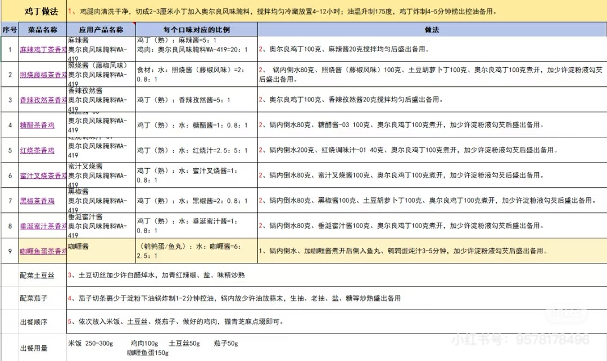

### **烤肉拌饭（韩式风味家庭版）**

#### **一、 食材清单（供2人享用）**

#### **二、 详细步骤（核心：腌、烤/煎、备、拌）**

**第一部分：准备米饭与配菜**

1. **煮饭**：按常规方法煮好一锅米饭，保温备用。

2. **处理配菜**：

    - **菠菜/黄豆芽**：分别焯水，捞出挤干水分，可加少许盐和芝麻油拌匀。

    - **胡萝卜/香菇**：胡萝卜切丝，香菇切片。锅中加少许油，分别炒软，加少许盐调味。

    - **黄瓜**：切丝，无需加热。

    - **煎蛋**：煎1\-2个太阳蛋，蛋黄保持流动状态。

**第二部分：腌制与烹制烤肉**

1. **腌制**：将肉片放入碗中，加入所有**腌料（韩式辣酱/生抽、蒜末、姜末、料酒、糖/蜂蜜、芝麻油、白胡椒粉）**，充分抓拌均匀，**腌制至少20分钟**（时间越长越入味）。

2. **烹制**：

    - **平底锅煎制（家庭常用）**：锅中刷薄油，烧热后放入腌好的肉片，**中火煎至两面焦黄、熟透**，逼出油脂，取出备用。

    - **烤箱烤制**：腌好的肉片铺在烤盘上，**200°C烤15\-20分钟**，中途翻面，直至表面焦香。奥尔良烤肉拌饭：烤制后期调高上火至230℃，使鸡皮酥脆 • 出炉前2分钟刷蜂蜜水，形成琥珀色脆壳

    - **空气炸锅**：**180°C烤12\-15分钟**，中途翻面。

**第三部分：调制灵魂拌饭酱**

将**韩式辣酱、生抽、白糖/蜂蜜、蒜末、芝麻油、熟白芝麻**放入碗中，慢慢加入**雪碧或清水**，边加边搅拌，直至酱料稀释到顺滑、可流动的稠度。

**第四部分：组装与享用**

1. 取一个大碗，盛入**热米饭**，稍微压平。

2. 将**各种处理好的配菜**（菠菜、豆芽、胡萝卜、香菇、黄瓜）颜色错落地铺在米饭上。

3. 将**烤好的肉**铺在中央。

4. 放上**煎好的太阳蛋**。

5. 根据个人口味淋上**调好的拌饭酱**，撒上**海苔碎和熟白芝麻**。

6. 食用前，用勺子将**蛋黄戳破**，然后将所有食材**彻底、均匀地搅拌在一起**，让米饭、肉、菜、蛋、酱充分融合。

#### **三、 成功关键与风味解析**

1. **“肥瘦相间”与“焦香逼出”的烤肉美学**：

    - **选肉**：**肥瘦相间的五花肉**是风味和口感的关键。脂肪在加热时融化，滋润瘦肉，产生浓郁的肉香和焦化反应带来的独特风味。

    - **火候**：无论是煎还是烤，都需要**中火或中高火**，将肉片煎/烤至**表面微焦、边缘略带脆感**。这不仅能逼出多余油脂，减少油腻感，更能通过美拉德反应产生大量芳香物质，这是“烤肉香”的核心来源。

2. **“韩式辣酱”与“雪碧/清水”的酱料平衡术**：

    - **韩式辣酱**：是风味的基石，提供甜、辣、咸、鲜的复合底味。其发酵带来的醇厚感是其他辣酱难以替代的。

    - **稀释的艺术**：直接用浓稠的辣酱拌饭会过咸过辣，且难以拌匀。加入**雪碧或清水**稀释，不仅能调节咸淡，雪碧中的碳酸和糖分还能让酱料口感更轻盈、味道更有层次。这是让拌饭酱从“调料”升级为“灵魂”的关键一步。

3. **“五彩配菜”与“半熟蛋黄”的口感与味觉架构**：

    - **配菜的功能**：五颜六色的配菜不仅是视觉点缀，更是**口感（脆、软、嫩）和味道（清甜、微苦、鲜香）的补充与平衡**。它们能解烤肉的腻，增加膳食纤维和维生素。

    - **蛋黄的魔力**：一个**半熟的太阳蛋**是拌饭的精华。戳破后流出的**蛋黄液**是一种天然的乳化剂和增稠剂，它能包裹每一粒米饭，让酱料和油脂更好地附着，使整体口感更加**顺滑、浓郁、富有包裹感**。

#### **四、 营养价值分析与健康食用建议**

- **主要营养构成（基于食材估算）** ：

    - **热量**：一份标准份（约500\-600克）的烤肉拌饭热量约为**600\-800大卡**。主要热量来源依次为：**米饭（碳水化合物）、烤肉（蛋白质和脂肪）、拌饭酱（糖和油脂）**。

    - **宏量营养素**：

        - **碳水化合物**：主要来自米饭，是主要的能量来源。

        - **蛋白质**：丰富，来自烤肉和鸡蛋，是优质蛋白。

        - **脂肪**：含量中等偏高，主要来自烤肉的脂肪（尤其是五花肉）以及酱料和烹饪用油。

    - **微量营养素**：配菜提供了丰富的**膳食纤维、维生素（如胡萝卜素、维生素C）和矿物质**。

- **健康风险提示**：

    1. **高热量与高脂肪**：尤其是使用五花肉且酱料较浓时，热量和饱和脂肪含量较高，**不宜频繁或大量食用**。

    2. **高钠与高糖**：韩式辣酱、生抽等调味料含钠量高，酱料中也可能添加较多糖或蜂蜜，对**高血压、糖尿病患者**不友好。

    3. **膳食纤维可能不足**：如果配菜比例过低，可能导致膳食纤维摄入不足。

- **健康改良与食用建议**：

    1. **优化家庭制作**：

        - **肉类选择**：优先选择**鸡胸肉、瘦牛肉或猪里脊**，或选择肥肉较少的五花肉部位，并在烹饪后沥干多余油分。

        - **主食升级**：将部分或全部白米饭替换为**糙米、藜麦或杂粮饭**，增加膳食纤维和B族维生素。

        - **酱料减负**：**减少韩式辣酱和糖的用量**，或用**无糖雪碧、低钠酱油**替代部分调料。可增加蒜末、芝麻、香菜的用量来提升风味。

        - **增加蔬菜比例**：**大幅增加各种蔬菜（如西兰花、玉米粒、什锦菜、豆芽、菌菇、彩椒）的种类和数量**，使蔬菜体积至少占碗内容积的1/2。

        - 解腻技巧：酸梅汤

    2. **科学搭配与食用**：

        - **作为完整一餐**：此饭已包含主食、蛋白质和蔬菜，营养相对均衡，无需额外搭配主食。

        - **控制份量**：建议每人每餐食用**一标准碗（约400\-500克）** 即可，避免过量。

        - **搭配清汤**：可搭配**海带豆腐汤、大酱汤**等清淡的汤品，增加饱腹感，平衡口味。

    3. **特殊人群**：

        - **减肥及“三高”人群**：可食用改良版（瘦肉、杂粮饭、多蔬菜、少酱），并**严格控制份量**。

        - **健身增肌人群**：是优质的碳水\+蛋白质组合，可适当增加瘦肉比例。

        - **一般人群**：可作为偶尔解馋的美味选择，注意日常饮食的总体均衡。

### **香菜牛肉**

#### **一、 食材清单（供2\-3人享用）**

#### **二、 详细步骤（核心：腌、滑、爆、炒）**

**第一部分：牛肉处理与腌制（嫩滑关键）**

1. **牛肉处理**：牛肉逆着纹理切成**均匀的薄片或细条**。用清水抓洗一下，挤干水分，并用厨房纸**彻底吸干表面水分**。

2. **腌制**：将牛肉放入碗中，依次加入**料酒、生抽、蚝油、白糖、白胡椒粉**，用手朝一个方向**抓拌1\-2分钟**，直至感觉发粘，调料被吸收。

3. **上浆封油**：加入**玉米淀粉**继续抓匀。最后淋入**1大勺食用油**抓匀，锁住所有水分和味道。**腌制15\-20分钟**。

**第二部分：准备配料与碗汁**

1. **处理香菜**：香菜洗净，**甩干或晾干表面水分**，切长段，将梗和叶稍微分开（梗先下锅，叶后下）。

2. **准备料头**：大蒜、姜、小米辣切好备用。

3. **调制碗汁**：将**生抽、老抽、香醋、水淀粉**在一个小碗中混合均匀，备用。

**第三部分：快炒出锅（火候艺术）**

1. **滑炒牛肉**：锅烧至**极热（冒青烟）**，倒入**比平时炒菜多一倍的油**，油温六成热时，迅速倒入腌好的牛肉，用筷子**快速划散**。待牛肉**表面刚刚变色（约七八成熟）**，立即捞出沥油。全程保持大火，时间不超过1分钟。

2. **爆香料头**：锅中留底油，转中火，放入**姜丝、蒜片、小米辣圈**爆香。

3. **合炒出锅**：转回**大火**，先放入**香菜梗**快速翻炒几下。接着倒入**滑炒好的牛肉**，沿锅边淋入**调好的碗汁**，快速翻炒均匀，让汁芡包裹食材。

4. **投入香菜叶**：在出锅前最后时刻，放入**香菜叶**，快速翻炒**两三下**，看到香菜叶微微变软即可。

5. **出锅装盘**：立即关火，盛出装盘。整个过程要快，以保持牛肉的嫩度和香菜的爽脆。

#### **三、 成功关键与风味解析**

1. **“逆纹切”与“上浆封油”的嫩肉科学**：

    - **逆纹切**：牛肉肌肉纤维粗长，**逆着纹理切割**，能缩短纤维长度，食用时更容易咬断，口感更嫩。

    - **上浆封油**：**玉米淀粉**遇热糊化，在牛肉表面形成一层保护膜，有效**锁住内部水分（汁液）**。最后封的**食用油**，既能防止下锅时淀粉粘连，也能在高温下迅速封住表面，形成双重锁水屏障。这是家庭小炒牛肉嫩滑不柴的核心技术。

2. **“热锅宽油滑炒”与“碗汁预调”的效率哲学**：

    - **热锅宽油滑炒**：锅要烧得足够热，油量要稍多（专业称“宽油滑炒”）。这样牛肉下锅后能**瞬间受热定型**，表面快速成熟锁住肉汁，内部仍保持柔嫩。这是实现“外香里嫩”口感的关键火候。

    - **碗汁预调**：将所有液体调料和水淀粉提前混合。在最后合炒时一次性倒入，能**缩短食材在锅中的停留时间**，避免因逐一添加调料而导致牛肉过老、香菜过蔫。这是保证快炒菜节奏流畅、味道均匀的秘诀。

3. **“香菜分次下”与“锅边醋”的风味点睛**：

    - **香菜分次下**：香菜梗相对耐热，先下锅可释放其香气；香菜叶极其娇嫩，在最后出锅前投入，利用余热使其**刚好塌软、香气迸发**，同时保持碧绿的色泽和脆嫩的口感。

    - **锅边醋**：香醋（或米醋）从滚烫的锅边淋入，高温会瞬间激发出**醋的醇香**，而酸味则会大部分挥发，留下迷人的“锅气”和复合香气，既能去腥增香，又能解腻，使整道菜的风味层次瞬间提升。

#### **四、 营养价值分析与健康食用建议**

- **主要营养构成（基于食材估算）** ：

    - **热量**：属于中等热量菜肴。每100克菜肴（含肉和菜）热量约150\-200千卡。主要热量来自牛肉（蛋白质和少量脂肪）和烹饪用油。

    - **宏量营养素**：

        - **蛋白质**：非常丰富，来自牛肉，是优质动物蛋白，富含人体必需氨基酸。

        - **脂肪**：中等，主要来自烹饪用油。牛里脊本身脂肪含量较低。

        - **碳水化合物**：极低。

    - **微量营养素**：牛肉是**铁、锌、维生素B12**的优质来源；香菜富含**维生素C、维生素K、胡萝卜素**以及独特的挥发油（如癸醛），具有开胃消食的作用。

- **健康风险提示**：

    1. **钠含量**：生抽、蚝油等含钠量较高，需注意整体摄入。

    2. **嘌呤**：牛肉属于中嘌呤食物，**痛风急性期患者应谨慎食用**。

    3. **用油量**：采用滑炒方式，用油量比清炒略多。

- **健康改良与食用建议**：

    1. **优化家庭制作**：

        - **减盐**：可选用**低钠生抽**，并适当减少生抽和蚝油的用量。

        - **控油**：滑炒牛肉后，用**厨房纸吸一下**牛肉表面的多余油分。爆香料头时也可减少用油。

        - **增加蔬菜**：可搭配**彩椒丝、洋葱丝、芹菜段**等一同快炒，增加蔬菜摄入量和菜品色彩。

    2. **科学搭配与食用**：

        - **完美主食搭档**：这是一道绝佳的**下饭菜**，建议搭配**杂粮饭、糙米饭**或**全麦馒头**，以平衡营养，控制血糖反应。

        - **搭配清汤**：可搭配**番茄蛋花汤、紫菜豆腐汤**等清淡汤品，缓解油腻感。

        - **控制食用频率**：作为一道口味较重的菜肴，每周食用2\-3次为宜。

    3. **特殊人群**：

        - **贫血及健身人群**：是补充蛋白质和铁的优质选择。

        - **“三高”人群**：可食用，注意选择瘦肉、控制用油和盐，并搭配大量蔬菜。

        - **痛风患者**：非急性期可少量食用，**避免饮用盘底汤汁**。

        - **香菜不耐受者**：此菜不适用，可考虑改为**蒜苗炒牛肉**或**芹菜炒牛肉**。

### **必胜客浓情香鸡翼**

#### **一、 食材清单（供2\-3人享用）**

#### **二、 详细步骤（核心：深腌、控温、刷蜜）**

**第一部分：鸡翅处理与深度腌制（入味关键）**

1. **鸡翅处理**：鸡翅中洗净，用厨房纸**彻底擦干表面水分**。在鸡翅两面用刀**划2\-3道深口**（或正反面用牙签密集扎洞），以便腌料深入骨髓。

2. **调制腌料**：在一个大碗中，混合**豉油鸡汁、料酒、蜂蜜、蒜末、白糖、新奥尔良腌料（如使用）、蚝油、黑胡椒粉、辣椒粉**，搅拌均匀。

3. **腌制**：将处理好的鸡翅放入腌料中，充分按摩抓匀，确保每个缝隙都裹上酱汁。盖上保鲜膜，**放入冰箱冷藏腌制至少4小时，隔夜更佳**（不超过24小时）。这是入味的关键。

**第二部分：烤箱预热与准备**

1. 腌制完成后，将鸡翅从冰箱取出，**室温放置约20分钟**，使其温度接近室温，避免烤制时外熟内生。

2. 烤箱**预热至200°C**。在烤盘上铺上**锡纸或烘焙纸**（方便清洁），并放上烤架（可使鸡翅受热更均匀，底部不浸在油汁中）。

**第三部分：烤制与上色（火候艺术）**

1. **初烤（烤熟）**：将鸡翅从腌料中取出，**稍微沥去多余酱汁**（防止烤糊），平铺在烤架上。放入烤箱**中层，200°C先烤15分钟**。

2. **刷蜜与翻面**：取出烤盘，将鸡翅**翻面**。用**蜂蜜水**均匀地刷在鸡翅表面。放回烤箱，继续烤**10分钟**。

3. **上色与增脆**：再次取出烤盘，将鸡翅**翻回正面**，再刷一层蜂蜜水。此时可将烤箱温度**调高至220°C**，放回烤箱再烤**5\-8分钟**，直至鸡翅表面呈现诱人的**红亮焦糖色、表皮滋滋冒油**即可。

4. **出炉静置**：出炉后，撒上**熟白芝麻**，静置2\-3分钟再食用，风味更佳。

**第四部分：替代烹饪法（无烤箱）**

- **空气炸锅版**：腌制同上。空气炸锅**180°C预热5分钟**。放入鸡翅，**180°C烤12分钟**，取出翻面刷蜂蜜水，再**200°C烤5\-8分钟**至上色。

- **平底锅煎版**：腌制同上。平底锅烧热放少许油，放入鸡翅，**中小火慢煎**，加盖焖煎至两面金黄熟透（约15\-20分钟），最后淋入少许蜂蜜水收汁增亮。

#### **三、 成功关键与风味解析**

1. **“豉油鸡汁\+新奥尔良风味”的复合味型构建**：

    - **豉油鸡汁**：作为基底，提供**醇厚的酱香、咸鲜和回甘**，其复合调味是家庭难以简单用酱油替代的。

    - **新奥尔良腌料**：其标志性的**甜、辣、香（主要来自辣椒粉、大蒜粉、洋葱粉、 paprika等）** 风味，被认为是必胜客同类产品的核心风味之一。家庭复刻时加入，能极大提升风味的还原度。

    - **蜂蜜的双重作用**：腌制时加入，**渗透入味，提供内在的甜润**；烤制时刷涂，在高温下发生**焦糖化反应**，形成**红亮、酥脆、带焦香的外皮**，并产生诱人的光泽。

    - 风味选择：喜欢甜辣味可加韩式辣酱或泰式甜辣酱；喜欢芝士味可撒帕玛森芝士粉（韩国雪花芝士粉）

2. **“划刀/扎孔”与“长时间冷藏腌制”的入味科学**：

    - **物理破坏**：在鸡皮和肉上划刀或扎孔，打破了组织屏障，为腌料中的风味分子（尤其是盐、糖、氨基酸）**开辟了渗透通道**。

    - **低温长时间腌制**：冰箱的低温环境减缓了微生物活动，却不妨碍风味物质的缓慢渗透和扩散。**长达数小时甚至隔夜的腌制**，能让味道直达骨头，实现“透骨香”。

3. **“先低温烤熟，后高温上色”的烤制节奏控制**：

    - **第一阶段（200°C，15分钟）**：相对稳定的中温，让鸡翅**均匀受热，内部逐渐熟透，汁水被锁住**，避免外皮过早焦化而内部未熟。

    - **第二阶段（调温至220°C，最后5\-8分钟）**：提高温度进行**美拉德反应和焦糖化反应的冲刺**。此时鸡翅已基本熟透，高温能迅速让表皮脱水、变脆、上色，形成标志性的**脆皮和红亮色泽**，同时激发出更浓郁的烤香。

#### **四、 营养价值分析与健康食用建议**

- **主要营养构成（基于食材估算）** ：

    - **热量**：属于中等偏高热量食物。每个鸡翅中（约50克，烤制后）热量约120\-150千卡。主要热量来自**鸡皮中的脂肪、腌制料中的糖（蜂蜜、白糖）以及烹饪中吸收的油脂**。

    - **宏量营养素**：

        - **蛋白质**：丰富，来自鸡肉，是优质蛋白。

        - **脂肪**：中等偏高，主要集中在鸡皮部分。烤制过程会逼出部分油脂，但鸡皮本身脂肪含量较高。

        - **碳水化合物**：主要来自蜂蜜和糖，用于调味和上色。

    - **微量营养素**：鸡肉提供**维生素B6、B12、磷、硒、烟酸**等。

- **健康风险提示**：

    1. **高热量与高脂肪**：鸡皮富含饱和脂肪，且经过蜂蜜和糖的加持，热量密集，**减肥及需控制血脂人群需谨慎**。

    2. **高糖与高钠**：豉油鸡汁、蚝油、蜂蜜等含糖和钠量较高，**糖尿病患者和高血压患者应注意**。

    3. **潜在有害物质**：肉类在高温烤制下，尤其是表皮焦糊部分，可能产生**杂环胺、多环芳烃**等潜在致癌物。

- **健康改良与食用建议**：

    1. **优化家庭制作**：

        - **去皮减脂**：腌制前可**去除鸡皮**，能大幅降低脂肪和热量，但会牺牲脆皮口感。

        - **减糖减盐**：减少蜂蜜和豉油鸡汁的用量，或用**代糖**和**低钠酱油**部分替代。

        - **搭配蔬菜同烤**：在烤盘上同时放入**彩椒块、洋葱块、西兰花、小番茄**等，利用烤鸡翅滴落的油脂将蔬菜烤香，增加膳食纤维和维生素摄入。

        - **控制烤制温度与时间**：避免过高温度或过长时间烤制导致焦糊，可**在烤盘上垫锡纸并戳孔**，让油脂滴落，减少鸡翅与焦化物的接触。

    2. **科学搭配与食用**：

        - **作为配餐小吃**：建议作为**分享型小吃**，而非主菜。每人食用2\-3只为宜。

        - **搭配解腻食物**：务必搭配大量的**生菜沙拉、酸黄瓜、清爽的柠檬水或大麦茶**，以解油腻。

        - **避免食用焦糊部分**：食用时，尽量**撕掉明显烤焦的鸡皮部分**。

    3. **特殊人群**：

        - **儿童与青少年**：可作为偶尔解馋的零食，注意控制数量。

        - **“三高”及肥胖人群**：建议选择去皮版本，并严格限量（1\-2只），且避免在同一天摄入其他高脂高糖食物。

        - **一般人群**：享受美味的同时，注意食用频率（每周不超过一次）和份量控制。

---

### 柠檬黑胡椒烤鸡腿 

（供2\-3人享用）

#### 一、 食材清单 

#### 二、 详细步骤（核心：腌、烤、静） 

**第一部分：鸡腿处理与腌制（风味注入的关键）**

1. **处理鸡腿**：用厨房纸彻底擦干鸡腿表面水分。在鸡腿肉厚的地方划几刀（深至骨头），便于入味和均匀受热。

2. **制作腌料**：在一个大碗中，挤入半个柠檬的汁，加入现磨黑胡椒碎、压好的蒜蓉、橄榄油、盐、蜂蜜（如用）以及撕碎的香草（如用），充分搅拌均匀。

3. **充分按摩**：将鸡腿放入腌料中，用手给鸡腿进行充分“按摩”，确保腌料均匀涂抹在每一个角落，特别是划开的刀口和鸡皮下方。

4. **密封腌制**：将按摩好的鸡腿连同腌料一起放入密封袋或保鲜盒中，放入冰箱冷藏腌制。**理想时间至少2小时，最好隔夜（4小时以上）**。腌制是入味多汁的保证。

**第二部分：准备烤制（预热与摆盘）**

1. **回温**：烤制前30\-60分钟，将鸡腿从冰箱取出，室温回温，使其烤制时受热更均匀。

2. **预热烤箱**：将烤箱预热至**200°C**（热风循环模式更佳，上色更均匀）。

3. **准备烤盘**：在烤盘上铺上锡纸（方便清洁），并放置一个烤架。将鸡腿从腌料中取出，抖掉表面过多的蒜蓉（以免烤焦），**鸡皮朝上**摆放在烤架上。将剩余的半个柠檬切成薄片，塞在鸡腿下方或旁边。

**第三部分：烘烤（高温定型，中温烤熟）**

1. **高温初烤（上色）**：将烤盘放入烤箱中层，以**200°C**先烤**20\-25分钟**。此时鸡皮应开始收紧、呈现金黄色。

2. **调温烤熟**：将烤箱温度调低至**180°C**，继续烤**15\-20分钟**。用探针温度计插入鸡腿最厚处，若无温度计，可用筷子扎一下，流出清澈的汁水（非血水）即表示已熟。内部温度应达到**74°C以上**。

3. **最后收脆（可选）**：如果喜欢更脆的鸡皮，可以在最后3\-5分钟将烤箱调至**220°C**或开启上火烧烤功能，密切观察至鸡皮达到理想的焦脆程度（想要酥脆，不用烤盘，用烤架，烤架在下方接油烤箱 160 °35 分钟，转 200°3 分钟，腌制的时候给它用厨房剪刀戳几下）。

**第四部分：静置与享用（锁住汁水）**

1. **关键静置**：烤好后立即取出，将鸡腿转移到干净的盘子上，**静置5\-10分钟**。这一步能让肉纤维松弛，重新吸收肉汁，切分时不会流失过多汤汁。

2. **装盘**：将静置好的鸡腿装盘，可搭配烤过的柠檬片、新鲜香草点缀。盘底的烤制出的鸡汁是精华，可淋在鸡腿上或用来蘸食。

#### 三、 成功关键与风味解析 

1. **“擦干\-划刀\-按摩\-长时腌制”的入味多汁四部曲**：

    - **擦干**：表面水分是烤脆鸡皮的天敌，务必彻底吸干。

    - **划刀**：在肉厚处划深口，不仅让腌料直达内部，也使得热量能均匀渗透，避免外熟里生。

    - **按摩**：物理按压帮助调味料附着和初步渗透。

    - **长时腌制**：**冷藏隔夜腌制是最佳选择**。柠檬酸和盐有助软化肉质纤维，让鸡肉更嫩；橄榄油和香料风味有充足时间渗入肌理。

    - 保证嫩度：用锡纸包裹烤制前20分钟（再打开上色）

2. **“现磨黑胡椒”与“新鲜柠檬”的风味二重奏**：

    - **黑胡椒的灵魂地位**：**务必使用现磨黑胡椒粒**。其挥发性精油在烘烤时散发出的温暖、辛辣、略带花木的香气，是瓶装胡椒粉无法比拟的。粗磨颗粒在口中爆开，带来更立体的味觉体验。

    - **柠檬的双重作用**：柠檬汁在腌制时作为酸性介质嫩化肉质；柠檬片在烘烤时，其汁水和果皮精油受热挥发，为鸡肉注入清新的果香，有效平衡鸡肉的油脂感，达到解腻增香的效果。

    - 麻辣烫风味：用火锅底料腌制，上色即是同款盒马麻辣烫鸡腿

3. **“高温\-中温\-（高温）三段式烘烤”与“静置”的烹饪科学**：

    - **三段式烘烤**：**初始高温（200°C）** 能迅速让鸡皮蛋白质凝固、美拉德反应发生，形成金黄酥脆的外壳并锁住内部水分。**中温慢烤（180°C）** 让热量温和地传导至中心，确保内部完全熟透而不至于让外部烤焦。**最终高温（可选）** 是追求极致脆皮的临门一脚。

    - **静置的必要性**：刚出炉的鸡肉，内部汁水因高温而分布不均，集中在中心。静置片刻，随着温度下降，肉纤维放松，汁水会重新均匀分布到每一寸肉质中。切开时，汁水丰盈，不会干柴。

#### 四、 营养价值分析与健康食用建议 

- **主要营养构成（以1只中等大小带皮鸡腿估算）**：

    - **热量**：约 **250\-300千卡** 。主要来自蛋白质和脂肪。

    - **蛋白质**：约 **25\-30克** 。优质完全蛋白，富含人体必需氨基酸。

    - **脂肪**：约 **15\-20克** 。主要集中在鸡皮和皮下的脂肪层。使用橄榄油，富含单不饱和脂肪酸。

    - **维生素**：**维生素B族**（尤其是B3、B6）含量丰富，有助于能量代谢。柠檬提供**维生素C**。

    - **矿物质**：富含**硒、磷**，也是**铁和锌**的良好来源。

- **健康风险提示**：

    1. **脂肪与胆固醇**：鸡皮含有较高饱和脂肪和胆固醇。对于需要控制血脂的人群，摄入需谨慎。

    2. **潜在致癌物**：肉类在高温烤制下，尤其是鸡皮烤焦的部分，可能产生杂环胺等有害物质。

    3. **钠含量**：腌制时使用的盐和酱油（如添加）会使成品钠含量不低。

- **健康改良与食用建议**：

    1. **优化家庭制作**：

        - **去皮食用**：食用前去除鸡皮，可以大幅减少脂肪和热量的摄入。

        - **避免烤焦**：控制好烤箱温度和时间，及时加盖锡纸，避免鸡皮烤焦变黑。

        - **减少用盐**：可使用香草、大蒜、柠檬皮屑等天然香料来增强风味，减少盐的用量。

        - **选择橄榄油**：使用橄榄油等健康油脂进行腌制。

    2. **科学搭配与食用**：

        - **搭配大量蔬菜**：烤制时可在烤盘底部铺满洋葱、彩椒、西兰花、小番茄等蔬菜，吸收鸡汁，实现一锅出，营养更均衡。

        - **控制份量**：作为主菜，建议每人每次食用1只鸡腿为宜，搭配足量的蔬菜和复合碳水（如糙米、全麦面包）。

        - **多喝水**：烤制食物相对“燥热”，食用后注意补充水分。

    3. **特殊人群**：

        - **高血脂、心血管疾病患者**：建议**去皮食用**，并严格控制食用频率和份量。

        - **痛风患者**：鸡肉属于中嘌呤食物，急性发作期应避免，缓解期可少量食用去皮鸡肉。

### **必胜客香骨鸡**

#### **一、 食材清单（供2\-3人享用）**

#### **二、 详细步骤（核心：腌、粉、炸）**

**第一部分：鸡肉处理与深度腌制（入味关键）**

1. **处理鸡肉**：将**鸡翅根或鸡锁骨**洗净，用厨房纸彻底擦干水分。在肉质较厚的地方划上几刀，以便腌料深入。

2. **调制腌料**：在一个大碗中，混合所有**深度腌料（盐、糖、大蒜粉、洋葱粉、白胡椒粉、辣椒粉、五香粉、鸡精、小苏打）**，加入**清水或牛奶**搅拌成糊状。

3. **腌制**：将鸡肉放入腌料中，充分按摩抓匀，确保每个缝隙都裹满腌料。盖上保鲜膜，**放入冰箱冷藏腌制至少4小时，隔夜更佳**（不超过12小时）。

**第二部分：准备裹粉与油锅**

1. **调制裹粉**：将**中筋面粉、玉米淀粉、马铃薯淀粉、泡打粉、盐**混合均匀，过筛一次更佳。此即为“干粉”。

2. **准备湿浆（可选，用于更厚脆壳）**：取约30克混合好的干粉，加入**50毫升冰水**调成稀糊状（类似酸奶稠度）。

3. **预热油锅**：锅中倒入足量食用油，深度需能没过鸡肉。加热至**170\-180°C**（插入木筷周围冒密集小泡）。

**第三部分：裹粉与炸制（酥脆关键）**

1. **裹粉**：

    - **标准薄脆版**：将腌好的鸡肉从冰箱取出，**沥掉多余腌汁**，直接放入**干粉**中，用手按压、翻动，让粉均匀附着，然后抖掉多余粉。

    - **鳞片厚脆版（推荐）**：鸡肉先裹一层**干粉**，抖掉多余粉后，放入**湿浆**中快速蘸一下，捞出后再放入**干粉**中，用手以“捞、压、搓”的手法，使粉形成鳞片状。静置1\-2分钟返潮。

2. **初炸（定型炸熟）**：将鸡肉逐个放入油锅，**中小火（保持170°C左右）** 炸约**6\-8分钟**（视大小调整），炸至定型、表面微黄、内部熟透，捞出沥油。

3. **复炸（逼油增脆）**：**升高油温至190\-200°C**，将初炸的鸡肉全部下锅，**大火复炸30\-60秒**，直至外壳呈金黄色、极其酥脆，立即捞出沥干油分。

**第四部分：调味与享用**

将炸好的香骨鸡趁热撒上**椒盐、辣椒粉、孜然粉**等喜欢的调料，翻拌均匀即可。或者锅里放蜂蜜水或者冰糖加水调色，锅里糖水起泡成汁后把鸡翅倒进去粘上酱汁马上起锅（糖水一定要起泡有粘性的时候把鸡翅倒进去，这个很关键。）

#### **三、 成功关键与风味解析**

1. **“骨边肉”的选择与“干粉香料”的腌料哲学**：

    - **部位选择**：商业版的“香骨鸡”多选用**鸡肩胛骨**，其骨肉相连，啃食有乐趣。家庭复刻可用**鸡翅根或鸡锁骨**替代，它们同样带有软骨和贴骨肉，经过油炸后，**骨头中的香味物质（如骨髓）会渗出，与香料结合，产生独特的“骨香”**。

    - **干粉腌料优势**：使用**大蒜粉、洋葱粉**等干粉香料而非新鲜蒜蓉洋葱，是因为**干粉风味更稳定、更易附着，且不会在腌制时出水，影响后续裹粉**。小苏打的加入则能**嫩化肉质**，弥补这些部位可能偏柴的口感。

2. **“粉\-浆\-粉”与“泡打粉”的酥脆外壳构建术**：

    - **多层结构**：“干粉\-湿浆\-干粉”的包裹顺序，能形成**层次分明、凹凸有致的鳞片状外壳**。第一层干粉吸附表面水分，湿浆作为粘合剂，第二层干粉在湿浆上形成鳞片。这是许多商业炸鸡外壳酥脆的秘诀。

    - **泡打粉的作用**：裹粉中加入**双效泡打粉**，在油炸遇热时会产生二氧化碳气体，使外壳**内部形成微小气孔，变得异常蓬松、酥脆、不硬实**。

3. **“低温初炸”与“高温复炸”的油炸温度控制法**：

    - **初炸（低温）**：油温约170°C，目的是让鸡肉**从内到外慢慢熟透**，同时让外壳定型。温度过高会导致外焦里生。

    - **复炸（高温）**：油温升至190\-200°C，短时间复炸。其核心作用是**逼出初炸时吸入外壳的部分油脂**，让外壳**脱水变得更干、更脆**，同时使颜色迅速变得金黄漂亮。这是实现“外脆里嫩多汁”不可或缺的一步。

#### **四、 营养价值分析与健康食用建议**

- **主要营养构成（基于食材估算）** ：

    - **热量**：典型的高热量油炸食品。每100克炸香骨鸡热量约**250\-300千卡**。主要热量来自**油炸用油（脂肪）和裹粉（碳水化合物）**。

    - **宏量营养素**：

        - **蛋白质**：丰富，来自鸡肉，是优质蛋白。

        - **脂肪**：含量高，主要来自**油炸过程中吸入的油脂**以及鸡肉本身的脂肪（尤其是鸡皮）。

        - **碳水化合物**：中等，主要来自裹粉。

    - **微量营养素**：鸡肉提供**B族维生素、磷、硒**等。

- **健康风险提示**：

    1. **高热量与高脂肪**：经过深度油炸，脂肪含量和热量极高，**经常食用易导致肥胖、心血管疾病风险增加**。

    2. **潜在有害物质**：油脂在高温下反复使用或加热过度，可能产生**反式脂肪酸和丙烯酰胺**等有害物质。

    3. **高钠**：腌料和撒料中含盐量较高。

- **健康改良与食用建议**：

    1. **优化家庭制作**：

        - **选择更优烹饪方式**：使用**空气炸锅**制作。鸡肉腌制并裹粉后，表面喷或刷少量油，**空气炸锅200°C炸15\-20分钟**，中途翻面，可大幅减少用油量。

        - **去皮减脂**：使用**鸡翅根时，可以去掉鸡皮**，能显著降低饱和脂肪摄入。

        - **控制裹粉量**：减少裹粉的厚度，或尝试用**全麦面包糠混合燕麦片**替代部分裹粉，增加膳食纤维。

        - **使用优质油并控制油温**：使用**单不饱和脂肪酸含量高的油（如橄榄油、菜籽油）**，并严格控制油温，避免油温过高产生油烟和有害物。

    2. **科学搭配与食用**：

        - **作为偶尔解馋的小吃**：**绝不建议作为日常菜肴**。每月食用不超过1\-2次。

        - **搭配大量蔬菜**：食用时务必搭配**大份的蔬菜沙拉、凉拌黄瓜、生菜**等，以增加饱腹感、膳食纤维和维生素摄入，平衡营养。

        - **搭配清爽饮品**：搭配**柠檬水、大麦茶、无糖乌龙茶**等，解腻助消化。

        - **避免食用炸糊部分**：炸焦糊的部分含有更多有害物质，应丢弃。

    3. **特殊人群**：

        - **儿童、青少年及健身人群**：可偶尔食用，注意控制份量，并增加当日运动量。

        - **“三高”、肥胖及心血管疾病患者**：**应尽量避免或严格限制**。如果食用，务必选择空气炸锅版、去皮，并仅尝1\-2块。

        - **一般人群**：享受美味时务必牢记“适量”原则，并注意日常饮食的整体清淡与均衡。

### **甘梅红薯条（夜市风味酥脆版）**

#### **一、 食材清单（供2\-3人享用）**

#### **二、 详细步骤（核心：预处、裹糊、两炸、撒粉）**

**第一部分：红薯预处理（奠定口感基础）**

1. **处理红薯**：红薯洗净去皮，切成**粗细均匀（约1厘米见方，5\-8厘米长）的条状**。切好后立即放入**清水**中，加入**几滴白醋**，浸泡**15\-30分钟**。这一步可去除表面多余淀粉，防止氧化变黑，并提升成品酥脆度。

2. **沥干水分**：将泡好的红薯条捞出，用**厨房纸彻底擦干表面水分**，或平铺晾干。**表面越干，油炸时越不易溅油，外壳也越脆**。

**第二部分：调制面糊与裹粉**

1. **调制面糊**：在一个大碗中，混合**中筋面粉、玉米淀粉、马铃薯淀粉（如使用）、泡打粉和盐**。**分次加入冰水**，搅拌成**顺滑、可流动的酸奶状面糊**。切忌过稠或过稀。

2. **裹糊**：将彻底沥干的红薯条放入面糊中，用筷子或手翻拌，确保**每一根都均匀裹上薄薄一层面糊**。

**第三部分：油炸定型与增脆（火候艺术）**

1. **初炸（定型炸熟）**：锅中倒入足量油，加热至**160\-170°C**（插入筷子周围冒密集小泡）。将裹好糊的红薯条**分批、逐根**放入油锅，避免一次下太多导致油温骤降。保持**中小火**炸约**3\-4分钟**，炸至红薯条**浮起、表面微黄定型、用筷子可轻易戳透**，捞出沥油。

2. **复炸（逼油增脆上色）**：**将油温升高至190\-200°C**。将初炸好的红薯条全部再次下锅，**大火复炸30\-60秒**，直至外壳呈现**诱人的金黄色、表皮坚硬酥脆**，立即捞出，放在铺有厨房纸的网架上沥干多余油分。复炸是**酥脆持久**的关键。

**第四部分：调味与享用**

将炸好的红薯条趁热放入一个大碗中，均匀撒上**甘梅粉**（可混合少许熟白芝麻），轻轻颠簸碗使其均匀附着。**务必趁热撒粉**，余温能使风味更好融合。

**第五部分：健康替代法（空气炸锅版）**

1. 红薯条预处理同上（浸泡、沥干）。

2. 红薯条放入碗中，加入**1大勺食用油**抓匀，再撒上**1\-2大勺玉米淀粉或红薯淀粉**抓匀，使表面有一层薄粉。

3. 空气炸锅**200°C预热5分钟**。放入红薯条，**200°C烤15\-20分钟**，中途翻面一次，烤至表面金黄酥脆即可。

4. 出炉后同样趁热撒甘梅粉。

#### **三、 成功关键与风味解析**

1. **“红心蜜薯”与“淀粉浸泡”的选材预处理科学**：

    - **品种决定论**：**红心或黄心蜜薯**因其**高糖分、适中水分和细腻肉质**，在油炸时能发生更充分的焦糖化反应，产生更深邃的甜香和绵软的内芯，是口感和风味的绝对基石。

    - **浸泡去淀粉**：冷水浸泡能**洗去红薯表面游离的淀粉**。这有三大好处：**防止炸制时相互粘连；减少淀粉在高温下产生过多糊精导致外壳过硬；让红薯条在油炸时水分蒸发更顺畅，从而形成更酥脆的外壳**。

2. **“粉浆比例”与“泡打粉”的酥脆外壳构建术**：

    - **粉浆状态**：面糊需调至**顺滑的酸奶状**。太稠会导致外壳厚重僵硬，太稀则挂不住糊，无法形成脆壳。

    - **泡打粉的魔法**：加入**双效泡打粉**，在油炸遇热时会产生二氧化碳气体，在面糊内部形成**微小气孔**。这使得外壳不仅酥脆，而且**轻盈、蓬松、不硬实**，口感层次极大丰富。

3. **“低温初炸\+高温复炸”的油炸温度控制法**：

    - **初炸（160\-170°C）**：目的是让红薯条**从外到内均匀熟透**，内部淀粉充分糊化，变得绵软。同时让外壳初步定型。

    - **复炸（190\-200°C）**：核心作用是**逼出初炸时渗入外壳的部分油脂**，并让外壳在更高温度下**迅速脱水、变得极其干爽酥脆**，颜色也变得金黄漂亮。这是实现“放凉也不软”的核心步骤。

4. **“甘梅粉”与“趁热撒粉”的风味点睛**：

    - **风味复合**：优质的甘梅粉融合了**话梅的酸、甘草的回甘、以及盐的咸**。这种复杂的酸甜咸味，能**强烈地衬托并激发出红薯本身纯粹的甜味**，形成“先酸后甜，回味无穷”的味觉体验。

    - **时机关键**：出锅后**立即、趁热**撒粉。红薯条表面的余温和微量油分，能帮助甘梅粉**更好地附着并微微融化**，风味瞬间渗入，达到人粉合一的效果。

    - 其它风味：搭配孜然粉或芝士粉，咸甜交织更过瘾！

#### **四、 营养价值分析与健康食用建议**

- **主要营养构成（基于食材估算）** ：

    - **热量**：属于中等偏高热量零食。每100克炸甘梅红薯条约**200\-250千卡**。主要热量来自**油炸用油（脂肪）和红薯本身的碳水化合物**。

    - **宏量营养素**：

        - **碳水化合物**：丰富，主要来自红薯，是优质复合碳水，富含膳食纤维。

        - **脂肪**：含量中等偏高，主要来自油炸过程吸入的油脂。

        - **蛋白质**：较低。

    - **微量营养素**：红薯是**β\-胡萝卜素（维生素A原）、维生素C、钾和膳食纤维**的优质来源。甘梅粉可能提供微量的有机酸和矿物质。

- **健康风险提示**：

    1. **高热量与高脂肪**：传统油炸做法会显著增加脂肪摄入，**频繁食用不利于体重控制和心血管健康**。

    2. **高糖**：红薯本身含糖量高，加上甘梅粉中可能含有糖分，整体糖负荷不低，**糖尿病患者需特别注意**。

    3. **潜在有害物质**：淀粉类食物在高温油炸下可能产生**丙烯酰胺**等潜在有害物。

- **健康改良与食用建议**：

    1. **优化家庭制作**：

        - **首选空气炸锅/烤箱**：这是最有效的健康改良方式，能**减少80%以上的用油量**，同时获得近似酥脆的口感。

        - **控制裹粉量**：减少面糊的厚度，或尝试直接用**薄薄一层玉米淀粉**包裹，减少吸油。

        - **使用优质油并控制油温**：如需油炸，使用**单不饱和脂肪酸含量高的油（如菜籽油、花生油）**，并严格控制油温，避免油温过低导致过度吸油。

    2. **科学搭配与食用**：

        - **作为分享型零食**：建议作为**茶点或聚会零食**，与家人朋友分享，控制个人摄入量。

        - **搭配解腻饮品**：食用时搭配**无糖绿茶、柠檬水或大麦茶**，帮助消化解腻。

        - **避免食用焦糊部分**：炸焦的部分有害物质含量更高，应剔除。

### **天妇罗**

#### **一、 食材清单（供2\-3人享用）**

#### **二、 详细步骤（核心：冰、薄、快、准）**

**第一部分：食材预处理（干燥是关键）**

1. **处理虾**：去头去壳，保留尾部最后一节壳（美观且方便手持）。从背部切开，去除虾线。在虾腹部均匀斜切3\-4刀（切断腹筋），再用刀背轻拍虾身，使其伸展挺直，油炸时不卷曲。

2. **处理蔬菜**：根据食材特性切配。**茄子切条或扇形；南瓜、红薯切3\-5毫米薄片（红薯片需泡水去淀粉）；香菇表面划十字花；莲藕切薄片泡醋水防氧化**。

3. **彻底干燥**：所有处理好的食材，必须用**厨房纸彻底吸干表面水分**。这是防止油炸时溅油和面衣脱落变软的前提。

**第二部分：调制天妇罗面糊（冰、快、粗）**

1. **准备冰水**：将**150毫升水放入冰箱冷藏或加入冰块**，确保温度很低。

2. **混合液体**：在大碗中打入**鸡蛋黄**，加入**冰水**，用筷子轻轻打散**（不要过度搅拌产生泡沫）**。

3. **加入粉类**：将**低筋面粉（和玉米淀粉）混合过筛**，一次性倒入冰水蛋液中。

4. **搅拌面糊**：用筷子以**“Z”字形或划十字的方式，快速搅拌约10\-15下**。**关键在于不要搅拌至顺滑无颗粒**，应保留一些小面疙瘩，面糊呈**稀酸奶状，能呈线状流下**即可。搅拌过度会产生面筋，导致面衣厚重不酥脆。

5. **保持低温**：将调好的面糊碗**坐入一个更大的装有冰块和水的盆中**，保持低温备用。

**第三部分：制作天妇罗蘸汁（天汁）**

小锅中加入**出汁、味醂**，小火煮开后稍煮片刻让酒精挥发。加入**浓口酱油**，再次煮开后立即关火，放凉备用。食用时，将**白萝卜泥**和少许**姜泥**加入蘸汁中。

**第四部分：油炸（精准控温，少量多次）**

1. **预热油锅**：锅中倒入足量油（深度能没过食材），加热至**170\-180°C**。可用木筷测试：插入油中，筷子周围产生密集小泡即达到温度。

2. **裹粉与挂糊**：将干燥的食材先**薄薄地拍上一层低筋面粉**（尤其虾和光滑蔬菜），抖掉多余粉。然后**快速浸入冰面糊中**，均匀裹上薄薄一层，提起让多余面糊滴落。

3. **下锅油炸**：**将食材逐个、沿锅边滑入油中**。**一次不要放太多**，以免油温骤降。先炸蔬菜，后炸海鲜（避免串味）。

    - **蔬菜类（南瓜、茄子等）**：炸约**1\-2分钟**，至面衣定型、微黄浮起。

    - **虾/海鲜类**：炸约**1\.5\-2分钟**，至面衣金黄酥脆。

    - **叶类（紫苏叶）**：炸**15\-30秒**即可。

4. **沥油**：炸好后用漏勺捞出，**放在金属网架或铺有厨房纸的盘子上沥油**，而非直接堆叠在盘中，以保持酥脆。

5. **清理油渣**：每炸完一批，用细网漏勺捞净锅中面衣碎渣，保持油质清澈。

**第五部分：享用**

**现炸现吃**是天妇罗的灵魂。将炸好的天妇罗摆盘，搭配装有萝卜泥的蘸汁小碟。也可搭配少许**盐或柠檬角**，品尝食材本味。

#### **三、 成功关键与风味解析**

1. **“冰水面糊”与“不过度搅拌”的酥脆科学**：

    - **冰水的作用**：低温能**极大抑制面粉中面筋蛋白（谷蛋白）的生成**。面筋越少，炸出的面衣就越**轻盈、酥松、易碎**，而非坚韧有嚼劲。

    - **粗糙面糊的奥秘**：搅拌时**故意留下一些小面疙瘩**，不过度追求均匀。这些未完全溶解的粉粒在油炸时能形成**不均匀的孔隙和酥脆的颗粒感**，是专业天妇罗外壳“鳞片”状口感的来源之一。

2. **“精准油温（170\-180°C）”与“蒸炸结合”的烹饪哲学**：

    - **油温的黄金区间**：170\-180°C是“蒸”与“炸”的平衡点。油温过低，面衣无法迅速定型，会吸入过多油脂变得油腻；油温过高，面衣瞬间焦化而内部未熟。

    - **“蒸炸”原理**：薄薄的面衣在高温油中迅速定型，形成一个**多孔的脆壳**。食材内部的水分受热蒸发，被这层脆壳锁住，在内部形成一个**微小的“蒸笼”环境**，将食材快速蒸熟。这正是天妇罗“外脆内嫩、汁水充盈”的核心。

3. **“食材干燥”与“先粉后糊”的附着秘诀**：

    - **绝对干燥**：食材表面的水分是面衣的“天敌”，会导致挂糊不均、脱落，并引起油花四溅。**厨房纸彻底吸干**是必不可少的一步。

    - **拍粉的作用**：在裹面糊前，先拍一层极薄的干粉。这能在潮湿的食材表面和稀面糊之间建立一个“中介层”，**极大地增强面糊的附着力**，尤其对于表面光滑的虾和茄子等食材至关重要。

4. **“出汁为基础的蘸汁”与“萝卜泥”的风味平衡**：

    - **天汁（蘸汁）**：以**出汁（昆布和柴鱼花的高汤）** 为基底，加入酱油和味醂调和，味道**咸鲜回甘，清淡而富有层次**，绝不会掩盖食材本味。

    - **萝卜泥的作用**：现磨的**白萝卜泥**加入蘸汁，其含有的**酶（淀粉酶）** 能帮助消化，其**清爽的辛味和水分**能有效化解油炸物的油腻感，是味道与口感上的完美平衡。

#### **四、 营养价值分析与健康食用建议**

- **主要营养构成（基于食材估算）** ：

    - **热量**：属于中高热量菜肴。热量主要来自**油炸用油**。具体数值因食材、面衣厚度和吸油量差异很大。一份混合天妇罗（含2只虾及若干蔬菜）热量约300\-500千卡。

    - **宏量营养素**：

        - **脂肪**：含量较高，主要来自油炸过程。使用沥油架可减少部分油脂。

        - **蛋白质**：来自虾、鱼等海鲜，是优质蛋白。

        - **碳水化合物**：主要来自面衣和红薯、南瓜等根茎类蔬菜。

    - **微量营养素**：蔬菜提供了**维生素、矿物质和膳食纤维**；海鲜提供了**锌、硒等矿物质**。

- **健康风险提示**：

    1. **高脂肪与高热量**：传统深度油炸方式使脂肪含量显著增加，**不宜频繁或大量食用**。

    2. **潜在有害物质**：淀粉类食材（如红薯、南瓜）在高温油炸下可能产生**丙烯酰胺**。油脂反复高温加热也可能产生有害物质。

    3. **高钠**：蘸汁（天汁）中含酱油，钠含量不低。

- **健康改良与食用建议**：

    1. **优化家庭制作**：

        - **选择健康油**：使用**单不饱和脂肪酸含量高的油（如菜籽油、米糠油）**，并控制油温，避免超过烟点。

        - **减少面衣厚度**：严格遵循“薄衣”原则，面糊挂得越薄，吸油越少。

        - **善用沥油**：炸好后务必在**网架**上充分沥油，比铺厨房纸效果更好。

        - **尝试非油炸法**：

            - 使用**空气炸锅**。食材处理后喷或刷薄薄一层油，**空气炸锅180\-200°C烤10\-15分钟**，中途翻面。虽无法完全复制酥脆感，但可大幅减少用油。

            - 烤箱使用空气炸（酥脆），防止烤篮中，下方放置烤盘

    2. **科学搭配与食用**：

        - **作为配菜而非主菜**：天妇罗在日本料理中常作为一道菜出现，**建议每人份量控制在3\-5件以内**。

        - **搭配解腻食物**：务必搭配大量的**萝卜泥、卷心菜丝、柠檬**，并佐以**绿茶**。

        - **选择更优食材**：多选用**香菇、茄子、青椒、秋葵**等吸油相对较少的蔬菜，减少红薯、南瓜等高淀粉食材的比例。

        - **控制蘸汁用量**：蘸汁时**轻蘸即可**，或直接用**少许盐或柠檬汁**替代，以减少钠摄入。

    3. **特殊人群**：

        - **“三高”及心血管疾病患者**：应**严格限制食用频率和数量**，优先选择空气炸锅版，并避免食用面衣过厚的部分。

        - **减肥人群**：可作为偶尔的“欺骗餐”，注意控制总热量摄入，并在当日增加运动量。

        - **一般人群**：享受其美味时，牢记“浅尝辄止”，并搭配均衡的膳食。

### **牛肉干**

#### **一、 食材清单（以制作约250克成品为例）**

#### **二、 详细步骤（核心：处理、腌制、脱水）**

**第一部分：牛肉处理（去腥定形）**

1. **选肉与切条**：牛肉顺纹理切成**手指粗细（约1\.5厘米见方）的长条**。顺纹切能保证成品有嚼劲，不易碎。切忌切得太细，烤制后会严重缩水。

2. **浸泡去血水**：切好的牛肉条用**冷水浸泡1\-2小时**，中间换水2\-3次，直至水色清澈。这一步能有效去除腥味。

3. **彻底沥干**：捞出牛肉条，用**厨房纸彻底吸干表面水分**。这是后续入味和成功脱水的基础。

**第二部分：深度腌制（风味注入）**

1. **调制腌料**：在一个大碗中，混合所有**基础腌料（生抽、老抽、料酒、糖）和选择的风味香料**。

2. **按摩入味**：将彻底沥干的牛肉条放入腌料中，加入姜片、葱段，**充分抓拌按摩10分钟**。确保每条牛肉都均匀裹上酱汁。

3. **冷藏腌制**：盖上保鲜膜，**放入冰箱冷藏腌制至少4小时，隔夜（12小时以上）更佳**。腌制时间越长，风味越深入。

**第三部分：脱水干燥（三种主流方法）**

**方法一：烤箱版（最便捷）**

1. **预热与准备**：烤箱预热至**150\-160°C**，开启热风循环功能（如有）。烤盘铺锡纸，放上烤网（使受热更均匀）。

2. **初烤脱水**：将腌好的牛肉条平铺在烤网上，**放入烤箱中层，150°C烤30\-40分钟**。

3. **翻面与调整**：取出烤盘，将牛肉条翻面。此时可**刷一层薄薄的食用油**（防止过干），并根据喜欢的干湿程度调整时间。

4. **低温烘干**：温度调至**120\-130°C**，继续烘烤**40\-60分钟**，中途可再翻面一次，直至达到理想的干度（喜欢有嚼劲的烤时间短些，喜欢干香的烤久些）。

5. **出炉**：取出后撒上熟白芝麻，完全放凉后口感更佳。

**方法二：自然风干版（传统风味）**

1. **穿挂**：将腌制好的牛肉条用棉线或钩子穿起，挂在**通风、干燥、避免阳光直射**的地方。

2. **风干**：根据天气湿度，**风干2\-4天**，直至表面干燥变硬，内部仍有弹性。

3. **蒸制（可选，更易保存）**：将风干好的牛肉干上锅**大火蒸15\-20分钟**，彻底杀菌并回软，然后再次挂起风干半天即可。

**方法三：先煮后烤/炒版（更软润）**

1. **焯水煮熟**：腌好的牛肉条冷水下锅，加姜片、料酒，煮沸撇去浮沫，转小火煮约**20\-30分钟**至七八成熟，捞出沥干。

2. **收汁或炒干**：

    - **烤箱收干**：煮好的牛肉条放入烤箱，按**方法一**的低温烘干步骤操作。

    - **炒锅收干**：将牛肉条放入炒锅（可加少许油），中小火不断翻炒，并分次加入腌肉的料汁，炒至汤汁收干，牛肉表面变干即可。

#### **三、 成功关键与风味解析**

1. **“顺纹切条”与“彻底去水”的物理基础**：

    - **顺纹切**：牛肉的肌肉纤维长，**顺着纹理切**，成品才能撕出长长的肉丝，口感紧实有嚼劲。逆纹切则容易散碎。

    - **双重去水**：**浸泡去血水**去除腥味来源；**厨房纸吸干**则是在腌制前为牛肉创造一个“干燥”的表面，有利于腌料渗透而非被稀释，同时也是后续脱水干燥效率的保证。

2. **“长时间冷藏腌制”与“糖的角色”的化学魔法**：

    - **时间的力量**：冰箱低温环境减缓了细菌活动，却给了风味分子（盐、糖、氨基酸、香料）充足的时间**缓慢而深入地渗透到肌肉纤维的每一个角落**，这是入味的关键。

    - **糖的多重作用**：白糖或蜂蜜不仅是提供甜味。在后续的加热脱水过程中，糖与肉中的氨基酸发生**美拉德反应**，产生诱人的红褐色和复杂的焦香风味。糖还能帮助肉质保持一定湿润度，避免过度干柴。

3. **“低温慢烤/风干”的脱水哲学**：

    - **避免外焦里生**：无论是烤箱还是自然风干，核心都是**低温、缓慢、均匀地去除水分**。高温会迅速使表面结壳变硬，锁住内部水分，导致外干内湿，容易变质，或外焦里生。

    - **烤箱的精准控制**：采用 **“先中温定型，再低温烘干”** 的策略。初期较高温度让表面快速定型，防止粘黏；后期低温长时间烘烤，让内部水分从容渗出，达到内外干度一致。

    - **风干的自然之力**：依靠流动的空气自然带走水分，能最大程度保留牛肉的原香，产生独特的风干发酵风味，但受天气影响大。

#### **四、 营养价值分析与健康食用建议**

- **主要营养构成（基于自制原味估算，每100克）**：

    - **热量**：约 **300\-400千卡**。属于高能量密度食物。

    - **蛋白质**：含量极高，约 **40\-50克**。是**优质完全蛋白**，富含人体必需的所有氨基酸，尤其是亮氨酸和赖氨酸，对肌肉修复和生长至关重要。

    - **脂肪**：约 **10\-25克**。具体含量取决于选用牛肉的部位和制作中是否额外添加油脂。以饱和脂肪为主。

    - **碳水化合物**：通常低于 **5克**（原味），若添加蜂蜜、糖等调味，含量会升高。

    - **矿物质**：富含**铁（约5\-8毫克，吸收率高的血红素铁）、锌（约7\-10毫克）**。但**钠含量非常高**，因腌制过程，可达 **1500\-2500毫克**（约占每日推荐摄入量的65%\-108%）。

    - **维生素**：加工过程中B族维生素（如B12）会有部分流失。

- **健康风险提示**：

    1. **高钠**：这是自制和市售牛肉干最突出的健康问题。高钠摄入是**高血压**的重要风险因素。

    2. **高热量与高脂肪**：虽然蛋白质含量高，但脂肪和热量也相当可观，**过量食用易导致热量超标**。

    3. **潜在有害物**：若采用高温油炸或烤焦，可能产生**杂环胺、多环芳烃**等致癌物。

    4. **对部分人群不友好**：高嘌呤，**痛风患者应慎食**；高蛋白，**肾功能不全者需限制**。

- **健康改良与食用建议**：

    1. **优化家庭制作**：

        - **减盐减糖**：腌制时**减少酱油和盐的用量**，利用**香辛料（如花椒、八角、桂皮、香叶）** 和**天然香料（如洋葱、大蒜、姜）** 来增强风味。用**代糖**替代部分白糖。

        - **选择更优烹饪方式**：优先采用**烤箱低温慢烤**或**自然风干**，避免油炸，以减少脂肪摄入和有害物产生。

        - **精选原料**：选择**脂肪含量最低的牛后腿肉（黄瓜条）**，并仔细剔除所有可见脂肪。

    2. **科学搭配与食用**：

        - **严格控量**：作为零食，**每日建议食用量不超过50克（约一小把）**。

        - **搭配高钾食物**：食用时或之后，可搭配**香蕉、橙子、菠菜、土豆**等富含钾的食物，帮助身体排出多余的钠。

        - **多喝水**：食用后多喝水，有助于代谢。

        - **避免空腹大量食用**：高蛋白食物需要时间消化，空腹大量食用可能加重肠胃负担。

    3. **特殊人群**：

        - **健身及运动人群**：可作为**运动后或两餐之间的优质蛋白质补充**，但需计入每日总热量和蛋白质摄入。

        - **“三高”及心血管疾病患者**：**应谨慎食用或避免**。如食用，必须选择**无添加糖、低盐版本**，并严格限量。

        - **儿童及孕妇**：可作为零食，但务必选择**自制低盐版本**，并控制频率和数量。

        - **一般人群**：享受其美味和便利的同时，务必牢记它属于**高盐、高蛋白的“浓缩食品”**，应浅尝辄止，不可替代正餐。

### **冷吃牛肉**

#### **一、 食材清单（以制作约300\-400克成品为例）**

#### **二、 详细步骤（核心：卤、切、煸、炒、冷）**

**第一部分：牛肉处理与卤煮（奠定基础风味）**

1. **预处理**：牛肉（牛腱子）洗净，剔除表面过多筋膜，切成**拳头大小**的块。冷水下锅，加入**姜片、葱段、1汤匙料酒**，大火煮沸后撇净浮沫，捞出用温水洗净。

2. **卤煮入味**：锅中重新加足量水，放入焯好的牛肉，加入**卤煮香料（八角、桂皮、香叶、花椒等）** 和**1汤匙料酒、少许盐**。大火烧开后转**小火，保持微沸状态煮40\-60分钟**，直至筷子能较轻松插入但仍有阻力（约7\-8成熟）。**切勿煮得过烂**，否则后续炒制易碎。

3. **冷却定型**：捞出牛肉，**自然冷却至室温**（可放入冰箱冷藏1\-2小时更佳）。冷却后肉质收紧，便于切条且不易散。

**第二部分：牛肉改刀与香料准备**

1. **切条**：将冷却的牛肉**顺着纹理**切成**约0\.8\-1厘米见方、5\-6厘米长**的条状。顺纹切能保证成品**纤维完整，口感耐嚼**。

2. **处理辣椒花椒**：干辣椒剪成丝，与花椒一起用**温水浸泡5\-10分钟**后捞出沥干。此步骤可防止炒制时焦糊，并更易出味。

3. **炼制香料油（可选但推荐）**：锅中倒入部分菜籽油（约100ml），冷油下入**姜片、蒜片、洋葱块、香菜梗**及少许**八角、桂皮**，**小火慢炸**至食材金黄焦香，捞出料渣，只留**香料油**。此油是风味升华的关键。

**第三部分：煸炒与调味（注入灵魂）**

1. **煸炒牛肉**：锅中加入足量**菜籽油（或炼制好的香料油）**，油量需能没过牛肉一半以上。油温**五成热（约150°C）** 时，放入牛肉条，**中火煸炒**。持续翻炒约**5\-8分钟**，炒至牛肉条表面收缩、出现微焦的边角，水汽基本被逼干，捞出备用。

2. **炒香麻辣料**：锅中留底油（若油多可舀出一些），转**小火**，放入**泡软的辣椒丝和花椒**，慢慢炒出红油和麻香味。注意火候，切勿炒糊。

3. **复合调味**：将煸干的牛肉条回锅，与麻辣料翻炒均匀。依次加入**生抽、老抽、白糖/冰糖**，翻炒上色。此时可加入**少许煮牛肉的原汤或热水（约100毫升）**，转**小火**慢烧，让味道渗入牛肉纤维。

4. **收汁与增香**：待汤汁基本收干，油色重新变得清亮时，根据口味加入**盐、鸡精**调整。此时可加入**辣椒面、花椒粉、孜然粉**等增味。关火前，撒入**熟白芝麻**，利用余温翻拌均匀。

**第四部分：冷却与保存（“冷吃”精髓）**

将炒好的牛肉连同红油一起盛出，**完全放凉**。冷却过程中，风味会进一步融合，牛肉口感也会变得更加紧实。**密封冷藏保存**，随吃随取，可保存**1\-2周**。

#### **三、 成功关键与风味解析**

1. **“先卤后炒”与“宽油慢煸”的干香生成逻辑**：

    - **卤煮定底味**：卤煮不仅去腥，更让香料滋味初步渗透牛肉内部，为后续的“干香”打下坚实的风味基础，避免只有表面有味。

    - **煸炒出干香**：**宽油**和**中火慢煸**是关键。宽油能提供均匀的传热介质，使牛肉条在油中“半炸半炒”，既能快速逼出内部水分，形成干香口感，又能防止粘锅和焦糊。煸炒至牛肉条边缘微焦、体积明显收缩，是“干香”形成的标志。

2. **“复合香料油”与“糖的妙用”的味觉层次构建**：

    - **香料油提香**：用蔬菜（葱、姜、洋葱、香菜）和香料先炼油，能将它们的脂溶性香味物质充分萃取到油中。用此油来煸炒牛肉和辣椒，香气层次远超直接用生油。

    - **糖的多重角色**：白糖或冰糖不仅是提供甜味。在加热过程中，糖发生**焦糖化反应**，为牛肉带来红亮诱人的色泽；同时，它能**中和辣椒的燥辣和花椒的尖锐麻感**，产生醇厚的“回甘”，让麻辣味变得柔和而富有层次，是味道平衡的点睛之笔。

3. **“辣椒花椒预处理”与“冷却食用”的风味升华秘诀**：

    - **温水浸泡**：干辣椒和花椒用温水浸泡，使其回软。这样在后续炒制时，既能**更充分、更持久地释放辣味和麻味**，又**不易因高温而瞬间焦糊发苦**。

    - **冷食精髓**：“冷吃”二字是灵魂。热食时，麻辣味直接而刺激，风味尚未完全融合。冷却后，牛肉纤维收缩，口感更紧实；油脂冷凝，更好地包裹住味道；各种香料的味道有足够时间相互渗透、沉淀，使得**麻辣鲜香更加醇厚、入味，回味悠长**。

#### **四、 营养价值分析与健康食用建议**

- **主要营养构成（基于自制估算，每100克）** ：

    - **热量**：约 **350\-450千卡**。属于高能量密度食物，主要热量来自**烹饪用油和牛肉本身的脂肪**。

    - **蛋白质**：含量极高，约 **30\-40克**。是**优质完全蛋白**来源。

    - **脂肪**：约 **20\-30克**。具体含量取决于用油量和牛肉部位。以饱和脂肪为主。

    - **碳水化合物**：通常低于 **10克**，主要来自添加的糖。

    - **矿物质**：富含**铁、锌**。但**钠含量极高**，因使用大量酱油和盐，可能超过 **1500毫克**。

    - **其他**：辣椒富含**辣椒素**，花椒含有**挥发油**。

- **健康风险提示**：

    1. **高钠高油**：这是最突出的问题。高钠是高血压的风险因素，高脂肪高热量则不利于体重和心血管健康。

    2. **潜在有害物**：高温煸炒过程可能产生**杂环胺**等物质。若辣椒、花椒炒焦，也可能产生有害物。

    3. **刺激性**：麻辣口味对胃肠道有一定刺激，**肠胃功能较弱者、有痔疮或口腔溃疡者**需谨慎。

- **健康改良与食用建议**：

    1. **优化家庭制作**：

        - **减盐减油**：腌制和炒制时**减少酱油和盐的用量**，利用**花椒、辣椒、陈皮、八角等香料**的自然风味来弥补。煸炒后可用厨房纸吸去表面多余浮油。

        - **选择更优部位**：选用**脂肪含量较低的牛腱子（去除可见脂肪）或牛里脊**。

        - **控制炒制火候**：全程用**中小火**，避免将辣椒、花椒和牛肉炒焦。

    2. **科学搭配与食用**：

        - **严格控量**：作为佐餐小菜或零食，**每次食用量建议控制在50\-80克以内**。

        - **搭配解腻清口食物**：食用时搭配**清爽的蔬菜（如拍黄瓜、凉拌木耳）、粥品或米饭**，可以缓解油腻和辛辣感。

        - **多喝水或淡茶**：帮助代谢。

    3. **特殊人群**：

        - **高血压、心血管疾病及肾脏病患者**：**应尽量避免或极其严格地限量食用**，尤其注意控制钠摄入。

        - **健身及运动人群**：可作为**优质蛋白质的补充来源**，但需严格计算热量和脂肪摄入，最好选择自制低油低盐版本。

        - **一般人群**：享受其美味时，务必将其视为**重口味、高能量的“风味点缀”**，不可作为常规菜肴大量食用。

### **咖喱鸡排饭**

#### **一、 食材清单（供2\-3人享用）**

#### **二、 详细步骤（核心：腌、裹、炸、煮、组）**

**第一部分：鸡肉处理与深度腌制（奠定嫩度基础）**

1. **处理鸡肉**：将鸡肉（鸡胸或鸡腿）洗净，用厨房纸吸干表面水分。**鸡胸肉**从中间横剖成两片薄片（约1\-1\.5厘米厚），用刀背或肉锤轻轻敲打两面，打断筋膜，使肉质松软。**鸡腿肉**去骨后，同样用刀背拍松。

2. **调制腌料**：在碗中加入**料酒、生抽、盐、黑胡椒粉、蜂蜜（或糖）和玉米淀粉**。

3. **按摩入味**：将处理好的鸡肉放入腌料中，充分抓拌按摩2\-3分钟，确保每一面都裹上腌料。盖上保鲜膜，**放入冰箱冷藏腌制至少30分钟，隔夜更佳**。

**第二部分：裹粉与炸制（创造酥脆外壳）**

1. **准备裹粉**：准备好三个平盘，分别放入**玉米淀粉（或面粉）、打散的蛋液、面包糠**。

2. **标准裹粉流程**：取出一块腌好的鸡肉，先均匀地拍上一层**薄薄的淀粉**，抖掉多余粉末；然后浸入**蛋液**中，确保全部沾湿；最后放入**面包糠**中，用手轻轻按压，使面包糠牢固附着。重复此步骤完成所有鸡排。

3. **油炸定型与增脆**：

    - **初炸**：锅中倒入足量油，加热至**160\-170°C（六成热，筷子插入周围冒密集小泡）**。将鸡排轻轻滑入油中，**中火炸约4\-5分钟**，炸至一面定型金黄后翻面，直至两面金黄、内部熟透（用筷子戳入无血水渗出）。

    - **复炸（关键）**：将炸好的鸡排捞出沥油。**将油温升高至180\-190°C**，将鸡排全部再次下锅，**大火复炸30\-60秒**。这一步能逼出多余油脂，使外壳更加酥脆、颜色更漂亮。捞出后放在网架或厨房纸上沥干油分。

4. **健康替代法（空气炸锅版）**：

    - 裹粉步骤同上。

    - 空气炸锅**180°C预热5分钟**。鸡排表面喷或刷薄薄一层油，放入炸篮，**180°C烤12\-15分钟**，中途翻面一次，直至金黄酥脆。

**第三部分：制作浓郁咖喱酱（注入灵魂）**

1. **处理蔬菜**：土豆、胡萝卜去皮切滚刀块（土豆块可泡水防氧化）；洋葱切丝或丁。

2. **炒香底料**：锅中留少许底油（或新起锅），**中小火**下入洋葱和蒜末（如使用），慢慢翻炒至**洋葱变得透明、柔软，边缘微焦**，释放出甜香味。

3. **翻炒蔬菜**：加入土豆和胡萝卜块，继续翻炒2\-3分钟，让蔬菜表面微微收紧。

4. **炖煮入味**：向锅中加入**热水，水量刚好没过食材**。大火烧开后，转**中小火炖煮约10\-15分钟**，直至土豆和胡萝卜变软，用筷子可轻松插入。

5. **融合咖喱块**：**关键步骤**：**关火**，将咖喱块掰成小块放入锅中，用锅铲或勺子慢慢搅拌，直至咖喱块完全融化。**切勿在沸腾状态下直接加入咖喱块，容易糊底结块**。

6. **调味与增香**：重新开**小火**，搅拌熬煮约5分钟，让咖喱酱汁变得浓稠。此时可根据喜好加入**牛奶、椰浆、苹果泥或一小块巧克力**，搅拌均匀，煮开即可。尝味，根据需要补充少许盐或糖。

**第四部分：组装与享用**

1. **准备米饭**：将煮好的米饭盛入一个小碗中，压实，然后倒扣在盘子中央。

2. **切配鸡排**：将炸好的鸡排切成适口的宽条。

3. **最终摆盘**：将鸡排条摆放在米饭旁边。将热腾腾的咖喱酱汁淋在米饭和鸡排上（或浇在周围）。撒上**熟白芝麻或海苔碎**点缀。可搭配**溏心蛋或焯水西兰花**作为配菜。

#### **三、 成功关键与风味解析**

1. **“刀背拍松”与“淀粉锁水”的嫩肉双保险**：

    - **物理松肉**：用刀背或肉锤**横向、纵向轻轻敲打鸡肉**，能有效打断紧密的肌肉纤维，破坏其组织结构，使肉质在烹饪时不易收缩变硬，口感更松软。

    - **化学保水**：腌制时加入**玉米淀粉**，能在鸡肉表面形成一层保护膜。在后续高温炸制时，这层膜能**锁住鸡肉内部的水分和风味物质**，防止汁液过度流失，是保证鸡排“外脆内嫩、咬下多汁”的核心技术。

2. **“三粉裹衣顺序”与“复炸工艺”的酥脆构建术**：

    - **顺序的科学**：**淀粉 → 蛋液 → 面包糠** 的顺序不可颠倒。干淀粉吸走表面多余水分，为蛋液提供附着力；蛋液作为粘合剂，牢牢抓住面包糠；面包糠则在油炸时形成蓬松、酥脆的物理结构。按压紧实是为了防止炸制时脱落。

    - **复炸的魔力**：**“低温初炸熟透，高温复炸逼油增脆”**。初炸确保内部完全熟透；短暂的高温复炸能迅速蒸发外壳残留的水分，使其变得极其干爽酥脆，同时逼出初炸时吸入的部分油脂，减轻油腻感。

3. **“炒化洋葱”与“关火融咖喱”的酱汁风味基石**：

    - **洋葱的焦糖化**：用中小火耐心将洋葱炒至**透明、柔软、边缘微焦**。这个过程发生了充分的**焦糖化反应**，洋葱的辛辣味转化为深邃的甜味和浓郁的香气，构成了日式咖喱酱汁醇厚底味的关键。

    - **咖喱块的正确融化**：咖喱块中含有面粉、油脂和多种香料。**关火后利用余温搅拌融化**，可以避免面粉因持续高温而糊化结块，确保酱汁顺滑无颗粒。融化后再开小火收浓，风味才能完美融合。

4. **“苹果/巧克力”与“牛奶/椰浆”的风味层次点睛笔**：

    - **果甜与醇厚**：加入**苹果泥或一小块巧克力**，是日式家庭咖喱的经典秘诀。苹果的果酸和果糖能带来清新的甜味层次；巧克力的可可脂和糖分则能增加酱汁的**醇厚度、光泽感和回甘**，让辛辣味变得圆润柔和。

    - **奶香与顺滑**：**牛奶或椰浆**的加入，不仅提供了奶香味，其中的乳脂肪还能进一步包裹香料分子，使口感更加**顺滑、浓郁**，并降低刺激感。

#### **四、 营养价值分析与健康食用建议**

- **主要营养构成（基于自制估算，每份含米饭、鸡排、咖喱酱）** ：

    - **热量**：约 **600\-800千卡**。属于高热量餐食，主要热量来自**油炸鸡排的油脂、咖喱块中的油脂和碳水化合物，以及米饭**。

    - **蛋白质**：约 **30\-40克**。主要来自鸡肉，是优质蛋白。

    - **脂肪**：约 **25\-40克**。主要来自炸鸡排的吸油和咖喱块本身的油脂（通常含有棕榈油等）。

    - **碳水化合物**：约 **70\-90克**。主要来自米饭和土豆。

    - **钠含量**：**极高**。市售咖喱块钠含量通常很高，一份可能含有 **1000\-1500毫克** 以上的钠（约占每日推荐摄入量的50%\-75%）。

    - **其他**：蔬菜提供部分**膳食纤维、维生素C、钾和β\-胡萝卜素**。

- **健康风险提示**：

    1. **高钠**：这是最突出的问题，长期高钠饮食是**高血压、心血管疾病**的重要风险因素。

    2. **高热量与高脂肪**：油炸食品和富含油脂的咖喱酱相结合，极易导致一餐热量和脂肪摄入超标，不利于体重控制。

    3. **潜在有害物**：高温油炸可能产生**丙烯酰胺、杂环胺**等潜在有害物质。

    4. **营养不均衡**：蔬菜量相对较少，维生素和膳食纤维可能摄入不足。

- **健康改良与食用建议**：

    1. **优化家庭制作**：

        - **改变烹饪方式**：鸡排优先采用**空气炸锅或烤箱烘烤**，可减少80%以上的用油量。或者改用**煎制**，控制用油量。

        - **选择更优原料**：鸡肉选择**去皮鸡胸肉**；使用**低脂牛奶**代替椰浆；尝试用**咖喱粉\+少量面粉\+低脂酸奶/番茄膏**自行调制酱汁，以控制油脂和钠含量。

        - **增加蔬菜比例**：在咖喱酱中**大幅增加胡萝卜、土豆、洋葱的量**，并可加入**西兰花、彩椒、蘑菇**等，增加膳食纤维和维生素。

        - **控制咖喱块用量**：减少咖喱块的使用量，用咖喱粉部分替代，并利用**洋葱的自然甜味和苹果泥**来提升风味，减少对咸味的依赖。

    2. **科学搭配与食用**：

        - **控制份量**：建议将这份餐食作为**偶尔的享受**，而非日常主食。食用时注意米饭的量，可以适当减少。

        - **搭配清口食物**：食用时搭配大量的**生菜沙拉、味增汤或大麦茶**，帮助平衡营养和解腻。

        - **避免汤汁全部拌饭**：咖喱汤汁含钠和油脂最高，**不要将所有汤汁都用来拌饭**，适量即可。

    3. **特殊人群**：

        - **高血压、心血管疾病及肾脏病患者**：**应极其谨慎或避免食用**。如食用，必须选择**自制低钠低油版本**，并严格控制份量。

        - **减肥及健身人群**：可作为**高蛋白的“欺骗餐”**，但需严格计算总热量，并优先选择烤制鸡排和自调低脂咖喱酱。

        - **儿童**：可作为营养全面的餐食，但需注意**减少咖喱的辣度**，并确保蔬菜摄入充足。

### **凉拌猪耳**

#### **一、 食材清单（供3\-4人享用）**

#### **二、 详细步骤（核心：煮、切、调、拌）**

**第一部分：猪耳处理与卤煮（奠定基础口感）**

1. **预处理**：用**镊子或火燎**去除猪耳表面残留的杂毛，用刀刮净污垢。冷水下锅，加入**姜片、葱段、1汤匙料酒**，大火煮沸后撇净浮沫，捞出用温水洗净。

2. **卤煮入味**：锅中重新加足量水，放入猪耳，加入**姜片、葱段、八角、花椒、香叶**和**1汤匙料酒、2汤匙生抽、少许盐**。大火烧开后转**小火，保持微沸状态煮25\-30分钟**（时间根据猪耳大小和老嫩调整），用筷子能轻松插入最厚处即可。**切勿煮得过烂**，否则失去脆爽口感。

3. **浸泡与冷却**：关火后，让猪耳在卤水中**浸泡20\-30分钟**使其更入味。捞出后，可放入**冰水或冷水中浸泡**，使其肉质收紧，口感更脆。然后捞出沥干，**彻底放凉**（可冷藏1\-2小时），便于切片。

**第二部分：食材改刀与准备**

1. **切片/切丝**：将完全冷却的猪耳放在案板上，**斜刀切成薄片或细丝**。斜切能增大截面，更易挂汁入味，口感也更佳。

2. **处理配菜**：黄瓜用刀拍松，斜切成块或切丝；大葱白切细丝；香菜切段；蒜切末；小米辣切圈（如使用）。

**第三部分：调制万能凉拌汁（注入灵魂）**

取一个小碗，放入**蒜末、小米辣圈（或辣椒面）**。锅中烧热少许食用油（约2汤匙），**淋在蒜末和辣椒上激发出香味**。然后依次加入**生抽、香醋、白糖、花椒油、辣椒油、香油、盐、鸡精**，搅拌均匀至糖盐融化。尝一下味道，根据个人口味调整酸、辣、麻、咸、甜的比例。

**第四部分：混合拌匀与静置**

在一个大碗中，放入切好的**猪耳片/丝、黄瓜、大葱丝、大部分油炸花生米和香菜段**。将调好的凉拌汁淋入，**从下往上充分翻拌均匀**，确保每一片猪耳都裹上料汁。撒上**熟白芝麻**，再次拌匀。

**第五部分：装盘与享用**

将拌好的猪耳装盘，可再撒上少许花生米和香菜点缀。**静置5\-10分钟**再食用，风味更融合。冷藏后食用，口感更冰凉爽脆。

#### **三、 成功关键与风味解析**

1. **“煮制时间”与“冰镇冷却”的脆爽密码**：

    - **精准控时**：猪耳煮制时间过长，胶原蛋白过度溶解，会导致口感软烂失去嚼劲。**小火煮25\-30分钟，关火后再浸泡**，是利用余温使其熟透入味，同时最大程度保留脆骨和皮的爽脆感。

    - **冰镇收缩**：煮好的猪耳用**冰水或冷水急速冷却**，能使猪皮和软骨遇冷收缩，质地变得更加紧实、弹牙，这是获得“咯吱”脆爽口感的关键一步。

2. **“斜刀薄切”的入味与口感哲学**：

    - **增大表面积**：**斜刀切**比直刀切能产生更大的横截面，使猪耳在拌制时能**吸附更多的料汁**，每一口都滋味十足。

    - **优化口感**：薄切的猪耳片，能同时体验到**皮的柔韧、脂肪的滑润和软骨的爽脆**，层次丰富。切丝则更易入味，适合下饭。

3. **“热油激香”与“六味平衡”的调料交响**：

    - **激发蒜香辣香**：用**热油淋在蒜末和辣椒面/小米辣上**，能瞬间激发出蒜的辛辣芳香和辣椒的焦香，这是生拌无法比拟的复合香气，是凉拌菜风味的灵魂。

    - **六味融合**：**生抽的咸鲜、香醋的酸爽、白糖的回甘、辣椒油的香辣、花椒油的麻香、香油的醇厚**，这六味需要达到精妙的平衡。**白糖**的角色至关重要，它能柔和辣味与酸味，使整体风味圆润不刺激，回味悠长。

    - 万能配方：生抽2勺、香醋1勺、白糖1勺、盐少许、蒜末1勺、香油1勺、红油2勺（根据辣度调整），混合后淋入猪耳拌匀。 *推荐加入花椒油或藤椒油增添麻香。*

4. **“黄瓜与花生”的配角点睛**：

    - **黄瓜的清口**：黄瓜的清脆多汁能有效**中和猪耳的油腻感**，提供清新的口感对比。

    - **花生的酥香**：油炸花生米在最后加入，能保持其**酥脆的口感**，与猪耳的弹脆形成双重脆感，并增添坚果香气，丰富味觉层次。

#### **四、 营养价值分析与健康食用建议**

- **主要营养构成（基于生猪耳及凉拌估算，每100克）** ：

    - **热量**：约 **190\-250千卡** 。烹饪方式和调料（尤其是红油、香油）会显著增加热量。

    - **蛋白质**：含量较高，约 **17\-22克** 。主要为**胶原蛋白和弹性蛋白**，属于不完全蛋白质（缺乏部分必需氨基酸）。

    - **脂肪**：约 **11\-16克** 。以饱和脂肪为主。

    - **胆固醇**：约 **90\-106毫克** 。

    - **矿物质**：含有一定的**钙、磷、铁、锌**，但含量不算突出。

    - **钠含量**：**极高**。由于使用酱油、盐等腌制和凉拌，一份凉拌猪耳的钠含量可能轻松超过 **1000毫克**。

- **健康风险提示**：

    1. **高钠高胆固醇**：这是最需关注的问题。高钠是高血压的风险因素，高胆固醇不利于心血管健康。

    2. **高嘌呤**：猪耳属于中高嘌呤食物（约133毫克/100克），**痛风或高尿酸血症患者应避免或严格限制食用**。

    3. **脂肪与热量**：虽然本身脂肪含量中等，但凉拌汁中的红油、香油会额外增加脂肪和热量摄入。

- **健康改良与食用建议**：

    1. **优化家庭制作**：

        - **精简卤制**：卤制时**减少酱油和盐的用量**，利用香料（八角、花椒、香叶）本身的风味。

        - **改良凉拌汁**：**减少辣椒油、香油的用量**，可用**花椒水**部分替代花椒油增加麻味；用**新鲜小米辣**替代部分辣椒油增加辣味；多用**醋和蒜末**提味。

        - **增加蔬菜比例**：**大幅增加黄瓜、胡萝卜丝、豆芽、木耳等蔬菜的比例**，减少猪耳的相对摄入量，增加膳食纤维。

    2. **科学搭配与食用**：

        - **严格控量**：作为凉菜，**每次食用量建议控制在50\-80克（约1\-1\.5两）猪耳**为宜。

        - **搭配高钾食物**：食用时或之后，可搭配**香蕉、土豆、菠菜**等富含钾的食物，帮助身体排钠。

        - **多喝水或淡茶**：促进代谢。

    3. **特殊人群**：

        - **高血压、高血脂、心血管疾病及肾脏病患者**：**应谨慎食用或避免**。如食用，必须选择**自制低盐低油版本**，并严格限量。

        - **痛风及高尿酸血症患者**：**应避免食用**。

        - **减肥人群**：需计入总热量，并优先选择蔬菜多、调料少的版本。

        - **一般人群**：享受其美味时，务必将其视为**高盐、高胆固醇的“风味菜肴”**，浅尝辄止，不可作为常规菜肴大量食用。

### **酸辣柠檬虾（泰式清爽冷拌版）**

#### **一、 食材清单（供2\-3人享用）**

#### **二、 详细步骤（核心：焯、冰、调、腌）**

**第一部分：虾的处理（确保脆嫩弹牙）**

1. **处理鲜虾**：鲜虾洗净，**去头、去壳、开背去除虾线**，保留虾尾部分（美观）。用厨房纸吸干表面水分。

2. **快速焯烫**：锅中烧水，水开后放入**姜片、料酒**。放入处理好的虾仁，**大火煮至虾身弯曲变红（约1\-2分钟）**，立即捞出。**切勿久煮**，否则虾肉变老变柴。

3. **冰镇锁鲜**：将捞出的虾仁迅速放入**准备好的冰水或冰块水中**，浸泡**3\-5分钟**。这一步能让虾肉急速收缩，口感变得**异常Q弹紧实**。捞出沥干备用。

**第二部分：调制万能酸辣柠檬汁（注入灵魂）**

1. **准备配料**：小米辣切圈，蒜切末，香菜切碎，洋葱切细丝泡冰水（可去除部分辛辣味，口感更脆），青柠/黄柠对半切开备用。

2. **混合调味**：在一个大碗中，放入**蒜末、线椒圈、小米辣圈、白糖**。挤入**青柠/黄柠汁**（约60\-80ml）。加入**鱼露、凉开水**。

3. **搅拌融合**：用勺子或筷子充分搅拌，直至白糖完全融化。尝一下味道，应该是**酸、辣、咸、甜达到平衡**，可根据个人口味微调（太酸加糖，太淡加鱼露，不够辣加小米辣）。

**第三部分：混合腌制与静置**

将**冰镇沥干的虾仁、洋葱丝、大部分香菜碎**放入调好的酸辣汁中。**从下往上轻轻翻拌均匀**，确保每一只虾都裹上料汁。盖上保鲜膜，**放入冰箱冷藏腌制至少30分钟**（时间越长越入味，但建议不超过2小时，以免虾肉口感变粉）。

**第四部分：装盘与享用**

将腌制好的柠檬虾取出装盘，可再撒上剩余的香菜碎、薄荷叶（如使用）和熟白芝麻点缀。搭配几片柠檬角装饰。**冷食风味最佳**。

#### **三、 成功关键与风味解析**

1. **“冰火两重天”的虾肉口感密码**：

    - **沸水快焯**：虾肉蛋白质遇高温迅速变性凝固。**大火沸水短时间焯烫（1\-2分钟）**，能最大程度锁住虾的鲜味和水分，使其刚刚熟透，避免因长时间加热导致水分流失、肉质变老。

    - **冰水急冻**：焯烫后立即投入冰水，是利用**热胀冷缩**原理。虾肉表面遇冷急速收缩，形成紧致的口感，同时内部余热继续使中心熟透。这是获得餐厅级“弹牙”口感的不二法门。

2. **“鱼露与柠檬”的东南亚风味基石**：

    - **鱼露的咸鲜**：鱼露由小鱼虾发酵而成，提供**深邃的咸鲜味和独特的发酵香气**，是生抽或盐无法替代的东南亚风味灵魂。

    - **柠檬的清新酸爽**：**新鲜柠檬汁**（非浓缩柠檬汁）的酸味明亮、清新，带有天然的果香，能完美激发虾的鲜甜，并解腻开胃。青柠檬比黄柠檬香气更复杂。

3. **“糖的平衡艺术”与“香料的层次叠加”**：

    - **糖的关键作用**：白糖或椰糖在此菜中绝非可有可无。它能**有效中和柠檬的尖锐酸味和鱼露的咸味**，使整体风味变得圆润、柔和，产生美妙的“回甘”，让酸辣味更有层次、更耐品。

    - **香料的复合**：**香菜、薄荷/九层塔**的加入，提供了清新的草本香气，与柠檬的果香、小米辣的鲜辣、蒜的辛香交织，构建出丰富而立体的嗅觉与味觉体验。

4. **“腌制时间”的入味哲学**：

    - **时间与渗透**：**冷藏腌制至少30分钟**，是为了让酸辣汁的风味分子有足够时间渗透到虾肉内部。时间太短，味道只停留在表面；时间过长（超过2\-3小时），酸性物质会使虾肉蛋白质过度变性，口感变“粉”或“面”，失去弹牙感。

#### **四、 营养价值分析与健康食用建议**

- **主要营养构成（基于自制估算，每100克虾肉部分）** ：

    - **热量**：约 **80\-100千卡** 。整体热量较低，主要来自虾肉本身的蛋白质和微量碳水化合物。

    - **蛋白质**：含量极高，约 **18\-20克** 。虾是**优质完全蛋白**来源，富含人体必需的所有氨基酸，且脂肪含量极低。

    - **脂肪**：极低，约 **1克以下** 。主要为不饱和脂肪酸。

    - **碳水化合物**：极低，主要来自添加的糖。

    - **矿物质**：富含**硒、碘、锌**，尤其是**硒**含量丰富，具有抗氧化作用。虾壳（如果食用）含钙量高。

    - **胆固醇**：含量中等，约 **150\-200毫克**。

    - **钠含量**：**需注意**。鱼露含盐量高，一份菜的钠含量可能达到 **800\-1200毫克**。

- **健康风险提示**：

    1. **高钠**：主要风险来自**鱼露和可能的额外添加盐**。高钠摄入是高血压的风险因素。

    2. **过敏风险**：虾是常见过敏原，对海鲜过敏者应避免。

    3. **寄生虫与细菌**：如果使用生虾或未完全煮熟的虾制作“生腌”类变体，有感染寄生虫或细菌（如副溶血性弧菌）的风险。

- **健康改良与食用建议**：

    1. **优化家庭制作**：

        - **控制钠摄入**：**减少鱼露用量**，可用**少量低盐酱油\+少许盐**部分替代，并增加柠檬汁和香料的用量来弥补风味。腌制汁中的水可以适当多加一些稀释。

        - **减少添加糖**：可适当**减少白糖用量**，或使用**代糖**，或利用**洋葱的自然甜味**来平衡酸味。

        - **确保完全熟透**：务必**将虾彻底焯熟**，避免追求口感而忽略食品安全。

    2. **科学搭配与食用**：

        - **作为优质蛋白来源**：非常适合**减肥、健身人群**作为低脂高蛋白餐食的一部分。

        - **搭配高钾食物**：食用时可搭配**香蕉、橙子、绿叶蔬菜**等富含钾的食物，帮助身体排钠。

        - **控制份量**：虽然健康，但作为凉菜，**建议一次食用虾肉量在100\-150克为宜**。

### **红烧羊蹄**

#### **一、 食材清单（供3\-4人享用）**

#### **二、 详细步骤（核心：焯、炒、炖、收）**

1. **预处理**：羊蹄洗净，冷水下锅，加入**姜片、葱段、3汤匙料酒**，大火煮沸后撇净浮沫，捞出用温水洗净。

2. **炒糖色**：锅中放**2汤匙油和冰糖**，**小火**慢慢加热至冰糖融化，变成**枣红色（琥珀色）** 并冒小泡时，迅速倒入焯好的羊蹄，快速翻炒均匀上色。

3. **香料爆香**：加入**姜片、葱段及所有炖煮香料（八角、桂皮等）**，与羊蹄一同翻炒出香味。

4. **加水炖煮**：沿锅边淋入**2汤匙料酒**，加入**生抽、老抽**。倒入**足量开水**，水量需完全没过羊蹄。大火烧开后，转**小火，加盖慢炖1\.5\-2小时**。

5. **调味收汁**：炖至羊蹄软烂、用筷子可轻松插入时，根据口味加入**盐**调味。转**大火**收汁，期间不停翻动，使汤汁浓稠并均匀裹在羊蹄上，直至汤汁红亮粘稠即可。

#### **三、 成功关键与风味解析**

1. **“炒糖色”与“小火慢炖”的色味双修**：**冰糖炒制的糖色**，能为羊蹄带来**红亮诱人的色泽和焦糖风味的回甘**，这是老抽无法替代的。**长达1\.5\-2小时的小火慢炖**，是羊蹄从坚韧到“酥烂脱骨”的关键，让胶原蛋白充分溶解，汤汁浓稠如胶。

2. **“香料组合”与“开水炖煮”的去膻增香法**：八角、桂皮、香叶、草果等香料的复合香气，能有效中和羊膻味。炖煮时务必加**开水**，加冷水会使肉质收缩变柴。

3. **“大火收汁”的挂汁秘诀**：最后阶段转大火，能让汤汁迅速蒸发浓缩，变得**浓稠、油亮**，牢牢挂在羊蹄表面，形成“浓油赤酱”的视觉效果和饱满口感。

#### **四、 营养价值分析与健康食用建议**

- **主要营养**：富含**胶原蛋白和弹性蛋白**，对皮肤和关节有益。但脂肪含量（尤其是饱和脂肪）和热量较高，胆固醇含量也较高。

- **健康提示**：高脂肪、高嘌呤。**高血压、高血脂、痛风及心血管疾病患者应慎食或避免**。健康人群也应适量食用，并搭配蔬菜解腻。

---

### **麻辣羊蹄（川味劲爽版）**

#### **一、 食材清单（供3\-4人享用）**

#### **二、 详细步骤（核心：卤、炒、烧、浸）**

1. **预处理与卤煮**：同红烧版步骤1。焯水后，将羊蹄放入锅中，加入**开水、红烧版中的炖煮香料、生抽、老抽、盐**，**小火卤制1小时**，至羊蹄基本软烂，捞出备用，卤汤留用。

2. **炒制麻辣底料**：锅中放**多些油（约100ml）**，油热后转小火，下入**郫县豆瓣酱**炒出红油，再放入**姜蒜片、泡软的干辣椒段、花椒**，炒出浓郁麻辣香气。

3. **合烧入味**：将卤好的羊蹄放入锅中，与底料翻炒均匀。烹入**料酒**，加入**糖**。倒入**适量卤汤（约没过羊蹄一半）** 和**火锅底料（如使用）**。大火烧开后转**中火烧制20\-30分钟**，让麻辣味充分渗入。

4. **收汁增香**：待汤汁收浓，羊蹄颜色红亮时，撒入**熟白芝麻、香菜、葱花**翻匀即可。

#### **三、 成功关键与风味解析**

1. **“先卤后烧”的双重入味法**：先**用基础香料卤制**，去除膻味并奠定咸鲜底味和软烂口感。再**用麻辣料烧制**，赋予其强烈的外在风味。此法确保羊蹄“内外兼修”，既入味透彻，又麻辣鲜香。

2. **“宽油慢炒”与“复合酱料”的香气构建**：**足量的油**是激发辣椒、花椒和豆瓣酱香气的关键。**郫县豆瓣酱**的醇厚酱香与**火锅底料**的复合香料味叠加，构建出层次丰富、回味悠长的麻辣底味，非单纯辣椒花椒可比。

3. **“浸泡”的入味哲学**：关火后，让羊蹄在麻辣汤汁中**浸泡一段时间再食用**，风味会更融合，麻辣味更深入骨髓。

#### **四、 营养价值分析与健康食用建议**

- **主要营养**：同红烧版，富含胶原蛋白。但因使用大量油脂和重口味调料，**钠含量、脂肪含量和热量更高**。

- **健康提示**：**刺激性更强**，高油高盐高辣。**肠胃功能弱者、痔疮患者、上火期间应避免**。其他人群也应适量食用，并注意补充水分和蔬果。

### **红烧猪蹄**

#### **一、 食材清单（供3\-4人享用）**

#### **二、 详细步骤（核心：焯、炒、炖、收）**

**第一部分：预处理与焯水（去除腥臊）**

1. **清洗浸泡**：猪蹄块用清水浸泡30分钟，泡出血水，洗净。

2. **冷水焯烫**：猪蹄冷水下锅，加入**姜片、葱段、2汤匙料酒**。大火煮沸后，撇去浮沫，继续煮2\-3分钟。

3. **温水洗净**：捞出猪蹄，用**温水**（勿用冷水，以免肉质收缩）冲洗干净，沥干备用。

**第二部分：炒糖色与香料爆香（奠定风味基础）**

1. **炒制糖色**：锅中放**2汤匙油**，加入**冰糖**。**开小火**，用锅铲不停搅拌，直至冰糖完全融化，颜色由白变黄，再变成**枣红色（琥珀色）**，并冒出密集的小泡。

2. **快速上色**：立即将沥干的猪蹄倒入锅中，**快速翻炒均匀**，使每一块猪蹄都裹上糖色。

3. **香料爆香**：放入**姜片、葱段、八角、桂皮、香叶、干辣椒、花椒、草果、大蒜**等所有香料，与猪蹄一同翻炒出浓郁香气。

**第三部分：加水调味与文火慢炖（酥烂入味）**

1. **烹酒增香**：沿锅边淋入**2汤匙料酒**，利用锅气激发酒香。

2. **调味**：加入**生抽、老抽**，翻炒均匀。

3. **加水炖煮**：倒入**足量开水**，水量需完全没过猪蹄，并高出约2\-3厘米。**务必使用开水**，冷水会使肉质变柴。

4. **文火慢炖**：大火烧开后，转**小火，加盖慢炖1\.5\-2小时**。期间可翻动一两次，防止粘底。炖至猪蹄软烂，用筷子能轻松插入即可。

**第四部分：调味收汁与出锅（浓油赤酱）**

1. **尝味补盐**：尝一下汤汁味道，根据咸淡加入适量**盐**调味（注意生抽、老抽已有咸味）。

2. **大火收汁**：打开锅盖，转**大火**收汁。期间需不停翻动，使汤汁均匀包裹猪蹄，并防止糊底。

3. **出锅装盘**：待汤汁变得**浓稠、油亮，能挂在猪蹄上**时，即可关火出锅。撒上葱花或香菜点缀。

#### **三、 成功关键与风味解析**

1. **“炒糖色”的火候艺术**：这是红烧菜系的灵魂。**小火慢炒**至枣红色冒小泡时最佳，颜色红亮不黑，味道焦香微甜不苦。炒轻了色浅味甜，炒过了色黑味苦。糖色不仅能上色，更能提供**焦糖风味的回甘**，这是老抽无法替代的。

2. **“开水炖煮”与“小火慢炖”的软糯密码**：**开水下锅**能防止猪蹄蛋白质因突然遇冷而剧烈收缩，导致肉质变硬、难以炖烂。**长达1\.5\-2小时的小火慢炖**，是猪蹄从坚韧到“骨肉分离、入口即化”的关键，让皮、筋、骨中的胶原蛋白充分溶解到汤汁中，形成浓稠的胶质。

3. **“先调色后补盐”的调味逻辑**：生抽、老抽和糖色主要负责提供咸鲜味和基础色泽，且都含盐。**盐一定要在炖煮后期、收汁前加入**。过早加盐会使肉质紧缩，不易炖烂，且难以准确控制最终咸度。

4. **“大火收汁”的挂汁秘诀**：最后阶段转大火，能让汤汁中的水分快速蒸发，而溶解的胶原蛋白和油脂则使汤汁变得**浓稠、油亮、粘嘴**，能完美地挂在猪蹄表面，形成“浓油赤酱”的视觉和味觉双重享受。

#### **四、 营养价值分析与健康食用建议**

- **主要营养构成（基于生猪蹄及红烧做法估算，每100克可食部）** ：

    - **热量**：约 **260\-320千卡** 。属于高热量食物，热量主要来自脂肪和胶原蛋白。

    - **蛋白质**：约 **22\-26克** 。主要为**胶原蛋白**，属于不完全蛋白质（缺乏色氨酸等必需氨基酸），营养价值不如肉、蛋、奶中的完全蛋白。

    - **脂肪**：约 **18\-22克** 。以饱和脂肪为主。

    - **碳水化合物**：极低，主要来自添加的糖。

    - **胶原蛋白与弹性蛋白**：含量极其丰富，是这道菜的主要特色。

    - **胆固醇**：含量较高。

    - **钠含量**：**高**。由于使用酱油、盐等调味，一份红烧猪蹄的钠含量可能较高。

- **健康风险提示**：

    1. **高脂肪高热量**：猪蹄本身脂肪含量高，红烧做法又添加了油脂和糖，热量和脂肪含量进一步增加，不利于体重控制和心血管健康。

    2. **高嘌呤**：猪蹄属于高嘌呤食物，**痛风或高尿酸血症患者应避免食用**。

    3. **高胆固醇**：不利于血脂控制。

    4. **营养不均衡**：主要提供胶原蛋白和脂肪，缺乏维生素、膳食纤维等。

- **健康改良与食用建议**：

    1. **优化家庭制作**：

        - **减少用油用糖**：炒糖色时控制油和冰糖的用量。收汁前可撇去表面部分浮油。

        - **搭配解腻蔬菜**：炖煮时可加入**胡萝卜、白萝卜、海带、笋干**等吸油解腻的蔬菜同烧，增加膳食纤维和维生素。

        - **使用压力锅**：用压力锅可大大缩短炖煮时间（约30\-40分钟），减少营养流失，但风味略逊于慢炖。

    2. **科学搭配与食用**：

        - **严格控量**：作为一道“硬菜”，**建议每次食用量控制在1\-2块（约100\-150克）**，浅尝辄止。

        - **搭配主食与蔬菜**：务必搭配**足量的米饭和大量的绿叶蔬菜**，以平衡营养，解腻助消化。

        - **避免频繁食用**：建议作为**偶尔的享受**，而非日常菜肴。

​

### **隆江猪脚饭**

#### **一、 食材清单（供2\-3人享用）**

#### **二、 详细步骤（核心：熬汤、卤制、备饭、组装）**

**第一部分：准备高汤与处理猪脚（奠定风味基础）**

1. **熬制简易高汤（可选）**：猪筒骨或鸡架焯水后，放入锅中加足量清水（约2升）、姜片、料酒，小火慢炖1\-2小时，过滤得到清汤备用。此步可大幅提升卤水鲜度。

2. **猪脚预处理**：

    - **烧毛清洗**：用喷枪或明火将猪皮表面烧至焦黑，用刀刮洗干净，去除所有杂毛和皮垢。

    - **深度焯水**：猪脚冷水下锅，加入姜片、料酒，大火煮沸后撇净浮沫，继续煮5\-10分钟，彻底去除血水和异味。

    - **温水洗净**：捞出猪脚，用**温水**冲洗干净，沥干备用（禁用冷水，以免肉质收缩）。

**第二部分：炒糖色与调制卤水（注入灵魂）**

1. **炒糖色（传统做法）**：锅中放少许油，加入冰糖，**小火**炒至融化，颜色变为**枣红色（琥珀色）**并冒密集小泡时，迅速倒入一小碗开水搅匀，即成糖色水。**（也可简化：将冰糖直接加入卤水中）**

2. **调制卤水**：取一个深锅，放入**高汤或足量开水**（水量需完全没过猪脚）。加入**糖色水（或冰糖）、生抽、老抽、料酒、鱼露、捣碎的南乳、蚝油**。

3. **加入香料**：将所有**香料**装入纱布袋，扎紧口，与几片姜一起放入卤水中。

4. **初步熬香**：大火烧开卤水，转小火熬煮**15\-20分钟**，让香料和调味料的味道充分融合。

**第三部分：卤制猪脚（追求酥烂入味）**

1. **下入猪脚**：将处理好的猪脚**皮朝下**放入卤水中。

2. **文火慢卤**：大火再次烧开后，立即转**小火**，保持卤水微沸状态（“菊花心”），加盖卤制**1\.5\-2小时**。

3. **关火焖浸**：用筷子能轻松插入猪皮最厚处时，关火。**不要捞出**，让猪脚在卤水中**自然冷却并浸泡至少1小时**（隔夜更佳）。这是入味透彻、口感糯而不散的关键。

4. **捞出与保存**：捞出猪脚，沥干卤汁。卤水过滤后可作为“老卤”保存，下次使用风味更醇厚。

**第四部分：准备配菜与米饭**

1. **煮饭**：米饭提前浸泡30分钟，米水比例约1:1\.2，煮好后焖10分钟，用饭勺打松。

2. **处理配菜**：酸菜切碎，可加少许蒜末和干辣椒炒香；青菜焯水沥干；卤蛋对半切开。

**第五部分：切配与组装出餐**

1. **切猪脚**：将卤好的猪脚切成**约1厘米厚的片**，确保每片都皮、肉、筋相连。

2. **组装**：碗中盛入热米饭，码上猪脚片，搭配酸菜、青菜、卤蛋。

3. **浇汁**：取部分卤水，可加少许水淀粉勾芡至略微浓稠（可选），淋在猪脚和米饭上。

4. **点缀**：撒上葱花和香菜，即可享用。

#### **三、 成功关键与风味解析**

1. **“前蹄”与“烧毛”的选材预处理哲学**：

    - **前蹄优于后蹄**：前蹄（猪手）运动多，**筋多、胶质厚、瘦肉比例高**，卤后口感软糯弹牙，肥而不腻。

    - **烧毛去腥增香**：用火燎烧猪皮至焦黑后刮洗，能**彻底去除毛根和皮腥味**，同时使猪皮在卤制后产生更诱人的红亮色泽和微微的焦香。

2. **“高汤打底”与“南乳鱼露”的卤水风味构建**：

    - **高汤是鲜味的基石**：用猪骨、鸡架熬制的简易高汤，能为卤水提供**天然的鲜甜味**，避免单纯依赖调味料的单调感。

    - **南乳与鱼露的复合咸鲜**：**南乳**提供醇厚的发酵酱香和咸味；**鱼露**则带来独特的咸鲜和一丝海洋气息。两者结合，构成了隆江猪脚饭区别于普通红烧风味的**标志性复合底味**。

3. **“小火慢卤”与“关火焖浸”的软糯入味法**：

    - **小火防散**：全程**小火微沸**卤制，能避免大火翻滚导致猪皮破裂、肉质散烂，确保成品形态完整。

    - **焖浸是关键**：关火后利用卤水余温长时间浸泡，让味道由外至内**缓慢、均匀地渗透**到猪脚每一丝纤维中，达到“入味至髓”的效果，同时让胶原蛋白慢慢凝固，形成糯而不烂的口感。

4. **“卤汁拌饭”的终极灵魂**：

    - 猪脚饭的精髓不止于猪脚，更在于那勺**浓缩了所有香料精华和胶质的卤汁**。当热腾腾、油亮浓稠的卤汁浇在米饭上，瞬间渗透，使每一粒米饭都裹上咸鲜香醇的滋味，这才是让人欲罢不能的“碳水炸弹”魅力所在。

#### **四、 营养价值分析与健康食用建议**

- **主要营养构成（基于一份约500克带皮猪脚饭估算）**：

    - **热量**：约 **600\-800千卡**。属于高热量餐食，接近成年人一餐所需热量的大部分。

    - **蛋白质**：约 **20\-30克**。主要来源于猪脚的**胶原蛋白**（不完全蛋白）和少量肌肉蛋白，以及米饭中的植物蛋白。

    - **脂肪**：约 **25\-40克**。以饱和脂肪为主，含量较高。

    - **碳水化合物**：约 **60\-80克**。主要来自米饭。

    - **钠含量**：**极高**。由于卤制过程中使用大量酱油、鱼露、南乳等，一份猪脚饭的钠含量可能远超每日推荐摄入量的一半。

- **健康风险提示**：

    1. **高热量高脂肪**：长期频繁食用易导致热量过剩，增加肥胖、高血脂等慢性病风险。

    2. **高嘌呤**：猪脚属于高嘌呤食物，**痛风或高尿酸血症患者应严格避免**。

    3. **高钠**：对高血压患者及需要控盐的人群极不友好。

    4. **营养不均衡**：缺乏足够的膳食纤维、维生素和矿物质。

- **健康改良与食用建议**：

    1. **优化家庭制作**：

        - **选择瘦肉部位**：尽量选购瘦肉较多的前蹄，卤制后剔除部分可见肥油和猪皮。

        - **减少添加糖和油**：控制冰糖和炒糖色的用量，收汁前撇去表面浮油。

        - **自制低盐卤水**：减少酱油、鱼露的用量，增加香料的种类和比例来弥补风味。

        - **搭配大量蔬菜**：务必搭配**焯水青菜、凉拌黄瓜、海带汤**等，增加膳食纤维和维生素摄入，帮助解腻排钠。

    2. **科学搭配与食用**：

        - **严格控量**：作为一顿正餐，**建议猪脚食用量不超过150克，米饭控制在150\-200克**。

        - **降低频率**：建议**每周不超过1\-2次**，作为偶尔的味觉享受，而非日常主食。

        - **注意进食顺序**：可先吃蔬菜，再吃米饭和猪脚，有助于平稳餐后血糖。

        - **饭后补救**：食用后可饮用**山楂茶**助消化，或增加**快走40分钟**等运动来消耗多余热量。

### **蒜香猪排**

#### **一、 食材清单（供2人享用）**

#### **二、 详细步骤（核心：腌、煎、醒）**

**第一部分：猪排处理与腌制（入味与嫩化）**

1. **处理猪排**：用厨房纸吸干猪排表面水分。用**刀背或肉锤**纵横交错地轻轻捶打猪排两面，打断筋膜，使其厚度均匀（约1\.5厘米），这样更易入味且煎后不易收缩变形。

2. **调制蒜香腌料**：在一个大碗中，放入**蒜末、生抽、蚝油、料酒、白糖、黑胡椒粉、白胡椒粉**，搅拌均匀。

3. **深度腌制**：将猪排放入腌料中，用手充分按摩，确保每一面都裹满酱料。然后加入**玉米淀粉**和**1汤匙食用油**，再次抓匀。**封上保鲜膜，放入冰箱冷藏腌制至少2小时，最好隔夜**。时间越长，蒜香越入味。

**第二部分：煎制猪排（外焦里嫩的关键）**

1. **回温与准备**：煎制前30分钟，将猪排从冰箱取出，恢复至室温。用厨房纸轻轻吸干表面多余的腌料和水分（防止煎时油溅和上色不均）。

2. **热锅热油**：选用厚底平底锅（铸铁锅最佳），中大火烧热，倒入**足量食用油**（能铺满锅底），油温升高至微微冒烟。

3. **高温快煎**：放入猪排，**不要移动**，煎**2\-3分钟**，直到一面形成漂亮的金黄色焦壳。翻面，另一面同样煎**2\-3分钟**。

4. **转小火与加香**：（可选）此时可转中小火，加入**黄油、新鲜香草（如迷迭香）**，将锅倾斜，用勺子将融化的黄油不断淋在猪排表面，持续**1\-2分钟**，让香气渗透。

5. **检查熟度**：用筷子或指尖按压猪排，感觉有弹性（约七成熟）即可。或用测温针插入最厚处，中心温度达到**63\-68°C**（粉嫩多汁）即可出锅。**切勿煎过头**，否则肉质变柴。

**第三部分：静置与切配（锁住肉汁）**

1. **静置醒肉**：将煎好的猪排放在烤架或盘子上，**静置5\-8分钟**。这一步至关重要，能让肉纤维松弛，内部汁水重新分布，切的时候不会流失。

2. **切配装盘**：顺着纹理将猪排切成厚片或直接整块装盘。淋上锅中剩余的蒜香黄油汁，撒上**欧芹碎**，搭配**柠檬角**和喜欢的配菜（如烤蔬菜、土豆泥）即可。

#### **三、 成功关键与风味解析**

1. **“捶打”与“淀粉”的双重嫩肉法**：

    - **物理捶打**：用刀背捶打，能**有效打断猪肉的肌肉纤维和筋膜**，使肉质变得更松软，便于咀嚼，也更容易入味和均匀受热。

    - **淀粉包裹**：腌制最后加入**玉米淀粉**，能在猪排表面形成一层保护膜，**锁住内部水分**，在煎制时迅速糊化，形成一层薄而酥脆的外壳，实现“外焦里嫩”的口感。

2. **“蒜末形态”与“腌制时间”的香气渗透密码**：

    - **蒜末的形态**：将大蒜切成**极细的末或压成泥**，能最大化地增加其与猪排的接触面积，在腌制过程中，蒜香成分（大蒜素）能更深入地渗透到肉质内部。

    - **时间的魔法**：**长时间的冷藏腌制（至少2小时，隔夜更佳）** 是蒜香入味的关键。低温慢腌能让风味物质缓慢而均匀地渗透，使猪排从内到外都充满蒜香，而非仅仅停留在表面。

3. **“高温快煎”与“静置醒肉”的汁水封锁术**：

    - **高温形成焦壳**：锅要够热，油温要足。高温能瞬间让猪排表面的蛋白质变性，形成一层**坚硬的焦化外壳（美拉德反应）**，这层外壳能有效锁住内部汁水，防止水分流失。

    - **静置平衡汁水**：煎好后立即切开，滚烫的肉汁会大量流失。**静置5\-8分钟**，让肉纤维在余温中继续熟成（ Carryover Cooking），同时松弛下来，内部压力平衡，汁水会被重新吸收回肌肉细胞中，切时才能达到“肉汁丰盈”的效果。

4. **“黄油与香草”的风味叠加艺术**：

    - 在煎制后期加入**黄油和新鲜香草（如迷迭香）**，并淋油，是西式做法的点睛之笔。黄油的奶香和香草的草本气息，能与蒜香、肉香完美融合，形成层次更丰富、更高级的复合风味。

#### **四、 营养价值分析与健康食用建议**

- **主要营养构成（基于一块200克带骨猪大排估算，煎制后）** ：

    - **热量**：约 **350\-450千卡**。热量主要来自蛋白质和脂肪。

    - **蛋白质**：约 **35\-40克**。猪肉是**优质完全蛋白**的重要来源，富含人体必需的所有氨基酸，对肌肉生长和修复至关重要。

    - **脂肪**：约 **20\-30克**。以饱和脂肪为主，含量取决于猪排的肥瘦程度和煎制用油量。

    - **碳水化合物**：极低，主要来自腌制中添加的少量糖和淀粉。

    - **维生素与矿物质**：富含**维生素B1（硫胺素）**、**维生素B6**、**维生素B12**，以及**锌、硒、磷**等矿物质，对神经系统和免疫系统有益。

    - **钠含量**：**中等偏高**。主要来自生抽、蚝油等调味料。

- **健康风险提示**：

    1. **饱和脂肪与胆固醇**：猪排，尤其是带肥边的部分，饱和脂肪和胆固醇含量较高，过量摄入不利于心血管健康。

    2. **高温烹饪可能产生有害物**：煎、烤等高温烹饪方式可能产生**杂环胺（HCAs）** 和**多环芳烃（PAHs）** 等潜在致癌物，尤其是当食物烧焦时。

    3. **钠摄入**：腌制和调味料的使用会增加钠的摄入。

- **健康改良与食用建议**：

    1. **优化家庭制作**：

        - **选择瘦肉部位**：优先选择**猪里脊**或剔除猪排上可见的肥油部分。

        - **控制用油**：使用不粘锅，可减少煎制用油量。煎好后用厨房纸吸去表面多余油分。

        - **避免烧焦**：控制火候，不要将猪排或蒜末煎至焦黑。如有烧焦部分，应切除。

        - **使用健康油脂**：煎制时可选用**橄榄油**等单不饱和脂肪酸含量高的油。

    2. **科学搭配与食用**：

        - **搭配大量蔬菜**：务必搭配**烤西兰花、沙拉、炒菌菇**等富含膳食纤维和抗氧化物的蔬菜，以平衡营养，促进消化。

        - **控制份量**：**建议每人每次食用猪排量在100\-150克（去骨）为宜**。

        - **丰富烹饪方式**：可尝试**先煎后烤**，用烤箱完成内部加热，减少明火煎制时间。

### **香酥鸡（先蒸后炸经典版）**

#### **一、 食材清单（供4\-6人享用）**

#### **二、 详细步骤（核心：腌、蒸、干、炸）**

**第一部分：腌制入味（奠定风味基础）**

1. **制作花椒盐**：锅中不放油，放入**盐和花椒**，小火慢炒至盐微黄、花椒香气四溢，关火晾凉，用擀面杖碾碎成花椒盐。

2. **处理整鸡**：将鸡洗净，从背部剖开，压平成“平板”状，或用牙签在鸡皮较厚处（如大腿、胸脯）扎些小孔，便于入味。

3. **内外腌制**：用制作好的**花椒盐**，均匀地涂抹鸡身内外，反复揉搓。再将**姜片、葱段、料酒、生抽、白胡椒粉、五香粉**等均匀抹在鸡身和腹腔。

4. **冷藏静置**：将鸡放入保鲜袋或容器中，**冷藏腌制至少4小时，最好隔夜**。时间越长，风味越深入骨髓。

**第二部分：蒸熟定型（锁住肉汁）**

1. **准备蒸制**：取出腌好的鸡，捡去表面的葱姜（腹腔内的可保留）。将鸡**皮朝上**放入一个深盘。

2. **入锅蒸制**：蒸锅水烧开后，放入鸡，**中大火蒸约30\-40分钟**（具体时间根据鸡的大小调整）。

3. **判断熟度**：用筷子能轻松插入鸡腿最厚处且无血水冒出，即为蒸熟。

4. **取出沥干**：小心取出整鸡，放在晾架上，用厨房纸**彻底吸干鸡皮和腹腔内的水分**。此步至关重要，是形成脆皮的前提。

**第三部分：风干表皮与上色（形成脆皮关键）**

1. **调制脆皮水**：将**麦芽糖**用少量**热水**化开，加入**大红浙醋、白醋**，搅拌均匀成脆皮水。

2. **刷脆皮水**：用刷子将脆皮水**均匀地刷遍鸡皮**，确保每个部位都覆盖到。

3. **充分风干**：将刷好脆皮水的鸡悬挂在**通风处**（或用风扇吹），**风干至少2\-3小时**，直至鸡皮摸起来**干燥、紧绷、不粘手**。这是实现“酥脆”的最关键一步。

**第四部分：高温复炸（成就金黄酥脆）**

1. **初次炸制定型**：锅中倒入足量油，油温烧至**约160°C（六成热）**。用漏勺托着风干好的鸡，**皮朝下**小心放入油中。用勺子将热油不断淋浇在未浸入油中的部位。炸约**3\-5分钟**，待鸡皮定型、颜色微黄后捞出。

2. **升高油温复炸**：将油温升高至**约180\-200°C（七到八成热）**。将鸡再次放入油锅中，复炸**约1\-2分钟**，并用热油持续淋浇，直至整鸡颜色均匀呈**枣红色或金黄色**，表皮起泡、变得极其酥脆，发出清脆响声时立即捞出。

3. **沥油切件**：将炸好的香酥鸡放在沥油架或厨房纸上吸去多余油分。稍晾几分钟，不烫手时即可斩件，按原形摆盘。

#### **三、 成功关键与风味解析**

1. **“先蒸后炸”的物理锁水法**：

    - **蒸制锁汁**：先通过蒸制使鸡肉完全熟透，**锁住内部水分和鲜味**，确保肉质鲜嫩多汁，避免油炸时外熟内生或内部干柴。

    - **油炸塑形**：后续的高温油炸，主要目的是**快速脱水**，使已经蒸熟并风干的鸡皮在极短时间内发生美拉德反应和焦糖化反应，形成**轻薄酥脆的外壳**，同时赋予金黄或枣红的诱人色泽。

2. **“花椒盐腌制”与“脆皮水上色”的风味与质感构建**：

    - **花椒盐渗透**：用炒香的花椒盐腌制，能让咸味和麻香**由内而外**地渗透，这是许多传统香酥鸡风味层次的基础。

    - **脆皮水的作用**：**麦芽糖（或蜂蜜）** 在高温下发生焦糖化，是上色的关键；**醋**的酸性可以**软化鸡皮角质**，使其在油炸时更容易膨胀变脆，并带来独特风味。

3. **“充分风干”与“高温复炸”的酥脆密码**：

    - **风干脱水**：蒸后鸡皮含有大量水分，若不彻底风干，油炸时水分急剧汽化会导致油溅，且难以形成酥脆感。**长时间通风晾干**是让表皮脱水、紧绷的唯一途径。

    - **复炸定型**：**第一次较低油温（160°C）炸制**，目的是让鸡皮初步定型、上色，并让内部温度回升。**第二次高油温（180\-200°C）复炸**，则是瞬间逼出表皮残留水分，使其**彻底酥化、颜色加深、口感达到极致的脆**，并逼出多余油脂。

    - 挂糊

        - **脆皮糊​**​：玉米淀粉50g \+ 清水50g \+ 食用油10g，调至酸奶稠度。

        - ​**​升级版​**​：全蛋糊（1个鸡蛋\+淀粉20g\+面粉15g），裹后更酥松。

#### **四、 营养价值分析与健康食用建议**

- **主要营养构成（基于百度百科及营养数据估算，每100克可食部）**：

    - **热量**：约 **257\-272千卡** 。属于高热量食物。

    - **蛋白质**：约 **12\.6\-15\.4克** 。主要来自鸡肉，是优质蛋白来源。

    - **脂肪**：约 **11\.8\-22\.0克** 。经过油炸后脂肪含量显著增加，且以饱和脂肪酸为主。

    - **碳水化合物**：约 **5\.8\-22\.6克** 。主要来自裹粉或脆皮水中的糖分。

    - **钠含量**：**高**（约605毫克/100克）。主要来自腌制和调味。

- **健康风险提示**：

    1. **高脂肪高热量**：油炸过程使鸡肉吸收大量油脂，热量倍增，不利于体重控制。

    2. **高温烹饪可能产生有害物**：油脂长时间高温加热可能产生反式脂肪酸等有害物质。

    3. **高钠**：对高血压患者及需要控盐的人群不友好。

    4. **营养流失**：高温油炸会导致鸡肉中的**维生素B1等水溶性维生素大量流失**。

- **健康改良与食用建议**：

    1. **优化家庭制作**：

        - **选择更健康的烹饪方式**：可采用 **“空气炸锅”** 或 **“烤箱烘烤”** 来替代部分或全部油炸过程，能大幅减少用油量。

        - **控制油温与用油**：使用**烟点高的油**（如花生油），并**避免反复使用炸油**。炸好后用厨房纸充分吸油。

        - **去皮食用**：食用时去除鸡皮，可以显著减少脂肪和热量的摄入。

    2. **科学搭配与食用**：

        - **严格控量**：作为一道“硬菜”，**建议每人每次食用量控制在100\-150克（去骨）以内**。

        - **搭配大量蔬菜**：务必搭配**凉拌黄瓜、大拌菜、清炒时蔬**等，以补充膳食纤维和维生素，帮助解腻。

        - **降低频率**：建议作为**偶尔的享受**，每月不超过1\-2次。

    3. **特殊人群**：

        - **高血压、高血脂、肥胖及心血管疾病患者**：**应极为谨慎，最好避免食用**。

        - **痛风患者**：鸡肉属中嘌呤食物，油炸后嘌呤可能溶出，应慎食。

        - **健康人群**：享受美味时，应意识到这是一道**高脂肪、高热量、高钠的“风味菜肴”**，浅尝辄止。

### **抬格子（土家族蒸肉）**

#### **一、 食材清单（供6\-8人享用）**

#### **二、 详细步骤（核心：腌、铺、蒸、扣）**

**第一部分：处理食材与腌制（奠定复合风味）**

1. **处理肉类**：五花肉洗净，擦干水分，切成**约1\.5厘米厚、5\-7厘米长的大片**（切忌切小）。排骨剁成**5厘米左右的长段**。用温水浸泡15分钟去血水，捞出沥干。

2. **炒制米粉（如自制）**：将大米和糯米混合，放入无油无水的锅中，加入**1\-2个八角、一小块桂皮**，小火慢炒至米粒微黄、香气四溢。捡出香料，将炒米用料理机打成**粗颗粒状**（保留些许颗粒感）。

3. **调制腌料**：在一个大盆中，放入**姜末、蒜末、郫县豆瓣酱（剁碎）、腐乳汁、生抽、老抽、料酒、白糖、辣椒粉、花椒粉、五香粉、食用油**，充分搅拌均匀。

4. **腌制肉类**：将沥干的五花肉片和排骨放入腌料中，用手充分抓揉按摩**5\-10分钟**，确保每一块肉都裹满酱料。**封上保鲜膜，冷藏腌制至少2小时，最好隔夜**。

**第二部分：组装“格子”（分层铺叠的艺术）**

1. **处理垫菜**：土豆、红薯去皮，切成**滚刀大块**，用少许盐拌匀。

2. **裹米粉**：将腌制好的肉块逐片放入**蒸肉米粉**中，均匀地裹上一层厚厚的米粉。

3. **铺入格中**：在蒸笼或深盘中铺上**玉米叶或纱布**。先均匀铺上一层**土豆和红薯块**。然后将裹好米粉的肉块**皮朝上**，一片压一片地整齐码放在垫菜上，排骨可以穿插摆放。确保铺得紧密但不过于压实，以利蒸汽流通。

**第三部分：旺火长时间蒸制（酥烂入味的关键）**

1. **入锅蒸制**：蒸锅加足量水，大火烧开。将组装好的“格子”放入，**保持大火足汽**，蒸制**1\.5至2小时**。

2. **补水观察**：期间注意锅中水量，防止烧干。可用筷子戳一下肉块，能轻松穿透即表示已酥烂。

3. **关火焖制**：蒸好后，关火**再焖10\-15分钟**，让香气和水分回润。

**第四部分：出锅与享用（仪式感的呈现）**

1. **倒扣装盘（可选）**：为美观，可在蒸笼上扣一个大盘子，迅速翻转，使垫菜在上、肉在下。

2. **撒料增香**：撒上**葱花、香菜末或熟白芝麻**。

3. **抬桌上菜**：与家人朋友一同“抬”起这沉甸甸、香喷喷的“格子”，趁热享用。

#### **三、 成功关键与风味解析**

1. **“粗犷刀工”与“复合腌料”的风味基石**：

    - **大块才有豪情**：肉块必须切得**大而厚**，这是“抬格子”粗犷风格的体现。大块肉经长时间蒸制后，能最大程度保留内部汁水，达到外糯里嫩、肥而不腻的口感。

    - **腌料构建复合味**：**郫县豆瓣的咸鲜酱香、腐乳的醇厚、花椒辣椒的麻辣**，共同构成了层次丰富的底味。长时间的腌制让这些味道深深嵌入肉质纤维。

2. **“自制米粉”与“分层铺法”的质感密码**：

    - **米粉是灵魂附着物**：自制的炒米粗粒，蒸制后**部分融化附着在肉上形成糯香的外衣，部分保持颗粒感增加咀嚼趣味**，比市售的细粉口感更丰富。

    - **垫菜的双重使命**：底层的土豆、红薯不仅是配角。它们在蒸制过程中**充分吸收上方肉块滴落的油脂和精华**，变得异常软糯香甜，同时自身的水分蒸发也辅助了上方肉类的蒸制，起到解腻和平衡的绝佳作用。

3. **“足汽长蒸”与“木格器具”的烹饪哲学**：

    - **时间与蒸汽的魔法**：**长达1\.5\-2小时的大火足汽蒸制**，是肥肉融化、瘦肉酥烂、米粉糊化、香味融合的唯一途径。高压锅虽快，但风味和口感远不及此。

    - **木格的透气性**：特制木格或竹蒸笼良好的透气性，能让蒸汽均匀循环，避免水汽淤积导致米粉过湿或垫菜水垮，是形成“干爽糯香”口感的重要条件。

#### **四、 营养价值分析与健康食用建议**

- **主要营养构成（基于五花肉、米粉、土豆等原料估算，每100克可食部）** ：

    - **热量**：约 **280\-350千卡** 。属于高热量食物。

    - **蛋白质**：约 **10\-15克** 。主要来自猪肉，是优质蛋白。

    - **脂肪**：约 **15\-25克** 。以饱和脂肪为主，含量较高。

    - **碳水化合物**：约 **20\-30克** 。主要来自蒸肉米粉和垫底的薯类。

    - **钠含量**：**高**。主要来自豆瓣酱、酱油、腐乳等调味料。

- **健康风险提示**：

    1. **高脂肪高热量**：五花肉本身脂肪含量高，经过蒸制后部分脂肪溶出但依然丰富，加上米粉，整体热量和脂肪含量较高。

    2. **高钠**：腌制和调味料的使用导致钠含量超标，对血压控制不利。

    3. **高碳水化合物**：米粉和薯类都是高碳水食物，整体碳水负荷较重。

    4. **营养不均衡**：缺乏足够的膳食纤维和维生素。

- **健康改良与食用建议**：

    1. **优化家庭制作**：

        - **调整肉的比例**：增加**排骨、鸡肉**的比例，减少纯五花肉的用量。

        - **改良垫菜**：增加**芋头、山药、莲藕**等膳食纤维更丰富的根茎类蔬菜，或铺上一层**干豆角、梅干菜**吸油。

        - **控制调味**：减少豆瓣酱、酱油的用量，利用**香菇、干贝**等天然鲜味物质提鲜。

        - **使用全麦米粉**：尝试用部分全麦粉或糙米粉替代精白米粉，增加膳食纤维和B族维生素。

    2. **科学搭配与食用**：

        - **严格控量**：作为一道宴客菜，**建议每人每次食用总量控制在150\-200克以内**，其中肉类约占一半。

        - **搭配解腻蔬菜**：务必搭配**大拌菜、清炒绿叶蔬菜、酸萝卜汤**等，以平衡营养、解腻助消化。

    

    

### **百里香烤羊排**

#### **一、 食材清单（供2\-3人享用）**

#### **二、 详细步骤（核心：腌、煎、烤、醒）**

**第一部分：深度腌制（构建风味与嫩化）**

1. **处理羊排**：用厨房纸**彻底吸干**羊排表面水分，这是外皮焦脆的关键。用刀尖在羊排肥膘处划几刀，防止煎烤时过度卷曲。

2. **调制腌料**：在一个碗中，混合**橄榄油、蒜泥、现磨黑胡椒碎、海盐**。将**新鲜百里香**的叶子捋下，加入碗中。若使用**红葡萄酒**，此时一同加入。

3. **按摩与腌制**：将腌料均匀涂抹在羊排两面，用手轻轻按摩2\-3分钟。放入保鲜袋或密封碗中，**冷藏腌制至少2小时，最好隔夜**。时间越长，香草风味渗透越深入。

**第二部分：煎制锁汁（形成焦香外壳）**

1. **回温与准备**：烤制前30\-60分钟，将羊排从冰箱取出，恢复至室温。再次用厨房纸吸干表面腌料水分。

2. **准备配菜**：将**土豆、胡萝卜、洋葱**等切滚刀块，用少许橄榄油、盐和黑胡椒拌匀。

3. **高温快煎**：选用厚底平底锅（铸铁锅最佳），大火烧至极热，加入**橄榄油或黄油**。油热后，放入羊排，**不要移动**，每面煎**1\.5\-2分钟**，直至形成漂亮的金黄色焦壳。侧面肥膘部分也可立起来煎一下。此步骤能有效锁住内部肉汁。

**第三部分：烤箱烘烤（均匀熟成至理想嫩度）**

1. **预热与组装**：烤箱**预热至200°C**（392°F）。烤盘铺锡纸，将拌匀的蔬菜铺底。

2. **入炉烤制**：将煎好的羊排放在蔬菜上，可再放上几枝**新鲜百里香或迷迭香**增加香气。放入烤箱**中层**。

3. **精准控时**：根据羊排厚度和 desired 熟度烤制：

    - **五成熟（Medium Rare）**：烤 **8\-12分钟**，中心粉红多汁。

    - **七成熟（Medium）**：烤 **12\-15分钟**，中心浅粉。

    - **九成熟（Medium Well）**：烤 **15\-20分钟**，中心几乎全熟。

    - （**更稳妥做法**：先200°C烤15分钟，然后根据情况追加时间或提高温度至上火220°C烤3\-5分钟上色）。

**第四部分：静置与享用（锁住精华的最后一步）**

1. **关键静置**：烤好后取出羊排，**不要立即切割**！将其放在烤架上或盘子里，**静置5\-8分钟**。这一步让肉纤维松弛，汁水重新分布，是保证切时不流汁、口感嫩的关键。

2. **切配装盘**：顺着骨头方向，将羊排切成单根。与烤好的蔬菜一同摆盘，淋上烤盘内浓缩的肉汁，或搭配芥末酱、薄荷酱食用。

#### **三、 成功关键与风味解析**

1. **“百里香\+大蒜\+橄榄油”的经典风味三角**：

    - **百里香**：其清新的草本气息和淡淡的柠檬味，能有效中和羊肉的膻味，并赋予高雅的主调香气。

    - **大蒜**：提供浓郁的底香，其含硫化合物与羊肉脂肪在高温下反应，产生诱人的复合香气。

    - **橄榄油**：不仅是介质，其果香也能提升整体风味的层次感。三者结合，构成了西式烤羊排不可替代的味觉标识。

2. **“先煎后烤”的物理烹饪学**：

    - **煎制锁汁与美拉德反应**：高温煎制能瞬间使羊排表面的蛋白质变性，形成一层硬壳，**有效锁住内部水分**。同时发生剧烈的美拉德反应，产生大量的风味物质和诱人的焦褐色。

    - **烤箱均匀熟成**：后续的烤箱烘烤，利用热空气的对流，**温和而均匀地将热量传递至羊排内部**，使其达到从外到内梯度式的理想熟度，避免外焦内生或整体过老。

3. **“充分静置”的汁水管理术**：

    - 烤制后羊排内部温度很高，肌肉纤维紧缩，汁水被挤向中心。立即切割，压力释放，宝贵的肉汁会大量流失。**静置5\-8分钟**，让内部温度下降，纤维松弛，汁水得以重新均匀分布并部分被吸收回肌肉中，从而在切割时达到“肉汁丰盈”的效果。

#### **四、 营养价值分析与健康食用建议**

- **主要营养构成（基于百度百科数据，每100克烤羊排（羔羊）估算）**：

    - **热量**：约 **200\-250千卡**。

    - **蛋白质**：约 **18\.6克**。羊肉是**优质完全蛋白**的极佳来源，富含所有必需氨基酸，吸收利用率高。

    - **脂肪**：约 **10\.0\-15\.0克**。以饱和脂肪为主，也含有单不饱和脂肪。羔羊的脂肪熔点较低，口感更佳。

    - **碳水化合物**：可忽略不计。

    - **维生素与矿物质**：富含**维生素B12**（对神经系统至关重要）、**锌**（增强免疫力、促进伤口愈合）、**铁**（尤其是易吸收的血红素铁，预防贫血）、**硒**（抗氧化）和**磷**。

    - **钠含量**：取决于腌制和调味用量，**中等水平**。

- **健康风险提示**：

    1. **饱和脂肪与胆固醇**：羊肉，尤其是肥肉部分，饱和脂肪和胆固醇含量较高，过量摄入可能增加心血管疾病风险。

    2. **潜在致癌物**：高温煎烤可能产生**杂环胺（HCAs）** 等物质，尤其是当食物烧焦时。

    3. **嘌呤含量**：羊肉属中高嘌呤食物，**痛风或高尿酸血症患者需严格限制或避免**。

- **健康改良与食用建议**：

    1. **优化家庭制作**：

        - **选择精瘦部位**：尽量选择肋排中瘦肉比例高的部分，或烹饪前修剪掉可见的肥油。

        - **控制煎烤程度**：避免将羊排或香料煎至焦黑。如有烧焦部分，应切除。

        - **搭配解腻配菜**：多搭配**烤西兰花、烤彩椒、芝麻菜沙拉、薄荷酸奶酱**等，利用蔬菜的膳食纤维和酸味平衡油腻。

    2. **科学搭配与食用**：

        - **控制份量**：**建议每人每次食用羊排量在150\-200克（带骨）为宜**，约为2\-3根肋排。

        - **丰富主食**：可搭配**烤土豆、糙米、全麦面包**等复合碳水化合物，提供持久能量。

        - **降低频率**：建议作为**周末改善伙食或宴客的菜肴**，每周不超过1次。

### **清蒸鲈鱼**

#### **一、 食材清单（供2\-3人享用）**

#### **二、 详细步骤（核心：处理、蒸制、激油）**

**第一部分：鱼的处理（去腥与改刀）**

1. **清理与清洗**：请鱼贩将鲈鱼去鳞、去鳃、去内脏，但**保持鱼身完整**。回家后，务必刮净腹腔内的黑膜（腥味主要来源），并用流动水**彻底冲洗干净血水**。

2. **关键改刀**：在鱼身两侧，从背部向腹部方向，斜着划上2\-3道深至鱼骨的刀口。此举目的有二：**一是便于蒸汽渗透，使鱼肉均匀成熟；二是方便后续淋汁入味**。

3. **基础腌制**：用厨房纸**内外彻底擦干**鱼身水分。在鱼身内外均匀抹上少许**料酒**，并在每个刀口及鱼腹内塞入**姜片**。静置10分钟。

**第二部分：蒸鱼（精准火候定生死）**

1. **准备蒸制**：蒸锅加足量水，**大火烧开**。在鱼盘底部铺上**几段大葱白和几片生姜**，将鱼架在上面，使蒸汽能在鱼身下方流通。

2. **入锅蒸制**：水沸后，将鱼盘放入蒸锅，**保持最大火力**，开始计时。

3. **精准计时**：根据鱼的大小，**精确蒸制8\-10分钟**（500克鱼约8分钟，每增加100克增加约1\-1\.5分钟）。**关火后，不要开盖，利用余温再“虚蒸”2分钟**。这是鱼肉嫩滑不散的关键。

**第三部分：调味与激油（画龙点睛）**

1. **倒掉汁水**：小心取出蒸好的鱼，盘中会积有大量汤汁。**务必将其全部倒掉**，此汤汁腥味较重。

2. **铺料调味**：捡去鱼身上的旧姜片和葱段。将**新鲜的葱丝、姜丝、红椒丝**均匀铺在鱼身上。沿着盘边，将**蒸鱼豉油**均匀淋入（**切勿直接淋在鱼身上，以免颜色不均**）。

3. **热油激香**：另起一小锅，将**食用油烧至微微冒烟（约七八成热）**。将热油均匀地**淋在铺好的葱姜丝上**，“滋啦”一声，香气瞬间爆发。

#### **三、 成功关键与风味解析**

1. **“鲜活为本”与“彻底清理”的腥味控制术**：

    - **活鱼是底线**：清蒸对食材新鲜度要求极高，死鱼或冰鲜过久的鱼，鲜味和肉质已大打折扣，腥味也难以去除。

    - **黑膜与血水是腥源**：鱼腹腔内的**黑膜和残留血水**是腥味的主要来源，必须用刀或清洁布彻底刮净，并用流水反复冲洗，直至水清。

2. **“沸水入锅、大火快蒸、虚蒸锁鲜”的火候三要素**：

    - **沸水入锅**：必须等水完全沸腾后再放入鱼，使鱼皮表面蛋白质迅速凝固，锁住内部鲜汁。

    - **大火快蒸**：全程保持最大火力，产生足量蒸汽，使鱼在最短时间内成熟，肉质才会嫩。火力不足会导致鱼肉“水垮”、发柴。

    - **关火虚蒸**：关火后不揭盖，利用锅内余温让鱼肉中心部分继续温和熟成，同时让内外温度更均匀，避免外熟里生或中心过老。

3. **“倒掉原汤、后淋豉油、热油封香”的调味三部曲**：

    - **倒掉腥汤**：蒸鱼时渗出的汤汁含有大量腥味物质和血水，倒掉是去腥的最后一步，也是保证成品清爽的关键。

    - **后淋豉油**：蒸鱼豉油含有糖分和氨基酸，直接淋在热鱼上会因局部过热产生酸味。沿盘边淋入，利用盘底余温温热酱汁，风味更佳。

    - **热油激香**：滚烫的热油瞬间炝熟葱姜丝，将其辛香与油脂的香气一同逼出，并“封”在鱼肉表面，形成一层亮晶晶的油膜，同时使鱼肉口感更润。

#### **四、 营养价值分析与健康食用建议**

- **主要营养构成（基于百度百科数据，每100克鲈鱼肉估算）**：

    - **热量**：约 **105千卡** 。属于低热量、高蛋白的优质食材。

    - **蛋白质**：约 **18\.6克** 。富含**优质完全蛋白**，氨基酸组成与人体需要接近，吸收率高。

    - **脂肪**：约 **3\.4克** 。以**不饱和脂肪酸**为主，尤其是对心血管有益的**Omega\-3系列脂肪酸（如DHA、EPA）**。

    - **碳水化合物**：含量极低，可忽略不计。

    - **维生素与矿物质**：富含**维生素A、维生素B族（尤其是B1、B2）**，以及**钙、镁、锌、硒**等微量元素。

    - **钠含量**：**取决于调味**。主要来自蒸鱼豉油，成品菜钠含量**中等偏高**。

- **健康优势与风险提示**：

    1. **极高营养价值**：鲈鱼是典型的**高蛋白、低脂肪、富含不饱和脂肪酸和微量元素**的健康白肉，非常适合需要控制体重、补充营养的人群。

    2. **易消化吸收**：肉质细嫩，易于消化，适合儿童、老人及病后体虚者。

    3. **主要健康风险**：**钠摄入**。市售蒸鱼豉油含盐量较高。

- **健康改良与食用建议**：

    1. **优化家庭制作**：

        - **自制低盐蒸鱼汁**：用**生抽、清水、少许鱼露或干贝素、一点点糖**自行调制，可大幅降低钠含量。

        - **控制用油量**：淋油时使用带嘴的油壶，控制用量在2汤匙以内。

        - **丰富配菜**：蒸制时可在盘底垫上**豆腐、金针菇、木耳**等，一同蒸熟吸味，增加膳食纤维和植物蛋白。

    2. **科学搭配与食用**：

        - **优质主食搭档**：搭配**杂粮饭、小米粥**等，营养更均衡。

        - **控制频率与分量**：清蒸做法健康，**建议每周可食用2\-3次，每次食用量在150\-200克鱼肉为宜**。

    3. **特殊人群**：

        - **高血压及需要控盐者**：务必使用**自制低盐蒸鱼汁**，或减少豉油用量，用**挤少许新鲜柠檬汁**替代部分咸味。

        - **痛风患者**：鲈鱼属于中嘌呤食物，在非急性发作期可适量食用，但应避免饮用蒸鱼后倒掉的汤汁（嘌呤溶于水）。

        - **婴幼儿及孕妇**：是极佳的蛋白质和DHA来源，但务必确保完全蒸熟，并剔除所有鱼刺。

### **生炒梅花肉**

#### **一、 食材清单（供2\-3人享用）**

#### **二、 详细步骤（核心：腌、滑、炒、裹）**

**第一部分：处理食材与腌制（奠定嫩滑基础）**

1. **处理梅花肉**：将梅花肉**逆着纹理**切成**约2\-3毫米厚的薄片**。逆纹切断纤维，是口感嫩的关键。

2. **腌制上浆**：肉片中加入**生抽、料酒、白胡椒粉**，抓匀至肉片吸收调料。再加入**玉米淀粉**抓匀，最后淋入**1汤匙食用油**封住表面，腌制**15\-20分钟**。

**第二部分：准备配料与酱汁（决胜快炒节奏）**

1. **准备配料**：将**青红椒、洋葱**切块，**大蒜、生姜**处理备用。**小葱**切段。

2. **调制碗汁**：在一个小碗中，将**蚝油、生抽、白糖、老抽（如用）、清水、玉米淀粉**充分搅拌均匀，调成**碗汁**。这是快炒时保证味道均匀、动作迅速的关键。

**第三部分：滑油与爆炒（镬气生成的关键）**

1. **滑油断生**：锅烧热，倒入比平时炒菜多一倍的油（约2汤匙），油温五成热（约150°C）时，放入腌好的肉片，**快速滑炒至肉片变色、约八成熟**，立即捞出沥油。

2. **爆香配料**：用锅中底油，爆香**姜片、蒜片**，出香味后加入**洋葱块**，中大火翻炒至边缘微透明。

3. **合炒入味**：转**大火**，加入**青红椒块**快速翻炒几下。倒入之前滑好的肉片，沿着锅边淋入调好的**碗汁**。

4. **快速裹汁**：保持大火，快速颠锅或翻炒，让酱汁在高温下迅速变稠并均匀包裹在每一片肉和配料上。撒入**葱段**，再翻炒两下即可出锅。

#### **三、 成功关键与风味解析**

1. **“逆纹薄切”与“淀粉封浆”的嫩肉双保险**：

    - **逆纹切断纤维**：梅花肉虽嫩，但顺着纹理切，长的肌肉纤维在受热收缩时会使肉质变韧。**逆纹切割**能大大缩短纤维长度，使口感更嫩。

    - **淀粉锁水形成保护层**：腌制时加入的淀粉，在肉片表面形成一层薄浆。下锅遇热迅速糊化，**锁住内部水分**，同时使口感更滑嫩。最后封油能防止下锅粘连。

2. **“滑油断生”与“碗汁预调”的快节奏保障**：

    - **滑油而非直接生炒**：家庭灶火火力有限，若将所有食材一同下锅生炒，容易出水，导致肉片在锅中“焖煮”变老。**先滑油**能让肉片在较多油温中快速均匀受热，瞬间锁住汁水，达到外香里嫩的效果，且能保持锅内有足够镬气进行后续爆炒。

    - **碗汁是速度的灵魂**：将所有液体调料和淀粉预先混合，在最后关头一次性倒入，能确保味道均匀，且淀粉能迅速糊化包裹食材。若一样样添加，会拖慢节奏，导致食材过老。

3. **“全程猛火”与“酱汁包裹”的镬气与味觉密码**：

    - **镬气源于高温**：从爆香到合炒，必须保持**中大火至大火**。高温能瞬间激发配料的香气，并使酱汁中的水分快速蒸发、糖分焦化，产生独特的“镬气”（锅气）。

    - **包裹感成就下饭**：酱汁在淀粉的作用下变得浓稠，并因高温而紧紧包裹在食材表面，每一口都味道十足，而非汤汤水水，这正是小炒菜“入味”且“下饭”的秘诀。

#### **四、 营养价值分析与健康食用建议**

- **主要营养构成（基于猪梅花肉及常见配料估算，每100克可食部）**：

    - **热量**：约 **180\-220千卡** 。因经过滑油和炒制，热量高于纯瘦肉。

    - **蛋白质**：约 **17\-20克** 。优质动物蛋白来源。

    - **脂肪**：约 **10\-15克** 。梅花肉本身含一定脂肪，加上烹饪用油，脂肪含量适中偏高。

    - **碳水化合物**：约 **5\-8克** 。主要来自酱汁中的糖和淀粉。

    - **钠含量**：**高**。主要来自生抽、蚝油等调味料。

- **健康风险提示**：

    1. **高钠**：这是此类酱香小炒的普遍问题，调味料的使用导致钠含量容易超标。

    2. **烹饪用油较多**：滑油和爆炒的步骤使得菜肴整体脂肪含量不低。

    3. **潜在致癌物**：高温快炒若控制不当，食材焦糊可能产生有害物质。

- **健康改良与食用建议**：

    1. **优化家庭制作**：

        - **改良滑油步骤**：可采用 **“少油热锅快煎”** 代替滑油。锅烧热后放少量油，将肉片平铺煎至两面变色后盛出，同样能达到锁水效果。

        - **调整酱汁配方**：减少生抽和蚝油的用量，用**少许鱼露、香菇粉**或**天然果蔬高汤**来提鲜。勾芡时淀粉减半。

        - **增加蔬菜比例**：大幅增加**青椒、红椒、洋葱、木耳、芹菜**等蔬菜的量，使荤素比例达到1:2甚至1:3。

        - 风味：蘸料极美滋齐齐哈尔烧烤料

    2. **科学搭配与食用**：

        - **控制份量**：作为一道下饭菜，**建议每人每次食用肉片量控制在80\-100克为宜**。

        - **搭配清淡主食与汤品**：搭配**杂粮饭、小米粥**和**青菜豆腐汤**等，平衡营养，缓解油腻和咸度。

        - **降低频率**：建议作为**日常改善口味**的菜肴，每周2\-3次为宜。

    

### **烤油边**

#### **一、 食材清单**

#### **二、 详细步骤**

**第一部分：处理与腌制（奠定底味）**

1. **处理油边**：将油边洗净，用厨房纸吸干表面水分。切成**约3\-4厘米见方的大块**。保留脂肪层，这是风味的精华。

2. **腌制入味**：将油边块放入盆中，加入**洋葱丝、姜片、料酒、盐、白糖**，充分抓揉按摩5分钟，让调料渗透。覆盖保鲜膜，**冷藏腌制至少2小时，隔夜更佳**。

**第二部分：串制与烤制（激发脂香）**

1. **串制**：用竹签（需提前浸泡30分钟防烤焦）或金属签，将腌好的油边块串起，每串3\-4块，块与块之间稍留空隙，便于均匀受热。

2. **准备热源**：

    - **炭火/燃气烧烤炉**：最佳选择。将炭火烧至**明火已过，剩下通红炭火**的状态，中高火区。

    - **家用烤箱**：预热至**220°C，上下火\+热风模式**（如有）。

    - **平底锅/铸铁锅**：可煎制，但风味略逊。

3. **初烤与逼油**：将肉串置于火上，先烤**带脂肪较多的一面**。待脂肪开始融化、滴油，表面出现焦黄色时（约3\-5分钟），翻面。

4. **均匀烤制**：反复翻面，让每一面都均匀受热，烤至整体外表焦脆、内部熟透（总时间约10\-15分钟，取决于火力大小和块头）。可用剪刀剪开一块检查，内部无血水即可。

5. **撒料增香**：在烤制最后1\-2分钟，将**孜然粉、辣椒粉、芝麻、烧烤料**等混合撒料，均匀撒在肉串上，稍作炙烤让香气释放。

**第三部分：享用（最佳风味）**

1. **趁热食用**：烤好后立即食用，此时外皮最脆，肉汁最丰盈。

2. **搭配**：可搭配**生蒜瓣、苏子叶、酸菜**等一同食用，解腻增香。

#### **三、 成功关键与风味解析**

1. **“护心肉”与“厚脂肪膜”的独特风味组合**：

    - **护心肉（瘦肉部分）**：是猪身上活动频繁的肌肉，纤维紧实，口感弹牙有嚼劲，久烤不易老柴。

    - **厚脂肪膜**：在高温炙烤下，脂肪融化渗透进瘦肉中，提供了**丰腴的油润感和浓郁的脂香**，同时在外表形成**焦脆的外壳**。这是“油边”名字的由来和风味的核心。

2. **“高温猛火”与“先脂后瘦”的火候逻辑**：

    - **高温是焦脆的保证**：必须要有足够的火力（旺炭火或烤箱高温），才能快速让表面发生美拉德反应，产生焦香风味并锁住内部汁水。火力不足会导致油脂渗出慢，肉质变干。

    - **先烤脂肪面**：让脂肪层在高温下率先融化、滴落，这不仅激发了最初的香气，滴落的油脂在炭火上燃起的火焰（明火炙烤）还能进一步为肉串增添独特的“火燎”香气。

3. **“后撒香料”与“复合撒料”的香气激发术**：

    - **香料怕久烤**：孜然、辣椒等香料粉长时间高温烤制容易发苦。在出炉前最后一两分钟撒上，利用余温激发其香气，是最佳时机。

    - **复合撒料层次足**：单一的孜然或辣椒粉风味单调。将孜然（粉\+粒）、辣椒粉、芝麻、以及市售的复合烧烤料混合使用，能形成前香、中味、后韵的丰富层次，这是街头风味的精髓。

#### **四、 营养价值分析与健康食用建议**

- **主要营养构成（基于猪护心肉估算，每100克可食部）**：

    - **热量**：约 **250\-300千卡** 。**高热量食物**，主要来自脂肪。

    - **蛋白质**：约 **15\-18克** 。优质蛋白来源。

    - **脂肪**：约 **20\-25克** 。**饱和脂肪含量较高**。

    - **碳水化合物**：可忽略不计（未计算撒料）。

    - **钠含量**：**高**。来自腌制用盐和烧烤撒料。

- **健康风险提示**：

    1. **高脂肪高热量**：猪油边本身脂肪含量极高，经过烤制后部分脂肪融化但整体仍属高脂，热量密集。

    2. **潜在致癌物**：明火烧烤时，脂肪滴落产生的烟雾中含有**多环芳烃（PAHs）**，肉中的蛋白质在高温下可能产生**杂环胺（HCAs）**，这些物质对人体健康有潜在风险。

    3. **高钠**：腌制和大量撒料导致钠摄入易超标。

- **健康改良与食用建议**：

    1. **优化家庭制作**：

        - **选择替代部位**：可用**猪里脊、鸡胸肉**等低脂部位替代，但需涂抹少量油防止烤干。

        - **改良烹饪方式**：使用**烤箱或空气炸锅**，在烤盘上垫锡纸并戳孔，让油脂滴落，减少烟雾和有害物产生。控制温度在200°C左右，避免过高。

        - **减少撒料用量**：自制低盐烧烤粉（孜然、辣椒、花椒等研磨），减少市售高钠复合料的使用。

    2. **科学搭配与食用**：

        - **严格控量**：作为解馋食物，**建议每次食用不超过2\-3串（约100\-150克肉）**。

        - **搭配大量蔬菜**：务必同时食用**生菜、黄瓜、西红柿、洋葱**等新鲜蔬菜，或烤制一些**蘑菇、青椒、韭菜**等，利用膳食纤维促进代谢、平衡营养。

        - **避免与啤酒同食**：高嘌呤（肉类烧烤）\+酒精，会增加痛风风险。可搭配大麦茶或柠檬水。

        - **降低频率**：建议作为**偶尔的休闲食品**，每月不超过2\-3次。

### 清炖牛腩/牛肋条

以下是清炖牛腩的专业做法及蘸料配方，综合传统技法与实用技巧，确保牛腩软烂不柴、汤清味鲜，蘸料层次丰富：

#### ​**​一、牛腩处理与炖煮核心步骤​**​

​**​1\. 选材与预处理​**​

- ​**​选肉标准​**​：优选牛坑腩（牛腹部带筋膜肉），肥瘦相间更香浓，用量500克。

- ​**​去腥关键​**​：

- 牛腩切​**​5cm大块​**​（炖煮会缩水），冷水浸泡30分钟去血水。

- ​**​冷水下锅焯水​**​：加姜片、葱结、1勺料酒，煮沸后撇净浮沫（约3分钟），捞出用​**​温水冲洗​**​（冷水会导致肉质收缩变柴）。

​**​2\. 炖煮工艺（两种方法）​**​

|​**​方法​**​|​**​步骤​**​|​**​时间​**​|
|---|---|---|
|​**​传统砂锅法​**​|① 牛腩\+足量开水\+姜块\+葱结\+花椒10粒\+八角1个||

② 大火煮沸转小火，盖盖慢炖1\.5小时 ③ 加白萝卜块续炖40分钟\|总时长≈2\.5小时\| \|​**​高压锅法​**​\|① 牛腩\+开水\+姜\+花椒\+山楂片2片（软化肉质） ② 上汽后压25分钟 ③ 自然泄压后加萝卜块，再压10分钟\|总时长≈45分钟\|

- ​**​调味时机​**​：出锅前10分钟加盐（早放盐肉质易柴），可加少许冰糖提鲜。

- ​**​加料技巧​**​：白萝卜去皮切滚刀块，焯水去涩味后加入，避免炖烂。

#### ​**​二、秘制蘸料配方（3种风味）​**​

​**​1\. 经典蒜香酱油碟​**​

- ​**​配方​**​：蒜末4瓣 \+ 生抽2勺 \+ 香醋1勺 \+ 香油1勺 \+蚝油\+味精\+ 葱花/香菜末适量 \+ 1勺炖牛腩原汤。

- ​**​适用​**​：突出牛肉本味，解腻增香。

​**​2\. 川式麻辣蘸水​**​

- ​**​配方​**​：小米辣圈2根 \+ 藤椒油1勺 \+ 辣椒油1勺 \+ 花椒粉半勺 \+ 白芝麻1勺 \+ 蒜泥2瓣 \+ 原汤1勺。

- ​**​特点​**​：麻辣过瘾，适合重口味。

​**​3\. 潮汕金蒜酱​**​

- ​**​做法​**​：蒜末用低温油炸至金黄，\+ 芹菜末1勺 \+ 沙茶酱半勺 \+ 原汤1勺调匀。

- ​**​贴士​**​：金蒜酥脆不苦需冷油下锅，小火炸至微黄即关火余温焖透。

#### ​**​三、关键技巧总结​**​

1. ​**​肉质软烂秘诀​**​：

- 加​**​山楂片/陈皮​**​：酸性物质分解纤维，缩短炖煮时间。

- ​**​忌中途加冷水​**​：温差使肉质收缩，需加热水。

1. ​**​汤清不浊要点​**​：

- 焯水后浮沫​**​彻底撇净​**​，炖煮时加盖留缝（避免沸腾扑锅）。

- 香料（八角/桂皮）不超过2种，避免汤色发黑。

1. ​**​剩汤升级方案​**​：

- 过滤后作牛肉面汤底，\+ 煮面条\+焯青菜\+切片牛腩，撒蒜苗末。

- 冷藏凝结的牛油可炒菜，增添肉香。

💡 ​**​操作口诀​**​：​**​“肉大块、水要热、盐晚放、料精简”​**​——按此法成菜牛腩酥而不散，萝卜吸饱肉汁入口即化，蘸料画龙点睛！首次尝试建议高压锅法\+蒜香酱油碟，成功率更高\~

### 咖喱牛腩

咖喱牛腩是一道香气浓郁、非常下饭的菜肴，融合了​**​咖喱的辛香​**​和​**​牛腩的醇厚​**​，配上炖得软糯的土豆和胡萝卜，确实能带来满满的幸福感。

|​**​主要食材​**​|​**​建议用量​**​ \(约2\-3人份\)|​**​主要作用​**​|
|---|---|---|
|​**​牛腩​**​|500克|主料，提供丰腴的肉感和醇厚的味道|
|​**​土豆​**​|1个 \(中等大小\)|增加菜品的饱腹感和甜糯口感|
|​**​胡萝卜​**​|1根|增添色彩和自然的甜味|
|​**​洋葱​**​|半个或1个|提供香甜的底味|
|​**​咖喱块​**​ 或咖喱粉|根据品牌和个人口味调整|提供核心的咖喱风味|
|​**​椰浆​**​ 或牛奶|100\-200毫升|增添奶香，平衡咖喱的辛辣，使汤汁顺滑|
|​**​食用油​**​、​**​料酒​**​、​**​姜片​**​、​**​蒜​**​等|适量|去腥、增香|

#### 🔪 制作步骤

1. ​**​处理牛腩​**​：将牛腩切成适口的块状，冷水下锅，加入​**​料酒​**​和​**​姜片​**​，煮沸后撇去浮沫，捞出用​**​温水​**​冲洗干净。

2. ​**​炖煮牛腩​**​：将焯好水的牛腩放入锅中（砂锅、铸铁锅或高压锅均可），加入​**​足量热水​**​、​**​新的姜片​**​、​**​葱段​**​以及少许​**​花椒​**​、​**​八角​**​等香料（可选），大火烧开后转小火慢炖​**​1至1\.5小时​**​，或用高压锅压​**​20\-30分钟​**​，直至牛腩​**​软烂但不散形​**​。炖好后捞出牛腩，​**​原汤保留备用​**​。

3. ​**​准备配菜​**​：在炖牛肉的同时，将​**​土豆​**​、​**​胡萝卜​**​去皮切滚刀块，​**​洋葱​**​切块。​**​土豆块可以先用清水浸泡防止氧化​**​。

4. ​**​翻炒食材​**​：锅中放油烧热，下​**​洋葱​**​煸炒出香味。然后加入​**​土豆​**​和​**​胡萝卜​**​块翻炒片刻，至土豆边缘略微透明。（​**​小贴士​**​：土豆和胡萝卜​**​煎炒一下​**​再炖煮，不容易碎且能去掉土腥味。）

5. ​**​合体炖煮​**​：向锅中加入炖好的​**​牛腩块​**​，倒入​**​炖牛腩的原汤​**​（量以刚没过食材为宜）。大火烧开后，转中小火炖煮​**​10\-15分钟​**​，直到土豆和胡萝卜变软。

6. ​**​加入咖喱​**​：将​**​咖喱块​**​掰碎放入锅中（或用咖喱粉），搅拌至完全融化。​**​咖喱块含有淀粉和调味，放入后汤汁会很快变浓稠​**​，要勤加搅拌以防糊底。

7. ​**​注入灵魂​**​：最后，倒入​**​椰浆​**​或牛奶，搅拌均匀，再次煮开即可出锅。椰浆的加入能让咖喱的口感更加​**​香滑柔和​**​，风味层次也更丰富。

8. ​**​调味出锅​**​：由于咖喱块本身通常已有咸味，所以​**​最好先尝一下味道，再根据个人口味决定是否需要额外加盐或糖​**​。出锅后可以撒上一些香菜或葱花点缀。

#### 💡 美味小贴士

- ​**​选对咖喱​**​：市面上有日式、泰式、印度式等多种风味的咖喱，口味从温和到辛辣都有。​**​日式咖喱（如House好侍、S\&B）通常更甜更温和​**​，适合大多数人和家庭；如果你喜欢更刺激的味道，可以尝试加入一些​**​咖喱粉​**​或​**​辣椒​**​来提升辣度。

- ​**​牛肉软烂的秘诀​**​：牛腩​**​冷水下锅​**​焯烫，炖煮时使用​**​热水​**​，这样更容易炖烂。​**​耐心慢炖​**​是让牛腩软烂入味的关键，高压锅可以大大节省时间。

- ​**​汤汁的处理​**​：炖牛腩的​**​原汤​**​是精华，不要浪费，用它来炖煮咖喱会让味道更加浓郁。如果最后觉得汤汁过于浓稠，可以适量添加热水或椰浆调整。

- ​**​风味叠加​**​：在加入咖喱块的同时，可以加入一小勺​**​花生酱​**​或​**​巧克力块​**​，这会让咖喱的滋味更加深邃和特别（一些食谱的小秘诀）。

- ​**​搭配享用​**​：咖喱牛腩和​**​米饭​**​是绝配，也可以搭配​**​烤饼​**​、​**​馒头​**​甚至​**​面条​**​。记得多准备一些汤汁来拌饭哦！

### 家庭版卤鸭货

#### 🦆 一、卤前准备：去腥定型

​**​1\. 食材预处理​**​

- ​**​解冻与浸泡​**​：冷冻鸭货先用​**​冷水浸泡解冻​**​，期间建议换水2\-3次，尽可能泡出血水，这是去腥的基础。

- ​**​焯水清洗​**​：鸭货​**​冷水下锅​**​，加入料酒、姜片，大火煮沸后继续煮1\-3分钟，撇去浮沫，捞出后用​**​温水或热水冲洗干净​**​。

​**​2\. 方便入味的处理​**​

- 在鸭腿肉厚的地方划几刀，鸭脖可以剁成小段，这样卤制时更容易入味。

#### 🧂 二、卤水核心：香料与汤底

​**​1\. 香料组合（家庭实用版）​**​ 一份好的卤水离不开丰富的香料。你可以直接购买现成的卤料包，也可以自己搭配。一个基础的香料配方可以参考：

- ​**​八角、桂皮、香叶​**​：提供经典卤香基础。

- ​**​花椒、干辣椒​**​：赋予麻和辣的口感，用量可根据个人喜好调整。

- ​**​小茴香、草果、白芷、良姜​**​：增加复合香味，有很好的去腥增香效果。

- ​**​丁香​**​：香气浓郁，但​**​切忌放多​**​，否则容易发苦，一两颗即可。

💡 ​**​提示​**​：香料在使用前最好用清水稍微浸泡一下，或者用干锅小火煸炒片刻，能更充分地激发香气。

​**​2\. 炒糖色与调味​**​

- ​**​炒糖色​**​：这是为鸭货披上红亮外衣的关键。锅中放少许油和冰糖（或白糖），​**​小火​**​慢慢加热，炒至冰糖融化，泛起​**​白色泡沫继而转为琥珀色（枣红色）​**​ 时，迅速倒入少量开水，搅匀即成糖色。炒过头会变苦。

- ​**​调味汤底​**​：在锅中加入足量清水（要能没过所有鸭货），放入香料包、炒好的糖色，再加入​**​生抽、老抽、盐、冰糖/白糖​**​等基础调味料。还可以根据喜好加入​**​豆瓣酱、甜面酱​**​等增加风味层次。​**​尝一下汤味，应比平常口味略咸一点​**​，这样鸭货入味后才正好。

#### 🔥 三、卤制过程：火候与时间

​**​1\. 卤制顺序与时间​**​ 不同类型的鸭货耐煮程度不同，最好​**​分批下锅​**​，以免有的煮烂了有的还没熟。

- ​**​先下耐煮的​**​：​**​鸭脖、鸭腿​**​等，卤制时间约​**​50\-60分钟​**​。

- ​**​再下一般的​**​：​**​鸭头、鸭锁骨、鸭胗​**​等，卤制时间约​**​30\-40分钟​**​。

- ​**​后下易熟的​**​：​**​鸭翅、鸭掌、鸭舌​**​等，卤制时间约​**​10\-20分钟​**​。

​**​2\. 关键步骤：浸泡​**​ 关火后，​**​不要急着把鸭货捞出来​**​！让它们在卤汤里​**​继续浸泡至少1\-2小时​**​，如果时间允许，浸泡更久（如过夜）风味会更浓郁。这是让鸭货从“煮熟”到“卤入味”的关键一步。

#### 🧊 四、保存与食用

- ​**​保存卤汤​**​：过滤掉杂质后的卤汤是宝贵的“老汤”，​**​冷冻保存​**​后可反复使用，下次卤制时加入新的香料和调味即可，越卤越香。

- ​**​食用口感​**​：卤好的鸭货​**​彻底放凉后​**​食用，口感更紧实，风味也更足。

#### 💡 五、风味升级秘籍

- ​**​用啤酒代替部分水​**​：在熬制卤水时，用​**​啤酒替代部分清水​**​，能为鸭货带来独特的风味，并有助于去腥增香。

- ​**​巧用油脂​**​：在卤水中加入适量的​**​食用油​**​（有时会用鸡油或鸭油），不仅能帮助传导热量，还能让卤出来的鸭货口感更润泽。

- ​**​添加白酒​**​：在卤制过程中或关火前，淋入少许​**​高度白酒​**​，可以有效去腥增香。

### 芥末虾仁

|​**​主要方面​**​|​**​详细说明​**​|
|---|---|
|​**​主要特点​**​|虾球外酥里嫩，芥末风味独特，酸甜微辣，非常开胃。|
|​**​核心食材（2\-3人份）​**​|​**​主料​**​：鲜虾 500g（建议选用大一点的虾，如基围虾、虎虾）|

​**​腌料​**​：料酒 2汤匙、盐 2g、蛋黄 1个、胡椒粉 2g、淀粉 2汤匙 ​**​酱汁​**​：​**​沙拉酱​**​（约100g）、​**​芥末酱​**​（用量根据个人口味，黄芥末或青芥末均可，一般从少量开始尝试）、番茄酱 1汤匙（可选，增色添酸）、蜂蜜（可选，增甜）\| \|​**​关键步骤​**​\|1\. ​**​处理虾​**​：去壳开背去虾线，腌制入味上浆。 2\. ​**​炸虾球​**​：中油温炸定型，高油温复炸至外酥里嫩。 3\. ​**​调酱裹酱​**​：按喜好调和沙拉酱与芥末酱，与炸好的虾球快速拌匀。\| \|​**​口感风味​**​\|虾肉弹牙，外壳酥脆，酱汁香甜中带着芥末的微冲，层次丰富。\| \|​**​温馨提示​**​\|芥末酱的用量​**​务必根据个人承受能力逐步添加​**​。复炸是虾球酥脆的关键。酱汁可提前尝味调整。\|

#### 🛒 准备食材

​**​主料​**​：

- ​**​鲜虾​**​：约500克，选用个头大一些的，如​**​基围虾、虎虾​**​等，去壳后口感更好。

​**​腌料​**​：

- ​**​料酒​**​：2汤匙，去腥。

- ​**​盐​**​：约2克，给底味。

- ​**​蛋黄​**​：1个，帮助裹粉，也能让炸出的虾球颜色更金黄。

- ​**​胡椒粉（白胡椒或黑胡椒）​**​：少许，去腥增香。

- ​**​淀粉（玉米淀粉、土豆淀粉均可）​**​：约2汤匙，用于上浆和裹粉，使虾球有酥壳。

​**​酱汁​**​：

- ​**​沙拉酱​**​：基础，提供醇厚香甜口感，用量较多，约100克。

- ​**​芥末酱​**​：​**​风味核心​**​，可使用​**​黄芥末酱​**​（风味相对温和）或​**​青芥末酱/青芥辣​**​（味道更冲更刺激）。​**​初次尝试建议从少量开始，边尝边加​**​，找到适合自己的辣度。常见比例沙拉酱:芥末酱约为5:1或根据口味调整。

- ​**​其他可选调味​**​：​**​番茄酱​**​（约1汤匙，增色添酸）、​**​蜂蜜​**​（增甜，如果使用蜂蜜芥末沙拉酱则可能不需要额外加蜜）。

​**​其他​**​：

- ​**​食用油​**​：用于炸制。

- ​**​配菜点缀（可选）​**​：​**​芒果粒​**​、​**​火龙果​**​、​**​黄瓜​**​等，可以解腻增色。

#### 🍳 制作步骤

1. ​**​处理虾仁​**​

- 鲜虾去头、去壳（可以保留虾尾，造型更漂亮），用刀从​**​虾背部划开​**​，深度约至虾腹，去掉虾线。

- 洗净处理好的虾仁，用​**​厨房纸吸干水分​**​，这一步很重要，能防止炸制时油溅，也更容易裹上粉。

- 加入​**​料酒、盐、胡椒粉、蛋黄​**​，抓匀​**​腌制15\-20分钟​**​。

1. ​**​给虾球上浆/裹粉​**​

- 将​**​淀粉​**​加入腌好的虾仁中，抓拌均匀，让每只虾都均匀地裹上一层薄薄的淀粉。

- 可以静置几分钟，让淀粉更牢固地吸附在虾仁表面，防止炸的时候脱糊。

1. ​**​炸制虾球​**​

- 锅中倒入​**​足量的油​**​，加热至​**​六成热​**​（筷子插入油中，周围有密集的小气泡产生）。

- 将虾仁​**​逐个下入油锅​**​，避免粘连，中小火炸至​**​定型、表面金黄​**​后捞出（约1分钟，虾易熟，不宜久炸）。

- ​**​拉高油温至八成热​**​，将虾球全部倒入进行​**​复炸，约10\-30秒​**​，待外壳更加酥脆后立即捞出沥油。​**​复炸是外壳酥脆的关键​**​。

1. ​**​调制芥末酱汁​**​

- 在一个小碗里，将​**​沙拉酱​**​、​**​芥末酱​**​（​**​切记先少放，尝味后再酌情增加​**​）以及任何你选用的其他调味料（如番茄酱、蜂蜜）​**​混合均匀​**​。

- ​**​尝一下味道​**​，根据自己的喜好调整酸甜度和芥末的冲劲。

1. ​**​混合装盘​**​

- 将​**​炸好的虾球​**​和​**​调好的芥末酱汁​**​倒入一个稍大的容器中，​**​快速翻拌均匀​**​，让每一个虾球都均匀地裹上酱汁。

- 装盘，可以撒上一些​**​欧芹碎​**​点缀，或者搭配一些​**​芒果粒、火龙果块​**​等，既好看又解腻。

#### 💡 操作要点与温馨提示

- ​**​芥末酱的选择与用量​**​：这是这道菜的灵魂，但也最需谨慎。​**​青芥末（Wasabi/青芥辣）​**​ 刺激性较强，​**​黄芥末​**​相对温和。​**​一定不要一开始就放太多​**​，尤其是青芥末，可以先用少量沙拉酱和一点芥末混合尝尝味道，再逐步加到你能接受的辣度。

- ​**​复炸的重要性​**​：​**​复炸​**​这一步能让虾球的外壳达到​**​极致酥脆​**​的口感，并且能逼出第一次炸制时吸入的多余油脂，吃起来更香也不那么油腻。

- ​**​减少用油的小技巧​**​：如果想吃得更健康，也可以选择用​**​煎的方式​**​代替油炸，但酥脆度会略逊一筹。

- ​**​关于咸度​**​：腌制虾仁时已经放了盐，且沙拉酱、芥末酱里通常也含有盐分，所以后期​**​一般不需要再额外加盐​**​。

- ​**​风味搭配​**​：搭配一些​**​水果粒（如芒果、火龙果）​**​ 非常适合，水果的清甜可以很好地中和沙拉酱的腻和芥末的冲，让口感层次更丰富。

### 芥末鸡

芥末鸡是山东潍坊的一道传统名菜，以鸡肉的鲜嫩和芥末的香辣冲鼻口感著称。它清爽开胃，非常适合作为凉菜。

|​**​主要方面​**​|​**​详细说明​**​|
|---|---|
|​**​主要特点​**​|山东潍坊传统名菜，鸡肉鲜嫩，芥末香辣冲鼻，口感层次丰富，清爽开胃。|
|​**​核心食材（2\-3人份）​**​|​**​主料​**​：鸡腿 2只（或三黄鸡半只）|

​**​芥末糊​**​：黄芥末粉 30克 ​**​配菜​**​：白菜心（或娃娃菜）适量、香菜少许、大葱白一段 ​**​调味​**​：盐、白糖、香油、味精、醋\| \|​**​关键步骤​**​\|1\. ​**​煮鸡​**​：鸡肉冷水下锅，煮熟后浸入冰水，使鸡皮爽脆。 2\. ​**​发芥末​**​：用沸水冲烫芥末粉并密封静置，激发香辣味。 3\. ​**​调味​**​：用醋、糖等调和芥末糊，缓冲辣味，风味更佳。\| \|​**​口感风味​**​\|芥末的辛辣直冲鼻腔，随后鸡肉的鲜嫩和卤香在口中弥漫，口感层次丰富。\| \|​**​温馨提示​**​\|芥末粉建议选用国产黄芥末。芥末糊最好提前制备，给予足够的“醒发”时间（至少半小时），风味更浓。调制芥末汁时，醋和糖能有效缓冲芥末的冲辣感。\|

#### 准备食材

​**​主料​**​：

- ​**​鸡肉​**​：推荐选用​**​鸡腿​**​（肉质更嫩滑，约2只）或​**​三黄鸡​**​（半只）。不建议用柴鸡，否则肉质容易发柴。

​**​芥末糊核心​**​：

- ​**​黄芥末粉​**​：约30克（这是风味的核心，建议选择国产黄芥末，大连产的黄芥籽芥末尤佳）。

​**​配菜​**​：

- ​**​白菜心​**​：适量（或娃娃菜）。

- ​**​香菜​**​：少许，切段。

- ​**​大葱白​**​：一段，切丝。

​**​调味料​**​：

- ​**​盐​**​、​**​白糖​**​、​**​香油​**​、​**​味精​**​（可选）、​**​醋​**​（香醋或米醋均可）。

- ​**​煮鸡香料​**​（可选）：姜片、葱段、料酒、八角1个。

#### 🍳 制作步骤

1. ​**​煮制鸡肉并处理​**​

- 整鸡或鸡腿​**​冷水下锅​**​，加入姜片、葱段、料酒和八角（可选）。

- 大火煮沸后撇去浮沫，转小火炖煮。​**​三黄鸡或鸡腿煮约30分钟​**​，用筷子能轻松插入最厚部位且无血水渗出即可。

- 捞出后​**​立即浸入冰水或凉开水中​**​彻底冷却。这一步能使鸡皮收缩，口感更爽脆。

- 冷却后将鸡肉​**​去骨撕成条​**​或​**​切成长方片​**​。

1. ​**​处理配菜​**​

- ​**​白菜心​**​切丝或段，放入开水中焯烫一下捞出。可趁热加入少许醋，盖上保鲜膜焖一会儿再挤干水分，风味更佳。

- ​**​香菜切段​**​，​**​大葱白切丝​**​备用。

1. ​**​调制芥末糊（核心步骤）​**​ 地道的芥末糊需要“发”一下，以激发其冲鼻的香辣味。这里有几种方法：

- ​**​冲烫焖制法（常用）​**​：芥末粉放入碗中，冲入​**​刚烧开的沸水​**​，边倒边搅拌，调成浓稠的糊状。用湿纸或保鲜膜封严碗口，加盖，​**​置于温暖处静置4\-5小时​**​，待其自然溢出香辣味。

- ​**​蒸制法​**​：将调好的芥末糊碗放入蒸锅，水开后关火，​**​利用余热焖5\-6分钟​**​后取出。

- ​**​微波法​**​：调成糊状后覆盖耐高温保鲜膜，​**​放入微波炉高火加热3分钟​**​。

- 无论哪种方法，目的都是让芥末糊“发”好，激发出冲味和香味。

1. ​**​混合调味​**​

- 在“发”好并​**​完全冷却​**​的芥末糊中，加入​**​盐​**​、​**​少许白糖​**​（缓冲辣味，提鲜）、​**​香油​**​、​**​味精​**​（可选）和​**​醋​**​，搅拌均匀成芥末汁。​**​醋的加入非常关键，能有效调和芥末的冲味​**​。

- 将撕好的鸡肉、处理好的白菜心、香菜段、葱丝放入一个大盆中。

- 倒入调好的芥末汁，​**​充分抓拌均匀​**​，让每一块鸡肉和配菜都均匀裹上芥末汁。

- 装盘即可食用。

#### 操作要点与温馨提示

- ​**​芥末是灵魂​**​：尽量选择​**​优质的黄芥末粉​**​，其风味和冲劲是芥末油无法替代的。

- ​**​“发”芥末是关键​**​：冲烫芥末粉时务必使用​**​沸水​**​，并给予足够的​**​静置时间​**​（至少半小时，传统做法甚至需要4\-5小时），这是风味形成的核心。

- ​**​鸡肉口感​**​：煮鸡时间不宜过长，​**​浸冰水​**​是鸡肉皮脆肉嫩的关键。

- ​**​缓冲辣味​**​：如果不能承受太冲的辣味，除了调整芥末用量，​**​加糖和香油​**​是有效缓解方法。

- ​**​芥末糊的保存​**​：可以一次性多“发”一些芥末糊，分块用保鲜膜包好冷冻保存，下次使用前解冻即可。

- ​**​健康提示​**​：芥末辛热，​**​一次不要食用过多​**​，以免伤胃。孕妇、眼疾患者应少食或不食。

### 椒盐鸡翅 

#### 一、 食材清单（供2\-3人份） 

#### 二、 详细步骤（核心：腌、挂、炸/煎、撒） 

**第一部分：鸡翅预处理与腌制（入味去腥）**

1. **处理鸡翅**：鸡翅洗净，用厨房纸彻底擦干水分。在鸡翅两面各划2\-3道深至骨头的小口，或用牙签扎孔。**划口能极大缩短烹饪时间，并让腌料更易渗透**。

2. **充分腌制**：将处理好的鸡翅放入碗中，加入姜片、葱段、料酒、生抽、蚝油（如用）、盐、白糖、白胡椒粉、蒜末（如用）。用手充分抓揉按摩2\-3分钟。盖上保鲜膜，**冷藏腌制至少30分钟，理想时间为2小时或隔夜**，时间越长越入味。

**第二部分：挂糊/裹粉（锁水定型）**

1. **沥干腌汁**：将腌制好的鸡翅从碗中取出，**沥干多余的腌料汁水**，并捡去表面的葱姜。

2. **挂蛋液糊**：向鸡翅中打入一个鸡蛋，抓拌均匀，确保每块鸡翅都均匀裹上蛋液。

3. **裹粉**：将玉米淀粉（或与面粉的混合粉）放入盘中。将裹好蛋液的鸡翅逐块放入粉中，**两面均匀沾上粉，并用手轻轻按压，使粉粘附牢固**。然后拿起鸡翅，轻轻抖掉多余的浮粉。**裹粉要薄而均匀，这是外壳酥脆不厚重的关键**。

**第三部分：炸制/煎制（成就外酥里嫩）**

- **方法A：经典油炸版（更酥脆）**

    1. **初炸定型**：锅中倒入足量油，油温烧至**160°C左右（筷子插入周围冒密集小泡）**。保持中小火，将鸡翅逐个下锅，避免粘连。炸约**5\-6分钟**，期间翻动1\-2次，炸至表面微黄、内部熟透，捞出沥油。

    2. **复炸增酥**：**升高油温至180°C左右（油面波动加剧，略有青烟）**。将初炸的鸡翅全部倒回锅中，**复炸30秒至1分钟**，直至鸡翅表面呈均匀的金黄色，外壳变得硬挺酥脆。立即捞出，用镂空炸篮或厨房纸沥干多余油分。

- **方法B：少油香煎版（更健康）**

    1. **热锅凉油**：平底锅烧热，倒入能铺满锅底的油（约3\-4汤匙）。

    2. **小火慢煎**：油温五成热时，放入鸡翅。**全程保持中小火**，先煎一面约**5\-6分钟**，待定型且呈金黄色后，再翻面煎另一面约**5分钟**。用筷子能轻松穿透即表示内部熟透。**小火慢煎能逼出鸡皮自身油脂，形成酥脆外壳，且不易外焦里生**。

**第四部分：调味与装盘（注入灵魂）**

1. **撒椒盐**：将炸好或煎好的鸡翅趁热放入一个大碗中。**均匀撒上足量的椒盐粉**（可根据口味加入辣椒粉），快速颠簸或翻拌，使每一块鸡翅都均匀裹上椒盐。

2. **（可选增香）**：锅中留少许底油，爆香蒜末、洋葱碎、青红椒丁，再倒入鸡翅和椒盐粉快速翻炒均匀，风味更复合。

3. **点缀出锅**：撒上熟白芝麻和葱花/香菜末，即可装盘。搭配柠檬角食用，清新解腻。

#### 三、 成功关键与风味解析 

1. **“划口久腌”与“蛋液锁水”的嫩度保障法**：

    - **划口助入味**：鸡翅肉质较厚，划口或扎孔能创造腌料通道，是入味均匀、缩短烹饪时间的基础。

    - **冷藏久腌**：足够的腌制时间（至少30分钟，隔夜更佳）让味道从外到内渗透，是“入味到骨头里”的前提。

    - **蛋液的神奇作用**：蛋液不仅是粘合粉的介质，其蛋白质和水分在加热时能形成保护层，**有效锁住内部肉汁**，实现“爆汁”效果。同时，蛋液与淀粉结合，经油炸/煎制后能形成**更蓬松、酥脆且不易回软的鳞片状外壳**。

2. **“复炸工艺”与“小火慢煎”的酥脆秘诀**：

    - **复炸定乾坤**：对于油炸版，**“初炸熟透，复炸酥脆”是行业秘诀**。初炸用中低油温将内部炸熟；复炸用高油温快速逼出外壳多余油脂和水分，使其达到极致的酥脆口感，且放凉后不易疲软。

    - **小火出奇迹**：对于煎制版，**切忌大火急煎**。中小火能让热量缓慢、均匀地传导至鸡翅内部，确保内外同步成熟，同时让鸡皮脂肪慢慢析出，使外壳在少油的情况下也能变得金黄焦脆。

3. **“趁热裹粉”与“椒盐自制”的风味点睛笔**：

    - **热度即附着力**：无论是撒椒盐还是与香料同炒，都必须在鸡翅**刚出锅、最热的时候**进行。高温能使椒盐的香气瞬间激发，并更好地附着在酥脆的外壳上。

    - **自制椒盐更香**：市售椒盐风味可能单一。自制只需将花椒与盐按2:1比例放入无油干锅，小火慢炒至花椒出香、颜色变深，晾凉后碾碎即可。可加入少许五香粉或孜然粉，风味层次更丰富。

**风味解析**：拿起一块，指尖传来**酥脆外壳轻微的抵抗感**。咬下的瞬间，**“咔嚓”一声，薄如纸片的脆壳应声碎裂**。紧接着，**滚烫、丰盈的肉汁在口中迸发**，与咸鲜微麻的椒盐味激烈碰撞。鸡肉本身腌制入味，鲜嫩不柴。咀嚼中，**花椒特有的麻香与盐的咸鲜在舌尖交织**，偶尔咬到的芝麻带来坚果香气。若搭配了柠檬，挤上几滴，酸爽的汁水能瞬间化解油腻，让风味更显清新立体。它是一道简单直接却充满感官刺激的小食，热吃酥香爆汁，冷食也别有风味。

#### 四、 营养价值分析与健康食用建议 

- **主要营养构成（估算，基于油炸版，每100克可食部）**：

    - **热量**：约 250\-300千卡。属于**高热量**菜肴，热量主要来自烹饪用油和鸡皮中的脂肪。

    - **蛋白质**：约 18\-22克。**优质动物蛋白来源**，富含多种必需氨基酸。

    - **脂肪**：约 18\-25克。以饱和脂肪为主，**含量较高**，主要来自鸡皮和吸油。

    - **碳水化合物**：中等。主要来自裹粉和少量添加的糖。

    - **钠含量**：**高**。主要来自腌制用的生抽、盐，以及大量的椒盐粉。

- **健康风险提示**：

    1. **高脂肪高热量**：油炸工艺和鸡皮本身导致脂肪和热量极高，不利于体重控制和心血管健康。

    2. **高钠**：腌制和调味过程使用大量含钠调料，钠摄入易超标。

    3. **潜在有害物**：高温油炸可能产生丙烯酰胺等有害物质，若油温控制不当或反复使用，风险增加。

- **健康改良与食用建议**：

    1. **家庭制作优化**：

        - **首选少油煎制**：采用**方法B（少油香煎）**，用油量可减少70%以上，更健康。

        - **空气炸锅版、烤箱版**：将腌制挂糊后的鸡翅放入空气炸锅，表面喷/刷薄薄一层油，200°C烤15\-20分钟，中途翻面，同样能达到外酥里嫩的效果，用油极少。烤箱​**​预热至375°F（约190°C）​**​。在烤盘上铺上锡纸并刷薄薄一层油，将腌制好的鸡翅摆入烤盘。放入烤箱​**​先烤10分钟，取出翻面后，再烤8分钟左右​**​至表面金黄酥脆即可。

        - **去皮减脂**：烹饪前将鸡皮撕去，能显著降低脂肪和热量。

        - **减盐策略**：使用低钠生抽，腌制时减少盐量。椒盐粉可自制，控制盐的比例。

        - **优化裹粉**：可使用全麦面粉或燕麦片碎替代部分精制淀粉，增加膳食纤维。

    2. **科学搭配食用**：

        - **控制份量与频率**：作为高热量菜肴，建议每人每次食用不超过3\-4个（约150克）。每周食用不超过1\-2次。

        - **搭配大量蔬菜**：务必搭配大量的新鲜蔬菜沙拉、凉拌菜或清炒时蔬，以平衡油脂摄入，增加膳食纤维。

        - **拒绝“汤汁拌饭”**：避免食用盘底沉积的油和调料混合物。

        - **选择健康饮品**：搭配无糖茶、柠檬水或苏打水，而非含糖饮料或啤酒。

    

### 糖醋里脊

糖醋里脊是一道外酥里嫩、酸甜开胃的经典菜。要做好它，关键在于​**​肉的处理、炸制的火候以及糖醋汁的调配​**​。

|大阶段|关键要点/小贴士|
|---|---|
|​**​选材与预处理​**​|优选猪大里脊（300\-400克），肉质细嫩无筋。逆纹切条（约1\-1\.5cm宽），用刀背拍松，更易入味。|
|​**​腌制去腥​**​|用​**​盐、料酒、白胡椒粉、葱姜水/蛋清​**​抓匀腌制15\-20分钟。蛋清或少量淀粉能锁住肉汁，保持嫩滑。|
|​**​挂糊与炸制​**​|挂糊可选择​**​全蛋糊、淀粉糊或双粉糊​**​。油温​**​六成热（160°C）​**​ 初炸定型，​**​八成热（180\-190°C）复炸30秒​**​是酥脆的关键。|
|​**​调制糖醋汁​**​|​**​番茄酱版​**​：番茄酱:糖:醋 ≈ 3:2:2。​**​传统版​**​：料酒:生抽:糖:醋 ≈ 1:2:3:4。汁需提前调好，小火熬至浓稠冒泡。|
|​**​组合与出锅​**​|​**​关火​**​后再倒入炸好的里脊快速颠勺裹汁，动作要快以防回软。出锅可撒​**​白芝麻、葱花​**​点缀。|

#### 🛒 食材准备（2\-3人份）

​**​主料：​**​

- ​**​猪里脊肉​**​：300\-400克（选择大里脊，肉质更细嫩）

​**​腌料：​**​

- ​**​料酒​**​：1汤匙（约15ml）

- ​**​盐​**​：2\-3克

- ​**​白胡椒粉​**​：少许

- ​**​鸡蛋清​**​：1个（或全蛋1个，蛋清更清爽）

- ​**​葱、姜​**​：适量（或用葱姜水）

​**​挂糊用料（选择一种）：​**​

- ​**​方案A（淀粉糊）​**​：玉米淀粉或土豆淀粉80克 \+ 清水适量（调至浓酸奶状）

- ​**​方案B（全蛋糊）​**​：鸡蛋1个 \+ 淀粉50克 \+ 面粉30克 \+ 水适量

- ​**​方案C（酥脆糊）​**​：玉米淀粉80克 \+ 低筋面粉20克 \+ 泡打粉1克 \+ 冰水120ml \+ 食用油10ml（更酥脆）

​**​糖醋汁（黄金比例）：​**​

- ​**​番茄酱​**​：3汤匙（约45克，提供红亮色泽和基础酸味）

- ​**​白糖​**​：2\-3汤匙（约25\-40克，平衡酸度）

- ​**​白醋或米醋​**​：1\.5\-2汤匙（约20\-30ml，提供酸味，白醋色泽更清亮）

- ​**​清水或菠萝汁​**​：5汤匙（约75ml，稀释用）

- ​**​料酒​**​：1茶匙（约5ml，增香，可选）

- ​**​水淀粉​**​：适量（淀粉与水1:1调匀，用于勾芡）

​**​其他：​**​

- ​**​食用油​**​：适量（用于炸制，建议用烟点高的油如花生油、玉米油）

- ​**​熟白芝麻、葱花​**​：少许（点缀增香）

#### 🔪 制作步骤

1. 处理肉材与腌制

- 将猪里脊洗净，用厨房纸吸干表面水分。先切成约1\-1\.5厘米厚的片，再用刀背或肉锤​**​轻轻拍松​**​（破坏筋膜，更易入味和保持嫩度）。

- 然后切成约1\-1\.5厘米宽、4\-5厘米长的条状。

- 切好的肉条放入碗中，加入​**​料酒、盐、白胡椒粉、鸡蛋清​**​，用手充分抓拌均匀，让肉条均匀裹上腌料。腌制​**​至少15分钟​**​，如果时间充裕，冷藏腌制30分钟以上效果更佳。

2. 调制面糊与挂糊

- 选择喜欢的挂糊方案，将粉类材料混合，慢慢加入液体（水/蛋液等），搅拌成​**​均匀无颗粒的糊状​**​。稠度以用筷子挑起，面糊能顺畅流下并在表面留下痕迹为宜（类似浓稠酸奶）。

- 将腌制好的肉条（捞出葱姜或沥掉多余水分）倒入面糊中，轻轻翻拌或抓匀，确保​**​每一根肉条都均匀裹上面糊​**​。

3. 炸制（关键步骤）

- 锅中倒入足量的油，深度至少要能没过肉条。开中火加热，油温升至​**​六成热（约160°C）​**​（判断：筷子插入油中，周围冒出细小而密集的气泡）。

- 将裹好糊的肉条​**​逐条​**​放入油锅中，避免粘连。一次不要下太多，分批次炸。

- 保持中火，炸至肉条​**​表面微微变黄、定型​**​后捞出（约2\-3分钟）。这称为“初炸”，目的是将肉炸熟。

- ​**​升高油温至八成热（约180\-190°C）​**​，将初炸好的肉条全部倒入油锅，进行“​**​复炸​**​”。复炸时间约​**​20\-30秒​**​，至表面​**​金黄酥脆​**​即可迅速捞出，沥干油分。复炸能使外皮更加酥脆，并逼出多余油脂。

4. 调制糖醋汁与裹汁

- 在炸肉的同时，可以准备糖醋汁。将​**​番茄酱、白糖、醋、清水​**​等调料（除水淀粉外）混合均匀备用。

- 另起一锅，锅中留少许底油（约1汤匙），油热后倒入调好的糖醋汁，用小火慢慢加热，并不断搅拌。

- 待糖醋汁沸腾后，缓缓淋入​**​水淀粉勾芡​**​，并不断搅拌，直至糖醋汁变得​**​浓稠起大泡​**​。

- ​**​关键一步​**​：​**​关火​**​！然后将炸好的里脊肉迅速倒入锅中，用锅铲​**​快速颠勺或翻炒​**​，使每根肉条都均匀裹上糖醋汁。​**​动作一定要快​**​，以减少酱汁对酥皮的影响。

5. 出锅装盘

- 出锅装盘，撒上​**​熟白芝麻​**​和少许​**​葱花​**​点缀即可。

#### 专业小贴士

- ​**​肉条口感​**​：​**​逆着猪肉的纹理切​**​，口感更嫩。腌制时加入蛋清或少量淀粉，可以有效锁住肉汁。

- ​**​酥脆秘诀​**​：​**​复炸​**​是保证外皮酥脆的关键步骤，切勿省略。挂糊时，在面糊中加入少量食用油，也能提升酥脆度并防止回软。

- ​**​糖醋汁平衡​**​：糖和醋的比例可以根据个人口味微调。​**​熬制糖醋汁时火不宜过大​**​，尤其加了白糖和番茄酱，容易炒焦发苦。

- ​**​保持酥脆​**​：裹汁动作一定要​**​快​**​，酱汁烹制好再下炸肉，快速颠匀立刻出锅，最大限度保持酥脆口感。

- ​**​油温判断​**​：若无温度计，可用木筷测试：插入油中，周围出现细密小泡时约为六成热（160°C）；气泡变大且更活跃，伴有轻微油爆声时约为七八成热（180\-190°C）。

### 盐酥鸡和无骨鸡柳

盐酥鸡和炸鸡柳都是非常受欢迎的炸物小吃，但它们从选用食材、腌制调料到外裹粉和最终口感都有些不同。下面我为你整理了它们的制作步骤和区别，并用一个表格让你能快速看清主要差异：

|特点|盐酥鸡|炸鸡柳|
|---|---|---|
|​**​主要食材​**​|推荐​**​带骨的鸡胸肉​**​或​**​鸡腿肉​**​|通常使用​**​无骨的鸡胸肉​**​，切成条状|
|​**​腌制配料​**​|蒜末/片、酱油（或酱油膏）、米酒、五香粉、白糖、胡椒粉等|盐、料酒、胡椒粉、五香粉、辣椒粉、蛋清、淀粉等|
|​**​外裹粉​**​|​**​地瓜粉​**​（颗粒较粗的为佳）或混合少量面粉|​**​面包糠​**​，或​**​淀粉​**​、​**​蛋液​**​、​**​面包糠​**​的组合|
|​**​炸制技巧​**​|通常需要​**​复炸​**​（炸两次）|通常需要​**​复炸​**​（炸两次）|
|​**​特色添加​**​|常会加入​**​九层塔（罗勒叶）​**​ 一同油炸增香|较少添加其他配菜，主要品尝鸡肉本身的味道|
|​**​最终口感​**​|外皮酥脆颗粒感明显，肉质因带骨而更有嚼劲，风味浓郁|外皮酥松，内部鸡肉鲜嫩，常佐以番茄酱、椒盐或孜然等调味料食用|

#### 🧂 盐酥鸡制作步骤

盐酥鸡的特色在于使用​**​带骨鸡肉​**​和​**​地瓜粉​**​，以及​**​复炸​**​和加入​**​九层塔​**​的技巧。

1. ​**​准备鸡肉​**​：将​**​带骨的鸡胸肉​**​或​**​鸡腿肉​**​切成适口小块。

2. ​**​腌制​**​：向鸡肉中加入​**​蒜末​**​、​**​酱油​**​、​**​米酒​**​、​**​五香粉​**​、​**​白糖​**​、​**​白胡椒粉​**​等调料，抓匀腌制。​**​腌制至少1小时，隔夜更佳​**​。

3. ​**​裹粉​**​：将腌好的鸡肉均匀裹上​**​地瓜粉​**​（或混合了少量面粉的地瓜粉），裹好后可稍放置几分钟让粉紧附。

4. ​**​初炸​**​：油温升至约五六成热（约160℃），逐块下入鸡肉，炸至表面微黄定型后捞出沥油。

5. ​**​复炸​**​：​**​拉高油温​**​至七成热（约180\-190℃），再次下入鸡肉​**​复炸约30秒至1分钟​**​，炸至金黄酥脆后捞出。此举可逼出多余油脂，使外皮更酥。

6. ​**​炸九层塔​**​：可洗净沥干水的九层塔（罗勒叶）放入热油中快速炸一下捞出（约几秒），与炸好的盐酥鸡拌匀。

7. ​**​调味​**​：根据个人喜好撒上​**​椒盐粉​**​、​**​辣椒粉​**​等调味。

#### 🍗 炸鸡柳制作步骤

炸鸡柳通常选用​**​无骨鸡胸肉​**​，切条腌制后，常见用​**​面包糠​**​或​**​淀粉、蛋液、面包糠组合​**​来提供酥脆外皮。

1. ​**​处理鸡肉​**​：​**​鸡胸肉​**​去皮去脂，顺着纹理切成粗条状。

2. ​**​腌制​**​：加入​**​盐​**​、​**​料酒​**​、​**​胡椒粉​**​、​**​五香粉​**​（可选）、​**​辣椒粉​**​（可选）、​**​蛋清​**​、​**​淀粉​**​等调料抓匀，腌制片刻（通常15\-30分钟，也可参照具体配方）。

3. ​**​裹粉​**​：

- ​**​若用面包糠​**​：可将腌好的鸡条先沾一层​**​干淀粉​**​，再拖​**​蛋液​**​，最后均匀裹上​**​面包糠​**​。

- ​**​若用浆粉​**​：也可用面粉、水等调成面糊，将鸡条挂糊后炸制。

1. ​**​炸制​**​：油烧至六七成热（约170\-180℃），逐条下入鸡柳，中火炸至表面金黄酥脆，通常也需要​**​复炸一次​**​（先捞出，升高油温再快速复炸一次）以使外皮更脆。

2. ​**​沥油调味​**​：捞出放在厨房纸上吸除多余油脂，根据喜好撒上​**​孜然粉​**​、​**​椒盐​**​或蘸​**​番茄酱​**​食用。

#### 💡 制作小贴士

- ​**​复炸是关键​**​：无论是盐酥鸡还是炸鸡柳，​**​复炸​**​步骤能有效逼出多余油脂，使外皮更加​**​酥脆持久​**​，避免回软。

- ​**​油温控制​**​：初炸时油温不宜过高，防止外糊里生；复炸时油温需升高，短时快炸。插入筷子周围起小泡约160℃，若泡泡变细小且声响减弱，鸡肉成熟度越高。

- ​**​调味自由​**​：出锅后调味可灵活选择，椒盐、辣椒粉、孜然、甘梅粉等都是不错的选择。

- ​**​安全第一​**​：油炸食物时，注意防止油溅，避免水滴入油锅。炸好后充分沥油，口感更佳也更健康。

### 滑蛋牛肉

牛肉滑蛋是一道经典的粤式家常菜，以​**​牛肉嫩滑、鸡蛋鲜香​**​为核心特色，关键在于腌制技巧和火候控制。以下是综合多份专业食谱总结的标准化做法及核心技巧：

#### 🛒 ​**​食材准备（2人份）​**​

|​**​类别​**​|​**​推荐食材与用量​**​|​**​作用说明​**​|
|---|---|---|
|​**​主料​**​|牛里脊肉 150\-200克|肉质细嫩无筋膜，逆纹切薄片（2mm厚）|
||鸡蛋 3\-4个|土鸡蛋风味更浓郁|
|​**​腌料​**​|生抽 1汤匙、料酒 1汤匙|去腥增香|
||小苏打 1/3茶匙（可选）|软化纤维，提升嫩度|
||淀粉（红薯/玉米）1汤匙|锁住水分，防止变柴|
||蛋清 1个、食用油 1汤匙|形成保护膜，避免粘连|
|​**​调味​**​|盐 1茶匙、糖 1/2茶匙|平衡咸鲜|
||芝麻油 1茶匙、白胡椒粉少许|增香提味|
||清水/高汤 2汤匙（加蛋液中）|使鸡蛋更嫩滑|

#### 🔪 ​**​制作步骤（粤式传统技法）​**​

1. ​**​处理牛肉​**​

- 牛里脊逆纹切薄片，加入生抽、料酒、小苏打、淀粉、蛋清抓匀至黏手，最后淋食用油封住表面，冷藏腌制​**​≥30分钟​**​。

1. ​**​调制蛋液​**​

- 鸡蛋打散，加入盐、糖、胡椒粉、2汤匙清水或高汤，搅打至均匀起泡（蛋液更蓬松）。

1. ​**​滑炒牛肉​**​

- 热锅倒油（油量稍多），烧至​**​六成热（160°C）​**​，倒入牛肉片快速滑散，​**​变色立即捞出​**​（约20秒），沥干油分。

1. ​**​融合滑蛋​**​

- 锅中留底油，转小火倒入蛋液，​**​未凝固时​**​加入牛肉片和葱花。

- ​**​用锅铲轻推蛋液​**​，使未凝固部分流至锅底，重复至蛋液80%凝固（约30秒），关火用余温焖熟。

1. ​**​出锅调味​**​

- 淋芝麻油增香，快速翻匀装盘，撒香菜或葱花点缀。

#### 💡 ​**​关键技巧与常见问题​**​

1. ​**​嫩肉核心​**​：

- ​**​逆纹切肉​**​：切断肌肉纤维，避免咀嚼困难。

- ​**​小苏打慎用​**​：过量会有碱味，每200克肉不超过1/3茶匙。

- ​**​油温控制​**​：160°C滑炒牛肉，过高易老，过低易脱浆。

1. ​**​滑蛋秘诀​**​：

- ​**​蛋液加液体​**​：清水或高汤使鸡蛋更水嫩（比例：1个蛋\+5ml水）。

- ​**​小火推炒​**​：避免大火导致蛋液变老成块，保持半流动态。

1. ​**​避坑指南​**​：

- 牛肉腌制后​**​冷藏静置​**​：让淀粉充分吸水，更嫩滑。

- 蛋液与牛肉混合后​**​不可久炒​**​：10秒内出锅，否则蛋老肉柴。

#### 🌿 ​**​营养价值与搭配建议​**​

|​**​成分​**​|​**​功效​**​|​**​注意事项​**​|
|---|---|---|
|​**​优质蛋白​**​|牛肉\+鸡蛋提供完整氨基酸|每100克含蛋白质18克，适合增肌|
|​**​低脂肪​**​|牛里脊脂肪含量≤5%|搭配少油烹饪更健康|
|​**​铁与B族维生素​**​|预防贫血，促进新陈代谢|贫血人群可适量食用|
|​**​高胆固醇​**​|蛋黄胆固醇较高|高血脂患者建议减少蛋黄用量|

​**​推荐搭配​**​：白米饭（港式茶餐厅经典）或清炒时蔬（如菜心），平衡油腻感。

按此流程操作，牛肉嫩如豆腐，鸡蛋滑似布丁，厨房新手也能轻松掌握！如需调整辣度或酱香（如蚝油版），可参考的调味方案。

### 煎鸡翅 （孜然、椒盐）

煎鸡翅时选用​**​孜然​**​还是​**​椒盐​**​，主要取决于个人口味偏好，两者在风味、制作方法和适用场景上各有特色。以下是综合对比与制作建议：

#### **风味与适用场景对比​**​

|​**​调味风格​**​|​**​核心风味​**​|​**​适合人群​**​|​**​搭配建议​**​|
|---|---|---|---|
|​**​孜然风味​**​|辛香浓郁，带烧烤感，微辣提味|喜欢异域香料、追求层次感者|配洋葱、辣椒面、芝麻|
|​**​椒盐风味​**​|咸鲜椒麻，突出鸡肉本味|偏好经典咸香、怕辣或忌重口者|配柠檬汁、蒜末解腻|

#### ​**​1\. 孜然煎鸡翅​**​（外酥里嫩，香料穿透力强）

- ​**​核心步骤​**​：

- ​**​预处理​**​：鸡翅双面划刀或扎孔，用料酒、姜片、盐、生抽腌制≥30分钟（去腥入味）。

- ​**​煎制​**​：

- 不粘锅少油烧热（160°C），鸡皮朝下中火煎至金黄（约5分钟），翻面盖锅盖焖煎至熟透（总时长10\-15分钟）。

- ​**​避免焦糊​**​：勤翻面，小火慢煎锁住汁水。

- ​**​调味时机​**​：出锅前撒孜然粉\+辣椒面\+白芝麻，快速翻炒10秒即关火（孜然久炒易苦）。

- ​**​升级技巧​**​：

- 加洋葱丝同炒，甜味中和辛辣；

- 复合法：红酒\+柠檬汁收汁，增添果香层次。

#### ​**​2\. 椒盐煎鸡翅​**​（咸香酥脆，操作更简单）

- ​**​核心步骤​**​：

- ​**​腌制​**​：椒盐粉\+盐直接抹匀鸡翅，冷藏腌≥1小时（渗透更均匀）。

- ​**​煎制​**​：

- ​**​免油版​**​：鸡皮朝下入冷锅，小火逼出油脂，煎至两面焦脆（靠自身油脂）。

- ​**​挂糊版​**​：腌后裹蛋液\+淀粉，中火煎出脆壳（外酥里嫩）。

- ​**​调味​**​：出锅撒现磨椒盐（花椒\+盐焙香碾碎），风味更新鲜。

- ​**​避坑要点​**​：

- 椒盐含盐，腌制时减少生抽用量防过咸；

- 煎制全程小火，避免外焦里生。

#### 🧂 ​**​三、专业建议：根据需求选择​**​

1. ​**​效率优先选椒盐​**​：

- 椒盐一步到位腌制，免调酱汁，适合快手菜。

1. ​**​宴客或重口味选孜然​**​：

- 复合香料更显厨艺，搭配红酒或柠檬装饰提升档次。

1. ​**​健康改良通用法​**​：

- 鸡翅去皮减脂；用空气炸锅替代油煎（180°C 12分钟），撒粉料前喷少量油。

#### 💎 ​**​终极答案：成年人不做选择？​**​

- ​**​融合版​**​：先按椒盐法腌制，煎熟后撒少量孜然\+芝麻增香，兼顾咸鲜与辛香；

- ​**​分盘调味​**​：同一锅鸡翅分两半，一半撒孜然，一半撒椒盐，满足多人口味。

​**​实践验证​**​：无论选哪种，​**​充分腌制\+控温慢煎​**​才是肉质嫩滑、外皮酥脆的灵魂！

### 排骨炖腐竹

以下是综合多份食谱整理的​**​排骨炖腐竹​**​两种经典做法（汤类与红烧类），兼顾鲜香与营养，并附关键技巧总结：

#### 🍖 ​**​一、清汤炖法（粤式养生汤）​**​

​**​特点​**​：汤色清亮，腐竹软滑，突出食材本味，适合秋冬滋补。

​**​食材​**​（3\-4人份）

|​**​类别​**​|​**​推荐食材与用量​**​|
|---|---|
|​**​主料​**​|排骨500克（推荐肋排）|
||腐竹80\-100克（干品）|
|​**​辅料​**​|生姜5片、葱1根|
|​**​去腥增香​**​|料酒1勺、白胡椒粉少许|
|​**​调味​**​|盐适量（出锅前加）|

​**​步骤​**​：

1. ​**​预处理食材​**​：

- 排骨冷水下锅，加姜片、料酒焯水3分钟，捞出洗净血沫。

- 腐竹用​**​冷水浸泡2小时​**​（或温水\+盐加速泡发），切段备用，避免久煮碎烂。

1. ​**​炖汤​**​：

- 排骨、姜片、葱结放入砂锅，加足量开水（水量盖过排骨），大火煮沸后转小火慢炖​**​1小时​**​。

- 加入腐竹段，继续炖​**​10分钟​**​（腐竹久煮易化）。

1. ​**​调味出锅​**​：

- 撇去浮油，加盐、白胡椒粉调味，撒葱花即可。

​**​💡 技巧​**​：

- ​**​嫩汤秘诀​**​：焯水时用冷水下锅，更彻底去除腥味；炖汤用开水，肉质不易柴。

- ​**​腐竹不碎​**​：泡发后沥干再入锅，避免搅拌过度。

- ​**​升级版​**​：可加入干贝、桂圆干提鲜（如），或白果增强润肺功效。

#### 🔥 ​**​二、红烧烧法（浓香下饭菜）​**​

​**​特点​**​：酱香浓郁，腐竹吸饱肉汁，排骨酥烂，适合配米饭。

​**​食材​**​（3\-4人份）

|​**​类别​**​|​**​推荐食材与用量​**​|
|---|---|
|​**​主料​**​|排骨500克、腐竹100克（干）|
|​**​香料​**​|八角2颗、香叶3片、桂皮1段、草果1个|
|​**​炒糖色​**​|冰糖15克|
|​**​调味​**​|生抽2勺、老抽1勺、料酒1勺、盐适量|

​**​步骤​**​：

1. ​**​预处理​**​：

- 排骨泡冷水30分钟去血水，腐竹冷水泡软切段。

1. ​**​煎炒上色​**​：

- 热锅少油，中小火煎排骨至两面微焦，盛出备用。

- 留底油炒化冰糖至​**​琥珀色​**​，倒回排骨快速翻炒裹糖色。

1. ​**​炖煮入味​**​：

- 加葱段、姜片、香料（八角/桂皮等）炒香，淋料酒、生抽、老抽翻炒。

- 加热水没过排骨，大火烧沸转小火盖盖炖​**​40分钟​**​。

1. ​**​加腐竹收汁​**​：

- 放入腐竹段，加盐调味，中火焖​**​10分钟​**​，大火收浓汤汁即可。

​**​💡 技巧​**​：

- ​**​腐竹入味不烂​**​：红烧版腐竹可提前​**​油炸​**​至起泡再炖，口感更弹（如）。

- ​**​省油方案​**​：免煎炸版可直接焯水后炖煮，但香气略减。

- ​**​提鲜秘方​**​：加1勺黄豆酱或蚝油，层次更丰富。

#### ​**​三、通用技巧与禁忌​**​

1. ​**​腐竹处理核心​**​：

- ​**​泡发​**​：冷水泡2小时以上（忌热水！），泡透后挤干水分防烂。

- ​**​防碎​**​：入锅前最后10分钟加入，避免过度搅拌。

1. ​**​排骨去腥关键​**​：

- 冷水焯水 \+ 料酒/姜片，彻底去血沫。

- 粤式腌制法：加蛋清\+淀粉腌制，汤更鲜浓（如）。

1. ​**​禁忌与搭配​**​：

- ​**​高嘌呤​**​：痛风患者少食汤类，建议选红烧版（汤汁较少）。

- ​**​解腻配菜​**​：汤类加胡萝卜、玉米；红烧版配青椒、洋葱。

#### 🍲 ​**​两种做法适用场景推荐​**​

|​**​做法​**​|最佳场景|口感特点|
|---|---|---|
|​**​清汤炖​**​|养生滋补、秋冬暖胃|汤清味鲜，腐竹软滑|
|​**​红烧烧​**​|下饭家常菜、宴客硬菜|酱香浓郁，腐竹弹牙吸汁|

按需求选择做法，清汤重原味滋养，红烧重浓香解馋！实操中若遇问题（如腐竹易碎），可调整火候与入锅时间。

### 辣椒炒猪头

以下是综合多来源（包括专业菜谱平台、百科及家常做法）整理的​**​辣椒炒猪头肉​**​核心做法与技巧，兼顾效率与风味，轻松复刻这道香辣下饭的经典菜式：

#### 🥩 ​**​食材清单​**​（2\-3人份）

|​**​类型​**​|​**​食材​**​|​**​用量/处理方式​**​|
|---|---|---|
|​**​主料​**​|熟猪头肉|300\-400g（切片，厚薄均匀）|
|​**​辣椒类​**​|青红尖椒/螺丝椒|150g（切菱形块或圈，去籽减辣）|
|​**​增香辅料​**​|葱段、蒜片、姜末|各15g（爆香用）|
|​**​调味料​**​|豆豉/豆瓣酱|1勺（提香增辣，可选）|
||料酒、生抽、蚝油|各1勺（去腥提鲜）|
||盐、白糖|少许（平衡咸辣）|
|​**​提色增脆​**​|洋葱|100g（切条，增加甜脆感）|
|​**​点睛之笔​**​|香菜/蒜苗|适量（出锅前加入）|

#### 🔥 ​**​关键步骤详解​**​

​**​1\. 预处理猪头肉​**​

- ​**​去腥​**​：熟猪头肉切片后，沸水中焯烫10秒去除多余油脂及异味，捞出沥干。

- ​**​增弹​**​：若用生猪头肉，需先高压锅炖煮1小时（加姜片、八角、料酒去腥）至软糯。

​**​2\. 爆香底料​**​

1. 热锅冷油，中火下葱姜蒜、豆豉/豆瓣酱煸炒至红油析出（约20秒）。

2. 加入猪头肉片，快速翻炒至边缘微焦、油脂渗出（约2分钟）。

​**​3\. 辣椒与调味​**​

1. 转大火，倒入青红椒、洋葱，快速翻炒至辣椒表皮起皱（虎皮状更香）。

2. 淋入料酒炝锅，加生抽、蚝油、少许白糖提鲜，​**​注意​**​：卤肉本身带咸味，盐需谨慎添加。

3. 沿锅边加1勺热水，焖30秒让肉质更软糯（汤汁勿多）。

​**​4\. 出锅点睛​**​

关火前撒香菜/蒜苗段，淋半勺香油增香，快速翻匀即装盘。

#### 🌶️ ​**​风味升级技巧​**​

1. ​**​辣度调控​**​：

- 嗜辣：加小米椒圈或辣椒粉同炒。

- 减辣：用彩椒替代部分尖椒，或提前去籽。

1. ​**​口感优化​**​：

- 猪头肉先炸/煎至金黄再炒，外酥里嫩（热量略高）。

- 加半勺醋提鲜解腻，但需早放避免挥发。

1. ​**​健康改良​**​：

- 少油版：辣椒干煸至虎皮状（不加油），再与肉同炒。

- 搭配生菜卷食，平衡油腻感。

#### ⚠️ ​**​实用贴士​**​

- ​**​防粘锅​**​：用不粘锅或热锅凉油操作，避免猪皮黏连。

- ​**​现炒现吃​**​：猪头肉冷藏后易变硬，建议回锅复热时加少量水。

- ​**​禁忌搭配​**​：避免与寒性食物（如绿豆）同食，易致消化不良。

### 茶叶蛋

#### 🥚 ​**​一、基础材料清单​**​

|​**​类别​**​|​**​食材/调料​**​|​**​用量参考​**​|
|---|---|---|
|​**​主料​**​|鸡蛋（建议土鸡蛋）|8\~10个|
|​**​茶叶​**​|红茶包或铁观音（香味浓、不易涩）|红茶包2个或茶叶15g|
|​**​香料​**​|八角、桂皮、香叶、花椒|八角3颗、桂皮1小块等|
|​**​调味​**​|生抽（提鲜）、老抽（上色）、盐、冰糖|生抽3勺、老抽1\.5勺等|
|​**​去腥增香​**​|小茴香、陈皮、干辣椒（可选）|少许|

​**​注​**​：香料可根据喜好调整，但八角、桂皮、红茶是核心。

#### 🔥 ​**​二、详细步骤 \& 关键技巧​**​

​**​1\. 煮蛋与敲壳：入味基础​**​

- ​**​冷水煮蛋​**​：鸡蛋洗净后冷水下锅，加1小勺盐（防裂），中火烧开转小火煮8分钟，关火焖5分钟。

- ​**​冷激处理​**​：煮熟的鸡蛋立即放入冷水浸泡2分钟（热胀冷缩使蛋壳易剥），捞出后用勺背均匀敲出蛛网状裂纹（裂纹越密越入味）。

​**​2\. 熬制卤汁：风味核心​**​

- ​**​香料爆香​**​：锅中加800ml清水，放入所有香料（八角、桂皮等）、茶叶、生抽、老抽、冰糖、盐，中火煮沸后转小火熬10分钟，释放香气。

- ​**​去涩技巧​**​：若用散装茶叶，先用80℃热水泡15秒倒掉（去除涩味），再入锅熬煮。

​**​3\. 卤制与浸泡：时间决定成败​**​

- ​**​小火慢卤​**​：将敲壳鸡蛋放入卤汁中，小火煮30分钟（避免沸腾过猛导致蛋老）。

- ​**​关火浸泡​**​：煮好后关火，​**​浸泡至少4小时​**​（理想状态是冷藏过夜），卤汁逐渐渗入裂纹形成大理石纹路。

#### 💡 ​**​三、提升口感的秘诀​**​

1. ​**​茶叶选择​**​：红茶（如立顿茶包）或乌龙茶最佳，绿茶易发涩且颜色暗淡。

2. ​**​甜咸平衡​**​：冰糖不可少！中和酱油咸味，增添回甘（10个蛋约需20g冰糖）。

3. ​**​卤汁复用​**​：卤汁过滤后冷藏可重复使用2\~3次，风味更醇厚（每次补充新调料）。

4. ​**​快速入味法​**​：若想缩短时间，可将剥壳的熟蛋直接泡入卤汁，冷藏3小时即有明显风味。

#### 🥚 ​**​四、特色风味变种（可选调整）​**​

1. ​**​可乐茶叶蛋​**​：卤汁中用可乐替代30%水量，甜味更自然，茶香更浓郁。

2. ​**​药膳茶叶蛋​**​：添加党参、黄芪、红枣（需纱布包好），适合养生口味。

3. ​**​辣味版​**​：卤汁中加入干辣椒或花椒增麻，适配重口味。

#### ⚠️ ​**​五、常见问题解答​**​

- ​**​Q​**​：蛋壳难剥怎么办？

​**​A​**​：煮蛋时加盐\+冷激处理是关键！也可煮熟后趁热放入密封盒，加冷水摇晃50圈（利用离心力分离蛋膜）。

- ​**​Q​**​：蛋白不够Q弹？

​**​A​**​：煮蛋时间勿超8分钟，避免蛋白老化；卤制时保持微沸即可。

茶叶蛋的精髓在于​**​耐心浸泡​**​——时间越久，茶香与香料融合越深。冷藏保存可放3天，随吃随热，配粥或当零嘴皆宜！动手试试，厨房小白也能复刻街边经典味道～

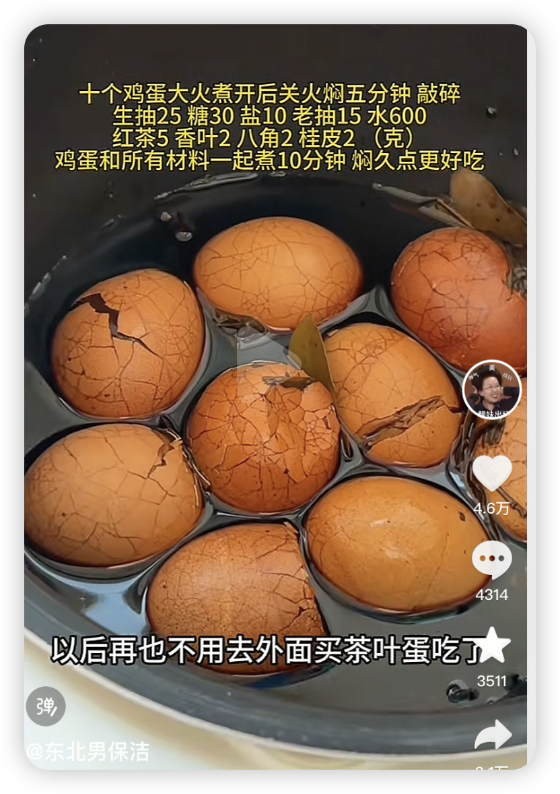

### 洋葱肥牛饭

洋葱肥牛饭是一道非常经典快捷的家常美味，肥牛嫩滑，洋葱香甜，酱汁浓郁，特别适合下班后快速搞定一餐，整理一份兼顾效率和风味的详细做法。

#### 🥩 食材准备（2人份） 

#### 🍳 详细制作步骤 

1. **处理食材**

    - **肥牛焯水**​：锅中烧水，水开后放入肥牛片，用筷子拨散，​**待肥牛变色、血沫浮起后立刻捞出**。这一步可以有效去除腥味和多余血水，是汤汁清澈、肥牛不腥的关键。不要烫太久，以免肉质变老。

    - **准备配菜**​：洋葱切成丝。胡萝卜切片，西兰花掰成小朵，如果使用，可以将它们放入加少许盐和油的开水中焯烫约2\-3分钟后捞出备用，这样能保持蔬菜鲜亮的颜色。

2. **调配酱汁（提前备好，避免手忙脚乱）​**取一个小碗，按照 **生抽：蚝油：料酒：白糖 = 2：1：1：1** 的比例，将生抽、蚝油、料酒和白糖混合均匀，可以再加入小半碗清水搅匀备用。提前调好酱汁能保证味道均匀，且不会在炒制时因逐个添加调料而影响火候。

3. **翻炒入味**

    - 炒锅烧热后倒油，油温五成热时，先放入姜片和洋葱丝，​**中小火煸炒至洋葱变软、呈现透明的状态并散发出香甜味**。

    - 放入焯好水的肥牛片，快速翻炒均匀。

    - 倒入事先调好的酱汁，翻炒几下让食材均匀裹上酱汁。如果喜欢汤汁浓稠些可以淋入少许水淀粉勾芡，待汤汁变浓即可关火。

4. **组合装盘**将热气腾腾的白米饭盛入碗中，把炒好的洋葱肥牛连同汤汁一起浇在米饭上，旁边码上焯好的西兰花和胡萝卜片做点缀。一碗色香味俱全的洋葱肥牛饭就完成了！

#### 💡 成功秘诀与小贴士 

- **肥牛嫩滑的秘诀**​：​**焯烫时间一定要短**​，变色后立即捞出，这样可以最大程度保留肥牛的嫩滑口感。

- **洋葱的风味**​：洋葱**一定要炒透**​，炒到完全柔软透明并散发出甜味，这样其甜味才能充分释放并与酱汁融合。

- **酱汁的灵活调整**​：食谱提供的酱汁比例是基础，可以根据口味调整。例如，喜甜可稍多加糖，喜咸可加点盐或生抽。加入一茶匙的老抽可以让颜色更红亮。

- **健康小建议**​：根据营养建议，每人每餐的畜禽肉摄入量建议在50\-75克左右，因此制作时可以合理控制肥牛的用量，并搭配足量的蔬菜，实现营养均衡。

### 小鸡炖蘑菇

#### 🍄 认清这道菜 

这道菜的正宗名称是**小鸡炖蘑菇**​，是东北传统名菜，属于东北八大炖之一。它主要选用家养的“小笨鸡”或“土鸡”和野生的**榛蘑**作为核心食材。成菜特点是汤鲜浓厚，鸡肉酥烂。

#### 🧾 备齐食材 

以下是制作此菜所需的主要食材：

#### 🍳 烹饪步骤 

以下是这道菜的核心步骤概览，可以参照操作：

1. **食材预处理（关键步骤）​**

    - **处理榛蘑**​：干榛蘑用温水泡发（约30\-40分钟），泡发后要**仔细清洗**​，去除根部泥沙，否则影响口感。**泡发榛蘑的原汁水过滤杂质后保留备用**​，这是汤汁鲜美的关键。

    - **处理鸡肉**​：鸡洗净剁成块。鸡块可先用清水浸泡一段时间去血水。也可将鸡块**冷水下锅**焯烫2\-3分钟，捞出用温水冲净浮沫。

    - **处理粉条**​：粉条用温水泡软备用。

2. **煸炒鸡肉**炒锅烧热倒油，放入鸡块煸炒，​**炒至鸡肉变色、水分收干、表面微黄**。然后放入葱段、姜片、八角、干辣椒等香料炒出香味。

3. **炖煮入味**烹入料酒，加生抽、少许老抽（为上色）翻炒均匀。倒入**开水**​（水量需没过鸡块）和**过滤后的泡蘑菇原汤**。大火烧开后转小火，盖盖慢炖约30分钟至1小时（具体时间看锅具和鸡的老嫩程度），直至鸡肉熟软。

4. **加入榛蘑与粉条**鸡肉炖烂后，加入洗净的榛蘑，继续炖15\-30分钟。随后加入泡软的粉条，再炖5\-10分钟至粉条熟透。最后根据口味加盐调味，并可大火稍收汤汁（注意保留一些汤汁）。

#### 💡 成功秘诀 

#### 💎 补充一点 

据说在乾隆、光绪、宣统，还有慈禧的御膳单子上都有“口蘑肥鸡”这道菜，它就是小鸡炖蘑菇的前身。在东北，这道菜是年三十儿的主菜，也是招待贵客的招牌菜，甚至有“姑爷进门，小鸡断魂”的俗语。

### 豆豉蒸排骨/干蒸排骨（先蒸后烤）

豆豉蒸排骨是一道非常经典的粤菜，排骨软嫩脱骨，豉香浓郁，而且用蒸的方式制作，健康不油腻。下面整理一份详尽的菜谱和关键技巧。

#### 🥣 准备食材 

**主料：​**

- **猪排骨**​：建议选用**猪肋排**或**前排**​，肉质更嫩，软骨多，口感好。用量大约在400克（2\-3人份）。

- **豆豉**​：推荐使用**阳江豆豉**或永川豆豉，风味更醇厚。大约需要15\-20克。

**辅料与调料：​**

- **常见辅料**​：大蒜（4\-5瓣）、生姜（10\-15克）、小葱（少许用于点缀）。

- **基础腌料/调味**​：生抽（1\.5汤匙）、蚝油（1汤匙）、料酒（1汤匙）、白糖（约1茶匙）、白胡椒粉（少许）、淀粉（1\-1\.5汤匙，用于锁住肉汁）、食用油（1汤匙）。

#### 🍳 制作步骤 

1. **排骨预处理（去腥保嫩的关键）​**

    - **浸泡出血水**​：将剁成2\-3厘米小块的排骨用**冷水浸泡**至少30分钟，中途可以换水1\-2次，直到水色变得比较清亮，这样可以有效去除血水和腥味。

    - **彻底吸干水分**​：浸泡后的排骨捞出，​**务必用厨房纸彻底吸干表面水分**。这一步非常重要，能防止蒸制时排骨出水过多，影响口感和味道。

2. **处理豆豉（激发香气）​**

    - 将豆豉稍微冲洗一下（如果觉得过咸），然后用刀**切碎**​，这样能更好地释放出豆豉的香味。

    - 起锅加少量油，用小火将豆豉碎和蒜末、姜末一起煸炒出香味，约1分钟左右，炒过的豆豉风味会更浓郁。

3. **腌制排骨（入味上浆）​**

    - 在一个大碗中，将吸干水分的排骨与炒香的豆豉料混合。

    - 依次加入生抽、蚝油、料酒、白糖、白胡椒粉等调料（食用油和淀粉先不放），用手**抓匀**​，让每一块排骨都均匀裹上酱汁。

    - 然后加入淀粉再次抓匀，让淀粉在排骨表面形成一层薄薄的保护层，以锁住肉汁。

    - 最后淋上食用油拌匀，可以防止蒸制时粘连，并使肉质更油润。

    - 将腌制好的排骨**覆盖保鲜膜，放入冰箱冷藏腌制至少1小时**​，如果时间充裕，腌制过夜会更入味。

4. **蒸制（掌控火候）​**

    - 准备一个**浅口、稍大的盘子**​，将腌制好的排骨**平铺**在盘中，尽量不要堆叠，以确保受热均匀。

    - 蒸锅里的水要**提前烧开**​，等水沸腾产生足量蒸汽后，再将排骨放入，​**盖上锅盖，保持大火足汽蒸18\-25分钟**​（具体时间需根据排骨块的大小和自家炉火力度微调，以排骨能用筷子轻易戳透为准）。

    - 蒸好后可以关火再**焖2\-3分钟**后出锅。
    

简单方法

100度蒸五分钟➕200 度烤 25 分钟

5. **出锅点缀**

    - 取出蒸好的排骨，可以撒上一些新鲜的葱花或香菜点缀即可。

#### 💡 成功关键与变化 

### 清炖牛肋条

以下是综合多来源精华（含专业菜谱平台、百科及家常做法）整理的**清炖牛肋条核心技法**与**万能蘸料调配方案**​，兼顾软烂入味与蘸料层次感，助轻松复刻这道温润滋补的硬菜！

---

#### 🥩 **清炖牛肋条——软烂不柴的黄金法则** 

**​✅ 食材清单（3\-4人份）​** 

#### **​🔥 关键步骤详解** 

1. **预处理——去腥保嫩**

    - **泡血水**​：牛肋条冷水浸泡1小时，中途换水2次，去除血污。

    - **冷水焯煮**​：牛肉\+冷水（没过食材）\+姜葱料酒，中火煮沸撇净浮沫，捞出温水冲洗（忌冷水激肉！）。

2. **炖煮——软烂入味核心**

    - **水量与温度**​：焯水后的牛肉入锅（砂锅/高压锅），​**加热水**没过食材2cm（冷水导致肉质紧缩）。

    - **辅料搭配**​：\+洋葱块\+白萝卜块\+香料包（可选），​**高压锅压20\-25分钟**​（普通锅小火炖1\.5\-2小时）。

    - **调味时机**​：炖好后加盐\+白胡椒粉调味，焖5分钟入味（过早加盐蛋白质凝固，肉质变硬）。

3. **升级技巧**

    - **加苹果增鲜**​：炖煮时加半个苹果，果酸软化纤维，汤汁更清甜。

    - **二次利用**​：剩余牛肉汤煮面/炖菜，撒香菜\+白胡椒风味更佳。

---

#### 🧂 **无敌蘸料——4款经典配方适配不同场景** 

清炖牛肉的精华一半在肉，一半在蘸料！以下配方可根据口味自由组合：

**1️⃣ 中式经典蒜香版（百搭首选）​** 

> **做法**​：蒜末\+小米辣\+葱花淋热油激香，再加其余调料拌匀。
> 
> 

**2️⃣ 万能麻酱版（浓郁挂口）​** 

> **用法**​：适配火锅、拌面，加蒜末更解腻。
> 
> 

**3️⃣ 清爽减脂版（低卡高蛋白）​** 

> **特点**​：免油免糖，突出牛肉本味。
> 
> 

**4️⃣ 麻辣升级版（嗜辣必备）​** 

在**中式经典版**基础上：

- 加辣椒粉1勺\+花椒粉0\.5勺（热油浇透）

- 替换香醋为保宁醋（酸味更烈）

---

#### 💡 **终极贴士——私房建议** 

1. **牛肉选购**​：选带雪花纹的谷饲牛肋条，筋膜与脂肪均衡，炖后软糯不柴。

2. **防柴秘诀**​：

    - 切大块保留内部汁水（小块易缩硬）。

    - 炖煮全程保持微沸状态（大火冲散肉质纤维）。

3. **蘸料心机**​：

    - 蒜末用压蒜器处理，比刀切香气更浓。

    - 蘸料现调现吃，久置风味流失。

4. **禁忌提醒**​：

    - 避免与寒性食物（如绿豆、梨）同食，易致腹胀。

> 🌟 **温馨提示**​：清炖牛肋条的精髓在于**​“肉嫩汤鲜，蘸料点睛”​**​——软烂的牛肉裹满咸鲜微辣的蘸汁，一口下去脂香迸发！搭配白萝卜的清甜汤汁，秋冬暖身绝配\~
> 
> 

### 土豆炒脆哨

#### 🌟 什么是脆哨？ 

脆哨是贵州省贵阳市的一道特色风味小吃，在贵州美食中扮演着重要角色，常被称为肠旺面、糯米饭等小吃的“灵魂”。

- **名称由来**​：它原名应为“脆臊”，即酥脆的肉臊子。因早年摊贩文化水平有限，在书写时误将发音相近的“臊”写成了“哨”，久而久之便被普遍接受，成了现在的“脆哨”。

- **并非普通油渣**​：虽然看似与猪油渣相似，但脆哨的制作更为讲究。它通常选用**槽头肉、五花肉或精瘦肉**​，经过切丁、翻炒出油后，会加入**甜酒酿、白酒、生抽、陈醋**等调料精心炮制，使得成品集**香、咸、脆、爽**于一身，肥肉的油脂大半已在炼制过程中散去，因此吃起来肥而不腻。

- **风味核心**​：其风味特点是**鲜、香、脆**。

- **品种多样**​：根据选用肉料的不同，脆哨还有“软哨”、“精哨”等衍生品种。软哨多用五花肉制成，口感富有嚼劲、肉香四溢。

#### 🥔 土豆炒脆哨：一道家常黔味快手菜 

土豆炒脆哨是一道典型的黔菜风味家常快手菜，完美结合了土豆的绵软和脆哨的酥香。这道菜烹饪效率高，很适合日常餐桌。下面这个表格整理了烹饪这道菜所需的核心食材，方便备料。

#### 🍳 烹饪步骤建议 

1. **准备工作**​：土豆去皮后切成1厘米左右见方的小丁，用清水浸泡片刻以去除表面淀粉。将葱、姜、蒜及辣椒等辅料按需切好备用。

2. **炸制土豆丁**​：锅中放油（油量约能没过土豆丁），烧热后放入土豆丁，炸至表面金黄酥脆后捞出沥油。

3. **爆香调料**​：锅内留底油，先下入姜片、蒜片、干辣椒和花椒等调料，用小火煸炒出香味。

4. **混合翻炒**​：放入炸好的土豆丁和脆哨，转大火快速翻炒均匀。

5. **调味出锅**​：依次加入适量的盐、少许生抽、白糖、味精（以及豆腐乳或油辣椒）调味。出锅前撒上葱段或蒜苗段，再烹入少许香醋以增香解腻，翻炒均匀即可装盘。

#### 💡 美味小贴士 

- **脆哨的选择**​：市面上有不同肥瘦比例的脆哨，例如五花脆哨香气更足，精瘦肉脆哨口感更酥。可以根据自己的喜好选择。

- **火候是关键**​：炸土豆丁时油温要够，才能形成外酥里嫩的口感。最后混合翻炒时动作要快，避免脆哨因长时间加热而回软，失去脆爽口感。

- **创意搭配**​：完全可以发挥创意，加入蒜苔段、洋葱等自己喜欢的蔬菜，让菜品更丰富。

### 蒜香炸鸡翅/蒜香炸鸡脆骨/蒜香炸排骨

鸡翅对半剪开清洗干净蒜末不用打太碎，再来点葱花生抽，料酒，蚝油，黑胡，少来点盐，腌制最少半个小时面粉2淀粉1的比例加水，调成酸奶状，再前点油。糊静置10分钟，再炸\~

\-排骨切小点块/鸡翅对半剪开清洗干净 \-蒜末不用打太碎 \-来点生抽，蚝油，黑胡椒，少来点盐 \-腌制最少半个小时 \- 面粉 2淀粉 1的比例加水，调成酸奶状，再放点油，糊静置10分钟，和一起再炸\~ \-火大点下锅炸，定型以后改中小火\~\-排骨切小点块/鸡翅对半剪开清洗干净 \-蒜末不用打太碎 \-来点生抽，蚝油，黑胡椒，少来点盐 \-腌制最少半个小时 \- 面粉 2淀粉 1的比例加水，调成酸奶状，再放点油，糊静置10分钟，和一起再炸\~ \-火大点下锅炸，定型以后改中小火\~

---

#### 🧄 食材准备 

以下是制作约10个鸡翅中所需的食材清单，可以根据需要进行调整：

#### 🍳 制作步骤 

可以将制作过程理解为三个关键阶段：​**腌制入味 → 裹粉制鳞 → 炸制酥脆**。

1. **第一步：处理与腌制鸡翅**

    - **清洗改刀**​：将鸡翅清洗干净，用厨房纸充分吸干表面水分。在鸡翅两面划上几刀，这样腌制时更容易入味。

    - **腌制**​：将鸡翅放入一个大碗中，加入所有的腌料（蒜末、料酒、生抽、蚝油、盐、糖、黑胡椒粉、姜片、葱段）。用手充分抓揉按摩鸡翅2\-3分钟，让调味料均匀覆盖。

    - **静置**​：盖上保鲜膜，放入冰箱**冷藏腌制至少2小时**。如果时间充裕，腌制过夜风味更佳。

2. **第二步：调制裹粉与挂糊**

    - 将面粉和淀粉以1:1的比例混合均匀。如果喜欢特别酥脆的鳞片状外皮，可以尝试二次裹粉法。

    - **方法一（简单直接）​**​：将腌好的鸡翅直接放入混合好的干粉中，均匀裹上一层，然后抖掉多余粉末。

    - **方法二（鳞片更显著）​**​：将裹好干粉的鸡翅放入清水中迅速浸泡一下（约3秒），捞出后再次放入干粉中，用力按压裹粉，从而形成明显的鳞片。

3. **第三步：炸制与关键复炸**

    - **初炸**​：锅中倒入足量的油，油温烧至六成热（插入筷子，周围有密集的小气泡冒出）。逐个下入鸡翅，保持**中小火**炸约6\-8分钟，期间翻动使其受热均匀，炸至表面微黄后捞出沥油。

    - **复炸（酥脆的关键）​**​：开大火将油温升至七、八成热，将鸡翅全部倒回锅中，​**复炸约30秒至1分钟**​，直到鸡翅变成诱人的金黄色。这一步能逼出鸡翅中多余的油脂，让外皮极其酥脆，且内部不油腻。

#### 💡 美味小贴士 

### 排骨泡菜锅

排骨泡菜锅是一道滋味浓郁、暖心暖胃的佳肴，酸辣的泡菜能有效化解排骨的油腻感，让组合格外融洽。整合了一份详尽的做法指南，并附上一些让风味更出众的私房技巧。

#### 🍲 了解这道菜的风味核心 

这道菜的美味主要源于**发酵泡菜的酸爽**与**排骨的丰腴**的完美结合。泡菜在炖煮后，其酸味会融入汤汁，并渗入排骨和配菜中，非常开胃。常见的做法会使用**韩式辣酱（Gochujang）​** 来增添醇厚的甜辣底味，而一些创新做法也会加入**啤酒**代替部分水，利用麦芽香气提升风味层次，并使肉质更嫩。

#### 🧄 准备食材 

这是制作一锅分量十足的排骨泡菜锅所需的食材清单，可以根据喜好调整配菜。

#### 🍳 详细制作步骤 

可以将制作过程理解为四个关键阶段：​**预处理排骨 → 炒香底料 → 炖煮入味 → 添加配菜**。

1. **第一步：排骨的预处理（去腥与定型）​**

    - **浸泡或焯水**​：将排骨洗净，有两种主流方法去血水。一是用冷水浸泡30分钟以上；二是**冷水下锅**​，加入料酒和姜片，煮沸后撇去浮沫，再用温水冲洗干净。后者更适合追求汤色清澈的做法。

    - **​（可选）煎制**​：将焯好水的排骨用厨房纸擦干，下油锅煎至表面微黄。这一步能锁住肉汁，并增加锅气和焦香风味。

2. **第二步：炒制风味底料（激发香气）​**

    - 锅中放油，先下入洋葱丝和蒜末炒香。

    - 然后加入切好的泡菜，持续翻炒，直到泡菜的酸香味充分释放出来。这是激发整道菜风味的关键一步。

3. **第三步：混合与炖煮（让味道融合）​**

    - 将处理好的排骨放入锅中，与炒香的泡菜拌匀。

    - 加入**足量的淘米水或啤酒**​（也可用清水），水量需没过所有食材。

    - 加入2\-3大勺韩式辣酱，以及少量生抽和白糖调味。大火煮开后，转为**小火**​，盖上锅盖慢炖**40\-50分钟**​，直至排骨软烂入味。使用砂锅效果更佳。

4. **第四步：分批加入配菜（保证最佳口感）​**

    - 像土豆、胡萝卜这类需要较长时间煮的根茎类蔬菜，可以在炖了20分钟左右时下锅。

    - 而像豆腐、年糕、金针菇等易熟或易碎的配菜，应在起锅前**10\-15分钟**再放入。

#### 💡 美味升级小贴士 

为了排骨泡菜锅更出色，这里有一些关键要点总结：

### 炖鱼

#### 🐟 挑选与处理：美味的基石 

第一步是选择一条合适的鱼并妥善处理，这是成功的一半。

- **鱼的种类**​：常见的**草鱼、鲤鱼、鲫鱼**都非常适合炖煮。如果偏爱喝汤，​**鲫鱼**是上佳之选，其炖出的汤色乳白，味道异常鲜美。

- **关键处理步骤**​：彻底清理是去腥的关键。务必刮净鱼鳞、去除鱼鳃和内脏，特别要刮掉腹腔内的**黑色黏膜**​，这是腥味的主要来源之一。此外，可以在鱼鳃下方和鱼尾处各切一刀，轻轻拍打鱼身，抽掉**鱼腥线**​，能极大减少腥味。处理后，在鱼身两面划上几刀，便于入味。

#### 🧄 准备食材 

这里是一份家常炖鱼的基础食材清单，可以根据喜好增减：

#### 🍳 炖制步骤详解 

接下来是核心的烹饪过程，可以分为三个关键阶段：

1. **腌制入味**​：将处理好的鱼用少量**料酒、葱段、姜片和少许盐**涂抹全身，腌制15\-20分钟。这一步能初步去腥并奠定底味。

2. **煎制定型**​：锅中放适量油烧热，将腌好的鱼用厨房纸擦干水分后放入，用**中小火**将两面煎至金黄色。**煎鱼不仅可以去腥，还能锁住鱼肉水分，使炖煮时不易散烂，且能令汤色更奶白**。

3. **炖煮成菜**​：

    - **爆香**​：鱼煎好后盛出，用锅内底油爆香葱、姜、蒜及香料（如八角、花椒等）。

    - **炖煮**​：将煎好的鱼放回锅中，立即沿着锅边烹入**料酒和陈醋**​，这是去腥的关键一步。然后加入**足量开水**​（水量需没过鱼身），并放入**生抽、少许老抽（调色）、白糖**调味。

    - **火候**​：大火烧开后，转为**中小火**​，盖上锅盖慢炖15\-25分钟（根据鱼的大小调整）。**保持汤面微沸即可，切忌一直用大火翻滚，否则鱼肉容易变柴**。

    - **加配菜与收汁**​：炖约15分钟后，加入豆腐、粉条等耐煮的配菜。继续炖至鱼肉成熟、配菜入味，最后根据汤汁情况开大火稍收汁，并用盐调整咸淡即可出锅。

#### 💡 美味升级小贴士 

为了炖鱼更出色，这里有一些关键要点总结：

### 烤鱼

#### 🐟 食材准备与处理 

**通用基础准备**无论选择哪种风味，前期的准备工作是相通的。

- **鱼的选择**​：​**草鱼、黑鱼、清江鱼/钳鱼**都是不错的选择。草鱼肉厚，黑鱼肉紧实少刺，清江鱼/钳鱼肉质细腻且刺少，可以按喜好选择。重量在2\-3斤为宜。

- **基本处理**​：请鱼贩将鱼从背部剖开，腹部相连，做成“蝴蝶开片”状。回家后务必刮净鱼鳞、清理干净鱼腹内的黑膜和贴骨血，这是去腥的关键。

- **基本腌制**​：在鱼身两面划花刀，用**葱、姜、料酒、少量盐**涂抹均匀，腌制至少20分钟，初步去腥并入底味。

**风味专用食材清单**为了让采购时一目了然，这里是两种风味的核心食材需求。

#### 🍳 烹饪步骤详解 

**第一阶段：鱼的烤制（通用步骤）​**

1. **擦干与定型**​：腌制好的鱼用厨房纸巾**彻底擦干表面水分**​，这能有效防粘并促进形成酥脆鱼皮。

2. **烤制/煎制**​：

    - **烤箱法（推荐）​**​：在鱼皮表面刷一层油，放入预热至**200\-220℃​**的烤箱中层，烤**20\-30分钟**​，至鱼皮金黄、鱼肉成熟。

    - **平底锅法**​：锅中放油，将鱼鱼皮朝下放入，​**中小火煎至两面金黄酥脆**。

**第二阶段：风味汤料制作与融合**这是两种风味分道扬镳的关键步骤。

- **青花椒风味**​：

    1. **炒制底料**​：锅中放油（可加少许猪油增香），先下姜、蒜、洋葱末爆香。加入豆瓣酱（可选）和部分青花椒炒出香味。

    2. **煮制汤底**​：加入适量开水或高汤，用生抽、糖、盐等调味后煮沸。

    3. **激香**​：将炒好的底料和配菜铺在烤鱼上，在鱼身撒上大量的**新鲜青花椒、青红椒圈**。锅中烧热适量油（约150\-200克），淋在青花椒和辣椒上，瞬间激发出浓郁的香气。

- **荔枝香辣风味**​：

    1. **制作果泥**​：将部分荔枝（约8颗）去核后搅打成泥状，这是风味融合的关键。

    2. **炒制酱料**​：锅中放油，爆香姜蒜末，加入豆瓣酱和火锅底料炒出红油。加入**荔枝果泥**翻炒均匀。

    3. **调和汤汁**​：加入适量水或高汤，用少许糖和盐调整口味。可以将少量荔枝罐头糖水加入汤中增加果香。

    4. **融合**​：将汤汁浇在烤鱼和配菜上，让小火慢炖几分钟，使鱼肉充分吸收汤汁的甜辣味。出锅前，在表面摆上**剩余的去核完整荔枝肉**和香菜点缀。

#### 💡 成功关键要点 

掌握以下几个核心技巧，能让烤鱼大获成功。

### 烧烤牛肉\-王厚元同款

这款王厚元烧烤牛肉做法，精髓就在于 **​“先煸后烤”​** 的复合烹饪手法以及最后那画龙点睛的**海天捞汁、白醋和糖**调成的独特料汁。这种做法能有效锁住牛肉汁水，并形成非常丰富的味觉层次。

#### 🍳详细制作步骤 

**1\. 选材与预处理** 

- **牛肉部位**​：选择**牛里脊（最嫩）、牛上脑或牛肋条**​（肥瘦相间，烤出来更香）为佳。

- **关键切割**​：找到牛肉的纹理，​**逆纹（顶刀）切成厚薄均匀的片**​（约3\-4毫米厚）。这是保证口感不柴的首要关键。将牛肉稍冷冻至定型但未完全冻硬，会更容易切。

**2\. 基础腌制** 

1. 牛肉片中加入**葱段、姜片、生抽、料酒、少许白糖和胡椒粉**。

2. 用手充分抓拌均匀，直到牛肉感觉发粘。可以加入**半个蛋清**继续抓匀，使口感更嫩滑。

3. 最后加入一勺食用油抓匀，锁住水分，腌制**15\-20分钟**即可。

**3\. 煸炒至八分熟** 

1. 炒锅烧热，倒入比平时炒菜多一点的油，油温升至七成热（油面有轻微波纹）。

2. 下入腌制好的牛肉片，用筷子快速滑散，使肉片均匀受热。

3. 待牛肉片**全部变色、松散开来，但内部还未完全熟透**​（即八分熟状态）时，立刻用漏勺捞出，沥干多余的油和汁水。**此步骤动作一定要快，避免牛肉变老**。

**4\. 烤制与融合风味** 

根据家里的设备选择以下任一方法完成“烤”的步骤：

- **烤箱/空气炸锅法**​：将煸好的牛肉平铺在烤盘上，放入预热至**200°C**的烤箱或空气炸锅中，烤**5\-8分钟**。目的是烘干表面水汽，并激发烧烤香气。

- **干锅煸炒法（无烤箱版）​**​：将煸过牛肉的锅擦干净，无需放油，直接倒入煸至八分熟的牛肉，用**中火**煸炒，炒掉牛肉多余的水分，直到牛肉边缘出现焦边即可。这能很好地模拟烧烤效果。

**5\. 调制特色捞汁并拌匀** 

1. 准备一个小碗，核心步骤来了：按**海天捞汁:白醋:白糖 ≈ 2:1:1**的基准比例调配。例如，2汤匙捞汁，1汤匙白醋，1茶匙白糖（糖的量可根据喜好调整）。

2. 将三者混合均匀，直到白糖基本融化。

3. 将调好的料汁均匀地淋在烤好的牛肉上，快速翻拌，让每一片牛肉都裹上料汁即可出锅。

#### 💡 成功小贴士 

- **风味升级**​：在腌制时，可以尝试加入少量**啤酒**代替部分料酒，啤酒能更好地嫩肉提鲜。在最后的料汁里，可以点几滴**花椒油**或**香油**​，增加复合香气。

- **火候是灵魂**​：​**煸炒和烤制两步的火候和时间控制是成败关键**。煸炒是为了锁水，切忌过老；烤制是为了干香，时间过长会导致牛肉变硬。

- **烧烤料选择**​：市售的烧烤料通常已包含孜然、辣椒、芝麻等，风味很全面。也可以根据喜好，额外添加一些孜然粉或辣椒粉来强化风味。

### 葱烧蹄筋

葱烧蹄筋是一道非常见功夫的经典菜，要做得好吃，关键在于让蹄筋软糯入味，同时将葱的香气完美融入其中。整合了一套详细的做法，并附上一些让风味更地道的核心技巧。下面这个表格整理了制作葱烧蹄筋所需的主要食材，方便备料。

#### 🍳 详细制作步骤 

1. **食材预处理**

    - **蹄筋处理**​：将购买回来的熟蹄筋检查一下，清洗干净。切成约5厘米长的均匀小段 。然后进行焯水，锅中水烧开，放入蹄筋汆烫几分钟后捞出，这样可以去除部分异味 。

    - **制作葱油（风味灵魂）​**​：这是让菜肴葱香浓郁的关键一步。锅中多放一些油，放入切好的大葱段（葱白）、葱青和姜片，用**小火慢慢浸炸**。待葱段炸至金黄色（注意不要炸糊，否则会发苦）时，先将葱段捞出备用，锅中剩下的就是香气扑鼻的葱油 。

2. **烧制蹄筋**

    - **炒糖色（可选，可让色泽更红亮）​**​：在锅中留部分葱油，开小火，放入一小勺白糖，慢慢炒化至呈现枣红色 。

    - **煸炒入味**​：下入焯好水的蹄筋，快速翻炒让其均匀裹上糖色（或葱油）。接着烹入料酒，加入生抽、少许老抽（主要用于调色），翻炒均匀 。

    - **焖烧**​：向锅中加入足量的高汤或热水，水量要稍微没过蹄筋 。将之前炸好的金黄葱段放回锅中。大火烧开后，转为**小火，盖上锅盖慢煨8\-10分钟**​，让蹄筋充分吸收汤汁和葱的香味 。

3. **收汁勾芡**

    - 待蹄筋烧至软烂入味后，开大火收汁。根据汤汁的多少，淋入适量的水淀粉勾芡，使汤汁变得浓稠并包裹在蹄筋上 。

    - 出锅前，再淋入一勺事先做好的葱油，快速颠勺翻炒均匀，这个步骤能让成菜色泽更亮，葱香味达到顶峰 。

#### 💡 成功小贴士 

- **蹄筋的选择与处理**​：家庭制作强烈建议直接购买**已经发制好的半熟或全熟蹄筋**​，可以省去最耗时和需要经验的泡发环节。如果使用生蹄筋，需要经过长时间的煮发至软烂后才能进行烧制 。

- **葱是绝对的主角**​：这道菜葱的用量不能省，而且要分两次使用。第一次炸葱油，第二次放入整葱段同烧，这样才能实现复合而浓郁的葱香味 。

- **火候是关键**​：炸葱油和烧制蹄筋时，​**一定要用小火**。小火才能慢慢将葱的香味逼到油里，也能让蹄筋在慢煨中变得软糯而不散烂 。

- **最后的“明油”​**​：出锅前淋入的葱油被称为“明油”或“尾油”，是让菜品香气和卖相提升一个档次的关键，不要省略 。

- **创意搭配**​：可以根据喜好加入冬笋片、油菜心等配菜，丰富口感和营养 。

### 红烧蹄筋

#### 🍳 食材准备清单 

**厨具建议**：**高压锅**是制作蹄筋的利器，能大大缩短炖煮时间。若无，用密封性好的砂锅或铸铁锅也可，但耗时较长。

#### 🔪 详细制作步骤 

1. **蹄筋预处理**：将牛蹄筋切成适口大小的块或段。然后进行焯水：**冷水下锅**，加入料酒和几片姜，大火煮开后撇去浮沫，再煮约2\-3分钟捞出，用温水冲洗干净。这一步能有效去除腥味。

2. **炒制酱料（风味关键）**：锅中放适量油，小火烧热后，先下入葱段、姜片和所有香料（八角、香叶等）慢慢煸炒出香味。接着放入豆瓣酱和黄豆酱，继续用小火炒出红油和酱香味。注意火候，不要把酱炒糊。

3. **混合炖煮**：将焯好水的蹄筋倒入锅中，转中火快速翻炒，使其均匀裹上酱料。烹入料酒，加入生抽、老抽和冰糖。然后加入足量的**开水**，水量要一次加足，最好能没过蹄筋。

4. **焖煮至软烂**：

    - **高压锅法**：将锅内所有食材转入高压锅，上汽后压 **25\-40分钟**。时间到后自然泄压，蹄筋能达到软糯弹牙的最佳口感。

    - **普通锅法**：在炒锅中烧开后转为小火，盖上锅盖慢炖，通常需要 **1\.5 \- 2小时** 或更久，期间注意观察水量避免烧干，直至蹄筋软烂。

5. **大火收汁**：蹄筋煮软后，如果锅内汤汁还较多，可以开大火收汁。此时根据咸淡决定是否加盐（因酱料已有咸味）。待汤汁变得浓稠并紧紧包裹在蹄筋上时，即可关火出锅。装盘后可以点缀些香菜或青蒜叶增色提香。

#### 💡 核心技巧与小贴士 

### 香葱煎虾

香葱煎虾这道菜确实能轻松为家常餐桌增味。它巧妙地融合了虾的鲜美与香葱的浓郁香气，通过煎制带来诱人的口感。只要掌握几个关键点，在家就能做出不输餐厅水准的香葱煎虾。下面这个表格整理了制作香葱煎虾所需的主要食材，方便备菜。

#### 🍳 制作步骤 

1. **处理虾**

    - **清洗**​：将虾用清水冲洗干净 。

    - **修剪开背**​：剪去虾枪、虾须和虾脚，这样成菜更美观，也避免虾须煎糊 。

    - **去虾线**​：这是关键一步。用牙签从虾背第二节或第三节处插入，轻轻挑出黑色的虾线。如果追求虾肉极致的紧实口感，有些做法认为非常新鲜的虾可以不去虾线，但一般家庭制作建议去除，以免影响口感 。

    - **腌制**​：用厨房纸巾将虾彻底擦干水分，这是虾能煎出酥脆口感的前提 。然后可以用少量料酒和姜片腌制10分钟左右以去腥 。

2. **准备配料**

    - 将香葱切成葱粒或葱段 。生姜、大蒜切片或末备用 。

3. **煎制**

    - 锅烧热后倒入适量油，可以比平时炒菜稍多些 。

    - 油温五成热时，将虾依次放入锅中，​**保持中小火慢煎** 。**不要急于翻动**​，煎约1\-2分钟，待虾壳接触锅底的一面变红、出现轻微焦黄后，再翻面煎另一面 。

    - 煎至虾身通红，虾壳变得有些酥脆，甚至能闻到虾油煸出的焦香即可盛出备用。

4. **炒香与融合**

    - 利用锅底余油，放入葱段、姜片、蒜末等，用小火煸炒出浓郁的香味 。

    - 将之前煎好的虾重新倒入锅中，与葱香快速翻炒均匀。

    - 沿锅边淋入料酒炝锅，再加入蒸鱼豉油（或生抽）、少许白糖提鲜，快速翻炒使酱汁均匀包裹在虾身上 。如果喜欢，可以加少量开水，盖上锅盖焖约1分钟，让虾肉更入味 。

5. **出锅**

    - 出锅前，可以再撒上一些新鲜的香葱粒 。装盘后，将锅中浓郁的葱油汁淋在虾上，风味更佳。

#### 💡 成功小贴士 

- **虾的处理是关键**​：虾**一定要充分擦干表面水分**​，这样下锅煎的时候才不会油花四溅，也更容易煎出金黄酥脆的外皮 。

- **火候是灵魂**​：煎虾时切记**不要用大火**​，否则外面容易焦糊而里面还没熟透。用**中小火慢煎**​，才能将虾壳煎得酥香，同时锁住虾肉的水分，使其鲜嫩弹牙 。

- **葱油的妙用**​：有做法会单独用冷油小火慢炸葱段，制成葱油后再用来煎虾，这样葱香味会更彻底地融入油和虾中 。

- **虾壳的去留**​：如果想让虾更入味，或者给小朋友吃方便，可以去壳留虾仁。但保留虾壳煎制，虾壳本身的香气和酥脆口感是这道菜的特色之一。

做好的香葱煎虾，葱香扑鼻，虾壳酥脆，虾肉鲜甜弹嫩。

### 甘蓝炒螺片

甘蓝炒螺片是一道讲究火候和食材处理的经典海鲜小炒。要做好它，关键在于让螺片保持脆嫩，同时让甘蓝入味又不过于软烂。梳理了两种主流的家庭做法，一种是更稳妥的“熟螺肉”版本，另一种是追求极致口感的“生螺片”版本。下面这个表格快速对比了两种方法的区别，方便选择。

#### 🍳 方法一：省心熟螺版 

这种方法使用已经煮熟的海螺肉，非常适合家庭快速操作，能有效防止螺片烹饪过老。

1. **准备食材**​：需要准备**甘蓝约500克**​，​**熟海螺肉150克**​，以及**葱、姜、蒜、青红尖椒**等辅料各适量。

2. **处理食材**​：将熟海螺肉切成薄片备用。甘蓝用手撕成片，去掉粗硬的老梗，这样不仅容易成熟，口感也更好。葱姜蒜切片，青红尖椒切块。

3. **爆香与煸炒**​：锅烧热后放适量油，下入葱姜蒜片和干辣椒段爆香。然后放入甘蓝片，加入盐，大火煸炒至甘蓝片发软、略微出水。

4. **混合翻炒**​：放入海螺片和青红尖椒片，快速翻炒均匀。可以盖上锅盖焖一小会儿（约1分钟），让食材的滋味相互融合。

5. **出锅调味**​：开盖后，沿着锅边淋入少许米醋增香解腻，再加入少量鸡粉（可选）提鲜，翻炒均匀后淋入少许香油即可出锅。

#### 🍳 方法二：鲜脆生炒版 

这种方法使用新鲜生海螺，追求螺片极致的脆嫩口感，但对火候和速度要求更高。

1. **准备食材**​：需要**新鲜大海螺**​（去壳取肉），​**甘蓝**​，以及各种调料。

2. **处理螺片**​：这是最关键的一步。将生海螺肉切成薄片。锅内烧水，水沸腾后，放入螺片**焯烫3秒左右**迅速捞出沥干。这个步骤是为了让螺片略微定型，但绝不能时间长，否则肉质会变老。

3. **翻炒甘蓝**​：锅内放油，可以多放一些（有介绍用50克料油），下入手撕成块的甘蓝，大火煸炒至8分熟（叶片变软但仍保持一些脆度）。

4. **混合出锅**​：放入焯烫好的螺片，快速翻炒。加入盐、味精、鸡精、蚝油等调味料（根据个人口味调整），快速颠勺翻炒均匀即可出锅。整个过程要快，以保持螺片的脆嫩。

#### 💡 成功小贴士 

- **甘蓝处理**​：甘蓝**务必用手撕**​，撕掉粗梗，这样受热更均匀，口感比刀切的好很多。

- **螺肉预处理**​：如果使用熟海螺肉，记得检查并去掉肉上绿色的苦胆和黄色的螺黄，以免发苦。如果是生海螺片，焯水时间切记不能长，几秒钟即可，否则口感会变韧。

- **醋的妙用**​：出锅前淋入少量米醋，能让菜品味道更加清爽，解腻增香，但注意量不要多。

- **创意变化**​：可以尝试用紫甘蓝代替普通甘蓝，搭配泥螺等小型海螺，别有一番风味，注意泥螺也需快速焯水。

### 蚵仔煎（哦阿煎）

“蚵仔煎”这三个字的普通话读音是 **hé zǎi jiān**。它在闽南语中读作 **​ô\-á\-tsian**​（或近似“哦啊煎”），在台湾和福建等地也更常听到这个叫法。

#### 🍳 家庭版蚵仔煎制作指南 

传统的蚵仔煎有多种流派，风味各有千秋。下面的表格为快速梳理了三种主流风格的特点，方便参考选择。

#### **第一步：准备核心食材** 

一份地道的蚵仔煎，离不开以下几样核心食材：

- **新鲜海蛎（蚵仔）​**​：这是灵魂。建议选择**小而饱满**的珠蚝，口感更嫩。处理时需用清水轻柔地漂洗2\-3遍，彻底去除碎壳和泥沙，然后沥干水分。为了有效去腥，可以用少许**蚝油或酱油**抓匀腌制15分钟。

- **粉浆**​：这是形成酥脆或软糯口感的基础。家庭制作最常用的是**地瓜粉（番薯粉）​**​，它能让成品呈现透明的胶质感和Q弹口感。粉和水的比例大约在1:2左右，调成能顺滑滴落的糊状即可。

- **鸡蛋与蔬菜**​：鸡蛋是标配，通常每份用1\-2个。蔬菜可以根据季节和手边食材选择，​**蒜苗（青蒜）​** 是最经典的选择，​**小白菜、韭菜、茼蒿**或**生菜**也很常见。

- **酱料**​：地道的酱料能画龙点睛。除了直接使用市售的甜辣酱，也可以尝试用味噌、番茄酱、糖等熬制一个家常酱汁。

#### **第二步：掌握烹饪流程** 

1. **预处理食材**​：将海蛎洗净、腌制。蔬菜洗净切好。鸡蛋打散。将地瓜粉与清水混合，搅拌成均匀无颗粒的粉浆。

2. **煎制海蛎**​：推荐使用**平底不粘锅**​，更容易成功。锅烧热后倒入**比平时炒菜多一些的油**​（用猪油风味更佳），油热后放入海蛎，用中小火慢煎至七分熟（海蛎略微收缩）。**煎的时候不要频繁翻动**​，以免海蛎出水产生腥味。

3. **倒入粉浆**​：将调好的粉浆再次搅匀，沿着海蛎的边缘缓缓倒入锅中，轻轻晃动锅子使其摊成圆饼状。

4. **加入配菜与蛋液**​：待粉浆大部分凝固、呈现透明状时，铺上蔬菜。随后，将打散的蛋液顺着边缘和中心均匀淋入。

5. **翻面与出锅**​：等蛋液快要完全凝固时，用锅铲小心地翻面，将另一面也煎至金黄酥脆。全程保持中小火，避免煎糊。煎好后盛入盘中，趁热淋上酱料即可。

#### 💡 成功小贴士 

- **口感选择**​：喜欢**酥脆口感**的，可以尝试潮汕的“蚝烙”做法，强调“大鼎猛火厚油朥”（即锅大、火旺、油足，传统上使用猪油），并将粉浆煎到两面金黄焦脆。偏好**软糯口感**的，则控制火候，煎到粉浆透明、边缘微焦即可。

- **翻面技巧**​：如果担心翻面失败导致形状不完整，可以先将整个蚵仔煎滑到一个大平盘上，然后再倒扣回锅中。这样能最大程度保持完整。

- **创意搭配**​：除了传统做法，也可以发挥创意，加入虾仁、扇贝等其他海鲜。

### 番茄锅包肉

巧妙地将传统锅包肉的酥脆口感与番茄酱的酸甜柔和结合在一起，特别受家庭餐桌的欢迎。要做好这道菜，关键在于**肉片外酥里嫩的口感和酸甜适中的番茄酱汁**。两种主流做法，一种是追求极致口感的**经典复炸版**​，另一种是更快捷的**省油一次炸版**

#### 🍳 详细制作步骤 

**第一步：处理肉片与挂糊（通用关键）​** 

1. **选材切片**​：首选**猪里脊肉**​，肉质嫩滑。将肉切成约0\.5厘米厚的大片，用刀背轻轻拍松，这样能打断肉的纤维，腌制时更入味，口感也更松软。

2. **基础腌制**​：在肉片中加入少许**盐、料酒和白胡椒粉**​，抓匀后腌制10\-15分钟。这一步主要是为了去腥和打下底味。

3. **调制粉糊（灵魂步骤）​**​：这是形成酥脆外壳的关键。强烈推荐使用**土豆淀粉**​，它比玉米淀粉产生的脆壳更持久。将土豆淀粉与清水以大约2:1的比例混合，静置10分钟左右，让淀粉充分吸水沉淀。之后，​**倒掉表面多余的清水**​，剩下的就是非牛顿流体状态的细腻粉糊。将粉糊倒入腌好的肉片中，再加入一勺食用油，轻轻抓拌均匀，让每片肉都均匀裹上一层薄薄的糊。

**第二步：炸制肉片（口感的分水岭）​** 

- **经典复炸法**​：

    - **初炸定型**​：锅中放宽油，油温烧至六成热（约180°C，筷子插入会冒细密小泡）。将肉片**逐片下入**​，避免粘连。用中火炸至肉片定型、表面微黄时捞出控油。

    - **复炸酥脆**​：开大火将油温升至七成热（约210°C）。将之前炸好的肉片全部倒入锅中，复炸约30秒至一分钟，直到肉片呈现**金黄色**​，外壳变得硬挺酥脆，即可捞出沥油。复炸能逼出肉片中多余的油脂，并使外壳更加酥脆。

- **快捷一次炸/空气炸锅法**​：

    - 也可将肉片一次炸熟，炸至金黄后捞出。或者采用先炸定型，再利用空气炸锅（180°C 5分钟）或烤箱（200°C 6分钟）完成熟化和酥脆的过程，这样更省油。

**第三步：熬制番茄酱汁与翻炒** 

1. **调配酱汁**​：在一个碗中，根据口味偏好，混合**番茄酱、白糖、白醋（或苹果醋）以及少量生抽和盐**。糖和醋的比例可以灵活调整，喜欢甜就多放糖，喜欢酸就多放醋。

2. **熬煮浓稠**​：锅中留少许底油，放入胡萝卜丝等配菜略微翻炒（可选）。然后倒入调好的酱汁，用小火慢慢搅拌，熬至冒泡、汤汁略微浓稠的状态。

3. **翻炒挂汁（速度要快）​**​：将炸好的肉片倒入锅中，​**迅速颠锅翻炒**​，让酱汁均匀地包裹住每一片肉。**切记动作要快**​，翻炒几下即可出锅，以免肉片在酱汁中浸泡过久导致外壳回软。

#### 💡 成功小贴士 

- **酥脆不回软的秘诀**​：熬好的酱汁不宜过稠，因为与肉片混合后还会收干；酱汁太稠会使肉片外壳很快回软。此外，肉片倒入酱汁后应快速翻炒并立即出锅，避免持续加热。

- **油温判断**​：如果没有温度计，可以丢一小片葱姜下锅，如果周围迅速冒出密集的小泡，基本就是六成油温了。或者用筷子插入油锅，筷子周围泛起细小气泡时油温大致合适。

- **创意变化**​：尝试用鸡胸肉代替猪里脊，是另一种风味。在酱汁中加入少量橙汁，可以让风味更有层次感。

### 韩式肘子

这道菜在韩国常被称为“韩式猪蹄”\(족발\)，特点是肉质软烂、风味层次丰富，常搭配生菜、蒜片和酱料包着吃，清爽不腻。

#### 🍖 详细烹饪步骤 

1. **深度预处理**​：买回的猪肘最好用火燎一下表皮，刮洗干净，然后**在冷水中浸泡至少2小时**​，期间多换水，用力挤压出内部血水。之后冷水下锅，加入姜片、葱段和料酒，煮沸后撇净浮沫，再煮约20分钟，捞出用热水冲洗干净。

2. **精髓卤制**​：将预处理好的猪肘放入一个大锅或压力锅内。加入所有汤底材料，确保**水量完全没过猪肘**。

    - **明火炖煮**​：大火烧开后转为小火，慢炖1\.5至2小时，直到用筷子能轻松插入最厚的部位。

    - **压力锅**​：上汽后压30\-45分钟（根据肘子大小调整），然后自然泄气。压力锅能节省大量时间。

3. **收汁与切片**​：卤好的肘子捞出，稍稍冷却至不烫手时，去骨并切成薄片。卤汤可以大火收浓，淋在切好的肘子上，或者作为蘸料。

#### 💡 风味升级技巧 

- **咖啡的妙用**​：在卤料中加入一小勺咖啡粉或10克左右的咖啡豆，是韩式做法的特色。它不仅能进一步去腥，还能使肉色更红亮，并增添一层独特的醇厚风味。

- **两种经典吃法**​：

    - **原味包饭**​：这是最经典的吃法。取一片生菜或紫苏叶，放上一片肘子肉、一片生洋葱、一片生蒜，抹上一点韩式大酱或蒜蓉辣酱，包裹起来一口吃掉，口感与风味层次极其丰富。

    - **凉拌冷菜**​：将放凉的肘子片与黄瓜丝、彩椒丝、海蜇丝等混合，用韩式酱油、苹果醋和少许芥末调成的酸辣汁拌匀，非常清爽开胃，别有风味。

- **二次加工**​：如果一次吃不完，可以将冷却的卤制肘子切片后，皮朝上放入烤箱高温烤几分钟，这样表皮会变得焦香Q弹，是另一种美味体验。

#### 💎 营养与食用建议 

韩式大肘子富含胶原蛋白，但脂肪含量也较高。搭配大量的新鲜蔬菜（如生菜、洋葱、大蒜）一同食用，不仅能解腻，也有助于营养平衡。享用美味的同时，也别忘了适量搭配主食和蔬菜，保持饮食均衡。

### 叉烧肉

#### 🥩 选材与预处理：成功的基石 

**最佳部位选择**制作叉烧，猪肉部位的选择至关重要，它直接决定了成品的口感。

- **梅花肉（梅头肉）**：这是**最理想的选择**。这块位于猪肩胛的肉，瘦肉中夹杂着丝丝脂肪，形似梅花。烤制后脂肪融化，使肉质软嫩多汁，不干不柴。

- **猪颈肉**：口感爽脆，富有弹性，也是上佳选择。

- **五花肉**：如果喜欢更香醇油润的口感，可以选择肥瘦层次分明的五花肉。

- **里脊肉（猪通脊）**：纯瘦肉，适合追求低脂的朋友，但操作不当容易口感偏柴。

**预处理技巧**选好肉后，处理是为了更好地入味和保证口感。

- **改刀**：将猪肉切成**厚度约2\-3厘米、宽度4\-5厘米的长条**。

- **“按摩”与扎孔**：用刀背在猪肉两面轻轻捶打，拍松肉质纤维。或者用牙签、叉子在肉的表面均匀地扎上一些小孔。这一步能破坏肉的筋膜，让腌料更容易渗透进去。

#### 🧂 腌制：风味的灵魂 

**腌料调配**可以购买**李锦记叉烧酱**这类现成的产品，方便快捷。若想自制，可以参考以下基础比例（以500克肉为例）：

- **咸味基底**：生抽3汤匙、蚝油1汤匙。

- **甜味与上色**：蜂蜜或麦芽糖2汤匙、白糖1汤匙、老抽半茶匙（用于调色）。

- **去腥增香**：料酒或玫瑰露酒1汤匙、蒜蓉3\-4瓣、五香粉少许。

- **风味升级**：加入一块**南乳（红腐乳）**或少许腐乳汁，能让叉烧的风味更有层次感。想要获得更红亮的色泽，可以添加少许红曲粉。

**腌制过程**将调好的腌料与处理好的肉条充分混合揉搓，确保每一面都均匀裹上酱料。然后放入密封容器或保鲜袋中，置于冰箱**冷藏腌制至少12小时，理想时间是24小时以上**。腌制期间最好能取出翻动一两次，使入味更均匀。

#### 🔥 烤制与上色：关键的临门一脚 

**烤箱做法（最传统）**

1. **预热与准备**：烤箱**200°C预热**。在烤箱的烤盘上铺上锡纸（用于接住滴落的油脂和酱汁，方便清洁），然后将腌好的肉条放在烤架上。

2. **分阶段烤制**：

    - **初烤**：将烤架放入烤箱中层，**200°C烤约20分钟**。

    - **刷蜜与翻面**：取出肉条，此时一面应已初步定型。在烤制中的肉表面刷上一层蜂蜜水（蜂蜜与水的比例约为1:1），然后翻面。

    - **复烤**：放回烤箱，温度可调整为**180°C，再烤10\-15分钟**。期间需留意观察，若边缘颜色过深可加盖锡纸。

3. **提升光泽**：在烤制最后几分钟，可再次取出刷一层蜂蜜水或麦芽糖水，然后高温烤2\-3分钟，能使叉烧表面产生诱人的焦糖光泽。

**无烤箱替代方案**

- **平底锅/电饼铛法**：锅中放少许油，放入腌好的肉，**小火慢煎**，不断翻面直至四面金黄焦香。可加入少量腌料汁和少许水，盖上锅盖焖煮片刻，确保内部熟透，最后大火收汁。

- **电饭煲法**：电饭煲底部铺上姜片、葱段，放入腌好的肉和部分腌料汁，按下煮饭键。中途翻面一次，程序结束后检查熟度，必要时再按一次煮饭键。

#### 💎 点睛之笔与创意吃法 

- **静置与切片**：烤好的叉烧取出后，**不要立即切片**，静置5\-8分钟，让肉汁重新分布并锁在肉里，能有效减少肉汁流失。然后逆着肉的纹理切成0\.5厘米左右的厚片，口感最佳。

- **酱汁利用**：过滤腌制后剩余的酱汁，用小锅煮沸后熬煮片刻，可以做成浓郁的叉烧汁，淋在切好的叉烧上，风味更浓郁。

- **创意延伸**：除了直接佐饭，叉烧肉还可以用来做**叉烧包、叉烧酥、叉烧拌面**，甚至冷却后切片作为下酒小菜或放入饭盒作便当菜，都是非常棒的选择。

### 三汁焖锅

#### 🥣 核心灵魂：三汁酱料 

“三汁”是这道菜的精华所在，通常指**甜面酱、蚝油和番茄酱**这三种基础酱料。它们的经典调配比例可以参考 **2 : 2 : 1**。你可以根据这个基础比例，加入其他调料，调出最适合自己口味的酱汁。一个常见的家庭版酱汁配方可以包含：2勺甜面酱、2勺蚝油、1勺番茄酱，再加入1勺生抽、1勺蜂蜜（或白糖）以及少许黑胡椒粉和盐，搅拌均匀即可。酱汁是味道的保证，可以说“酱汁调好了，煮鞋底都好吃”。

#### 🔪 家庭版制作指南 

准备食材 

- ∙**主料（任选其一或组合）**：鸡翅中、鲜虾、排骨、鱿鱼、肥牛等。建议选择易熟的食材。

- ∙**底菜（根茎类蔬菜最佳）**：红薯、土豆、胡萝卜、洋葱、大蒜是经典搭配。还可以加入西芹、青红椒等。

- ∙**关键调味品**：黄油（或其他食用油）、甜面酱、蚝油、番茄酱，以及料酒、生抽、姜等常用腌料。

详细步骤 

1. 1\.**处理食材**：将主料（如鸡翅）洗净，表面划刀以便入味。加入料酒、姜片、少许盐和胡椒粉腌制20分钟左右。同时，将所有蔬菜切成均匀的滚刀块或块状。

2. 2\.**调制酱汁**：在一个碗中，按照上述比例混合甜面酱、蚝油、番茄酱及其他调味料，充分搅拌均匀备用。

3. 3\.**焖制过程**：

    - ∙**炒香底菜**：在锅底融化一小块黄油（或其他食用油），放入姜片、蒜瓣爆香。然后加入胡萝卜、土豆、红薯等不易熟的根茎类蔬菜，略微翻炒。

    - ∙**码放主料**：将炒好的蔬菜在锅底铺平，然后把腌制好的鸡翅、虾等主料整齐地铺在蔬菜上面。

    - ∙**淋酱焖煮**：将调好的酱汁均匀地淋在主料表面。盖上锅盖，先开大火煮开，然后立刻转为**小火**，焖煮15\-20分钟，直到鸡翅等主料完全熟透。

4. 4\.**出锅点缀**：关火后，可以撒上一些白芝麻、香菜段或香葱末增香提色。

#### 💡 美味秘诀与变化 

- ∙**食材选择技巧**：选择根茎类蔬菜（如红薯、土豆、胡萝卜）作为底菜，因为它们耐焖煮，且能释放适量水分和甜味，使成品口感更佳。避免使用绿叶蔬菜，长时间焖煮容易发黄，影响外观和口感。

- ∙**烹饪小贴士**：使用密封性好的锅具（如铸铁锅、保温性能好的砂锅）能更好地锁住水分和风味，实现“无水”或“少水”焖制。焖煮的时间需根据所用锅具的密封性、食材的量和大小灵活调整。

- ∙**创意变化**：三汁焖锅的搭配非常灵活。你可以制作纯海鲜锅（大虾、鱿鱼、贝类），或是纯素锅（多种菌菇和蔬菜组合）。在吃完锅里的内容后，加入适量高汤煮沸，就秒变火锅，可以涮煮肥牛、蔬菜、面条等，一点也不浪费浓郁的酱汁。

#### 💎 营养价值 

三汁焖锅的烹饪方式能较好地保留食材的营养。例如，其主要肉类鸡翅中含有丰富的胶原蛋白、弹性蛋白和维生素A，对皮肤、血管和视力健康有益。一锅之中包含肉类、多种蔬菜，食材多样，营养均衡。

### 兰溪牛肉

#### 🍳 兰溪牛肉面浇头做法 

这种做法讲究**猛火快炒**，以保持牛肉的嫩滑，并与丰富的配料融合。

1. **处理牛肉**：将牛肉（约250克）切成长4\.5厘米、宽3\.3厘米、厚约0\.3厘米的薄片。加入**淀粉、胡椒粉、黄酒**抓匀腌制约10分钟，这能让牛肉口感更滑嫩。

2. **准备配料**：经典配料包括**番茄、咸菜（雪里蕻）、黑木耳、笋干、豆皮、大蒜、辣椒**等，能形成丰富的口感和复合的酸鲜风味。

3. **快炒成浇头**：热锅热油，先下蒜末等爆香，然后滑入腌制好的牛肉片快速翻炒至变色。接着加入番茄、咸菜等配料，依次加入**生抽、蚝油**等调味，炒出香味即可。

> **注**：正宗的兰溪牛肉面汤头应用牛骨熬制，面条也推荐用手工面。
> 
> 

#### 🥣 兰溪酱牛肉做法 

这种做法重在**小火慢卤**，让味道充分渗透，冷却后切片食用风味尤佳。

1. **选材与焯水**：优选牛腱子肉（约2斤），洗净后切大块。进行焯水以去除血水和杂质，焯水后用温水冲洗干净。

2. **卤制**：将焯好水的牛肉放入锅中，加入足量水（如2斤肉配约1\.1升水）。加入**生抽、黄酒、冰糖、老姜、大蒜**等基础调料，以及**八角、桂皮**等香料（香料可装入纱包）。大火煮开后转最小火，盖盖焖炖**1\.5至2小时**，或用筷子能轻松插入牛肉即可。

3. **收汁与浸泡**：卤好后，可开中大火收汁至汤汁浓稠。**关键一步**是让卤好的牛肉在汤汁中**至少浸泡2小时**，最好能冷藏过夜，使牛肉充分吸收味道且更紧实，便于切片。

#### 💡 成功要点与风味提升 

- **牛肉处理**：炒制的牛肉**腌制**是关键，淀粉和酒能有效锁住水分。酱牛肉的**焯水**步骤不可或缺，有助于成品汤清肉香。

- **风味平衡**：兰溪风味不追求大料的重味，而是咸鲜中透出淡淡的**甘草般回甘**（主要来自八角）和**黄酒的醇香**。酱油和盐的用量可根据口味调整。

- **一菜两吃**：制作好的酱牛肉可以直接切片作为冷盘。另一种美味的吃法是将冷却的酱牛肉切薄片，加入**辣椒油、白糖、香菜、葱白、生抽、藤椒油**等调料凉拌，别具风味。

### 菠萝烤肉

菠萝烤肉是一道风味独特、酸甜开胃的佳肴，它将水果的清新与烤肉的丰腴完美结合。🍍 三种风味菠萝烤肉菜谱 

#### 🔑 成功关键与营养贴士 

无论选择哪种做法，掌握以下几个关键点，就能大大提升成功率与风味。

1. **菠萝的预处理是关键**：菠萝中的**蛋白酶**（菠萝蛋白酶）可以天然地软化肉质纤维，让烤肉更嫩滑。同时，它含有的**果糖**在加热后会发生美拉德反应，产生诱人的香气和焦糖风味。建议将一部分菠萝榨汁或捏碎用于腌制，让肉质和风味充分融合。另外，菠萝切片或块后，最好在**盐水里浸泡10\-15分钟**，这样可以去除涩感，使口感更甜润。

2. **充分的腌制时间**：为了让肉类充分吸收菠萝的香气和调味料的味道，**腌制时间至少需要30分钟，若时间充裕，冷藏腌制1小时以上效果更佳**。腌制时，确保每片肉都均匀裹上酱汁。

3. **巧用厨具，风味各异**：

    - **空气炸锅/烤箱**：能实现均匀的烘烤效果，逼出肉类多余油脂，使成品外焦里嫩。通常采用**180\-200℃的温度，烤制15\-20分钟**，中途翻面一次以确保受热均匀。

    - **平底锅/电饼铛**：做法更快捷，适合快手菜。煎烤时可用中小火，将肉片煎至两面金黄。

4. **营养搭配建议**：用**生菜叶**包裹烤好的肉和菠萝一起食用，是非常推荐的吃法。生菜的清爽脆嫩可以解腻，同时还能额外增加膳食纤维的摄入。如果选择的是鸡胸肉版本，这是一款高蛋白、低脂肪的优质选择，适合有健身或减脂需求的朋友。

### 蒜蓉粉丝虾

蒜蓉粉丝虾是一道色香味俱全的经典家常菜，其成功的秘诀在于鲜虾的处理、蒜蓉酱的调制以及恰到好处的火候。🍤 主要食材准备 

在开始制作前，请确保备齐以下核心食材：

#### 🍳 详细制作步骤 

遵循以下步骤，就能在家复刻出餐厅水准的蒜蓉粉丝虾。

1. **准备工作：处理食材**

    - **浸泡粉丝**：用温水将粉丝泡软（约20\-30分钟），然后用剪刀剪成适合入口的长度，沥干水分后铺在盘底。

    - **处理鲜虾**：这是关键一步。剪去虾须虾脚，从虾背部剪开，用牙签挑出虾线。为了蒸制时虾身不卷曲，可以用刀背在虾肉上轻轻拍几下。这样不仅形状美观，也更容易入味。

2. **制作黄金蒜蓉酱**

    - 将大蒜剁成蒜蓉。**核心技巧**：将蒜蓉分成两份。取其中一份，用小火慢炸至金黄色，散发出浓郁香味（注意不要炒糊）。

    - 将炸好的金蒜和另一份生蒜混合，加入生抽、蚝油、料酒、少许白糖和盐调味。然后加入少量高汤或清水，搅拌均匀成酱汁。这种“金银蒜”的做法能让蒜香层次更加丰富。

3. **摆盘与调味**

    - 将泡好的粉丝铺在耐热的盘子里，然后将处理好的虾依次摆放在粉丝上。

    - 将调好的蒜蓉酱汁均匀地浇在虾的开背处和粉丝上，确保酱汁覆盖均匀。

4. **上锅蒸制**

    - 蒸锅内的水**烧开**后，将盘子放入锅中，盖上锅盖，保持**大火足汽**蒸制。

    - **时间控制至关重要**！根据虾的大小，通常蒸 **4\-6分钟** 即可，虾变红、卷曲即代表熟透。**切忌蒸制过久**，否则虾肉会变老变柴。

5. **淋油增香（点睛之笔）**

    - 出锅后，迅速在虾上撒上切好的葱花（和小米辣圈）。

    - 另起一锅，烧热约2\-3汤匙的食用油，烧至微微冒烟后，**趁热均匀地淋在葱花和虾上**。听到“滋啦”一声，香味会瞬间被激发出来，这道菜的色香味就此达到顶峰。

#### 💡 成功关键小贴士 

- **粉丝处理**：粉丝不要浸泡过久，刚刚变软即可，因为后续还要蒸制，泡太软会影响口感。

- **蒜蓉酱是灵魂**：“金银蒜”混合的方法是味道层次丰富的关键，不要省略。炒蒜蓉时务必用小火，避免炒糊发苦。

- **控制蒸制时间**：虾非常容易熟，时间过长会导致肉质变老。观察虾身完全变红、卷曲即可。

- **防止水汽稀释**：蒸制时，如果盘子没有盖，可以覆盖一层耐高温保鲜膜（扎几个小孔）防止过多水蒸气滴入盘中影响味道。

### 蒜蓉虾滑粉丝煲

#### **核心食材准备**

一份成功的蒜蓉虾滑粉丝煲，从准备好这些食材开始。

#### **详细制作步骤**

接下来是具体的操作流程，清晰的步骤是成功的关键。

1. **准备工作**：

    - **处理粉丝**：用温水将干粉丝泡软，捞出沥水备用。

    - **制作虾滑球**：水烧开后，用勺子将虾滑舀成球状下锅，煮至浮起后捞出备用。这一步能定型并锁住鲜味。

    - **制作蒜蓉酱**：这是这道菜的**灵魂步骤**。将大蒜切末。锅中放油烧热，**用小火**放入大部分蒜末和小米辣碎，慢慢炒出金黄色香味。**注意一定要用小火，避免炒糊发苦**。然后加入生抽、蚝油、糖和盐，翻炒均匀即成黄金蒜蓉酱。

2. **组合炖煮**：

    - **砂锅铺料**：在砂锅（或任何耐煮的锅）底部依次铺上：**娃娃菜 → 金针菇 → 泡软的粉丝 → 虾滑球**。这种铺法能让不易熟的娃娃菜在底部充分受热，粉丝在中间吸收上下汤汁的精华。

    - **倒入酱汁与水**：将炒好的蒜蓉酱均匀地淋在表面，然后加入清水或高汤，水量**刚好没过底层食材**即可，无需过多。

    - **焖煮出锅**：盖上锅盖，开中火煮至沸腾后，转小火再焖煮**5\-8分钟**，目的是让所有食材的香味融合，并使粉丝充分吸收汤汁。打开锅盖，撒上葱花即可上桌。

#### 成功关键与小贴士 

- **虾滑自制的秘诀**：如果想自制虾滑，可将鲜虾仁剁成泥，加入少许**盐、白胡椒粉、料酒**（去腥），再加入一个**蛋清**和适量**玉米淀粉**，顺着一个方向使劲搅拌上劲，这样做出的虾滑格外Q弹。

- **蒜蓉酱的黄金法则**：可以将蒜末分成两份，一份用于炸成金黄色的金蒜，另一份为生蒜。最后将两者混合，这样得到的蒜蓉酱香气层次会更丰富。

- **防粘锅底**：砂锅铺料时，底层多铺一些娃娃菜，可以有效防止粉丝粘锅。

- **风味升级**：在步骤2的铺料环节，加入几颗**亲亲肠**等配料，可以增加风味和趣味性。出锅前淋上几滴**香油**，香气更足。

### 青椒酿肉

#### 主要食材准备 

在开始制作前，请备齐以下核心食材：

#### 🍳 详细制作步骤 

遵循以下步骤，就能在家做出美味的青椒酿肉。

1. **处理食材**

    - **处理青椒**：将青椒洗净，去蒂并掏出内部的籽，用厨房纸巾**彻底擦干表面水分**，这样可以有效防止后续煎制时热油飞溅。

    - **调制肉馅**：在猪肉馅中加入葱姜末、生抽、蚝油、料酒、盐、少许白糖和白胡椒粉。打入一个鸡蛋并加入适量淀粉，用筷子**朝着一个方向用力搅拌**，直到肉馅变得粘稠上劲。这一步是保证肉馅口感紧实不松散的关键。为了增加口感，还可以在肉馅中加入一些切碎的马蹄。

2. **酿入肉馅**

    - 用筷子将调好的肉馅小心地塞入青椒内部，尽量填得紧实一些。

    - 可以在青椒开口处沾上少许**干淀粉**，这有助于在煎制时封住口，防止肉馅脱落。

3. **煎制定型**

    - 锅中放比平时炒菜稍多的油，开中火加热。

    - 油热后，将酿好的青椒**肉馅面朝下**放入锅中，先将肉馅煎至定型微黄。

    - 然后将青椒放倒，**中小火慢煎**，用筷子不时翻动，将青椒各面都煎至表面起“虎皮状”皱褶后盛出备用。煎的时候可以盖上锅盖，防止油溅并帮助青椒变软。

4. **焖煮收汁**

    - 利用锅里的底油，放入蒜瓣等爆香。

    - 倒入混合好的酱汁（生抽、老抽、蚝油、白糖等）和适量清水。

    - 将煎好的青椒酿肉放回锅中，盖上锅盖，转**中小火焖煮5\-10分钟**，使青椒充分软化并吸收汤汁味道。

    - 最后打开锅盖，转大火将汤汁收至浓稠即可出锅。

#### 💡 成功关键小贴士 

- **青椒的选择**：选择皮厚、形状直挺的青椒更容易操作，且口感更好。

- **肉馅要搅拌上劲**：顺着一个方向搅拌肉馅，直到感觉阻力变大、肉馅黏稠，这样煮的时候才不会散开。

- **先煎肉馅面**：先煎带肉馅的一面可以使其定型，防止在后续烹饪过程中肉馅脱落。

- **火候控制**：煎制时务必用中小火，避免火太大导致外糊里生或者油溅伤人。

### 泰式柠檬鱼

#### 🐟 食材准备 

首先，我们来看看需要准备哪些材料。一份标准的食材清单如下：

#### 🍳 制作步骤 

整个过程可以分为三个阶段：处理鱼肉、调制酱汁和最后融合。

1. **处理鱼肉**。将鱼清理干净后，用厨房纸巾擦干表面水分。在鱼身两面划上几刀，这样更容易蒸熟和入味。然后用少量料酒或米酒、白胡椒粉和盐均匀涂抹鱼身和内腹，腌制大约5\-10分钟以去除腥味。

2. **准备蒸制**。在蒸鱼的盘子里铺上几片姜和葱段，将腌好的鱼放在上面。**一个小技巧**：可以把挤过汁的柠檬皮塞进鱼肚里，这样在蒸的过程中能持续散发清香。将鱼放入烧开水的蒸锅中，**大火蒸制**。一条500克左右的鱼大约需要蒸8\-15分钟（具体时间请根据鱼的大小和炊具灵活调整），用筷子能轻松穿透最厚的肉部位即表示熟透。

3. **调制灵魂酱汁**。在蒸鱼的同时，可以准备关键的酸辣酱汁。在一个碗中，混合**鱼露、现榨的柠檬汁、白糖、蒜末、切碎的小米椒和姜末**，搅拌均匀直至白糖融化。**调味是这道菜的灵魂**，可以尝一下酱汁，根据喜好调整酸、辣、咸、甜的比例。

4. **最后一步：融合风味**。鱼蒸好后取出，**非常重要的一步**是倒掉盘中蒸出来的汁水，因为这盘水会有较重的鱼腥味。然后将调好的酱汁均匀地淋在热腾腾的鱼身上，再撒上新鲜的香菜末、葱丝和辣椒丝作为装饰。最后，可以烧热一勺食用油，淋在香菜和葱丝上，“滋啦”一声能瞬间激发出所有香料的香气，风味更上一层楼。

#### 💡 成功关键小贴士 

- **选材是基础**：尽量选择新鲜的鲈鱼或罗非鱼，肉质细嫩且刺少，适合清蒸。

- **柠檬汁是灵魂**：务必使用**新鲜柠檬现榨的汁**，千万不要用醋替代，否则风味会大打折扣。

- **火候要精准**：蒸鱼时要保持大火，确保蒸汽充足，才能锁住鱼肉的水分，使其鲜嫩不老。

- **酱汁的平衡**：如果买不到鱼露，可以用生抽代替，但风味会有所不同。调配酱汁时可以边尝边调整，找到最适合口味的黄金比例。

### 南乳红烧肉

用**南乳**（红腐乳）来烧制五花肉，会是让人惊喜的选择。它不仅能去腻增香，其天然的红色还会让成品格外诱人。

#### 🍳 食材准备 

首先，我们来看看需要准备哪些材料。这份清单大约适合3\-4人享用。

#### 🔪 详细制作步骤 

1. **预处理食材**

    - **五花肉焯水**：将整块五花肉**冷水下锅**，放入几片生姜、葱段和1汤匙料酒。开中火加热，水沸腾后撇去浮沫，继续煮2\-3分钟。捞出后用**温水**冲洗干净，沥干后切成适口的块状（约2\-3厘米见方）。切记焯水后**不要用冷水冲洗**，以免肉质遇冷收缩变柴。

    - **准备南乳酱**：将南乳块连同少许汁水放入小碗中，用勺子背面彻底碾压成细腻的乳泥备用。

2. **煸炒与上色**

    - 锅烧热后倒入**少量底油**（因为五花肉自身会出油），放入焯好水的五花肉块，用中火煸炒。耐心将肉块各个面煎至微黄，逼出部分油脂，这样能使成品肥而不腻。将煸出油的五花肉盛出备用。

    - 用锅里煸出的猪油（或另加少许油），放入冰糖，用小火慢慢炒化。看到冰糖融化并逐渐变成**枣红色（棕红色）** 时，迅速倒入煸过的五花肉，快速翻炒使肉块均匀裹上糖色。

3. **炖煮入味**

    - 加入压好的南乳泥、姜片、葱段和可选香料（如八角、桂皮），翻炒出浓郁香气。

    - 沿着锅边烹入料酒，加入适量生抽和少量老抽，翻炒均匀。

    - 倒入足量的**啤酒或热水**，水量要**一次加足**，完全没过肉块。**大火烧开**后，转为**小火**，盖上锅盖慢炖**至少40分钟，建议1小时以上**，以使肉质软烂、风味融合。

4. **收汁成菜**

    - 炖煮时间到后，打开锅盖，转为**大火**收汁。此时汤汁会逐渐变浓稠。

    - 因为南乳和酱油已有咸味，收汁时要**尝一下味道**，再决定是否需要加盐。待汤汁收至浓郁粘稠，能包裹在肉块上时，即可关火装盘。

#### 💡 核心技巧与小贴士 

#### 💎 总结 

南乳红烧肉巧妙地利用发酵豆制品特有的鲜味和香气，为传统红烧肉带来了全新的风味层次。其**色泽红润、咸中带甜、肥而不腻**的特点，非常下饭

### 老妈蹄花

#### **核心食材准备**

首先，我们来看看需要准备哪些材料。这份清单大约适合3\-4人享用。

#### **详细制作步骤**

#### **第一步：准备工作**

1. **浸泡芸豆**：将白芸豆用清水冲洗干净，然后加入足量的冷水，**提前浸泡至少6小时，最好能浸泡过夜**。这样能让豆子充分吸水，炖煮时更容易变得粉糯。

2. **处理猪蹄**：猪蹄请商家帮忙剁成小块。回家后，**关键的去腥步骤**是用盐反复搓洗猪蹄表面，然后用清水冲洗干净。您也可以将猪蹄在火上稍微炙烤一下，刮掉焦皮，能有效去除杂毛和部分腥味。

#### **第二步：焯水**

将洗净的猪蹄**冷水下锅**，加入几片生姜、葱段和一小把花椒，倒入适量料酒。开中火慢慢加热，水沸腾后，用勺子撇去浮沫，继续煮5\-10分钟。之后捞出猪蹄，用**温水**冲洗干净，沥干备用。这一步能最大程度地去除血水和腥味。

#### **第三步：炖煮蹄花**

这是成就一锅好汤的关键。

1. 在干净的炖锅（砂锅为佳）中加入足量的**开水**，放入焯好水的猪蹄、新的姜片、葱段以及白胡椒粒等香料。

2. **大火烧开，保持大火滚沸约30分钟**。这是让汤汁变得**奶白**的秘诀，因为剧烈的沸腾会使脂肪乳化。

3. 30分钟后，转为**小火**，盖上锅盖慢炖。如果使用普通锅具，需要炖煮**2\-3小时**；若使用高压锅，则在上汽后压**40\-60分钟**。

4. 在炖煮的最后一个小时，将泡发好的白芸豆倒入锅中，一同炖煮至软烂。

#### **第四步：调味与蘸料**

1. **汤底调味**：在出锅前**10分钟左右**，加入适量的盐进行调味。过早加盐可能会使猪蹄的蛋白质凝固，不易炖烂。

2. **制作灵魂蘸水**：地道的吃法离不开一碗麻辣鲜香的蘸料。您可以将蒜末、葱花、香菜、小米辣放入小碗中，加入生抽、香醋、辣椒油、花椒油和少许麻油，最后淋上两勺滚烫的蹄花原汤，搅拌均匀即可。

#### **烹饪技巧与小贴士**

### 油焖鸡

#### 🥘 食材准备（2人份） 

#### 🍳 详细步骤 

1. **准备工作：处理食材**

    - **鸡肉腌制**：将鸡腿去骨，切成适口的小块。加入料酒、生抽、少许盐和一勺淀粉，抓匀后腌制至少20分钟（时间充裕的话腌制1小时以上更入味）。

    - **土豆处理**：土豆去皮后，一部分切滚刀块，另一部分**蒸熟后压成土豆泥**。土豆泥是形成菜肴浓稠糊糊质感的核心。

    - **香料准备**：将大蒜、小米辣、生姜（以及香茅、草果等）尽量捣碎或切成末，这样更容易释放香味。

2. **核心步骤：炒制香料与焖煮**

    - **宽油爆香**：在锅中倒入比平时炒菜多**3\-4倍**的油（约150\-200毫升）。油温微热时，下入切好的蒜末、辣椒末等香料，用中小火慢慢炸出浓郁的香味。

    - **翻炒鸡肉**：转大火，下入腌好的鸡块，快速翻炒至表面变色，约七、八分熟。

    - **焖煮出汁**：加入西红柿块（和丝瓜等配菜），翻炒均匀后转为小火，盖上锅盖焖煮约10分钟，直到西红柿软烂出汁。

    - **融合质感**：这是最关键的一步。倒入准备好的**土豆泥**和剩余的土豆块，同时加入蚝油、生抽、盐调味。此时要不停搅拌，让土豆泥均匀融入汤汁中，形成浓厚的酱汁。如果觉得颜色不够，可以滴几滴老抽上色。

    - **最后调味**：出锅前，可以加入2\-3勺椰奶或牛奶，这不仅能让风味更柔和，也能防止糊锅。撒上葱花即可出锅。

#### 💡 专业小贴士 

- **质感秘诀**：土豆泥是这道菜的灵魂，它能让汤汁自然浓稠，包裹住每一块鸡肉，完美复刻餐厅口感。

- **辣度掌控**：小米辣的辣味主要来源于辣椒籽。如果不想太辣，可以在切之前去掉内部的辣椒籽。

- **防止粘锅**：在加入土豆泥后，一定要勤搅拌，因为土豆泥非常容易沉淀粘底。

- **风味升级**：如果有条件，使用香茅和草果这类香料，能极大地提升风味的层次感，让味道更接近餐厅版本。

Mr\.Wang，为您呈现这份**“户外木炭烧烤全攻略”**。它不是一道菜，而是一整套从炭火、食材到腌制的实战方案——把“烤肉摊的烟火气 \+ 家庭聚会的掌控感 \+ 户外野趣”揉在一起。灵魂在于：炭火三区分明、肉腌到位、海鲜轻手、素菜点睛，每一串都能在朋友抢着翻的间隙里吃到恰到好处的焦香。

---

### 户外木炭烧烤全攻略 

#### 一、食材清单（4–6人份，聚会标准） 

💡 **进阶替换**：牛肉可换牛舌（切薄片高温快烤）、羊肉可换羊排（中温慢烤）、海鲜可加秋刀鱼（划刀挤柠檬）。素菜还可加口蘑（烤出原汤）、韭菜（铁板感刷酱）。

---

#### 二、详细步骤（核心：起炭三区 → 食材预处理 → 分区烤制） 

**第一部分：起炭与火候分区（决定成败）**

1. 炭堆成金字塔形，底部放固体酒精/点火蜡，点燃后等待15–20分钟，直到炭表面**全部泛白灰**（此时火最稳、烟最少）。

2. 将炭分成三区（用炭夹拨开）：

    - **高温区**（炭最厚，约6–8cm）：锁汁用，牛排、五花肉爆油、鱿鱼快烤。

    - **中温区**（炭中等，约3–4cm）：鸡翅、排骨、生蚝、玉米。

    - **低温区**（炭薄或无炭，约1cm）：蔬菜、吐司、加热已熟食材、临时放置怕过火的肉。

3. 烤网架好，用刷子刷一层油防粘。

**第二部分：食材预处理与腌制（提前1–2小时准备）**

1. **肉类腌制**（以下为通用配方，4–6人份）：

    - **牛肉/羊肉**：洋葱丝（半个，抓出汁）\+ 生抽2勺 \+ 料酒1勺 \+ 姜蒜末各1勺 \+ 蛋清1个 \+ 孜然粉1勺 \+ 食用油1勺（封油）。腌30分钟–1小时。

    - **五花肉**：韩式甜咸腌料（生抽2勺 \+ 梨汁半个 \+ 蒜末1勺 \+ 蜂蜜1勺 \+ 香油1勺 \+ 白芝麻）。腌2小时。

    - **鸡翅**：划两刀，用生抽3勺 \+ 老抽½勺 \+ 蚝油1勺 \+ 料酒1勺 \+ 蒜末姜末 \+ 蜂蜜1勺 \+ 五香粉。腌至少4小时（隔夜最佳）。

2. **海鲜处理**：

    - 生蚝/扇贝：现开，留半壳，冲洗干净泥沙。

    - 鱿鱼：撕去外膜，内面切花刀（交叉网格，深度约2/3），切块。

    - 大虾：开背去虾线，用姜丝\+料酒\+盐腌10分钟。

3. **素菜准备**：

    - 玉米：带皮直接烤，或剥皮刷黄油。

    - 茄子：对半剖开，内面划几刀方便入味。

    - 金针菇：洗净沥干，锡纸折成小碗状，放入金针菇，铺上蒜蓉酱。

    - 馒头片：切1cm厚片，两面刷油。

**第三部分：分区烤制流程（顺序很重要）**

1. **先烤高温区的肉**（牛肉、羊肉串、五花肉）：

    - 牛肉/羊肉串：高温区每面烤20–30秒，翻4–5次，共约2–3分钟（七分熟）。最后撒孜然粒\+辣椒面。

    - 五花肉：中高温区，每面烤1–2分钟，逼出油脂至边缘微焦，配蒜片生菜。

2. **中温区同步进行**（鸡翅、鱿鱼、生蚝）：

    - 鸡翅：中温区，每面烤3–4分钟，翻3–4次，共12–15分钟（用筷子扎无血水）。

    - 鱿鱼：高温区快速烤，每面30秒–1分钟，刷酱（生抽\+蚝油\+孜然）。

    - 生蚝：中温区，蒜蓉酱铺上，烤5–6分钟至汁水沸腾。

3. **最后烤素菜和主食**（利用炭火余温）：

    - 玉米：中温区，带皮烤15分钟，去皮刷黄油再烤2分钟。

    - 茄子：中温区，剖面朝下烤3分钟，翻面铺蒜蓉酱再烤5分钟。

    - 金针菇锡纸包：低温区，烤8–10分钟。

    - 馒头片：低温区，每面烤1–2分钟至金黄。

⚠️ **关键提醒**：

- 肉下网后**不要频繁翻动**，表面出现焦痕再翻，否则流失肉汁。

- 生熟食材用不同盘子盛放，避免交叉污染。

- 随时用喷壶压明火（火苗窜起时喷水/啤酒，但不要喷到炭上过多导致降温）。

---

#### 三、成功关键与风味解析 

1. **炭火三区是户外烧烤的“作弊码”**

2. 很多新手把所有食材丢在一堆火上，结果牛肉焦了、鸡翅还没熟、蔬菜成了碳。三区让每种食材找到最适合自己的温度：高温锁汁、中温慢熟、低温保温/烤素菜。记住：**高温区是“煎”，中温区是“烤”，低温区是“烘”**。

3. **腌制是“入味”和“嫩化”的双重任务**

4. 洋葱、梨汁、蛋清里的酶和酸性成分能分解部分蛋白质，让肉更嫩。但海鲜不需要重腌——盐和酒稍微去腥即可，重味会盖住鲜甜。另外，**腌肉时别放盐过早**（尤其牛肉），盐会让肉出水变柴，应在烤前最后半小时加盐或烤时撒盐。

5. **刷油和刷酱的时机决定口感**

    - 刷油：烤网刷一次，肉表面微焦后再刷一次（防止过早刷油滴落引起大火）。

    - 刷酱：肉类烤到八成熟时刷（如鸡翅、鱿鱼），过早刷酱会焦苦；海鲜类的蒜蓉酱一开始就铺上，利用蒸汽渗入。

6. **“醒肉”同样适用于烧烤**

7. 烤好的肉别立刻装盘，放在低温区静置1–2分钟，让汁水重新分布到肉纤维中，咬下去更多汁。

**风味解析**：第一串羊肉串入口，孜然的粗粝感和炭火的焦香在舌尖碰撞，肥油在齿间爆开；接着是五花肉裹着生菜蒜片的韩式清爽；再来一只蒜蓉生蚝，汁水混合蒜香和海水的咸鲜滑入喉咙；最后啃一口烤玉米，焦糖化的甜和炭香收尾。整场烧烤是“油脂→辛辣→海鲜→清甜”的节奏递进，让人停不下来。

---

#### 四、营养价值分析 

- **主要营养成分**：

    - **优质蛋白**：牛肉、羊肉、鸡肉、海鲜提供完全蛋白、铁、锌、B族维生素（尤其是B12）。

    - **脂肪**：五花肉、牛小排提供饱和脂肪和单不饱和脂肪；海鲜（如生蚝）富含Omega\-3。

    - **膳食纤维**：生菜、蒜片、玉米、茄子提供纤维素和维生素C。

    - **矿物质**：生蚝含锌极高（每100g约78mg），玉米含镁，紫菜/海苔（若配）含碘。

- **核心健康益处**：

    1. **户外活动\+社交愉悦**：烧烤本身是一种低强度体力活动（翻串、走动），配合阳光和新鲜空气，有益心理健康。

    2. **营养均衡**：肉\+海鲜\+素菜的组合覆盖宏量和微量营养素，比纯外卖更可控。

    3. **可控的脂肪摄入**：通过煸出五花肉油脂、去除鸡皮等方式可减少总脂肪量。

- **食用建议与注意**：

    1. **适宜人群**：一般人群，尤其适合聚会、户外活动、儿童（注意烤熟）。

    2. **注意事项**：

        - **致癌物风险**：木炭烧烤会产生多环芳烃（PAHs）和杂环胺（HCAs），建议：①避免明火直烧（用炭灰覆盖火焰）；②勤翻肉减少焦黑部分；③搭配生菜/柠檬汁（维生素C可抑制亚硝胺形成）；④不吃烧焦的部分。

        - **高嘌呤**：海鲜、动物内脏嘌呤较高，痛风患者应限量，不喝烤汁。

        - **高钠**：腌制和蘸酱含盐较多，高血压人群可自制低盐蘸料（醋\+蒜\+香菜）。

        - **食品安全**：生熟分开，肉类中心温度达70℃以上（鸡翅需74℃），海鲜完全变色。

    3. **搭配建议**：配冰镇啤酒/绿茶解腻，饭后吃水果（西瓜、葡萄）补充水分和维生素。

---

Mr\.Wang，这份户外木炭烧烤全攻略的要诀四句给您收住：

> **炭起泛白分三区，高温锁汁中温熟；**
> 
> **肉腌洋葱孜然打，海鲜轻手保鲜路；**
> 
> **勤翻刷油防焦黑，生熟分开记牢固；**
> 
> **素菜主食收尾烤，一桌烟火众人福。**
> 
> 

第一次操办建议按“牛肉串\+五花肉\+鸡翅\+生蚝\+玉米”这个组合打底，腌料用“中式基础\+韩式甜咸”两套，覆盖80%的口味。祝您下一次炭火升起时，朋友们围坐抢串、笑声不断！🥩🔥🦐

### 家庭烤肉

#### 🥩 食材选择与腌制 

**猪五花肉、牛肋条、梅花肉、牛吊龙、掌中宝、鸡翅、大鸡腿肉、口蘑、金针菇培根、虾、午餐肉、韭菜、金针菇、淀粉肠、菠萝烤肉**

**腌制是烤肉的灵魂**。这是一个基础的万能腌料公式，适用于500克肉类：

- **调味基础**：生抽2勺、蚝油1勺、料酒1勺（去腥）、白糖或蜂蜜1勺（提鲜）、食用油1勺（锁水）。

- **香味核心**：洋葱丝、蒜末、姜片（根据口味调整）。

- **风味升华**：加入黑胡椒粉、孜然粉、辣椒粉等。

将肉片（猪肉顺纹切约5毫米厚，牛肉逆纹切约3毫米厚）与腌料充分抓匀，**冷藏腌制至少1小时，如果能隔夜味道会更足**。

#### 🔥 烤制步骤与技巧 

1. **预热与准备**：插上电源后，**预热电饼铛**。指示灯提示预热完成后，用刷子在烤盘上**薄薄刷一层油**，可以更好地防粘。

2. **开始烤制**：将腌好的肉片**平铺**在烤盘上，不要堆叠。可以先**高火快速锁住肉汁**，再转中火煎到两面微焦，期间需要适时翻面。

3. **搭配蔬菜**：烤肉的同时，可以放入青椒、口蘑、金针菇、洋葱等蔬菜。它们能吸收肉汁，解腻又增味。像虾这类海鲜，烤制时间较短，可以后放。

#### 💡 实用小贴士 

- **提升风味**：准备**干碟**（辣椒粉、孜然粉、花生碎、熟芝麻混合）和**湿碟**（蒜蓉、生抽、香油、醋混合）搭配食用，风味更丰富。用**生菜叶**包裹烤好的肉和蒜片，口感清爽又解腻。

- **省时技巧**：可以**提前一晚将肉类腌制好**放入冰箱，第二天直接取出烤制，节省时间。

- **搭配蔬菜：苏子叶、生菜**

#### 腌制汇总

下面这个表格汇总了不同风味腌料的核心信息。

#### 💡 调料点睛：了解它们的作用 

了解常见调料的作用，可以让你更灵活地创造口味。

- **葱、姜、蒜、料酒**：去腥增香的“基础四君子”。**洋葱**还能软化肉质，增加甜味。

- **孜然、小茴香、辣椒面**：构成烧烤风味的“灵魂三剑客”，特别适合牛羊肉。

- **蜂蜜、苹果、梨**：**蜂蜜**用于提亮色泽、增加甜润口感和帮助形成诱人的焦糖色。**苹果或梨**的果肉或果汁含有天然酵素，可以软化肉质，并带来清甜果香。

- **蛋清、淀粉（生粉）**：充当“嫩肉保护罩”。它们能在肉片外形成保护膜，锁住内部水分，使肉片口感滑嫩。

- **糖（白糖、蜂蜜）**：除了提供甜味，糖还有很好的**提鲜**作用，能让味道更有层次。

#### 🔪 通用腌制技巧 

无论腌制哪种肉，以下几个步骤是通用的好习惯：

1. **正确切肉**：根据肉的纹理来切。猪肉、鸡翅要顺着纹理切或划刀处理；牛羊肉要逆着纹理横切，以切断较长的肌肉纤维。

2. **充分按摩**：放入腌料后，戴上手套对肉类进行充分的抓揉按摩，这能迫使调味汁水渗透进去，入味更均匀。

3. **足够时间**：至少腌制30分钟，如果时间充裕，冷藏腌制2小时以上甚至过夜，风味会更浓郁。掌中宝这类不易入味的食材，更需要长时间腌制。

4. **油封最后**：在腌制的最后一步，淋上少许食用油拌匀，可以锁住肉类已吸收的水分和味道，下锅时也不易粘连。

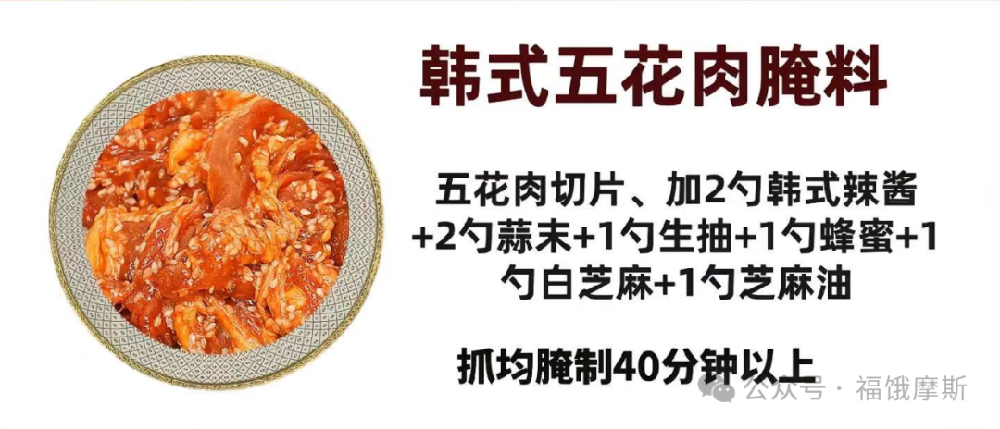

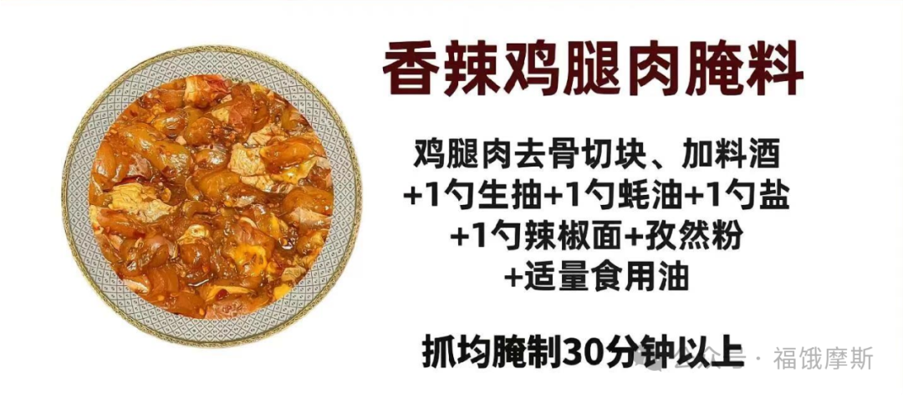

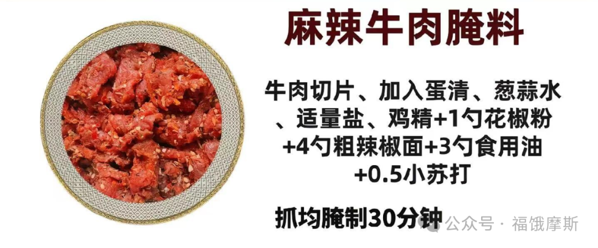

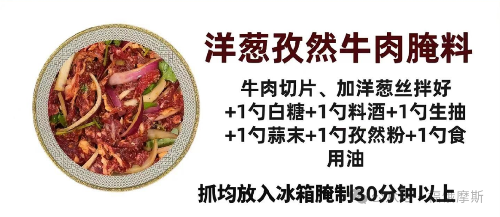

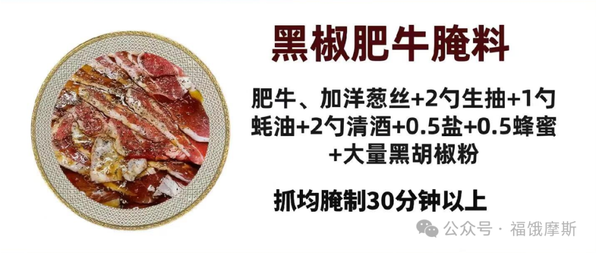

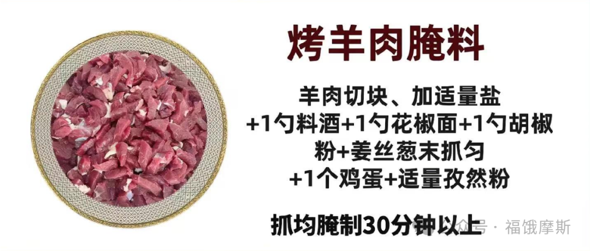

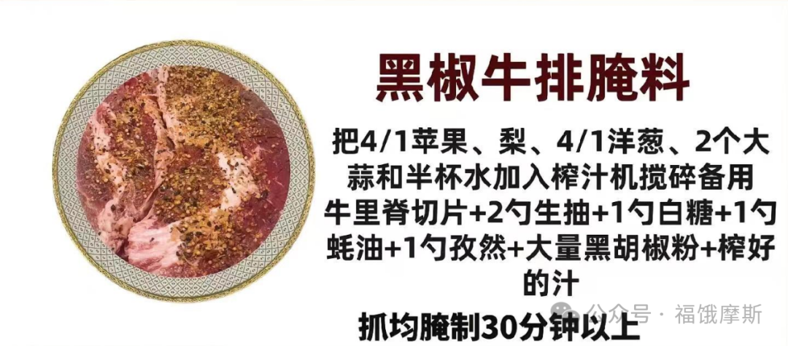

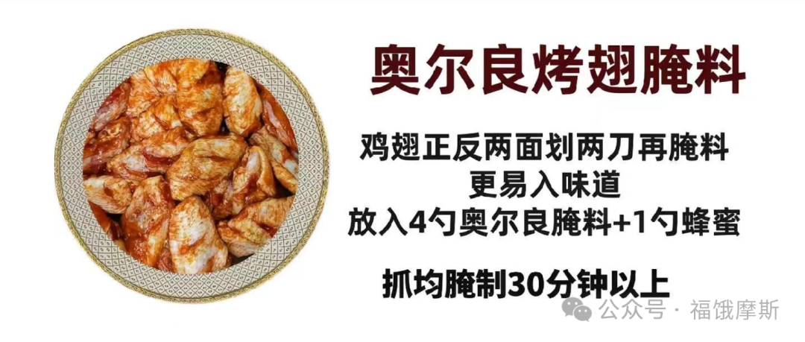

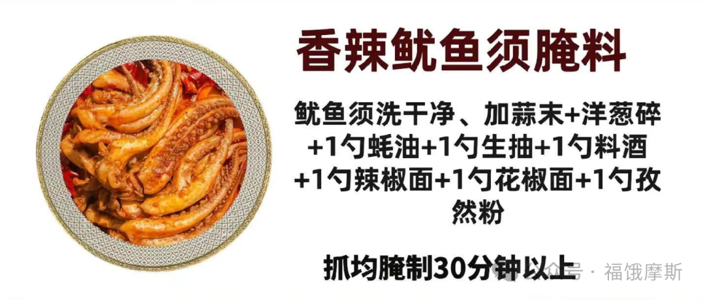

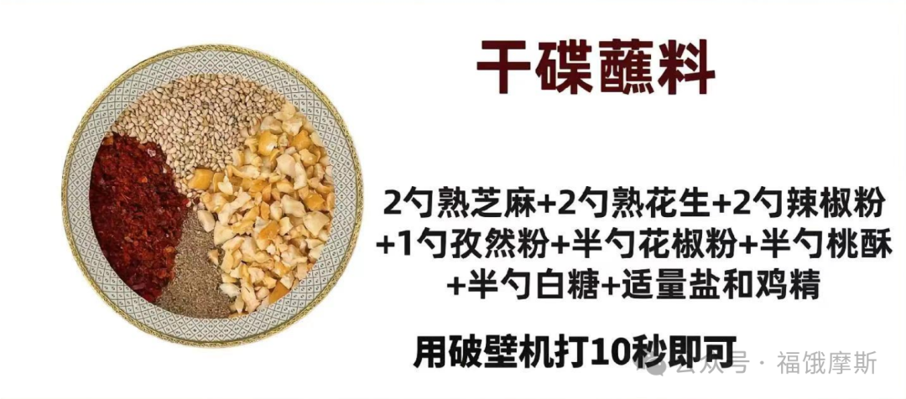

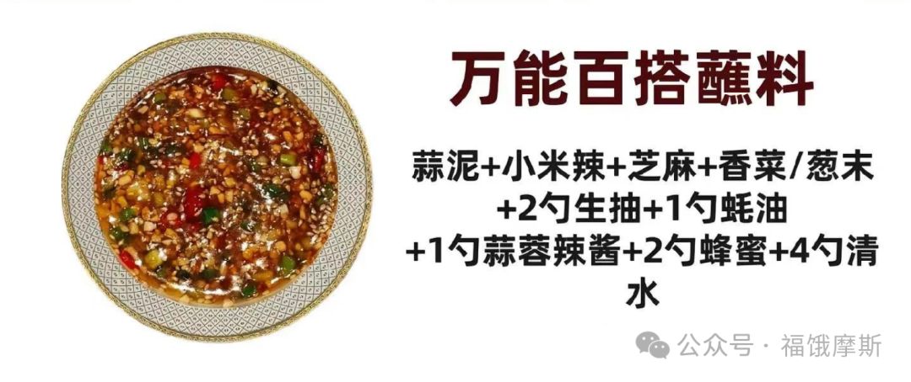

### 潮汕腐乳鸡翅/南乳鸡翅

#### 🍳 详细制作步骤 

#### **1\. 准备与腌制鸡翅**

- **处理鸡翅**：将鸡翅洗净，用厨房纸吸干表面水分。为了让鸡翅更入味，可以在两面各划上几刀，或者用牙签扎些小孔。

- **调制腐乳腌料**：在一个大碗中，用勺子将腐乳块压碎，然后与腐乳汁、生抽、蚝油、糖等所有腌料混合均匀，直到成为顺滑的酱汁。

- **腌制**：将鸡翅放入腌料中，充分按摩，确保每一面都均匀裹上酱料。**封上保鲜膜，放入冰箱冷藏至少2小时**。如果时间充裕，腌制过夜（例如8小时以上）风味会渗透得更彻底。

#### **2\. 调制面糊**

- 取一个新碗，将面粉和玉米淀粉以大约1:3的比例混合。

- 打入一个鸡蛋，然后慢慢倒入冰水，同时不停搅拌，直到面糊呈现均匀顺滑、类似浓稠酸奶的状态。用冰水有助于面糊更酥脆。

#### **3\. 炸制鸡翅**

- **初次油炸**：在锅中倒入足量的油，以能没过鸡翅为宜。加热至约160\-180度（判断方法：插入一根干木筷，周围会冒出密集的小气泡）。将腌好的鸡翅均匀裹上面糊，轻轻滑入油锅。保持中小火，炸约8\-12分钟，期间翻面一次，直到鸡翅完全熟透、表面定型并呈现金黄色。

- **关键复炸**：将鸡翅捞出沥油。开大火将油温升高至约180\-190度，把鸡翅全部放回油锅，快速复炸15\-30秒。这一步能逼出鸡翅中多余的油脂，并使外皮达到极致的酥脆感。

#### 💡 风味升级与实用贴士 

- **腐乳的选择**：**潮汕红腐乳（南乳）** 是这道菜风味的灵魂，它带有独特的红曲色、脂香和微甜口感。如果买不到，用普通的**玫瑰腐乳**也可以替代。

- **潮汕风味升级**：想让味道更贴近潮汕本地特色，可以在腌料中加入少许**鱼露**提鲜，或者加入一小勺**沙茶酱**增添复合的咸甜辛辣风味。

- **健康烹饪选择**：如果觉得油炸比较油腻，也可以选择用**少量油煎熟**。煎制时无需裹面糊，只需在腌制好的鸡翅表面薄薄拍上一层干淀粉即可。

### **啫啫牛肉煲**

#### **一、 食材清单（供2\-3人享用）**

#### **二、 详细步骤（核心：腌、爆、铺、焗、淋）**

**第一部分：牛肉处理与腌制（嫩滑的基石）**

1. **处理牛肉**：牛肉**逆纹**切成均匀薄片或条，用厨房纸吸干表面水分。

2. **腌制上浆**：牛肉片中加入**生抽、蚝油、白糖、黑胡椒粉**，抓匀至吸收。**分2\-3次**加入**清水或葱姜水**，每次抓至水分完全被吸收再加下一次。加入**淀粉**抓匀，最后淋入**食用油**封住表面，腌制**20\-30分钟**。

**第二部分：准备料头与预热砂煲（镬气的准备）**

1. **准备料头**：**大蒜**整颗或轻拍，**生姜、干葱头**切粗粒，**沙姜**切粒（如用），**青红椒**切块。

2. **预热砂煲**：将**砂煲（瓦煲）** 置于火上，**空烧至非常烫手**，这是防止粘锅和产生镬气的关键。

**第三部分：爆香料头与焗制牛肉（风味的融合）**

1. **爆香料头**：砂煲烧热后，倒入**食用油**，油热后转中小火，放入**大蒜、姜粒、干葱头、沙姜粒**，慢慢煸炒至表面金黄、香气四溢。

2. **铺入牛肉**：将腌好的牛肉**均匀铺在**炒香的料头上，尽量铺平不重叠。

3. **淋酒焗制**：**立即盖上盖子**，转**大火**。沿着锅盖边缘**淋一圈广东米酒**，酒遇高温蒸汽会迅速渗入煲内并激发香气。保持大火焗**1\.5\-2分钟**（具体时间根据牛肉厚度和砂煲保温性调整）。

4. **开盖翻炒**：开盖，此时牛肉应已大部分变色。用筷子快速将牛肉拨散、翻面，使其受热均匀。

5. **加入配菜**：放入**青红椒块**，可再淋少许米酒，**盖上盖子再大火焗30秒至1分钟**。

6. **出锅增香**：关火，撒入**芹菜段或香葱段**，利用余温焖一下，即可整煲上桌。

#### **三、 成功关键与风味解析**

1. **“逆纹薄切”与“打水封油”的嫩肉双保险**：

    - **逆纹断纤维**：牛肉逆着肌肉纹理切割，能缩短纤维长度，这是物理上保证嫩度的第一步。

    - **打水锁水分**：分次加入清水抓匀，让牛肉细胞吸收水分，在加热时水分膨胀，使肉质更饱满多汁。

    - **淀粉与油封**：淀粉遇热糊化形成保护膜，锁住内部水分和调味；最后封油能防止肉片粘连，并让口感更滑嫩。

2. **“砂煲空烧”与“猛火短时”的镬气生成术**：

    - **砂煲是灵魂容器**：厚实的砂煲能积蓄大量热量，并均匀传递给食材，产生强烈的“煲气”。

    - **空烧防粘增香**：必须将砂煲空烧至足够热，再下冷油，形成类似“热锅凉油”的效果，既能防粘，又能瞬间激发料头香气。

    - **猛火短时锁鲜**：整个过程需**大火、快速**。高温能在几十秒内将牛肉表面迅速烹熟，锁住内部肉汁，达到外香里嫩的效果。时间过长会导致牛肉变老变柴。

3. **“大量料头”与“淋酒激香”的风味叠加魔法**：

    - **料头是风味基底**：大量使用的**大蒜、姜、干葱头**，在热油中煸至焦香，其香气物质充分释放，成为啫煲无可替代的底味。

    - **淋酒是点睛之笔**：在锅盖边缘淋入**广东米酒**，酒液遇高温迅速汽化，蒸汽带着酒香渗入食材，既能去腥，又能增添一层复合的香气，是啫啫煲风味的标志性动作。

#### **四、 营养价值分析与健康食用建议**

- **主要营养构成（基于牛里脊及常见配料估算，每100克可食部）**：

    - **热量**：约 **150\-180千卡** 。热量主要来自牛肉和烹饪用油。

    - **蛋白质**：约 **20\-25克** 。优质动物蛋白来源。

    - **脂肪**：约 **7\-10克** 。牛肉本身脂肪及烹饪用油。

    - **碳水化合物**：约 **5\-8克** 。主要来自酱料中的糖和淀粉。

    - **钠含量**：**高**。主要来自生抽、蚝油、啫啫酱等调味料。

- **健康风险提示**：

    1. **高钠**：腌制和酱料的使用导致钠含量容易超标。

    2. **高温烹饪**：砂煲持续高温可能产生更多丙烯酰胺等物质。

    3. **嘌呤含量**：牛肉属中嘌呤食物，汤汁浓缩后嘌呤含量不低。

- **健康改良与食用建议**：

    1. **优化家庭制作**：

        - **控制酱料用量**：使用**低钠生抽、蚝油**，或减少酱料比例，多用**黑胡椒、沙姜**等天然香料提味。

        - **选择更瘦部位**：选用**牛里脊**等纯瘦部位，并修剪可见脂肪。

        - **减少用油**：爆香料头时控制油量，利用砂煲的不粘特性。

    2. **科学搭配与食用**：

        - **搭配大量蔬菜**：可同时在煲内垫入**洋葱、芹菜、菌菇**等蔬菜，或另配清炒时蔬，增加膳食纤维摄入。

        - **控制食用频率与分量**：作为一道风味菜肴，**建议每周不超过2次，每次食用牛肉量控制在100\-150克**。

        - **多喝水**：食用后多喝水，帮助代谢钠和嘌呤。

    3. **特殊人群**：

        - **高血压、肾病患者**：**严格控盐**，建议使用自制低盐酱汁（如用香菇、干贝熬制天然鲜汤替代部分酱油）。

        - **痛风及高尿酸患者**：**慎食或避免**，尤其不要饮用底部浓缩的汤汁。

        - **消化功能较弱者**：牛肉和大量大蒜可能加重负担，应适量食用。

---

#### **五、啫啫煲的“万能”应用与通用步骤**

##### **一、 啫啫煲可以“啫”什么？（食材大全）**

啫啫煲的食材选择极为广泛，可分为以下几类：

##### **二、 啫啫煲的“通用四步法”**

无论啫什么，其核心流程万变不离其宗，可概括为以下四步：

1. **第一步：食材预处理（腌 / 备）**

    - **肉类/海鲜**：切配后，用**生抽、蚝油、糖、胡椒粉、淀粉、油**等基础调料腌制，原理同啫牛肉，目的是入味和锁水。

    - **蔬菜**：洗净，沥干或擦干表面水分，防止下锅后出水过多。

    - **难熟食材**：如肥肠、排骨，可先焯水或煎炸至半熟。

2. **第二步：砂煲与料头准备（烧 / 爆）**

    - **空烧砂煲**：砂煲置于火上，**干烧至烫手**（可滴入水滴迅速蒸发为准）。

    - **爆香料头**：倒入足量油，下入**大量蒜粒、姜粒、干葱头/红葱头**（灵魂三件套），中小火煸炒至金黄出香。可依喜好加入沙姜、香菜梗等。

3. **第三步：主料入煲焗制（铺 / 焗）**

    - **铺入主料**：将处理好的主料（如腌好的肉、海鲜）**均匀铺在**炒香的料头上。

    - **淋酒加盖**：**立即盖上盖子**，转**大火**。沿锅盖边缘**淋一圈广东米酒或料酒**。

    - **控制火候与时间**：保持大火焗制，时间根据食材而定：

        - 薄肉片、虾：**1\-2分钟**。

        - 鸡块、排骨块：**3\-5分钟**。

        - 蔬菜：**30秒\-1分钟**。

    - （可选）中途开盖翻动，加入易熟的配菜（如青红椒）。

4. **第四步：出锅增香与上桌（撒 / 焖）**

    - **撒入生香料**：关火，开盖，迅速撒入**香葱段、香菜、新鲜辣椒圈**等。

    - **利用余温**：盖上盖子，利用砂煲的余温将生香料的香气“焖”出来。

    - **整煲上桌**：垫上隔热垫，连煲一起上桌，揭开盖子的瞬间，香气扑鼻，啫啫作响，仪式感十足。

##### **三、 风味升级：自制万能啫啫酱**

想让风味更上一层楼，可以提前调制一罐“万能啫啫酱”：

- **基础配方**：柱侯酱、海鲜酱、花生酱、腐乳、蚝油、生抽、糖、胡椒粉、油混合均匀。

- **用法**：在腌制食材时加入1\-2勺拌匀，或在下主料前与料头一同炒香。

### 干蒸排骨 

#### 一、 食材清单（供2\-3人享用） 

#### 二、 详细步骤（核心：腌、激、蒸） 

**第一部分：排骨预处理（去腥定底）**

1. **浸泡清洗**：排骨剁成2\-3厘米小块，放入清水中浸泡30分钟以上，中途换水1\-2次，充分泡出血水。

2. **擦干吸水**：捞出排骨，用厨房纸彻底擦干表面水分。这是后续入味和挂浆的关键，水分多则易脱浆、风味寡淡。

**第二部分：制作“金银蒜豉油”（风味核心）**

1. **备料**：将蒜末、姜末、豆豉碎、葱白末放入一个耐热小碗中。

2. **激香**：将30\-40克食用油烧至微微冒烟（约七成热），迅速淋入小碗中，你会听到“滋啦”一声，香气瞬间爆发。稍微搅拌，让热量均匀渗透。

3. **调味**：趁热向碗中加入生抽、蚝油、白糖、白胡椒粉、料酒，搅拌均匀，制成腌料。热油能最大限度逼出蒜、豉的香气，并让调料更好地融合。

**第三部分：腌制与挂浆（锁味塑形）**

1. **混合腌制**：将调好的腌料倒入彻底擦干的排骨中。

2. **充分抓拌**：用手反复抓拌、揉搓排骨3\-5分钟，直至排骨表面发粘，将所有液体调料吸收。

3. **上浆静置**：加入玉米淀粉，继续抓拌均匀，让每一块排骨都薄薄地裹上一层浆。最后滴入芝麻香油拌匀锁味。

4. **冷藏入味**：封上保鲜膜，放入冰箱冷藏腌制**至少1小时**，若能腌制2\-3小时风味更佳。

**第四部分：蒸制与点睛（原汁成菜）**

1. **装盘**：取一个平底浅盘，将腌制好的排骨平铺开，尽量不要堆叠，以保证受热均匀。

2. **蒸制**：蒸锅水烧开后，放入排骨，保持**大火**蒸**18\-20分钟**。时间取决于排骨块的大小，以用筷子能轻松插入为准。

3. **点缀**：出锅后，撒上葱花和姜丝和红椒圈点缀，利用余温激发葱花香气即可上桌。

#### 三、 成功关键与风味解析 

1. **“生肉去水”与“热油激香”的风味奠基术**：

    - **去水是根本**：生排骨的血水是腥味主要来源，长时间浸泡和彻底擦干，是获得纯净肉味的前提。水分不干，后续腌料无法附着，蒸出来易出水，口感风味皆失。

    - **激香定基调**：用滚油瞬间浇淋蒜、豉、姜，是粤式蒸菜的经典手法。高温不仅杀菌，更能将蒜素、豆豉的醇香、姜的辛香彻底激发并锁定在油脂中，形成复合的“金银蒜豉油”，这是成品香气浓郁、蒜香扑鼻的根源。

2. **“抓拌上浆”与“足时腌制”的嫩滑保障法**：

    - **抓拌入味**：长时间的抓拌动作，能物理破坏排骨表面肌肉纤维，让调味汁更容易渗透进去，同时通过摩擦使肉质更嫩。

    - **淀粉锁水**：淀粉在排骨表面形成一层保护膜，在蒸制过程中能有效锁住内部水分和鲜味物质，使成品“外裹薄芡，内里多汁”。腌制时间足够，味道才能从表及里。

3. **“大火足汽”与“平铺装盘”的火候掌控学**：

    - **大火速蒸**：必须等水沸汽足后再放入排骨，并始终保持大火。高温蒸汽能瞬间使肉质表面的蛋白质凝固，锁住汁水，实现“急火快蒸出嫩肉”的效果。火力不足会导致肉质变柴、出水。

    - **平铺散热**：装盘时避免堆叠，让蒸汽能均匀包裹每一块排骨，使其同步成熟。堆叠会导致受热不均，底下的容易过老，上面的可能不熟。

**风味解析**：成功的干蒸排骨，应是“蒜豉咸香先行，肉质嫩滑紧随，咀嚼间脂香与微甘回涌”。蒜末经热油激烫，去除了生辣，只留醇香；豆豉的发酵咸鲜是隐形的味觉骨架；姜和胡椒粉去腥提味，不露痕迹。蒸制的手法最大程度保留了排骨的本味和汁水，淀粉形成的薄芡将所有这些复合的滋味温柔地包裹在每一块排骨上，形成浓郁而又不燥不腻的和谐口感。

#### 四、 营养价值分析与健康食用建议 

- **主要营养构成（估算，每100克可食部）**：

    - **热量**：约 220\-260千卡。主要来自排骨中的脂肪和烹饪用油。

    - **蛋白质**：约 18\-22克。优质动物蛋白，易于人体吸收利用。

    - **脂肪**：约 15\-20克。以饱和脂肪为主，也含有单不饱和脂肪。

    - **碳水化合物**：约 5\-8克。主要来自调料中的糖和淀粉。

    - **钠含量**：**偏高**。主要来源于生抽、蚝油、豆豉。

- **健康风险提示**：

    1. **高钠风险**：尽管是蒸菜，但因使用了多种咸味调料，钠含量依然不容忽视。

    2. **脂肪与胆固醇**：猪排骨本身含有一定量的脂肪和胆固醇。

    3. **嘌呤含量**：猪肉及内脏类属于中高嘌呤食物。

- **健康改良与食用建议**：

    1. **家庭制作优化**：

        - **减盐策略**：使用薄盐生抽，或减少1/3的酱油和豆豉用量，用少许香菇粉或干贝素提鲜替代部分咸味。

        - **优选部位**：选择瘦肉比例稍高的排骨段，或蒸制前剔除部分可见的肥油。

        - **搭配粗粮**：蒸制时，可在盘底垫上芋头块、南瓜块或红薯块，它们能吸收肉汁和油脂，增加膳食纤维，实现荤素一锅出。

    2. **科学搭配食用**：

        - **控制份量**：作为主菜，建议每人食用排骨量控制在100\-150克（约4\-6块）。

        - **搭配大量蔬菜**：必须搭配一份白灼绿叶蔬菜（如菜心、生菜）和一份清淡的汤（如丝瓜豆腐汤），以平衡钠摄入并增加饱腹感。

        - **注意频率**：鉴于其脂肪和钠含量，建议每周食用不超过2次。

    3. **特殊人群**：

        - **高血压、需控盐者**：务必采用低盐版本，并减少食用量。

        - **高血脂、痛风患者**：应谨慎食用，控制频率和数量，尤其避免喝盘底汤汁（嘌呤、钠、脂肪浓缩其中）。

        - **一般人群**：这是一道相对健康的肉类菜肴，蒸制方式避免了高温烹饪产生的有害物，核心在于控制好摄入量。

### 空气炸锅炸鸡翅

#### 🍗 制作黄金炸鸡翅四部曲 

1. **鸡翅预处理**

2. 将鸡翅洗净后，用刀在两面划几刀，或者用牙签扎些小孔。这个步骤是关键，能让鸡翅在腌制时更充分地吸收味道。

3. **腌制入味**

4. 将处理好的鸡翅放入碗中，加入您喜欢的调料。充分的腌制是美味的核心，建议至少腌制 **30分钟**，如果时间充裕，冷藏腌制 **2小时以上** 甚至隔夜，风味会更浓郁。

5. 您可以参考下面的表格尝试不同风味组合：

1. **裹粉（可选，用于更酥脆的外皮）**

2. 如果追求极致的酥脆外皮，可以在腌制后将鸡翅均匀裹上一薄层淀粉或面包糠。淀粉（如玉米淀粉、红薯淀粉）能形成轻薄酥脆的外壳，而面包糠则能带来更明显的颗粒酥脆感。

3. **空气炸锅烹饪**

4. 这是最关键的步骤，核心是温度和时间的把控。

    - **预热**：放入鸡翅前，先将空气炸锅**200℃预热3\-5分钟**。预热能让鸡翅表面迅速定型，锁住肉汁。

    - **摆放**：将鸡翅平铺在炸篮中，**不要叠放或过于拥挤**，以确保热空气循环均匀。

    - **温度与时间**：将温度设置为 **180℃\-200℃**，总时间约 **15\-25分钟**。一个常用的成功模式是：**先200℃烤10分钟，使表面上色并形成脆皮，然后开锅翻面，再调至180℃继续烤5\-10分钟**，这样能有效避免外焦里生。不同炸锅功率和鸡翅大小有差异，需灵活调整，在最后几分钟最好观察上色情况。

#### 💡 美味升级小贴士 

- **外皮酥脆的秘诀**：在入锅前，给鸡翅表面轻轻刷或喷一层薄薄的油，能极大提升酥脆感。使用酸奶腌制也能让鸡肉在高温下保持鲜嫩多汁。

- 裹粉配方：中筋面粉 与 玉米淀粉 按 7 : 3 的比例混合，并加入约 3克小苏打，大蒜粉 2g,白胡椒粉 4g

- **判断是否熟透**：用筷子扎入鸡翅最厚处，能轻松扎透且没有血水渗出即可。安全的内部温度应达到 **75℃**。

- **避免粘锅**：确保炸篮干燥，或在篮底垫上烘焙纸/锡纸。

- **批量准备**：可以一次性多腌制一些鸡翅，分装后冷冻，吃之前取出解冻即可直接烹饪，非常方便。

### Buttermilk 酪乳鸡排

用Buttermilk（酪乳）奶\+酸来制作炸鸡排，独特的微酸风味和柔和奶香不仅能有效嫩化鸡肉，还能让成品外皮格外酥脆，内部多汁

#### 🧂 准备食材与腌制 

首先，我们来准备需要的材料和关键的腌制步骤。

- **主要食材**：

    - **鸡排**：建议选择去骨的鸡腿肉（口感更嫩滑）或厚度适中的鸡胸肉（需横切成1\-1\.5厘米的厚片并用刀背拍松）。

    - **Buttermilk（酪乳）**：约200\-250毫升，需足够没过鸡排。如果买不到，可以用全脂牛奶混合一汤匙（约15ml）柠檬汁或白醋，静置5\-10分钟至凝固后替代，或者直接用原味酸奶替代。

    - **腌制香料**：盐、黑胡椒粉是基础。您还可以按喜好添加蒜粉、洋葱粉、辣椒粉或新鲜的香草碎（如百里香）来增加风味层次。

- **腌制过程**：

    1. 将鸡排用刀背或肉锤轻轻拍打，将肉质纤维拍松，这有助于入味和保持嫩度。

    2. 在一个足够大的碗中，放入鸡排，加入盐、黑胡椒等干性香料涂抹均匀。

    3. 倒入Buttermilk，确保鸡排完全浸没。盖上保鲜膜，放入冰箱**冷藏腌制至少4小时，理想情况下腌制过夜**。长时间的腌制是鸡肉入味且多汁的关键。

#### 🌯 裹粉与油炸 

腌制完成后，就到了决定酥脆口感的裹粉和油炸环节。

- **裹粉材料**：通常需要准备三份材料：**面粉（或与玉米淀粉、生粉混合）**、**打散的蛋液（可选）**、以及**面包糠或调味干粉**。不同的裹粉顺序会带来不同的口感效果：

- **油炸步骤**：

    1. **取出鸡排**：将腌制好的鸡排从冰箱取出，沥掉多余的Buttermilk腌汁（但不用完全弄干，保留一些湿度利于裹粉）。

    2. **裹粉**：按照上表选择的顺序，让鸡排均匀裹上粉料。裹上干粉后，可以轻轻按压，让粉粘得更牢，然后静置5分钟左右，让面包糠回潮，这样炸时不易脱落。

    3. **油温控制**：在锅中倒入足够的油（深度至少能没过鸡排一半），用中火加热至约**160\-170°C**（判断方法：木筷子插入油中，周围冒出密集的小气泡）。

    4. **初炸定型**：将鸡排小心放入油中，避免一次下太多导致油温骤降。中小火炸约**4\-6分钟**，期间翻面一次，炸至外壳定型、颜色浅金黄，内部基本熟透。捞出沥油。

    5. **复炸增脆**：开大火将油温升高至**180°C**左右，将鸡排再次下锅，快速复炸**30秒至1分钟**。这一步能逼出多余油脂，让外壳达到极致的酥脆感。捞出后放在厨房纸上吸掉多余油分。

#### 💡 美味升级秘诀 

掌握以下几个小技巧，能让您的炸鸡排更上一层楼：

- **嫩滑多汁的保证**：Buttermilk中的酸性物质和酵素能有效打断鸡肉的肌肉纤维，这是让鸡排鲜嫩多汁的核心科学原理。请务必保证足够的腌制时间。其余风味打入葱姜水、少量 小苏打粉（避免和食醋、柠檬酸性一起使用）

- 烤鸡炸鸡腿入味关键： 厨房纸吸水，要不然影响腌制，浓盐水腌制，浓度为5\.5%至8%的盐水

- **酥脆不腻的关键**：**“初炸低温熟成，复炸高温催脆”** 是专业做法。复炸虽然时间短，但对于形成不油腻的脆壳至关重要。

- **风味创新**：炸好的鸡排可以直接享用，也可以制作酱汁。例如，用黄油、蜂蜜、蒜末和少量生抽熬制成**蜂蜜黄油酱**，趁热淋在切块的鸡排上，甜咸交织，风味非常独特。

#### 风味大全

### **三下锅（猪肚\+牛肚\+豆皮干锅版）**

#### **一、 食材清单（供3\-4人享用）**

#### **二、 详细步骤（核心：爆、炒、烧、收）**

**第一部分：食材预处理（简化清理）**

1. **处理主料**：将**熟猪肚、熟牛肚**切成均匀的条或片。**豆皮**切宽条或菱形片。**五花肉**切薄片（如用）。

2. **准备配料**：**洋葱、青红椒**切块，**大蒜、生姜、大葱**处理备用。

**第二部分：炒制底料与主料（激发复合香气）**

1. **煸炒五花肉**（如用）：锅烧热，加少许底油，放入**五花肉片**，中小火煸炒至出油、表面微黄，盛出备用。猪油是风味的关键。

2. **爆香底料**：用锅中底油（或另加油），油温五成热时，转中小火，放入**郫县豆瓣酱**，慢慢炒出红油和酱香味。接着放入**干辣椒段、花椒、姜片、蒜片、葱段**，继续小火炒出浓郁香气。

3. **合炒主料**：转**大火**，倒入**猪肚、牛肚**和煸好的**五花肉**，快速翻炒均匀，让每一片都裹上红油和香料。沿锅边淋入**料酒**，大火烹出香气。

**第三部分：炖煮入味（让味道融合）**

1. **加水炖煮**：倒入**啤酒或高汤/清水**，水量以刚好与食材齐平或略少为宜。加入**生抽、老抽、白糖**调味。

2. **炖煮**：烧开后，转**中小火**，盖上锅盖焖煮**5\-8分钟**，让肚类食材充分吸收汤汁的味道。

**第四部分：加入配菜与收汁（成就干锅风味）**

1. **加入配菜**：打开锅盖，加入**豆皮、洋葱块、青红椒块**，翻炒均匀。

2. **大火收汁**：转**大火**，快速翻炒，将汤汁收至浓稠，紧紧包裹在食材上。此时可根据咸淡补少许**盐**或**鸡精**。

3. **出锅点缀**：撒上**蒜苗段或香菜**，翻炒两下即可出锅。可直接在炒锅中上桌（保温性好），或转入预热的砂锅中保温。

#### **三、 成功关键与风味解析**

1. **“熟货快炒”与“五花肉煸油”的风味叠加术**：

    - **熟货优势**：使用预熟的猪肚、牛肚，**完全规避了繁琐的内脏清洗和长时间卤煮过程**，大大缩短了烹饪时间，且质地稳定，不易缩水。

    - **猪油增香**：加入**五花肉片煸炒出油**是点睛之笔。动物油脂能极大地提升复合香气，让豆瓣酱和香料的味道更加醇厚、附着性更强，这是纯用植物油无法比拟的风味层次。

2. **“豆瓣酱\+干椒花椒”的川湘风味定调**：

    - **豆瓣酱定基调**：**郫县豆瓣酱**经过慢炒，释放出咸鲜、微甜、酱香和红亮的色泽，构成了这道菜的味觉和视觉基底。

    - **干椒花椒赋灵魂**：**干辣椒的燥香**与**花椒的麻味**在热油中激发出复合的“麻辣”气息，这是湘西、川渝地区干锅菜系的灵魂。先炒香豆瓣酱再下干料，能防止辣椒炒糊发苦。

3. **“豆皮吸汁”与“干锅收汁”的入味逻辑**：

    - **豆皮的吸味特性**：豆皮（千张）组织疏松，在炖煮后期加入，能像海绵一样**充分吸收饱含肉香、酱香和麻辣味的汤汁**，使其成为整道菜中最入味、最下饭的部分。

    - **收汁成就干锅**：最后阶段**大火收汁**至浓稠，让味道浓缩并紧紧包裹在食材表面，形成“干香”的口感，而非汤汤水水，这正是“干锅”风味的精髓所在。

#### **四、 营养价值分析与健康食用建议**

- **主要营养构成（基于熟猪肚、牛肚、豆皮估算，每100克可食部混合食材）**：

    - **热量**：约 **180\-220千卡** 。因含有动物脂肪和烹饪用油，热量中等偏高。

    - **蛋白质**：约 **15\-20克** 。**优质混合蛋白**来源（动物蛋白\+植物蛋白）。

    - **脂肪**：约 **10\-15克** 。饱和脂肪与不饱和脂肪并存。

    - **碳水化合物**：约 **5\-10克** 。主要来自豆皮和少量酱料中的糖。

    - **膳食纤维**：**较低**。主要来自豆皮和配菜。

    - **钠含量**：**非常高**。主要来自豆瓣酱、生抽等调味料，以及预熟内脏可能含有的盐分。

- **健康风险提示**：

    1. **高钠**：这是此类重口味菜肴最突出的问题，钠摄入极易超标。

    2. **高脂肪**：动物内脏本身含有一定胆固醇和脂肪，加上五花肉和烹饪用油，整体脂肪含量不低。

    3. **嘌呤含量较高**：动物内脏属于高嘌呤食物。

    4. **潜在致癌物**：高温爆炒和干锅久煮可能产生杂环胺等物质。

- **健康改良与食用建议**：

    1. **优化家庭制作**：

        - **减少钠来源**：使用**低钠豆瓣酱或减盐生抽**，出锅前尝味再决定是否加盐。减少五花肉用量或不用。

        - **改变烹饪用油**：用**菜籽油或花生油**代替部分猪油。爆香底料后，可先捞出部分红油和料渣再炒主料，减少油脂摄入。

        - **增加蔬菜比例**：大幅增加**洋葱、青红椒、木耳、芹菜、莴笋**等蔬菜的量，使荤素比例达到1:2。

        - **缩短收汁时间**：避免将汤汁收得过干，保留少许汤汁，减少高温浓缩产生的有害物。

    2. **科学搭配与食用**：

        - **控制份量**：作为一道重口味主菜，**建议每人每次食用总量控制在150\-200克（混合食材）为宜**。

        - **搭配清淡主食与汤品**：务必搭配**白米饭、杂粮饭**或**馒头**，并佐以**青菜豆腐汤、冬瓜海带汤**等清淡汤品，帮助平衡咸度。

        - **降低频率**：建议作为**周末或聚会时的解馋菜肴**，每周不超过1次。

    3. **特殊人群**：

        - **高血压、肾病及需要严格控盐者**：**慎食或避免**。如食用，务必采用上述低钠改良法，并大量饮水。

        - **高血脂、痛风及高尿酸血症患者**：**应避免或极少量尝味**。动物内脏和浓汤嘌呤、胆固醇含量高。

        - **消化功能较弱者**：内脏和豆皮均不易消化，应少量食用。

### 菠萝烤肉

#### 🍍 菠萝烤肉风味指南 

这道菜的核心在于 **“肉要入味焦香，菠萝要酸甜多汁”**，通过腌、烤两个步骤实现风味的融合。

#### 🍳 详细步骤分解（以猪梅花肉为例） 

1. **准备食材**

    - **主料**：猪梅花肉300克，新鲜菠萝200克（或罐头菠萝半罐）。

    - **腌料**：生抽3汤匙（约45ml），蚝油1汤匙，料酒1汤匙，蜂蜜1汤匙，蒜末2瓣，黑胡椒碎适量。

    - **其他**：白芝麻、香葱或欧芹碎少许（装饰用）。

2. **处理与腌制**

    - 猪肉洗净，逆着纹理切成约0\.5厘米厚的片或2厘米见方的块。用刀背轻轻拍打，使肉质更松软入味。

    - 将除蜂蜜外的所有腌料与肉充分抓匀，**密封冷藏腌制至少1小时，隔夜更佳**。

    - 菠萝切成与肉块大小相近的块状，用淡盐水浸泡后，用厨房纸吸干表面水分。

3. **烤制与组合**

    - **预热**：烤箱上下火200℃预热10分钟。烤盘铺锡纸，刷薄油。

    - **先烤肉**：将腌好的肉平铺在烤盘上，**先烤10分钟**，取出翻面。

    - **混合烤制**：在肉块周围放上菠萝块，在肉和菠萝表面**刷上一层蜂蜜水**（蜂蜜兑少许水）。放回烤箱再烤**5\-10分钟**，直到肉块边缘微焦、菠萝表面出现漂亮焦糖色。

    - **最后炙烤**：喜欢焦香感的，可在最后2分钟调至220℃或使用烤箱的上火炙烤功能。

4. **出锅与享用**

    - 取出装盘，撒上白芝麻和香葱碎增香。

    - 趁热食用，感受菠萝汁水与烤肉油脂在口中融合的曼妙滋味。

#### 💡 成功关键与升级秘诀 

- **肉的选择是基础**：梅花肉是首选，其均匀分布的脂肪在烤制时会产生润泽口感。

- **分步烤制是精髓**：一定**先烤肉，后加菠萝**。如果一开始就混在一起烤，菠萝会大量出水，导致“煮肉”而非“烤肉”，失去焦香感。

- **蜂蜜是点睛之笔**：烤制后半程刷蜂蜜水，能形成诱人的焦糖光泽和脆甜外壳，并平衡酸味。

- **火候灵活调整**：使用**平底锅**也可制作：先中小火将肉煎熟，推至锅边，放入菠萝块煎至两面金黄，再混合翻炒均匀即可。

- **健康版做法**：使用**空气炸锅**，180℃先烤肉10分钟，翻面加入菠萝再烤5\-6分钟，效果同样出色且用油更少。

#### 🥗 搭配与营养建议 

- **完美一餐**：搭配一碗**杂粮米饭**和一份**清爽的蔬菜沙拉**（如芝麻菜、生菜），就是营养均衡的一餐。

- **营养亮点**：菠萝中的**菠萝蛋白酶**有助于分解蛋白质，促进消化，使肉质更嫩。这道菜提供了优质蛋白质、维生素和膳食纤维。

- **口味延伸**：喜欢东南亚风味的，可在腌料中加入**鱼露和香茅**；喜欢韩式风味的，可用**韩式辣酱**替代部分生抽。

### **酱香烤牛肋排（经典先炖后烤版）**

山姆同款，酱香烤牛肋排是一道融合了**中式酱烧的浓郁**与**西式烤制的焦香**的硬菜。其核心在于通过长时间的低温慢烤或先炖后烤，让厚实的牛肋排达到**骨肉分离、酥烂入味**的状态，再通过高温烤制形成诱人的焦糖色外壳和烧烤香气。这种方法能最大程度保证牛肋排内部软烂多汁，外部焦香浓郁，成功率极高。

#### **一、 食材准备（约2\-3人份）**

#### **二、 详细步骤**

1. **预处理与焯水**

- 牛肋排用冷水浸泡1小时以上，泡出血水。

- 冷水下锅，加入姜片、葱段、料酒，大火煮沸后撇去浮沫，继续煮5\-10分钟。

- 捞出用温水洗净，沥干备用。

2. **炖煮入味（使肉质酥烂的关键）**

- **方法A（明火炖煮）**：热锅少油，下冰糖炒出糖色（可选），加入焯好的牛肋排翻炒上色。加入所有**炖煮酱汁**和**香料**，翻炒出香气。倒入足量**开水**（需没过肋排），大火烧开后转**小火，盖盖慢炖1\-1\.5小时**，直至筷子可轻松插入肉质。

- **方法B（烤箱低温慢烤）**：将焯水后的牛肋排与所有炖煮酱汁、香料放入深烤盘，加开水没过。用锡纸**严密包裹**烤盘。烤箱预热**150°C，烤2\.5\-3小时**。此法肉质更均匀软烂。

3. **烤制上色（形成焦香外壳）**

- 将炖煮酥烂的牛肋排捞出，放在铺有烤网或锡纸的烤盘上。

- 烤箱预热**200°C**。

- 在肋排表面均匀刷上**蜂蜜水**或**浓缩的炖煮酱汁**。

- 放入烤箱中层，**烤10\-15分钟**。

- 取出翻面，再刷一次酱汁，继续烤**5\-10分钟**，直至表面出现诱人的焦糖色和脆壳，最后撒上白芝麻。

#### **三、 成功关键与风味解析**

1. **“酱香”的来源**：**豆瓣酱/黄豆酱**是中式酱香的核心，与生抽、蚝油、糖结合，形成咸、鲜、甜、酱香复合的浓郁底味。

2. **软烂的秘诀**：牛肋排纤维粗，必须通过**足量水分**和**长时间加热**来分解胶原蛋白。**先炖（烤）后烤**是家庭做法中最可靠的方法，能确保中心也完全熟透入味。

3. **焦香与亮泽**：最后的高温快烤是关键。刷**蜂蜜水**不仅能增加风味，其中的糖分在高温下发生美拉德反应和焦糖化，形成红亮酥脆的外皮。

4. **省时替代法**：如果时间紧张，可以简化流程：将牛肋排用**浓酱汁腌制4小时以上**（最好隔夜），然后用锡纸包裹，**175°C烤2\.5小时**，最后打开锡纸，刷酱**200°C烤10分钟**上色即可。

#### **四、 营养搭配与上菜建议**

- **搭配原则**：这道菜蛋白质和脂肪丰富，口味浓郁，适合搭配**清爽、解腻、富含膳食纤维**的配菜。

- **推荐配菜**：

    - **烤蔬菜**：在烤制最后15分钟，可将土豆、胡萝卜、洋葱块铺在烤盘上一起烤，吸收肉汁。

    - **清爽沙拉**：生菜、黄瓜、小番茄沙拉，用油醋汁拌匀。

    - **主食**：米饭或烤馒头片，用来蘸取盘底浓郁的酱汁。

- **上菜方式**：直接手抓啃食最过瘾，也可剔骨后切厚片装盘，淋上浓缩的酱汁。

### 凉拌羊肉（**徐州风味 vs\. 京味二八酱**）

#### **总结与选择建议**

1. **风味本质不同**：

    - **徐州版是“调味型”**：通过酱油、辣椒、花椒等，为清香的熟羊肉披上一层鲜辣咸香的外衣，味道直接、层次分明。

    - **二八酱版是“酱香型”**：通过醇厚的麻酱复合酱汁，包裹并升华羊肉的鲜美，味道圆融、口感绵长。

2. **选择您的偏好**：

    - **如果您喜欢**：口感清爽、味道鲜明、带点辣味和椒麻香，想品尝羊肉与蔬菜的脆爽结合——**首选徐州风味**。

    - **如果您钟情于**：芝麻酱、花生酱的浓郁香气，喜欢酱汁裹满食材的满足感，追求口感的香滑醇厚——**非二八酱版莫属**。

3. **家庭制作要点**：

    - **共同关键**：无论哪种，**羊肉的预处理（浸泡、焯水、小火慢煮、原汤冷却）** 都是去膻增嫩、决定成败的基础，绝不能马虎。

    - **徐州风味核心**：**花椒油和辣椒油**是风味点睛之笔，建议自制。调味汁不宜过咸，以衬托肉鲜。

    - **二八酱风味核心**：**酱料的稀释**是关键，必须用温水**分次、朝一个方向**搅拌至顺滑如酸奶状。腐乳汁和韭菜花是风味的深度来源。

### **蘸水羊肉（清鲜复合版）**

#### **一、 食材清单（可供4\-6人享用）**

#### **二、 详细步骤**

**第一部分：煮制清汤羊肉（汤清肉嫩的关键）**

1. **浸泡**：羊肉切大块，用冷水浸泡1\-2小时，中途换水，充分去除血水。

2. **冷水下锅**：羊肉与冷水一同下锅，水量需完全没过羊肉。加入所有**煮肉料（芹菜、洋葱、胡萝卜、大葱、姜）**。

3. **反复“砸”水撇沫（核心技巧）**：大火煮开后，用勺子仔细撇净浮沫。然后，**向沸汤中心倒入一碗冷水**，待再次煮沸，撇净新浮沫。此过程重复**4\-5次**，直到汤色变得清澈，几乎无沫可撇。这是汤底清澈不浑浊的秘诀。

4. **加入“三白”慢煮**：汤清后，放入**白芷、白蔻、白胡椒粒**。转为**小火**，盖上锅盖慢炖**20\-40分钟**（时间取决于羊肉部位和喜欢的软烂程度）。

5. **浸泡冷却**：煮到用筷子能轻松插入即可关火。**不要马上捞出**，让羊肉在原汤中自然冷却至温热或凉透，这样肉质会更紧实、多汁，便于切片。

**第二部分：调制复合蘸水（风味爆炸的源泉）**

1. **切末**：将蘸水所需的**大蒜、洋葱、苹果、西红柿、香菜、生姜、小葱、小米辣**全部切成细末，放入一个大碗中。

2. **调味**：向碗中加入**生抽、米醋、白糖、香油、花椒粉、熟白芝麻、孜然粉（可选）**。

3. **激香**：最后，舀入**1\-2勺煮羊肉的热原汤（或开水）**，迅速搅拌均匀。热汤能瞬间激发出所有食材的复合香气，让味道充分融合。

**第三部分：组合享用**

1. **切片**：将冷却好的羊肉捞出，逆着纹理切成薄片，整齐码放在盘中。

2. **上桌**：将调好的蘸水碗与羊肉盘一同上桌。也可以将煮肉的原汤调味（加盐、胡椒粉）作为清汤搭配，实现“一羊两吃”。

#### **三、 成功关键与风味解析**

1. **“砸水”撇沫**：这是获得**清澈汤底**的不二法门。冷水激荡能使血沫和杂质更彻底地析出，撇净后汤色如茶，味道纯净。

2. **“三白”香料**：**白芷去腥，白蔻增香，白胡椒提味**。三者结合，去膻效果极佳，且不会像八角、桂皮那样掩盖羊肉本味，是专业厨师的法宝。

3. **蘸水的“复合”哲学**：蘸水集**辛（蒜、姜、辣）、甜（洋葱、苹果）、酸（西红柿、醋）、香（香菜、芝麻）、咸（生抽）、麻（花椒）** 于一体。每一种味道都不突出，但融合后产生了奇妙的化学反应，每一口都滋味无穷。

4. **苹果的妙用**：苹果中的果酸和果糖能有效分解羊肉的脂肪，提供自然清香，是让蘸水风味立体、去腻增鲜的点睛之笔。

#### **四、 创意变化与搭配建议**

- **蘸水变奏**：

    - **川味升级**：加入更多辣椒油和花椒油，突出麻辣鲜香。

    - **滇味风情**：加入少许**折耳根（鱼腥草）碎**和**煳辣椒面**，风味独特。

    - **简化版**：若嫌八样切末麻烦，可精简为核心四样：**蒜末、香菜末、葱花、小米辣**，用生抽、醋、糖、香油调和，同样美味。

- **羊肉处理**：追求极致口感，可将煮好冷却的羊肉用保鲜膜卷紧，冷藏定型后再切片，切面会非常整齐漂亮。

- **汤底利用**：煮肉的原汤过滤后，加入白萝卜块、粉丝、白菜等煮成一道鲜美的**羊肉汤**，撒上蒜苗、香菜，绝不浪费。

- **食用场景**：这道菜非常适合家庭聚餐或朋友小酌。清汤羊肉温润滋补，复合蘸水刺激味蕾，是秋冬季节的暖心佳肴。

### **蒜泥拆骨肉**

#### **一、 食材清单（2\-3人份）**

#### **二、 详细步骤**

**第一部分：炖煮拆骨肉（获取原味）**

1. **浸泡与焯水**：猪骨头用冷水浸泡1小时以上，泡出血水。然后冷水下锅，加入1汤匙料酒和几片姜，大火煮沸后撇净浮沫，继续煮约5分钟。捞出用温水洗净。

2. **炖煮至软烂**：将焯好水的骨头放入炖锅（或高压锅），加入足量热水（务必是热水，防止肉质紧缩），放入葱段、姜片、八角、花椒、干辣椒。大火烧开后，**转小火慢炖1\-1\.5小时**（普通锅），或**高压锅上汽后压15\-20分钟**。煮至用筷子能轻松插入、骨肉可分离的状态。

3. **拆骨取肉**：将煮好的骨头捞出，**晾至不烫手**。用手或筷子将骨头上的肉拆下来，顺着纹理撕成大小适口的条或块。难拆的部分可用小刀辅助。

**第二部分：调制万能蒜泥汁（注入灵魂）**

1. **制作蒜泥**：大蒜去皮，放入蒜臼中，加入**少许盐**，捣成细腻的蒜泥。加盐有助于大蒜细胞破裂，释放更多蒜香，且不易溅出。

2. **调和酱汁**：将蒜泥放入碗中，依次加入**生抽、香油、白糖**，搅拌均匀。如果喜欢酸辣风味，此时加入**香醋和辣椒油**。最后可以撒上香菜末或小米辣圈。

**第三部分：组合与享用**

- **蘸食法（传统）**：将撕好的拆骨肉码放在盘中，旁边放上蒜泥汁。吃时夹起肉块蘸取酱汁，原汁原味。

- **拌匀法（入味）**：将调好的蒜泥汁直接淋在拆骨肉上，充分拌匀，使每一块肉都裹满酱汁，更加入味。

- **搭配**：可以用黄瓜片垫底或围边，清口解腻。

#### **三、 成功关键与风味解析**

1. **选材是基础**：**猪肩胛骨（哈拉巴）或棒骨**是首选，这些部位骨边肉带有筋膜和少量脂肪，炖煮后口感软糯中带有嚼劲，肉香浓郁。

2. **炖煮的火候**：**小火慢炖**是肉质软烂不柴的关键。切忌大火急煮，否则肉易变硬。用高压锅可大大节省时间，但风味渗透稍逊于慢炖。

3. **蒜泥的讲究**：**加盐捣制**的蒜泥，其风味远胜于用刀剁的蒜末。盐分能更好地激发大蒜的辛辣与香气，使酱汁风味更浓郁、更融合。

4. **酱汁的平衡**：单纯的蒜和酱油会有些“冲”和“咸”。加入**少许白糖**能完美地柔和咸味与蒜辣，提升鲜味，让酱汁味道更圆润、有层次。**香油和醋**的加入则进一步丰富了香气和口感。

5. **骨汤的妙用**：炖煮后的骨汤浓郁鲜美，千万不要浪费。可以撇去浮油后，用来煮面条、炖白菜或做酸辣汤，一汤两用，极致节俭。

#### **四、 营养价值分析与食用建议**

- **主要营养**：

    - **猪肉**：提供优质蛋白质、B族维生素（尤其是B1）、以及易于吸收的铁、锌等矿物质。骨边肉通常含有一定量的胶原蛋白，对皮肤和关节有益。

    - **大蒜**：富含大蒜素，具有抗菌、抗炎、辅助调节血脂和血压的潜在益处。其辛辣味还能刺激胃液分泌，帮助消化。

- **健康提示**：

    1. **脂肪与嘌呤**：拆骨肉，尤其是靠近骨头的部分，可能含有一定量的脂肪和嘌呤。**高血脂、痛风患者**应适量食用。

    2. **钠摄入**：酱汁中酱油含盐量较高，调酱时可根据口味调整用量，或减少后续菜肴的用盐量。

    3. **搭配建议**：这是一道蛋白质丰富的“硬菜”，最好搭配**足量的主食（米饭、馒头）和清爽的蔬菜**，以保证膳食均衡。

- **创意变化**：

    - **凉拌升级**：除了蒜泥汁，还可以加入**辣椒油、花椒油、花生碎、芝麻**，做成麻辣鲜香的口味。

    - **热炒风味**：将拆骨肉与**青红椒、蒜苗、豆豉**等一同爆炒，又是另一番风味。

    - **汤品利用**：如前所述，炖肉的骨汤是宝贝，简单加点盐和青菜，就是一碗极鲜的汤。

### **盐焗大虾**

#### **一、 食材清单（供2\-3人享用）**

#### **二、 详细步骤（核心：炒盐、埋虾、焖焗）**

1. **大虾处理（入味与美观）**：

    - 剪去虾枪、虾须和虾脚。用牙签从虾背第二节处挑出**虾线**。

    - 用厨房纸**彻底吸干大虾表面和腹部的水分**，这是防止焗制时出水、确保虾壳酥脆的关键。

    - （可选）用少量白胡椒粉和料酒轻轻抹匀虾身，静置5分钟。

2. **炒制盐焗料（激发香气）**：

    - 将**粗海盐**倒入干燥的炒锅（最好用厚底锅），加入**花椒、八角、香叶**。

    - **中火**翻炒，直至盐粒颜色微微发黄，热气升腾，并能闻到浓郁的香料味（约需5\-8分钟）。

3. **埋虾与焖焗（核心烹饪）**：

    - 将炒热的盐盛出一半，在锅中铺平。

    - 将处理好的大虾**整齐地、单层平铺**在热盐上。

    - 将剩余的热盐**均匀地覆盖在大虾上**，确保完全埋没，形成一个“盐焗层”。

    - 盖上锅盖，转**最小火**，焖焗 **8\-12分钟**（具体时间根据虾的大小调整）。

4. **出锅与享用**：

    - 时间到后，关火。用锅铲轻轻拨开表面的盐，将大虾取出。

    - 将虾在盘边轻轻磕掉多余的盐粒，即可趁热食用。可搭配柠檬角或简单的姜醋汁。

#### **三、 成功关键与风味解析**

1. **“盐焗”的物理原理与风味奥秘**：

    - **均匀导热与锁水**：粗盐在加热后能**长时间、稳定地储存热量**。将虾埋入热盐中，热量从四面八方均匀地传导至虾身，迅速使蛋白质凝固，**瞬间锁住内部汁水**，从而得到极致弹牙、鲜甜饱满的肉质。

    - **咸香渗透与壳脆**：高温使虾壳变得酥脆，并让盐和香料的香气**通过微小的孔隙缓慢渗透**，赋予虾肉底味，但不会像水煮或直接腌制那样导致虾肉过咸或水分流失。

2. **“选材与处理”的细节决定成败**：

    - **虾要新鲜**：这是所有烹饪手法的前提。新鲜的虾肉质紧实，焗后口感最佳。

    - **务必擦干**：任何多余的水分都会在焗制时产生蒸汽，导致虾肉变“水”，失去紧实口感，且可能使盐结块。

    - **开背去线**：开背不仅为了去虾线，更**增加了受热面积，使虾更易熟透和入味**，成品也更美观。

3. **“火候与时间”的精准掌控**：

    - **盐要炒透**：盐和香料必须炒到足够热、足够干，才能提供充足且持久的热量。

    - **小火焖焗**：埋入虾后必须用**最小火**，利用盐的余热将虾慢慢“焖”熟。火大了会导致底部盐焦糊，产生苦味，而虾表面可能已老，内部却未熟。

    - **时间公式**：根据虾的大小，**每100克焗制时间约为2\-3分钟**。可通过观察虾尾是否弯曲、虾壳是否变红来判断。宁可略欠一点火候，利用余温焖熟，也不要过火导致肉质变老。

#### **四、 营养价值分析与健康食用建议**

- **主要营养构成**：

    - **优质蛋白质**：大虾是**极佳的优质蛋白质来源**，脂肪含量极低，且富含人体必需的氨基酸。

    - **矿物质与微量元素**：富含**硒、锌、碘**等微量元素，以及**钙、磷、镁**等矿物质。虾壳中含有甲壳素和钙质。

    - **低热量**：烹饪过程未额外添加油脂，属于非常低脂的烹饪方式。

- **健康风险提示**：

    1. **钠含量**：虽然虾肉本身不会吸收大量盐分，但**虾壳在高温下会吸附部分盐和香料**，食用时若连同虾壳咀嚼（很多人喜欢嚼虾壳），会摄入较多钠。

    2. **嘌呤含量**：虾类属于中高嘌呤食物，**痛风急性发作期患者应避免食用**。

    3. **过敏风险**：虾是常见过敏原之一，过敏体质者需注意。

- **健康改良与食用建议**：

    1. **优化烹饪**：

        - **控制盐量**：可适当减少粗盐的用量，或使用过的盐冷却后密封保存，可重复使用2\-3次（但香气会递减）。

        - **香料选择**：可只用花椒，或添加**陈皮、丁香**等增加风味层次，减少对盐的依赖。

    2. **科学搭配与食用**：

        - **食用方法**：建议**剥壳后食用虾肉**，避免摄入虾壳上附着的过多盐分。虾头部分胆固醇和钠含量较高，建议少吃或不吃。

        - **搭配蔬菜**：搭配大量**清淡的凉拌蔬菜或清炒时蔬**，以平衡膳食。

        - **多喝水**：食用后适当多喝水，帮助代谢。

    3. **特殊人群**：

        - **高血压及需控钠者**：谨慎食用，尤其避免吃虾壳。可考虑改用“无水焖煮”或“清蒸”方式。

        - **高尿酸及痛风患者**：非急性期可少量食用虾肉，避免喝任何汤汁（虽然此法无汤汁），并多喝水。

        - **儿童与孕妇**：是补充优质蛋白和矿物质的良好来源，但需确保食材新鲜并彻底做熟。

### **毛血旺**

#### **一、 食材清单（供3\-4人享用）**

#### **二、 详细步骤（核心：炒料、煮汤、烫菜、泼油）**

1. **食材预处理**：

    - 鸭血切成约0\.5厘米厚的片，放入加有少许盐和料酒的沸水中焯烫1分钟，捞出沥干。此步去腥。

    - 毛肚、黄喉洗净，毛肚切成大片，黄喉切片或切花刀。鳝鱼片用料酒和少许盐抓匀腌制。

    - 所有配菜（如黄豆芽、木耳、莴笋）洗净，黄豆芽焯水断生后捞出，铺在大碗底部垫底。

    - 干辣椒剪成节，部分花椒用温水略泡（更易出味）。

2. **炒制灵魂汤底**：

    - 热锅下足量菜籽油（约100毫升），油温五成热时，转中小火，放入**郫县豆瓣酱**，慢慢炒出红油和酱香味。

    - 加入**姜片、蒜片、葱段**和泡过的**花椒**，继续翻炒出香味。

    - 放入**牛油火锅底料**，炒至完全融化，与豆瓣酱充分融合。

    - 沿锅边烹入**料酒**，然后加入**高汤或清水**，大火烧开。加入**白糖**，转中小火熬煮5\-8分钟，让香料味道充分融入汤中。然后用细网筛将汤中的料渣捞出（此步可使汤色更清亮，口感更好，家庭制作可省略）。

3. **煮制食材（按耐煮顺序）**：

    - 保持汤底微沸，先放入**鸭血、午餐肉、鳝鱼片**等耐煮的食材，煮约3分钟入味。

    - 再放入**黄喉**，煮约1分钟。

    - **最后，转大火，汤沸腾时，迅速放入毛肚，烫煮10\-15秒即刻关火**。毛肚久煮会变老变韧，失去脆爽口感。

    - 尝一下汤味，根据咸淡决定是否补盐或鸡精。可淋入一勺花椒油增香。

4. **装盘与激香（点睛之笔）**：

    - 将煮好的所有食材连同红汤一起倒入垫有豆芽的大碗中。

    - 在表面均匀撒上大量的**蒜末、葱花、干辣椒节、剩余的花椒**。

    - 另起一锅，烧热剩余**食用油（约100毫升）**，烧至七成热（微微冒烟），将热油**均匀地泼在蒜末、辣椒和花椒上**，刺啦一声，香气瞬间爆发。

    - 最后撒上**熟白芝麻**点缀即可。

#### **三、 成功关键与风味解析**

1. **“汤底”的层次构建**：

    - **豆瓣与火锅底料的融合**：**郫县豆瓣酱**提供基础的咸鲜、酱香和发酵风味，是川菜之魂。**牛油火锅底料**则带来了复合的麻辣味、牛油醇香以及多种香料的层次感。两者结合，构成了毛血旺浓郁霸道的味觉基底。

    - **炼油与熬汤**：豆瓣和底料必须用足够的油，**小火慢炒**，才能彻底激发出香气和红亮的色泽。后续加汤熬煮，是为了让味道充分融合并渗透到汤汁中。

2. **“食材”的口感交响**：

    - **鸭血的嫩滑**：新鲜鸭血经过焯水和短时间煮制，内部形成细密孔洞，能**饱吸麻辣汤汁**，口感嫩滑如内酯豆腐，是味道的承载者。

    - **毛肚黄喉的脆爽**：二者富含胶原蛋白，组织结构特殊。**“七上八下”或“快烫”** 的烹饪原则，利用高温瞬间使蛋白质变性收缩，从而获得极致的**脆、嫩、弹**口感，与鸭血的嫩滑形成鲜明对比。

    - **配菜的清口**：垫底的黄豆芽、木耳等蔬菜，在吸收红油汤汁的同时，保留了自身的清爽脆甜，能有效**中和油腻感**，丰富口感层次。

3. **“泼油”的香气引爆**：

    - 最后一步滚油泼洒，是风味的**终极升华**。高温热油瞬间炝熟表面的蒜末、葱花，并激发出干辣椒和花椒的**糊辣香与麻香**。这种高温产生的美拉德反应和焦香风味，与下方温润的汤汁形成强烈对比，造就了“闻着香、吃着烫、回味麻”的立体感官体验。

#### **四、 营养价值分析与健康食用建议**

- **主要营养构成**：

    - **优质蛋白质与铁**：鸭血是**优质蛋白质和血红素铁**的极佳来源，其铁元素易于人体吸收，对预防和改善缺铁性贫血有益。毛肚、黄喉等也提供胶原蛋白和蛋白质。

    - **维生素与膳食纤维**：黄豆芽等配菜提供**维生素C、B族维生素和膳食纤维**，有助于促进消化和营养均衡。

    - **高热量、高脂肪、高钠**：由于使用大量红油、牛油和含盐调味料（豆瓣酱、火锅底料），这道菜是典型的**高热量、高脂肪（尤其是饱和脂肪）、高钠**菜肴。

    - **高嘌呤**：动物内脏、肉汤等属于高嘌呤食物，**痛风患者需格外警惕**。

- **健康风险提示**：

    1. **心血管负担**：高油高盐高脂，长期或过量食用会增加**肥胖、高血脂、高血压**的风险。

    2. **胃肠道刺激**：过度的麻辣会**刺激胃黏膜**，可能引起胃部不适、灼烧感，加重消化道疾病。

    3. **潜在致癌物**：反复使用的红油、高温烹制的动物性食材可能产生有害物质。

- **健康改良与食用建议**：

    1. **优化食材与烹饪**：

        - **减油减盐**：减少豆瓣酱和火锅底料的用量，或在炒制后**撇去部分浮油**。使用**低钠酱油**，并最后尝味，尽量不加盐。

        - **改良汤底**：可用**骨汤或鸡汤**代替部分清水，减少底料用量以提鲜。增加**番茄、菌菇**等天然鲜味食材。

        - **增加蔬菜比例**：大幅增加**黄豆芽、木耳、莴笋、海带、豆腐**等蔬菜和豆制品的用量，减少动物内脏的比例。

    2. **科学搭配与食用**：

        - **控制频率与份量**：严格作为**解馋菜肴**，每月不超过1\-2次。每人每次食用量控制在**150\-200克**以内。

        - **搭配主食与饮品**：务必搭配**足量的白米饭或杂粮饭**，以中和辣味和咸味。可搭配**酸奶、豆浆或清淡的汤品**，保护胃黏膜。

        - **食用顺序**：先吃**不太挂油的肉类**（如午餐肉、鸭血），最后吃**易吸油的蔬菜**。

        - **不喝汤**：汤汁中浓缩了绝大部分的油脂、盐分和嘌呤，**切忌饮用**。

    3. **特殊人群**：

        - **痛风、高尿酸血症患者**：**避免食用**，尤其不要吃动物内脏和喝汤。

        - **高血压、高血脂、肥胖及肠胃功能弱者**：应**慎食或极少量品尝**，优先选择蔬菜部分。

        - **孕妇、儿童**：如需食用，应选择**微辣版本**，并确保所有食材彻底煮熟。

### 虎皮鸡爪 

#### 一、 食材清单（供3\-4人份） 

#### 二、 详细步骤（核心：煮、炸、泡、卤） 

**第一部分：预处理鸡爪（奠定安全与形态）**

1. **修剪清洗**：鸡爪洗净，用剪刀剪去趾甲。放入清水中浸泡30分钟，进一步去除血水。

2. **焯水去腥**：鸡爪冷水下锅，加入几片姜和1汤匙料酒。大火煮沸后，撇去浮沫，继续煮约5分钟。捞出用温水冲洗干净，沥干水分或用厨房纸彻底擦干。**务必擦干，防止油炸时溅油**。

**第二部分：上色与油炸（成就“虎皮”关键）**

1. **调制上色水**：将麦芽糖（或蜂蜜）用2汤匙热水化开成糖水。可加入1汤匙白醋混合均匀（白醋能使表皮更酥脆）。

2. **涂抹上色**：将沥干的鸡爪均匀刷上或快速浸泡一下糖醋水，然后放在通风处晾干表面，或用电风扇吹干约15\-20分钟。**表面越干，油炸越安全，越易起皱**。

3. **第一次油炸（定型）**：锅中倒入足量油，烧至五六成热（约150\-160°C），放入鸡爪，立刻盖上锅盖（防溅），炸约3\-5分钟至表面颜色金黄，捞出沥油。

4. **第二次复炸（起皱）**：将油温升高至七八成热（约180\-200°C），放入鸡爪复炸30秒至1分钟，至颜色深红、表皮起小泡，迅速捞出。**高油温复炸是形成密集虎皮纹路的关键**。

**第三部分：浸泡冷激（促成皱皮）**

将炸好的鸡爪**立刻**放入准备好的冰水或冷水中，浸泡至少1小时，最好2\-3小时。鸡爪表皮会在冷热急剧变化下收缩，形成饱满的“虎皮”皱褶。浸泡后捞出沥干。

**第四部分：卤制入味（赋予灵魂风味）**

1. **炒香香料**：锅中留少许底油，放入姜片、葱段、八角、桂皮、香叶、花椒、干辣椒（如用），小火煸炒出香味。

2. **加水卤煮**：加入足量清水（能没过鸡爪），加入生抽、老抽、冰糖、剩余料酒和盐。大火烧开。

3. **焖煮至糯**：放入浸泡好的虎皮鸡爪，汤汁再次烧开后，转小火，盖上锅盖焖煮40\-60分钟，直至鸡爪软烂、胶质溢出、用筷子可轻松插入。

4. **收汁与享用**：如喜欢浓稠口感，可开大火稍微收汁。出锅装盘，撒上白芝麻和葱花即可。热食软糯，冷吃筋道。

#### 三、 成功关键与风味解析 

1. **“擦干\-高油温复炸”的虎皮生成术**：

    - **干燥是安全与起泡的前提**：焯水后必须彻底擦干，涂抹糖水后必须晾干。任何水分都会导致油花四溅，且阻碍表皮形成均匀的脆壳和气泡。

    - **复炸定纹路**：第一次中油温炸是为了定型上色，第二次高油温短时复炸，能让表皮瞬间剧烈膨胀，产生密集的小气泡，为后续“冷激起皱”打下完美基础。

2. **“冰火冷激”的皱皮膨胀法**：

    - **物理原理**：高温炸制的鸡爪表皮组织膨胀蓬松，立刻投入冰水，表皮因突然冷却而急剧收缩，但内部结构仍保持膨胀状态，从而被“撑”出凹凸不平的皱褶，形成理想的“虎皮”效果。浸泡时间越长，皱褶越饱满。

3. **“足时卤煮”的胶质释放与入味逻辑**：

    - **时间换软糯**：经过油炸和冷激，鸡爪表皮已经为吸收汤汁做好了准备。小火慢卤足够的时间（通常需40分钟以上），才能让坚韧的结缔组织转化为软糯的胶质，同时让卤汁的滋味深深渗透至骨髓。

    - **香料与酱油的融合**：简单的几味香料与酱油、糖在长时间的炖煮中融合，形成咸鲜微甜、回味悠长的复合卤香，与鸡爪自身的胶质香完美结合。

#### 四、 营养价值分析与健康食用建议 

- **主要营养构成（估算，每100克可食部）**：

    - **热量**：约 250\-300千卡。主要来自脂肪和蛋白质。

    - **蛋白质**：约 20\-25克。主要是胶原蛋白，但属于不完全蛋白。

    - **脂肪**：约 15\-20克。以饱和脂肪为主。

    - **碳水化合物**：较低。主要来自卤制时添加的糖。

    - **钠含量**：**非常高**。主要来自酱油、盐等调味料。

    - **胶原蛋白**：含量丰富，但人体吸收利用率有限。

- **健康风险提示**：

    1. **高钠高脂**：经过油炸和重料卤制，脂肪和钠含量双双超标，是典型的高热量、重口味食物。

    2. **嘌呤含量高**：鸡爪属于中高嘌呤食物，经过长时间炖煮，汤汁中嘌呤含量极高。

    3. **潜在致癌物**：高温油炸过程可能产生丙烯酰胺、苯并芘等有害物质。

- **健康改良与食用建议**：

    1. **家庭制作优化**：

        - **减油**：使用空气炸锅替代油炸。鸡爪焯水、上色晾干后，可喷少量油，用空气炸锅200°C炸15\-20分钟，中途翻面，再冷水浸泡，能大幅减少油脂摄入。

        - **减盐**：使用低钠酱油，并减少卤制时的盐和酱油用量，依靠香料提味。

        - **去脂**：卤制完成后，可捞出鸡爪，将卤汁放入冰箱冷藏，撇去表面凝固的白色脂肪层后再使用。

    2. **科学搭配食用**：

        - **严格控量**：作为解馋零食或配菜，建议每次食用不超过3\-4只。

        - **搭配解腻**：务必搭配大量的新鲜蔬菜（如沙拉、凉拌菜）和清淡的汤品，以平衡油腻和钠摄入。

        - **拒绝汤汁**：尽量避免饮用卤制汤汁，因其浓缩了脂肪、盐分和嘌呤。

        - **降低频率**：建议每月食用不超过2\-3次。

    3. **特殊人群**：

        - **高血压、肾病、痛风及高尿酸血症患者**：应尽量避免食用。如实在想吃，浅尝辄止（1\-2只），并绝对不喝汤。

        - **高血脂、肥胖及消化功能弱者**：需严格控制食用量和频率，优先选择空气炸锅版本。

        - **一般人群**：享受美味时，注意当餐其他饮食清淡，并多喝水。

### 酸菜鱼 

#### 一、 食材清单（供3\-4人份） 

#### 二、 详细步骤（核心：浆、熬、炒、煮、泼） 

**第一部分：处理鱼肉（奠定嫩滑基础）**

1. **片鱼与分档**：将处理好的鱼洗净。鱼头劈开，鱼骨剁成段。鱼肉斜刀片成约**3毫米**厚的薄片（太厚不入味，太薄易碎）。

2. **清洗去腥**：将鱼片和鱼骨分别用流动清水反复抓洗，直至水变清澈，洗去血水和黏液（去腥关键），然后充分沥干或用厨房纸吸干水分。

3. **鱼片上浆（嫩滑不散的核心）**：鱼片中加入盐、料酒（或葱姜水）、白胡椒粉，朝一个方向轻轻抓拌至鱼片发粘、有阻力。分2\-3次加入葱姜水（如有），每次抓至水分完全吸收。加入一个鸡蛋清，抓匀。再加入淀粉，抓匀至每片鱼片都均匀裹上一层薄浆。最后淋入1汤匙食用油抓匀，锁住水分，防止粘连。腌制**15\-20分钟**。

**第二部分：处理酸菜与熬制鱼汤（成就酸香与浓白）**

1. **酸菜处理**：酸菜用清水冲洗2\-3遍，挤干水分。将酸菜帮（梗）和叶子分开，分别切成段或片。**干锅（不放油）** 下入酸菜，中小火煸炒至水分收干、闻到酸香味，盛出备用。

2. **煎鱼骨熬白汤**：锅烧热，加入适量油，放入鱼头、鱼骨，中大火煎至两面金黄。**立即冲入足量滚烫的开水**（水量要一次加够），保持大火沸腾煮5\-8分钟，汤色会迅速变白。撇去浮沫，转小火再熬10\-15分钟，使汤更浓。用细网筛滤出鱼汤，鱼骨弃用或留作他用。

**第三部分：炒制酸菜与调汤底（融合风味）**

1. **爆香底料**：锅中放油（可加一勺猪油增香），油热后放入姜片、蒜片、葱段、泡椒碎、部分花椒，小火炒出香味。

2. **炒香酸菜**：放入煸干水分的酸菜（先放梗，后放叶），中火翻炒2\-3分钟，充分炒出酸香味。

3. **合汤调味**：将熬好的奶白鱼汤倒入炒香的酸菜中。加入白糖、白胡椒粉调味。大火烧开后，尝一下味道，根据酸菜的咸度决定是否加盐，并可加入1\-2汤匙白醋增强酸味。转中小火煮5\-8分钟，让酸菜风味充分融入汤中。

**第四部分：煮鱼片与泼油激香（最终呈现）**

1. **汆烫鱼片**：将火调至汤面**微沸**（冒虾眼泡），保持这个状态。将腌制好的鱼片**一片片、分散地**滑入汤中。**不要搅动**，静待约20\-30秒，待鱼片定型变白后，再用勺背轻轻推散。待鱼片全部变白卷曲（约1\-2分钟），立即关火。

2. **出锅装盘**：如果使用配菜（如豆芽、千张），需提前焯熟垫在碗底。将酸菜和汤先盛入碗中，再将鱼片铺在最上面。

3. **泼油激香**：在鱼片上撒上蒜末、葱花、干辣椒段、花椒、白芝麻。另起一锅，将3\-4汤匙油烧至**七成热（约180\-200°C，微微冒烟）**，均匀地泼在调料上，“滋啦”一声，香气四溢。

#### 三、 成功关键与风味解析 

1. **“冲洗上浆”与“微沸浸熟”的鱼片嫩滑术**：

    - **冲洗去腥保嫩度**：流水冲洗鱼片能有效去除血水和黏液，这是去除土腥味的关键，也为后续上浆打下干燥基础。

    - **上浆锁水建屏障**：“盐\-水\-蛋清\-淀粉\-油”的顺序至关重要。盐使鱼肉蛋白质变性吸水；蛋清和淀粉形成保护膜，锁住水分；最后封油防止下锅粘连。这是鱼片嫩滑不散的技术核心。

    - **低温浸熟保形态**：鱼片下锅时，汤必须保持微沸状态。高温沸腾会冲散浆糊，导致鱼片变老、破碎。用汤的余温将鱼片“浸熟”，是保持其完整和极致嫩滑的终极秘诀。

2. **“煎骨冲汤”与“煸炒酸菜”的汤底浓香法**：

    - **煎鱼骨\+开水=奶白浓汤**：鱼骨煎至金黄后，蛋白质和脂肪充分释放。**冲入滚烫的开水并保持大火**，能使油脂乳化，汤色迅速变得奶白浓郁。这是汤底鲜美的物理基础。

    - **煸炒酸菜=激发醇酸**：酸菜直接下锅煮会发涩且香味不足。先干锅煸炒，逼出其内部水汽和发酵酸香，再经油爆炒，能最大程度激发其醇厚复杂的酸味，使汤底酸香有层次，而非单纯的醋酸感。

3. **“糖醋平衡”与“热油泼香”的味觉点睛笔**：

    - **糖的调和作用**：汤底中加入少量白糖绝非为了甜味，而是为了**中和酸菜的涩味和醋的尖酸**，使酸味变得柔和圆润，提升整体鲜味，这是味道层次丰富的关键。

    - **泼油的仪式与升华**：最后一步的热油泼香，不仅仅是视觉和听觉的享受。高温热油瞬间激发出蒜末、花椒、干辣椒的复合香气（辣椒素和花椒麻素在高温下挥发），并融入汤中，形成“酸、辣、麻、鲜、香”五味一体的终极体验。

**风味解析**：一勺入口，首先是**滚烫热油激发的扑鼻椒麻辛香**。汤色金黄或奶白，**酸香浓郁醇厚，带着泡椒的鲜辣和鱼骨的鲜甜**，酸得开胃，辣得温和。鱼片**嫩滑如豆腐，用嘴唇一抿即化**，却又能保持完整不散。酸菜**爽脆可口**，提供了咀嚼的乐趣。整道菜酸辣鲜香，层次分明，是味蕾的全面唤醒，让人食欲大开，米饭瞬间告急。

#### 四、 营养价值分析与健康食用建议 

- **主要营养构成（估算，基于草鱼，每100克可食部成品）**：

    - **热量**：约 100\-150千卡。属于中等热量菜肴。

    - **蛋白质**：约 12\-18克。**优质蛋白的重要来源**，易于人体吸收，对维持肌肉和免疫功能有益。

    - **脂肪**：约 5\-10克。以不饱和脂肪酸为主，尤其是鱼类富含的ω\-3脂肪酸（如DHA、EPA），对心脑血管健康有益。

    - **钠含量**：**非常高，约800\-1200毫克**。主要来自酸菜、泡椒、酱油等调味料，极易超标（成人每日推荐钠摄入量低于2300毫克）。

    - **其他**：富含磷、钾、硒等矿物质，以及一定量的维生素A、E和B族维生素。酸菜经过发酵，产生乳酸菌，可能有助于促进消化。

- **健康风险提示**：

    1. **高钠风险**：这是酸菜鱼最突出的健康问题，过量摄入钠会增加高血压、心血管疾病及肾脏负担的风险。

    2. **嘌呤含量**：鱼汤经过长时间熬煮，嘌呤含量较高，痛风或高尿酸血症患者需谨慎。

    3. **亚硝酸盐**：腌制酸菜可能含有亚硝酸盐，不宜长期大量食用。

- **健康改良与食用建议**：

    1. **家庭制作优化**：

        - **减盐策略**：选择优质、盐分较低的酸菜，并充分浸泡、冲洗。调味时先尝后加盐，利用泡椒、白胡椒粉等提味。减少或不用味精/鸡精。

        - **改良汤底**：鱼骨熬汤后，可撇去表面浮油。或用部分清水替代高汤，降低整体脂肪和嘌呤浓度。

        - **增加蔬菜**：大量加入豆芽、娃娃菜、木耳、莴笋片、豆腐等蔬菜同煮，增加膳食纤维和维生素摄入，平衡营养。

        - **控制用油**：减少最后泼油的用量，或使用更健康的植物油（如菜籽油、橄榄油）。

    2. **科学搭配食用**：

        - **控制分量与频率**：作为主菜，建议每人每次食用鱼肉量控制在100\-150克，汤汁适量。每周食用不超过1\-2次。

        - **拒绝“汤泡饭”**：避免用高盐、高嘌呤的汤汁泡饭，以免摄入过量钠和嘌呤。

        - **搭配粗粮与利尿食物**：搭配糙米饭、杂粮馒头等主食。餐后可食用冬瓜、黄瓜等利尿食物，帮助排出多余钠分。

        - **多喝水**：餐后多喝水，促进代谢。

    3. **特殊人群**：

        - **高血压、肾病及需严格控盐者**：**慎食或避免**。如食用，务必采用低盐改良法，并**不喝或少喝汤**。

        - **痛风及高尿酸血症患者**：**避免饮用鱼汤**，可少量食用鱼肉和蔬菜。

        - **一般人群**：享受美味时，注意当餐其他菜肴尽量清淡，保证每日钠摄入总量不超标。

### 干煸鸡翅 

#### 一、 食材清单（供2\-3人份） 

#### 二、 详细步骤（核心：腌、煎、煸、炒） 

**第一部分：鸡翅预处理（奠定入味与嫩度）**

1. **处理鸡翅**：鸡翅洗净，用厨房纸彻底擦干水分。在鸡翅两面各划2\-3道深至骨头的小口，或用剪刀从中间剪开成两半。**划口或剪开能极大缩短烹饪时间，并更易入味**。

2. **腌制**：将处理好的鸡翅放入碗中，加入料酒、生抽、老抽、盐、白胡椒粉，抓匀按摩2\-3分钟。然后加入淀粉，再次抓匀，使每块鸡翅均匀裹上薄浆。最后淋入1汤匙食用油抓匀，封住水分。腌制**至少30分钟**，时间充裕可冷藏腌制2小时以上。

**第二部分：煎煸鸡翅（成就外焦里嫩）**

1. **热锅凉油**：锅烧热，倒入比平时炒菜多的油（约3\-4汤匙），油温五成热时，将鸡翅**皮朝下**放入锅中，中小火慢煎。

2. **煎至定型**：不要频繁翻动，待一面煎至金黄定型（约3\-4分钟）后，再翻面煎另一面。

3. **煸炒出油**：两面都煎至金黄后，转中大火，开始不停翻炒、按压，将鸡翅中多余的油脂“煸”出来，直到鸡翅表面呈现均匀的焦褐色，表皮收紧、略显干香，但内部仍应保持多汁。此过程约需5\-8分钟。将煸好的鸡翅盛出备用，锅中留底油。

**第三部分：爆香香料与合炒（注入灵魂风味）**

1. **爆香底料**：用锅中煸鸡翅留下的底油（如不够可补少许），转小火，放入花椒粒，煸炒出麻香味。再放入干辣椒段、姜片、蒜片、葱段，继续小火慢炒，直到干辣椒颜色变深、香气扑鼻（注意火候，避免炒糊发苦）。

2. **合炒入味**：转大火，倒入煸好的鸡翅和芹菜段，快速翻炒均匀，让鸡翅裹满香料。

3. **调味出锅**：沿锅边淋入几滴香醋（可选），快速翻炒激发醋香。加入白糖，翻炒均匀。尝一下咸淡，决定是否补盐。最后撒入熟花生米或熟白芝麻，翻匀即可出锅装盘。

#### 三、 成功关键与风味解析 

1. **“划口腌制”与“淀粉封浆”的嫩度保障法**：

    - **划口助入味**：鸡翅肉质较厚，直接烹饪不易入味且耗时。划口或剪开，能大大增加表面积，让腌料和后续的香料味道直达内部。

    - **淀粉锁水分**：腌制后加入淀粉并抓匀，能在鸡翅表面形成一层保护膜。在后续煎煸时，这层膜能有效锁住内部水分和鲜味，实现“外焦脆、内多汁”的理想口感。最后封油能防止下锅粘连。

2. **“先煎后煸”与“中火转大火”的火候控制术**：

    - **煎制定型**：先用中小火将鸡翅两面煎至金黄定型，目的是通过稳定的温度将鸡皮下的脂肪逼出，并使表面形成一层脆壳，锁住肉汁。

    - **煸炒出香**：定型后转中大火，通过不断翻炒和按压，加速水分蒸发，让鸡翅表面进一步收紧、上色，产生独特的“干香”和焦香风味。这是“干煸”技法区别于单纯“煎炸”的核心。

3. **“花椒先下”与“锅边醋”的风味点睛笔**：

    - **花椒先行**：花椒需要更长的低温煸炒时间才能充分释放麻香。先下花椒，用小火慢慢“焙”出香味，再下干辣椒等其他香料，能确保麻味醇厚而不燥。

    - **醋的妙用**：出锅前沿着滚烫的锅壁淋入几滴香醋，高温会瞬间让大部分醋酸挥发，只留下醇厚的醋香。这一点点醋香能巧妙地化解油腻，提升整体风味的层次感，是许多老师傅的秘诀。

**风味解析**：夹起一块，鸡翅**表皮焦香酥脆，带着微微的焦糖色和油润感**。咬下去，**内部肉质依然鲜嫩多汁，咸香入味**。干辣椒和花椒经过煸炒，散发出**霸道的麻辣焦香**，紧紧附着在鸡翅表面，越嚼越香。芹菜段提供了**清脆的口感和独特的清香**，平衡了肉类的厚重。花生米则增加了**额外的酥脆和坚果香气**。整道菜干爽利落，麻辣鲜香，是极佳的下酒菜，也是让人吮指回味的佐餐硬菜。

#### 四、 营养价值分析与健康食用建议 

- **主要营养构成（估算，基于鸡中翅，每100克可食部）**：

    - **热量**：约 200\-250千卡。热量主要来自鸡皮中的脂肪和烹饪用油。

    - **蛋白质**：约 18\-22克。**优质动物蛋白来源**，富含人体必需氨基酸。

    - **脂肪**：约 14\-18克。以饱和脂肪为主，主要集中在鸡皮部分。

    - **碳水化合物**：较低。主要来自腌制和调味时添加的少量糖和淀粉。

    - **钠含量**：**中等偏高**。主要来自生抽、盐等腌料和调味料。

- **健康风险提示**：

    1. **高脂肪**：鸡翅本身脂肪含量较高，尤其是鸡皮部分，加上“干煸”技法需用较多油，整体脂肪摄入量需警惕。

    2. **高钠**：腌制和调味过程使用较多酱油和盐，钠含量容易超标。

    3. **潜在有害物**：高温煎煸过程中，如果火候控制不当导致鸡皮焦糊，可能产生杂环胺、苯并芘等有害物质。

- **健康改良与食用建议**：

    1. **家庭制作优化**：

        - **去皮减脂**：烹饪前将鸡皮撕去，能显著降低脂肪和热量。虽然会损失部分焦脆口感，但更健康。

        - **减盐策略**：使用低钠生抽，并减少腌制时的盐量。充分利用花椒、辣椒、葱姜蒜等香料来提味。

        - **改良烹饪法**：使用空气炸锅。将腌制好的鸡翅（可刷薄油）放入空气炸锅，180\-200°C烤15\-20分钟，中途翻面，同样能达到外皮干香的效果，且用油量极少。

        - **搭配大量蔬菜**：除了芹菜，可加入青椒、洋葱、藕丁、杏鲍菇等蔬菜一起煸炒，增加膳食纤维和维生素。

    2. **科学搭配食用**：

        - **控制份量**：鸡翅虽美味，但脂肪含量高，建议每人每次食用不超过4\-5个（约150\-200克）。

        - **搭配解腻**：务必搭配大量的新鲜蔬菜沙拉或清炒时蔬，以及清淡的汤品（如冬瓜汤），以平衡油腻。

        - **拒绝焦糊**：烹饪时注意火候，一旦有焦糊部分，应剔除不食。

    

### 夫妻肺片 

#### 一、 食材清单（供4\-6人份） 

#### 二、 详细步骤（核心：卤、切、炼、拌） 

**第一部分：牛杂预处理与卤制（奠定风味基底）**

1. **浸泡去血**：将牛腱、牛心、牛舌、牛肚、牛头皮分别用清水浸泡2小时以上，期间换水2\-3次，直至水清，以彻底去除血水和异味。

2. **焯水定型**：所有主料冷水下锅，加入姜片、料酒，大火煮沸后撇净浮沫，捞出用温水冲洗干净。

3. **处理牛舌**：牛舌需单独在沸水中焯烫10秒，捞出趁热刮净表面白色舌苔，洗净。

4. **熬制卤汤**：将老卤水（或清水/高汤）倒入深锅，水量需完全浸没所有食材。放入香料包、姜块、葱段，大火煮开后转小火熬制20分钟，让香料味充分释放。

5. **分段卤制**：遵循“耐煮的先下”原则。先下入最耐煮的**牛头皮和牛腱**，小火卤40分钟；再放入**牛心和牛舌**，继续卤20分钟；最后放入**牛肚**，再卤10分钟。全程保持汤面微沸（“虾眼泡”状态），总时长约70\-90分钟，用筷子能轻松插入即可关火。

6. **浸泡入味**：关火后，让所有食材在卤汤中**自然冷却并浸泡至少2小时**（时间越长越入味）。捞出后，放入保鲜盒，**冷藏定型**，便于后续切成薄片。

**第二部分：精湛刀工（成就口感）**

将彻底冷却（最好冷藏过夜）的卤味取出。**牛腱**需逆着纹理切成约6厘米长、3厘米宽、1\-2毫米厚的薄片；**牛舌**斜刀切薄片；**牛心**去除内部血筋后切薄片；**牛肚、牛头皮**切细丝。要求每一片都**薄而均匀，完整不碎**，这是“细嫩化渣”口感的关键。

**第三部分：炼制灵魂红油（一次多做，储存备用）**

1. **处理辣椒**：将二荆条和朝天椒干辣椒去蒂，用干锅最小火烘烤3\-5分钟至酥脆，晾凉。与花椒、部分熟白芝麻一同放入料理机打成粗颗粒的辣椒粉。

2. **炼油激香**：菜籽油烧至约210°C（冒青烟），放入紫草（如有）炸10秒逼出颜色后捞出弃用。让油温降至180°C左右，**分三次**将热油浇入辣椒粉碗中，每次浇入后都要充分搅拌。第一次激出香味，第二次提色，第三次彻底释放辣味和香气。

3. **静置醇化**：加入剩余熟白芝麻，搅拌均匀，静置**24小时以上**，让香味、色泽和辣度完全融合稳定，过滤后使用风味更佳。

**第四部分：调制碗汁与拌制装盘（最终融合）**

1. **调制碗汁**：取一小碗，加入**卤汤原汤、自制红油（带少许辣椒渣）、生抽、蒸鱼豉油、花椒面、白糖、味精、香油、蒜泥、香醋**，充分搅拌均匀。尝味，标准是“**麻辣当先、咸鲜回甘、微酸解腻**”。

2. **装盘与浇汁**：盘底可垫上焯水冰镇过的芹菜段或黄瓜丝。将切好的各种牛杂**按颜色和形状错落有致地堆码**在盘中。临上桌前，将碗汁再次搅匀，**一次性均匀淋**在码好的牛杂上。

3. **点缀增香**：撒上**油酥花生碎、熟白芝麻、香葱碎、香菜末**。

4. **拌制享用**：食用前，用长筷将所有食材与调料**快速翻拌5\-10秒**，让每一片都均匀裹上红亮酱汁，立即呈现最佳风味。

#### 三、 成功关键与风味解析 

1. **“分时卤制”与“浸泡入味”的耙糯哲学**：

    - **因材施卤**：牛头皮、牛腱耐煮需久卤；牛心、牛舌次之；牛肚易熟需后放。分时下锅确保了每种食材都达到“熟而不烂、耙糯入味”的最佳状态。

    - **浸泡胜于久煮**：关火后的长时间浸泡（至少2小时）是入味的关键。利用卤汤的余温让味道缓慢渗透进食材内部，使其从内到外都充满醇厚的卤香，且肉质不会因过度炖煮而散烂。

2. **“双椒炼油”与“分次泼油”的红油艺术**：

    - **香辣结合**：使用**二荆条辣椒（增香）** 和**朝天椒（增辣）** 混合，能达到香气浓郁、辣度适中的完美平衡。

    - **温度控制**：菜籽油烧至高温（冒烟）可去除生油味。**分三次、在不同油温下泼入辣椒粉**是核心技术：第一次高温（约180°C）激发出辣椒的糊香和颜色；第二次中温进一步释放辣味；第三次低温注入最后的香气。此法能最大程度激发辣椒的色、香、辣，且不易焦糊。

3. **“卤汤为基”与“糖醋平衡”的复合味觉**：

    - **原汤化原食**：拌汁中加入**过滤后的原卤汤**，是味道融合的秘诀。它使麻辣红油与卤制食材的风味连接起来，形成味觉的整体性，避免调料是调料、肉是肉的分离感。

    - **糖与醋的微妙作用**：白糖绝非为了甜味，而是为了**中和花椒的麻、辣椒的燥、酱油的咸**，使复合味道变得圆润、柔和、有回甘。最后加入的少许香醋，酸味在高温拌制中大部分挥发，只留下醇厚的醋香，起到**解腻、提鲜、升华层次**的作用，是许多老师傅的不传之秘。

**风味解析**：夹起一片薄如蝉翼的牛肚，**红亮油润的酱汁缓缓滴落**。入口瞬间，**复合的麻辣感如浪潮般席卷味蕾**，紧随其后的是**醇厚深邃的卤香**。牛肚脆爽，牛舌细嫩，牛腱筋道，牛心紧实，**多种口感在齿间交织**。咀嚼中，**花生碎的酥脆、芝麻的焦香、芹菜的清新**依次浮现。最后，一丝若有若无的**回甘与醋香**收尾，让人回味无穷。它是一道凉菜，却有着比热菜更汹涌澎湃的味觉冲击力，是川菜“一菜一格，百菜百味”的极致体现。

#### 四、 营养价值分析与健康食用建议 

- **主要营养构成（估算，基于混合牛杂，每100克可食部）**：

    - **热量**：约 150\-200千卡。属于中等热量菜肴。

    - **蛋白质**：约 15\-20克。**优质动物蛋白的重要来源**，富含多种必需氨基酸。

    - **脂肪**：约 10\-15克。以饱和脂肪为主，胆固醇含量**较高**。

    - **碳水化合物**：较低。主要来自调味料中的少量糖分。

    - **钠含量**：**极高**。主要来自卤制时的盐、酱油，以及拌料中的酱油、红油等，极易超标（成人每日推荐钠摄入量低于2300毫克）。

    - **铁、锌、维生素B12**：含量丰富，对预防贫血、维持神经系统健康有益。

    - **嘌呤含量**：**高**。动物内脏及浓肉汤均属于高嘌呤食物。

- **健康风险提示**：

    1. **高钠高脂**：这是重口味凉菜最突出的问题。高钠摄入增加高血压、心血管疾病风险；高饱和脂肪和胆固醇不利于血脂控制。

    2. **高嘌呤**：痛风或高尿酸血症患者需严格限制或避免食用。

    3. **潜在致癌物**：红油炼制过程中若温度控制不当导致辣椒焦糊，可能产生有害物质。卤制过程中也可能产生亚硝胺（尤其在反复使用的老卤中）。

- **健康改良与食用建议**：

    1. **家庭制作优化**：

        - **优化卤制**：使用低钠酱油，减少盐和味精的用量。卤制时可加入一些白萝卜、海带等蔬菜同煮，吸收油脂和盐分。

        - **改良红油**：减少红油用量，或使用部分香油、藤椒油替代。炼制红油时严格控制油温，避免焦糊。

        - **增加蔬菜比例**：大幅增加垫底和拌入的蔬菜量，如芹菜、黄瓜、豆芽、洋葱丝等，使荤素比例达到1:2甚至1:3。

        - **自制更健康**：家庭自制能严格控制原料质量和调料用量，远胜于市售产品。

    2. **科学搭配食用**：

        - **控制份量与频率**：作为重口味凉菜，建议每人每次食用量控制在**80\-100克**（纯肉料）为宜。每周食用不超过1次。

        - **拒绝“汤泡饭/面”**：避免用高盐、高油、高嘌呤的拌菜汤汁拌饭或拌面，这是钠和脂肪摄入的“重灾区”。

        - **搭配粗粮与利尿食物**：搭配杂粮饭、燕麦粥等主食。餐后可食用西瓜、冬瓜、黄瓜等利尿食物，帮助排出多余钠分和嘌呤。

        - **多喝水**：餐后多喝白开水或淡茶，促进代谢。

### 冒菜（家庭麻辣红汤版） 

（供3\-4人享用）

#### 一、 食材清单（“冒”尽所想，丰俭由人） 

#### 二、 详细步骤（核心：炒、熬、冒、调） 

**第一部分：炒制与熬煮灵魂汤底（风味奠基）**

1. **炒香底料**：锅烧热，倒入食用油，油温五成热时转小火，先下葱段、姜片、蒜粒爆香。加入剁碎的郫县豆瓣酱，小火慢炒至出红油、香气四溢。放入火锅底料、干辣椒段、花椒及可选香料（如八角、香叶等），继续小火翻炒，直至牛油完全融化，香料味充分释放。

2. **加酒烹香**：沿锅边淋入料酒，快速翻炒几下。

3. **加汤熬煮**：倒入足量高汤或清水（约1\.5升），加入醪糟。大火烧开后，转中小火熬煮10\-15分钟，让所有香料的味道充分融合到汤中。

4. **滤渣得清汤**：用漏勺将汤中的料渣（葱姜蒜、辣椒皮、香料等）尽可能捞出撇净，得到一锅清澈红亮的麻辣红汤。尝一下味道，可根据咸淡补充少许盐或糖（因底料和豆瓣已有咸味）。

**第二部分：处理自选食材（分门别类）**

1. **清洗切配**：将所有食材清洗干净。肉类切片或切块，用少许料酒、淀粉抓匀腌制更嫩滑（如牛肉）。根茎类蔬菜（土豆、藕）切片后泡水防止氧化。叶菜类择洗干净。豆制品切好备用。

2. **分类摆放**：将食材按**耐煮程度**分开摆放，便于后续分次烫煮。

**第三部分：“冒”煮食材（顺序是关键）**

1. **先“冒”耐煮食材**：保持汤底微沸状态。先下入需要长时间煮制的食材，如土豆片、藕片、丸子、香菇、海带结等。煮至八九分熟。

2. **再“冒”易熟食材**：接着下入豆皮、木耳、豆芽、金针菇等。

3. **最后“冒”鲜嫩食材**：关火前，放入肥牛卷、毛肚、鸭血、虾滑、嫩牛肉片以及绿叶蔬菜。利用汤的余温或短时间烫煮，待其变色、断生即可捞出，以保持最佳口感。

**第四部分：组合调味与点睛（汇聚成菜）**

1. **准备碗底**：在一个足够大的碗中，放入**蒜泥**（必备）、葱花、香菜、花生碎、白芝麻、小米辣圈。

2. **盛入食材**：将“冒”好的所有食材捞出，放入碗中。

3. **淋入原汤**：将滚烫的冒菜原汤淋入碗中，没过食材大半。

4. **淋油激香（可选）**：喜欢更烈香气，可另起锅烧热少许食用油，淋在碗中的辣椒粉和花椒粉上，“滋啦”一声激发出终极香味。

5. **搭配蘸碟**：可额外准备一个香油蒜泥碟（香油\+蒜泥\+少许蚝油），是地道的成都吃法。

#### 三、 成功关键与风味解析 

1. **“底料炒香”与“醪糟提味”的汤底构建术**：

    - **小火炒香是灵魂**：郫县豆瓣酱和火锅底料必须用**小火**慢炒，才能充分释放红油和酱香，避免炒糊发苦。香料的加入（如八角、草果）能赋予汤底更醇厚、有层次的后味。

    - **醪糟的秘密**：加入**醪糟（酒酿）** 是点睛之笔。其淡淡的酒香和甜味能有效中和辣味的燥感，增加汤底的鲜甜回甘，使味道更柔和、更富层次，这是许多家庭做法容易忽略但至关重要的步骤。

2. **“分次烫煮”与“碗底调味”的食材处理哲学**：

    - **烫煮顺序法则**：严格遵循 **“先硬后软，先荤后素（耐煮荤素先下），最后鲜嫩”** 的原则。这能保证每种食材都在最佳火候下成熟，避免土豆还没软、绿叶菜已烂糊的尴尬。

    - **碗底调味的仪式感**：正宗的冒菜，大部分味道来自汤底，但**碗底的蒜泥、葱花、香菜等**是风味的最后升华。滚烫的原汤冲入碗底，瞬间激发蒜香和香菜香，与汤底的麻辣鲜香融合，形成复合的嗅觉和味觉体验。

3. **“万物皆可冒”的食材选择智慧**：

    - **食材的多样性**：冒菜的包容性极强，从各种肉类（毛肚、牛肉、午餐肉）、禽蛋（鹌鹑蛋）、海鲜（虾滑），到丰富的蔬菜（土豆、藕片、菌菇、绿叶菜）、豆制品（豆皮、豆腐）、主食（粉丝、方便面）皆可入“冒”。

    - **营养搭配建议**：选择食材时可注意荤素搭配。推荐多选**菌菇类**（如平菇、金针菇，富含矿物质）、**藻类**（如海带、木耳，富含纤维和微量元素）、**豆制品**（提供植物蛋白），并控制高脂肪肉类和加工丸类的比例，以实现更均衡的营养摄入。

#### 四、 营养价值分析与健康食用建议 

- **主要营养构成（因食材差异大，此处为大致分析）**：

    - **热量**：**中等偏高**。主要取决于所选食材，特别是富含脂肪的肉类（如肥牛）、加工丸类以及吸收了大量红油的食材。

    - **脂肪**：**高**。汤底中的牛油、炒制用的油，以及一些高脂食材，使得整体脂肪含量，尤其是饱和脂肪含量较高。

    - **蛋白质**：**丰富**。来自肉类、禽蛋、豆制品等，是优质蛋白质的来源。

    - **碳水化合物**：**中等**。主要来自土豆、藕片等根茎类蔬菜以及粉丝、方便面等主食。

    - **膳食纤维与维生素**：**较丰富**。来自各种蔬菜、菌菇和藻类。

    - **钠含量**：**极高**。郫县豆瓣酱、火锅底料、酱油等调味料均含大量钠。

- **健康风险提示**：

    1. **高油高盐高钠**：这是重口味川菜的通病，长期过量摄入会增加肥胖、高血压、心血管疾病的风险。

    2. **潜在致癌物**：高温炒制底料和红油，以及久煮的汤底，可能产生苯并芘、亚硝酸盐等有害物质。

    3. **热量失控**：如果偏爱选择肥肉、油炸豆制品、方便面等高热量食材，极易导致一餐热量超标。

- **健康改良与食用建议**：

    1. **优化家庭制作**：

        - **减少用油**：炒制底料时控制油量，熬好汤底后可撇去表面部分浮油。

        - **自制清淡汤底**：可尝试用**番茄、菌菇、大骨**熬制清淡汤底，减少对红油麻辣的依赖。

        - **增加蔬菜比例**：遵循 **“蔬菜为主，荤素搭配”** 的原则，大幅增加绿叶蔬菜、菌菇、藻类的分量。

        - **选择优质蛋白**：多选**鲜切牛肉片、虾滑、鹌鹑蛋、豆腐**，少选**加工丸类、油炸豆泡、肥肠**等高脂加工食材。

    2. **科学搭配与食用**：

        - **控制频率与份量**：建议作为解馋美食，每月食用不超过2\-3次，且注意控制总摄入量。

        - **不喝汤**：汤底中溶解了大量脂肪、盐分和可能的嘌呤、亚硝酸盐，**尽量避免饮用**。

        - **搭配主食与饮品**：搭配**米饭**食用，可以中和咸辣感。饮用**清水、淡茶或酸奶**，有助于缓解辛辣刺激。

        - **注意进食顺序**：可先吃蔬菜和豆制品，再吃肉类，有助于增加饱腹感，控制总热量摄入。

### 香脆桥头排骨 

#### 一、 食材清单（供3\-4人份） 

#### 二、 详细步骤（核心：泡、腌、糊、炸、撒） 

**第一部分：排骨预处理与深度腌制（奠定风味与嫩度）**

1. **浸泡去血**：排骨块用**冷水浸泡至少30分钟至1小时**，中途换水1\-2次，直至水变清，以彻底去除血水和腥味。

2. **挤干水分**：捞出排骨，用厨房纸或干净毛巾**用力攥干或吸干表面水分**。这是后续挂糊不脱、炸制酥脆的关键。

3. **调制腌料**：在一个大碗中，加入蒜末、姜片（或末）、料酒、生抽、蚝油、白糖、盐、五香粉、白胡椒粉和清水，搅拌均匀。

4. **充分按摩腌制**：将挤干水分的排骨放入腌料中，**用手充分抓揉按摩5分钟**，让每一块排骨都裹满腌料并吸收水分。盖上保鲜膜，**放入冰箱冷藏腌制至少4小时，最好隔夜（8小时以上）**。腌制时间越长，越入味。

**第二部分：调制脆皮糊（决定外壳口感）**

1. **混合粉类**：将玉米淀粉、中筋面粉、泡打粉在一个大碗中混合均匀。

2. **调制成糊**：打入一个鸡蛋（如使用），倒入清水。**边倒边搅拌**，直至调成**比酸奶稍稠、用筷子挑起能呈直线流下、落下后纹路能短暂保持的状态**。最后加入1汤匙食用油，搅拌均匀，静置5分钟。

3. **关键状态**：理想的脆皮糊是**非牛顿流体状**——静止时较稠，搅拌或抓拌时变稀，能均匀包裹排骨。

**第三部分：挂糊与炸制（成就外酥里嫩）**

1. **准备炸制**：从冰箱取出腌制好的排骨，**再次攥干表面多余的腌料汁水**（防止下锅溅油）。将排骨逐块放入脆皮糊中，确保均匀裹上一层薄糊。

2. **初炸定型与熟透**：锅中倒入足量油，油温烧至**160°C左右（筷子插入周围冒密集小泡）**。保持**中小火**，将裹好糊的排骨逐块下锅，避免粘连。炸约**5\-8分钟**，期间翻动，炸至表面微黄定型、内部熟透，捞出沥油。

3. **复炸增酥**：**升高油温至180°C左右（油面波动加剧）**。将初炸的排骨全部倒回锅中，**大火复炸30秒至1分钟**，直至排骨表面呈均匀的金黄色，外壳变得硬挺酥脆。立即捞出，用厨房纸吸去多余油分。

**第四部分：调味与享用（注入灵魂风味）**

将炸好的排骨趁热放入一个大盆中，根据个人喜好，**均匀撒上足量的调味撒料**（如椒盐粉、孜然辣椒粉等），快速颠簸翻拌，使每一块排骨都裹上香料。即可装盘，热食风味最佳。

#### 三、 成功关键与风味解析 

1. **“浸泡挤干”与“久腌打水”的嫩度双保险**：

    - **浸泡去腥**：冷水长时间浸泡能有效析出排骨中的血水，这是去除肉腥味的基础。

    - **挤干关键**：腌制前必须**彻底挤干水分**，否则后续挂糊易脱落，且下锅炸制时油花四溅，影响酥脆度。

    - **腌料打水**：在腌料中加入少量清水或葱姜水，并通过充分抓揉让肉“吃”进水，能使炸后的排骨内部**更多汁、更嫩滑**，避免干柴。

2. **“淀粉为主”与“泡打助力”的酥脆科学**：

    - **淀粉是主角**：脆皮糊以**玉米淀粉为主**（或与面粉1:1混合），淀粉在高温下糊化脱水，能形成更轻薄、更脆硬的壳。

    - **泡打粉的神奇**：加入少量**泡打粉**，在油炸受热时会产生二氧化碳气体，使外壳形成**蓬松的鳞片状结构**，口感更加酥松空气感，且放凉后不易回软。

    - **复炸定乾坤**：**“初炸熟透，复炸酥脆”是行业不传之秘**。初炸用中低油温确保内部炸熟；复炸用高油温快速逼出外壳多余水分和油脂，使其达到极致的酥脆口感。

3. **“蒜香为魂”与“趁热撒料”的风味密码**：

    - **蒜末是灵魂**：大量蒜末是桥头排骨标志性风味的来源。蒜香经过腌制和高温油炸，转化为一种深沉浓郁的复合香气，是区别于普通炸排骨的关键。

    - **热力附着**：调味撒料一定要在排骨**刚出锅、最热的时候**撒上并快速拌匀。高温能使香料粉末的香气瞬间激发，并利用排骨表面的微油更好地附着，味道更均匀浓郁。

**风味解析**：拿起一块，**金黄酥脆的外壳在手中微微作响**。咬下的瞬间，**“咔嚓”一声，轻薄酥脆的外壳应声碎裂**，几乎不费牙口。紧接着，**滚烫、鲜嫩、饱含肉汁的排骨肉在口中绽放**，浓郁的**蒜香、酱香和五香粉的复合滋味**从内到外层层递进。咀嚼中，**椒盐的咸鲜微麻**或**孜然辣椒的烧烤风味**在舌尖萦绕。它完美实现了“外酥里嫩”的终极追求，骨边带有的些许脂肪和脆骨更增添了咀嚼的乐趣，让人一根接一根，停不下来。

#### 四、 营养价值分析与健康食用建议 

- **主要营养构成（估算，基于猪肋排，每100克可食部）**：

    - **热量**：约 250\-300千卡（油炸后）。属于**高热量**菜肴，热量主要来自排骨本身的脂肪和吸油。

    - **蛋白质**：约 18\-20克。**优质动物蛋白来源**，富含多种必需氨基酸。

    - **脂肪**：约 20\-25克。以饱和脂肪为主，**含量较高**。

    - **碳水化合物**：中等。主要来自脆皮糊中的淀粉和面粉。

    - **钠含量**：**高**。主要来自腌制用的生抽、蚝油、盐，以及后续的调味撒料。

    - **钙、磷**：含量较丰富，来自骨骼。

- **健康风险提示**：

    1. **高脂肪高热量**：油炸工艺和排骨本身脂肪导致热量和脂肪含量极高。

    2. **高钠**：腌制和调味过程使用大量含钠调料。

    3. **潜在有害物**：高温油炸可能产生丙烯酰胺等有害物质，若油温控制不当或反复使用，风险增加。

- **健康改良与食用建议**：

    1. **家庭制作优化**：

        - **空气炸锅版**：将腌制好的排骨（可薄薄刷一层油）放入空气炸锅，200°C烤15\-20分钟，中途翻面，可大幅减少用油量。

        - **优化脆皮糊**：减少面粉比例，增加玉米淀粉比例，或使用全麦粉。泡打粉用量控制在合理范围。

        - **减盐策略**：使用低钠生抽和蚝油，腌制时减少盐量。调味撒料可自制，控制盐和味精的用量。

        - **选择部位**：选择瘦肉比例较高的肋排或小排，修剪掉可见的过多肥油。

    2. **科学搭配食用**：

        - **控制份量与频率**：作为高热量菜肴，建议每人每次食用不超过5\-6块（约150克）。每周食用不超过1次。

        - **搭配大量蔬菜**：务必搭配大量的新鲜蔬菜沙拉、凉拌菜或清炒时蔬，以平衡油脂摄入，增加膳食纤维。

        - **拒绝“汤汁拌饭”**：避免食用盘底沉积的油和调料混合物。

        - **选择健康饮品**：搭配无糖茶、柠檬水或苏打水。

### 扒牛肉 

#### 一、 食材清单（供4\-6人份） 

#### 二、 详细步骤（核心：泡、煮、压、切、蒸、扒） 

**第一部分：牛肉预处理与基础煮制（去腥定型）**

1. **浸泡去血**：整块牛肉用**冷水浸泡2\-5小时**，中途换水2\-3次，直至肉质发白、血水尽除。这是去除腥膻味、保证汤汁清澈的关键。

2. **焯水洗净**：泡好的牛肉冷水下锅，大火煮沸，撇去浮沫，继续煮5\-6分钟。捞出，用温水洗净表面血污。

3. **煮制酥烂**：

    - **传统法**：洗净的牛肉放回干净锅中，加入足量温水、葱段、姜片、料酒、八角、花椒、盐。大火烧开后转**最小火，盖盖焖煮2\-3小时**，直至筷子能轻松穿透。

    - **高压法（省时）**：使用高压锅，上汽后压**35\-55分钟**（视锅具和肉质调整），能达到同样酥烂效果。

4. **原汤保留**：煮好的牛肉捞出，**煮肉的原汤用细网筛过滤干净，保留备用**。

**第二部分：牛肉定型与改刀（成就美观）**

1. **压制定型**：煮熟的牛肉趁热放入一个合适大小的碗或深盘中，用另一个平盘盖住，**压上重物（如装满水的锅）**，送入冰箱**冷藏4小时以上或至完全冷却**。此步骤能使牛肉组织紧实，切片时不易散碎，切面整齐。

2. **顶丝切片**：取出定型的牛肉，修去不规则的边角和过多肥脂。**逆着肌肉纹理（顶丝）**，切成**0\.4\-0\.8厘米厚**的均匀大片。

**第三部分：摆盘与蒸制（或烧制）（入味融合）**

1. **太极摆盘**：取一个深口大碗（便于后续扣盘）。将切好的牛肉片**一片压一片地、整齐地码入碗中**。传统摆法有时将肥肉面朝上，蒸化后油脂能浸润下方的瘦肉，更添油润。

2. **调制蒸汁**：炒锅烧热少许油，放入姜片、葱段煸香，加入**甜面酱（如用）**炒出酱香，再倒入**生抽、白糖、部分煮牛肉的原汤**烧开。

3. **浇汁蒸制**：将调好的蒸汁均匀淋在码好的牛肉上。碗口**蒙上保鲜膜**（防止水汽滴入冲淡味道，同时形成微压环境，加速入味和软化纤维）。蒸锅上汽后，放入牛肉，**大火蒸20\-30分钟**。

**第四部分：扣盘与浇芡（最终呈现）**

1. **滗汁扣盘**：蒸好后取出，**小心揭去保鲜膜**。将碗中的汤汁滗入一个小锅中。取一个比碗口大的平盘，扣在碗上，然后迅速翻转，将碗中的牛肉完整地“扒”在盘中央。

2. **勾琉璃芡**：将滗出的汤汁倒入小锅，尝味并酌情补盐或酱油。烧开后，**淋入水淀粉，边淋边搅，调成浓稠适中、能流动的“琉璃芡”**。关火前淋入香油或花椒油增香。

3. **淋芡成菜**：将亮晶晶的芡汁均匀地浇在扣好的牛肉上，撒上新鲜葱花，即可上桌。

#### 三、 成功关键与风味解析 

1. **“久泡重压”与“顶丝薄切”的形态保障法**：

    - **泡透压紧**：长时间冷水浸泡是**去腥之本**，而煮后趁热重压定型，是**切片整齐不散**的物理保障，是成就宴席菜“形整”外观的关键。

    - **顶丝断筋**：牛肉纤维粗，**逆纹（顶丝）切片**是保证入口酥烂、不塞牙的必须操作。薄厚均匀则关乎入味和口感一致。

2. **“原汤复用”与“蒙膜蒸制”的滋味浓缩术**：

    - **原汤即精华**：煮牛肉的汤浓缩了所有鲜味物质，用它来调制蒸汁和勾芡，是这道菜**风味醇厚、肉香饱满**的根源，远胜清水。

    - **蒙膜锁香**：蒸制时**覆盖保鲜膜**，不仅防止水汽稀释味道，更能形成一个微压小环境，促使蒸汽在碗内循环，让滋味更好地渗透进每一片牛肉，同时加速纤维软化，达到“酥烂”而不失其形的效果。

3. **“甜面酱点睛”与“琉璃芡裹身”的复合味觉**：

    - **酱香回甜**：加入**甜面酱**是津鲁风味的标志。其独特的发酵酱香与微微回甜，能与牛肉的咸鲜完美融合，形成层次丰富、回味悠长的复合滋味，让家常卤香升级为宴席酱香。

    - **芡汁亮衣**：最后勾一道**明亮剔透的“琉璃芡”**，如同为牛肉披上一层光泽外衣。这层芡汁不仅能锁住温度和水分，更能让咸鲜酱香均匀地附着在每一片牛肉上，入口滑润，滋味浓郁。

**风味解析**：用筷子夹起一片，牛肉因长时间蒸制而**酥烂到几乎无需用力**，却因前期定型而**片形完整**。入口后，**浓郁的酱香、咸鲜的肉味首先占据味蕾**，咀嚼间，**牛肉纤维中饱含的醇厚汤汁和自身脂香**缓缓释放。甜面酱带来的那一丝**若有若无的回甜**巧妙平衡了咸度，让味道更显圆润深厚。最后淋上的琉璃芡，提供了顺滑的口感和包裹一切的浓郁滋味。它是一道费时但绝不费工的功夫菜，完美体现了中式烹饪中“慢工出细活”的智慧，是家常待客或年节宴席上当之无愧的硬菜主角。

#### 四、 营养价值分析与健康食用建议 

- **主要营养构成（估算，每100克可食部）**：

    - **热量**：约 200\-250千卡。属于**中等偏高热量**菜肴，热量主要来自牛肉脂肪和添加的油脂、糖。

    - **蛋白质**：约 18\-20克。**优质动物蛋白来源**，富含全部必需氨基酸，对肌肉生长和修复至关重要。

    - **脂肪**：约 15\-20克。以饱和脂肪为主，含量较高。

    - **铁、锌、维生素B12**：含量非常丰富。尤其是**血红素铁**，生物利用率高，是预防和改善缺铁性贫血的极佳食物来源。

    - **胶原蛋白**：来自牛腩或肋条的筋膜，经长时间烹煮后部分转化为明胶，对关节和皮肤健康有益。

    - **钠含量**：**极高**。来自煮制时的盐、酱油、甜面酱等，是主要的健康风险点。

- **健康风险提示**：

    1. **高钠**：腌制、煮制、调味全过程大量使用含钠调料，使成品钠含量极易超标。

    2. **高脂肪高热量**：选用肥瘦相间的部位，且烹饪中可能额外添加油脂（炒酱、淋香油），脂肪和热量较高。

    3. **嘌呤含量高**：牛肉及肉汤均为高嘌呤食物，**痛风患者急性发作期应严格避免**。

- **健康改良与食用建议**：

    1. **家庭制作优化**：

        - **选材优化**：可选择**牛霖（黄瓜条）**等瘦肉比例更高的部位，减少脂肪摄入。

        - **减盐策略**：煮制时减少盐量；使用**低钠酱油**；甜面酱本身含盐，可相应减少其他盐分添加。

        - **减糖减油**：减少白糖用量，或用代糖。炒酱和最后淋油时，严格控制油量。

        - **原汤去油**：煮好的肉汤冷却后，撇去表面凝固的白色脂肪层再用，可大幅降低脂肪含量。

    2. **科学搭配食用**：

        - **控制份量与频率**：作为高蛋白高脂肪菜肴，建议每人每次食用不超过5\-6片（约150克）。适合作为主菜，搭配大量蔬菜。

        - **搭配高钾蔬菜**：强烈建议搭配**西兰花、菠菜、蘑菇、番茄**等富含钾的蔬菜，钾有助于钠的排出，平衡电解质。

        - **主食选择**：搭配**杂粮饭、全麦馒头**等，增加膳食纤维摄入，延缓血糖上升，增加饱腹感。

        - **拒绝“汤汁拌饭”**：浓芡汁虽美味，但集中了盐、油和嘌呤，尽量避免食用。

    

### 清蒸牛肉 

#### 一、 食材清单（供2\-3人份） 

#### 二、 详细步骤（核心：煮、蒸、淋） 

1. 牛肋条泡血水，泡一晚上更好

2. 放入三十克葱三片姜片，20 来个白胡椒粒，直接煮制 ，加入黄酒适量

3. 撇去浮沫，放入高压锅压四十分钟

4. 片成牛肉片，二毫米三毫米厚

5. 放入底盘，淋上压力锅牛肉原汤（少许盐），放上姜片，上放一个比底盘稍大的盘子蒸制四十分钟或一个小时

6. 倒出整盘里的汤汁，锅里放入原汤，煮沸后加少许盐味精淋上肉片
  

### 川蜀石锅鱼 

#### 一、 食材清单（供3\-4人份） 

#### 二、 详细步骤（核心：片、腌、炒、煮、泼） 

**第一部分：食材预处理**

1. **处理鱼**：鱼宰杀清理干净。沿脊骨片下两片鱼肉，斜刀切成约3毫米厚的蝴蝶片（第一刀不切断，第二刀切断）。鱼骨、鱼头剁成大块，洗净血水备用。

2. **腌制鱼片**：鱼片用清水抓洗至水清，挤干水分。加入料酒、盐、白胡椒粉抓匀至发粘。加入鸡蛋清抓匀，再加入淀粉抓匀上浆。最后淋入食用油抓匀，锁住水分，腌制15分钟。

3. **准备配菜**：黄豆芽洗净，千张切丝，芹菜/蒜苗切段。干辣椒剪段，花椒备好。

**第二部分：炒制汤底与煮配菜**

1. **煸炒底料**：锅中下入混合油（菜籽油\+牛油），油热后转中小火，下入郫县豆瓣酱和火锅底料，炒出红油和香味。

2. **爆香小料**：加入姜片、蒜瓣、葱段、干辣椒段、花椒，继续小火炒出浓郁香气。

3. **烹煮鱼骨汤**：转大火，倒入鱼骨和鱼头块，快速翻炒至变色。沿锅边淋入料酒。加入足量高汤或开水，大火烧开，撇去浮沫。转中火熬煮5\-8分钟，使汤味更鲜。

4. **调味与煮菜**：汤中加入生抽、糖调味。用漏勺将锅中所有固体料（鱼骨、料渣等）捞出弃之，只留清亮红汤。将黄豆芽、千张丝放入红汤中煮熟，捞出铺在预热好的石锅（或耐热砂锅/深盘）底部。

**第三部分：汆烫鱼片与最终组合**

1. **汆烫鱼片**：保持锅中红汤微沸（不要大滚），将腌制好的鱼片**一片片分散**下入锅中。待鱼片变色、定型后（约30\-60秒），立即连汤带鱼片一起倒入铺好配菜的石锅中。

2. **撒料与泼油**：在鱼片上均匀撒上蒜末、葱花、干辣椒面、花椒面、白芝麻。另起一锅，烧热约50\-60毫升菜籽油（油温七成热，微微冒烟），将热油**均匀地泼在蒜末和辣椒面上**，瞬间激发出沸腾的香气。

3. **点缀上桌**：撒上香菜段，石锅鱼即成。石锅的余温会继续让汤汁保持沸腾片刻。

#### 三、 成功关键与风味解析 

1. **“鱼片处理”与“低温浸熟”的嫩滑秘诀**：

    - **清洗与上浆**：鱼片抓洗至水清能有效去腥，并使鱼片更白。**“盐\-蛋清\-淀粉\-油”** 的四步上浆法是锁住水分、保证嫩滑的关键屏障。

    - **火候是命门**：煮鱼片时，汤必须保持 **“菊花心”般的微沸状态（约95℃）**，绝不能大滚。鱼片下锅后，待其变色定型即捞出，利用余温使其达到完美熟度，口感**滑嫩如豆腐**。

2. **“石锅预热”与“热油激香”的仪式感生成术**：

    - **石锅的魔法**：石锅需提前在明火或烤箱中充分烧热。它极强的蓄热能力，能让汤汁上桌后**持续沸腾数分钟**，保持菜品最佳温度和“锅气”，这是普通器皿无法比拟的体验。

    - **泼油的点睛之笔**：最后一步滚油泼洒，是风味的“引爆器”。高温热油瞬间炝熟蒜末、激发辣椒和花椒的香气，并封住鱼片表面，让复合香气**立体、霸道地扑面而来**。

3. **“复合调味”与“层次分明”的味觉交响**：

    - **底料的融合**：郫县豆瓣的醇厚酱香、火锅底料的复合麻辣、以及各种香辛料经过炒制，共同构成了汤底**醇厚、香辣、回味悠长**的基底。

    - **口感的层次**：入口先是**滚烫的触感**，接着是**鱼片的极致鲜嫩**在舌尖化开。咀嚼时，**麻辣鲜香**的汤汁充满口腔，豆芽的爽脆、千张的柔韧提供了丰富的口感对比。麻与辣在口中交织，却又不掩盖鱼的本鲜，形成“麻、辣、鲜、香、烫”五味一体的完美平衡。

**风味解析**：这是一道充满戏剧性的菜肴。上桌时，石锅内**汤汁仍在咕嘟作响，红油翻滚**，香气蒸腾。第一口鱼片，极致的嫩滑与滚烫的麻辣汤汁形成强烈对比，瞬间打开味蕾。随着食用，汤汁的滋味逐渐渗透进配菜，越吃越有味。其魅力在于将厨房最后的烹饪过程移至餐桌完成，让食客在视觉、听觉、嗅觉和味觉上获得全方位的沉浸式体验。

#### 四、 营养价值分析与健康食用建议 

- **主要营养构成**：

    - **优质蛋白质**：主要来自鱼肉，易于消化吸收。

    - **脂肪**：含量较高，主要来自烹饪用油（特别是牛油）和鱼本身的脂肪。红油汤底脂肪含量可观。

    - **维生素与矿物质**：配菜（豆芽、千张、芹菜）提供膳食纤维、维生素C、钙等。

    - **钠含量**：**非常高**。来自豆瓣酱、火锅底料、生抽、盐等，是需要注意的部分。

- **健康优势与风险**：

    1. **优势**：提供优质蛋白，配菜增加了膳食纤维和维生素的摄入。

    2. **风险（需注意）**：

        - **高油高盐**：典型的重油重盐菜肴，长期频繁食用不利于心血管健康及体重控制。

        - **辛辣刺激**：对肠胃黏膜有较强刺激，肠胃功能弱、有胃炎或溃疡者慎食。

        - **热量较高**：由于大量油脂，整体热量不低。

- **健康改良与食用建议**：

    1. **家庭制作优化**：

        - **减油**：减少牛油用量，或用全部菜籽油。最后泼油量可减半。

        - **减盐**：选择**低钠豆瓣酱和生抽**，并减少用量。火锅底料也可减量。

        - **汤底选择**：可先盛出部分鱼片和配菜食用，减少红油汤的摄入。或用勺子撇去表面部分红油。

        - **增加蔬菜**：多加入莴笋片、木耳、海带等蔬菜，平衡营养。

    2. **科学搭配食用**：

        - **搭配主食**：建议搭配**白米饭**或**馒头**，可以缓解辣味，并避免空腹直接受刺激。

        - **搭配饮品**：可搭配**酸奶、豆奶**或**清爽的凉茶**，有助于缓解辣感、保护肠胃。

        - **控制频率**：建议作为偶尔解馋的享受，而非日常菜肴。

    3. **特殊人群**：

        - **高血压、高血脂患者**：**严格限量**，尽量选择改良低油盐版，并避免喝汤。

        - **肠胃敏感者**：**慎食**。如食用，可先吃些主食垫底，并选择微辣版本。

        - **痛风患者**：鱼汤（尤其是熬煮的鱼骨汤）嘌呤含量高，**不宜饮用汤底**。

### 虫草花蒸鸡翅 

#### 一、 食材清单（供2\-3人份） 

#### 二、 详细步骤（核心：泡、腌、铺、蒸） 

**第一部分：食材预处理**

1. **处理虫草花**：干虫草花用清水**浸泡10分钟左右**，稍微变软后捞出，挤干水分备用。浸泡的水如果干净可留用，增加风味。

2. **处理鸡翅**：鸡翅中洗净，用厨房纸吸干表面水分。为了更易入味，可在两面各划**两刀**，或直接**对半剪开**。

3. **准备辅料**：姜、蒜处理成丝或末；红枣去核；香菇泡软切片（如使用）。

**第二部分：腌制与组合**

1. **腌制鸡翅**：将处理好的鸡翅放入大碗中，加入**姜丝、蒜片、料酒、生抽、蚝油、盐、白胡椒粉、白糖**。用手充分抓拌均匀，直到调料被吸收，鸡翅表面发粘。

2. **上浆锁水**：加入**淀粉**，继续抓匀。最后淋入**食用油**，再次抓匀，使每块鸡翅都裹上一层薄薄的油膜。**腌制至少30分钟**（时间充裕可冷藏腌制1\-2小时更入味）。

3. **混合与摆盘**：将泡好的虫草花（以及红枣、香菇等可选辅料）放入腌好的鸡翅中，轻轻拌匀。找一个稍深的盘子，将混合好的食材**平铺**在盘中，尽量不要堆叠，以确保受热均匀。

**第三部分：蒸制与出锅**

1. **上锅蒸制**：蒸锅内放足量水，**大火烧开**。水沸后，将摆好盘的鸡翅放入蒸锅，**盖上锅盖，保持大火蒸12\-15分钟**。具体时间根据鸡翅大小和数量微调，以鸡翅完全熟透、用筷子能轻松扎透为准。

2. **焖香与点缀**：关火后，可以**焖1\-2分钟**再开盖，肉质会更嫩。取出后，撒上**葱花**点缀，即可上桌。

#### 三、 成功关键与风味解析 

1. **“淀粉加油”的双重锁水嫩肉法**：

    - **淀粉的作用**：在鸡翅表面形成一层薄薄的保护膜，在蒸制过程中能有效**减少内部水分流失**。

    - **油的作用**：在淀粉层外再形成一层油膜，进一步**锁住水分和风味**，同时使成菜口感更加**油润滑嫩**，避免发柴。这是蒸制肉类保持多汁的经典技巧。

2. **“虫草花泡发”与“平铺摆盘”的均匀入味术**：

    - **虫草花的处理**：短暂泡发不仅能去除灰尘，还能让其恢复部分舒展，**更易释放鲜味物质**到汤汁和鸡肉中。泡发时间不宜过长，以免营养和风味流失。

    - **摆盘的智慧**：务必**平铺**，避免堆叠。这能确保所有鸡翅在同一时间被高温蒸汽均匀加热，熟度一致，且底部不会因积水而影响口感。

3. **“大火足汽”与“原汁本味”的鲜香融合之道**：

    - **火候的讲究**：必须**水开后再下锅**，并保持**大火足汽**。充足的蒸汽能在短时间内让鸡肉蛋白质凝固锁鲜，快速成熟，是保证“嫩”的物理关键。

    - **风味的融合**：在密闭的蒸制环境中，虫草花特有的**菌菇鲜香**、红枣的**温和甜味**（如使用）与鸡肉的**油脂香气**相互渗透。最终形成的汤汁量不多，但**金黄澄亮，浓缩了所有食材的精华**，鲜美无比，是拌饭的绝佳选择。

**风味解析**：这道菜色泽**金黄诱人**，虫草花如金丝般点缀在油亮的鸡翅间。气味是**复合的鲜香**，有鸡肉的醇厚、虫草花的菌香和淡淡的姜蒜辛香。口感上，鸡翅**极其嫩滑多汁**，几乎脱骨，虫草花则带来一丝独特的嚼劲和鲜甜回味。整体味道**咸鲜为主，回口微甜**，不依赖重油重盐，全靠食材本味和蒸汽魔法激发出的天然鲜美。它是一道能同时满足味蕾和养生需求的温和菜肴。

#### 四、 营养价值分析 

- **主要营养成分**：

    - **优质蛋白质**：鸡翅是良好的蛋白质来源，对于组织修复和维持正常生理功能至关重要。

    - **虫草花活性成分**：虫草花（蛹虫草）富含**虫草素、虫草酸、多糖、多种氨基酸和微量元素**（如硒、锌）。这些成分被研究认为具有**抗氧化、调节免疫、抗疲劳**等潜在益处。

    - **脂肪与能量**：鸡翅含有一定脂肪（主要为皮下脂肪），提供能量和脂溶性维生素。采用蒸的烹饪方式，避免了额外加油煎炸，脂肪含量相对可控。

    - **其他**：姜、蒜等辅料含有挥发性物质，有助于促进消化。

- **核心健康益处**：

    1. **温和滋补，增强免疫**：虫草花性平，不寒不燥，适合大多数人食用，与传统冬虫夏草相比更平和，常被用于辅助**增强免疫力、缓解疲劳**。

    2. **优质蛋白，易于吸收**：蒸制方式最大程度保留了蛋白质的完整性，且易于消化吸收，适合需要补充营养的人群。

    3. **烹饪健康，低负担**：相比红烧、油炸，蒸制用油少，能减少多余热量和氧化脂肪的摄入，对心血管更为友好。

- **食用建议与注意**：

    1. **适宜人群**：一般人群均可食用，尤其适合**体虚易感、疲劳乏力、术后恢复期**需要温和进补者，以及追求健康饮食的家庭。

    2. **注意事项**：

        - 虫草花虽性平，但作为滋补品，**感冒发烧、体内有实热或炎症急性期**者建议暂缓食用。

        - 鸡翅脂肪含量不低，**高血脂、肥胖人群**可适量食用，并建议去皮以减少脂肪摄入。

        - 对菌菇类过敏者慎食。

    3. **搭配建议**：可搭配一份清炒时蔬和杂粮饭，构成营养均衡的一餐。蒸出的鲜美汤汁不要浪费，用来拌饭或拌面，风味极佳。

### 茄汁大虾 

#### 一、 食材清单 

#### 二、 详细步骤（核心：煎、炒、焖、收） 

**第一部分：大虾预处理（奠定口感基础）**

1. **处理大虾**：剪去虾枪、虾须和虾脚。用剪刀从虾背第二节处剪开背部，或用刀开背，深度至虾肉一半，用牙签挑出黑色的虾线。这样既易入味，造型也美观。

2. **腌制**：处理好的大虾洗净沥干，放入碗中，加入姜丝和1汤匙料酒，轻轻抓匀，静置腌制10\-15分钟。

**第二部分：煎制大虾（激发虾油香气）**

1. **擦干**：将腌制好的大虾取出，用厨房纸充分吸干表面水分。**这是煎虾不溅油、虾壳酥脆的关键。**

2. **煎虾**：锅烧热，倒入比平时炒菜多一倍的油（约3汤匙），油温六成热时，将大虾依次平铺放入锅中，中火煎制。

3. **按压出虾油**：煎约1\-2分钟，待虾底面变红后翻面。用锅铲轻轻按压虾头，使虾膏（虾黄）溢出。继续煎至另一面变红，虾身弯曲、虾壳变得金黄微酥时，盛出备用。锅中留下煎出的**红色虾油**，这是风味的精华。

**第三部分：炒制茄汁与焖烧（风味融合）**

1. **爆香**：用锅中底油，中小火爆香葱姜蒜末。

2. **炒番茄酱**：转小火，倒入**番茄酱**，快速翻炒约30秒至1分钟，将番茄酱在虾油中炒出红油和浓郁的酸香味。

3. **调味**：依次加入**白糖、香醋、生抽、白胡椒粉**，翻炒均匀。

4. **加水烧开**：倒入**清水**，转中火，将酱汁烧开并搅拌均匀。

5. **焖烧入味**：将煎好的大虾倒回锅中，翻炒使每只虾都裹上酱汁。盖上锅盖，转**小火**焖烧2\-3分钟，让虾肉充分吸收酱汁的味道。

**第四部分：大火收汁（成就靓丽色泽）**

1. **开盖收汁**：打开锅盖，转**大火**，快速翻炒收汁。期间可尝一下味道，根据需要补少许盐。

2. **亮油出锅**：待汤汁收至浓稠、能紧紧包裹在虾身上时，沿锅边淋入几滴芝麻油增香，翻炒均匀即可出锅。

3. **点缀**：装盘后，撒上少许熟白芝麻和葱花点缀。

#### 三、 成功关键与风味解析 

1. **“开背煎虾”与“按压虾头”的鲜香萃取术**：

    - **开背优势**：为虾开背不仅方便去除虾线，更重要的是创造了酱汁渗透的通道，使虾肉内外都能入味，且烹饪后造型开花，更为美观。

    - **虾油定味**：中火煎虾并按压虾头，能最大限度地逼出虾壳和虾头中的虾膏（虾黄），形成金红、鲜味浓郁的“虾油”。这层天然油脂是后续炒制番茄酱的绝佳介质，赋予了酱汁不可替代的复合海鲜底味，是纯用植物油无法比拟的鲜香层次。

2. **“番茄酱炒制”与“糖醋比例”的味觉平衡术**：

    - **炒酱去“生”**：番茄酱必须用小火在油中慢炒，这个过程能挥发掉部分“生酸”和“罐藏”味，同时让番茄红素和风味物质更好地溶出，与虾油结合，形成红亮、香醇的酱汁基底。

    - **黄金比例**：**糖与醋的平衡是这道菜的味觉灵魂**。标准的1:1（体积比）是酸甜适中的起点。白糖提供醇厚的甜，香醋提供清冽的酸，在加热中相互融合。这个比例需根据番茄酱本身的酸甜度和个人口味进行微调，最终目标是“入口先酸甜，回味是虾鲜”。

3. **“先煎后焖”与“大火收汁”的入味逻辑**：

    - **锁鲜与赋能**：先煎，是为了快速锁住虾肉水分，形成酥香外壳，并产生美拉德反应，增添焦香风味。煎过的虾再焖烧，不易老柴。

    - **收汁成芡**：最后阶段大火收汁，水分蒸发，酱汁自然浓缩变稠，糖分焦化使色泽更加红亮。这个过程让浓稠的酱汁像一层琉璃芡，紧紧包裹、附着在每一只虾上，达到“盘底无多余汤汁，虾身油亮挂汁”的完美状态。

#### 四、 营养价值分析与健康食用建议 

- **主要营养构成（基于烹饪后估算，每100克可食部）**：

    - **热量**：约 **120\-150千卡** 。主要来自大虾本身的蛋白质、烹饪用油及添加的糖分。

    - **蛋白质**：约 **15\-18克** 。**优质蛋白**的极佳来源，易于人体吸收。

    - **脂肪**：约 **5\-8克** 。主要来自烹饪用油及虾本身的不饱和脂肪。

    - **碳水化合物**：约 **8\-12克** 。主要来自番茄酱和添加的白糖。

    - **亮点营养素**：富含**虾青素**（强抗氧化剂）、**优质蛋白**、**磷**、**镁**、**维生素B12**等。番茄酱提供一定的**番茄红素**（脂溶性抗氧化剂，经油炒后更易吸收）。

- **健康风险提示**：

    1. **添加糖含量**：为平衡酸甜口，菜肴中添加了相当量的白糖，是主要的“空热量”来源。

    2. **钠含量**：虽未使用大量盐，但番茄酱、生抽中均含有钠，整体钠含量仍属中等。

    3. **用油量**：煎虾步骤需油较多，以使虾壳酥脆并逼出虾油。

- **健康改良与食用建议**：

    1. **优化家庭制作**：

        - **控糖**：可将白糖用量减少1/3，或用零卡糖替代部分白糖。利用虾油和番茄酱本身的鲜甜来弥补。

        - **减盐**：使用低钠生抽，并充分利用虾的天然鲜味，出锅前尝味后再决定是否加盐。

        - **改变烹饪用油**：煎虾后，可倒出一部分煎出的混合油再炒酱，减少整体油脂摄入。或使用喷油壶来减少初始用油。

    2. **科学搭配与食用**：

        - **搭配高纤维蔬菜**：可与清炒芦笋、白灼西兰花、凉拌黄瓜等清淡蔬菜同食，平衡营养。

        - **控制主食摄入**：因菜肴本身含糖，搭配的主食（如米饭）可适当减量，或选择杂粮饭。

        - **适量食用**：建议每人每次食用大虾6\-8只为宜，重点品尝其鲜美，而非作为唯一主菜大量食用。

    

### 椒盐小酥肉 

（供2\-3人享用）

#### 一、 食材清单 

#### 二、 详细步骤（核心：腌、调、炸、撒） 

**第一部分：处理猪肉与深度腌制（入味关键）**

1. **切肉**：将猪肉逆着纹理切成约1厘米见方、5\-6厘米长的粗条。逆纹切可切断纤维，使口感更嫩。

2. **处理花椒**：将花椒放入无油无水的锅中，小火焙香（约1\-2分钟），取出晾凉后，用擀面杖碾碎或用料理机打成粗粉。这是“椒盐”风味提前融入肉中的关键。

3. **腌制**：将肉条放入碗中，加入料酒、生抽、蚝油、白胡椒粉、盐、糖、葱段、姜片以及**碾碎的花椒**。用手充分抓揉按摩3\-5分钟，直至料汁被吸收，肉条表面发粘。盖上保鲜膜，**冷藏腌制至少30分钟**，最好1小时以上。

**第二部分：调制万能酥脆面糊（外壳灵魂）**

1. **混合粉类**：将红薯淀粉、面粉和一小撮盐在一个大碗中混合均匀。

2. **加入液体**：打入鸡蛋，倒入啤酒或清水。先搅拌成浓稠的糊状。

3. **加油调匀**：最后加入1汤匙食用油，搅拌至顺滑、提起筷子面糊呈直线流下，并在表面留下痕迹的状态（类似浓稠的酸奶）。静置5分钟。

**第三部分：挂糊与油炸（酥脆秘诀）**

1. **挂糊**：将腌好的肉条中的葱姜捡出，倒入调好的面糊中，用筷子或手抓拌均匀，确保每根肉条都均匀裹上一层面糊。

2. **初炸定型**：锅中倒入足量油，烧至六成热（约160\-180°C，筷子插入周围冒密集小泡）。逐条下入裹好糊的肉条，保持中火，炸至表面定型、颜色微黄后，用漏勺捞出控油。此过程约3\-4分钟。

3. **升高油温**：将火调大，把油温升至七八成热（约180\-200°C）。

4. **复炸酥脆**：将初炸好的酥肉全部倒入热油中，复炸约30\-60秒，直至表面金黄酥脆，迅速捞出，放在厨房纸上沥干多余油分。

**第四部分：调味与享用（风味升华）**

1. **撒粉**：将炸好的小酥肉趁热放入大碗中，均匀撒上**椒盐粉**和**辣椒粉**（如用），颠簸几下使其均匀裹上。

2. **装盘**：立即装盘上桌，搭配冰镇啤酒或饮料，风味最佳。

**（附）自制椒盐粉**：将花椒与盐按2:1的比例（如20克花椒配10克盐），一同放入无油无水的锅中，小火慢炒，炒至花椒颜色变深、香气扑鼻，盐微微发黄即可。取出晾凉后，用研磨机或擀面杖磨成粉末，过筛后密封保存。

#### 三、 成功关键与风味解析 

1. **“花椒腌制”与“啤酒面糊”的风味叠加术**：

    - **花椒提前入味**：将花椒焙香碾碎后加入肉中腌制，能让花椒的麻香从内而外地渗透到肉里，而不仅仅是表面撒粉。这是区别于普通炸肉的关键一步。

    - **啤酒的魔法**：用**啤酒**代替清水调糊，其中的二氧化碳在油炸时受热迅速逸出，会在面糊中形成更丰富、更细密的气孔，从而使外壳达到极致的**蓬松酥脆**效果，且久放不易疲软。

2. **“红薯淀粉为主”与“复炸工艺”的酥壳保障**：

    - **淀粉的选择**：**红薯淀粉**糊化后质地硬挺，形成的壳更脆、更耐放。与面粉混合，兼顾了酥脆和一定的韧性。

    - **复炸定乾坤**：**初炸**（中火）的目的是让肉条内部熟透，同时让外壳初步定型。**复炸**（高火）则是利用高温在短时间内逼出外壳中残留的油脂和水分，使其达到脱水、上色、极致酥脆的状态，是“咔嚓”声的来源。

3. **“趁热撒粉”与“自制椒盐”的终极仪式感**：

    - **热力的催化**：刚出锅的酥肉滚烫，此时撒上椒盐粉，热量会瞬间激发花椒和盐的复合香气，让其牢牢附着在酥壳表面，味道最佳。

    - **自制的灵魂**：自制的椒盐粉，花椒与盐的比例、焙烤的火候完全由自己掌控，香气远比市售成品浓郁、纯粹，是这道小食风味升华的终极秘密。

#### 四、 营养价值分析与健康食用建议 

- **主要营养构成（以100克可食部估算）**：

    - **热量**：**高**。油炸过程吸收大量油脂，热量很高，约 **300\-350千卡**。

    - **蛋白质**：**丰富**。猪肉是优质蛋白来源，约含 **15\-20克**。

    - **脂肪**：**极高**。来自猪肉本身和油炸吸收的油脂，饱和脂肪含量高。

    - **碳水化合物**：**中等**。主要来自挂糊用的淀粉和面粉。

    - **钠含量**：**高**。腌制和椒盐粉均含大量钠。

- **健康风险提示**：

    1. **高脂肪、高热量**：典型的油炸食品，能量密度高，易导致热量摄入超标。

    2. **高钠**：腌制和调味料导致钠含量高，不利于血压控制。

    3. **潜在有害物**：高温油炸可能产生丙烯酰胺等有害物质，且油脂反复加热使用危害更大。

- **健康改良与食用建议**：

    1. **优化家庭制作**：

        - **改变烹饪方式**：使用**空气炸锅**或**烤箱**制作，只需在表面刷或喷薄薄一层油，可减少80%以上的油脂摄入。

        - **调整肉类**：选用**鸡胸肉**或**去皮鸡腿肉**替代猪肉，脂肪含量更低。

        - **改良面糊**：可尝试用**全麦粉、燕麦片碎**替代部分精制淀粉，增加膳食纤维。

        - **控制油温与用油**：油炸时控制油温在160\-180°C，避免过高温度产生有害物。且**不要反复使用炸油**。

    2. **科学搭配与食用**：

        - **作为偶尔解馋**：明确其为“偶尔享用的小吃”，而非日常菜肴。

        - **严格控制份量**：建议每人每次食用不超过 **10\-15根**（约80\-120克）。

        - **搭配解腻食物**：务必搭配大量的**新鲜蔬菜沙拉**（如生菜、黄瓜、番茄）和**酸性饮品**（如柠檬水、乌龙茶），帮助解腻。

        - **避免宵夜**：高脂肪难消化，避免睡前食用。

### 河南扣碗小酥肉 

（供4\-6人享用，宴席分量）

#### 一、 食材清单 

#### 二、 详细步骤（核心：腌、炸、蒸、扣） 

**第一部分：处理猪肉与腌制（奠定底味）**

1. **切肉**：将猪肉去皮，切成约1厘米见方、5厘米长的粗条或0\.5厘米厚的片。

2. **腌制**：将肉条放入盆中，加入料酒、生抽、盐、白胡椒粉/五香粉、葱段、姜片（及花椒或花椒水）。用手充分抓揉按摩2\-3分钟，使肉质松弛并吸收料汁。盖上保鲜膜，**腌制至少30分钟**，时间越长越入味。

**第二部分：调制面糊与炸制（形成酥壳）**

1. **调糊**：将红薯淀粉（或与面粉混合）放入碗中，打入鸡蛋。先少量多次加入清水，搅拌成**浓稠的酸奶状面糊**，以能均匀挂住肉条、缓慢流下为佳。可加少许食用油，使炸后更酥脆。

2. **挂糊**：将腌好的肉条中的葱姜捡出，倒入调好的面糊中，抓拌均匀，确保每根肉条都均匀裹上面糊。

3. **初炸定型**：锅中倒入足量油，烧至六成热（约160\-180°C，筷子插入周围冒密集小泡）。逐条下入裹好糊的肉条，中火炸至表面定型、颜色微黄后捞出控油。

4. **复炸增酥**：将油温升高至七八成热（约180\-200°C），倒入初炸好的酥肉，复炸约30秒至表面金黄酥脆，捞出沥干油分。

**第三部分：装碗与蒸制（酥烂入味）**

1. **准备蒸碗与料汁**：在深碗（或专用扣碗）底部铺上几片姜、葱段，以及八角、花椒、干辣椒。另起锅，用少许底油爆香葱姜、八角、花椒，加入高汤或热水，调入生抽、老抽、盐、胡椒粉烧开，即成蒸制料汤。

2. **装碗**：将炸好的酥肉紧密地码入碗中，可以按压紧实。

3. **加汤蒸制**：将熬好的料汤过滤掉香料，轻轻倒入碗中，汤汁量以淹没酥肉一半至三分之二为宜。碗口可以盖上盘子或保鲜膜，防止水汽滴入。

4. **长时间蒸制**：将碗放入上汽的蒸锅中，**大火烧开后转中火，持续蒸制1\-1\.5小时**（高压锅可缩短至20\-30分钟）。这是酥肉达到“酥烂”口感的关键，时间务必充足。

**第四部分：扣盘成菜（最终呈现）**

1. **滗出汤汁**：蒸好后取出，小心地将碗中的汤汁滗入一个小锅中。

2. **勾芡（可选）**：将滗出的汤汁烧开，可加入少许水淀粉勾成薄芡，使汤汁更亮、更易附着。

3. **翻扣**：取一个比碗口大的盘子，倒扣在碗上，迅速翻转，将碗中的小酥肉完整倒扣入盘中。

4. **淋汁点缀**：将（勾芡后的）原汤汁淋在扣好的酥肉上，撒上香菜或葱花点缀即可。

#### 三、 成功关键与风味解析 

1. **“红薯淀粉挂糊”与“复炸定型”的酥壳打造术**：

    - **红薯淀粉的不可替代性**：红薯淀粉糊化后粘性足，耐蒸煮，即使长时间蒸制也不易脱糊、散烂，能很好地包裹住肉汁，形成软糯的外层。这是区别于直接吃炸酥肉的关键。

    - **复炸的妙用**：初炸定型确保内部成熟，复炸高温急火能逼出多余油脂，使外壳更加金黄、酥脆、坚硬，为后续吸收汤汁并保持形态打下基础。

2. **“长时间蒸制”的化渣入味哲学**：

    - **蒸汽的软化力量**：长达1小时以上的蒸汽浴，使酥脆的外壳逐渐软化，吸收汤汁变得绵软糯口。同时，高温蒸汽让肥肉部分的油脂析出，融入汤中，使瘦肉部分酥烂而不柴，达到“入口即化”的效果。

    - **香料汤底的渗透**：蒸制时加入的由八角、花椒等熬制的料汤，在漫长的蒸制过程中，其风味分子随着蒸汽和汤汁慢慢渗透到酥肉的每一个角落，实现由外至内的彻底入味。

3. **“肥瘦相间选肉”与“复合香料腌制”的风味基础**：

    - **五花肉的优势**：肥瘦相间的五花肉，在蒸制后肥肉化为润口的油脂，滋润瘦肉，带来丰腴醇厚的口感，是传统做法的首选。若怕油腻，可选择七瘦三肥的前腿肉。

    - **香料提前介入**：腌制时加入的五香粉、胡椒粉、花椒等，不仅能去腥，更能提前为肉条打下深厚的风味基底，即使经过油炸和蒸煮，复合的香料气息依然层次分明。

#### 四、 营养价值分析与健康食用建议 

- **主要营养构成（以100克可食部估算）**：

    - **热量**：**高**。由于经过油炸和可能含有肥肉，热量较高，约 **250\-300千卡**。

    - **蛋白质**：**丰富**。猪肉是优质蛋白质来源，约含 **15\-20克**。

    - **脂肪**：**高**。主要来自猪肉本身的脂肪和油炸过程吸收的油脂，尤其是饱和脂肪含量较高。

    - **碳水化合物**：**中等**。主要来自挂糊用的淀粉。

    - **钠含量**：**高**。腌制和蒸制料汤中使用的酱油、盐等，使得成品钠含量不低。

- **健康风险提示**：

    1. **高脂肪、高热量**：油炸和肥肉导致整体脂肪和热量偏高，不利于体重控制和心血管健康。

    2. **高钠**：重口味调味是传统做法特点，钠摄入易超标。

    3. **潜在致癌物**：肉类经高温油炸可能产生杂环胺等有害物质。

- **健康改良与食用建议**：

    1. **优化家庭制作**：

        - **调整肉类**：选用**猪里脊或纯瘦肉**制作，从源头减少脂肪摄入。或在切配时剔除部分可见肥肉。

        - **改良挂糊**：可尝试用**全麦粉或燕麦粉**部分替代精制淀粉，增加膳食纤维。

        - **改变烹饪用油**：使用**空气炸锅**或**烤箱烘烤**替代油炸，可大幅减少油脂摄入。若油炸，务必控制油温，避免炸焦，并充分沥油。

        - **减少用盐**：腌制和调汤时使用**低钠酱油**，并减少盐的用量，依靠葱、姜、菌菇等天然食材提鲜。

    2. **科学搭配与食用**：

        - **控制频率与分量**：建议作为节庆或宴客菜肴，**每月食用不超过1\-2次**，每人每次食用量控制在**5\-8块**（约100\-150克）为宜。

        - **搭配解腻食物**：食用时务必搭配大量的**清爽蔬菜**（如凉拌黄瓜、白灼生菜）和**粗粮主食**（如杂粮饭），以平衡营养、缓解油腻。

        - **不喝汤汁**：蒸制后的汤汁中含有大量油脂和盐分，尽量避免饮用。

    

### **家庭电烤炉烤串**

1. **选材与切配**：肉类选择带适量脂肪的部位（如羊腿肉、牛肋条、鸡腿肉），口感更润。切块大小要均匀，约2\-3厘米见方，保证同步成熟。

2. **竹签预处理**：竹签需提前用清水浸泡30分钟以上，防止烤焦。

3. **穿串技巧**：肉块之间可穿插青红椒、洋葱等蔬菜，既解腻又能增加水分，防止肉质过干。穿串时不宜过紧，留少许空隙利于热风循环。

4. **电烤炉操作**：

    - **必须预热**：烤箱/空气炸锅需提前预热至指定温度（通常200°C）。

    - **放置位置**：烤串放在烤网或烤架上，**下方务必垫铺了锡纸的烤盘**接住滴落的油脂和酱汁，便于清洁且防油烟。

    - **热风模式**：开启烤箱的 **“热风循环”** 功能，模拟炙烤效果，上色更均匀。

    - **中途翻面**：烤制中途取出翻面一次，确保两面受热均匀。

#### **常见烤串从腌制到烤制全攻略汇总表**

#### 家庭电烤炉万能烤串攻略总表（V2\.0）

#### **进阶技巧**

1. **关于“鲜肉”的误区**：市售的“鲜肉”依然含有血水和腥味，且肌肉纤维未经处理，直接烤制口感容易发柴。腌制中的**盐、酸性物质（柠檬汁、酸奶）、酶（菠萝、木瓜汁）或商业嫩肉剂**，能有效破坏肌肉组织，锁住水分，使口感更嫩。

2. **电烤炉的上色秘诀**：电烤炉缺少炭火的“美拉德反应”焦香。补救方法是：**在烤制最后3\-5分钟，将温度调高至220°C，或开启烤箱的“炙烤”功能**，并可在表面刷少量蜂蜜水或油，促进焦糖化反应，形成诱人色泽。

3. **安全第一**：确保肉类（特别是禽肉和猪肉）烤至全熟。可用温度计测量中心温度（鸡肉74°C，猪肉71°C），或切开观察无血水。

4. **酒水**：獭祭的优雅风味能很好地平衡烧鸟的油脂和酱香，尤其是盐烧风味的烧鸟

### 吊炉烤肉 

#### 一：食材清单 

*（供3\-4人份）*

#### 二：详细步骤 

**第一部分：准备与腌制**

1. **处理肉类**：将羊肉或牛肉洗净，用厨房纸彻底吸干表面水分。切成约3厘米见方的块状，确保每块都带有一些脂肪。

2. **调制腌料**：在大盆中放入肉块，加入洋葱丝、姜片、蒜瓣。倒入生抽、老抽、料酒、食用油，撒入孜然粉、辣椒粉、白胡椒粉、盐、糖。

3. **充分按摩**：用手充分抓揉、按摩肉块至少5分钟，确保每一块肉都均匀裹上腌料。

4. **冷藏腌制**：覆盖保鲜膜，放入冰箱冷藏室**腌制至少4小时，最好隔夜**。长时间腌制是入味的关键。

**第二部分：穿串与备炉**

1. **穿制肉串**：用不锈钢签或充分浸泡过的竹签穿串。遵循“**三瘦一肥**”或“**两瘦一肥**”的原则交替穿制，每串约4\-5块肉。穿制时不宜过紧，留些许空隙利于受热。

2. **准备炭火**：在吊炉底部点燃优质果木炭或机制炭。等待明火熄灭，炭块全部烧红、表面覆盖一层白灰时，炉内温度达到最佳（约200\-250℃）。将炉盖盖上预热。

**第三部分：烤制与调味**

1. **悬挂入炉**：将肉串均匀地悬挂在吊炉顶部的挂钩上，确保肉串之间不互相接触。盖上炉盖。

2. **密封焖烤**：利用吊炉的密闭环境，以稳定的高温热辐射和热空气对流烤制 **8\-10分钟**。期间不要频繁开盖。

3. **开盖刷油**：烤至约8分钟时，可快速开盖，用油刷在肉串表面轻轻刷一层薄油。

4. **检查生熟**：用筷子戳一下最大的肉块，无血水渗出即表示基本成熟。此时肉串应表面焦黄、滋滋冒油。

5. **撒料增香**：将肉串取出，趁热均匀撒上孜然粒、辣椒粉和熟白芝麻。

**第四部分：出炉与享用**

1. **静置回汁**：可略微静置1分钟，让肉汁重新分布。

2. **搭配上桌**：搭配解腻的生洋葱圈、黄瓜条或烤馕一同食用，风味更佳。

#### 三：成功关键与风味解析 

- **成功关键**：

    1. **选材的黄金法则**：必须选择带适量脂肪的肉块。**脂肪是吊炉烤肉汁水和香气的灵魂**，在高温下融化浸润瘦肉，达成“外焦里嫩、肥而不腻”的境界。

    2. **腌渍的时间魔法**：长时间的冷藏腌渍（隔夜最佳）允许香料分子和调味汁充分渗透到肉纤维深处，这是入味的核心，非短期腌制可比。

    3. **炭火与炉具的运用**：**稳定、无明烟的红炭火**是理想热源。吊炉的悬挂设计和密闭性，创造了类似“烤箱”的均匀烘烤环境，避免了明火直烧导致的外焦内生，让热空气循环，将肉从各个角度均匀烤熟，同时牢牢锁住内部水分。

    4. **“刷油”与“撒料”的时机**：中途刷油是为了在肉串表面水分蒸发后，补充油层以形成酥脆外壳并防止烤柴。所有干香料（孜然粉、辣椒粉）必须在出炉前或出炉后撒上，过早撒入会因高温长时间烘烤而发苦。

- **风味解析**：吊炉烤肉的风味是**物理变化与化学反应的交响乐**。高温促使肉表面的蛋白质和糖分发生剧烈的**美拉德反应**，产生数百种风味物质，带来深邃的焦香与脆壳。内部脂肪融化，汁液被密封其中，肉质保持鲜嫩。孜然独特的芳香醛与烤肉的热油相遇，香气被极致激发，与辣椒的鲜辣、芝麻的坚果香共同构成层次丰富、粗犷豪放的北方烧烤风味。

#### 四：营养价值分析与健康建议 

- **主要营养构成（约100克烤制成品估算）**：

    - **热量**：偏高（约200\-250千卡），主要来自蛋白质和脂肪。

    - **蛋白质**：丰富（约20\-25克），属于优质完全蛋白，利于肌肉修复。

    - **脂肪**：含量较高（约15\-20克），以饱和脂肪为主，同时包含在高温下产生的部分氧化脂肪。

    - **矿物质**：富含易于吸收的**血红素铁**和**锌**，对补铁、增强免疫力有益。

    - **维生素**：高温烤制会破坏部分B族维生素。腌制时使用的洋葱、大蒜富含抗氧化物质。

- **健康风险提示**：

    1. **潜在致癌物**：肉类在明火或高温下长时间烤制，脂肪滴落产生烟雾，可能生成**多环芳烃（PAHs）**；而肌肉中的氨基酸和肌酸在高温下反应，可能生成**杂环胺（HCAs）**。烤焦的部分含量最高。

    2. **高脂肪与高热量**：过量食用易增加热量摄入，对心血管健康不利。

    3. **盐分较高**：腌制和后期撒料均会贡献较多钠。

- **健康改良与食用建议**：

    1. **制作优化**：

        - **选择瘦肉**：可选用羊里脊、牛黄瓜条等较瘦部位，并通过刷油来弥补脂肪的不足。

        - **巧妙腌制**：腌制时加入**柠檬汁、啤酒或猕猴桃汁**，其中的天然蛋白酶和酸性环境能嫩化肉质，并可能减少部分有害物生成。

        - **避免明火与烤焦**：确保使用**红炭无明火**，并严格控制时间，一旦烤焦，务必切除焦糊部分。

    2. **科学搭配**：

        - **搭配大量蔬菜**：务必与生菜、紫苏叶、洋葱、彩椒等新鲜蔬菜一同卷食。蔬菜中的膳食纤维有助于排出有害物质，维生素C等抗氧化剂可对抗氧化应激。

        - **搭配全谷物**：用**全麦饼或杂粮面包**替代白面饼，增加膳食纤维摄入。

        - **控制频率与分量**：作为偶尔解馋的享受，而非日常饮食。每人每次食用量建议控制在3\-5串以内。

    3. **特殊人群**：

        - **痛风患者**：应谨慎食用，因肉类嘌呤含量较高，且烧烤汤汁浓缩。

        - **心血管疾病及“三高”人群**：应严格控制食用量和频率，优先选择瘦肉，并去除可见脂肪。

### 咸蛋黄鸡翅 

#### 一：食材清单 

*（供2\-3人份）*

#### 二：详细步骤 

**第一部分：处理与腌制鸡翅**

1. **处理鸡翅**：鸡翅洗净，用牙签或叉子在两面扎若干小孔，便于入味。

2. **腌制**：将鸡翅放入盆中，加入姜片、葱段、料酒、生抽、白胡椒粉、盐、白糖和1汤匙玉米淀粉。

3. **充分按摩**：用手抓揉按摩鸡翅至少3分钟，确保调料均匀覆盖。

4. **冷藏静置**：覆盖保鲜膜，放入冰箱冷藏腌制**至少1小时，最好2小时以上**。

**第二部分：准备咸蛋黄与炸制鸡翅**

1. **处理咸蛋黄**：生咸蛋黄喷少许白酒，上锅蒸熟（约10分钟）或烤熟；熟咸蛋黄可直接使用。用勺子或叉子将咸蛋黄压成**细腻的泥状**，越细越好。

2. **鸡翅裹粉**：将腌制好的鸡翅取出，捡去葱姜。在盘子里倒入玉米淀粉，将每个鸡翅表面均匀裹上一层薄薄的干粉，并抖掉多余的粉。

3. **初次炸制（定型与熟成）**：锅中倒入足量油，烧至五六成热（约160\-170℃，筷子插入周围冒小泡）。逐个下入鸡翅，中小火炸约6\-8分钟，期间翻动，炸至表面淡金黄、内部完全熟透。捞出沥油。

4. **复炸（提升酥脆）**：将油温升高至七八成热（约180\-190℃），倒入鸡翅复炸30秒至1分钟，炸至表面金黄酥脆。捞出放在厨房纸或网架上沥干油分。

**第三部分：炒制金沙与裹匀**

1. **炒香咸蛋黄**：另起一锅，小火融化黄油（或热锅凉油）。倒入压碎的咸蛋黄泥，持续用锅铲**小火慢慢翻炒**。

2. **炒至起沙**：炒至咸蛋黄泥开始冒细密的小泡，颜色变得金黄，呈现出蓬松的“金沙”状，并散发出浓郁的咸蛋黄香气。此时加入1茶匙白糖，翻炒均匀。

3. **裹匀鸡翅**：保持最小火，将炸好的鸡翅倒入锅中。快速颠锅或用铲子翻拌，让每一只鸡翅都均匀地裹上咸蛋黄“金沙”，即可关火出锅。

**第四部分：装盘与享用**

趁热装盘，可撒上少许熟白芝麻或葱花点缀。需趁热食用，口感最佳。

#### 三：成功关键与风味解析 

- **成功关键**：

    1. **咸蛋黄的“预处理”与“火候”**：咸蛋黄必须压得**极其细腻**，无颗粒感，才能炒出绵密的金沙。炒制时必须用**最小火**，不断翻炒，防止炒焦发苦。炒到冒泡、呈沙状是关键状态，此时咸蛋黄的油脂和香气被充分激发。

    2. **鸡翅的“腌制”与“复炸”**：腌制时加入**玉米淀粉**，能在鸡翅表面形成保护层，锁住内部汁水，使炸后的鸡肉更嫩。**“先低温炸熟，再高温复炸”** 是外壳酥脆、内里多汁的不二法门。低温确保内部熟透，高温瞬间逼出外壳多余油脂并使其变脆。

    3. **味道的“平衡”艺术**：咸蛋黄本身咸度很高，因此腌制鸡翅时**盐要少放甚至不放**，主要依靠生抽提供底味。炒制时加入**少量白糖**至关重要，它能完美中和咸蛋黄的咸涩味，并引出其深藏的醇厚鲜香，使风味变得圆润柔和。

    4. **裹酱的“时机”与“手法”**：鸡翅需**炸好后立即**进行裹酱，此时表面高温，能更好地吸附咸蛋黄。裹酱时动作要快，利用锅的余温快速翻匀即可，避免长时间加热导致咸蛋黄变干或鸡翅回软。

- **风味解析**：这道菜的风味是**口感与味觉的强烈对比与融合**。第一重是牙齿咬破那层**酥脆咸香**的咸蛋黄金沙外壳时，沙沙的颗粒感与浓郁的咸蛋黄油脂香瞬间爆发。第二重是紧接着接触到**金黄焦脆**的鸡翅外皮，发出清脆的声响。第三重也是高潮，是咬开脆皮后，内部**饱含汁水、鲜嫩入味**的鸡肉。咸、鲜、香、甜、酥、脆、嫩，多种感官体验在口中层层递进，复合的滋味让人欲罢不能。

#### 四：营养价值分析与健康建议 

- **主要营养构成（以一人份约3\-4个鸡翅估算）**：

    - **热量**：高（约300\-400千卡），主要来自鸡皮脂肪、油炸用油以及咸蛋黄的脂肪。

    - **蛋白质**：丰富（约20\-25克），来自鸡肉，属于优质蛋白。

    - **脂肪**：含量很高（约20\-30克），包括鸡皮中的饱和脂肪、油炸吸收的油脂以及咸蛋黄中的脂肪和胆固醇。

    - **碳水化合物**：较低（约10\-15克），主要来自裹粉和少量糖。

    - **钠含量**：**极高**，主要来自咸蛋黄、生抽等，是需特别关注的风险点。

    - **维生素与矿物质**：含量较少，咸蛋黄富含维生素A和少量矿物质，但整体蔬菜纤维缺乏。

- **健康风险提示**：

    1. **高脂肪、高胆固醇**：鸡皮、油炸过程以及咸蛋黄都贡献了大量饱和脂肪和胆固醇，对心血管健康不利。

    2. **超高钠含量**：咸蛋黄本身含盐量极高，加上酱油等调味，单份菜品的钠摄入可能轻易超过每日建议量的一半以上。

    3. **高温油炸风险**：油炸过程可能产生丙烯酰胺等有害物质，且油脂摄入过量。

    4. **营养不均衡**：属于高蛋白、高脂肪、低碳水化合物、低纤维的菜肴。

- **健康改良与食用建议**：

    1. **家庭制作优化**：

        - **改良烹饪方式**：尝试用**空气炸锅**或**烤箱烘烤**代替油炸。鸡翅腌制后，用空气炸锅（200℃，15\-20分钟，中途翻面）或烤箱（200℃，25\-30分钟）烤至金黄，可大幅减少油脂。

        - **减少咸蛋黄用量**：可使用4\-5个咸蛋黄，并搭配少量**咸蛋白碎**或**低盐芝士粉**来补充咸味和风味。

        - **去皮处理**：腌制前去掉鸡翅上的皮，能显著降低脂肪和热量。

        - **自制低盐咸蛋黄**：如有条件，可自制低盐版本的咸蛋黄。

    2. **科学搭配食用**：

        - **严格控量**：作为解馋菜肴，建议每人每次食用量不超过**3个**。

        - **搭配大量蔬菜**：**必须**搭配一份清爽的蔬菜沙拉或焯拌绿叶菜，以补充膳食纤维和维生素，并帮助平衡钠的摄入。

        - **搭配粗粮主食**：可搭配一小份杂粮饭或蒸薯类，增加饱腹感和膳食纤维。

        - **多喝水**：餐后多喝水，有助于代谢过多的钠。

    3. **特殊人群**：

        - **高血压、高血脂及心血管疾病患者**：应尽量避免或极少量食用。如食用，务必采用去皮、非油炸的改良版，并严格控制分量。

        - **需要控制体重者**：需计算入全天热量，并优先选择烤箱或空气炸锅版本。

### 蒜蓉粉丝生蚝 

#### 一：食材清单 

*（供2\-3人份）*

#### 二：详细步骤 

**第一部分：处理食材（奠定基础）**

1. **处理生蚝**：用刷子将生蚝外壳刷洗干净。用专业的蚝刀从生蚝闭合处的缝隙插入，割断闭壳肌，撬开外壳。保留较深的一半壳作为容器。将蚝肉与壳分离，用流水轻轻冲洗，去除可能残留的碎壳和杂质。可将蚝肉用少许料酒或白酒腌制10分钟去腥。

2. **处理粉丝**：用温水（非开水）将龙口粉丝泡软，约15\-20分钟。泡软后捞出沥干，剪成约10厘米长的段，方便食用。

3. **制作金银蒜蓉**：将大蒜剁成蒜末。**这是风味层次的关键**：将蒜末分成两份。取一份（约2/3）用中小火慢炸至金黄色，制成“金蒜”；另一份（约1/3）保持生蒜状态，为“银蒜”。将两者混合，蒜香层次更丰富。

**第二部分：炒制蒜蓉酱与组装**

1. **炒制蒜蓉酱**：锅中放油，烧至五成热（约160℃），先放入生蒜末（银蒜）和切碎的小米椒，小火炒出香味。接着加入生抽、蚝油、白糖和少许盐，翻炒均匀。最后倒入炸好的金蒜，混合均匀即成蒜蓉酱。

2. **组装**：在每个洗净的生蚝壳上，先铺上一小撮泡好的粉丝，然后将蚝肉放回壳中，置于粉丝之上。最后，将炒好的蒜蓉酱均匀地铺在每只生蚝肉上。

**第三部分：蒸制与出锅（火候定成败）**

1. **蒸锅准备**：蒸锅内加水，大火烧开。

2. **上锅蒸制**：水沸后，将组装好的生蚝放入蒸盘，放入蒸锅，**保持大火**蒸制。**时间至关重要**：根据生蚝大小，蒸**5\-8分钟**即可，最长不超过10分钟。观察到蚝肉收缩、变白、粉丝透明即可，切忌久蒸，否则肉质会变老变韧。

3. **出锅点缀**：关火后立即取出，撒上切好的葱花或香菜末。可另起一锅烧热少许食用油，淋在葱花上激发出香气。

**第四部分：享用**

趁热上桌，直接食用。先品尝鲜嫩多汁的蚝肉，再享用吸饱了海鲜汤汁和蒜香的粉丝。

#### 三：成功关键与风味解析 

- **成功关键**：

    1. **生蚝的“鲜活”与“清洗”**：必须使用鲜活生蚝，死蚝风味和安全性都差。开壳后要仔细冲洗，去除泥沙和碎壳，这是保证口感纯净的关键。

    2. **蒜蓉的“金银配比”与“火候”**：**“金银蒜”混合是灵魂**。金蒜经过油炸，香气醇厚、颜色焦黄；银蒜（生蒜）辛辣刺激、香气清新。两者结合，形成前后调丰富的复合蒜香。炒制时油温不宜过高，防止蒜蓉焦苦。

    3. **蒸制的“时间”与“火候”**：**“大火快蒸”是核心法则**。水沸后再上锅，用大火在短时间内将生蚝蒸熟。时间控制在**5\-8分钟**，以蚝肉刚刚凝固、边缘微微卷曲为最佳。蒸制过程切忌开盖，防止温度骤降影响口感。

    4. **粉丝的“铺垫”作用**：粉丝不仅增加了主食的满足感，更扮演了“汤汁海绵”的角色。它在蒸制过程中充分吸收从生蚝流出的鲜美汁液以及蒜蓉酱的风味，变得异常美味。

- **风味解析**：这道菜是**海之鲜与陆之香的交响**。第一重是扑鼻而来的、热烈而复合的蒜香，金蒜的焦香与银蒜的辛香交织。第二重是牙齿咬下时，生蚝肉极致的**嫩滑与爆汁感**，带着海洋的天然咸鲜。第三重是随之而来的、吸饱了所有精华的粉丝，**爽滑入味**，咸、鲜、蒜、辣、甜（来自糖）多种滋味在口中融合。粉丝的柔韧与生蚝的软嫩形成有趣的质地对比，令人回味无穷。

#### 四：营养价值分析与健康建议 

- **主要营养构成（以一人份约3只生蚝\+粉丝估算）**：

    - **蛋白质**：丰富。生蚝是优质蛋白来源，每100克蚝肉约含10\.9克蛋白质。

    - **锌**：**极其丰富**。生蚝被誉为“锌之王”，每100克蚝肉含锌高达71\.2毫克，远超每日推荐摄入量。

    - **维生素B12**：含量极高，对神经系统健康和红细胞生成至关重要。

    - **牛磺酸与氨基酸**：富含牛磺酸和多种氨基酸，有助于保肝利胆、提高免疫力。

    - **热量与碳水化合物**：中等。主要来自粉丝（每100克干粉丝约338千卡）和烹饪用油。

    - **胆固醇**：生蚝胆固醇含量较高，需注意。

- **健康风险提示**：

    1. **高胆固醇**：生蚝胆固醇含量不低，高血脂患者需适量食用。

    2. **高嘌呤**：生蚝属于高嘌呤食物，痛风或高尿酸血症患者应谨慎或避免食用。

    3. **食源性疾病风险**：若生蚝不新鲜或未彻底蒸熟，可能存在细菌（如副溶血性弧菌）污染风险。

    4. **钠含量**：因使用生抽、蚝油等调味，整体钠含量可能偏高。

- **健康改良与食用建议**：

    1. **家庭制作优化**：

        - **控制油盐**：炒制蒜蓉时可减少用油量。使用**低钠生抽**，并减少蚝油和盐的用量。

        - **优化蒜蓉**：可增加金银蒜中“银蒜”（生蒜）的比例，减少油炸，降低油脂摄入。

        - **粉丝选择**：可选用**绿豆粉丝**或**魔芋粉丝**，后者热量更低。

    2. **科学搭配食用**：

        - **适量为佳**：鉴于其高锌、高蛋白但也高胆固醇的特性，建议每次食用量控制在**3\-5只**以内。

        - **搭配蔬菜**：**必须**搭配一份清淡的绿叶蔬菜或凉拌菜，以平衡营养，增加膳食纤维。

        - **避免啤酒**：食用海鲜时尽量避免同时饮用啤酒，以减少痛风发作风险。

    3. **特殊人群**：

        - **痛风及高尿酸患者**：应尽量避免或极少量食用。

        - **高血脂患者**：需控制食用频率和数量。

        - **孕妇**：如需食用，务必确保蒸制全熟，且来源可靠。

### 莫氏鸡煲 

#### 一：食材清单 

*（供3\-4人份）*

#### 二：详细步骤 

**第一部分：处理食材（准备功夫）**

1. **处理药材**：将五指毛桃、土茯苓、茯苓、黄豆洗净，用清水浸泡**30\-40分钟**，去除泥沙和杂质。陈皮用温水泡软后，用小刀仔细刮去内部白色内瓤（防苦关键）。红枣去核，生姜切片。

2. **处理鸡肉**：鸡宰杀干净，斩成适中大小的块。**传统做法不焯水**，以保留原鲜。可用姜片擦拭鸡块，或参考家庭做法用少许盐、糖、料酒抓匀腌制片刻去腥。

**第二部分：熬制药膳汤底（风味奠基）**

1. **入锅加水**：取一砂锅，放入所有浸泡好的药材（五指毛桃、土茯苓、茯苓、黄豆、陈皮、红枣、姜片）。

2. **慢火出味**：加入足量清水（约**2\-2\.5升**），大火烧开后，**转最小火慢熬40\-60分钟**，直至汤色转为金黄，五指毛桃的椰香充分释放。

**第三部分：浸煮鸡肉（火候定成败）**

1. **下鸡时机**：待汤底熬好后，**调至大火**，使汤剧烈沸腾。

2. **浸煮关键**：将鸡块放入沸腾的汤中，待汤再次沸腾后，**立刻转小火或关火**。采用“浸熟”法：开盖小火浸煮**8\-10分钟**，或关火后加盖焖**5\-10分钟**，利用余温将鸡肉浸至刚熟。

3. **撇沫调味**：下鸡后如有浮沫可轻轻撇去。在出锅前，根据个人口味加入适量**食盐**调味即可。

**第四部分：准备蘸料与享用**

1. **制作蘸料**：将红葱头或沙姜、蒜蓉切碎，淋上热油激香，再加入生抽、少许糖、蒸鱼豉油等调匀。

2. **享用顺序**：先喝一碗清澈甘香的药膳汤，再取鸡肉蘸料食用，一鸡两吃，滋味无穷。

#### 三：成功关键与风味解析 

- **成功关键**：

    1. **选鸡是根本**：必须选用**肉质紧实、鸡味足**的走地鸡或特定品种鸡（如清远鸡、文昌鸡）。冻鸡或过老的鸡无法达到皮爽肉嫩的效果。

    2. **药材配比与处理**：**五指毛桃是椰香来源**，不可或缺。**陈皮务必去白瓤**，这是防止汤底发苦的关键一步。药材提前浸泡，更易出味。

    3. **“不焯水”与“浸熟法”**：为了最大限度保留鸡的鲜味和嫩度，正宗做法**不焯水**。采用“汤沸下鸡，小火浸焖”的方式，利用低温将鸡肉慢慢浸熟，而非大火滚煮，这是保证鸡肉“皮脆肉嫩不柴”的核心技术。

    4. **调味极简**：全程**只加盐**，不依赖任何复合调味料或鸡精。汤的鲜甜完全来自药材、黄豆和鸡肉本身，是对食材品质的极致考验。

- **风味解析**：这锅鸡煲的魅力在于**极致的清鲜与层次丰富的甘香**。首先入口的是汤，色泽金黄清亮，初尝是五指毛桃带来的、令人愉悦的**淡淡椰奶香气**，紧接着是土茯苓、茯苓等药材融合出的**清润甘甜**，毫无中药的苦涩感。鸡肉经过精准的浸煮，**鸡皮爽脆弹牙，肉质鲜嫩多汁**，甚至带有微微的粉色（并非不熟），极致地保留了鸡的原味。蘸上咸鲜微甜的沙姜红葱头酱料，风味瞬间被激发，肉的甜与酱的鲜在口中交织，温润滋补，毫无负担。

#### 四：营养价值分析与健康建议 

- **主要营养与药膳功效**：

    - **健脾祛湿**：汤底中的**五指毛桃、土茯苓、茯苓、陈皮**等药材，共同起到健脾、祛湿、利水的功效，特别适合春夏潮湿季节或感觉身体困重、食欲不振时食用。

    - **优质蛋白**：鸡肉提供丰富的**优质蛋白质**，易于人体吸收，有温中益气之效。

    - **低脂清淡**：烹饪方式为炖煮，且仅用盐调味，整体**低油、低钠**（取决于盐的用量），较为健康。

    - **热量适中**：主要热量来源于鸡肉和少量黄豆，作为主菜搭配米饭，热量可控。

- **健康风险提示**：

    1. **嘌呤含量**：长时间煲煮的肉汤嘌呤含量较高，**高尿酸血症或痛风患者**应谨慎饮用汤品，可少量食用鸡肉。

    2. **药材禁忌**：药膳虽温和，但仍有其偏性。**孕妇、哺乳期妇女、儿童**及有特殊疾病者，食用前建议咨询医师。

    3. **急性病症不宜**：正在**感冒发烧、咽喉肿痛或便秘严重**等实火旺盛时期，不宜食用此类温补药膳。

- **健康改良与食用建议**：

    1. **家庭制作优化**：

        - **降低嘌呤**：可将**黄豆替换为白扁豆**，同样有祛湿功效，且嘌呤含量相对较低。或缩短煲汤时间，主要喝汤吃鸡，不过度追求“老火汤”。

        - **减少油脂**：炖煮后可将表面的鸡油撇去，使汤更清爽。

        - **个性化调整**：容易上火者可**减少红枣用量**或加入一片麦冬；体质虚寒者可增加两片生姜。

    2. **科学搭配食用**：

        - **作为养生主菜**：适合作为一餐中的主菜，搭配一份清淡的**绿叶蔬菜**和**杂粮饭**，营养更均衡。

        - **食用顺序**：建议先喝一小碗汤暖胃，再吃鸡肉和蔬菜，最后用汤汁拌饭，风味绝佳。

        - **控制频率**：作为药膳，建议**每周1\-2次**为宜，不宜过量连续食用。

    3. **特殊人群**：

        - **减肥人群**：可去皮食用鸡肉，并少喝表面浮油较多的汤。

        - **消化不良者**：鸡肉细嚼慢咽，汤可适量饮用，其中的陈皮有助消化。

### 五香炸酥肉 

#### 一：食材清单 

*（成品约3\-4人份）*

#### 二：详细步骤 

**第一阶段：预处理与腌制（入味关键）**

1. **处理猪肉**：猪梅花肉洗净，擦干水分，切成约**0\.8厘米厚**的片（或条）。

2. **调制腌料**：将切好的肉片放入盆中，加入**料酒、味极鲜、老抽、白糖、盐、花椒粉、五香粉以及10克淀粉**。

3. **充分腌制**：用手或筷子朝一个方向搅拌均匀。**关键步骤**：将混合好的肉和腌料倒入食品袋中，封口后反复揉搓、按摩，确保每片肉都均匀裹上腌料。放入冰箱冷藏腌制**至少1小时**（**隔夜更佳**，风味渗透更彻底）。

**第二阶段：调制面糊与挂糊（外壳基础）**

1. **准备面糊**：将**2个鸡蛋**在碗中打散。

2. **混合挂糊**：将腌制好的肉片（无需冲洗）放入大碗中，倒入打散的蛋液和**90克淀粉**。

3. **均匀上浆**：用手充分抓拌均匀，确保每片肉都均匀裹上一层浓稠的、能拉丝的淀粉蛋糊。

**第三阶段：炸制与复炸（酥脆秘诀）**

1. **初炸定型**：锅中倒入足量油，烧至**六成热**（约160\-170℃，木筷插入周围冒密集小泡）。调至**中火**，逐片下入挂好糊的肉片。**刚下锅不要翻动**，待其底部定型、形成脆壳后再翻面。炸至表面微黄、熟透，捞出控油。

2. **复炸增酥**：将油温升高至**七八成热**（约180\-190℃）。调至**大火**，将初炸好的酥肉全部倒入，复炸**约30秒至1分钟**，至表面呈均匀的金黄色、质地硬挺酥脆，迅速捞出沥干油分。

**第四阶段：装盘与享用**

略微晾凉后，可切成适口大小摆盘。趁热食用，口感最佳。

#### 三：成功关键与风味解析 

- **成功关键**：

    1. **选肉与切配**：**梅花肉**肥瘦比例佳，是酥肉嫩度的保证。肉片厚度需均匀（约0\.8厘米），太薄易炸干，太厚不易炸透。

    2. **腌制“按摩”**：用食品袋**揉搓按摩**的步骤至关重要，能极大提升腌料渗透效率，确保入味均匀深入。

    3. **糊的稠度**：最后的淀粉蛋糊应呈**浓稠的酸奶状**，能挂在肉片上缓慢流下。太稀挂不住，太厚影响口感。

    4. **油温与复炸**：**“六成热下锅，中火炸熟；七八成热复炸，大火抢酥”**。初炸确保内部熟透，复炸逼出多余油脂并形成极致酥脆的外壳，是还原炸货店口感的核心技术。

- **风味解析**：成功的五香炸酥肉，是**嗅觉、听觉与味觉的三重享受**。首先扑鼻而来的是热油炸过花椒和五香粉后激发的、温暖而霸道的复合辛香。咬下去时，能听到“咔嚓”一声**悦耳的酥脆声**。外壳是极致的**酥、脆、香**，混合着鸡蛋的香气。内里的猪肉则保持了**鲜嫩多汁**，恰到好处的椒麻咸香渗透在每一丝肉纤维中，越嚼越香，毫无油腻感，真正做到外酥里嫩，回味无穷。

#### 四：营养价值分析与健康建议 

- **主要营养构成（以100克成品估算）**：

    - **热量**：较高（约280\-350千卡），主要来自油脂和猪肉。

    - **蛋白质**：丰富，来自猪肉和鸡蛋。

    - **脂肪**：含量高，主要为油炸吸收的油脂及猪肉中的脂肪。

    - **碳水化合物**：中等，主要来自挂糊用的淀粉。

    - **钠含量**：较高，来自酱油、盐等腌料。

- **健康风险提示**：

    1. **高热量高脂肪**：经过油炸，脂肪和热量剧增，不利于体重控制及心血管健康。

    2. **丙烯酰胺风险**：淀粉类食物在高温油炸下可能产生丙烯酰胺等潜在有害物质。

    3. **高钠**：腌制过程使用了较多酱油和盐，成品钠含量不低。

- **健康改良与食用建议**：

    1. **家庭制作优化**：

        - **改变烹调方式**：可使用**空气炸锅**（表面刷薄油，180\-200℃炸15\-20分钟，中途翻面）或**烤箱烘烤**，大幅减少用油量。

        - **优化用油**：使用**单不饱和脂肪酸含量高**的油（如芥花油、茶籽油）进行油炸，并控制油温避免过高。

        - **减盐调味**：减少酱油和盐的用量，可增加花椒粉、蒜粉、葱姜粉等香辛料来弥补风味。

    2. **科学搭配食用**：

        - **作为“点睛之笔”**：将其视为一道风味浓郁的“硬菜”或配菜，而非主菜。**少量品尝**，搭配大量清淡的蔬菜和全谷物主食。

        - **搭配解腻饮品/食物**：可搭配**柠檬水、大麦茶、乌龙茶**或一份**酸甜口的凉拌菜**（如您之前做的凉拌包菜）来解腻。

        - **控制频率**：油炸食品不宜频繁食用，建议作为偶尔解馋的享受。

    3. **特殊人群**：

        - **需控制体重、血脂、血压者**：应严格限制食用量和频率，首选非油炸改良版。

        - **消化功能较弱者**：油炸食品较难消化，晚间应避免食用。

### 蜜烤叉烧肉 

#### 一：食材清单 

*（成品约4\-6人份）*

#### 二：详细步骤 

**第一部分：处理猪肉与腌制（入味根本）**

1. **处理猪肉**：将猪肉洗净，用厨房纸彻底吸干表面水分。顺着纹理切成**宽约3\-4厘米，厚约2\-3厘米**的长条。用牙签或叉子在肉条表面均匀扎些小孔，便于腌料渗透。（亦可不切长条，片成厚约 2\-3 厘米的大肉片，烤制后再 斜切成片）

2. **调制腌料**：在一个大碗中，放入**叉烧酱、生抽、老抽、料酒、蜂蜜（多放）、蒜蓉（蒜粉）、姜蓉（姜粉）、五香粉、黑胡椒、蚝油、白糖和盐**，充分搅拌均匀。

3. **充分按摩腌制**：将猪肉条放入腌料中，用手充分按摩揉搓，确保每块肉都均匀裹上腌料。**关键步骤**：将肉和腌料一起放入密封袋或保鲜盒中，放入冰箱冷藏腌制。**最短4小时，建议隔夜（12\-24小时）**，期间可翻动1\-2次，确保入味均匀。

**第二部分：烤制与上色（技术核心）**

1. **预热与准备**：烤箱预热至**200℃**。在烤盘上铺锡纸（方便清洁），并放上烤架。将腌制好的肉条放在烤架上，**下方烤盘用于接滴落的酱汁和油**。在肉条表面刷一层薄薄的腌料汁。

2. **初次烤制（烤熟）**：将烤盘放入烤箱中层，**200℃先烤20分钟**。

3. **翻面与刷蜜**：取出烤盘，将肉条翻面，刷上一层**用少量热水调稀的蜂蜜或麦芽糖水（亦余下的腌料汁）**。放回烤箱，继续烤**15分钟**。

4. **二次上色与收汁**：再次取出，翻面，刷上另一面。此时可根据上色情况，将烤箱温度调至**220℃**，再烤**5\-10分钟**，并密切观察，直到表面呈现诱人的焦糖红褐色，并微微有焦斑，油脂被逼出即可。

5. **出炉静置**：取出叉烧，**在烤架上静置5\-10分钟**，让肉汁回流，口感更佳。

**第三部分：切片与享用**

将静置后的叉烧肉切成**约0\.5厘米厚的片**，摆盘。可将烤盘里收集的肉汁（撇去浮油）加热浓缩，淋在叉烧上，风味更浓。

#### 三：成功关键与风味解析 

- **成功关键**：

    1. **选肉与切配**：**梅花肉**是肥瘦黄金比例（约二八分）的理想选择，烤后软嫩多汁。肉条不宜过薄，否则易烤干；顺着纹理切，成品不易散。

    2. **腌制“足时”与“按摩”**：**隔夜腌制是入味的关键**。充分的按摩和扎孔能让复合酱香渗透到每一丝纤维中。密封冷藏防止串味和风干。

    3. **“烤架\+烤盘”组合**：使用烤架能让热空气循环，使叉烧受热均匀，四面焦香。下方的烤盘接住滴落的汁水，防止烤箱冒烟和焦糊。

    4. **“刷蜜”的时机与火候**：**“先烤熟，后上色”**。初次烤制时不刷蜜，避免蜂蜜过早焦化变苦。在烤制中后期，分2\-3次刷上稀释的蜂蜜/麦芽糖水，并适当提高最后阶段的温度，这是形成“红亮焦脆外皮”和“甜蜜光泽”的秘诀。

- **风味解析**：一块成功的蜜汁叉烧，是**视觉、嗅觉与味觉的盛宴**。首先映入眼帘的是那层**红亮如琥珀、泛着油润光泽**的外皮，带着微微的焦斑。凑近能闻到**浓郁的焦糖香气混合着酱香与蒜香**。入口瞬间，牙齿先突破那层**薄脆微焦的甜蜜外壳**，随即是内部**软嫩、多汁、咸香**的猪肉，肥肉部分早已融化，只留下满口脂香。咸甜的酱汁、蜂蜜的甘醇、蒜和五香粉的辛香在口中层层化开，肥而不腻，瘦而不柴，回味无穷。

#### 四：营养价值分析与健康建议 

- **主要营养构成（以100克成品估算）**：

    - **热量**：较高（约250\-300千卡），主要来自猪肉脂肪、添加的糖（蜂蜜、白糖）和酱料。

    - **蛋白质**：丰富，是优质蛋白质来源。

    - **脂肪**：含量中高，取决于肉的选择和烤制后油脂的滴落情况。

    - **碳水化合物**：中等，主要来自蜂蜜、白糖和叉烧酱中的添加糖。

    - **钠含量**：**非常高**，主要来自叉烧酱、生抽、老抽等含盐调味料。

- **健康风险提示**：

    1. **高钠高糖**：腌制和上色过程使用了大量含钠调味料和糖，是典型的“高钠高糖”菜肴，不利于血压和血糖控制。

    2. **潜在致癌物**：肉类在高温（超过200℃）烤制时，表面产生的焦糊部分可能含有**杂环胺和多环芳烃**等潜在致癌物质。

    3. **热量密度高**：由于脂肪和糖分含量高，热量密度大，过量食用易导致热量摄入超标。

- **健康改良与食用建议**：

    1. **家庭制作优化**：

        - **选择更瘦的肉**：可选用猪里脊肉，但需缩短烤制时间，并在表面刷油防止过干。

        - **自制低盐低糖腌料**：减少市售叉烧酱用量，用**蚝油、少量番茄膏、代糖（如赤藓糖醇）** 等自行调配，控制钠和添加糖的摄入。

        - **控制烤制温度与时间**：避免过高温度（超过220℃）和过长时间烤制，烤焦的部分务必切除不吃。

        - **改变烹饪方式**：可使用**空气炸锅**（180\-200℃，中途翻面刷蜜）减少用油，并更容易控制火候。

    2. **科学搭配食用**：

        - **作为“点睛之笔”**：将叉烧视为一道风味浓郁的配菜，**少量食用**（建议每人次2\-3片）。

        - **搭配大量蔬菜和粗粮**：**必须**搭配一大份清淡的**水煮或清炒蔬菜**（如西兰花、菜心）和**杂粮饭**，以增加膳食纤维和维生素摄入，平衡营养。

        - **避免搭配其他高钠菜肴**：一餐中如有叉烧，其他菜应尽量清淡少盐。

    

### 葱烧猪排 

#### 一：食材清单 

（成品约2\-3人份）

#### 二：详细步骤 

**第一部分：处理猪排（嫩滑基础）**

1. **处理猪排**：用刀背或肉锤横向、纵向十字交叉敲打猪大排，将肉质纤维敲断，使其厚度均匀变薄（约1厘米厚）。这一步是猪排不柴的关键。

2. **腌制猪排**：将处理好的猪排放入碗中，加入料酒、生抽、十三香（或少量白胡椒粉），用手抓匀按摩2分钟。再加入玉米淀粉抓匀，最后淋入食用油抓匀，锁住水分。腌制至少20分钟。

**第二部分：煎制与烧制（风味核心）**

1. **煎制猪排**：平底锅或炒锅烧热，倒入比平时炒菜稍多的油。油温五成热时，放入猪排，中火煎至一面金黄微焦（约1\-2分钟），翻面煎另一面至金黄。煎好后盛出备用。**目的**：锁住肉汁，形成焦香风味。

2. **炒香葱姜蒜**：用锅中底油，放入姜片、蒜瓣爆香，然后放入**一半**的葱白段，中小火煸炒至葱段边缘微焦，散发出浓郁葱香。

3. **码放与加料**：将煎好的猪排铺在葱段上。烹入1汤匙料酒。依次加入生抽、老抽、蚝油、白糖、香醋。倒入清水，水量需基本与猪排齐平。

4. **烧制入味**：大火烧开后，转中小火，盖上锅盖，焖烧10\-12分钟。中途可翻面一次，使入味均匀。

**第三部分：收汁与出锅**

1. **加入剩余葱段**：焖烧10分钟后，打开锅盖，加入**剩下的一半葱白段**。开大火开始收汁。

2. **勾芡与增香**：待汤汁收至约一半时，淋入水淀粉，边淋边晃动锅子，使汤汁变得浓稠明亮。撒上葱花，淋几滴香油，即可关火。

3. **装盘**：将猪排夹出装盘，将锅中浓郁葱香的酱汁均匀淋在猪排上。

#### 三：成功关键与风味解析 

- **成功关键**：

    1. **“敲、腌、封”三步预处理**：**敲**断纤维是嫩度的物理保障；**腌**制入味是底味基础；用淀粉和油**封**住水分是烹饪中不柴的化学保障。三步缺一不可。

    2. **“先煎后烧”工艺**：直接烧煮易使肉柴且腥。先煎可快速凝固表面蛋白质，形成“硬壳”锁住内部肉汁，并产生美拉德反应，带来焦香。

    3. **“两次下葱”的智慧**：第一次下葱（与姜蒜同炒）是“炼葱油”，为酱汁注入灵魂葱香。第二次在收汁前下葱，是为了保留葱段爽脆的口感和清新的葱味，形成香气层次。

    4. **“糖与醋”的平衡**：白糖中和酱油的咸，提鲜。**少许香醋是秘诀**，在烧制过程中酸味会挥发，只留下醇厚的风味，并能进一步软化肉质，使成品回味更悠长，不腻口。

- **风味解析**：一块成功的葱烧猪排，是咸、甜、鲜、香的完美融合。首先扑鼻而来的是经过热油洗礼的浓郁葱香，混合着酱香。猪排表面因煎制而带有微微的焦化层，入口先是感受到浓稠酱汁的咸甜包裹。牙齿咬下，外层微韧，内里却异常松软多汁，毫无干柴感。大量烧至软糯的葱段吸饱了酱汁，其本身的清甜与酱香结合，比肉更下饭。最后那一丝若有若无、源于醋的醇厚回味，让整道菜的风味立体而饱满，吃多不腻。

#### 四：营养价值分析与健康建议 

- **主要营养构成**：

    - **蛋白质**：非常丰富，猪大排是优质的完全蛋白质来源，有利于肌肉生长与修复。

    - **脂肪**：含量中等偏高，主要来源于猪排本身的脂肪和烹饪用油。煎制过程能逼出部分油脂。

    - **碳水化合物**：较低，主要来自添加的糖和勾芡用的淀粉。

    - **钠含量**：**非常高**，主要来自生抽、老抽、蚝油等含盐调味料。

- **健康风险提示**：

    1. **高钠风险**：烧制菜肴汤汁浓郁，意味着钠盐和酱油的浓缩。单次食用容易导致钠摄入量超标，不利于血压控制。

    2. **潜在有害物**：猪排在煎制时，如果火候控制不当产生焦糊，可能产生杂环胺等物质。

- **健康改良与食用建议**：

    1. **家庭制作优化**：

        - **选择更瘦部位**：可选用猪里脊代替大排，脂肪含量更低，但需更注意敲打和腌制，防止变柴。

        - **减少酱油用量**：可使用“薄盐生抽”，并减少蚝油用量，出锅前尝味再决定是否加盐。

        - **控制煎制火候**：用中火煎，避免产生大量油烟和焦糊物。

        - **减少勾芡或免勾芡**：可以减少水淀粉用量，让汤汁自然收浓，降低精制碳水的摄入。

    2. **科学搭配食用**：

        - **严格控制分量**：建议每人次食用1块猪排为佳，重点品味其风味。

        - **搭配大量蔬菜和粗粮**：**必须**搭配一大盘无油或低油烹调的蔬菜（如白灼西兰花、清炒生菜），以及杂粮饭。用蔬菜的清爽和粗粮的纤维来平衡本菜的高钠、高蛋白、高脂肪特点。

        - **不喝汤汁**：浓郁的下饭酱汁是钠的“重灾区”，应用来拌少量米饭，避免直接饮用。

### 胖哥俩鸡爪煲 

#### 一：食材清单 

（成品约3\-4人份）

#### 二：详细步骤 

**第一部分：食材预处理（入味与口感基础）**

1. **处理鸡爪**：鸡爪洗净，剪去指甲，对半切开（便于入味和食用）。冷水下锅，加入几片姜、1汤匙料酒，大火煮开焯水2\-3分钟，撇去浮沫。捞出用温水洗净，沥干备用。

2. **处理其他食材**：明虾剪去虾须，开背去除虾线。土豆、胡萝卜（如用）去皮切滚刀块。玉米切段。年糕如果是冷冻的需提前解冻。洋葱切丝，生姜切片，大蒜拍散。

**第二部分：炒制酱料与炖煮（风味核心）**

1. **炒香底料**：锅中放比平时炒菜稍多的油，油热后放入姜片、蒜瓣、洋葱丝、干辣椒、八角、香叶、花椒，中小火煸炒出香味。

2. **炒出红油**：转小火，加入**郫县豆瓣酱**，慢慢炒出红油和酱香味。

3. **下主料翻炒**：转中大火，倒入焯好水的鸡爪，快速翻炒均匀，让鸡爪表面裹上酱料。

4. **调味与加液体**：沿锅边烹入1汤匙料酒。加入**甜面酱、蚝油、生抽、老抽、白糖**，翻炒均匀。倒入一整罐**啤酒**，再加入足量热水或高汤，水量需**完全没过所有鸡爪**。

5. **初次炖煮**：大火烧开后，盖上锅盖，转中小火焖煮**25\-30分钟**。此步骤是让鸡爪软烂的关键。

**第三部分：加入配菜与收汁**

1. **加入耐煮配菜**：打开锅盖，此时鸡爪已初步软烂。加入土豆块、玉米段，翻匀后继续盖上锅盖，中小火炖煮**10\-15分钟**，直至土豆变软。

2. **加入易熟配菜**：加入年糕、明虾，翻匀后继续炖煮**5\-8分钟**，直到虾变红弯曲，年糕软糯。

3. **大火收汁与勾芡**：开大火收汁，待汤汁变得浓稠但未干时，尝一下味道，可根据咸淡补充少许盐或糖。淋入**水淀粉**，快速翻动，使汤汁更加浓稠明亮地包裹在食材上。

4. **出锅装盘**：关火，撒上白芝麻和香菜/葱花，即可盛入预热好的砂煲或深盘中，趁热享用。

#### 三：成功关键与风味解析 

- **成功关键**：

    1. **鸡爪预处理**：**焯水**是去除腥味和杂质的必要步骤。**对半切开**不仅能缩短炖煮时间，更利于酱汁渗透，吃起来也更方便。

    2. **“啤酒炖煮”的妙用**：用**啤酒代替部分清水**是复刻餐厅风味的关键之一。啤酒中的酶和麦芽香能有效去腥增香，并使肉质更酥烂，汤汁更醇厚回甘。

    3. **“先炒后炖”的酱香逻辑**：豆瓣酱、香料必须经过**小火慢炒**，才能充分激发出复合香气和红油，这是酱汁风味的基底。直接加水煮则香味大打折扣。

    4. **分批次下食材**：遵循“耐煮的先下，易熟的后下”原则。鸡爪需要最长时间达到软糯；土豆、玉米次之；年糕和虾极易熟，最后放入能保持最佳口感，避免煮烂。

- **风味解析**：一锅成功的胖哥俩鸡爪煲，是视觉与味觉的双重盛宴。掀开锅盖，热气裹挟着浓郁的酱香、酒香和辛香料的气息扑面而来。鸡爪经过长时间炖煮，胶质完全释放，呈现出诱人的琥珀色，用筷子轻轻一夹便骨肉分离，入口即化，咸甜微辣，酱香浓郁。土豆和年糕吸饱了精华汤汁，软糯入味。明虾则为整锅增添了海鲜的鲜甜。最后那勺浓稠的酱汁浇在米饭上，咸、甜、鲜、辣、香五味交融，是让人欲罢不能的“米饭杀手”。

#### 四：营养价值分析与健康建议 

- **主要营养构成**：

    - **蛋白质**：非常丰富，主要来自鸡爪和明虾。鸡爪富含胶原蛋白，但并非优质完全蛋白。

    - **脂肪与热量**：**较高**。鸡爪本身脂肪含量不低，烹饪过程中使用的油和酱料（如豆瓣酱、蚝油）也增加了脂肪和热量的摄入。

    - **碳水化合物**：中等，主要来自土豆、玉米、年糕等配菜以及添加的糖。

    - **钠含量**：**极高**。豆瓣酱、生抽、蚝油等调味料都是高钠来源，整道菜口味偏重。

- **健康风险提示**：

    1. **高钠高热量**：这是一道典型的高钠、高热量菜肴，经常或大量食用不利于血压、体重控制。

    2. **嘌呤含量较高**：鸡爪、虾都属于中高嘌呤食物，炖煮后汤汁中嘌呤浓度更高，痛风或高尿酸血症患者需谨慎食用。

    3. **隐形糖分**：甜面酱、白糖/冰糖的添加使得菜肴含糖量不低。

- **健康改良与食用建议**：

    1. **家庭制作优化**：

        - **减少用油用酱**：炒制底料时控制油量。可适当减少豆瓣酱、甜面酱、蚝油的用量，用香料（如多放些洋葱、香菇）来弥补风味的不足。

        - **选择更瘦主料**：可增加虾、鸡胸肉的比例，减少鸡爪用量。

        - **改变烹饪方式**：可先将鸡爪用压力锅压至软烂，再与其他食材和少量汤汁混合烧制，能大幅减少总体用油和炖煮时间。

    2. **科学搭配食用**：

        - **作为“主菜”而非“唯一菜”**：建议将其作为一餐中的一道硬菜，并**必须搭配**大量清淡的蔬菜（如清炒西兰花、凉拌黄瓜）和杂粮饭。

        - **控制食用量与频率**：每人次建议食用鸡爪2\-3只为宜，多食用配菜和蔬菜。避免频繁食用。

        - **不喝汤汁**：浓郁的汤汁是钠、脂肪和嘌呤的浓缩，尽量避免饮用，可用少量拌饭即可。

Mr\.Wang，您点的这道“干煸鱿鱼须”，是川菜中干煸技法的经典应用，其精髓在于“干香酥韧，麻辣鲜爽”——通过精准的油温和快速的煸炒，去除鱿鱼多余水分，锁住其本真鲜味，再与干辣椒、花椒等香料激烈碰撞，达成“外皮微焦酥香、内里弹嫩有嚼劲、入口麻辣咸鲜、回味悠长”的绝妙口感。它考验的是对火候的极致掌控以及对香料配比的精准把握。

### 干煸鱿鱼须 

#### 一：食材清单 

（成品约2\-3人份）

#### 二：详细步骤 

**第一部分：处理鱿鱼须（去腥与入味基础）**

1. **清洗处理**：将鱿鱼须洗净，撕去表面的薄膜（如果有的話），去除吸盘上的硬质角质环。切成合适长度的段。

2. **焯水去腥**：锅中烧开水，放入几片姜和1汤匙料酒，水沸后放入鱿鱼须，焯烫**15\-20秒**，待鱿鱼须卷曲立即捞出，用清水冲洗干净，并彻底沥干水分。**关键**：焯水时间极短，仅为去腥定型，避免煮老。

3. **腌制上浆**：将沥干的鱿鱼须放入碗中，加入白胡椒粉和玉米淀粉，抓拌均匀，腌制10分钟。

**第二部分：炸制与煸炒（风味核心）**

1. **宽油初炸（定型脱水）**：锅中倒入足量油，烧至**六成热（约180℃）**，油面有轻微波纹，筷子插入周围有密集小气泡。将腌制好的鱿鱼须分散下入油锅，中火炸约**40\-60秒**，至表面微黄、定型后捞出沥油。**目的**：快速蒸发表面水分，形成酥韧外壳。

2. **升高油温复炸（逼油增酥）**：将锅中油温升高至**八成热（约200℃）**，倒入鱿鱼须复炸**20\-30秒**，至颜色金黄、表面更加酥脆后迅速捞出，沥干油分。**关键**：复炸能逼出多余油脂，使口感更干香。

3. **煸炒香料（释放风味）**：锅中留**底油**（约2汤匙），转小火，放入**干辣椒段、花椒粒**，慢慢煸炒至辣椒颜色变深、花椒出香味，注意火候避免炒糊。

4. **加入辅料爆香**：保持小火，放入姜丝、蒜片、葱白段、洋葱丝，翻炒出香味。

5. **合炒调味**：转大火，倒入炸好的鱿鱼须和芹菜段，快速翻炒均匀。沿锅边淋入生抽，撒入白糖，快速颠锅翻炒，让食材均匀裹上味道。

6. **出锅增香**：尝一下咸淡，酌情加盐。撒入熟白芝麻，淋几滴香油，放入葱绿段，快速翻炒两下即可关火出锅。

#### 三：成功关键与风味解析 

- **成功关键**：

    1. **“焯水\+炸制”双重脱水**：**短时焯水**是去除腥味的关键第一步。后续的**宽油初炸和高温复炸**是形成“干煸”风味的灵魂，能彻底逼出鱿鱼内部水分，达到外酥内韧的效果。复炸必不可少。

    2. **“小火煸香，大火合炒”的火候哲学**：干辣椒和花椒必须用**小火慢煸**，才能充分释放麻香和辣香而不焦苦。加入主配料后则需转**大火快炒**，快速融合味道并保持食材口感。

    3. **淀粉腌制的妙用**：薄薄一层淀粉在炸制时能形成保护壳，锁住内部水分，避免鱿鱼在高温下变得干硬如柴，达到外酥内嫩的效果。

    4. **糖的调和作用**：少许白糖并非为了甜味，而是为了**提鲜**和**中和辣味**，使麻辣味更醇厚、更富层次，不会显得生硬刺激。

- **风味解析**：一道成功的干煸鱿鱼须，是嗅觉、听觉与味觉的联动体验。上桌时，干辣椒和花椒被热油激发的焦香扑鼻而来。鱿鱼须色泽金黄，表面干爽，夹起时能听到轻微的酥脆声。入口先是感受到辣椒和花椒带来的热烈麻辣，紧接着是鱿鱼须外皮的酥香和内部的弹韧嚼劲，越嚼越香。芹菜的清脆和洋葱的微甜恰到好处地平衡了麻辣的刺激。白芝麻的坚果香和最后淋上的香油，让整道菜的香气复合而持久，是绝佳的下酒菜。

#### 四：营养价值分析与健康建议 

- **主要营养构成**：

    - **蛋白质**：非常丰富。鱿鱼须是优质的高蛋白、低脂肪海鲜，富含多种氨基酸。

    - **脂肪与热量**：**较高**。虽然鱿鱼本身脂肪含量低，但经过“宽油”炸制和煸炒，菜肴整体脂肪和热量大幅增加。

    - **碳水化合物**：较低，主要来自配菜和少量添加的糖。

    - **钠含量**：**中等偏高**，主要来自生抽和可能的额外加盐。

- **健康风险提示**：

    1. **高油高热量**：油炸的烹饪方式使这道菜成为高脂肪、高热量的菜肴，不利于体重和血脂控制。

    2. **潜在有害物**：干辣椒和花椒在高温煸炒时若火候过大导致焦糊，可能产生有害物质。

    3. **嘌呤含量**：鱿鱼属于中嘌呤食物，痛风或高尿酸血症患者需适量食用。

- **健康改良与食用建议**：

    1. **家庭制作优化**：

        - **改变烹饪方式**：可采用“少油半煎炸”的方式。用比炒菜多但少于宽油的油量，将鱿鱼须分批下锅，中小火慢慢煎至两面金黄干香，同样能达到类似效果，大幅减少用油。

        - **控制香料火候**：务必用小火煸香干辣椒和花椒，避免炒糊。

        - **减少用盐**：利用生抽的咸味，出锅前尝味，通常无需额外加盐。

    2. **科学搭配食用**：

        - **作为风味菜肴**：建议将其作为一餐中的一道风味菜或下酒菜，而非主菜。

        - **搭配大量蔬菜和清淡主食**：**必须搭配**大份的凉拌或清炒蔬菜（如拍黄瓜、清炒豆苗）以及杂粮饭，以平衡油脂摄入，增加膳食纤维。

        - **控制食用频率与分量**：由于烹饪方式，建议偶尔享用，每次食用量控制在100\-150克（约一人份）以内。

Mr\.Wang，您点的这道“蒜泥拆骨肉”，是一道将质朴食材化腐朽为神奇的家常凉拌菜，其精髓在于“肉香本真纯粹，蒜香辛辣澎湃”——通过耐心的煮制与手工拆解，获得最原汁原味的肉香，再与冲击力十足的蒜泥酱汁碰撞，达成“肉质酥软不塞牙、蒜香浓郁不烧心、酱汁咸鲜微辣、口感层次分明”的爽快境界。它考验的是对煮肉火候的把握以及对蒜泥酱汁“鲜、咸、香、辣”平衡的精准调配。

### 蒜泥拆骨肉 

#### 一：食材清单 

（成品约2\-3人份）

#### 二：详细步骤 

**第一部分：煮制与拆肉（获取本真肉香）**

1. **浸泡与焯水**：猪骨用清水浸泡1小时，泡出血水。冷水下锅，加入姜片、葱结、1汤匙料酒，大火煮开，撇净浮沫，捞出用温水洗净。

2. **炖煮至酥软**：将焯好水的猪骨放入汤锅，加入足量热水、新的姜片、葱结、花椒和1汤匙料酒。大火烧开后，转小火，盖上锅盖慢炖 **1\-1\.5小时**，直至骨肉轻松分离。**关键**：用筷子能轻易插入肉最厚处即表示煮好。

3. **拆骨取肉**：将煮好的骨头捞出，稍晾至不烫手。戴上手套，用手将骨头上的肉撕下来，顺纹理撕成小条或块状。煮肉的汤过滤后留作高汤，可煮面或做汤。

**第二部分：调制蒜泥酱（赋予灵魂风味）**

1. **制作蒜泥**：将大蒜去皮，放入石臼中捣成细腻的泥状（或用压蒜器）。**捣**比切碎的蒜味更辛辣、更浓郁。

2. **激发蒜香**：将蒜泥放入耐热小碗中。锅中烧热约1汤匙食用油，油热后（微微冒烟）浇在蒜泥上，“滋啦”一声激发出浓烈蒜香。

3. **调和酱汁**：在激香的蒜泥碗中，依次加入生抽、香醋、香油、辣椒油、白糖，充分搅拌均匀，尝一下味道，根据需要补充少许盐。

**第三部分：组合与享用**

1. **组装**：将拆骨肉放入大碗中。可加入拍好的黄瓜块。淋上调配好的蒜泥酱汁。

2. **拌匀**：撒上熟白芝麻和葱花（及香菜），将所有食材充分拌匀，让每一丝肉都裹上酱汁。

3. **静置**：拌匀后静置5\-10分钟，让味道更好地渗透到肉中，风味更佳。

#### 三：成功关键与风味解析 

- **成功关键**：

    1. **“小火慢炖”得酥软**：拆骨肉的口感基础在于“酥而不烂，软而不柴”。必须用**小火慢炖**，让热量缓慢渗透，使肉质酥软化渣，同时保留纤维感。大火急煮则外老内硬。

    2. **“手撕”优于“刀切”**：顺着肌肉纹理**手工撕开**，能形成不规则断面，更易吸附酱汁，口感也更自然。刀切则断面光滑，不易入味。

    3. **“捣泥热油激香”是蒜泥灵魂**：大蒜**捣成泥**比切碎能释放更多大蒜素，风味更辛辣直接。用**滚热油浇淋**，能瞬间钝化部分辛辣，激发出更深沉、更温润的蒜香和焦香，这是酱汁风味的核心。

    4. **“糖醋平衡”的酱汁哲学**：酱汁中**糖**的作用至关重要，它并非为了甜味，而是为了**中和**蒜的辛辣、醋的尖酸、酱油的咸鲜，使各种味道圆融一体，形成复合的“咸鲜酸辣微回甜”的平衡口感。

- **风味解析**：一道成功的蒜泥拆骨肉，是原始肉香与霸道蒜香的交响。拆骨肉本身只有淡淡的咸味和浓郁的猪肉本香，质地酥软，纤维分明。当它与那碗现激的蒜泥酱汁相遇，一切都变了。蒜泥的辛辣霸道首先冲击味蕾，紧接着酱油的咸鲜、醋的微酸、辣椒油的香辣、香油的醇厚以及白糖那一点若有若无的回甘，层层叠叠地包裹住质朴的肉丝。黄瓜的清脆提供了口感上的反差，解腻清口。这是一道极其下酒、下饭的凉菜，吃的就是那股生猛鲜活的劲儿。

#### 四：营养价值分析与健康建议 

- **主要营养构成**：

    - **蛋白质**：非常丰富，猪骨上的肉是优质蛋白质来源。

    - **脂肪**：含量**中等**，取决于所选骨头的肥瘦程度。煮制过程中部分脂肪会溶入汤中。

    - **矿物质**：富含磷、钾、锌等矿物质。

    - **钠含量**：**中等偏高**，主要来自生抽和酱汁。

- **健康风险提示**：

    1. **嘌呤含量较高**：猪肉及煮肉的汤都属于中高嘌呤食物，痛风或高尿酸血症患者应谨慎食用拆骨肉，并避免饮用煮肉原汤。

    2. **高钠风险**：调味酱汁中生抽、辣椒油等含钠量不低，需注意控制摄入量。

    3. **潜在刺激**：生蒜泥对胃肠道有一定刺激性，脾胃虚弱者不宜过量食用。

- **健康改良与食用建议**：

    1. **家庭制作优化**：

        - **选择瘦肉多的部位**：优先选择猪扇骨，其附着的肉相对更瘦。

        - **延长浸泡时间**：生骨可延长浸泡时间（如2\-3小时），并多次换水，以进一步减少血水和杂质。

        - **控制酱汁用量**：减少生抽和辣椒油的用量，或用低盐生抽。可以多放醋和蒜来提升风味。

        - **搭配大量蔬菜**：增加黄瓜、焯水的豆芽、木耳等蔬菜的比例，减少肉的相对摄入量。

    2. **科学搭配食用**：

        - **作为开胃凉菜**：建议将其作为一餐中的一道风味凉菜，而非主菜。

        - **搭配清淡主食与汤品**：适合搭配清粥、馒头等清淡主食，以及一份清淡的蔬菜汤，平衡口味。

        - **控制食用频率**：由于嘌呤和钠含量，建议偶尔享用。

Mr\.Wang，这道菜的魅力正在于其质朴材料与霸道风味的反差。请您牢记“小火慢炖肉酥软，手撕入味胜刀切，蒜捣油激香方烈，糖点酱汁味中和”这四大要诀。享受这份蒜香酣畅时，务必注意适量。祝您制作成功，胃口大开！

### 孜然洋葱梅花肉 

#### 一：食材清单 

（成品约2\-3人份）

#### 二：详细步骤 

**第一部分：处理食材与腌制（奠定嫩滑基础）**

1. **处理食材**：梅花肉逆着纹理切成约2\-3毫米厚的薄片。洋葱切丝。大蒜切片，生姜切丝。

2. **腌制肉片**：将肉片放入碗中，加入生抽、料酒、白胡椒粉和玉米淀粉，用手抓匀至发粘。最后加入1汤匙食用油，再次抓匀，腌制**15\-20分钟**。**关键**：淀粉和封油是肉片滑嫩不粘锅的关键。

**第二部分：猛火快炒（激发锅气与香气）**

1. **煸炒香料**：热锅冷油，油温五成热时，转中小火，放入孜然粒，快速煸炒**10\-15秒**至香气飘出，立即盛出备用。**注意**：孜然粒易糊，需小火快炒。

2. **滑炒肉片**：锅中补适量油，油热后（微微冒烟），倒入腌好的肉片，快速滑炒至肉片变色、八成熟，盛出备用。

3. **爆香小料**：用锅中底油，爆香姜丝、蒜片。

4. **炒软洋葱**：倒入洋葱丝，转大火快速翻炒，炒至洋葱变软、边缘微微透明，散发出甜香。

5. **混合调味**：将炒好的肉片和煸香的孜然粒倒回锅中，与洋葱快速翻炒均匀。沿锅边淋入少许料酒炝锅。

6. **赋予风味**：撒入孜然粉、辣椒粉、白糖、白芝麻和几滴老抽（如需）。快速翻炒均匀，让每一片肉和洋葱都裹上调料。

7. **最终调整**：尝一下味道，根据情况加入适量盐调味。撒入葱段，翻炒两下即可出锅。

#### 三：成功关键与风味解析 

- **成功关键**：

    1. **“逆纹切肉”与“淀粉封油”**：猪肉要**逆着纹理切**，切断肌肉纤维，口感才嫩。腌制时**先加淀粉抓匀锁水，最后用油封住**，能有效防止肉片下锅后水分流失和相互粘连。

    2. **“先煸孜然粒”**：孜然粒的香气需要油脂和热力激发，但极易炒糊变苦。**提前用中小火单独煸香**，能最大程度释放其浓郁香气，并避免在后续大火翻炒中焦化。

    3. **“猛火快炒，分步操作”**：全程需要**大火快炒**，保持锅气。遵循“煸香料 \-\> 滑肉片 \-\> 炒洋葱 \-\> 混合调味”的分步流程，能确保每种食材都达到最佳状态，避免洋葱出水过多或肉片变老。

    4. **“孜然粒与孜然粉”的双重奏**：**孜然粒**提供颗粒感和爆发性的前调香气；**孜然粉**则提供更均匀、更融合的后调风味。两者结合，风味层次更丰富立体。

- **风味解析**：一盘地道的孜然洋葱梅花肉，是镬气与香料的热烈共舞。入口先是孜然粒被热油激发出的、带着轻微焦香的霸道气息，瞬间勾起食欲。梅花肉片因猛火快炒而外表微带焦痕，内部却保持着惊人的嫩滑与汁水，咸鲜入味。洋葱的加入是点睛之笔，它在热力下变得半透明，释放出清甜，完美中和了肉的油腻与孜然的燥热，提供了脆甜的口感。辣椒粉和白芝麻则增添了色彩和香气层次。这是一道极其下饭的菜肴，风味直接、浓郁、过瘾。

#### 四：营养价值分析与健康建议 

- **主要营养构成**：

    - **蛋白质**：丰富，梅花肉是优质蛋白质来源。

    - **脂肪**：含量**中等偏高**，梅花肉本身含有一定脂肪，且烹饪需用油。

    - **碳水化合物**：较低，主要来自洋葱。

    - **膳食纤维与微量元素**：洋葱富含膳食纤维、槲皮素和硒等抗氧化物质。

    - **钠含量**：**中高**，主要来自生抽、食盐等调味料。

- **健康风险提示**：

    1. **高油高钠**：快炒菜式用油量相对较多，且酱料含钠量高。

    2. **潜在有害物**：肉类在高温快炒时，如果油温过高或产生焦糊，可能产生杂环胺等物质。

    3. **热量集中**：由于脂肪和调味料，整体热量不低。

- **健康改良与食用建议**：

    1. **家庭制作优化**：

        - **控制用油**：使用不粘锅，可减少初始用油量。滑炒肉片后，可用厨房纸吸掉部分余油再炒配菜。

        - **选择更瘦的肉**：可选用猪里脊，但需更注意火候，避免炒老。

        - **减少钠摄入**：使用低钠生抽，并最后尝味后再决定是否加盐。

        - **增加蔬菜比例**：可加入青椒、红椒丝或香菜段一同翻炒，增加蔬菜摄入。

    2. **科学搭配食用**：

        - **作为主菜，搭配足量蔬菜和粗粮**：必须搭配一大份清炒或白灼的绿叶蔬菜，以及糙米、小米等粗粮米饭，以平衡营养。

        - **控制食用频率与分量**：因其口味较重，建议作为偶尔解馋的菜肴，并注意控制单次食用量。

Mr\.Wang，您点的这道“柠檬手撕鸡”，是一道风靡夏日的清爽开胃凉菜，其精髓在于“鸡肉嫩滑不柴，酸辣清新醒神”——通过精准的煮浸与冰镇获得极致嫩滑口感，再与现调的柠檬酸辣汁巧妙融合，达成“鸡肉丝丝入味、柠檬香气扑鼻、酸味明亮柔和、辣意若有似无”的爽口境界。它考验的是对鸡肉火候与冰镇时机的把控，以及对酸、辣、咸、甜平衡的微妙调和。

### 柠檬手撕鸡 

#### 一：食材清单 

（成品约2\-3人份）

#### 二：详细步骤 

**第一部分：煮制与冰镇鸡肉（获得嫩滑口感）**

1. **煮制**：鸡腿（或鸡胸肉）冷水下锅，水量需没过鸡肉。加入姜片、葱结和料酒。大火煮沸后撇去浮沫，然后转为**小火**，盖上锅盖慢煮。鸡腿煮约**15分钟**，鸡胸肉煮约**8\-10分钟**。用筷子能轻松扎透最厚处且无血水冒出即熟。

2. **焖浸**：关火后，**不要开盖**，让鸡肉在热水中继续焖**5\-10分钟**，利用余温使其完全熟透并保持多汁。

3. **冰镇（关键）**：立即将鸡肉捞出，放入准备好的**冰水**（或大量冷开水）中浸泡**10分钟**，直至完全冷却。此步骤是鸡皮爽脆、肉质紧实弹嫩的关键。

**第二部分：处理配料与调制料汁（赋予复合风味）**

1. **手撕鸡肉**：将冰镇好的鸡肉取出，沥干或用厨房纸擦干。顺着鸡肉纹理，用手撕成均匀的丝状。

2. **处理柠檬**：柠檬用盐搓洗表皮。一个柠檬对半切，**去籽**后挤出纯柠檬汁。另一个柠檬切成薄片，同样**务必去籽**，防止苦味。

3. **准备辅料**：大蒜切末，小米辣切圈，香菜切段。

4. **激香调料**：将蒜末、小米辣圈、熟白芝麻放入耐热小碗中。锅中烧热2汤匙食用油，烧至八成热（微微冒烟），淋在碗中，激发出香味。

5. **调制料汁**：在激香后的碗中，加入柠檬汁、生抽、香醋、蚝油、白糖、香油、花椒油，搅拌均匀至白糖完全融化。

**第三部分：混合与入味（融合升华）**

在一个大碗中，放入撕好的鸡丝、柠檬片、香菜段。倒入调好的灵魂料汁，用手或筷子从底部向上充分抓拌均匀。

**冷藏入味（可选但推荐）**：拌好后可封上保鲜膜，放入冰箱冷藏**30分钟**左右，风味更佳。

#### 三：成功关键与风味解析 

- **成功关键**：

    1. **“小火慢煮，关火焖浸”**：这是保证鸡肉**内部完全熟透且不老不柴**的核心。大火久煮会使肉质纤维急剧收缩，水分流失，导致口感发柴。

    2. **“冰水急镇，热胀冷缩”**：煮好的鸡肉**立刻投入冰水**，能让鸡皮和肉质瞬间收缩，从而变得**爽脆弹牙、紧致嫩滑**，此步不可省略。

    3. **“柠檬务必去籽”**：柠檬籽含有苦味素，在浸泡过程中会释放苦味，严重影响整道菜的清新口感。

    4. **“糖醋平衡，热油激香”**：料汁中**白糖**是平衡柠檬和醋尖锐酸味的关键，使酸味变得柔和。用**热油激香蒜末、辣椒**，能最大程度释放其香气，形成复合的“蒜香、辣香、芝麻香”风味基底。

- **风味解析**：一筷地道的柠檬手撕鸡，是夏日里最清新的交响。入口首先是冰镇后鸡肉极致的嫩滑与微微的弹牙，鸡皮爽脆。随后，柠檬特有的清新果酸明亮地打开味蕾，紧随其后的是香醋带来的醇厚酸香，两者在白糖的调和下层次分明又不失和谐。蒜香、芝麻香和一丝若有若无的花椒麻香在口中萦绕，小米辣的鲜辣则作为后调缓缓浮现，刺激却不霸道。香菜的草本气息更是画龙点睛。整体口感清爽开胃，酸辣得当，回味无穷。

#### 四：营养价值分析与健康建议 

- **主要营养构成**（以鸡胸肉为主要计算）：

    - **蛋白质**：**极高**。鸡肉是优质蛋白质的极佳来源，每100克鸡胸肉约含20克蛋白质。

    - **脂肪**：**低**。尤其是选择去皮鸡胸肉时，脂肪含量很低（每100克约3\-5克），是理想的低脂食材。

    - **热量**：**较低**。主要热量来自蛋白质和少量调味料中的糖与油脂。

    - **维生素**：柠檬富含**维生素C**，有助于抗氧化、促进胶原蛋白合成。

    - **钠含量**：**中高**，主要来自生抽、蚝油等调味料。

- **健康风险提示**：

    1. **高钠风险**：料汁中酱油、蚝油含钠量较高，需注意控制总体摄入。

    2. **辛辣刺激**：蒜和辣椒对胃肠道有一定刺激性，脾胃虚寒者不宜过量。

    3. **潜在过敏源**：芝麻、花椒油等可能对部分人群是过敏源。

- **健康改良与食用建议**：

    1. **家庭制作优化**：

        - **选择更优部位**：追求低脂可选**鸡胸肉**；追求嫩滑多汁可选**去皮鸡腿肉**，脂肪含量仍属可控。

        - **减少钠和糖**：使用低钠生抽，减少蚝油和白糖用量，或用零卡糖替代部分白糖。

        - **控制用油**：减少激香用的热油量，或改用少量花椒粉替代花椒油。

        - **丰富配菜**：可加入焯水后的木耳丝、黄瓜丝、胡萝卜丝等，增加膳食纤维和维生素。

    2. **科学搭配食用**：

        - **作为优质蛋白质主菜**：非常适合作为减脂期或夏日清爽正餐的蛋白质主角。

        - **搭配主食**：可搭配一小份杂粮饭或荞麦面，保证碳水摄入。

        - **现做现吃**：虽然冷藏后更入味，但最好在当天食用完毕，以保证最佳口感。

Mr\.Wang，您点的这道“椒麻口水鸡”，是一道让人闻之垂涎、食之过瘾的川味经典凉菜，其精髓在于“鸡肉嫩滑弹牙，椒麻鲜香直击灵魂”——通过精准的“煮、焖、冰”三步获得极致嫩滑口感，再与滚油激发的椒麻辛香汁液猛烈碰撞，达成“鸡皮爽脆、肉质多汁、麻味醇厚、辣香浓郁、咸鲜回甜”的复合味觉盛宴。它考验的是对鸡肉火候的极致把控以及对“麻、辣、咸、鲜、香、甜”六味平衡的精准拿捏。

### 椒麻口水鸡 

#### 一：食材清单 

（成品约3\-4人份）

#### 二：详细步骤 

**第一部分：煮制与冰镇鸡肉（获得嫩滑弹牙口感）**

1. **煮制**：鸡腿洗净，**冷水**下锅，水量需完全没过鸡肉。加入姜片、葱段、料酒和栀子（如有）。大火煮沸后，及时撇去浮沫。

2. **焖浸**：立刻转为**最小火**（保持水面似开非开，冒小泡），盖上锅盖，慢煮**15分钟**。然后**关火**，**不要开盖**，利用余温继续焖**15分钟**。用筷子能轻松扎透最厚处且无血水即熟。

3. **冰镇（关键）**：立即将鸡肉捞出，放入准备好的**冰水**（或大量冷开水）中浸泡**5\-10分钟**，直至完全冷却。此步骤是鸡皮爽脆、肉质紧实弹嫩的关键。

**第二部分：准备配料与调制料汁（构建复合风味）**

1. **处理鸡肉**：将冰镇好的鸡肉取出，沥干。可斩成块或顺着纹理手撕成条。鸡皮朝上码放。

2. **准备配菜**：黄瓜切丝，豆芽或金针菇焯水断生，铺在盘底。

3. **组装待泼**：将鸡肉铺在配菜上。在鸡肉表面均匀撒上**蒜末**、**辣椒面**、**花椒粉**。也可加入小米辣圈。

4. **调制碗汁**：另取一碗，混合生抽、香醋、白糖、盐、花椒油、香油、凉白开（或2勺煮鸡的原汤），搅拌均匀至糖盐融化。

**第三部分：激香与融合（灵魂时刻）**

1. **泼热油**：锅中倒入足量食用油，烧至**七八成热**（微微冒烟）。将滚烫的热油，均匀地泼在盘中的蒜末、辣椒面和花椒粉上。“滋啦”一声，香气瞬间爆发。

2. **淋汁与点缀**：将调好的碗汁均匀淋在泼过油的鸡肉上。最后撒上熟白芝麻、碾碎的花生米、葱花和香菜段。

3. **静置入味**：上桌前可稍作搅拌，或静置10分钟让鸡肉更入味。

#### 三：成功关键与风味解析 

- **成功关键**：

    1. **“冷水下锅，小火焖浸”**：鸡肉**冷水下锅**有助于血水渗出，减少腥味。煮沸后转**最小火焖煮并关火焖浸**，是利用低温慢煮原理，让鸡肉从内到外均匀熟透，最大程度保留汁水，是**肉质鲜嫩不柴**的核心。

    2. **“立刻冰镇，热胀冷缩”**：煮焖好的鸡肉**立刻投入冰水**，能让鸡皮和肉质瞬间收缩，从而变得**爽脆弹牙、紧致多汁**，此步是口感升华的关键，不可省略。

    3. **“滚油泼香，激发灵魂”**：**足够热（七八成热）的油**泼在干料（蒜、辣椒面、花椒粉）上，是激发其全部香气（蒜香、焦辣香、椒麻香）的决定性步骤。油温不够则香气不足。

    4. **“花椒双料，麻香层次”**：使用**优质花椒粉**提供基础而持久的麻味，再加入**花椒油**增添油润感和另一层次的复合麻香，是形成“椒麻”风味立体感的关键。

- **风味解析**：一筷地道的椒麻口水鸡，是一场味蕾的狂欢。入口先是冰镇后鸡皮极致的爽脆与鸡肉惊人的嫩滑多汁。紧接着，被热油激发出全部潜能的复合香气汹涌而至——花椒粉醇厚持久的麻感如潮水般漫上舌尖，辣椒面带来的焦香与辣意紧随其后，蒜香则提供了坚实的风味基底。生抽的咸鲜、香醋的微酸、白糖的回甜在口中交织，完美平衡了麻辣的刺激。花生碎的酥脆、芝麻的焦香、香菜的清新则作为点缀，让口感与风味层次更加丰富。麻、辣、鲜、香、甜、酸、咸，七味交融，让人一口接一口，欲罢不能，真正“名驰巴蜀三千里，味压江南十二州”。

#### 四：营养价值分析与健康建议 

- **主要营养构成**：

    - **蛋白质**：**极高**。鸡肉是优质蛋白质的极佳来源。

    - **脂肪**：**中高**。主要来自鸡皮、鸡肉本身脂肪以及大量的调味用油（泼油和花椒油）。

    - **热量**：**高**。主要来自蛋白质、脂肪以及调味料中的糖。

    - **钠含量**：**极高**。主要来自生抽、食盐等调味料，泼油步骤也使得油脂吸附了大量盐分。

- **健康风险提示**：

    1. **高油高钠高热量**：这是本道菜最突出的健康关注点。大量的食用油、花椒油以及酱油、食盐，使得脂肪、钠和总体热量都非常高。

    2. **辛辣刺激**：大量的花椒和辣椒对胃肠道有较强刺激性，不适合脾胃虚寒、有消化道疾病或易上火的人群。

    3. **潜在嘌呤**：鸡肉及煮制的肉汤属于中嘌呤食物，痛风患者需谨慎。

- **健康改良与食用建议**：

    1. **家庭制作优化**：

        - **选择去皮鸡腿或鸡胸肉**：可显著降低脂肪摄入。

        - **减少用油**：减少泼油用量，或使用喷油壶少量喷洒。减少花椒油用量。

        - **控制钠摄入**：使用低钠生抽，减少食盐用量。料汁可酌情减少用量，或食用时撇去部分浮油。

        - **增加蔬菜比例**：务必搭配足量的黄瓜丝、焯水豆芽等垫底蔬菜，并额外准备一份清炒绿叶蔬菜。

    2. **科学搭配食用**：

        - **作为宴客或偶尔解馋的菜肴**：因其重油重味，不建议作为日常高频菜肴。

        - **搭配清淡主食**：可搭配白粥、米饭或清淡的面食，有助于中和麻辣感。

        - **适量食用**：严格控制单次食用分量，浅尝辄止。

        - **特殊人群注意**：高血压、高血脂、肠胃功能较弱者应慎食或少食。

### 线椒鸡蛋窝窝头 

#### 一：食材清单 

（成品约3\-4人份，可制作8\-10个窝窝头及配套炒菜）

#### 二：详细步骤 

**第一部分：制作窝窝头（提前准备）**

1. **和面与发酵**：将玉米面、中筋面粉、糯米粉、酵母粉、白糖混合均匀。分次加入温水，边加边用筷子搅拌成絮状，然后揉成光滑柔软的面团（比饺子面稍软）。盖上保鲜膜，置于温暖处发酵至**1\.5\-2倍大**（约1小时）。

2. **整形**：发酵好的面团取出，在案板上撒少许干粉，轻轻揉搓排气。分割成8\-10个等份的小剂子。取一个剂子，先揉圆，然后用拇指在底部捏出一个深坑，并转动面团将坑壁捏薄，形成中空锥形（窝窝头形状）。为防止粘连，可以在捏坑前，将一小块面团蘸油后塞入作为“内芯”，蒸熟后取出，窝窝头形状更规整。

3. **二次醒发与蒸制**：将整形好的窝窝头生坯放入铺了湿笼布或刷了油的蒸屉上，彼此留出空隙。盖上锅盖，**二次醒发15\-20分钟**，待体积明显变大、手感轻盈。冷水上锅，大火烧开后转中大火，蒸**15\-20分钟**。关火后**焖3\-5分钟**再开盖，防止回缩。

**第二部分：制作线椒炒鸡蛋（与蒸窝头同步进行）**

1. **准备食材**：线椒洗净，去蒂，切成辣椒圈。鸡蛋打入碗中，加少许盐打散。葱、姜、蒜切末。

2. **炒鸡蛋**：锅烧热后倒入适量食用油，油热后倒入蛋液，用筷子或锅铲快速划散，炒成大小适中的块状，盛出备用。

3. **炒线椒**：锅中再加少许油，油热后下入葱、姜、蒜末爆香。倒入线椒圈，中大火快速翻炒，炒至线椒表皮起皱、颜色变深、辣香味飘出。

4. **混合调味**：将炒好的鸡蛋倒回锅中，与线椒翻炒均匀。沿锅边淋入**生抽**，快速翻炒出酱香味。根据口味可加入少许白糖提鲜。淋入几滴香油，翻炒均匀即可出锅。

**第三部分：组合享用**

将蒸好的窝窝头取出，趁热与刚出锅的线椒炒鸡蛋一同上桌。食用时，可将炒鸡蛋填入窝窝头的凹坑中，一口咬下，风味最佳。

#### 三：成功关键与风味解析 

- **成功关键**：

    1. **“粗粮细作，三粉合一”**：纯玉米面口感粗糙易散，加入**中筋面粉和糯米粉**是窝头暄软成功的关键。面粉提供筋性，糯米粉增加粘糯感，使窝头松软可口又不失粗粮风味。

    2. **“发酵到位，二次醒发”**：面团必须发酵至充分蓬松（手指戳洞不回缩）。**二次醒发**是让蒸出的窝头饱满不塌陷、内部组织均匀的**决定性步骤**，不可省略。

    3. **“关火焖制防回缩”**：蒸好后**不要立即开盖**，利用锅内余温焖几分钟，使窝头内外温度平衡，能有效防止因骤冷而导致的表面塌陷。

    4. **“热锅热油，酱香突出”**：炒鸡蛋和线椒时，锅要烧热再下油，能有效防粘并激发香气。**生抽**是这道炒菜的灵魂，要沿锅边淋入，在高温下瞬间激发出浓郁的酱香味，这是区别于普通辣椒炒鸡蛋的特色所在。

- **风味解析**：这道组合的魅力在于口感和味觉的双重碰撞。刚出锅的窝窝头，散发着玉米特有的天然谷物甜香，外皮微韧，内里却异常暄软。线椒炒鸡蛋则呈现出截然不同的风味：鸡蛋滑嫩蓬松，吸饱了酱汁的咸鲜；线椒经过快炒，保留了脆生的口感，其鲜辣味在热力的激发下变得柔和，与酱油的酱香、葱姜蒜的辛香完美融合。将咸香微辣的炒鸡蛋填入微甜的窝窝头中，粗粮的质朴甘甜瞬间中和了炒菜的咸度，而炒菜的油润与酱香又弥补了粗粮可能存在的干噎感。一口下去，软、韧、脆、嫩多种口感交织，咸、鲜、辣、甜、香多种味道层次分明，是朴实无华却令人无比满足的家常美味。

#### 四：营养价值分析与健康建议 

- **主要营养构成**：

    - **复合碳水化合物**：**丰富**。玉米面提供慢消化的复合碳水，升糖指数相对较低，饱腹感强。

    - **膳食纤维**：**高**。玉米面富含膳食纤维，有助于促进肠道蠕动，维持肠道健康。

    - **蛋白质**：**优质**。鸡蛋提供完全蛋白质，生物价高，易于人体吸收利用。

    - **维生素与矿物质**：线椒富含**维生素C**和**胡萝卜素**，具有抗氧化作用。

    - **脂肪与热量**：**中等**。主要来自炒菜用油和鸡蛋中的脂肪。窝头本身脂肪含量极低。

- **健康风险提示**：

    1. **升糖指数**：虽然玉米面是粗粮，但经过精细加工和蒸制后，其升糖指数（GI）会升高，糖尿病患者仍需注意分量。

    2. **钠含量**：**中高**，主要来自生抽和食盐。炒制过程中酱油的用量需控制。

    3. **辛辣刺激**：线椒对胃肠道有一定刺激性，脾胃虚寒者不宜过量。

- **健康改良与食用建议**：

    1. **家庭制作优化**：

        - **调整粗粮比例**：可以增加豆面、小米面等其他杂粮比例，提升营养多样性。

        - **减少用油用盐**：炒鸡蛋和线椒时，使用不粘锅可减少用油。使用低钠生抽，并减少用量。

        - **丰富配菜**：在线椒炒鸡蛋中可加入木耳、豆干丁等，增加膳食纤维和植物蛋白。

    2. **科学搭配食用**：

        - **作为均衡一餐**：窝窝头提供碳水，鸡蛋提供蛋白质，线椒提供维生素，搭配合理。可额外搭配一份清淡的蔬菜汤或凉拌菜，使营养更全面。

        - **控制主食分量**：窝窝头虽健康，但仍是主食，需根据个人活动量控制食用数量。

        - **现做现吃**：窝窝头冷却后口感会变硬，建议趁热食用。如需保存，可密封冷冻，吃前复蒸。

Mr\.Wang，根据您提供的材料清单，这道“香辣牛板筋”作为前菜，其精髓在于“板筋软糯弹牙，香辣入味，越嚼越香”——通过炖煮获得软烂基础口感，再与热油激发的香辣调料充分融合，达成“色泽红亮、蒜香浓郁、辣而不燥、咸甜适口”的佐酒开胃境界。它考验的是对牛板筋软烂度的把控，以及对香、辣、咸、甜四味平衡的精准调和。

### 香辣牛板筋（前菜版） 

#### 一：食材清单 

（基于您提供的材料，成品约3\-4人份前菜量）

#### 二：详细步骤 

**第一部分：预处理与炖煮牛板筋（获得软烂基础）**

1. **浸泡与清洗**：牛板筋用清水浸泡1\-2小时，期间换水，去除血水。

2. **焯水**：牛板筋与**冷水**一同下锅，加入**姜片和料酒（建议添加）**，大火煮沸后撇去浮沫，煮3分钟捞出，用温水洗净。

3. **炖煮至软烂**：

    - **高压锅法（推荐）**：将焯好的牛板筋放入高压锅，加足量热水，上汽后转中火压**40\-50分钟**，关火焖**20分钟**。

    - **普通锅法**：放入砂锅，加热水没过，大火烧开转小火，慢炖**1\.5\-2小时**。

4. **检查与处理**：用筷子能轻松穿透即表示软烂。捞出牛板筋，**晾凉至不烫手**。**横着纹理**切成薄片或细条备用。**煮牛板筋的原汤可留用**。

**第二部分：调制香辣料汁（赋予灵魂风味）**

1. **准备调料碗**：在一个耐热的大碗中，放入**辣椒粉、蒜末、白芝麻、孜然粉**。

2. **泼热油激香**：锅中倒入**植物油**，烧至**七八成热（油面有波纹，微微冒烟）**。将热油分2\-3次淋入调料碗中，并用筷子迅速搅动，充分激发出所有调料的香气。

3. **调制料汁**：待油温稍降，在激香后的红油碗中，趁热加入**绵白糖、食用盐、味精（如用）**，搅拌均匀至糖盐融化。

**第三部分：混合与入味**

将切好的牛板筋条/片放入一个足够大的拌菜盆中。将调好的香辣料汁全部倒入，充分抓拌或翻拌均匀，确保每一根牛板筋都裹上红亮的调料。

**冷藏腌制（关键）**：拌好后，封上保鲜膜，放入冰箱冷藏腌制**至少1小时，最好2小时以上**。期间可取出翻拌1\-2次，使其入味更均匀。

#### 三：成功关键与风味解析 

- **成功关键**：

    1. **“板筋软烂是基础”**：牛板筋必须炖煮至用筷子可轻松穿透的程度，这是后续入味和良好口感的前提。**横着纹理切**是避免塞牙的关键。

    2. **“热油泼香定乾坤”**：**足够热（七八成热）的植物油**是激发辣椒粉、蒜末、芝麻、孜然粉全部香气的唯一方法。油温不够则香气不足，会有生辣味和生蒜味。

    3. **“糖盐平衡是关键”**：**绵白糖**在此处至关重要，它能中和辣椒的燥辣，提升鲜味，使咸、辣、香、甜达到和谐平衡，形成复合的“香辣”味，而非单一的“干辣”。

    4. **“冷藏腌制才入味”**：牛板筋质地紧密，拌好后**必须经过冷藏腌制**，低温环境下味道才能慢慢渗透进去，口感也会更紧实弹牙。

- **风味解析**：这道前菜的魔力在于其强烈的味觉记忆点。经过充分腌制的牛板筋，色泽红亮油润。入口先是扑鼻的复合香气——热油激发的焦香辣椒味、浓郁的蒜香、烘烤过的芝麻香以及一丝若有若无的孜然烧烤风味。咀嚼时，牛板筋软糯中带着十足的弹性和筋道，越嚼越香。咸味提供了扎实的底味，而绵白糖的加入则巧妙地圆润了辣味的棱角，带来一丝回甘，让辣味变得醇厚而不刺激，令人食欲大开，是绝佳的开胃酒肴或佐餐小菜。

#### 四：营养价值分析与健康建议 

- **主要营养构成**：

    - **蛋白质**：**极高**。牛板筋是优质的动物性蛋白质来源。

    - **脂肪**：**中高**。主要来自后期添加的大量植物油。

    - **碳水化合物**：**低**。主要来自绵白糖。

    - **钠含量**：**高**。来自食用盐以及可能含盐的辣椒粉等。

    - **热量**：**高**。高蛋白、高脂肪、外加糖和油，使得整体热量较高。

- **健康风险提示**：

    1. **高油高钠高热量**：这是本道菜最突出的健康关注点。大量的植物油、食盐以及糖，使得脂肪、钠和总体热量都非常高。

    2. **辛辣刺激**：大量的辣椒和蒜对胃肠道有较强刺激性。

    3. **消化负担与嘌呤**：牛板筋富含纤维组织，消化较慢。同时属于中高嘌呤食物。

- **健康改良与食用建议**：

    1. **家庭制作优化**：

        - **减少用油用盐用糖**：可酌情减少植物油、食盐和绵白糖的用量。辣椒粉选择香而不太辣的品种。

        - **省略非必要添加**：**坚决不使用食用香精**。味精也可根据个人喜好省略。

        - **增加配菜**：拌制时可加入焯熟的豆芽、黄瓜丝、香菜等，稀释油盐浓度，增加膳食纤维。

    2. **科学搭配食用**：

        - **明确作为前菜/小菜**：严格控制食用分量，每次一小碟（约50\-80克）即可。

        - **搭配清淡主菜和主食**：主餐应搭配清淡的蔬菜和汤品，平衡整体膳食。

        - **特殊人群注意**：高血压、高血脂、减肥人群、消化功能弱者及痛风患者应慎食或少食。

### 唐扬鸡块 

#### 一：食材清单 

（成品约2\-3人份）

#### 二：详细步骤 

**第一部分：处理与腌制鸡肉（入味多汁的关键）**

1. **处理鸡肉**：鸡腿肉洗净，用厨房纸充分吸干表面水分。切成一口大小的块（约3\-4厘米见方），在肉厚处可轻划几刀，便于入味和均匀受热。

2. **调制腌料**：在一个大碗中，混合生抽、味淋、清酒、蒜泥、姜泥、白糖、盐和黑胡椒粉，搅拌均匀。

3. **腌制**：将鸡块放入腌料中，用手充分抓揉按摩2\-3分钟，确保每块鸡肉都裹上腌料。盖上保鲜膜，放入冰箱冷藏腌制**至少30分钟，理想为1\-2小时**。

**第二部分：裹粉与初炸（形成酥脆外壳）**

1. **准备裹粉**：将马铃薯淀粉和低筋面粉在盘中混合均匀。

2. **裹粉**：将腌制好的鸡块从冰箱取出，逐块放入混合粉中，用手以“轻压\-翻动”的方式，让鸡肉表面均匀裹上一层薄粉。裹好后，将鸡块放在手掌中轻轻抖掉多余浮粉。

3. **第一次炸制（定型与熟成）**：锅中倒入足量油，加热至**160\-170℃**（油面平静，放入木筷周围冒出细小而密集的气泡）。将鸡块逐块放入，避免粘连。中小火炸约**3\-4分钟**，至鸡块定型、表面淡黄色、内部基本熟透。用漏勺捞出，沥油。

**第三部分：复炸与享用（达成终极酥脆）**

1. **升高油温**：将锅中的油继续加热至**180\-190℃**（油面有轻微波纹，放入鸡块会迅速冒出大量气泡）。

2. **第二次炸制（逼油与上色）**：将初炸好的鸡块全部再次放入热油中，大火复炸约**30秒至1分钟**，直至鸡块外壳呈漂亮的金黄色，且变得异常酥脆。迅速捞出，放在厨房纸或沥油架上吸去多余油分。

3. **装盘**：趁热装盘，搭配柠檬角、卷心菜丝及喜爱的酱料，立即享用。

#### 三：成功关键与风味解析 

- **成功关键**：

    1. **“鸡腿肉与充分腌制”**：**鸡腿肉**是保证内部多汁的基础。**长时间冷藏腌制**（至少30分钟）让调味料和水分充分渗透，是入味的关键。

    2. **“淀粉选择与薄粉轻裹”**：**马铃薯淀粉**是外壳酥脆轻薄、久放不软的秘诀。裹粉时手法要轻，只需薄薄一层，抖掉多余浮粉，否则外壳会厚重。

    3. **“精准控温与两次炸制”**：**第一次中低温（160\-170℃）炸**是为了让鸡肉由内而外均匀熟透，锁住肉汁。**第二次高温（180\-190℃）快炸**是为了逼出第一次炸时吸入的余油，并使外壳脱水，达到极致的酥脆感和金黄色泽。这是日式唐扬与普通炸鸡的核心区别。

    4. **“充分沥油”**：炸好后立即放在沥油架或厨房纸上，能最大程度减少油腻感。

- **风味解析**：一块完美的唐扬鸡块，是听觉、视觉与味觉的三重享受。咬下的瞬间，能听到“咔嚓”一声清脆的响声，那是轻薄如纸的酥脆外壳碎裂的声音。紧接着，滚烫、饱满、带着姜蒜清甜与酱油咸鲜的肉汁便在口中迸发。鸡肉本身因精准的油温控制而保持了极致的嫩滑，与酥脆的外壳形成惊艳的对比。挤上几滴柠檬汁，清新的酸味瞬间化解了所有油腻，只留下满口的鲜香。搭配爽脆的卷心菜丝，更显平衡。它不像美式炸鸡那样厚重豪放，而是以一种精致、多汁、酥脆得恰到好处的姿态，征服味蕾。

#### 四：营养价值分析与健康建议 

- **主要营养构成**：

    - **蛋白质**：**高**。鸡肉是优质蛋白质的良好来源。

    - **脂肪**：**高**。主要来自鸡皮和油炸过程中吸入的油脂。

    - **碳水化合物**：**中**。主要来自外层的裹粉。

    - **热量**：**高**。高蛋白、高脂肪、经过油炸，属于高热量食物。

    - **钠含量**：**中高**。主要来自酱油等腌料。

- **健康风险提示**：

    1. **高油高热量**：经过深度油炸，脂肪和热量含量很高。

    2. **丙烯酰胺风险**：淀粉类食物在高温（\>120℃）油炸时可能产生丙烯酰胺，复炸时油温尤其高。

    3. **钠摄入**：腌料中的酱油含钠不低。

- **健康改良与食用建议**：

    1. **家庭制作优化**：

        - **去皮制作**：使用去皮的鸡腿肉或鸡胸肉，可大幅降低脂肪含量。

        - **使用空气炸锅**：用空气炸锅制作（鸡块表面喷或刷少量油），可减少80%以上的用油量。

        - **控制油温与时间**：精准控温，避免炸焦。复炸时间严格控制在1分钟内。

        - **搭配大量蔬菜**：务必搭配足量的卷心菜丝、沙拉或大拌菜，增加膳食纤维和维生素摄入。

    2. **科学搭配食用**：

        - **作为偶尔解馋的菜肴**：因其高油高热量，不建议频繁食用。

        - **控制单次食用量**：每人份建议不超过5\-6块。

        - **搭配清爽饮品**：可搭配大麦茶、乌龙茶等，帮助解腻。

        - **特殊人群注意**：控制体重、高血脂、高血压人群应慎食。

Mr\.Wang，「蒜泥白肉」看着朴素，实际上是川菜里最考验“刀工\+火候\+调味比例”的冷菜之一：肉要煮到刚好断生、立刻控温别让它继续老，切片要薄而不断，蒜必须捣成泥并且用“咸鲜汤汁”把蒜香化成汁，最后红油要香而不燥。成菜就是——**肥瘦相间入口即化，蒜香冲鼻但不刺胃，酱香挂味、辣香回甜**。

---

Mr\.Wang，您点的这道**"蒜泥白肉"**，是川菜冷碟中公认的头牌——它不靠繁复的技法堆砌，而是把"一块肉、一碗蒜泥酱汁"做到极致。精髓在于**"选对肉、煮至断生不烂、薄到透光、蒜泥捣出胶质、酱汁咸鲜蒜香裹满每一片肉"**，成菜肉片晶莹如玉、肥而不腻，一口咬下蒜香猛冲鼻腔，紧接着红油的香辣与酱油的回甜层层铺开——这是一道用最简食材打出最满分数的菜。

---

### 蒜泥白肉 

#### 一、食材清单（供3\-4人份） 

#### 二、详细步骤（核心：煮、晾、切、浇） 

**第一部分：煮肉——定形与去腥**

1. **冷水下锅**：五花肉整块冷水下锅，水量没过肉块。加入姜片、葱结、花椒、料酒。

2. **焯水撇沫**：大火煮沸后，转中小火，用勺子撇净浮沫。这一步彻底去除血污和腥味。

3. **小火慢煮**：撇净浮沫后，盖上锅盖，保持水面微沸（冒小泡），煮25\-30分钟。判断标准：用筷子能轻松插入肉皮且无血水渗出，即刚断生。

4. **原汤浸泡**：关火后不要立即捞出，让肉在原汤中自然冷却至温热（约40℃），利用余温让内部熟透且保留汁水。

**第二部分：制酱——现捣蒜泥是灵魂**

1. **捣蒜**：大蒜剥皮，用石臼或蒜臼加少许盐（防溅）用力捣成细腻的泥状。静置5\-10分钟，让蒜氨酸充分氧化产生辛辣香气。

2. **调汁**：取一小碗，放入蒜泥、生抽、陈醋、白糖、芝麻香油、红油辣椒，搅拌均匀。最后撒上熟白芝麻。酱汁需浓稠挂壁，若太干可加1\-2勺煮肉原汤稀释。

**第三部分：切肉——薄如蝉翼见功夫**

1. **冰镇定型**：将煮好并晾至温热的肉块用保鲜膜包紧，放入冰箱冷冻室急冻20\-30分钟，至肉块表面变硬但内部未结冰（手感似硬橡皮）。这是切出薄片的秘诀。

2. **快刀切片**：取出肉块，逆着肉纹（垂直于纤维方向）切成尽可能薄的片，厚度约1\-2毫米，能透光最佳。刀要锋利，一气呵成。

3. **装盘造型**：黄瓜用刨刀刨成薄长片，铺在盘底。将白肉片整齐码放在黄瓜片上，或卷成肉卷竖立摆放。

**第四部分：浇汁与点睛**

1. **淋酱**：将调好的蒜泥酱汁均匀浇在白肉上，确保每一片都能沾到。

2. **点缀**：撒上少许葱花或香菜叶，即可上桌。

#### 三、成功关键与风味解析 

1. **“煮肉火候”与“冰镇刀法”的脆爽密码**：

    - **煮肉**：必须冷水下锅，小火慢煮至刚断生。过度烹煮会使瘦肉变柴，肥肉油腻。煮好后在原汤中浸泡，能让肉内部温度均匀，汁水不流失。

    - **冰镇**：冷冻定型是切出超薄大片的关键。肉块半冻状态时，肥肉和瘦肉硬度一致，不易碎裂，切出的片薄而完整。入口时肥肉部分因低温变得脆爽，毫无油腻感。

2. **“现捣蒜泥”与“复合红油”的风味交响**：

    - **蒜泥**：必须用石臼捣碎而非刀切。捣碎的蒜细胞壁破裂更充分，释放更多蒜酶，生成浓郁的蒜辣素，香气猛烈而持久。静置氧化后辛辣感会转化为甘香。

    - **红油**：自制红油最好——用菜籽油泼入辣椒粉（二荆条增香、朝天椒增辣），再加少许花椒、八角、桂皮炸香。红油的焦香与蒜泥的生辣形成层次对比。

3. **“薄片卷黄瓜”的平衡美学**：

    - 将白肉片卷入黄瓜片一同食用，是经典吃法。黄瓜的清脆水分中和了肉片的油脂，口腔中同时体验柔韧与爽脆、醇厚与清新。酱汁则起到桥梁作用，将所有味道统一。

**风味解析**：这道菜色泽红亮，白肉晶莹剔透，如凝脂白玉。气味是霸道的蒜香混合红油的焦辣香。入口先是蒜泥的冲鼻辛辣，随即被红油的温润包裹，接着是五花肉肥而不腻、瘦而不柴的弹嫩口感，最后黄瓜的清甜收尾，余味悠长。整体味道咸、鲜、辣、酸、甜五味平衡，蒜香贯穿始终。

#### 四、营养价值分析 

- **主要营养成分**：

    - **优质蛋白质与脂肪**：五花肉提供丰富的动物蛋白和必需脂肪酸（尤其是单不饱和脂肪酸），能提供能量并维持体温。

    - **大蒜素**：大蒜含有的硫化物（大蒜素）具有强效抗菌消炎作用，能促进食欲、帮助消化、降低胆固醇。

    - **矿物质与维生素**：猪肉富含B族维生素（特别是B1、B12）和铁、锌等微量元素；黄瓜含有维生素C和膳食纤维。

- **核心健康益处**：

    1. **开胃助消化**：蒜泥的辛辣刺激胃液分泌，红油的油脂润滑肠道，适合食欲不振者。

    2. **补充体力**：适量食用五花肉能快速补充能量，适合体力消耗大的人群。

    3. **抗菌护血管**：大蒜素被研究证实对多种致病菌有抑制作用，且有助于降低血压和血脂。

- **食用建议与注意**：

    1. **适宜人群**：一般人群均可食用，尤其适合夏季胃口不佳、需要补充能量者。

    2. **注意事项**：

        - 五花肉脂肪含量较高，高血脂、肥胖、胆囊炎患者应浅尝辄止，建议搭配大量蔬菜同食。

        - 大蒜辛辣，胃溃疡、胃炎急性发作期者慎食。

        - 红油辣椒刺激性较强，痔疮患者或易上火体质可减少用量。

    3. **搭配建议**：可搭配清淡的绿叶蔬菜汤或杂粮粥，以平衡油腻。剩余的白肉片可冷藏保存，次日做成回锅肉也别有风味。

Mr\.Wang，为您呈现这道“清炖梅花肉”。它是一道融合了“极简调味、原汤原味、肉质酥嫩、汤清鲜甜”理念的家常滋养菜。这道菜的灵魂，在于“梅花肉天然分布的大理石花纹”与“长时间低温慢炖”的相互作用，使肥肉部分化为丰腴而不腻口的胶质，瘦肉部分则吸饱汤汁、软糯不柴。它是一道无需过多香料修饰、仅凭食材本真之味就能抚慰身心的温暖料理。

---

### 清炖梅花肉 

#### 一、食材清单（供3\-4人份） 

---

#### 二、详细步骤（核心：泡、焯、炖、调） 

**第一部分：食材预处理**

1. **处理梅花肉**：整块梅花肉用清水浸泡20\-30分钟，中途换水一次，泡出血水，减少腥味。捞出后用厨房纸吸干表面水分。

2. **准备辅料**：姜切片拍扁；葱一根打结、一根切葱花；若使用玉米、萝卜等辅料，按上述规格切好备用。

**第二部分：焯水去腥**

1. **冷水下锅**：将梅花肉放入锅中，加入足量冷水（没过肉块3\-4厘米），加入1汤匙料酒和2片姜。

2. **撇去浮沫**：开中大火加热，在水将沸未沸时开始撇去浮沫，直至汤面干净无杂质。此步是汤清的关键。

3. **清洗肉块**：将肉块捞出，用温水冲净表面附着的杂质。锅也洗净，避免残留浮沫影响汤色。

**第三部分：慢炖出鲜**

1. **重新入锅**：将洗净的梅花肉放入干净锅中，加入足量热水（或开水），水量需没过肉块5厘米左右（考虑炖煮蒸发）。

2. **加入底料**：放入拍扁的姜片和打结的葱，再加入半汤匙料酒（可不加）。

3. **小火慢炖**：大火烧开后立即转为小火，保持水面仅冒珍珠小泡的状态，盖上锅盖留一条缝隙，炖煮50\-70分钟（视肉块大小而定）。期间尽量避免频繁揭盖。

4. **加入辅料**：若使用玉米或胡萝卜，可在炖煮30分钟后加入；若使用白萝卜或山药，则在炖煮40分钟后加入（山药建议切大段，轻放防碎）。

5. **检验熟度**：用筷子能轻松穿透肉块最厚处，且无血水渗出即为炖好。关火前捞出葱结和姜片。

**第四部分：调味与出锅**

1. **最后调味**：关火前5分钟加入盐（先加七成量，尝味后再补），撒入白胡椒粉，轻轻搅匀。

2. **装盘**：将整块梅花肉捞出，略微放凉后逆着纹理切成厚片（约1厘米厚），码入深盘中。将汤和辅料一同倒入，撒上葱花，滴几滴香油即可上桌。

---

#### 三、成功关键与风味解析 

1. **“冷水浸泡\+彻底撇沫”的双重去腥法**：

    - 浸泡能溶解部分血水，降低腥味基础浓度。

    - 冷水下锅缓慢升温，能使血沫充分凝聚并浮出，及时撇净才能得到清澈如茶的汤底。若浮沫未撇净就加盖炖煮，汤色会浑浊发暗。

2. **“小火慢炖\+后放盐”的嫩肉保水术**：

    - 梅花肉虽有脂肪保护，但若大火滚沸，瘦肉部分仍会失水变柴。小火保持微沸状态，能让胶原蛋白缓慢水解，使肉质软糯而不散。

    - 盐过早加入会使肉表面蛋白质迅速凝固，阻碍内部汁水渗出，导致肉硬汤寡。待肉炖至八成软烂再加盐，既能入味又不损嫩度。

3. **“原汤原味”与“辅料点睛”的平衡之道**：

    - 清炖的精髓在于不依赖酱油、八角等重味调料，全靠肉本身的鲜、脂肪的香、姜葱的辛、盐的咸共同成就。

    - 玉米、萝卜等辅料并非必需，但加入后能赋予汤底自然的清甜，与肉香形成互补，使风味更有层次。注意辅料不宜过多，以免喧宾夺主。

4. 蘸水

    - 配一小碟蘸水（**生抽\+少许蒜泥\+葱花\+几滴香油/辣椒油**）给爱吃味的人，主汤仍保持清。

    - 广东梅州白切鸡的蘸料做法很好吃的。生姜和葱白各半或者生姜稍微多一点点，拌均捣碎，越碎越好，用热油泼一下，倒入李锦记的生抽，拌好，喜欢辣的泼油的时候可以加点小米椒。蘸着吃。

Mr\.Wang，为您呈现这道“酸汤无骨鸡爪”。它是一道融合了“酸辣开胃、冰凉脆弹、去骨爽食、越泡越香”理念的经典夏日凉菜。这道菜的灵魂，在于“精准煮制与冰水急缩打造的脆弹基底”，配上“泡椒的发酵酸、柠檬的果香酸、蒜醋的锐利酸”三重酸味架构，在低温浸泡中与鸡爪的胶原蛋白缓慢交融——成品咬下去先是一声轻脆，随后酸辣汁水在齿间迸开，满手是香却不用吐骨，是最让人停不下嘴的“危险美味”。

### 酸汤无骨鸡爪 

#### 一、食材清单（供3\-4人份，约500g鸡爪） 

#### 二、详细步骤（核心：煮、冰、脱、泡） 

**第一部分：食材预处理与焯煮——定腥味与脆度**

1. 清理鸡爪：流水下逐个搓洗，用厨房剪齐根剪掉所有指甲，挑掉表面黄色角质和碎毛。

2. 冷水下锅焯腥：鸡爪入锅，加冷水没过3cm，放姜片、葱结、料酒、八角（花椒可选）。

3. 撇沫\+控时煮制：大火烧至水开，浮沫大量涌出时用勺彻底撇净。撇净后转中火，开始计时——偏好脆弹（推荐）煮8\-9分钟，偏好稍软嫩煮10\-11分钟。切勿超过12分钟，否则皮软烂失去支撑。

4. 冰缩（最关键一步）：煮好立刻捞出，先用流动冷水冲掉表面浮油和杂质10秒，然后整盆移入冰水/凉白开\+大量冰块中，浸泡15\-20分钟直到鸡爪完全凉透、摸上皮紧肉弹。中途可补一次冰块保低温。

**第二部分：脱骨——剪刀开背\+推骨抽出法**

1. 取出冰透的鸡爪，用厨房纸轻按吸掉表面水珠。

2. 开背：掌心朝下放案板，用锋利厨房剪/小尖刀沿鸡爪脚背中线（从踝部到每根趾尖根部）纵向下划——切开皮肉至见骨，但别把背脊皮彻底切断，保持掌面完整。三根主趾各划一刀到底。

3. 取主骨（跟骨/小腿骨）：手指捏住踝部大骨头，沿划口处用剪刀尖剪断两端连接的筋腱和膜，然后往下一掰一抽，整根主骨出来。

4. 取趾骨：捏住每个小趾的尖端，轻轻左右扭动使关节松脱，然后从划开的背口处把细骨往上一顶一抽就出来。最后把趾尖残留的小软骨尖掰掉即可。

5. 全部脱完的鸡爪用凉白开快速过一遍冲掉碎骨屑和残余油脂，沥干（或用厨房纸轻按干）——表面太湿会冲淡腌汁浓度。

**第三部分：调“酸汤泡汁”——三层酸味的黄金配比**

1. 找一个大玻璃/不锈钢盆（不要用铝盆长时间泡酸性料），依次放入：蒜末、泡椒\+泡椒水（泡椒可切段可整颗）、小米辣圈、柠檬（去籽！切成3mm厚片，片数留2\-3片最后铺面，其余可轻轻挤出半片汁进汁里）。

2. 加入：生抽4汤匙、香醋/陈醋2\.5\-3汤匙、白糖1\.5\-2汤匙、盐¾小勺、蚝油½汤匙（如用）。倒入凉白开/矿泉水4\-6汤匙（或雪碧）搅匀，直到糖盐完全溶化。最后滴入香油/花椒油，撒上可选洋葱丝或百香果（如用）。

3. 尝一滴汁：应该酸\>咸\>微甜回口\>辣窜鼻——不够酸就补醋/泡椒水，不够咸补盐，不够辣加小米辣。

**第四部分：浸泡入魂——低温慢腌，越泡越通透**

1. 把沥干的脱骨鸡爪倒入酸汤盆中，戴一次性手套从底部往上翻拌，确保每只鸡爪都被汁液裹住、柠檬片和泡椒均匀分布。

2. 表面把剩余漂亮柠檬片铺在最上面（防氧化也更好看），封保鲜膜，送入冰箱冷藏室（4℃）浸泡：最快可吃4小时后翻拌一次（脆爽，风味偏表面）；最佳状态8\-12小时/隔夜（酸辣完全吃进胶原里，汁更浓、爪更透）。

3. 吃前5分钟撒上香菜段拌匀（香菜泡久了发黑发苦），装盘，把汁也淋一些上去。

#### 三、成功关键与风味解析 

1. **“8\-9分钟定脆度”与“冰水急缩定弹感”——鸡爪口感的生死线**

    - 煮的时间决定它是“脆弹像软骨”还是“软烂像炖汤”。鸡爪皮薄胶质多，一旦过12分钟，皮膜失去张力，去骨时撕裂、泡完后口感塌——所以宁短勿长，八分熟靠余热收尾就够了。

    - 冰水的作用不只是降温：它让鸡皮蛋白质瞬间收紧、表面微孔闭合，形成那层让人上瘾的“轻脆外壳感”，同时骨肉间冷凝收缩出空隙，脱骨难度直接降一半。

2. **“三层酸”架构——泡椒酸×柠檬果酸×醋的锐酸**

    - 发酵酸（深）：泡椒\+泡椒水提供温润的乳酸底香，酸得不刺喉，是“酸汤感”的根基。

    - 果香酸（亮）：新鲜柠檬片（去籽）提亮整个味觉画面，让人觉得“清爽不闷”。

    - 锐利酸（锋）：香醋/陈醋给酸味一个“尖锐边缘”，刺激唾液，开胃效果最强。

    - 三者缺一就少一味层次。柠檬籽和白芯薄膜必须去净——它们含苦味物质，泡久了会把整盆汁拖向“发苦”。

3. **“脱骨从背开不破掌”——卖相与入味兼得的手法**

    - 从脚背中线划开而非从掌心撕，能最大程度保留鸡爪掌面的完整“小气囊”（掌中宝区域），成品看起来饱满圆润、像整只无骨凤爪。

    - 主骨抽掉后再逐趾抽细骨，操作顺序是“先大后小、先断筋后抽”，比硬抠快且干净得多。

4. **“低温浸泡，别贪热泡”——安全与口感的双重底线**

    - 酸汤无骨鸡爪是冷食凉拌体系，不是热卤。泡汁里有大量蒜、柠檬、醋，常温放置等于给细菌开派对。从拌好那一刻起，它就属于冰箱了，每次取食用干净筷子，别把口水带回去。

**风味解析**：成品鸡爪半透明泛着淡琥珀色，表面挂着亮晶晶的红油酸汁，柠檬片黄、小米辣红、香菜绿——视觉上已经开口水了。入口先是皮的轻脆弹牙，紧接着酸味三波连击（泡椒的柔酸→柠檬的清香酸→醋的锐酸），蒜香在舌根铺开，辣味顺着口腔上膛慢慢爬升，最后掌中宝那段软骨“咯吱”一声收尾——你会发现自己已经伸手去拿第二只了。

#### 四、营养价值分析 

- **主要营养成分**：

    - 胶原蛋白/结缔组织蛋白：鸡爪皮与肌腱富含胶原蛋白，提供甘氨酸、脯氨酸等氨基酸原料，在冰煮处理后保留较好。

    - 钙与软骨素：掌中软骨含钙质与软骨基质成分。

    - 低脂肪（相对）：鸡爪脂肪主要集中在皮表，煮后过冰水时已部分凝固可被冲掉，整体脂肪贡献低于红烧/卤鸡爪。

    - 醋、柠檬、蒜：提供有机酸和含硫化合物，有助提振食欲、促进消化液分泌。

- **核心健康益处**：

    1. 开胃促食欲：酸辣冷口在闷热天气或饭前能快速唤醒胃口，适合夏季家常或作为冷盘前菜。

    2. 高蛋白零食替代：相对薯片等膨化零食，鸡爪提供的是蛋白为主的咀嚼满足，饱腹感更强。

    3. 低火烹饪：焯煮\+冷泡全程无油炸、无高温焦化，整体算“中低负担”的享乐型凉菜。

- **食用建议与注意**：

    1. 适宜人群：一般人群均可；尤其适合爱吃鸡爪又嫌吐骨的、需要开胃的暑天。

    2. 注意事项：

        - 卫生第一：全程注意器具洁净，冰镇用凉白开，泡好后冷藏存放不超过3\-4天（加了新鲜柠檬/百香果的建议2天内吃完）。

        - 胃酸过多/胃炎/口腔溃疡发作期：醋\+柠檬\+辣叠加可能刺激黏膜，建议减量或暂缓。

        - 痛风/高尿酸者：鸡爪属中等嘌呤食物，汤汁浓缩后嘌呤也会富集——建议少吃鸡爪本身、尽量不饮汤汁，控制频次。

    3. 搭配建议：搭配冰啤酒/冰乌龙茶是经典追剧局；若要当正餐冷盘，配一份拍黄瓜或凉拌木耳，一脆一糯，节奏很好。

Mr\.Wang，这道酸汤无骨鸡爪的奥义在于“煮到八分急冰缩，背开脱骨保圆满；泡椒打底柠提亮，蒜醋合围酸穿肠；冷藏过夜汁吃透，无骨一口脆弹香”。请您记住这四句要诀：“指甲必剪、浮沫必撇、冰水必透、柠檬必去籽——四条守住了，这盆鸡爪就已经赢了一半”。它是那种看起来工序不少，但每一步背后都有“物理道理”支撑的菜——一旦亲手做一次，您以后很难再愿意花外卖价去买它了。祝您制作顺利，追剧愉快！

### 脱骨侠·贵州红酸汤风味无骨鸡爪（复刻版） 

#### 一、食材清单（供3\-4人份，约500g鸡爪） 

脱骨侠配料表：鸡爪、饮用水、食醋、剁椒、蒜香复合调味料、辣椒酱、大蒜、辣椒油

#### 二、详细步骤（核心：温和卤煮→冰缩→脱骨→红酸汤汁冷泡腌） 

**第一部分：温和卤煮——先给鸡爪“底味”**

1. 鸡爪流水下搓洗干净，齐根剪掉所有指甲，挑掉表面碎毛和黄色角质。

2. 冷水下锅，水量没过鸡爪3cm，加入姜片、葱结、料酒、花椒、八角、½小勺盐。

3. 大火烧开，浮沫大量涌出时彻底撇净。

4. 撇净后转中火，煮8\-9分钟（偏好稍软可到10分钟，但别过11分钟）。

5. 捞出后立刻用流动冷水冲掉表面浮油10秒，然后整盆移入凉白开\+大量冰块中浸泡15\-20分钟至完全凉透、皮紧肉弹，中途补一次冰。

**第二部分：脱骨——背开法**

1. 取出冰透鸡爪，厨房纸轻按吸表面水珠。

2. 掌心朝下，用锋利厨房剪沿脚背中线从踝部向趾尖纵划开皮肉见骨（掌面保持完整），三根主趾各划一刀。

3. 先抽出踝部主骨（剪断两端筋腱→掰→抽），再逐个扭松趾关节→从背口向上顶出细骨，趾尖小软骨尖掰掉。

4. 脱完的鸡爪用凉白开快速过一遍冲掉碎骨屑，沥干/厨房纸轻按干。

**第三部分：调“红酸汤风味汁”**

1. **（推荐）热锅起底香**：小锅放½汤匙油，小火下½汤匙蒜粒轻煸至微黄闻香→下番茄膏3\-4汤匙\+切碎西红柿翻炒1\-2分钟，直到油变红、番茄出沙、香气变浓。加入剁椒酱/糟辣椒炒匀出香，关火，把红底转移到大玻璃盆里彻底放凉。

2. **冷汁调和**（等炒底完全凉了再加）：往大盆里加入剩余蒜粒、野山椒\+泡椒水、小米辣圈、生抽3汤匙、陈醋1\.5\-2汤匙、白糖1\-1\.5汤匙、盐½\-¾小勺、蚝油½汤匙、红油1\.5\-2汤匙、凉白开4\-6汤匙搅匀。

3. **最后滴入木姜子油¼小勺**，搅匀后闻——应能捕捉到一缕清凉柠檬香飘上来，不够就补几滴，但绝不超½小勺。

4. 尝汁：酸鲜\>咸\>微甜回甘\>辣暖\>木姜子清凉尾韵。酸度不够补醋/泡椒水；咸度不够补盐。

**第四部分：冷泡腌**

1. 把沥干脱骨鸡爪倒入红酸汤汁盆，戴一次性手套从底部翻拌，确保每片都裹上红汁。

2. 封保鲜膜，冰箱冷藏（4℃）：最快4小时后可吃（脆爽但风味偏表面）；最佳10\-12小时/隔夜（颜色更深红、味道更通透）。

3. 吃前撒香菜段翻匀，连红汁一起舀进碗。

#### 三、成功关键与风味解析 

1. **“先卤后泡”vs“白水煮后泡”**

2. 脱骨侠的鸡爪吃起来不是单纯的“泡醋蒜水”的尖锐感，而是有一层温和的底鲜和胶质感托着酸辣——这就是“先在有盐有姜葱花椒的卤水里煮”的用意。给鸡爪内里一个淡咸鲜底座，后面红酸汤汁只需负责“外套风味”，就不会出现“外面酸死里面没味”的断层。

3. **番茄膏炒香=红酸汤“发酵感”的最短路径**

4. 真毛辣果自然发酵要15\-20天起步，家庭复刻用番茄膏/浓番茄酱小火炒出红油沙质来模拟：炒的过程发生轻微的美拉德\+焦糖化，番茄酸从不熟的“铁罐味”变成醇厚的、带点鲜甜回甘的红酸底。糟辣椒/剁椒再叠一层“发酵鲜辣”，木姜子油再叠那缕“山野清凉”，三层合一≈红酸汤的精神。

5. **木姜子油：贵州的“第七味”，用量即功力**

    - ¼小勺（约1\.5ml）/500g爪：✅ 正确区间——鼻腔掠过清凉柠檬薄荷感，酸辣更“野”更开胃。

    - ½小勺\+：⚠️ 开始出现樟脑/肥皂感，压住番茄和蒜香。

    - 1小勺\+：❌ 整盆变“风油精鸡爪”。

    - **使用原则：冷汁里最后加、搅匀后闻、宁少补勿多撒。**

6. **蒜的处理：“粗粒”不是“泥”**

7. 粗剁保留细胞壁，泡的过程中缓慢释放蒜香而非一次性冲鼻，汁液也更清亮不浑浊。两到三瓣蒜可以轻炒上色增甜，但大部分蒜保持生鲜粗粒——既有焦甜底又有鲜活辛香顶。

**风味解析**：成品鸡爪呈深红琥珀色，表面挂一层半凝的番茄红油酸汁，蒜粒和剁椒碎星星点点嵌在褶皱里。入口先是皮的轻脆弹牙，番茄的醇酸裹着鲜辣率先铺开，中段蒜香从颗粒里渗出，后段木姜子那缕凉香在鼻腔轻轻一抬——不是猛兽型辣，是那种让你不知不觉空掉一整盒、手指还想去舔汁的“温柔杀手”。

#### 四、营养价值分析 

- **主要营养成分**：

    - 胶原蛋白/结缔组织蛋白：鸡爪皮、筋腱、掌中宝富含胶原与甘氨酸/脯氨酸类氨基酸，冰煮处理后结构完整、口感弹韧。

    - 番茄红素（来自番茄膏/番茄）：加热炒油后脂溶，和红油共存，是这道“红”的抗氧化加分项。

    - 木姜子挥发油：主要成分为柠檬醛类，微量使用被认为有助开胃、促消化液分泌。

    - 大蒜素前提物：粗蒜粒在浸泡中缓慢转化，提供抗菌促免疫的硫化物背景。

- **核心健康益处**：

    1. 开胃解腻、提振食欲：番茄酸\+发酵辣\+木姜子清凉感三重开路，闷热天或饭前最能“叫醒嘴”。

    2. 高蛋白低淀粉零食：相比膨化/蜜饯类零食，鸡爪提供蛋白\+咀嚼满足，饱腹感更强。

    3. 先卤后泡、冷制不油炸：全程无高温油炸焦化，整体属中等负担的享乐型凉菜。

- **食用建议与注意**：

    1. 适宜人群：一般人群；尤其适合爱吃鸡爪、追剧零嘴、需要开胃的夏季。

    2. 注意事项：

        - 卫生：冰镇用凉白开，泡好后冷藏，每次取用干净筷子，建议3\-4天内吃完（加了新鲜蒜粒和番茄的版本不建议超5天）。

        - 胃酸过多/胃炎活动期/口腔溃疡：番茄酸\+醋\+辣的叠加可能刺激黏膜，减量或暂缓。

        - 痛风/高尿酸者：鸡爪属中等嘌呤，汤汁浓缩后嘌呤富集——建议控制频次、少吃汤汁。

        - 对木姜子/山胡椒过敏或不耐受者：可省略木姜子油，风味变成“番茄剁椒蒜香版”，依然好吃。

    3. 搭配建议：配冰镇气泡水/冰乌龙茶是追剧标配；当正餐冷盘时可搭一份拍黄瓜或凉拌折耳根（若有），凉上加凉、脆上加脆，节奏极好。

### 新疆大盘鸡 

#### 一、食材清单（供3\-4人份） 

#### 二、详细步骤（核心：炒糖色→煸香→炖鸡→加土豆→收汁→下面） 

**第一部分：食材预处理**

1. 鸡块冷水浸泡20分钟，泡出血水，沥干备用。

2. 土豆去皮切滚刀块，泡入冷水中防止氧化；青红椒、洋葱切块；干辣椒剪段；姜切片，蒜拍扁，葱切段。

**第二部分：炒糖色与煸香**

1. 热锅冷油（约3汤匙油），放入白糖1汤匙，小火不断搅拌至糖融化变成枣红色（注意别炒焦）。

2. 立即倒入鸡块，快速翻炒至鸡块表面均匀裹上糖色，煸炒至鸡皮微黄出油。

3. 加入姜片、蒜瓣、葱段、八角、桂皮、花椒、干辣椒段，继续翻炒出香味（约1\-2分钟）。

4. 加入郫县豆瓣酱2汤匙，炒出红油，使鸡块均匀裹上红酱。

**第三部分：炖煮**

1. 沿锅边淋入料酒2汤匙，翻炒去腥。

2. 加入生抽2汤匙、老抽1汤匙，翻炒上色。

3. 倒入足量开水（没过鸡块约2\-3cm），大火烧开后转中小火，盖盖炖15分钟（土鸡需延长至20\-25分钟）。

4. 加入土豆块，继续炖10\-12分钟，至土豆能用筷子轻松戳透、部分土豆起沙融入汤汁。

**第四部分：收汁与配菜**

1. 加入洋葱块、青红椒块，翻炒均匀，再炖2分钟（保持蔬菜脆感）。

2. 尝味后加盐和白胡椒粉调味（豆瓣酱和生抽有咸度，盐要适量）。

3. 转大火收汁至汤汁浓稠（留多一些汤汁，后面要拌面）。

4. 撒上香菜段，关火。

**第五部分：煮面与装盘**

1. 另起一锅水烧开，下拉面/宽面煮熟，捞出过凉水（防粘连），沥干后铺在大盘底部。

2. 将炖好的大盘鸡连汤带料浇在面上，即可上桌。

#### 三、成功关键与风味解析 

1. **炒糖色的火候控制**

2. 糖色是形成大盘鸡红亮色泽和复合甜香的关键。小火慢炒至枣红色，一旦变深红或冒烟即过苦。如果没把握，可用老抽代替部分糖色，但风味会略逊。

3. **豆瓣酱必须炒出红油**

4. 郫县豆瓣酱是川式大盘鸡的标志，一定要用小火慢炒至油色红亮、酱香溢出，否则会有生酱味。

5. **土豆“部分起沙”是精髓**

6. 炖土豆时不要频繁翻动，让部分土豆自然煮化融入汤汁，使汤汁变得浓稠、能挂住面条。保留一些完整土豆块提供口感层次。

7. **汤汁要多留，面是主角**

8. 大盘鸡的汤汁至少要能淹没面条一半以上。面条最好用手工拉面或宽面，口感筋道，能吸附汤汁。煮好后不过凉水也可以，但过凉水更爽滑。

**风味解析**：成品色泽红亮油润，鸡块香辣入味、肉质紧实不柴，土豆绵软起沙，青红椒脆甜解腻。汤汁浓郁麻辣咸鲜，带着一丝回甘（来自糖色和洋葱）。将面条拌匀后，每一根都裹满红油汤汁，大口吸溜，是西北菜豪迈与川味香辣的完美融合。

#### 四、营养价值分析 

- **主要营养成分**：

    - 优质蛋白质：鸡肉提供丰富动物蛋白，脂肪含量适中（鸡皮部分含较多脂肪）。

    - 碳水化合物：土豆和面条提供充足碳水，适合体力消耗大的人群。

    - 维生素与矿物质：青红椒富含维生素C，洋葱含槲皮素，土豆含钾和膳食纤维。

    - 香料：辣椒中的辣椒素、花椒中的麻味物质有助促进食欲和代谢。

- **核心健康益处**：

    1. 能量补给：高蛋白\+高碳水的组合，适合劳动后或运动后快速恢复体力。

    2. 开胃暖身：香辣口味能刺激唾液和胃液分泌，冬季食用尤其暖身。

    3. 营养均衡：一餐中有肉、有菜、有主食，搭配合理。

- **食用建议与注意**：

    1. 适宜人群：一般人群，尤其适合喜欢重口味、需要能量补充者。

    2. 注意事项：

        - 高血压、心血管疾病患者：豆瓣酱和生抽含盐量较高，可减少用量并用清水冲洗鸡块。

        - 肠胃敏感、痔疮、口腔溃疡者：辣椒和花椒刺激性较强，建议减量或做成微辣版。

        - 减肥人群：可减少油量、去掉鸡皮，面条减半或换成魔芋丝。

    3. 搭配建议：搭配一杯冰镇酸奶或凉茶，可解辣助消化。剩余汤汁第二天用来煮土豆粉或烩菜也非常美味。

Mr\.Wang，为您呈现这道**"凉拌牛肉"**。它是把"嫩滑烫熟的牛肉片 \+ 黄瓜的清脆 \+ 花生米的香脆 \+ 热油泼蒜辣的锅气"揉在一起的夏日下酒菜——灵魂在那勺滚油"刺啦"浇在蒜末、小米辣、白芝麻、辣椒面上瞬间炸开的香气，裹着生抽香醋的酸咸汁，牛肉片挂汁不柴，黄瓜解腻，花生米在齿间"咔嚓"打断油腻，是那种下班回家、不想开火大菜、十分钟能从"热"到"爽"的凉菜王牌。

---

### 凉拌牛肉 

#### 一、食材清单（2人份，下酒/佐餐标准） 

💡 进阶变奏：加焯过的木耳丝/腐竹段变"凉拌牛肉三丝"；牛肉换成牛腱子（整块卤熟再切薄片）是另一种"川式凉拌牛腱"路子，更硬核但需要提前卤；泼油料里加一勺**花椒面**变藤椒口。

---

#### 二、详细步骤（核心：牛肉烫到刚变色 → 过冰 → 泼热油 → 调汁拌匀） 

**第一部分：烫牛肉（全菜最怕"烫老"，计时是命门）**

1. 锅水足量烧开，加姜片\+葱段\+料酒。牛肉片**如果是火锅肥牛卷，水保持微沸（别大滚）**，下肉；

    - 火锅肥牛片：下锅**涮5–8秒**，肉色刚变粉→马上捞（肥牛油脂多，久煮柴且散）。

    - 如果是自己切的吊龙/黄瓜条薄片（2–3mm）：水微沸下锅，**10–15秒**，肉色全变、中心无血红就捞，别等全白。

2. 捞出的牛肉**立刻进冰水盆**镇30秒–1分钟，让肉纤维收紧、锁汁嫩滑，沥干备用（这步和涮火锅一个逻辑，余热会继续熟，所以"刚变色"就捞是对的）。

> ⚠️ 烫牛肉三大忌：①水大滚冲肉→肉片散碎；②烫到全白再捞→老柴；③不过冰→余热继续熟，嫩度崩。记住：**肉是"烫熟"不是"煮熟"，靠余温还能再熟半档。**
> 
> 

**第二部分：备菜与泼热油（锅气来源）**

1. 黄瓜拍散切段（拍的比切的更入味，断面粗糙挂汁），铺在盘底或拌盆里。

2. 烫好的牛肉沥干，铺在黄瓜上（或分开装，拌时再合）。

3. 牛肉顶上码：**蒜末（大部分）\+ 小米辣圈 \+ 白芝麻 \+ 辣椒面**——堆一个小丘。

4. 小锅烧**1\.5–2汤匙油**，烧到**七八成热**（丢一粒蒜末下去"滋啦"冒泡、蒜末秒黄）,"刺啦"一声浇在蒜辣芝麻堆上——这下泼完整个厨房都香，是这道菜的灵魂动作。

**第三部分：调汁拌匀**

1. 小碗调汁：生抽2\.5–3 \+ 香醋1\.5–2 \+ 蚝油1 \+ 盐¼茶匙 \+ 味精少许 \+ 香油1茶匙，搅匀。

2. 把调汁**淋在泼完油的牛肉上**，撒花生米（略压碎）、香菜段、剩下的生蒜末（生蒜那股辛香是凉菜的魂，泼过的蒜是香，生蒜是冲，两个层次）。

3. 上手或筷子翻拌均匀——让每片牛肉都挂上汁、黄瓜也裹上，花生米最后撒避免久拌变皮。

> 💡 拌的顺序小讲究：先泼油→再淋汁→最后撒花生米和香菜。花生米早撒会变软不脆，香菜早撒会被汁泡蔫。
> 
> 

---

#### 三、成功关键与风味解析 

1. **牛肉的"烫"是技术活，不是"煮"**

2. 凉拌牛肉最容易翻车的就是肉老——很多人按"煮肉"逻辑煮到全白，捞出来已经柴到嚼不动。正确逻辑是**"微沸水 \+ 刚变色就捞 \+ 冰水镇"**三步，利用余热让中心再熟半档，出来是嫩的。肥牛卷最容易操作（5–8秒），自己切的薄片控制在10–15秒，整块牛腱那是另一条"卤→切→拌"的路子，不适用这套计时。

3. **泼热油是"凉拌菜"和"沙拉"的分水岭**

4. 蒜末小米辣白芝麻辣椒面如果只是"拌进去"，是"生辛味"；滚油一泼，是"焦香味\+蒜香\+椒香"三重爆发，这才是中式凉拌菜的魂。油温判断：**七八成热=筷子插进去周围密集小泡、蒜末下去秒黄**，别等冒烟（会苦）。

5. **醋的用量决定"开胃度"**

6. 这道菜的味型是"咸鲜酸辣"四平，酸是靠香醋撑的。夏天可以醋多点到2汤匙（开胃），冬天或配酒可以减到1汤匙（更突出咸鲜）。香醋比陈醋柔和，陈醋比香醋厚重——看您偏好。

7. **黄瓜拍不切、花生后撒，是两个口感细节**

8. 拍黄瓜的断面粗糙多汁，比切片的更能挂汁；花生米最后撒是保脆，早撒进汁里3分钟就皮了。这两个细节做到，整道菜的"脆感层次"就立住了。

**风味解析**：第一筷挑起一片牛肉，挂着红油和小米辣圈，底下黄瓜翠绿花生米焦黄——入口先是牛肉的嫩\+生抽蚝油的咸鲜打底，紧接着香醋的酸从舌侧切开油腻，蒜末的辛和小米辣的刺在舌根顶一下，辣椒面被热油泼过的焦香在鼻腔回荡，咬到黄瓜"咔"一声清脆、花生米"咔嚓"一声香碎，香菜最后收尾。整体是"嫩—酸—辛—辣—脆"五层递进，冰啤酒配这盘，夏天傍晚的魂就回来了。

---

#### 四、营养价值分析 

- **主要营养成分**（2人份估算）：

    - **牛肉**：300g约提供优质蛋白60g\+、铁6–8mg、锌7–10mg、B12、烟酸，是补铁补蛋白的好来源；脂肪取决于部位（吊龙/肥牛偏高，黄瓜条偏低）。

    - **黄瓜**：96%水分，维生素K、钾，低卡高水。

    - **花生米**：约30g≈170kcal，脂肪13g（不饱和为主）\+蛋白4g。

    - **泼油\+香油**：约2\.5汤匙油≈250kcal。

- **核心健康益处**：

    1. **高铁高蛋白低脂可选**：选黄瓜条/吊龙偏瘦部位，整道菜蛋白高、铁高，适合运动后、贫血人群、生长发育期。

    2. **凉拌不上火**：相比红烧卤煮，凉拌保留了牛肉营养且不增加额外"炖煮损耗"，夏天开胃。

    3. **黄瓜\+醋组合助消化**：醋酸促胃液分泌，黄瓜清火。

- **食用建议与注意**：

    1. **适宜人群**：一般人群，尤其适合夏季开胃、下酒、补蛋白。

    2. **注意事项**：

        - **牛肉选材影响脂肪**：肥牛卷做最省事但脂肪偏高（300g肥牛≈60g脂肪）；追求低脂选黄瓜条/吊龙逆纹薄片（同重脂肪≈15–20g）。

        - **辣椒油量控一下**：泼油2汤匙是下限，想减脂可以减到1汤匙\+多香醋提味。

        - **花生米过敏**：换成炸黄豆或省略，口感稍逊但结构还在。

        - **痛风缓解期**：牛肉属中嘌呤（约80–100mg/100g），缓解期可少量，急性期避开；花生也中嘌呤，酌情。

    3. **搭配建议**：单吃这盘配冰啤酒/冰绿茶是夏夜标配；想当正餐配一碗白米饭或凉面；加个番茄蛋汤解辣。

---

Mr\.Wang，这道凉拌牛肉的要诀四句给您收住：

> **牛肉薄片微沸烫，刚变色捞冰水镇；**
> 
> **蒜辣芝麻辣椒面，滚油刺啦泼出魂；**
> 
> **生抽香醋蚝油合，黄瓜垫底花生后；**
> 
> **香菜生蒜最后一拌，夏夜冰啤配这盘。**
> 
> 

第一次做建议直接用火锅肥牛卷试手（省切肉步），烫的时间严格5–8秒、冰水镇、泼油温度到位——这三下摸准了，往后吊龙黄瓜条牛腱子都能通吃。祝您挑起那片挂汁嫩肉、配口冰啤的夏夜快乐！🥩🌶️🍺

Mr\.Wang，为您呈现这道**"日式烧鸟串"**。它是把"居酒屋炭火香 \+ 鸡身上每个部位的精细化对待 \+ 盐味/酱烧双路线"揉在一起的日式烤串艺术——灵魂在那颗备长炭的远红外线慢慢把鸡皮逼出油脂、肉质锁住汁水，撒上粗盐是"素烧"的清甜本味，刷两遍タレ（酱汁）是"酱烧"的甘辛深邃。一串不过两口，但鸡腿、鸡翅、鸡皮、软骨、心脏、肝脏各有各的烤法和脾气，是那种在家支个炭炉或小烤架，配冰啤酒，一口串一口酒，东京深夜感直接拉满的治愈局。

---

### 日式烧鸟串 

#### 一、食材清单（2人份，居酒屋小酌标准） 

💡 经典串法组合：ねぎま（鸡腿\+葱段）、つくね（鸡腿糜\+山药\+蛋黄，成型串）、なんこつ（软骨）、せせり（鸡颈肉）、ぼんじり（鸡尾肉，脂肪香）、ハツ（鸡心）、レバー（鸡肝）。居家复刻先练"鸡腿葱串\+鸡皮\+软骨\+鸡心"四样，覆盖80%场景。

---

#### 二、详细步骤（核心：部位分治 → 串法 → 炭火烤 → 盐/酱双线收尾） 

**第一部分：备肉与串法（不同部位不同切法）**

1. **鸡腿肉**：去骨，去皮（皮可另用做鸡皮串），肉切2–2\.5cm方块。串法"ねぎま"：签子先穿一块肉→一段葱（3cm）→一块肉，每串3–4块肉\+3段葱。**肉的纤维方向要统一**，烤时不易散。

2. **鸡皮**：洗净沥干，切5–6cm长条，对折后串（一串3–4条）；或整片串"皮串"，烤时用勺压着逼油。

3. **软骨**：洗净，每串串4–5块，中间可穿插一小片青椒提色。

4. **鸡心**：对半切开，去掉内部血管膜（这步不能省，否则腥），每串3–4个。

5. **鸡肝**：去白色筋膜，切2cm块，串前可用清酒\+姜丝腌10分钟去腥，每串3–4块。

6. 所有竹签提前泡水30分钟，串完放冷藏备用，烤前取出。

**第二部分：熬タレ（酱烧专用，可一次熬多存冰箱用半年）**

1. 小锅放生抽4\+味淋4\+清酒2\+冰糖2\+姜片2片\+葱白1段，小火煮开撇沫。

2. 转最小火**熬15–20分钟**至略稠（挂勺状态，比麻酱凉面那酱稍稀一点）。关火放凉，装瓶冷藏。

3. 讲究的店家タレ是"母液"——每次烤用一小碗蘸，用完倒回瓶，日积月累风味越来越深，叫"継ぎ足し"。家用第一次做不用压力这么大，熬一罐能用很久。

**第三部分：炭火烤制（分部位分火候）**

1. 炭烧到**表面泛白灰**（备长炭约20分钟），烤网架好。烧鸟烤法核心是"**先远火熟内、后近火焦皮**"，家用可理解为"先中温盖熟、后高温上色"。

2. **鸡腿葱串（酱烧/盐味皆可）**：

    - 中温区先烤3–4分钟，每面翻2–3次，到肉表面变色、葱段微焦。

    - 酱烧：刷第一遍タレ，翻烤30秒，再刷第二遍，出炉前再刷第三遍（**三刷三烤**是酱烧灵魂）。

    - 盐味：最后30秒撒粗盐\+山椒粉，不出炉前不再翻。

3. **鸡皮（盐味为王）**：

    - 中高温，皮面朝下先烤，**用勺背轻压**逼出油脂（这步关键，否则皮软不脆）。

    - 翻面再烤，皮卷曲焦黄时撒粗盐，出炉。

4. **软骨（盐味）**：

    - 中温，每面2–3分钟，烤到表面微焦、软骨仍脆嫩，撒粗盐。

5. **鸡心（酱烧）**：

    - 中高温，先烤2分钟锁表面，刷タレ，翻烤到中心刚熟（切面粉红带点灰白最佳，过熟像橡皮），共约4–5分钟。

6. **鸡肝（酱烧，最难）**：

    - 中温，每面烤1\.5–2分钟，**中心要保留一点粉**（全熟发柴），刷タレ，出炉。考验手感，第一次建议切小块降低难度。

> ⚠️ 烧鸟的铁律：**不要一直翻**。每面停留时间够长才能形成"焼き目"（焦痕），频繁翻=出水=柴。但也不能不翻——标准是"一面出现焦痕再翻"，一般每串翻3–4次。
> 
> 

**第四部分：出炉与配酒**

1. 烤好的串**立着插在串筒**（仪式感），或平铺。盐味串可再补一点柠檬汁（鸡心鸡肝配柠檬解腥）。

2. 配**冰啤酒 / 冷清酒 / ハイボール（威士忌苏打）**，居酒屋氛围拉满。

---

#### 三、成功关键与风味解析 

1. **"盐味"和"酱烧"是两套逻辑，别混**

2. 日式烧鸟的规矩：清淡部位（鸡翅、鸡皮、软骨、鸡胸系）走**盐味**，突出食材本味和炭火香；浓郁/内脏部位（鸡腿肉可双修、鸡心、鸡肝、つくね）走**酱烧**，用タレ的甘辛压腥提鲜。家庭复刻最容易犯的错是"全部刷酱"——鸡皮刷酱会腻到扛不住，盐味才是正统。

3. **备长炭是玄学但也有科学**

4. 备长炭燃点约 500℃，远红外线强，能把肉"由内而外"逼熟，表面不焦里面已透，且烟少几乎没有异味。家用很难买到真备长炭，退而求其次**菊花炭 \> 苹果木炭 \> 机制炭**。如果只能用燃气灶\+烤架，诀窍是把火调小、烤网架高一点，模拟"远火"。

5. **タレ的"三刷三烤"**

6. 酱烧串不是"烤完刷酱"，而是烤—刷—烤—刷—烤，让酱每层焦糖化又不出苦味。第一遍刷进去入味，第二遍上色，第三遍挂亮。タレ里味淋的糖分是关键，没有味淋用"料酒\+糖"替代会差一档光泽。

7. **鸡肝是分水岭**

8. 烧鸟店里鸡肝烤得好不好，是师傅水平的试金石。家用复刻建议：①买当天的新鲜鸡肝（冻过的质感垮）；②去筋膜要狠；③中心留一点粉红，全熟=失败。第一次做可以先拿鸡心练手，鸡肝第二次再挑战。

**风味解析**：第一串鸡腿葱串入口，鸡腿的汁水被炭火锁在肉纤维里，葱段烤到半透明渗出甜，タレ的甘辛在舌尖先铺开，紧接着炭火的烟熏感从舌根顶上来——换一串盐味鸡皮，"咔"的一声焦脆，油脂在嘴里爆开却被粗盐的颗粒感收住，配一口ハイボール，气泡冲散油腻。再一串鸡心，酱烧的甜裹着内脏特有的鲜，柠檬汁一挤，腥气全无只剩糯。整体是"炭火香为骨、盐/酱双线为肉、酒为魂"的居酒屋结构，两串一酒，东京新宿巷子里那盏红灯笼就亮起来了。

---

#### 四、营养价值分析 

- **主要营养成分**：

    - **鸡肉部位**：鸡腿肉提供完全蛋白（约20g/100g）、B族维生素（B6、B12、烟酸）、铁、锌；鸡肝是维生素A炸弹（100g约6500μg，远超日推荐量）、铁（12mg/100g）、叶酸；鸡心含CoQ10（辅酶Q10，护心）。

    - **炭火烤制**：相比油炸，脂肪流失更多（尤其鸡皮逼油后），总热量可控。

    - **タレ**：钠\+糖双高（生抽\+味淋\+冰糖），一刷约 200–300mg 钠。

- **核心健康益处**：

    1. **动物内脏的营养密度**：鸡肝的维生素A、铁、叶酸是补血护眼好来源；鸡心CoQ10对心肌代谢有意义——但都要控制量。

    2. **相比中式烧烤更节制**：烧鸟单串分量小（30–50g）、烤制偏干不刷重油，整体比中式羊肉串（肥油\+孜然\+重酱）热量低一档。

    3. **炭火 vs 电烤**：备长炭/果木炭的PAHs（多环芳烃）比劣质木炭少，但仍建议避免明火直烧焦黑部分。

- **食用建议与注意**：

    1. **适宜人群**：一般人群，尤其适合居酒屋爱好者、周末小酌局。

    2. **注意事项**：

        - **鸡肝维生素A过量风险**：维生素A是脂溶性的，积蓄中毒。成人日推荐约700–900μg，一串鸡肝（约30g）就接近日推荐量的 2–3 倍。**鸡肝一周别超过1–2次**，孕妇更要控（过量维A致畸风险）。

        - **钠控制**：タレ刷三遍\+串本身含盐，5串下来钠可能超 1500mg，高血压人群可选盐味为主（盐可控量）、酱烧减量。

        - **鸡肉沙门氏菌**：鸡腿肉中心温度要达74℃，但烧鸟故意留一点粉（日式吃法），家用建议鸡腿全熟、鸡肝全熟、只有鸡心可微粉——免疫力低人群（老人小孩孕妇）全熟优先。

    3. **搭配建议**：配卷心菜丝（千岛酱/醋味噌）解腻；配冷豆腐/冷奴；酒选ハイボール最搭（气泡\+冰\+炭火香=绝），其次是生啤、冷清酒（吟酿级）。

---

Mr\.Wang，这道日式烧鸟串的要诀四句给您收住：

> **备长炭灰分三区，鸡腿葱段串ねぎま；**
> 
> **盐味粗盐皮脆魂，酱烧三刷タレ挂；**
> 
> **鸡肝留粉是功夫，鸡心配柠解腥邪；**
> 
> **两串ハイボール下，自家也能新宿夜。**
> 
> 

第一次做建议先串"鸡腿葱串（酱）\+ 鸡皮（盐）\+ 软骨（盐）"三样练手，炭用苹果木替备长炭，タレ一次熬一小罐冷藏能用好几个月——摸清手感后，这局就是您"周末不想出门但又想过过居酒屋瘾"的兜底王牌。祝您烤出那串皮脆肉汁、咬下去听见炭火声的快乐！🍢🔥🍺

Mr\.Wang，为您呈现这道**"小学门口里脊肉饼"**复刻版。就是那种校门口推车前永远围着小学生的铁板摊——阿姨手速飞快地揪一团面剂子擀开、甩上铁板"滋啦"一声，里脊肉提前腌好拍粉炸得金黄，夹进饼里刷一层甜辣酱\+蒜蓉酱，撒孜然辣椒面，对折包纸递过来烫得左手倒右手，五块钱的快乐能从校门口延续到家门口。灵魂在那块**外酥里嫩的拍粉里脊 \+ 软韧的发面饼胚 \+ 刷酱撒料的铁板摊味儿**，复刻关键在"里脊的嫩腌\+拍粉炸"和"饼胚的软韧"两件事。

---

### 小学门口里脊肉饼（复刻版） 

#### 一、食材清单（4个量，校门口标准份） 

💡 **校门口观察笔记**：北方（京津冀/河南/山东）校门口里脊饼多为**发面饼胚\+拍粉里脊\+甜面酱蒜蓉酱\+孜然辣椒**；江浙有些是手抓饼胚替代发面；南方（广式）可能刷个"梅子酱\+辣椒粉"路子。复刻先按"发面\+甜面酱蒜蓉"这个主流北方版走，最像童年。

---

#### 二、详细步骤（核心：腌肉拍松 → 拍粉炸 → 饼胚煎软 → 刷酱撒料夹肉） 

**第一部分：腌里脊（提前30分钟–2小时）**

1. 里脊切1–1\.2cm厚片，**刀背两面轻拍**把肉纤维拍松（这步不能省，否则炸完柴），拍完如果片变大变薄（约1\.5cm幅宽）就对了。

2. 肉片加生抽1\+料酒1\+姜丝葱段\+盐¼茶匙\+糖¼茶匙\+蛋清半个\+玉米淀粉1茶匙，抓匀到黏液感出来，最后淋½茶匙食用油封住。

3. 腌**至少30分钟**，隔夜更好。腌完挑出姜葱。

**第二部分：饼胚准备**

1. **方案A（推荐，最像）**：买的发面饼胚提前拿出回温20分钟，擀成直径12–14cm的圆饼，中间略厚边略薄。

2. **方案C自制**：面团发好后分4剂，擀开成圆饼，二次醒10分钟。

3. 平底锅刷薄油，饼胚下锅中火，**盖盖焖煎**——一面2分钟，翻面再2分钟，到两面微黄、饼鼓起、内部熟软。出锅放屉布保温（要保持软，别脆了，校门口饼是软韧不是脆）。

**第三部分：炸里脊（拍粉路子，校门口主流）**

1. 盘里铺一层玉米淀粉，腌好的肉片**两面裹干粉**，用手轻压让粉贴住，拎起来抖掉浮粉（粉太厚炸完皮厚，太薄挂不住）。

2. 小锅倒油，加热到**160–165℃**（丢一小块面包糠3–4秒金黄，或筷子插进去周围密集小泡）。

3. 肉片下锅，**不要立刻翻**，定型20秒再翻，每面炸**2–2\.5分钟**到表面淡金黄、皮微起脆就捞（里脊嫩，别炸到深黄，肉会柴）。

4. 捞到吸油纸上，稍沥。如果想更"校门口"（皮更脆），油温升到175℃**复炸15–20秒**，颜色到金黄捞出。

> ⚠️ 拍粉 vs 裹糊：拍粉=干粉两面拍，口感是"薄脆壳\+嫩肉"，更像校门口；裹糊（蛋液\+淀粉）=厚壳，像鸡排。复刻建议拍粉。
> 
> 

**第四部分：调刷酱**

1. 小碗调酱：甜面酱1 \+ 蒜蓉辣酱1 \+ 白糖½茶匙 \+ 香油几滴 \+ 清水1茶匙，搅匀。可以微波叮10秒或小火煮一下让糖化开，刷起来更顺。

**第五部分：组装**

1. 饼胚从中间**横切一刀但不切断**（袋子状），或对折（看校门口习惯，北方多是"对折夹"）。

2. 里脊放进去（一片饼夹一片肉，肉如果大可以对折塞），**先刷酱**——内壁两面都刷到，酱要渗进饼的孔隙。

3. 撒孜然粒\+辣椒面\+白芝麻（校门口阿姨是"手一撮"撒下来的，量要足）。

4. 对折，包油纸/纸袋，趁热啃。

---

#### 三、成功关键与风味解析 

1. **里脊"拍松\+蛋清淀粉腌\+拍粉炸"是三层嫩化**

2. 校门口那块肉咬下去"外脆里嫩不柴"，靠的是：①刀背拍松打断纤维；②蛋清\+淀粉腌锁水；③拍粉（不是厚糊）让壳薄脆不抢肉味。三点缺一个都会柴。很多人复刻失败是"切太薄\+炸太久\+挂厚糊"，出来像鸡排不像里脊饼。

3. **饼胚必须是"软韧发面"，不是手抓饼的"酥脆"**

4. 真·校门口里脊饼（尤其北方）用的是**发面饼胚**，煎完是软的、有嚼劲、能兜住酱汁不烂。手抓饼替代是"家庭偷懒版"，好吃但味道偏移——酥层太多、偏油，酱一刷容易软塌。想复刻度最高，某宝搜"发面饼胚 冷冻"或自己发一发，差距明显。

5. **刷酱是"甜面酱\+蒜蓉辣酱\+糖"三角**

6. 单甜面酱太闷，单蒜蓉辣酱太冲，1:1混合\+半茶匙糖，是校门口那个"甜—咸—辣—蒜香"的平衡。有些摊还会加一滴**腐乳汁**提鲜，是暗招。

7. **孜然粒必须"手撮撒"不是"勺舀"**

8. 校门口阿姨那一下"手一撮"撒下来的孜然粒，颗粒分布是不均匀的——有的地方粒密香气爆、有的地方淡，咬到粒的瞬间才是灵魂。在家做建议也"手撮"，别勺舀铺匀，那股"随意感"才是摊头味。

**风味解析**：第一口咬下去，发面饼软韧带着油香，里脊的薄脆壳"咔"一声裂开，肉汁混着甜面酱的咸甜、蒜蓉辣酱的辛、孜然粒在齿间爆一下，辣椒面的热从舌根爬上来——整体是"软饼—脆壳—嫩肉—甜咸辣—孜然辛"五层结构，烫得左手倒右手也舍不得放。是那种放学铃声一响、校门口推车旁排队、五块钱攥手里等的快乐，复刻出来咬第一口就能想起当年那个穿校服的自己。

---

#### 四、营养价值分析 

- **主要营养成分**（1个估算，发面饼80g\+里脊70g\+酱料）：

    - **碳水**：发面饼≈200kcal，主食主力。

    - **蛋白**：里脊70g≈15g优质蛋白，低脂（里脊是猪最瘦部位，脂肪≈2–3g）。

    - **脂肪**：炸里脊吸油\+饼胚煎油\+酱料油，约12–15g。

    - **钠**：甜面酱\+蒜蓉辣酱\+腌肉，1个约600–800mg钠。

- **核心健康提醒**：

    1. **里脊本身是瘦肉，比校门口"鸡排饼""炸串饼"健康一档**——鸡排脂肪≈15–20g/块，里脊只有炸吸的油量（约5–8g）。

    2. **钠是隐形大户**：酱\+腌肉\+孜然辣椒粉（很多含盐和味精），1个能到800mg，孩子吃建议酱刷薄一点、腌肉盐减到1/5茶匙。

    3. **油炸温度控制**：160–165℃初炸\+175℃复炸15秒，是"低吸油"区间；如果油温太低（\<150℃）肉会吸油到怀疑人生。

- **食用建议**：

    - **适宜**：一般人群，尤其适合童年复刻局、孩子早餐（偶尔）、周末解馋。

    - **给孩子做减配版**：里脊改"空气炸锅180℃ 10分钟"（刷薄油拍粉），饼煎代替油煎，酱刷薄，钠和油都能砍一半。

    - **搭配**：配杯豆浆/小米粥是中式早餐标配；配袋装牛奶是孩子路子；大人配冰红茶/冰可乐是放学感。

Mr\.Wang，为您呈现这道**"家庭烤箱烤羊排"**。如果说烤羊腿是"硬菜担当"，那烤羊排就是"精致硬菜"——肋骨一根根分明，肥瘦相间嵌在骨缝里，高温烤完外皮焦脆带孜然粒爆破，里面粉红多汁，是那种请客时端上桌、刀叉齐下、大家边撕边聊的场面菜。它比羊腿好操作（个头小、熟得快、不容易柴），比红烧羊排有过节感，2斤左右的排塞家用烤箱毫无压力。灵魂逻辑和烤羊腿一脉相承：**扎孔腌透 \+ 低温慢烤锁汁 \+ 高温爆皮**，但时间和细节要调。

---

### 家庭烤箱烤羊排 

#### 一、食材清单（3–4人份，家宴标准） 

💡 西式变奏：腌料换成迷迭香\+蒜末\+橄榄油\+黑胡椒\+海盐\+柠檬汁，配薄荷酱，是另一种路子（适合配红酒）；中式路子就孜然辣椒走到底。

---

#### 二、详细步骤（核心：扎孔腌透 → 低温慢烤 → 高温爆皮 → 切段） 

**第一部分：预处理**

1. 羊排洗净，厨房纸吸干。**刀尖在肉厚处（尤其骨缝间）密集扎孔**，深到肉里；摊主划的深刀如果不够，自己再补划——沿肋骨方向划几刀深到骨，让腌料渗进去。

2. 大碗调腌料：洋葱丝（**手抓出汁**）\+ 姜葱\+芹菜胡萝卜\+孜然粉1\+辣椒粉\+花椒粉\+盐1–1\.5\+白胡椒\+生抽1\.5\+老抽½\+料酒1\+油1\.5，搅匀。（破壁机打碎更好，红曲米水上色，腌制加可乐（去除苦味））

3. 羊排放进腌料，按摩，让料抹进划口和扎孔，**洋葱丝塞骨缝**。盖膜冷藏腌**至少4小时，隔夜（12–24h）最佳**。

**第二部分：烤箱烤制（两阶段，和羊腿同理但时间缩短）**

1. 烤盘铺锡纸，架烤架（羊排必须架起来，理由同羊腿——泡油里会变"焖"不是"烤"）。烤箱预热**180℃**。

2. **第一阶段：180℃ 烤25–30分钟**（1kg基准，每多200g\+5分钟）。中途（15分钟时）拉出，把烤盘羊油舀一勺刷回排上，翻个面继续。

3. 30分钟后用筷子扎肉厚处——能扎透无血水≈熟；如果还生，180℃补10分钟。

4. **第二阶段：高温爆皮**——升温到**220℃**，排表面刷蜂蜜水，撒粗孜然粒\+辣椒面，**烤8–10分钟**到表面焦褐、边缘微焦糖化（盯紧，羊排薄容易过）。

5. 出炉**歇5分钟**（让汁水重新分布），沿肋骨切段，摆盘。

> 💡 烤盘底铺土豆块\+洋葱块\+小番茄，和排同进（土豆早放），吸满羊油香，是白送的配菜。小番茄最后15分钟放，避免烤成干。
> 
> 

**第三部分：上桌**

1. 羊排段堆盘，配小碟（粗孜然\+辣椒面\+盐），配生蒜\+洋葱丝\+荷叶饼/馕，撕着吃是西北路子；配红酒是西式路子。

---

#### 三、成功关键与风味解析（与羊腿对照） 

1. **羊排比羊腿"娇"，时间要砍**

2. 羊腿1\.2kg要180℃ 60分钟；羊排1kg只要25–30分钟——因为排薄、骨导热快、肉表面积大。按羊腿时间烤羊排=柴\+焦。判断熟度用"筷子扎肉厚处无血水"比计时更稳。

3. **整扇烤 vs 切段烤**

4. 整扇烤：卖相霸气、肉汁锁得更牢、切段时汁水重新分布；切段烤：入味快但汁水流失多、容易单根烤干。**建议整扇腌\+整扇烤\+出炉切段**，是饭店路子。

5. **蜂蜜水刷顶 \+ 220℃ 8–10分钟是"焦褐感"来源**

6. 羊排表面肉薄，高温段不能像羊腿那样15分钟（会焦成碳），8–10分钟刚好：皮焦脆、脂肪边缘微焦糖化、肉还粉。最后3分钟可以只开上管/把烤盘往上挪一层，让顶火主攻皮。

7. **腌料里盐别省，但别早加盐**

8. 羊排表面积大，腌时盐要给够（1kg约1–1\.5茶匙），但可以"腌时给2/3 \+ 高温段撒粗孜然辣椒盐时补1/3"，内外咸度更匀。

9. **西式风味：西式迷迭香蒜香羊排**，腌料换成"橄榄油3汤匙\+蒜末6瓣\+迷迭香1茶匙\+黑胡椒1茶匙\+海盐1\.5茶匙\+柠檬汁½个"，180℃ 20分钟\+220℃ 6分钟，配薄荷酱——是另一种仪式感

**风味解析**：第一刀沿骨缝切下去，刀尖先碰到焦褐脆皮"咔"一声，粉红肉露出来，汁水顺着骨缝往下——撕一根，外皮是孜然粒\+焦糖的爆破香，肥肉已烤到半透明（膻全无只剩脂香），瘦肉丝丝分明不柴，蘸点粗孜然辣椒盐，配半瓣生蒜一口。比羊腿更"精致粗暴"——每根都是独立单位，啃起来比撕大块腿肉更上手。整体"焦皮—脂香—嫩肉—孜然辛—蒜冲"五层，请客时端上桌没人客气。

---

#### 四、营养价值分析 

- **主要营养成分**（1kg羊排，3–4人分）：

    - **蛋白**：羊排约18–20g/100g（比羊腿略低，因为骨占比高），整扇≈160–180g蛋白。

    - **脂肪**：羊排比羊腿脂高（肋骨间脂肪丰富），约15–20g/100g，整扇≈150–200g，饱和脂肪为主。

    - **铁/锌/B12**：羊肉标配，御寒有意义。

- **与羊腿对比**：羊排脂肪更高、更香、更嫩；羊腿蛋白密度更高、更实惠。冷天两者都合适，膻味敏感选羊腿（膻略低），香气优先选羊排。

- **注意**：烤制焦黑部分弃掉；配凉拌/焯青菜平衡；痛风缓解期少量，急性期避开。

## 碳水の诱惑

### 豆角焖面

1. 准备食材，鲜肉切成条、姜末、葱末、黄豆芽、豆角、鲜面条

2. 油锅烧热，下入肉，煸炒后下葱姜末，加入适量生抽、老抽、十三香、盐

3. 加入黄豆芽垫底，倒入热水，没过豆芽。

4. 烧开后，取一半汁备用。锅中下入鲜面条，一定要抖开成堆。往鲜面条堆上淋点油后盖锅，焖三分钟。

5. 往备用汁里加适量 味精、鸡精、香油

6. 三分钟后加第一遍备用汤，加一半。焖三分钟。

7. 加入豆角，焖最后三分钟，确保豆角熟了

8. 翻一下，出锅

### 蒸面条（河南家常版） 

（供3\-4人享用）

#### 一、 食材清单 

#### 二、 详细步骤（核心：蒸、炒、焖） 

**第一部分：蒸面条（定型与初熟）**

1. **处理面条**：将鲜面条抖散，如果很长可以适当扯断。在蒸屉上铺上笼布或刷一层薄油防粘。

2. **上锅蒸制**：水烧开后，将面条松散地铺在蒸屉上，盖上盖子，**大火蒸15\-20分钟**。蒸到约8\-9成熟，面条变色、表面略干即可取出，倒入一个大盆中，用筷子趁热抖散、摊开晾凉备用。

**第二部分：炒菜与调汤（风味来源）**

1. **处理食材**：五花肉切片或条；豆角洗净掰成段；黄豆芽洗净；葱姜蒜切好备用。

2. **煸炒五花肉**：热锅凉油，下五花肉片，中小火煸炒至出油、表面微黄。烹入料酒去腥。

3. **爆香底料**：放入葱姜蒜、干辣椒段，炒出香味。

4. **翻炒蔬菜**：倒入豆角，翻炒至颜色变深、表皮起皱。再放入黄豆芽，翻炒均匀。

5. **调味加水**：加入生抽、老抽、十三香、白糖和适量盐，翻炒均匀使食材上色。然后加入足量的**开水**，水量要能基本没过锅中的菜。大火烧开，尝一下汤的味道，应比平常炒菜咸一些，因为面条会吸收。

**第三部分：混合与焖制（入味关键）**

1. **混合面条与菜汤**：将蒸好的面条均匀地铺在炒好的菜和汤上。用筷子或铲子轻轻翻动，让面条的下层能接触到汤汁。

2. **小火焖吸**：盖上锅盖，转**小火**焖约8\-10分钟。期间可以打开盖子，用筷子从底部向上翻动一两次，确保所有面条都能均匀吸收到汤汁。

3. **观察收汁**：观察汤汁情况，待汤汁基本被面条吸干，锅底略有少许油汁时即可。如果汤汁过多，可开盖收一下；如果过干面条还硬，可沿锅边淋入少许热水。

**第四部分：最后升华（出锅）**

1. **拌匀出锅**：关火，用两双筷子从底部彻底向上翻拌，让面条、菜和锅底的油汁完全混合均匀。

2. **静置增香**：可以盖上盖子再焖2\-3分钟，味道会更融合。

3. **装盘享用**：盛入碗中，即可食用。搭配生蒜或蒜泥，风味更佳。

#### 三、 成功关键与风味解析 

1. **“先蒸后焖”的双重加热逻辑**：

    - **蒸制的作用**：先蒸可以使面条初步成熟、定型，并蒸发掉一部分水分，使面条变得干爽、有韧性。这样在后面吸收汤汁时，才能“吃得进、撑得住”，不会变得软烂糊化，最终形成干香筋道的口感。

    - **焖制的目的**：将蒸好的面条与带汤的菜混合焖制，是利用蒸汽和少量汤汁，让面条在保持形态的同时，充分、均匀地吸收菜肉的咸香滋味和油脂，达到“菜中有面，面中有菜”的融合境界。

2. **“五花肉煸油”与“汤汁咸度”的风味定调**：

    - **猪油的魅力**：五花肉煸炒出的动物油脂，是蒸面条香味的核心。它比单纯用植物油炒菜更醇厚，能牢牢地附着在面条表面，带来无法替代的肉香。

    - **汤汁要够咸**：炒菜调汤时，汤汁的咸度**必须比平时喝汤或炒菜更咸一些**。因为后续大量无味的面条会吸收汤汁，如果汤汁正合适，面条就会寡淡。这是决定最终口味成败的关键一步。

3. **“面条抖散”与“分次翻拌”的防粘入味技巧**：

    - **蒸后抖散**：蒸好的面条必须立刻抖散、摊开晾凉，防止其因余热而粘连成坨。

    - **焖时分次翻拌**：在焖制过程中，分1\-2次从底部向上翻动，目的是让所有面条，尤其是上层的面条，都有机会接触到锅底的汤汁，确保入味均匀，防止底部糊锅、上部干硬。

#### 四、 营养价值分析与健康食用建议 

- **主要营养构成（以一人份估算，约150克干面条\+配菜）**：

    - **热量**：**较高**。主要来自面条的碳水化合物和五花肉的脂肪。一份热量可达 **500\-600千卡**。

    - **碳水化合物**：**高**。面条是主要来源，提供持续能量。

    - **蛋白质**：**中等**。来自五花肉和豆类（豆角、豆芽）。

    - **脂肪**：**较高**。主要来自五花肉煸出的动物脂肪和烹饪用油。

    - **膳食纤维与维生素**：**中等**。主要来自豆角、黄豆芽等蔬菜。

    - **钠含量**：**高**。因使用较多酱油调味，且汤汁被面条吸收。

- **健康风险提示**：

    1. **高碳水、高脂肪**：容易导致热量摄入超标。

    2. **高钠**：对血压控制不利。

    3. **营养密度相对单一**：以精制碳水为主，蔬菜比例通常不足。

- **健康改良与食用建议**：

    1. **优化家庭制作**：

        - **调整肉类**：减少五花肉用量，或改用**鸡胸肉、瘦牛肉片**，煸炒时用少许油即可。

        - **增加蔬菜**：大幅增加**豆角、黄豆芽**的比例，并可加入**木耳、香菇、芹菜、胡萝卜**等更多样蔬菜，使菜面比达到1:1甚至更高。

        - **改变面条**：可部分选用**全麦面条**或掺入**杂粮面**，增加膳食纤维和B族维生素。

        - **减少用盐**：依靠食材本味，减少酱油用量，或用**低钠酱油**。

    2. **科学搭配与食用**：

        - **控制份量**：作为主食，建议每人每餐食用量控制在**150\-200克（熟重）** 以内。

        - **搭配汤品与生食**：搭配一份**清淡的蔬菜汤**（如番茄蛋汤、紫菜汤），并在餐后吃一些**新鲜水果**或**生黄瓜、西红柿**，以平衡营养。

        - **调整进食顺序**：可以先吃一部分蔬菜，再吃面条，有助于平稳餐后血糖。

    

### 葱油拌面

1. 起锅热油，放入切段的小葱直到金黄。

2. 加入生抽、老抽、糖、虾米搅拌与面条搅拌均匀

### 炝锅面

食材准备：大白菜

1. 大白菜洗净切丝备用。

2. 锅中倒油，油热后放入葱花爆香。

3. 加入白菜丝翻炒至变软。

4. 倒入适量清水，大火烧开。

5. 下入面条，煮至面条熟透。

6. 加入适量盐、鸡精调味。

7. 出锅前淋上少许香油即可。

### **沙茶面**

准备食材：碱面、瘦肉、虾仁、鱼丸、豆干、生菜、沙茶酱、花生酱、大蒜、葱、盐、生抽、食用油。

1. 瘦肉切丝，用盐、生抽腌制；虾仁去除虾线；鱼丸切片；豆干切块；大蒜切末，葱切成葱花；生菜洗净备用。

2. 锅中倒油，油热后放入蒜末爆香，加入肉丝煸炒至变色。

3. 放入虾仁、鱼丸片、豆干块翻炒均匀。

4. 加入适量清水，放入沙茶酱和花生酱，搅拌均匀，煮至汤汁浓稠。

5. 另起锅煮面条，煮熟后捞出放入碗中。

6. 将煮好的汤汁浇在面条上，放入生菜，撒上葱花即可享用。沙茶面口感浓郁，层次丰富，让人回味无穷。

### 红烧牛肉面

准备食材：牛肉、面条、青菜、葱、姜、蒜、八角、桂皮、香叶、干辣椒、花椒、豆瓣酱、生抽、老抽、料酒、盐、冰糖、食用油。

1. 牛肉切块，冷水下锅，加入料酒和姜片焯水，捞出沥干。

2. 锅中倒油，放入冰糖炒出糖色，加入牛肉翻炒上色。

3. 放入葱、姜、蒜、八角、桂皮、香叶、干辣椒、花椒炒香。

4. 加入豆瓣酱炒出红油，倒入生抽、老抽翻炒均匀。

5. 加入适量热水，大火烧开后转小火炖煮约一个半小时，至牛肉软烂。

6. 另起锅煮面条和青菜，煮熟后捞出放入碗中。

7. 将炖好的牛肉和汤汁浇在面条上即可。

### 三不沾

三不沾是传统名菜，以“不粘盘、不粘筷、不粘牙”为特色，源自清代宫廷，现为豫菜、鲁菜经典。其制作需耐心与技巧，以下是综合多版本的核心步骤及要点：

#### ​**​一、食材准备​**​

1. ​**​主料​**​（基础版）：

- 鸡蛋黄5\-6个（需新鲜，去除蛋清残留）；

- 白砂糖80\-100克（根据甜度调整）；

- 淀粉（推荐绿豆淀粉或木薯淀粉）40\-50克；

- 清水100\-150毫升；

- 食用油或熟猪油100\-150克（分次使用）。

1. ​**​可选增香材料​**​：

- 桂花糖、咸蛋黄碎（装饰用）；

- 山楂糕丁（用于摆盘装饰）。

#### ​**​二、制作步骤​**​

##### ​**​1\. 调配蛋糊​**​

- ​**​混合原料​**​：将蛋黄与白糖搅拌均匀至颜色变浅，淀粉加水调成无颗粒的淀粉水后倒入蛋黄液中，顺同一方向搅拌至完全融合。

- ​**​过筛去杂质​**​：蛋液需过筛2\-3次，去除未溶解的糖粒和杂质，确保口感细腻。

##### ​**​2\. 炒制过程​**​（关键步骤）

- ​**​热锅润油​**​：用不粘锅或铁锅，热锅后倒入少量油润锅，倒出多余油仅留薄层。

- ​**​全程小火翻炒​**​：

1. 倒入蛋液，用铲子快速画圈搅拌，初期蛋液较稀，需持续推炒至逐渐变稠（约5分钟）；

2. 分3\-4次加入食用油/猪油（每次约20\-30克），边加边搅拌，使油与蛋糊充分乳化融合；

3. 当蛋糊成团后，改用拍打\+推压手法，增强韧性（约15\-20分钟），直至表面光滑泛油光、不粘锅铲即可。

##### ​**​3\. 定型装盘​**​

- 盘底刷油防粘，将炒好的三不沾堆成圆球或塔状，可撒桂花糖或摆山楂糕丁装饰。

#### ​**​三、关键技巧与注意事项​**​

1. ​**​选材要点​**​：

- 淀粉首选绿豆淀粉（黏性强，成品更Q弹）；

- 若用猪油，风味更传统且香气浓郁。

1. ​**​火候控制​**​：

- 全程保持小火，避免焦糊；若用铁锅，需随时用炊帚清理锅边粘连的蛋液。

1. ​**​搅拌方向​**​：

- 必须顺同一方向搅拌，防止蛋白质结构破坏导致失败。

1. ​**​健康提示​**​：

- 高胆固醇人群建议减少蛋黄用量或用部分蛋清替代。

#### ​**​四、变体与创新​**​

- ​**​减糖版​**​：用木糖醇替代白糖，适合控糖人群；

- ​**​咸甜风味​**​：加入少量盐提鲜，或撒咸蛋黄碎增加层次。

通过以上步骤，可制作出色泽金黄、口感绵密的三不沾。尽管耗时较长（约30\-40分钟），但其独特的风味与文化底蕴值得尝试！

### 肉龙

以下是综合多篇资料的肉龙详细做法，结合传统与家常技巧，确保成品暄软鲜香：

**一、核心食材** • 主料：

• 中筋面粉 300\-500g

• 猪肉馅（或牛肉馅）300\-500g（肥瘦比例建议3:7更香）

• 辅料：

• 酵母粉 3\-5g、温水 160\-270ml（或温牛奶替代部分水更暄软）

• 葱末、姜末、生抽、老抽、料酒、蚝油、香油、盐、糖、五香粉/十三香等

• 可选：香菇碎、木耳丁、西葫芦丝（丰富口感）

**二、制作步骤** **1\. 面团制作** • 和面发酵：

1. 酵母粉与温水（或温牛奶）混合静置5分钟激活；

2. 面粉中加入少许糖（加速发酵）、酵母水，揉成光滑面团，盖湿布于温暖处发酵至2倍大（约1\-2小时，冬季需更久）。

**2\. 馅料调制** • 关键技巧：

1. 肉馅加入生抽、老抽、料酒、蚝油、盐、五香粉等调味料，顺时针或逆时针同一方向搅拌至上劲（避免松散）；

2. 可选加葱姜末、香菇碎、鸡蛋液、淀粉（锁水增嫩）；

3. 若用牛肉馅，可加花椒水去腥。

**3\. 卷制与蒸制** • 操作流程：

1. 发酵好的面团揉压排气，擀成0\.5\-1cm厚的长方形面皮；

2. 均匀铺肉馅（四周留1cm空白），从一端紧实卷起，捏紧封口；

3. 放入蒸屉二次发酵20分钟（更松软）；

4. 冷水上锅，大火蒸15\-20分钟，关火后焖5分钟再开盖（防回缩）。

**三、变式与创新**

1. 牛肉馅肉龙：用牛肉替代猪肉，加入花椒水或姜汁去腥，口感更劲道；

2. 蔬菜版：添加香菇、西葫芦丝（需挤干水分）或荸荠碎，清爽解腻；

3. 牛奶和面：以温牛奶代替部分水，面团更白且韧性强。

**四、关键技巧与注意事项**

1. 发酵控制：酵母活性受温度影响大，冬季可用烤箱或温水浴辅助发酵；

2. 防粘处理：蒸屉刷油或垫湿屉布，避免粘连；

3. 馅料调味：避免加味精，可多用黄豆酱、甜面酱提鲜；

4. 食用搭配：配小米粥、咸菜或酸汤，平衡油腻感。

**五、地域与文化** 肉龙是京津、河北一带的传统小吃，旧时在“二月二龙抬头”节庆食用，象征精神焕发，现已成为家常解馋主食。其便捷做法（一卷一蒸）和饱腹感，深受家庭喜爱。

### 酱香饼

**一、核心食材** • 饼皮：中筋面粉300g、温水160\-180ml、盐3g、泡打粉1g（可选）、植物油10g

• 酱料：郫县豆瓣酱2勺、甜面酱1勺、蒜蓉辣酱1勺、白糖15g、洋葱1/4个、蒜5瓣、姜末5g、白芝麻20g、五香粉3g

• 油酥：面粉30g、热油30g（或直接刷植物油）

• 撒料：孜然粉、花椒粉、葱花、熟芝麻

**二、制作步骤** **1\. 和面与醒发**

1. 调制面团： • 面粉中加入盐和泡打粉混合，分次倒入温水（约50℃）搅拌成絮状，揉成光滑稍软的面团。

• 加入植物油揉匀，盖保鲜膜醒发30分钟至1小时（夏季缩短时间）。

1. 关键技巧： • 温水和面能保证饼皮柔软，即使凉了也不硬。

• 面团偏软更易擀开，若粘手可抹少量油操作。

**2\. 酱料熬制**

1. 炒制底料： • 热油爆香洋葱末、蒜末、姜末，加入郫县豆瓣酱炒出红油。

• 加入甜面酱、蒜蓉辣酱、五香粉、白糖翻炒，倒入半碗清水或高汤小火熬至浓稠。

• 撒白芝麻增香，盛出备用。

1. 调味注意： • 豆瓣酱咸度较高，无需额外加盐，可加糖调和。

**3\. 饼胚制作**

1. 擀面与涂油酥： • 醒好的面团擀成薄片（约2mm厚），均匀刷油酥（面粉与热油1:1混合）或直接刷油。

• 撒孜然粉、花椒粉，用刀划成九宫格（不切断）。

1. 折叠塑形： • 将面片从四周向中心折叠，叠成方块后收口捏紧，再次擀成薄饼（约3mm厚）。

**4\. 煎制与调味**

1. 火候控制： • 平底锅刷油，中小火放入饼胚，煎至一面微黄后翻面，期间用铲子轻拍促分层。

• 两面金黄酥脆后，刷酱料，撒葱花、芝麻，加盖焖30秒。

1. 成品处理： • 出锅后切块装盘，搭配豆浆或粥食用更佳。

**三、关键技巧与变式**

1. 油酥与分层： • 油酥涂抹均匀可使饼皮起酥分层，家庭版可直接刷油\+撒干粉。

2. 酱料创新： • 可加蚝油提鲜，或加番茄酱调和辣度。牛肉酱版本可参考炒牛肉末增香。

3. 发酵优化： • 添加泡打粉或酵母可提升饼皮蓬松度，但需控制用量（每100g面粉加0\.5g）。

4. 保存建议： • 酱料可提前制作冷藏保存，饼胚冷冻后随取随煎。

**四、地域特色与文化** 酱香饼源于湖北恩施土家族，融合了川菜的酱香与面食的酥脆，现已成为全国流行的街头小吃。其特点是“一饼三香”——酱香、油香、芝麻香，尤其适合早餐或下午茶。

如需尝试不同风味，可参考：

• 蔬菜版：在酱料中加入香菇碎或胡萝卜末；

• 酥脆版：复炸饼皮或增加油酥比例。

### 鲜麦卷饼王

春饼制作流程 • 材料准备：中筋面粉200克、清水100克、盐少许、油适量。

• 制作步骤：

1. 将中筋面粉和盐混合，慢慢加入清水，边加边用筷子搅拌，直到面粉变成絮状，再用手揉成光滑的面团。面团揉好后，盖上保鲜膜，醒发30分钟。

2. 醒发好的面团取出，分成大小相等的小剂子，将小剂子揉圆，用擀面杖擀成薄薄的圆片，尽量擀得均匀一些。

3. 锅里刷一层薄油，开中火，等锅热了，把擀好的饼皮放进去，烙到表面鼓起小泡，就翻个面，再烙另一面，大概每面烙1分钟左右，饼皮熟了就可以拿出来，放在盘子里，盖上保鲜膜，防止变凉变硬。

鸡柳制作流程 这里提供两种鸡柳的腌制和制作方法供你选择： 方法一 • 材料准备：两块鸡胸肉（约500克）、盐3克、黑胡椒粉适量、生抽两三勺、料酒一勺、淀粉两小勺、食用油适量。

• 制作步骤：

1. 将鸡胸肉洗干净，用厨房纸擦干表面的水分，然后切成跟手指差不多粗细的条，尽量均匀一些。切好的鸡柳放到碗里，加入盐、黑胡椒粉、生抽、料酒，用手抓匀，腌制20分钟。

2. 20分钟后，加两小勺淀粉，再次用手抓匀，让鸡柳表面都裹上一层薄薄的淀粉。

3. 锅里放适量的油，油热后，把腌好的鸡柳一根一根放进去，开中小火煎，煎到一面金黄，就翻另一面，直到鸡柳两面都金黄，完全熟透，大概需要5 \- 8分钟。煎好后，把鸡柳捞出来，放在厨房纸上吸吸油。

方法二 • 材料准备：鸡脯肉20斤、特制腌料400克、辣椒粉100克、水4 \- 5斤、油10斤左右、电炸炉。

• 制作步骤：

1. 先将鸡脯肉用冷水解冻，水量覆盖鸡肉即可，待鸡肉化冻过后，再将鸡肉打薄片切成丝条。

2. 将切好的鸡肉用清水冲洗，完毕后把水倒干，然后加入配比例的特制腌料、辣椒粉，分3次加入一定的比例水分，用手将其搅拌均匀，水要与鸡肉达成平行线，水分不可加至太多或太少。

3. 鸡肉搅拌均匀后，需让鸡肉吸收其特制腌料粉和辣椒粉的味道，需等2 \- 3小时再把鸡肉和水一起装入保鲜盒内放进冰箱冷藏待用即可。如果天气太热可分成2份，分别放入冷藏和冷冻，以免鸡肉变质。

4. 电炸炉的油温调至180摄氏度，每次炸鸡柳一手不要超过150克，炸的时间不要超过1分钟，炸至金黄色即可捞出。

黄瓜准备 将黄瓜洗净，切成细丝备用。如果喜欢，还可以准备一些胡萝卜丝、生菜等配菜，同样洗净切丝。

千张制作（若使用自制千张） • 材料准备：豆浆（由黄豆提前泡发后磨制而成）、凝固剂（如石膏或卤水）。

• 制作步骤：

1. 将豆浆煮开，撇去浮沫，待豆浆温度降至80 \- 90℃时，加入凝固剂，搅拌均匀，静置一段时间，待豆浆凝固成豆花状。

2. 把豆花舀入铺有纱布的模具中，按压出多余的水分，使其成为千张的形状，放置一段时间使其进一步成型。

牛肚处理 • 材料准备：新鲜牛肚、盐、料酒、姜片、葱段、八角、桂皮、香叶、花椒、干辣椒、生抽、老抽、蚝油、鸡精、淀粉。

• 制作步骤：

1. 牛肚用盐和料酒反复揉搓，清洗干净，去除表面的黏液和异味。

2. 锅中加入适量的水，放入姜片、葱段、八角、桂皮、香叶、花椒、干辣椒，煮开后放入牛肚，焯水几分钟，捞出沥干水分。

3. 锅中重新加入适量的油，放入姜片、葱段爆香，加入牛肚翻炒均匀，加入生抽、老抽、蚝油、鸡精调味，翻炒均匀后加入适量的水，没过牛肚，小火煮15 \- 20分钟左右，至牛肚熟透，汤汁浓稠，最后用淀粉勾芡即可。

蘸料制作 以下为你提供几种不同口味的蘸料制作方法： 方法一：经典卷饼酱料 • 材料准备：蒜50克、姜50克、洋葱300克、香菇100克、鸡精10克、白糖30克、甜面酱10克、豆瓣酱50克、黄豆酱30克、蚝油80克、花椒、八角、丁香、肉桂、小茴香、淀粉水。

• 制作步骤：

1. 先把花椒、八角、丁香、肉桂、小茴香放锅里，用小火翻炒，炒出香味，放在料理机中打碎备用。

2. 洋葱洗干净切碎；蒜洗干净切末；姜洗干净切末；香菇洗干净切碎。

3. 起锅烧油，油热把姜蒜末、洋葱碎放进去，翻炒出香味，再把香菇碎放进去，翻炒一下，加入豆瓣酱、黄豆酱翻炒均匀，加入鸡精、蚝油、白糖，再放入打好的五香粉，加入一点水，小火熬煮5分钟，最后加入淀粉水勾芡即可。

方法二：简易酱料 • 材料准备：面粉50克、水500克、生抽3勺、老抽1勺、蚝油2勺、白糖2勺、胡椒粉1勺、十三香1勺、海天酱1勺。

• 制作步骤：

1. 碗里加入水，再加入生抽、老抽、蚝油、白糖、胡椒粉、十三香、海天酱，搅拌均匀，没有颗粒状。

2. 倒进锅中，用小火熬制，熬制的时候，要不停地翻动，防止粘锅底，熬制成浓稠状即可。

方法三：特色酱料 • 材料准备：蒜蓉辣酱500克，十笏园甜面酱200克，五香粉10克，白砂糖30克，盐30克，味精30克，浓缩鲜香粉5克，1100克水，玉米淀粉45克，兑水300克。

• 制作步骤：中火不停搅拌，熬至粘稠即可，这个不用放芝麻。

卷饼组装 将烙好的春饼放在盘子上，先刷上一层喜欢的蘸料、番茄酱，然后依次放上黄瓜丝、胡萝卜丝、千张丝、鸡柳、牛肚等食材，最后根据个人口味再挤上一些蘸料，将春饼卷起来即可享用。

### 披萨

#### 榴莲芝士披萨

以下是综合多篇资料的榴莲芝士披萨详细做法，结合家庭版优化技巧与专业披萨店工艺，确保饼底酥脆、芝士拉丝、榴莲香气浓郁：

**一、核心食材与工具** **饼底配方**（8\-10寸用量） • 高筋面粉150g \+ 低筋面粉50g（或全用中筋面粉200g）

• 温水90ml（35℃左右，可用牛奶替代）

• 酵母3g、糖5g、盐2g、橄榄油/黄油15g

• 可选：泡打粉1g（增加酥脆感）

**馅料配方** • 熟透榴莲肉200g（金枕或猫山王最佳，去核捣泥）

• 马苏里拉芝士150g（拉丝主力）

• 奶油芝士30g（可选，增强奶香）

**工具建议** • 石板或铸铁锅（预热后模拟窑烤效果）

• 披萨铲/烤盘、叉子（扎孔防鼓包）

**二、制作步骤** **1\. 面团制作与发酵**

1. 激活酵母：温水\+糖\+酵母搅拌静置5分钟至起泡。

2. 和面：混合面粉、盐，倒入酵母水揉成团，加橄榄油揉至光滑（手揉约10分钟，厨师机5分钟）。

3. 发酵：盖保鲜膜，温暖处（如烤箱35℃）发酵至2倍大（约1小时），或冷藏发酵16\-24小时（风味更佳）。

**2\. 饼底整形**

1. 排气擀皮：面团揉搓排气，擀成圆形（边缘略厚防流汁），用叉子均匀扎孔。

2. 预烤防湿（可选）：烤箱180℃预烤饼底5分钟，避免后续馅料水分导致饼底湿软。

**3\. 馅料铺制**

1. 底层涂抹：饼底刷薄层奶油芝士（增强奶香与防潮）。

2. 铺榴莲泥：均匀涂抹榴莲肉（厚度约0\.5cm），若水分过多可滤掉部分汁液。

3. 撒芝士：先铺一层马苏里拉芝士（约100g），再撒剩余芝士（烤制中途加更易拉丝）。

**4\. 烘烤技巧**

1. 预热与烘烤： • 烤箱带石板预热至230℃（约30分钟）。

• 披萨送入中层，230℃烤8\-12分钟，至芝士金黄微焦。

1. 拉丝关键：出炉后趁热食用，或烤制中途追加芝士。

**三、变式与创新**

1. 空气炸锅版： • 饼皮预烤6分钟（180℃），铺料后复烤6分钟。

2. 榴莲牛油果双拼： • 烤后铺新鲜牛油果片，中和甜腻感。

3. 五种榴莲拼盘： • 分区域铺金枕、猫山王等不同品种榴莲，体验风味差异。

**四、关键技巧与注意事项**

1. 榴莲处理： • 选熟透果肉（金黄软糯），冷冻榴莲需解冻后滤水。

2. 芝士选择： • 马苏里拉必选（拉丝），混合车打芝士可增咸香。

3. 温度调整： • 家用烤箱温度不均，需观察上色情况灵活调整时间。

4. 保存技巧： • 饼底可冷冻保存1个月，随取随用。

**五、风味升级** • 增香：榴莲泥中加5g椰浆或炼乳，提升甜味层次。

• 解腻：撒少量海盐或搭配酸梅汁食用、加入菠萝，就是必胜客的榴莲波波披萨🍕

### 西红柿炒方便面

食材准备

- 方便面 1包

- 西红柿 2个

- 鸡蛋 2个

- 葱花 适量

- 盐 适量

- 鸡精 适量

- 油 适量

- 糖 适量

- 蚝油 适量

做法步骤

1. **准备食材**：将西红柿洗净切块，鸡蛋打散，葱切末备用。

2. **煮方便面**：将方便面放入沸水中煮熟，捞出沥干水分。｜ 泡凉水 20 秒，上汽蒸 8 分钟方便面

3. **炒鸡蛋**：热锅凉油，倒入鸡蛋液，炒至凝固后盛出备用。

4. **炒西红柿**：锅中留底油，放入西红柿块翻炒，炒出汁后加入适量盐和鸡精调味，加入番茄酱、蚝油、白砂糖

5. **加入鸡蛋和方便面**：将炒好的鸡蛋倒回锅中，再加入煮好的方便面，与西红柿鸡蛋充分混合，让方便面吸收西红柿的汤汁。

6. **撒葱花出锅**：最后撒上葱花，翻炒均匀即可出锅装盘。

烹饪技巧

- 西红柿选择成熟度高的，这样炒出来的汁更多，味道更鲜美。

- 方便面煮的时间不宜过长，以免过于软烂影响口感。

- 鸡蛋炒至七八成熟即可，这样口感更嫩滑。

营养价值

- **方便面**：主要提供碳水化合物，是人体能量的重要来源之一。

- **西红柿**：富含维生素C、维生素E、番茄红素等抗氧化物质，具有美容养颜、增强免疫力等功效。

- **鸡蛋**：是优质蛋白质的良好来源，还含有多种维生素和矿物质，如维生素A、维生素D、铁、磷等。

### 芒果糯米饭 

#### 一：食材清单 

（成品约2\-3人份）

#### 二：详细步骤 

**第一部分：处理糯米与煮饭（获得Q弹饭体）**

1. **浸泡糯米**：将糯米淘洗2\-3遍，直到水变清。加入足量清水，浸泡**至少4小时，最好隔夜**。浸泡至米粒可用指甲轻易掐断。

2. **蒸制糯米**：将泡好的糯米沥干水分。在蒸笼或蒸锅中铺上蒸布，铺上香兰叶（如有），均匀铺上糯米。水开后上锅，中火蒸**25\-30分钟**，至糯米熟透、粒粒分明、口感Q弹。

3. **调制椰浆混合物**：在小锅中倒入200毫升浓椰浆、50\-100毫升清水或牛奶、白砂糖和一小撮盐。放入香兰叶（如有），小火加热并搅拌，直至糖和盐完全融化，微微温热即可，**不要煮沸**。

4. **混合入味**：将蒸好的糯米饭趁热转移到一个大碗中。缓缓倒入温热的椰浆混合物，用饭勺或筷子从底部向上翻拌，让每一粒米都均匀吸收椰浆。然后盖上盖子或保鲜膜，**焖15\-20分钟**，让米粒充分吸收椰浆，变得晶莹饱满。

**第二部分：准备水果与摆盘（视觉与味觉呈现）**

1. **处理水果**：芒果沿核切开，在果肉上划井字格，用勺子挖出或切下果肉块。榴莲去核，取出果肉，切成适口大小。

2. **造型与组装**：取一个小碗，内部刷一层薄油（防粘），装入适量椰浆糯米饭，轻轻压实。倒扣在盘子一侧。用同样方法在盘子另一侧做出另一个饭团。

3. **双拼摆放**：在其中一个饭团旁摆上榴莲肉，另一个旁摆上芒果块或芒果花。

4. **淋面与装饰**：将50毫升浓椰浆淋在糯米饭和水果上。撒上炸绿豆碎或熟白芝麻，用薄荷叶点缀即可。

#### 三：成功关键与风味解析 

- **成功关键**：

    1. **“足时浸泡”与“蒸而非煮”**：糯米必须**充分浸泡**，使其吸饱水分，蒸出来才会外Q内软，粒粒分明。**隔水蒸**比直接用水煮更能保持米粒的完整性和弹性。

    2. **“盐的点睛之笔”**：椰浆混合物中**必须加入一小撮盐**。盐的咸味能中和甜腻，反衬出椰香和果甜，让整体风味更有层次和深度，这是地道泰式风味的秘诀。

    3. **“热饭拌温浆”与“焖制”**：蒸好的糯米饭要**趁热**与**温热**的椰浆混合，热力能帮助米粒快速吸收椰浆。后续的**焖制过程**至关重要，能让味道彻底渗透到米芯，口感更融合、更软糯。

    4. **“水果的成熟度”**：**榴莲**要选择自然成熟、香气浓郁、口感绵密的。**芒果**要选甜度高、果肉厚、纤维少的品种（如澳芒、水仙芒）。水果的品质直接决定了甜品的上限。

- **风味解析**：一份地道的榴芒糯米饭，是一场热带风情的味觉旅行。温热的糯米饭被椰浆浸润得晶莹油亮，入口软糯弹牙，浓郁的椰香中带着一丝恰到好处的咸，让甜味变得高级而不腻。搭配的榴莲，以其霸道的馥郁香气和奶油般的绵密口感，带来极致的满足感；而清甜多汁、略带微酸的芒果，则瞬间化解了所有的浓稠，带来清新的平衡。炸绿豆碎的酥脆提供了有趣的口感对比。冷热、软脆、浓清交织，每一口都充满惊喜。

#### 四：营养价值分析与健康建议 

- **主要营养构成**：

    - **碳水化合物**：**极高**。糯米是精制碳水，升糖指数较高，能快速提供能量。

    - **脂肪**：**中高**。主要来自椰浆，富含饱和脂肪酸。

    - **糖分**：**高**。来自添加的白砂糖、椰浆本身的糖分以及水果中的天然果糖。

    - **维生素与矿物质**：芒果富含维生素C和胡萝卜素，榴莲富含钾、维生素C和B族维生素。

    - **膳食纤维**：**中等**，主要来自糯米和水果。

- **健康风险提示**：

    1. **高糖高热量**：这是一道高糖、高碳水、高脂肪的甜品，热量非常集中，不利于血糖控制和体重管理。

    2. **升糖指数高**：糯米的升糖指数（GI）很高，糖尿病患者应避免或极少量食用。

    3. **不易消化**：糯米黏腻，过量食用可能加重肠胃负担，引起消化不良。

- **健康改良与食用建议**：

    1. **家庭制作优化**：

        - **控制糖量**：可酌情减少配方中白砂糖的用量，依靠成熟水果的自然甜味。

        - **选择低脂椰浆**：可使用低脂或减脂椰浆，降低整体脂肪摄入。

        - **增加粗粮**：可在糯米中混合少量糙米或紫米，增加膳食纤维和营养素。

    2. **科学搭配食用**：

        - **作为甜品，而非主食**：严格将其视为餐后甜点或下午茶点心，**不可替代正餐**。

        - **控制分量，分享食用**：建议制作小份，与家人朋友分享，每人食用量控制在一小碗（约半碗米饭的量）以内。

        - **避免与高热量食物同餐**：食用此甜品的当餐或当日，应减少其他主食、甜点和油脂的摄入。

### 

### 日式牛丼饭

以下是综合多个专业食谱（含十分钟速成版、吉野家风味版、家庭升级版）整理的​**​牛丼饭​**​标准制作流程，兼顾效率与风味还原，核心突出“酱香浓郁、肉嫩饭糯”的口感：

#### 🍚 ​**​一、基础食材准备（2人份）​**​

|​**​主料​**​|​**​用量​**​|​**​处理方式​**​|
|---|---|---|
|肥牛片|200\-250g|选带油花的原切肥牛（冷冻30分钟易切片）|
|洋葱|1个（约200g）|切均匀细丝或半月形（厚度0\.3cm）|
|米饭|2碗|现煮热米饭（米水比1:1\.2更软糯）|
|​**​配菜（可选）​**​|西兰花、胡萝卜|焯水断生，切小块备用|
|​**​灵魂酱汁​**​|​**​配方见下表​**​||

🔥 ​**​酱汁调制方案对比​**​

|​**​版本​**​|​**​配方​**​|​**​适用场景​**​|
|---|---|---|
|​**​速成版​**​|生抽2勺\+料酒1勺\+蚝油1勺\+糖1勺\+清水半碗|10分钟快手|
|​**​日式正宗版​**​|味淋3勺\+日式酱油2勺\+清酒/米酒2勺\+糖1勺\+柴鱼高汤100ml（或清水）|追求地道风味|
|​**​家庭升级版​**​|生抽2勺\+味淋1勺（或料酒\+半勺糖）\+蚝油1勺\+老抽半勺\+淀粉1勺\+水半碗|平衡浓香与便捷|

💡 注：味淋可用​**​料酒\+糖（1:0\.5比例）​**​替代；清酒可用​**​米酒或糯米酒​**​替代。

#### 🔪 ​**​二、核心制作步骤​**​

​**​1\. 预处理关键​**​

- ​**​肥牛去腥​**​：冷水下锅焯烫10秒至变色，捞出沥干（去血沫防腥）。

- ​**​洋葱炒软​**​：热锅少油，中火翻炒洋葱丝至透明软糯（约3分钟），释放甜味。

​**​2\. 炖煮收汁（风味融合）​**​

1. ​**​加酱汁​**​：倒入调好的酱汁，煮沸后转小火。

2. ​**​下肥牛​**​：放入焯好的肥牛片，轻推拌匀（避免过度搅拌碎肉）。

3. ​**​控时收汁​**​：

- 速成版：煮1\-2分钟，汤汁微稠即关火；

- 慢煮版：小火炖5\-8分钟，汤汁收至1/3更入味。

​**​3\. 组装与点睛​**​

- ​**​米饭打底​**​：碗中盛热米饭，轻压平整。

- ​**​铺料浇汁​**​：将肥牛洋葱均匀铺饭上，淋浓汁（⚠️汁水需浸润米饭但不过量）。

- ​**​配菜装饰​**​：摆焯水西兰花、胡萝卜，撒芝麻/海苔碎。

- ​**​溏心蛋升级​**​：煎单面蛋或温泉蛋盖顶，戳破蛋黄融合酱汁。

#### ⚠️ ​**​三、成败关键技巧​**​

1. ​**​肥牛嫩度​**​：

- ❌ 忌久煮（肉质变柴）→ 焯烫后最后入锅，煮制≤2分钟；

- ✅ 冷冻肉半解冻时切，更薄不易散。

1. ​**​洋葱甜软秘诀​**​：

- 白洋葱比紫洋葱甜味足；

- 先炒透再炖煮，释放天然甜味中和酱汁咸度。

1. ​**​酱汁平衡​**​：

- 收汁前尝味，偏淡补盐/酱油，偏咸加水稀释；

- 喜甜多加半勺糖，喜咸鲜补半勺蚝油。

#### 🍳 ​**​四、风味升级方案​**​

|​**​版本​**​|​**​特色操作​**​|​**​口感提升​**​|
|---|---|---|
|​**​蒜香版​**​|爆香时加蒜末\+姜片|去腥增复合香气|
|​**​寿喜风味​**​|酱汁中加1勺味醂\+柴鱼高汤，配煎豆腐|还原关东风味，层次更丰富|
|​**​和风浓郁版​**​|收汁前淋少许黄油（⚠️关火后加防油水分离）|增添奶香，汤汁更醇厚|

#### 📌 ​**​五、搭配建议​**​

- ​**​经典日式套餐​**​：牛丼饭\+味噌汤\+腌萝卜；

- ​**​解腻饮品​**​：冰乌龙茶/柠檬水；

- ​**​儿童友好版​**​：用模具压胡萝卜花，米饭塑卡通造型。

🌟 ​**​一锅多吃的智慧​**​：剩余酱汁冷冻作老卤，下次煮面或炖菜直接使用，风味更醇厚。

日料店同款好吃的酱油制作：清酒、味淋、酱油，1:2:3一起煮，煮开了泡上昆布和木鱼花，泡一夜。

### 风味炒河粉

​**​材料​**​（2人份） • 主料：

• 新鲜河粉 400g（宽扁型，提前用手撕松散）

• 牛肉/猪肉 100g（切薄片，可选）

• 鸡蛋 2个

• 配菜：

• 豆芽 1把（约100g）

• 韭菜 5\-6根（切段）

• 洋葱 1/4个（切丝）

• 胡萝卜 1/4根（切丝）

• 小青菜 2棵（撕开）

• 调料：

• 生抽 2勺 \+ 老抽 1/2勺（上色）

• 蚝油 1勺

• 鱼露 1小勺（提鲜，可选）

• 白糖 1/2勺

• 白胡椒粉 少许

• 食用油、香油 适量

• 腌肉料（如用肉）：

• 生抽 1勺 \+ 淀粉 1小勺 \+ 料酒 1勺 \+ 油 1勺

​**​步骤​**​ ​**​1\. 预处理食材​**​

1. 腌肉（如用肉）：肉片加腌料抓匀，封油锁水，静置10分钟。

2. 调酱汁：生抽\+老抽\+蚝油\+白糖\+鱼露\+白胡椒粉混合备用。

3. 河粉处理：冷藏的河粉提前回温，滴几滴香油拌匀防粘。

​**​2\. 猛火快炒​**​（全程大火！）

1. 热锅冷油滑锅：铁锅烧至冒烟，倒2勺油润锅，倒出再加3勺冷油（防粘）。

2. 炒蛋：油热后倒入打散的鸡蛋，快速划散成块，盛出备用。

3. 炒肉（如用肉）：锅内补少许油，下肉片快速翻炒至变色，盛出。

4. 爆香配菜： • 洋葱丝、胡萝卜丝下锅爆香，加豆芽和青菜梗翻炒10秒。

• 下河粉，用筷子快速挑散（避免铲子切碎）。

1. 混合调味： • 沿锅边淋入酱汁，快速翻炒均匀。

• 加入炒好的鸡蛋、肉片、青菜叶和韭菜段，颠锅或翻炒10秒。

1. 出锅前：淋少许香油增香，关火装盘。

​**​小贴士​**​

1. 镬气秘诀： • 家庭灶火力不足？分两次炒：先炒配菜和河粉，再炒肉蛋，最后混合。

• 河粉下锅前确保锅够热，避免出水变坨。

1. 防粘技巧： • 河粉冷藏后易结块，可微波10秒或蒸1分钟回软。

• 炒时用筷子\+铲子配合，轻抖挑散。

1. 调味灵活： • 嗜辣：加小米辣或辣椒油；

• 素食版：去掉肉和蛋，加香菇、素火腿；

• 河粉替代：用米粉、乌冬面（需先煮熟）。

1. 配菜升级： • 经典广式：加河粉专用沙茶酱；

• 泰式风味：挤柠檬汁\+花生碎；

• 潮汕风格：配蒜蓉辣酱或沙茶王。

一盘合格的炒河粉要做到根根分明、油亮不腻、镬气扑鼻，趁热开吃吧！ 🍳🔥

### 陈氏醋卤面

#### 卤子制作

- 冷油下花椒小火煸透捞出，

- 下葱段姜片炸香捞出**，**

- 说白了就是先炸点料油，

- 然后下肉末，扔进去个八角，慢慢炒出水汽，煸出油脂，等油清亮了，出肉香味了，加一两根小米辣，烹黄酒去腥，然后加酱油生抽，一大勺糖，最后来上半盆陈醋。

- 咕嘟一会儿，等开了锅，洒上致死量的香菜，加上一把生蒜末，齐活儿\~

#### 步骤

1️⃣ 热锅，下一点点油\(因为五花肉本身就会出油\)

2️⃣ 下一斤五花肉沫，小火慢慢煸炒。\(刀工不好或懒得切小块的同学，可以直接在市场买五花肉，然后让他绞成最大颗粒的馅\)

3️⃣ 等煸出油来，水汽炒出\(油从污浊变得清亮，从冒大泡改成冒细密的小泡\)，肉已经有微微的焦褐感时，下葱段姜片八角干辣椒，倒炝锅，翻炒。

4️⃣改大火，炒菜用的炒勺，沿着锅边烹入满满一勺黄酒\(最好是黄酒，没有就用花雕酒，再没有就料酒\)快速翻炒。

5️⃣还是炒勺，一勺味极鲜酱油，一勺生抽，半勺老抽，半勺糖，两勺醋\(陈醋最佳\)，炒匀后，添两勺清水。

6️⃣再次开锅后撒入一斤半的香菜段，搅开，煮软。

7️⃣撒入蒜沫\(有生蒜是最好的，粗粗剁碎即可，不必太细，否则影响口感\)

8️⃣尝味，少啥加啥。

9️⃣拌面条。

陈醋的酸，酱油的咸，白糖的甜，小米辣的辛辣，花雕的酒香，浓厚的肉香味，夹杂着半生不熟的蒜和浓浓的香菜的特殊味道，伴着最普通的细面条往嘴里一送。

所有的味道都中和在一起，却互相搭配的近乎完美。

### 黄金馒头片

以下是综合多份食谱总结的黄金鸡蛋馒头片做法，兼顾酥脆口感和操作便利性，适合家庭快速制作：

#### 🥣 ​**​基础配方​**​

​**​食材​**​（2人份）：

- 白馒头：2个（隔夜冷藏更佳，质地紧实不易碎）

- 鸡蛋：2\-3个

- 盐或细砂糖：3\-5克（咸口选盐，甜口选糖）

- 食用油：适量（推荐花生油或玉米油）

- ​**​可选增香配料​**​：葱花、火腿丁、椒盐、黑芝麻

#### 🍳 ​**​步骤详解​**​

1. ​**​预处理馒头​**​

- 冷藏馒头切1cm厚片（凉馒头不易掉渣）；

- 若用新馒头，可先冷冻10分钟再切。

1. ​**​调制蛋液​**​

- 鸡蛋打散后加盐/糖，搅匀至无结块（避免打出泡沫）；

- 若做咸口，可加入火腿丁、葱花提升风味。

1. ​**​裹蛋液技巧​**​

- 馒头片快速浸入蛋液，双面沾匀后拎起，​**​静置5秒​**​让蛋液渗透（避免煎时脱落）。

1. ​**​煎制关键​**​

- 平底锅烧热后倒油（油量铺满锅底），​**​中火​**​加热至油温升高；

- 放入馒头片，煎至​**​单面金黄（约1\-2分钟）再翻面​**​，避免频繁翻动导致破碎；

- 双面金黄后出锅，用厨房纸吸去多余油份。

#### 💡 ​**​进阶技巧与变化​**​

- ​**​酥脆升级​**​： 直接煎无蛋液的馒头片至微黄，出锅前撒椒盐/辣椒粉，获得双色双味拼盘。

- ​**​减油方案​**​： 用刷子在锅底薄涂一层油，或用空气炸锅180℃烤8分钟（中途翻面）。

- ​**​儿童友好版​**​： 蛋液加少量牛奶，煎好后撒黑芝麻或淋蜂蜜，搭配水果摆盘。

#### ⚠️ ​**​避坑指南​**​

- ​**​防粘锅​**​：热锅冷油是关键，油未烧热时放入馒头片易吸油；

- ​**​防蛋液过厚​**​：碗用宽口浅盘，蛋液深度不超过0\.5cm，避免浸泡过软；

- ​**​省时搭配​**​：配豆浆/白粥食用，咸口可搭腐乳，甜口配炼乳更佳。

隔夜馒头华丽变身，香脆蛋香唤醒早晨！✨ 操作简单易上手，3步10分钟即成，快拯救你家冰箱里的剩馒头吧\~

### 芝士土豆泥 （辛家小厨）

#### 一、 食材清单（供4\-6人份） 

#### 二、 详细步骤（核心：煮、压、拌、烤） 

**第一部分：处理土豆（奠定绵密基础）**

1. **清洗去皮**：将土豆洗净，用刮皮刀彻底去皮，并挖去任何芽眼。

2. **切块蒸煮**：将土豆切成大小均匀的块（约2\-3厘米见方），这样能缩短烹饪时间并使其受热均匀。将土豆块放入锅中，加入足量冷水，水面没过土豆，并加入一大勺盐（额外分量）。

3. **煮至软烂**：大火煮沸后，转中火煮约15\-20分钟，或用筷子能毫不费力地穿透土豆块即可。**关键**：务必从冷水开始煮，让土豆内外同步熟透。

4. **彻底沥干**：将土豆捞出，放入一个大滤网中，静置沥干水分2\-3分钟。湿漉漉的土豆是做不出绵密口感的。

**第二部分：制作土豆泥（追求极致顺滑）**

1. **趁热压泥**：将沥干的土豆块趁热放回锅中（离火）或用一个大碗盛装。使用**土豆压泥器**或**过筛器**将其压成泥。**绝对避免**使用搅拌机或食品处理器，那会让土豆泥变得胶黏。

2. **融入黄油**：将软化的黄油（或切小块）加入热土豆泥中，利用余温使其融化，并用橡皮刮刀或木勺搅拌均匀，直到黄油完全被吸收。

3. **加入温奶**：将牛奶（和/或淡奶油）微微加热至温热（不烫手），分次倒入土豆泥中，同时不断搅拌。每次完全吸收后再加下一次，直到达到你喜欢的浓稠度（通常比最终成品稀一点，因为后续还要加芝士）。

4. **基础调味**：加入大部分盐、黑胡椒粉、以及可选的大蒜粉和肉豆蔻粉，搅拌均匀。此时尝味，调味应稍淡，因为芝士还有咸味。

**第三部分：融合芝士（注入灵魂）**

1. **准备芝士**：将芝士擦成丝或切成小丁，这样更容易融化并分布均匀。

2. **拌入芝士**：将大部分芝士丝（保留一小撮用于表面）加入温热的土豆泥中，充分搅拌至芝士完全融化，与土豆泥融为一体，此时混合物会变得非常柔滑且有光泽。

**第四部分：最终成型与烘烤（提升风味）**

1. **装盘**：将芝士土豆泥倒入一个耐烤的盘中（如陶瓷烤碗），用勺子背面抹平表面。

2. **装饰烘烤（可选但推荐）**：在表面撒上预留的芝士丝，并可再撒上少许帕尔玛芝士粉或面包糠增加口感。放入预热至200°C的烤箱上层，烘烤10\-15分钟，直到表面金黄并出现诱人的焦点。

3. **出炉享用**：出炉后静置2\-3分钟再撒芝麻、火腿粒、葡萄干食用，风味更佳。

#### 三、 成功关键与风味解析 

1. **“土豆选材与处理”的质地决定论**：

    - **选对品种**：高淀粉土豆是绵密口感的基石，低淀粉（如新土豆）则偏脆，不适合做泥。

    - **沥干是关键**：煮后充分沥干，甚至可以将土豆块放回热锅中用小火翻拌片刻以蒸发多余水分，这是避免成品水唧唧的最重要一步。

    - **正确工具**：压泥器或过筛器能获得轻盈蓬松的质地，而任何高速旋转的工具都会破坏淀粉结构，产生令人不悦的胶质感。

2. **“温奶融油”与“分次搅拌”的顺滑保障法**：

    - **材料温度**：加入的黄油和牛奶都应是温热的，与热土豆温差小，才能顺利乳化融合，形成光滑的质地。冷奶冷油会导致土豆泥结块。

    - **分次原理**：液体分次加入，让土豆淀粉有充分时间吸收，从而精准控制浓稠度，避免一下子过稀。

3. **“芝士组合”与“热力催化”的风味升华术**：

    - **芝士混搭**：单一芝士风味单调。切达提供扎实的咸香和浓郁底色，马苏里拉则贡献美妙的拉丝感和柔和奶香，二者结合成就复合层次。

    - **烘烤点睛**：最后的短时高温烘烤，不仅使表面芝士产生美拉德反应，带来焦香，更能让内部风味进一步融合，整体口感从“绵软”升级为“外微脆内绵密浓香”。

**风味解析**：一道完美的芝士土豆泥，应是“入口绵密即化，奶香与黄油香包裹舌尖，随后切达芝士的咸鲜风味层层展开，马苏里拉的柔韧拉丝增添趣味，黑胡椒与肉豆蔻的隐约辛香在尾调中萦绕”。它不像普通土豆泥那样单调，芝士的加入带来了浓厚的满足感和深度，使其从一道简单的配菜升格为能独当一面的美味主角。

#### 四、 营养价值分析与健康食用建议 

- **主要营养构成（估算，每150克份）**：

    - **热量**：约 250\-350千卡。热量主要来自土豆的碳水化合物、黄油和芝士的脂肪。

    - **碳水化合物**：约 30\-40克。主要来自土豆，为复合碳水，提供持久能量。

    - **脂肪**：约 15\-22克。以饱和脂肪为主（来自黄油和芝士），也含有部分不饱和脂肪。

    - **蛋白质**：约 8\-12克。主要来自芝士和牛奶，是优质蛋白来源。

    - **钙质**：含量丰富。主要来自芝士和奶制品。

    - **钠含量**：**中等偏高**。来自添加的盐、芝士（尤其是切达）和黄油。

- **健康风险提示**：

    1. **高热量高脂肪**：由于大量使用黄油、芝士和全脂奶制品，这是一道能量密度较高的菜肴。

    2. **饱和脂肪与钠**：饱和脂肪和钠含量较高，对心血管健康不利。

    3. **升糖指数（GI）**：土豆本身GI值不低，制作成泥后更易消化吸收，可能引起血糖较快上升。

- **健康改良与食用建议**：

    1. **家庭制作优化**：

        - **减脂版本**：使用低脂牛奶替代全脂牛奶和淡奶油；将黄油用量减半，或用部分橄榄油替代；选择减脂芝士或减少芝士总量。

        - **增加纤维**：在土豆泥中拌入蒸熟的菜花泥、西兰花碎或菠菜泥，既能增加体积、降低热量密度，又能补充膳食纤维和维生素。

        - **控制盐分**：使用低钠芝士，并在最后阶段尝味后再决定是否加盐。

    2. **科学搭配食用**：

        - **控制份量**：作为配菜，建议每人份量控制在100\-150克（约一小碗）。若作为主食，可搭配大量蔬菜沙拉。

        - **均衡一餐**：切勿单独大量食用。应搭配一份优质的蛋白质（如烤鸡胸、煎鱼排）和两份不同颜色的蔬菜（如烤芦笋、番茄沙拉），构成营养均衡的一餐。

        - **注意频率**：鉴于其热量和脂肪含量，建议作为偶尔享受的美食，而非日常主食。

### KFC 土豆泥

#### 🥔 准备土豆泥胚 

土豆泥的口感是成功的基石，要点在于“细腻”二字。

1. **处理土豆**：选择黄心土豆（如 Russet 或常见的黄皮土豆），其淀粉含量高，口感更粉糯。将土豆**洗净、去皮后，切成均匀的薄片**（约1厘米厚），这样在蒸制时能同步成熟，节省时间。

2. **蒸熟土豆**：将切好的土豆片放入蒸锅，**大火蒸约20\-25分钟**，直到用筷子能轻松戳穿。

3. **压制成泥**：这是最关键的一步。将蒸熟的土豆立即放入大碗中，趁热用叉子、压泥器或过筛的方式将其**压成极其细腻、没有颗粒的泥状**。这一步需要些耐心，细腻度直接决定最终口感。

4. **调味与增香**：在温热的土豆泥中，加入**约10克黄油**，利用余温使其融化并搅拌均匀，这能赋予土豆泥浓郁的奶香味。然后，少量多次地加入**温牛奶（约50毫升）**，同时顺着一个方向搅拌，直到土豆泥达到你喜欢的顺滑程度。最后根据口味调入少许食盐。

#### 🔥 调制灵魂酱汁 

KFC土豆泥的风味精髓，很大程度上来自于这碗咸鲜浓郁的酱汁。

**制作步骤**：在一个小碗中，先将淀粉和少量清水混合均匀成水淀粉。将蚝油、黑胡椒粉、糖和剩余清水一同倒入小锅中，搅拌均匀后开**小火加热**。煮沸后，缓缓淋入水淀粉，并**不停搅拌**，直到酱汁变得浓稠、透明、冒泡，即可关火。

#### 💡 成功关键小贴士 

- **土豆泥的绵密秘诀**：土豆**一定要蒸熟而非煮熟**，这样可以避免吸收过多水分，导致成品水唧唧的。压泥时务求精细，这是口感绵滑的基础。

- **风味升级**：酱汁是灵魂，**黄油**的加入是带来KFC风味的关键之一，它能提供独特的奶香气。在熬制酱汁时，用少许黄油替代部分食用油来炒香黑胡椒，风味会更上一层楼。

- **创意造型与吃法**：将调好味的土豆泥放入一个铺好保鲜膜的小碗中，压实后倒扣在盘子里，就能得到一个漂亮的半圆形。您还可以在土豆泥中拌入焯过水的玉米粒、青豆或火腿丁，增加口感层次。

### 水煎包

#### 🍞 ​**​一、面皮制作（蓬松关键）​**​

1. ​**​配方与和面​**​

- ​**​黄金配比​**​：中筋面粉500g \+ 酵母3g \+ 白糖5g（促发酵） \+ 30℃温水260ml。

- ​**​揉面技巧​**​：分次加水搅拌成絮状，揉至“三光”（盆光、手光、面光），盖湿布发酵至2倍大（约1小时，28℃环境）。

- ​**​二次醒发​**​：面团排气后分成30g/个的剂子，静置15分钟再擀皮（防回缩）。

1. ​**​健康升级​**​

- 全麦版：替换30%全麦粉；

- 彩色皮：菠菜汁（绿）、南瓜泥（黄）和面。

#### 🥬 ​**​二、馅料调配（锁汁秘诀）​**​

|​**​类型​**​|​**​经典配方​**​|​**​防出水技巧​**​|
|---|---|---|
|​**​肉馅​**​|肥瘦3:7猪肉末300g \+ 花椒水50ml（分3次打入） \+ 生抽20ml \+ 香油10ml（封油）|高汤替代花椒水，冷却成冻增汤汁|
|​**​素馅​**​|菠菜\+香菇\+粉条\+胡萝卜，焯水挤干后拌油锁水，加盐、蚝油调味|蔬菜先拌油再调馅，盐包前放|
|​**​海鲜馅​**​|虾仁切丁\+料酒腌制，混合韭菜\+鸡蛋碎|海鲜类需控干水分，避免久拌|

💡 ​**​提鲜技巧​**​：加虾皮粉或瑶柱碎增鲜。

#### 🤲 ​**​三、包制手法（防破皮）​**​

1. ​**​擀皮标准​**​：中间厚（3mm）、边缘薄（1mm），直径约8cm。

2. ​**​填馅量​**​：每张皮放25g馅料（过多难封口，过少易塌）。

3. ​**​收口技巧​**​：

- 左手托皮旋转，右手食指捏褶（18个褶为佳），留小口排气防爆馅；

- 素馅可简化捏成饺子形。

#### 🔥 ​**​四、煎制工艺（酥脆冰花底）​**​

​**​核心步骤​**​

1. ​**​预热码放​**​：平底锅烧至180℃（滴水成珠），刷薄油，包子留1cm间隙码入。

2. ​**​煎焖结合​**​：

- 中火煎2分钟至底部微黄→倒入面粉水（清水200ml \+ 面粉10g \+ 油5ml，高度至包子1/3处）；

- 盖盖焖8分钟→开盖撒黑芝麻/葱花→大火收干水分（约2分钟）。

​**​火候控制​**​

|​**​设备​**​|​**​火力建议​**​|​**​时间​**​|
|---|---|---|
|燃气灶|中心火焰不超出锅底|全程中小火|
|电磁炉|调至1200W|同时间|
|电饼铛|上下火齐开，无需翻面|水干即熟|

📌 ​**​冰花秘诀​**​：面粉水稀则脆薄，稠则酥厚；收干时转动锅体使受热均匀。

#### ⚠️ ​**​五、常见问题解决​**​

|​**​问题​**​|​**​原因与解决方案​**​|
|---|---|
|​**​死面硬底​**​|锅温不足或过早倒水→确保包子底部定型再加水|
|​**​破皮漏馅​**​|馅料出水（蔬菜未挤干）或皮过薄→白菜馅提前盐腌脱水，擀皮中间留厚|
|​**​发酵过度​**​|面团酸味→加1g食用碱揉匀中和|
|​**​粘锅​**​|关火静置3分钟，木铲沿边缘轻撬|

#### 🌟 ​**​六、创意变化与场景搭配​**​

1. ​**​风味升级​**​：

- ​**​麻辣版​**​：馅料加花椒粉\+辣椒油，撒花椒碎提麻；

- ​**​海鲜版​**​：虾仁\+瑶柱\+韭菜，蘸蒜蓉辣酱。

1. ​**​快手早餐​**​：

- 面团冷藏慢发酵一夜，早晨直接包制；

- 免发面版：用饺子皮包馅煎制（省时30分钟）。

1. ​**​宴客造型​**​：彩色面皮\+冰花摆盘，配醋汁或油泼辣子。

​**​操作口诀​**​：​**​温水和面软如棉，馅料锁水鲜不蔫；煎黄底壳再加水，转锅收干冰花现！​**​

### 烤馒头片

以下是综合多个优质食谱的奶香面包片制作方案，涵盖烤箱、平底锅、空气炸锅等多种家庭常用工具，兼顾酥脆口感和奶香风味优化：

#### 🍞 ​**​经典黄油蜂蜜烤面包片​**​（烤箱版）

​**​食材​**​：

- 厚吐司片 4片

- 黄油 30g（室温软化）

- 蜂蜜 15g

- 粗砂糖 20g（或细砂糖\+少许海盐提味）

​**​步骤​**​：

1. ​**​预处理​**​：吐司切2cm厚片（冷藏隔夜面包更佳）。

2. ​**​调味​**​：软化黄油\+蜂蜜混合，均匀刷涂面包两面，再撒满粗砂糖。

3. ​**​烤制​**​：

- 烤箱预热200℃，烤盘铺油纸放面包片；

- 中层烤5分钟→翻面再烤3\-5分钟至金黄焦脆（​**​全程盯烤防焦糊！​**​）。

​**​💡 关键技巧​**​：

- 砂糖需足量（蜂蜜高温甜度流失）；

- 出炉后立即密封保存可维持酥脆。

#### 🍳 ​**​快手奶香蛋液煎面包片​**​（平底锅版）

​**​食材​**​：

- 吐司 2片

- 鸡蛋 1个

- 牛奶 30ml

- 白糖 10g（或盐2g做咸口）

​**​步骤​**​：

1. ​**​蛋液调制​**​：鸡蛋\+牛奶\+糖搅匀至无颗粒。

2. ​**​浸泡​**​：吐司双面快速蘸蛋液（浸泡≤3秒防软烂）。

3. ​**​煎制​**​：

- 平底锅倒油（覆盖锅底），中火烧至油纹出现；

- 放入面包片，单面煎1\.5分钟→翻面煎1分钟至金黄。

​**​💡 升级方案​**​：

- 咸口版：蛋液加葱花/火腿丁；

- 减油法：锅底刷薄油\+小火慢煎。

#### ✈️ ​**​低油奶香脆片​**​（空气炸锅版）

​**​食材​**​：

- 吐司 2片

- 融化的黄油 10g

- 奶粉 5g（或炼乳8g）

​**​步骤​**​：

1. ​**​调味​**​：吐司双面刷黄油，撒奶粉。

2. ​**​烤制​**​：

- 空气炸锅预热180℃；

- 面包片平铺炸篮，180℃烤5分钟→翻面再烤3分钟。

​**​💡 防干技巧​**​：

- 烤前喷少量水；

- 层间垫烘焙纸防粘。

#### ⚠️ ​**​通用避坑指南​**​

1. ​**​面包选择​**​：

- 优先用隔夜冷藏吐司（质地紧实）；

- 新鲜面包需冷冻10分钟再切防碎。

1. ​**​酥脆秘诀​**​：

- 烤箱/空气炸锅烤前撒玉米淀粉（锁水增脆）；

- 翻面仅限1次，频繁翻动易掉渣。

1. ​**​健康提示​**​：

- 焦黑部分含致癌物，金黄即可出锅；

- 胃病患者建议搭配热牛奶食用。

#### 🌟 ​**​创意风味拓展​**​

|​**​口味​**​|​**​添加材料​**​|​**​适配场景​**​|
|---|---|---|
|焦糖坚果|表面撒杏仁片\+焦糖酱|下午茶搭配咖啡|
|蒜香奶酪|黄油\+蒜泥\+帕玛森芝士碎|咸口爱好者|
|可可甜心|蛋液\+可可粉5g\+巧克力碎|儿童早餐|

📌 ​**​操作口诀​**​：​**​厚切面包、足量奶脂、控温盯烤、少翻多香​**​——按此法操作，剩面包也能变身咖啡馆招牌甜点！✨

以下是米村拌饭几款招牌拌饭的详细制作流程，结合了传统做法和优化技巧，确保口感与门店风味接近：

### 米村拌饭

#### **经典烤牛肉拌饭​**​

​**​核心食材​**​：

- 牛肉（推荐谷饲上脑薄切）、米饭、韩式辣酱、菠菜、香菇、胡萝卜、玉米粒、鸡蛋、海苔碎。

​**​制作流程​**​：

1. ​**​处理牛肉​**​：

- 牛肉切片，用生抽1勺、蚝油半勺、料酒1勺、黑胡椒碎、淀粉少许腌制10分钟，加小苏打（可选，嫩肉用）。

- 不粘锅无油中小火煎至变色，盛出备用。

1. ​**​蔬菜处理​**​：

- 菠菜焯水挤干，加盐、香油、白芝麻拌匀；

- 胡萝卜丝、香菇片、西葫芦片分别焯水或清炒断生；玉米粒焯熟。

1. ​**​酱料调制​**​：

- 韩式辣酱2勺\+生抽1勺\+蜂蜜/白糖1勺\+香油1勺\+雪碧2勺（替代水增甜）。

1. ​**​组装拌饭​**​：

- 米饭铺底，码放蔬菜、牛肉、煎蛋丝，淋酱料撒海苔碎，拌匀即可。

​**​🌟关键技巧​**​：牛肉煎制时间不超过2分钟保持嫩滑；蔬菜分开处理避免串味。

#### **石锅肥牛拌饭​**​（带焦香锅巴版）

​**​核心食材​**​：

- 肥牛卷、米饭、豆芽、金针菇、菠菜、洋葱、鸡蛋、韩式辣酱。

​**​制作流程​**​：

1. ​**​石锅预处理​**​：

- 石锅内壁刷满香油，小火加热3分钟至冒烟（防粘增香）。

1. ​**​食材烹饪​**​：

- 肥牛焯水去血沫；洋葱丝炒软，加生抽2勺\+味霖1勺\+糖1勺\+料酒1勺调汁，与肥牛翻炒收汁；

- 豆芽、菠菜焯熟；香菇片炒香。

1. ​**​组装与焖制​**​：

- 热石锅铺米饭（冷饭更易出锅巴），周边码放蔬菜，中间放肥牛\+生鸡蛋；

- 盖盖中小火焖2分钟，听到“滋滋”声即关火。

1. ​**​拌食​**​：淋辣酱迅速翻拌，锅巴与溏心蛋融合。

​**​🌟关键技巧​**​：石锅需烧至高温；焖制时间精准避免米饭过干。

#### **儿童友好拌饭​**​（减辣版）

​**​核心食材​**​：

- 五花肉/鸡胸肉、米饭、胡萝卜、西葫芦、菠菜、鸡蛋、海苔碎。

​**​制作流程​**​：

1. ​**​酱料改良​**​：

- 韩式辣酱1勺\+生抽1勺\+蜂蜜1勺\+香油1勺\+雪碧1勺（减辣增甜）。

1. ​**​食材处理​**​：

- 蔬菜切丝炒熟；肉片用酱油腌制后煎香；煎太阳蛋（溏心更佳）。

1. ​**​电饭锅焖饭法​**​：

- 锅底刷油，铺米饭\+炒菜\+肉片，按煮饭键焖3分钟，出锅加蛋淋酱。

​**​🌟关键技巧​**​：辣酱减半并用蜂蜜平衡辣度；溏心蛋增加口感层次。

#### **部队锅风味拌饭​**​（创新融合版）

​**​核心食材​**​：

- 火腿/午餐肉、泡菜、豆芽、海鲜菇、鸡蛋、部队锅底料。

​**​制作流程​**​：

1. ​**​酱料调制​**​：

- 部队锅底料2勺\+番茄沙司1勺\+生抽1勺\+苹果醋1勺\+香油1勺（酸辣平衡）。

1. ​**​食材处理​**​：

- 火腿煎香；蔬菜焯水或清炒；煎蛋饼切丝。

1. ​**​拌法​**​：

- 米饭与食材混合，浇酱料撒芝麻，重点在充分翻拌使酱汁渗透。

​**​🌟关键技巧​**​：泡菜需挤干汁水避免过湿；苹果醋提升清爽感。

#### 💎 ​**​通用技巧与建议​**​

1. ​**​米饭选择​**​：

- 优选珍珠米或五常大米，米水比1:1\.2，煮前浸泡30分钟更Q弹。

1. ​**​蔬菜搭配原则​**​：

- 红（胡萝卜）黄（玉米）绿（菠菜）白（豆芽）黑（香菇）五色搭配，营养美观。

1. ​**​省时方案​**​：

- 蔬菜可统一焯水（加盐和油保色）；酱料提前批量调制冷藏。

1. ​**​工具替代​**​：

- 无石锅可用砂锅/铸铁锅模拟焦香效果；普通碗拌饭可加锅巴脆增加口感。

### 猪油拌饭 

#### 一、 食材清单（至简至臻） 

#### 二、 详细步骤（核心：熬、盛、拌） 

**第一部分：熬制猪油与油渣（准备工作，可一次多熬）**

1. **处理猪油**：将猪板油或肥膘肉洗净，擦干水分，切成均匀的小块（约2厘米见方）。

2. **加水熬制（出油更白）**：将猪油块放入锅中，加入小半碗清水（约50ml）。中火煮沸后转小火。

3. **耐心出油**：保持小火，慢慢熬煮。初期水油混合，后期水分蒸发，清亮的猪油逐渐析出。期间不时翻动，避免粘底。

4. **获取油渣**：待猪油块缩小、颜色变得金黄酥脆时，即为“猪油渣”。用漏勺将其捞出，沥干油分，撒上少许盐即可直接食用或备用。

5. **储存猪油**：将熬好的猪油过滤，倒入干净干燥的容器中，冷却后密封冷藏或冷冻保存。凝固后呈洁白色。

**第二部分：盛饭与组合（黄金一分钟）**

1. **备好热饭**：盛出一碗刚煮好、还冒着腾腾热气的米饭。米饭的溫度至关重要，足以融化猪油。

2. **放入猪油**：在米饭中央趁热挖一个小坑，放入**一勺凝固的白色猪油**（约半汤匙至一汤匙，依口味调整）。

3. **淋上酱油**：沿着猪油周围，淋上**一圈酱油**（约1\-2茶匙）。

4. **添加伴侣**：按喜好撒上**猪油渣**、**葱花**、**一小撮糖**和**白胡椒粉**。

**第三部分：搅拌与享用（仪式感的完成）**

1. **静待融化**：稍等十数秒，让米饭的热气将猪油融化。

2. **充分搅拌**：用筷子从碗底向上，将米饭、融化的猪油、酱油及其他配料**彻底、均匀地拌匀**，直至每一粒米都油润光亮、色泽均匀。

3. **即刻享用**：搅拌完成后，请立即享用。此时香气最盛，口感最佳。

#### 三、 成功关键与风味解析 

1. **“猪油熬制”与“米饭状态”的基底二重奏**：

    - **猪油的品质**：自家熬制的猪油，味道纯净醇厚，远胜市售品。小火慢熬是出油洁白、油渣酥脆的关键。熬制时加少许水，能让油渣不易焦糊，猪油更白。

    - **米饭的干爽**：猪油拌饭忌讳使用过于软烂、粘稠的米饭。应煮得稍硬、干爽一些，这样拌开后才能粒粒分明，被猪油均匀包裹，口感弹牙而不油腻。

2. **“猪油、酱油、热饭”的黄金三角关系**：

    - **猪油是灵魂**：它并非简单的脂肪，而是风味的载体。其独特的动物脂香（学界称为“脂质氧化风味”）是植物油脂无法替代的，它赋予米饭润泽的口感、光泽和深厚的底蕴香气。

    - **酱油是点睛**：酱油的咸、鲜、甜（来自发酵）与猪油的丰腴完美结合，化解了纯油脂的腻感，构成了复合的味觉核心。品质好的酱油能让风味升华。

    - **热饭是舞台**：足够的热量是融合剂。它瞬间融化猪油，激发酱油的香气，让三者水乳交融。温度下降，油脂凝固，风味便大打折扣。

3. **“猪油渣与糖”的隐秘提升**：

    - **猪油渣的妙用**：猪油渣是浓缩的香脆精华。拌入饭中，提供酥脆的惊喜口感，其焦香进一步丰富了味道层次。

    - **一撮糖的魔法**：指尖分量的白砂糖，并非为了吃出甜味，而是作为“味觉放大器”，能柔和咸味，更好地衬托出酱油的鲜醇与猪油的香气，让整体味道更圆融、深邃。

#### 四、 营养价值分析与健康食用建议 

- **主要营养构成（以一碗拌饭估算）**：

    - **热量**：**高**。主要来自米饭的碳水化合物和猪油的脂肪。一碗（约200克米饭\+15克猪油）热量可达 **400\-500千卡**。

    - **碳水化合物**：**高**。主要来自米饭，是主要的能量来源。

    - **脂肪**：**极高**。猪油几乎全是脂肪，且以饱和脂肪为主。15克猪油约含13\.5克脂肪。

    - **蛋白质**：**较低**。主要来自米饭中的植物蛋白，含量有限。

    - **维生素与矿物质**：**微量**。除米饭提供的部分B族维生素外，其他维生素和矿物质含量很少。

- **健康风险提示**：

    1. **高热量、高脂肪、高饱和脂肪**：这是最突出的问题。长期过量摄入饱和脂肪，可能增加心血管疾病风险。

    2. **营养单一**：主要是碳水和脂肪，缺乏膳食纤维、维生素和优质蛋白，营养不均衡。

    3. **钠含量**：取决于酱油用量，可能偏高。

- **健康改良与食用建议**：

    1. **优化家庭制作**：

        - **控制猪油用量**：减少至半勺或更少，用风味弥补量少。

        - **选择健康油脂**：可尝试用部分**鸡油**或**鸭油**替代，其不饱和脂肪酸比例相对高一些，风味也不同。

        - **升级米饭**：使用**糙米、藜麦或杂粮饭**，增加膳食纤维和B族维生素。

        - **丰富配料**：拌入**烫熟的青菜碎**、**炒蛋碎**、**香菇丁**等，增加蛋白质、维生素和膳食纤维。

    2. **科学搭配与食用**：

        - **作为偶尔的慰藉**：明确将其定位为“偶尔享用的怀旧美食”或“情绪食物”，而非日常主食。

        - **严格控制频率与份量**：建议每月不超过1\-2次，且每次只吃一小碗。

        - **搭配均衡菜肴**：食用当日，其他餐次或同餐其他菜肴务必清淡，多搭配蔬菜和优质蛋白（如清蒸鱼、白灼虾），以平衡全天的营养摄入。

    3. **特殊人群**：

        - **高血脂、高血压、肥胖及心血管疾病患者**：**应尽量避免或极偶尔极少量尝味**。

        - **一般健康人群**：在总体饮食均衡、热量不超标的前提下，偶尔为之，无需过度焦虑，享受食物带来的纯粹快乐也是一种健康。

### 照烧鸡肉炒饭

以下是综合必胜客经典配方及多位专业厨师做法的​**​照烧鸡肉炒饭​**​复刻方案，兼顾酥香鸡肉、粒粒分明的米饭和浓郁照烧风味，并附关键技巧与风味升级建议：

#### 🍗 ​**​一、基础食材清单（2人份）​**​

|​**​类型​**​|​**​食材​**​|​**​用量​**​|​**​作用​**​|
|---|---|---|---|
|​**​主料​**​|鸡腿肉（去骨）|1只（约200g）|比鸡胸更嫩滑多汁|
|​**​米饭​**​|隔夜米饭|2碗|水分少不易粘连|
|​**​灵魂配菜​**​|培根|3\-4片|提供烟熏油脂香|
||洋葱丁|1/2个|甜味基底，必选！|
||玉米粒|1/2碗|增加清甜口感|
|​**​蛋液​**​|鸡蛋|2个|\+1勺料酒\+0\.5勺糖更蓬松|
|​**​照烧汁​**​|市售/自制|3汤匙|黄金比例见下文|
|​**​增香调料​**​|熟芝麻、葱花|适量|点睛之笔|

#### 🧂 ​**​二、照烧汁自制方案（必胜客同款）​**​

​**​配方​**​（可提前批量制作）：

- 生抽 3勺 \+ 蜂蜜/麦芽糖 2勺 \+ 味淋/米酒 2勺 \+ 蚝油 1勺 \+ 姜蒜泥 1勺 ​**​做法​**​： 所有调料混合，小火煮至浓稠冒泡（约5分钟），冷却备用。

💡 ​**​风味升级​**​：

- 日式传统版：\+1勺清酒\+1勺柴鱼高汤

- 美式烟熏版：\+1/2勺番茄膏\+1/4勺辣椒粉

#### 🔥 ​**​三、详细步骤（复刻酥香关键）​**​

​**​1\. 鸡肉预处理​**​

- 鸡腿肉切1\.5cm丁，\+1勺照烧汁\+1勺料酒\+姜片腌20分钟（锁鲜嫩）。

- ​**​煎制技巧​**​：热锅冷油，鸡皮朝下煎出油脂，再翻面至金黄（约3分钟），盛出备用。

​**​2\. 配菜与米饭处理​**​

- ​**​培根​**​：无油小火煎脆，切小块（用其油脂炒蛋更香）。

- ​**​鸡蛋​**​：蛋液\+料酒\+糖打散，用培根油炒至嫩滑。

- ​**​米饭​**​：手捏散后入锅，中火干焙1分钟去水汽。

​**​3\. 融合炒制​**​

- 爆香洋葱丁至透明→加玉米粒炒30秒→倒入米饭炒散。

- 加鸡肉、培根、鸡蛋→淋​**​3汤匙照烧汁​**​快速颠炒（防米饭软烂）。

- 关火撒芝麻\+葱花，利用余温拌匀。

#### ⚠️ ​**​四、成败关键与健康贴士​**​

|​**​问题​**​|​**​解决方案​**​|
|---|---|
|​**​米饭粘锅​**​|用隔夜饭 \+ 炒前干焙 \+ 全程中火|
|​**​鸡肉柴硬​**​|选鸡腿而非鸡胸 \+ 腌时加淀粉/蛋清 \+ 煎制时间≤3分钟|
|​**​照烧汁过咸​**​|市售酱兑50%水，自制版减生抽加蜂蜜|
|​**​低卡版​**​|鸡皮去掉 \+ 培根换虾仁 \+ 照烧汁减半（用代糖）|

#### 🍽️ ​**​五、场景搭配建议​**​

- ​**​佐酒版​**​：\+花椒油\+炸花生粒，配冰啤酒。

- ​**​儿童版​**​：减照烧汁用量，\+菠萝丁\+芝士碎拌融。

- ​**​宴客造型​**​：碗扣成型，顶部放溏心蛋\+海苔丝。

📌 ​**​操作口诀​**​：​**​隔夜饭、鸡腿肉、培根油、照烧旺、关火拌​**​——按此法则，15分钟复刻必胜客招牌风味！✨

​**​附​**​：若需商用级酱汁配方（如添加苹果泥、柴鱼高汤），可参考专业熬制工艺。

### 酱肉小笼包

|大阶段|核心要点/技巧|
|---|---|
|​**​面团制作​**​|常用​**​中筋面粉​**​，温水和面，酵母发酵。揉至“三光”（手光、盆光、面光），充分醒发延展性好。|
|​**​馅料调制​**​|选​**​肥瘦相间猪肉​**​（如三七肥瘦）。​**​部分肉馅先炒香​**​再与生肉混合，加​**​甜面酱​**​等酱料。想爆汁可加​**​皮冻或高汤​**​。|
|​**​包制手法​**​|面皮​**​中间厚边缘薄​**​。收口捏紧，避免蒸制时汁水溢出。家庭制作不必过分追求褶数，封口紧密更重要。|
|​**​蒸制技巧​**​|​**​二次醒发​**​后开蒸。​**​水开后​**​上锅，​**​大火蒸制​**​（时间8\-15分钟视大小调整）。​**​关火后焖3分钟​**​再开盖，防塌陷。|

#### 食材准备（参考份量）

​**​面皮材料：​**​

- ​**​中筋面粉​**​：200\-300克

- ​**​温水​**​：110\-230克（约50℃或三十多度，用于激活酵母）

- ​**​酵母粉​**​：3克

- ​**​白糖​**​：5克（可选，助发酵）

- ​**​盐​**​：1小撮（可选，增加韧性）

​**​馅料材料：​**​

- ​**​猪前腿肉或后腿肉​**​：250\-300克（肥瘦比例3:7为佳）

- ​**​甜面酱​**​：1\-3勺（酱香来源）

- ​**​生抽​**​：1\-2勺

- ​**​老抽​**​：1\-1\.5勺（调色）

- ​**​蚝油​**​：0\.5\-1勺

- ​**​白糖​**​：0\.5\-1小勺（提鲜）

- ​**​白胡椒粉​**​：少许

- ​**​葱、姜​**​：适量

- ​**​皮冻或高汤​**​：80克（​**​爆汁关键​**​，没有可用清水\+淀粉替代）

- ​**​食用油、香油​**​：适量

- ​**​其他可选​**​：十三香或五香粉半茶勺、味精

#### 制作步骤

1. 和面与醒发（皮子的基础）

- 将​**​酵母​**​和​**​白糖​**​放入​**​温水​**​中搅拌溶解，静置5\-10分钟激活酵母。

- ​**​面粉​**​（可加少许盐）中缓缓倒入酵母水，用筷子搅拌成絮状，再用手揉成光滑的面团（达到“手光、盆光、面光”的状态更好）。

- 盖上保鲜膜，放置温暖处（如阳光直射处）​**​醒发45\-60分钟​**​，或直至面团​**​膨胀至原来的2倍大​**​，内部呈蜂窝状。

2. 调制馅料（灵魂所在）

- 猪肉洗净，​**​肥瘦分开​**​，剔除筋膜，切成小块后剁成肉末或绞成肉馅。

- ​**​关键步骤：炒酱肉馅​**​：锅中倒适量油，微热后可先放入部分葱姜爆香，然后放入​**​一半的肉馅​**​（尤其可先下肥肉粒）小火翻炒至变色、微微回缩。

- 转最小火，加入​**​甜面酱​**​、​**​生抽​**​、​**​老抽​**​、​**​蚝油​**​、​**​十三香/五香粉​**​（如使用）等调味料，翻炒均匀，​**​熬出酱香味​**​至表面冒密集泡。​**​关火晾凉​**​。

- 将​**​炒好的肉馅​**​倒入​**​剩余的生的肉馅​**​中，加入​**​葱花​**​、​**​姜末​**​（如喜欢）及其他调味料（如白糖、白胡椒粉、味精等），​**​顺时针​**​搅拌均匀。

- ​**​爆汁秘诀​**​：如果想汤汁丰富，需​**​分次加入皮冻碎或高汤​**​（或清水\+淀粉混合物），每次搅拌至肉馅完全吸收后再加下一次。

- 调好的肉馅​**​放入冰箱冷藏30分钟以上​**​，让味道融合且馅料稍硬挺，更易包制。

3. 包制小笼包

- 醒发好的面团（有些做法无需揉面排气）搓成长条，切成大小均匀的小剂子（每个约15\-25克）。

- 将剂子压扁，​**​擀成中间稍厚、边缘较薄的圆形面皮​**​（直径约8cm），这样包馅时不易破裂。

- 取适量馅料（约20克）放在面皮中央，用手捏出褶子，逐渐收口成小笼包的形状。​**​家庭制作不必追求过多的褶数，只要封口紧密即可​**​，避免蒸制时馅料汁水溢出。

4. 蒸制与出锅

- 蒸笼内垫上蒸布、油纸或在笼屉上刷油防粘，将包好的小笼包生坯间隔摆放，留出适当空隙。

- 将蒸锅中的水​**​烧至锅底冒小气泡（约体温温度）​**​，关火，放入小笼包，​**​盖上锅盖二次醒发10分钟​**​。

- 然后​**​开大火​**​，待水开后蒸汽充足，开始计时：

- 根据小笼包大小，​**​大火蒸8\-15分钟​**​。

- ​**​关火后，不要立即揭开锅盖，焖3分钟再开盖​**​，以防止包子塌陷。

#### 成功小贴士

- ​**​面团柔软不破皮​**​：面团要充分醒发。擀皮时边缘要薄，中间稍厚。

- ​**​馅料鲜美多汁​**​：​**​部分肉馅先炒过再混合​**​是酱香浓郁的关键。​**​加入皮冻或高汤​**​并充分搅拌是爆汁的秘诀。甜面酱、生抽、老抽已有咸味，加盐需谨慎。

- ​**​包制不露馅​**​：收口一定要捏紧。馅料不要放得太满。

- ​**​蒸制不塌陷​**​：​**​关火后务必焖3分钟​**​再开盖。

### 大肉馅包子

#### 🥩 猪肉馅调制细节 

在通用方法的基础上，猪肉馅要做得鲜嫩多汁，有几个细节值得关注：

- **葱姜水的制作与打入**​：这是保证馅料多汁无腥味的关键。可以将葱段、姜片和花椒用开水浸泡，晾凉后滤出水分使用。打水时，务必**分少量多次**加入，并始终**顺着一个方向搅拌**​，直到肉馅完全吸收水分，变得水润黏稠。

- **充分冷藏**​：调好的肉馅**放入冰箱冷藏1\-2小时**​，这不仅能让味道充分融合，更能使馅料稍微凝固，包制时更容易，不会渗出汤汁弄破包子皮。

- 尾端包进一个大虾=》山东大宝的大虾包

#### 🐮 牛肉馅调制细节 

牛肉馅处理不好容易发干发柴，以下是核心技巧：

- **前置处理去腥**​：牛肉血水较多，直接做馅腥味重。可将牛肉**先用清水浸泡半小时左右**​，中途可换水，以去除血水。

- **巧妙增润**​：因为牛肉脂肪少，可以通过添加少量肥腻一些的猪肉（如五花肉）来增加油润的口感。

- **充分打水**​：牛肉吃水量大，更需要通过**分次加入葱姜水或清水**并搅拌上劲，来保证馅料的鲜嫩多汁。

- **油封锁水**​：在加水搅拌上劲后，最后加入**一勺食用油拌匀**​，可以在肉馅表面形成一层保护膜，有效锁住水分和味道。

#### 🥟 包子制作通用步骤 

无论哪种馅料，包子的制作都遵循以下基本流程：

1. **和面与发酵**

    - **面团配比**​：一个基础参考配比是：500克中筋面粉、3\-5克酵母粉、5\-10克白糖（促进发酵）、250\-275克左右的温水（约35℃，不烫手为宜）。可用牛奶代替水，蒸出的包子更白暄软。

    - **揉面与发酵**​：将材料混合，揉成光滑的面团（做到“面光、手光、盆光”），盖上保鲜膜放置在温暖处发酵至原来的**2倍大**​，内部充满蜂窝状孔洞。

2. **包制与二次醒发**

    - **擀皮包馅**​：发酵好的面团揉搓排气，分成小剂子，擀成**中间厚、边缘薄**的面皮。放入足量的馅料，捏褶收口。

    - **二次醒发至关重要**​：包好的包子生坯一定要放在蒸屉上进行二次醒发，大约**15\-20分钟**​（时间随温度调整）。判断标准是：包子体积明显变大，拿在手里感觉轻盈，用手指轻轻按压皮能缓慢回弹。

3. **蒸制与焖藏**

    - **冷水上锅**​：将醒发好的包子**冷水上锅**蒸，让包子随着水温升高继续膨胀。

    - **火候时间**​：水开后开始计时，根据包子大小，​**大火蒸15\-20分钟**。

    - **关火焖制**​：这是防止包子塌陷的关键一步。关火后**不要立即揭开锅盖**​，焖**3\-5分钟**再开盖，以避免包子因温差骤变而回缩。

### 羊肉烧麦

羊肉烧麦是一款极具特色的中式点心，以其**皮薄如纸、馅嫩多汁、顶部收口如花**而著称。家庭制作的关键在于用**烫面**做出透明筋道的皮，以及用**巧妙的调味和打水**让羊肉馅鲜美不膻。

#### **一、 食材清单（约制作20\-25个）**

#### **二、 详细步骤**

**第一部分：制作烫面皮（提前准备）**

1. **烫面**：将面粉放入盆中，一边用筷子搅拌，一边缓缓倒入**刚烧开的沸水**。搅拌成絮状后，稍晾至不烫手。

2. **揉面**：用手揉成一个光滑的面团。盖上湿布，**静置松弛至少30分钟**。这个过程让面筋舒展，面团会变得非常柔软好操作。

**第二部分：调制羊肉馅（鲜嫩多汁不膻的关键）**

1. **制作花椒水**：一小把花椒用热水浸泡20分钟，滤出花椒，水放凉备用。

2. **处理羊肉**：羊肉手工剁成有颗粒感的肉糜（或用绞肉机短时搅打）。大葱白、姜切极细的末。

3. **打水调味**：将羊肉馅放入大碗，分3\-4次加入**花椒水**，每次都用筷子朝一个方向用力搅打，直到肉馅将水分完全吸收，变得粘稠上劲。

4. **加料调味**：加入生抽、老抽、盐、白胡椒粉、姜末，继续朝同一方向搅拌均匀。

5. **封油**：临包之前，再加入**大葱末**和**香油、植物油**，拌匀。油能锁住水分和葱香，防止出水。

**第三部分：擀皮与包制（烧麦的造型灵魂）**

1. **准备手粉**：将土豆淀粉或玉米淀粉放入小碗备用（比用面粉防粘效果更好，皮更透亮）。

2. **擀皮（需要特殊工具）**：

    - **方法一（专业）**：将松弛好的面团搓条，下剂（每个约15\-18克）。按扁后，用擀面杖将边缘擀成**荷叶边**（即一手转动皮，一手用擀面杖只擀压边缘部分），形成中间厚、边缘薄且起皱的圆皮。

    - **方法二（家庭简易）**：用普通饺子皮代替。几张饺子皮叠在一起，用擀面杖将边缘擀薄擀大，也能形成褶皱效果。

3. **包制**：取一张皮放在手心，放入适量肉馅（不要过多）。用虎口在烧麦皮约1/3处轻轻捏拢收口，边捏边向上微微收紧，让顶部呈**开花状**，露出少许馅料。用勺背将馅料轻轻压实抹平。

**第四部分：蒸制与享用**

1. **准备蒸笼**：蒸屉上铺蒸笼布或油纸/胡萝卜片，将烧麦生坯间隔摆放。

2. **蒸制**：锅内水烧开后，上锅用**大火**蒸**8\-10分钟**（视大小调整）。时间不宜过长，以免皮破、葱变黄。

3. **出锅**：关火后可立即开盖，烧麦皮会变得晶莹透亮。趁热食用，风味最佳。

#### **三、 成功关键与风味解析**

1. **皮**：**开水烫面**是烧麦皮透明、凉了也不硬的核心。**擀出荷叶边**是造型关键，能让收口处自然形成美丽褶皱。

2. **馅**：**花椒水**是去膻嫩肉的“法宝”。**朝一个方向搅打上劲**是馅料紧实多汁的秘诀。**葱末和香油最后放**，最大限度保留香气。

3. **蒸制**：**大火快蒸**，确保肉馅熟透而皮不塌烂。蒸制时间要精准。

#### **四、 创意变化与营养搭配**

- **馅料变奏**：

    - **清真经典**：纯羊肉大葱馅，突出本味。

    - **糯香版**：在肉馅中加入蒸熟的糯米，口感更饱满顶饱。

    - **三鲜版**：加入虾仁丁、香菇丁。

- **营养**：羊肉提供优质蛋白质和铁，大葱富含维生素和膳食纤维。作为点心，建议搭配清茶解腻。

- **保存**：生坯可冷冻保存，直接上锅蒸制，无需解冻，延长蒸制时间3\-5分钟即可。

### 脆哨炒饭

#### 🍳 基础步骤与关键技巧 

无论选择哪种风味，一份成功的脆哨炒饭都离不开几个关键步骤和技巧。

1. **准备工作：食材预处理**

    - **米饭**​：​**隔夜冷饭**是制作炒饭的首选，因为水分较少，米粒分明，更容易炒散。如果使用新鲜米饭，可以煮饭时水量比平时少一些，煮好后摊凉。

    - **脆哨**​：根据个人喜好，可以将脆哨切碎至3\-5毫米的颗粒，这样更容易与米饭均匀混合。也可以保留一定颗粒感，享受咀嚼时的口感。

    - **辅料**​：将胡萝卜、青椒、菜心等蔬菜切成小丁，葱、姜、蒜等切末备用。

2. **烹饪流程**

    - **炝锅爆香**​：锅中放油（推荐使用**猪油**​，风味更香），油热后先下入干辣椒、花椒、姜蒜等香料炝锅，炒出香味。

    - **翻炒配料**​：放入盐菜、芽菜或蔬菜丁等，翻炒至断生或出香。

    - **炒散米饭**​：倒入米饭，用锅铲背**大火快速**将米饭压散、炒匀，直到米粒在锅中蹦跳。

    - **调味上色**​：加入生抽、几滴老抽（主要用于上色）等调料，快速翻炒均匀。

    - **投入脆哨**​：在米饭炒散炒热后，​**最后**放入脆哨，快速拌匀即可出锅。这样可以最大程度保持脆哨的**酥脆口感**​，避免因长时间加热而回软。

    - **增香点缀**​：出锅前撒上葱花。

### 

### 香河肉饼

香河肉饼以其**皮薄如纸、肉厚油香**的特点而备受喜爱。要做好它，关键在于**柔软的面团、多汁的馅料**以及**独特的折叠技法**

#### 🍳 制作步骤详解 

成功的香河肉饼离不开三个关键阶段：​**和面醒面 → 调制肉馅 → 包制与烙制**。

1. **第一步：和面与醒面（饼皮柔软的关键）​**

    - 将面粉和盐混合均匀，然后分次倒入温水，用筷子搅拌成雪花状絮状。

    - 接着用手将面絮揉成一个光滑的面团。这一步需要耐心，要达到“盆光、面光、手光”的状态。和好的面团应该比较柔软。

    - 在面团表面刷一层薄薄的油，盖上湿布或保鲜膜，静置醒发**至少30分钟，时间充裕的话1小时以上更佳**。这个过程能让面筋松弛，面团会更柔软有弹性，便于后续擀制。

2. **第二步：调制肉馅（鲜美多汁的秘诀）​**

    - 在肉糜中分次加入提前泡好的**花椒水**​，每加一次都顺着一个方向用力搅拌，直到肉馅完全吸收水分，这样处理后的肉馅在煮熟后会更鲜嫩多汁。

    - 然后加入生抽、老抽、盐、香油等调味料，继续顺着同一方向搅拌至肉馅上劲（感觉有阻力）。

    - **临包制前**​，再将切好的大葱末拌入肉馅中，轻轻拌匀即可。过早放入大葱容易产生不好的气味，且馅料容易出水。

3. **第三步：包制与烙制（成就薄皮大馅）​**

    - 将醒好的面团分成剂子。取一个剂子，在撒了干粉的案板上擀开。传统的香河肉饼有一种高效的包法：将面皮擀成近似长方形，在一头宽一头窄的长面皮上均匀铺满肉馅，但在最窄的一头留出约四分之一不放馅。

    - 然后，从铺满肉馅的一侧开始，将面皮一层层折叠起来，通常折叠成三层或四层，最后用宽出的面皮将整个饼胚包住，捏紧收口。这样能形成层次分明且不易露馅的饼胚。

    - 平底锅或电饼铛预热后倒入适量油，放入饼胚。盖上锅盖，用**中小火**慢慢烙饼。

    - 烙至一面金黄后翻面，期间可以轻轻晃动锅子让饼受热均匀。由于内馅较多，需要耐心烙熟，确保内部肉馅完全成熟。烙至两面金黄酥脆即可出锅。

#### 💡 成功关键小贴士 

掌握以下几个要点，香河肉饼能更接近完美。

### 牛肉汉堡

#### 🍞 制作汉堡胚 

自制汉堡胚能让你控制甜度和软硬度。一个基础的汉堡胚面团通常包含高筋面粉、牛奶、黄油、鸡蛋、糖、盐和酵母。制作流程主要包括面团混合、两次发酵（通常首次发酵需1\.5\-2小时，二次发酵约30\-60分钟）、分割整形、表面刷蛋液撒芝麻，最后在180°C下烘烤15\-25分钟。如果想节省时间，购买现成的汉堡胚是完全可行的。

#### 🥩 调制牛肉饼 

这是牛肉汉堡的灵魂所在。

- **选肉与肥瘦比**​：建议选择肥瘦相间的部位，如牛腩或牛肩肉，​**肥瘦比例大约在8:2**左右。一定的脂肪含量能保证肉饼在煎烤过程中产生丰腴的肉汁和香味。

- **调味与搅拌**​：在牛肉馅中加入**鸡蛋、面包糠**​（或淀粉）、**洋葱碎**、**黑胡椒粉**、**盐**、**生抽**、**蚝油**等调料。关键在于**顺着一个方向用力搅拌**​，直到肉馅变得黏稠上劲，这样肉饼在煎制时不易散开，口感也更Q弹。

- **整形与冷藏**​：将搅拌好的肉馅按所需大小（通常每个肉饼约100\-150克）分成份，左右手来回轻轻拍打摔打，排出多余空气，整形成比汉堡胚直径稍大的圆饼（煎制后会收缩）。整形后可放入冰箱冷藏片刻，使其更容易成型。

#### 🔥 煎制与组装 

- **煎制肉饼**​：平底锅中倒入少量油，烧热后放入牛肉饼。**不要急于翻动**​，用中火煎约2\-3分钟，让底面形成漂亮的焦壳后再翻面。翻面后可根据喜好继续煎至五分熟或全熟。在起锅前，趁热铺上一片芝士，让其微微融化。

- **组合汉堡**​：将汉堡胚横切开来，可以在切面稍微煎烤一下增加香脆感。然后按照“从下到上”的顺序组装：先在底层面包上涂抹你喜欢的酱料（如蛋黄酱、番茄酱、芥末酱等），铺上一层生菜叶、一片番茄、几片酸黄瓜或洋葱圈，放上煎好的芝士牛肉饼，再盖上上层面包即可。

#### 💡 美味升级小贴士 

- **肉饼多汁**​：除了通过脂肪含量锁住汁水，在搅拌肉馅时可以**分次加入少量葱姜水或清水**​，搅打至肉馅完全吸收，也能有效增加肉饼的鲜嫩多汁感。

- **风味变化**​：在牛肉馅中混入炒香切碎的蘑菇、培根，或加入少许帕玛森芝士粉，都能给肉饼带来不同的风味层次。

- **健康考量**​：自制汉堡可以更好地控制油、盐、糖的用量。多搭配一些新鲜蔬菜，如生菜、番茄、洋葱、酸黄瓜等，可以使营养更均衡。

### 东河肉饼

东河肉饼是浙江义乌的一道特色传统小吃，以其**饼皮薄如宣纸、层次分明、油而不腻**而闻名，制作过程还挺有技巧的。

#### 🥣 制作步骤 

1. **和面与醒面**将面粉和盐混合均匀。如果使用半烫面法，可以先将开水倒入面粉中快速搅散，再加入常温水揉成团。将水慢慢倒入面粉中，用筷子搅拌成絮状，然后下手揉成一个比较柔软光滑的面团。由于面团较软，刚开始可能会粘手，可以盖上保鲜膜或湿布，​**静置（醒面）10分钟**后再揉，就很容易揉光滑了。

2. **分割与延展醒发**将揉好的面团搓成长条，切成大小均匀的小剂子（每个约40\-50克）。在盘子底部刷一层油，将剂子揉圆后放入，表面再刷一层油，以防止水分蒸发。盖上保鲜膜，进行**长时间的醒发，至少需要2小时**。如果时间允许，放入冰箱冷藏过夜，效果更佳，面团的延展性会变得非常好。

3. **调制肉馅**在醒面的同时，将五花肉剁成肉糜，加入调味料（如盐、生抽、蚝油、白胡椒粉等）。顺着一个方向搅拌均匀，让馅料上劲。葱花最后放，轻轻搅动几下即可。

4. **包制与拉伸**取两个醒好的小面团，用手掌直接压成扁圆形。在其中一片上放入适量的肉馅（约15克），用另一片面皮盖在上面，将边缘仔细捏合紧实，形成一个“夹心饼坯”。接下来是最关键也最考验技巧的一步：拉伸。用双手的手指配合，从饼坯的中间向外周缓慢而均匀地**拉扯**​，利用面团的延展性，将其抻成一张**直径约25\-30厘米、薄如蝉翼**的圆饼。理想状态下，能隐约看到内部的肉馅为佳。

5. **煎制**预热平底锅或电饼铛，锅热后刷上薄薄一层油（传统上可使用香油、菜籽油或猪油）。将抻好的肉饼平铺入锅中，转为**中小火**煎制。大约**40秒后**​，看到底面出现金黄色斑点（饼花）后，刷一层油再翻面。另一面也煎至金黄即可出锅。由于饼非常薄，整个煎制过程很快，全程约**2\-3分钟**​，需避免煎制过久导致饼皮变干发硬。

#### 💡 成功关键贴士 

- **面团的柔软和醒发是基础**​：充足的水分和长时间的醒发是面团产生极佳延展性的关键，只有这样，才能轻松抻拉出薄而不破的饼皮。

- **肉馅要细碎**​：肉馅尽量剁得细碎一些，这样不仅易于拉伸，也能保证在短时间煎制内成熟。

- **火候是关键**​：全程使用中小火，让饼皮慢慢烙熟，内部肉馅也能充分熟透，同时避免外皮焦糊。

### 牛肉大蒸饺

#### 🥟 食材准备（约20个蒸饺量） 

#### 🔪 详细制作步骤 

1. **和面（半烫面法）​**将500克面粉和2克盐混合均匀。准备约260克、80℃左右的热水（开水晾凉几分钟即可），​**分次**倒入面粉中，边倒边用筷子搅拌成雪花状。待不烫手时，将面团揉至光滑，盖上湿布或保鲜膜，​**醒发至少30分钟**。这个过程能让面筋松弛，面团会更柔软。

2. **处理蔬菜**将配菜的萝卜擦成丝，加少许盐腌制5\-10分钟，​**杀出水分后用力攥干**​，再略微切碎。这一步是防止馅料出水、蒸饺破皮的关键。如果使用洋葱、芹菜等，也同样需要切碎后适当挤水。

3. **调制肉馅**在牛肉馅中依次加入生抽、老抽、蚝油、盐、白糖、胡椒粉、十三香等调味料。**关键一步**​：将放凉的葱姜花椒水或冰水，​**分3\-4次**加入肉馅中，每次都要用筷子**朝着一个方向**用力搅拌，直到肉馅将水分完全“吃”进去，变得黏稠上劲。最后加入葱姜末和攥干水分的蔬菜，淋入香油和适量食用油（约2汤匙）锁住水分，搅拌均匀后，可放入冰箱**冷藏20\-30分钟**​，让馅料稍微凝固，更好包。

4. **包制成型**醒好的面团搓成长条，切成比水饺稍大的剂子。将剂子按扁，擀成**中间稍厚、边缘稍薄**的圆皮。取适量馅料放在皮中央，对折捏合，可以捏成自己喜欢的月牙形或麦穗形。

5. **上锅蒸制**蒸屉上刷一层薄油或铺上蒸笼布/烘焙纸防粘。将包好的蒸饺留出适当空隙摆好。**锅内水烧开后**​，再放入蒸屉，盖上锅盖，保持**大火**蒸 **10\-12分钟**。时间到后关火，​**焖1\-2分钟**再开盖，可以有效防止饺子皮回缩。

#### 💡 成功关键贴士 

- **皮软劲道**​：半烫面（80℃左右热水）是蒸饺皮柔软且放凉不硬的核心。面团一定要充分醒发。

- **鲜嫩多汁**​：“打水”和“锁油”是两个关键。分次加入葱姜水或花椒水，并朝一个方向搅拌上劲，能使肉馅充满汁水。最后淋入的香油和食用油能封住水分和鲜味。

- **蔬菜不出水**​：蔬菜切碎后务必用盐腌制并攥干水分。

- **蒸制火候**​：务必等水完全沸腾后再上锅，用大火足气短时间蒸熟，能最大限度保留馅料的鲜嫩汁水，蒸 20 分钟

#### 🍽️ 享用与储存 

- **搭配**​：牛肉蒸饺味道鲜美，直接吃或蘸上香醋、辣椒油，口感更丰富。

- **储存**​：一次可以做多一些，生胚直接放入冷冻室冻硬后，装入保鲜袋密封冷冻。下次想吃时，无需解冻，直接上锅蒸15分钟左右即可，非常方便。

- 剂子大小：48g左右，调料配比：1000g牛肉馅，8 匙生抽，2 匙老抽

### 牛肉饺子

#### 🥩 精选食材与处理 

一份成功的牛肉饺子始于优质的原料。

- ∙**牛肉部位**：选择**牛前腿肉**或**牛肋条肉**，肥瘦比例大约在**三肥七瘦**为佳。这样的肉质既有瘦肉的紧实，又有脂肪的润香，做成饺子馅不易发柴。避免使用纯瘦肉，比如牛霖或牛里脊，它们更适合快炒而非做馅。

- ∙**牛肉处理**：将牛肉剔除筋膜，手工剁成小颗粒状，这样比机器绞的肉馅更有口感。剁肉时可以加入少许姜末一起剁，帮助去腥增香。

- ∙**蔬菜搭配**：洋葱、芹菜、香菇、胡萝卜等都是牛肉的好搭档。蔬菜需要切成细末，如果易出水（如芹菜），可以先用少量盐腌制片刻并挤干水分。

- ∙**秘密武器：葱姜花椒水**：这是让饺子馅**汁水丰盈**且**去腥增香**的关键。用葱丝、姜丝、干花椒用温水浸泡，用手抓揉出味道，放凉后即成。

#### 🥣 调制黄金馅料 

调馅是牛肉饺子的灵魂，步骤至关重要。

1. 1\.**基础调味**：在牛肉末中加入**食盐、生抽、老抽（用于上色）、蚝油、白胡椒粉和少许白糖**提鲜。顺着一个方向搅拌，直到肉馅变得黏糯紧实，这个过程称为“上劲”。

2. 2\.**关键步骤：打水**：这是保证馅料**鲜嫩多汁**的核心。将准备好的**葱姜花椒水**，分**两到三次**加入到肉馅中。每次加入后都要用力顺着一个方向搅拌，直到水分被肉馅完全“吃”进去，再加下一次。一般一斤肉馅可以打入约100克的水分。搅拌时务必始终**顺着同一个方向**，这样肉馅才能上劲，更好地锁住水分。

3. 3\.**锁水增香**：打入水分后，加入**一个鸡蛋清**和**适量的熟油（十三香➕热油泼）或香油**。鸡蛋清能使肉质更嫩滑，而油脂可以在馅料表面形成保护膜，锁住水分和香味。

4. 4\.**混合蔬菜**：最后，将处理好的蔬菜末放入调好的肉馅中，轻轻搅拌均匀。可以再淋入少许料油增加风味。

> **馅料小贴士**：调好的肉馅如果暂时不用，可以放入冰箱**冷藏30分钟**，不仅更紧实易于包制，也能让风味更好地融合。
> 
> 

#### 🥟 和面、包制与煮制 

1. 1\.**和面擀皮**：推荐使用中筋面粉，面粉与温水的比例大致为2:1。和面时水中可加少许盐增加面团韧性。将面团揉至光滑后，盖上湿布醒发30分钟，让面筋松弛。擀皮时，要擀成**中间稍厚、边缘略薄**的圆皮，这样包出来的饺子不易煮破。

2. 2\.**包制手法**：放入适量馅料，对折后先捏紧中间，再从两侧向中间捏出褶子。包制时注意馅料不要放得太满，给面皮留出足够的捏合空间。

3. 3\.**煮饺子**：锅中水宽且要烧开。下入饺子后，用漏勺沿锅底轻轻推动防止粘底。传统煮法讲究“**三开三点**”，即水沸腾后加入一小碗凉水，重复三次，待饺子全部浮起、肚皮鼓起就熟了。

#### 💡 美味升级与变化 

- ∙**丰富口味**：除了经典搭配，还可以尝试**牛肉洋葱馅**（可将洋葱碎用油炒软放凉再混合），或者**牛肉香菇馅**、**酸汤牛肉水饺**等。

- ∙**多种吃法**：除了水饺，还可以做成**煎饺**或**蒸饺**，享受不同的口感。

    - 煎饺：包好的饺子放入刷了油的平底锅，中小火煎 2 分钟至底部金黄，加半碗清水，盖盖煮 5 分钟，水干后再煎 1 分钟，底部酥脆即可

    - 蒸饺：见牛肉大蒸饺制作流程

### 西葫芦鸡蛋饼

西葫芦饼是一道制作简单、口感软嫩的家常美食，非常适合作为早餐或快手主食。下面整理了具体的做法和成功要点。

#### 🥒 食材准备 

#### 🍳 制作步骤 

整个过程可以分为三个阶段：处理西葫芦、调制面糊和煎制。

1. **处理西葫芦**：将西葫芦洗净，用擦丝器**擦成细丝**。擦得细一些，饼的口感会更好。在西葫芦丝中撒入盐，抓匀后静置5\-10分钟。这一步被称为“杀水”，可以让西葫芦渗出自身的水分。

2. **调制面糊**：杀水后的西葫芦丝会变软，无需过分挤干水分（保留水分能使饼更软嫩），直接打入鸡蛋，加入葱花、五香粉等调味料，搅拌均匀。然后分次加入面粉，搅拌成用勺子舀起后能缓缓流下的、**无干粉颗粒的粘稠面糊**。如果觉得面糊太干，可以少量添加清水调整。

3. **煎制**：平底锅或电饼铛预热，刷上**薄薄一层油**。用勺子将面糊倒入锅中，并用勺背轻轻摊开、整理成圆饼状。保持**中小火**慢煎，煎至一面定型、边缘微黄且底面金黄后，再翻面。将另一面也煎至金黄即可出锅。

#### 💡 成功关键小贴士 

- **口感软嫩的秘诀**：**面糊的稠度**是关键，太稠的饼会硬，太稀则不易成型。理想状态是勺子的背面能留下痕迹，但面糊仍可流动。**火候要精准**：全程用中小火，火太大容易导致外皮焦糊而内部不熟。

- **风味提升**：可以在基础面糊中加入**虾皮**增鲜，或加入**胡萝卜丝**丰富色彩和营养。煎好的西葫芦饼可以直接吃，也可以搭配蒜蓉醋汁、番茄酱等蘸食，风味更佳。

### 摩洛哥风情浓溢鸡腿肉披萨

#### 🍳 主要食材清单 

为了让你对所需食材一目了然，我将其整理成了下面的表格。此配方大约可制作一个9\-11英寸的披萨。

#### 🔪 详细制作步骤 

1. **制作披萨饼皮**

    - **和面与发酵**：将饼皮材料（如高筋面粉、酵母、糖、盐、水/牛奶、油）混合，揉成光滑的面团 。盖上保鲜膜，放置在温暖湿润处发酵至约2倍大 。

    - **整形与松弛**：取出发酵好的面团，轻压排气，擀成适合烤盘的圆形面饼。用叉子在饼底均匀扎孔，防止烘烤时过度膨胀。然后让饼皮松弛10\-20分钟 。

2. **准备摩洛哥风味鸡腿肉**

    - **腌制**：将鸡腿肉去骨切丁或片成厚片 。加入核心的摩洛哥香料（如孜然粉、姜黄粉等）、蒜末、柠檬汁、橄榄油、盐和黑胡椒，抓匀后腌制至少30分钟，最好冷藏腌制2小时以上以充分入味 。

    - **预烹饪**：将腌制好的鸡肉放入锅中煎炒至表面金黄或直至熟透 。这样做可以去除多余水分并锁住风味，避免披萨烤好后馅料湿塌塌 。

3. **组装披萨**

    - **涂抹酱料**：在松弛好的饼皮上，均匀涂抹一层自制的披萨酱或番茄酱作为底味 。

    - **铺放馅料**：遵循“奶酪打底\-馅料\-再铺奶酪”的原则。先撒上一层马苏里拉奶酪丝 ，然后均匀铺上炒好的鸡腿肉、彩椒丁、洋葱丝等配料 。最后再撒上厚厚的一层马苏里拉奶酪，以确保良好的拉丝效果 。

4. **烘烤出炉**

    - 将烤箱预热至200°C\-220°C 。

    - 将组装好的披萨放入烤箱中层，烘烤12\-20分钟，具体时间需根据烤箱实际火力和披萨厚度调整，直至饼边金黄、奶酪完全融化并略带焦斑即可 。

#### 💡 核心技巧与摩洛哥风情点睛 

### 潍坊肉火烧

1\.和面，60度热水和面，水多一些。醒面30分钟以上；

2、调馅，肉梅花肉或五花肉，绞肉机不要打太碎。调料：葱姜花椒煮开为花椒水，盐味精 花椒粉或十三香，酱油 胡椒粉 蚝油 少量料酒。放入肉馅中，筷子同一方向搅拌。如果肉选的瘦，可放一些花生油在馅中。

3、油酥，热油后放入面粉

4、将醒好的面擀开，抹上油酥。卷起来成个长条柱。然后切出一个一个的面剂子，大概150g 左右一个就行；

5\.将面剂子用手摊开成个圆饼，把肉馅包进去，跟包大包子差不多就行。

6，放入电饼铛 两面煎定型。注意火大些，无需煎熟，表面煎黄即可，再一个也无需放油或放太多油了、放入烤箱或者空气炸锅200度以上，15分钟左右。

### 烤地瓜

#### 🍠 品种特性与选择 

在选择和处理上，您可以参考以下几点：

- **榴莲蜜薯**：这个品种最大的特点是**口感粉糯细腻**，甜度很高，烤好后果肉像果泥一样，并且带有独特的板栗、奶香和蜜糖的复合风味。因为它质地较干，烤制时不易到处流蜜，吃起来更为干爽绵密。

- **烟薯25号**：这是非常经典的烤薯品种，尤其适合追求 **“流油”效果**的朋友。它的水分含量更足，烤熟后肉质软糯，甜味浓郁，香气扑鼻，是街头烤红薯的常用品种。

- **挑选与预处理**：无论哪个品种，都建议挑选**大小均匀、形状细长**的薯块，这样受热更均匀，容易烤透。新买回来的红薯，最好在**阴凉通风处放置几天（俗称“糖化”）**，这样淀粉会转化为糖，烤出来更甜。清洗后，可以用盐水浸泡约20分钟，有助于提升口感。

#### 🍳 烤制方法详解 

#### 💡 成功小贴士 

想让烤地瓜更完美，这几个小技巧或许能帮到您：

- **促进糖化**：将红薯在烤箱中用200°C烤25分钟左右后，取出冲一下凉水，再放回烤箱调至180°C继续烤30分钟，这样更容易产生诱人的焦糖感。

- **判断熟度**：用一根筷子或竹签插入红薯，如果**能毫无阻力地插到中心**，就说明完全熟透了。

- **提升口感**：烤好后，**不要急着取出**，关火后让它在烤箱的余温中再焖一会儿（比如30分钟），这样皮肉更容易分离，剥皮更方便，口感也更软糯。

希望这份详细的指南能帮助您在家轻松做出香甜美味的烤地瓜！如果您对某个步骤有更多疑问，或者想了解其他烹饪方式，随时可以再问我。

### 南京牛肉锅贴

#### 🥟 经典牛肉锅贴制作指南 

#### 🍳 详细步骤分解 

1. **制作馅心**

    - **准备花椒水**：取10克左右花椒，用热水浸泡约15分钟，滤出花椒水放凉备用 。

    - **处理牛肉**：选择牛腩或牛上脑部位，去筋膜后剁成细腻的肉蓉 。

    - **搅拌上劲**：牛肉末中加入酱油、盐、胡椒粉、姜末等调味料。**关键一步**：将放凉的花椒水分三次倒入馅料中，始终沿**同一方向**用力搅拌，直到肉馅将水分完全吸收，变得黏稠有弹性。最后再加入香油和葱末拌匀 。将拌好的馅料放入冰箱冷藏30分钟以上，更易包制 （将调好的肉馅冷藏静置半小时到一小时后，味道会融合得更充分）

    - 葱末和蒜末如果过早拌入馅料并长时间冷藏，建议在从冰箱取出馅料，准备开始包制之前再加入它们

2. **和面与擀皮**

    - **烫面**：将面粉放在案板上，加入精盐，分次倒入70℃以上的热水，用筷子快速搅拌成雪花状 。

    - **揉面醒面**：待面团不烫手时，揉搓至光滑细腻。盖上湿布或保鲜膜，静置醒面至少20分钟 。

    - **擀皮**：将醒好的面团搓成长条，切成大小均匀的剂子（约可做60个）。擀成中间稍厚、边缘略薄的圆皮 。

3. **包制成型**

    - 取一张面皮，放入适量馅心。

    - 将面皮对折，**中间部分捏紧粘合，两头则保持敞开不封口**，这是南京牛肉锅贴的标志性形状 。

4. **煎制出锅（最关键的一步）**

    - **预热下锅**：平底锅或电饼铛烧热，刷一层薄油。将锅贴生坯整齐码放入锅，留出间隙防止粘连。用中小火先煎约半分钟，使底部定型微黄 。

    - **加水焖蒸**：沿锅边倒入清水或稀薄的面汤/淀粉水，水量至锅贴高度的**三分之一**即可 。立刻盖上锅盖，利用蒸汽将锅贴上部焖熟。

    - **收汁增脆**：待锅中水分完全焅干，揭开锅盖。此时可淋入少许油，再煎片刻，使底部形成金黄酥脆的壳。听到滋滋作响、香气四溢时，即可出锅 。

#### 💡 成功关键贴士 

- **馅料多汁的秘诀**：牛肉馅容易发干发柴，**分次打入充足的花椒水或清水**是保证馅心鲜嫩多汁的核心。搅拌必须朝一个方向，才能“上劲” 。

- **外皮酥软的基础**：采用**半烫面**（约70\-80℃的热水），能使锅贴口感软中带韧，放凉后也不易变硬。水温切忌过高，以免面皮失去韧劲 。

- **形成完美脆底**：煎制时**先煎后蒸再煎**的火候控制至关重要。加入少量白醋的薄芡汁，能形成更完美的网状脆底和“冰花”效果 。

- **搭配建议**：正宗的南京吃法是配一碗**牛肉汤或小馄饨** 。食用时蘸点香醋，既能解腻，又添风味 。

- 配比：1000g肉，8 匙生抽、 2匙老抽

### 大虾锅贴（三鲜锅贴）

#### **一、 食材准备（约30个量）**

#### **二、 核心步骤**

1. **处理馅料**

- **鸡蛋**：炒熟并搅碎，放凉备用。

- **虾仁**：2/3剁成虾泥，1/3切成大粒，混合后加少许料酒和白胡椒粉腌制。

- **猪肉馅**：分3次加入**葱姜花椒水**，顺时针搅拌至完全吸收、上劲发粘。

- **混合**：将肉馅、虾仁、蛋碎混合，加入所有调味料拌匀，**最后**临包之前才切入韭菜段，并淋上香油封住水分。

2. **包制成型**

- 取饺子皮，放入足量馅料。

- 对折捏合中间部分，两端留出开口（便于蒸汽流通，形成酥脆底部）。

3. **煎制出锅（冰花脆底秘诀）**

- **煎**：平底锅热油，将锅贴整齐码放，中火煎至底部金黄。

- **焖**：倒入调好的稀水淀粉（水量约没过锅贴底部1/3处），迅速盖盖，转中小火焖5\-6分钟。

- **脆**：待水分基本收干，听到“滋滋”油煎声时，开盖转中火煎30秒，晃动锅子使锅贴整体脱离。

- 取一个大盘子扣在锅上，翻转锅子，即可得到完整漂亮的**冰花脆底三鲜锅贴**。

#### **三、 成功关键与风味解析**

1. **“三鲜”的协同**：

    - **猪肉** 提供丰润油脂和肉香底味。

    - **虾仁**（泥\+粒） 提供海洋的鲜甜和Q弹颗粒感。

    - **鸡蛋** 吸收汤汁，使馅料更绵软、融合。

    - **韭菜** 以其辛香串联所有味道，并带来爽脆口感。

2. **锁鲜秘诀**：

    - **葱姜水** 是馅料**多汁不柴**的灵魂，务必分次打入。

    - **最后拌韭菜和香油**，防止韭菜出水，香油能锁住所有鲜味。

3. **蘸料建议**：

    - 经典搭配：**镇江香醋 \+ 几滴香油**。

    - 升级版：**蒜泥 \+ 生抽 \+ 辣椒油 \+ 少许糖**。

### 大肉面

### 香辣干豆皮（可卷饼、可夹馒头、酥饼）

#### 🍳 从准备到出锅 

无论哪种做法，成功的关键都在于前期处理。

1. **泡发豆皮**：这是最重要的一步。干豆皮需要用**凉水或温水浸泡半小时至完全变软** 。泡发后，用手挤干水分，再冲洗，重复几次可以去除豆腥味，让豆皮口感更好 。

2. **准备配料**：

    - **快炒版**：需要准备蒜末、葱花、小米椒圈，以及胡萝卜片、木耳丝、青红椒块等蔬菜来增加色彩和口感 。

    - **凉拌版**：重点准备蒜末、香菜段，还可以加入黄瓜丝、花生米等 。

3. **灵魂酱汁**：香辣味的来源是辣椒类调料（如辣椒粉、油辣子、小米椒）和增香调料（如蒜末、孜然粉）的混合 。快炒版常用**辣黄豆酱**和**油辣子**来爆锅 ；凉拌版则直接用**辣椒油**、生抽、香醋、糖等调成碗汁 。

4. **烹饪与组合**：

    - **快炒**：锅中放油，先爆香葱、姜、蒜、泡椒等配料，再加入辣黄豆酱和油辣子炒出红油和香味，然后倒入豆皮和配菜快速翻炒，用生抽、糖、盐等调味，最后淋入香油即可 。**全程不加水**是保持豆皮韧劲的秘诀 。

    - **凉拌**：将泡发并沥干水分的豆皮与所有配料放入大碗中，淋上调好的酱汁，充分抓拌均匀即可 。

#### 💡 风味升级小贴士 

掌握基础做法后，一些小技巧能让味道更上一层楼。

- **辣度自由**：吃不了太辣可以减少小米椒和辣椒粉的用量，或者像有些做法中那样，加入一根**不辣的美人椒来增色** 。爱辣则可多加小米椒或辣椒粉。

- **增添风味**：**白糖**是提鲜的关键，少许即可 。**孜然粉**能带来类似烧烤的风味，非常增香 。出锅或拌好后撒上**熟白芝麻**和葱花，卖相和香味都更好 。

- **一菜多吃**：快炒版是绝佳的下饭菜。凉拌版不仅可以作为餐前凉菜，密封冷藏后作为追剧小零食也非常棒。

### 豆腐素包子

#### **一、 食材清单（约制作15\-18个包子）**

#### **二、 详细步骤**

**第一部分：和面与发酵（提前准备）**

1. **激活酵母**：将酵母和白糖放入温水中（手感不烫），静置5分钟，表面出现泡沫即表示激活成功。

2. **和面**：将酵母水慢慢倒入面粉中，边倒边用筷子搅拌成絮状。加入猪油（可选），然后用手揉成一个**光滑、不粘手**的面团（约需10\-15分钟）。做到“三光”：面光、手光、盆光。

3. **一次发酵**：将面团放入抹了薄油的盆中，盖上保鲜膜或湿布，置于**温暖处（如烤箱发酵功能、或阳光下）**，发酵至**2倍大**，内部呈蜂窝状。时间约1\-1\.5小时，视温度而定。

**第二部分：准备馅料（面团发酵时进行）**

1. **处理豆腐**：老豆腐上锅蒸5分钟（或开水焯烫），取出晾凉。用纱布包裹，**挤干多余水分**，然后用手捏碎或用刀压成粗粒状。

2. **处理配菜**：

    - 泡发的香菇、木耳、粉丝分别切碎。

    - 胡萝卜擦成细丝或切碎。

3. **炒制馅料（关键步骤，激发香气）**：

    - 热锅下油，放入姜末爆香。

    - 先下香菇碎，中小火煸炒出浓郁香味。

    - 依次加入胡萝卜碎、木耳碎翻炒均匀。

    - 关火，将炒好的料倒入大碗中，**稍微放凉**。

    - 加入捏碎的豆腐、切碎的粉丝、葱花。

    - 加入所有**调味料（生抽、蚝油、十三香、胡椒粉、盐）**，最后淋上**香油**。

    - 用筷子朝一个方向充分搅拌均匀，馅料就做好了。**尝一下咸淡**，根据口味调整。

**第三部分：包制与二次发酵**

1. **排气分剂**：发酵好的面团取出，在案板上撒干粉，反复揉搓排气（约5分钟），直到面团恢复细腻。搓成长条，切成大小均匀的剂子（每个约35\-40克）。

2. **擀皮**：将剂子按扁，擀成**中间厚、边缘薄**的圆皮。

3. **包馅**：取适量馅料放在皮中央，用您擅长的手法（如提褶包法）捏合收口。确保收口捏紧，防止蒸时漏馅。

4. **二次发酵（至关重要）**：将包好的包子生坯放在垫了蒸笼纸或刷了油的蒸屉上，彼此留出膨胀空间。盖上锅盖，在**温暖湿润**的环境下静置**20\-30分钟**，直到包子体积明显变大（约1\.5倍），手感轻盈。这是包子蒸出来蓬松不塌的关键。

**第四部分：蒸制与出锅**

1. **冷水上锅**：蒸锅内加足量水，将蒸屉放上。**一定要冷水上锅**，让包子在逐渐升温的过程中继续最后发酵。

2. **大火蒸制**：开大火，水开后开始计时，根据包子大小**蒸12\-15分钟**。

3. **关火焖制（防止塌陷）**：时间到后，**千万不要立刻开盖**！关火后**焖3\-5分钟**，让锅内温度缓慢下降，避免因内外气压差导致包子回缩塌陷。

4. **出锅享用**：开盖，取出包子。趁热吃，外皮松软，内馅鲜美多汁。

#### **三、 成功关键与风味解析**

1. **豆腐处理**：豆腐**挤干水分**和**预先蒸/焯**是防止馅料出汤、保持包子内部干爽的关键。

2. **馅料炒制**：香菇等干货经过煸炒，能最大程度激发其**脂溶性香气**，这是素馅鲜美不寡淡的秘诀。

3. **两次发酵**：一次发酵决定面团组织，二次发酵（醒发）决定成品蓬松度。缺少二次发酵，包子会像“死面”一样硬实。

4. **火候与焖制**：蒸制时间要足，关火后焖制是保证包子不塌陷、表皮光滑的“临门一脚”。

#### **四、 创意变化与营养搭配**

- **馅料变奏**：

    - **香辣版**：加入切碎的榨菜或芽菜，或淋入辣椒油。

    - **春季时令**：加入焯水切碎的荠菜或菠菜。

    - **增加蛋白质**：加入炒散的鸡蛋碎。

- **营养**：豆腐提供优质植物蛋白和钙，搭配多种蔬菜菌菇，营养均衡，是很好的主食选择。

- **保存**：完全放凉后，可密封冷冻保存。吃时无需解冻，直接上锅蒸透即可，风味如初。

### 新疆烤包子

新疆烤包子（维语称“萨姆萨”）是极具特色的风味美食。家庭烤箱版的核心在于用**高温**模拟馕坑的炙烤环境，做出**外皮金黄酥脆、内里鲜嫩多汁**的效果。其馅料以羊肉和皮牙子（洋葱）的经典组合为主，香料则是灵魂。

#### **一、 食材清单（约制作12\-15个）**

#### **二、 详细步骤**

**第一部分：制作面皮（烫面法，皮更酥软）**

1. **和面**：将盐加入面粉中混匀。将**温水（手感温热）** 慢慢倒入面粉，边倒边用筷子搅拌成絮状。加入植物油。

2. **揉面**：用手揉成一个光滑、偏软的面团。盖上湿布或保鲜膜，**静置松弛30分钟以上**（非充分发酵，是让面筋舒展，便于擀开）。

**第二部分：调制羊肉馅（关键：鲜嫩多汁）**

1. **处理羊肉**：将羊肉和羊尾油切成**小指甲盖大小的丁**（约0\.5\-0\.8厘米），**切忌剁成肉泥**，保留颗粒感。

2. **处理洋葱**：洋葱切小丁。**注意**：洋葱不要过早拌入，以免出水。临包前再混合。

3. **调味**：将羊肉丁放入碗中，加入孜然粉、黑胡椒粉、盐。朝一个方向搅打，同时分次加入**清水或花椒水**，直到肉馅将水分吸收，变得粘稠上劲。

4. **混合**：包制前，再将洋葱丁和羊肉馅混合均匀。可淋入少许油锁住水分。

**第三部分：包制成型（传统方形）**

1. **分剂擀皮**：松弛好的面团搓成长条，分成约35\-40克一个的剂子。将剂子按扁，擀成**长方形或椭圆形**的薄皮，厚度约1\.5毫米（中间可稍厚）。

2. **包馅**：取适量馅料放在面皮中央。将面皮上下对折，左右对折，叠成一个**长方形或方形**的包袱状。将收口处捏紧，并用手掌轻轻压扁整理形状。传统做法收口朝下，也有朝上的。

**第四部分：烤制上色（模拟馕坑高温）**

1. **预热烤箱（至关重要）**：将烤箱上下火预热至**220°C\-230°C**（越高越好，但需根据自家烤箱脾气调整）。将烤盘一同放入预热。

2. **准备包子**：在包子生坯表面均匀刷上**全蛋液**，撒上**白芝麻**。

3. **高温快烤**：将包子放在预热的烤盘上（热盘有助于底部瞬间定型变脆）。放入烤箱**中上层**。

4. **喷水（可选但推荐）**：入炉前或入炉后1分钟，用喷壶向烤箱内壁快速喷几下清水，产生蒸汽，可使包子皮在初期略微软化，随后更酥脆。

5. **烤制时间**：在**220°C**下烤约**15\-20分钟**，直到表面金黄酥脆，鼓胀起来即可。注意观察上色情况。

#### **三、 成功关键与风味解析**

1. **肉馅处理**：羊肉**切丁而非剁碎**是保持口感的关键。加入**清水/花椒水**并搅打上劲，是馅料**鲜嫩多汁**的秘诀。洋葱临包前再拌，防止出水。

2. **面皮选择**：使用**烫面死面**，口感酥脆有嚼劲；如果想更松软些，可加入2\-3克酵母做成**半发面**。

3. **高温模拟**：家庭烤箱的极限温度通常低于馕坑。**充分预热至最高温**、使用**预热过的烤盘**、放在**中上层**，都是为了尽可能接近高温炙烤效果，形成外脆里嫩。

4. **香料核心**：**孜然**是绝对主角，用量要足，现磨的孜然粉香气更浓郁。

#### **四、 变化与搭配建议**

- **馅料变化**：可用牛肉代替羊肉。喜欢更丰富的口感，可加入少许切碎的烤包子椒（一种新疆辣椒）或胡萝卜丁。

- **健康调整**：可减少肥肉比例，但风味会略打折扣。

- **搭配食用**：烤包子趁热吃风味最佳。搭配新疆的**砖茶**或**酸奶**，解腻又舒坦。

### **鸡蛋糕拌饭**

#### **一、东北鸡蛋糕拌饭核心食材与步骤**

1. **蒸一碗完美的鸡蛋糕（鸡蛋羹）**：

    - **比例**：鸡蛋与温水比例 **1:1 到 1:1\.5**（更嫩）。

    - **关键**：用**温水**（约40°C），加少许盐打匀，过滤掉气泡，盖上保鲜膜扎孔。

    - **蒸制**：水开后上锅，中小火蒸 **10\-15分钟**，关火焖几分钟，确保表面光滑如镜。

    - **调味**：蒸好后划十字刀，淋上少许**生抽和香油**。

2. **制作炒肉帽（浇头）**：

    - **食材**：猪肉末（肥瘦相间）、洋葱丁、蒜末、香菇丁（可选）、小油菜。

    - **腌制肉末**：肉末用生抽、老抽、蚝油、黑胡椒粉、香油腌制15分钟。

    - **炒制**：先煸香洋葱蒜末，下肉末炒散至变色，可加少许老抽调色。另起锅焯烫小油菜。

3. **组合拌饭**：

    - 热米饭打底，盖上滑嫩的鸡蛋糕，铺上炒好的肉末和青菜。

    - 吃时将鸡蛋糕、肉末、米饭一同拌匀，鸡蛋羹的滑嫩与肉末的咸香包裹每一粒米。

**风味特点**：**口感层次丰富**，鸡蛋羹的嫩、肉末的香、米饭的弹，是温暖饱足的家常味。

#### **二、 东北老式鸡蛋拌饭（煎蛋版）**

这是近年来风靡网络的快手拌饭，精髓在于**流心煎蛋和灵魂蒜辣酱汁**，十分钟就能获得爆棚的满足感。

1. **调制灵魂酱汁**（核心中的核心）：

    - **基底**：蒜末、小米辣圈、青线椒圈、白芝麻放入碗中。

    - **激香**：淋入 **2勺滚烫的热油**，“滋啦”一声激发出所有香气。

    - **调味**：加入 **2勺生抽、1勺蚝油、1勺陈醋、1茶匙白糖**，搅拌均匀。白糖是平衡辣味、提鲜的关键。

2. **煎流心荷包蛋**：

    - 热锅热油，打入鸡蛋，中小火煎至**蛋白凝固、边缘焦黄、蛋黄保持流动**的流心状态。通常一人份用 **2\-3个** 蛋。

3. **组合拌饭**：

    - 一碗热米饭上，铺上煎好的流心蛋。

    - 均匀淋上灵魂酱汁，撒上**海苔碎**和更多熟白芝麻。

    - 疯狂搅拌，戳破蛋黄，让蛋液、酱汁和米饭充分融合。

**风味特点**：**酱香、蒜香、辣味、蛋香**复合冲击，味道浓烈过瘾，制作极简。

#### **三、 对比总结与选择指南**

**给您的建议：**

- 如果想体验**东北传统家常菜**的温暖感觉，推荐尝试 **“蒸鸡蛋糕拌饭”**。

- 如果追求**快速获得味蕾刺激**和满足感，**“老式煎蛋拌饭”** 绝对是你的不二之选，其灵魂酱汁堪称“米饭杀手”。

### **炒饼**

#### **一、 食材清单（2人份）**

#### **二、 详细步骤**

**第一部分：食材预处理**

1. **处理饼丝**：如果是剩烙饼，直接切丝。如果是新饼，可先上锅蒸2\-3分钟回软再切，口感更佳。

2. **处理配菜**：圆白菜、胡萝卜切细丝。大蒜切片，葱切花。

3. **处理肉丝**：肉丝用少许料酒、生抽、白胡椒粉和淀粉抓匀，淋少许油封住，腌制10分钟。

**第二部分：猛火快炒（关键步骤）**

1. **滑炒肉丝/鸡蛋**：热锅凉油，油温五成热时下入肉丝，快速滑炒至变色后盛出。或直接将打散的鸡蛋炒熟盛出。

2. **爆香料头**：锅中补适量油，油热后放入蒜片、葱花（和姜丝）爆香。

3. **炒蔬菜**：转大火，先下胡萝卜丝翻炒几下，再下圆白菜丝（或豆芽），快速翻炒至蔬菜变软、断生。

4. **混合主料**：将炒好的肉丝/鸡蛋倒回锅中，同时放入**饼丝**，快速翻炒均匀。

5. **调味上色**：沿锅边淋入**生抽**和**蚝油**，快速颠勺或翻炒，让酱汁均匀裹在饼丝和菜上。可根据颜色需要滴几滴**老抽**上色。

6. **出锅前点睛**：持续大火翻炒约1\-2分钟，直到饼丝边缘有些微焦，香气四溢。尝一下味道，酌情加盐。撒上少许白胡椒粉，淋几滴**香油**，快速炒匀即可出锅。

#### **三、 成功关键与风味解析**

1. **饼丝状态**：饼丝**不能太湿**，否则容易炒得软烂粘锅。剩饼或蒸后切的饼丝最佳。

2. **分次下料，大火快炒**：这是产生“镬气”的关键。肉、菜、饼依次下锅，全程保持大火，快速翻炒，才能保证食材口感并激发香气。

3. **酱汁淋锅边**：生抽、蚝油等液体调味料**沿热锅边淋入**，能瞬间激发出酱香味，比直接倒在食材上风味更足。

4. **蒜香是灵魂**：蒜片爆香是北方炒饼风味的标志，不可或缺。

5. **最后淋香油**：出锅前淋入少许香油，能瞬间提升整道菜的复合香气。

#### **四、 创意变化与搭配建议**

- **经典变奏**：

    - **素炒饼**：省略肉丝/鸡蛋，增加蔬菜种类（如加入木耳丝），同样美味。

    - **鸡蛋炒饼**：先炒好鸡蛋盛出，再按步骤操作，最后混合。

    - **酸辣炒饼**：爆锅时加入干辣椒段，出锅前沿锅边淋入少许香醋。

- **饼丝来源**：除了烙饼，也可以用**卷饼、单饼**切丝，甚至用**意大利面或乌冬面**替代，别有风味。

- **食用场景**：炒饼本身就是**一锅出的主食**，无需另外配饭。搭配一碗**紫菜蛋花汤**或**小米粥**，就是完美一餐。作为**午餐便当**也非常适合，复热后依然美味。

### **炒面**

#### **一、 食材清单（2人份）**

#### **二、 详细步骤**

**第一部分：面条预处理（成功的关键）**

1. **煮面**：锅中水宽水沸，下入面条，用筷子拨散。煮至**8\-9成熟**（即中间还有一点白芯），立即捞出。

2. **过凉与拌油**：将捞出的面条用**凉水冲透**，彻底降温，洗去表面粘稠的淀粉。沥干水分后，倒入少许**食用油（或香油）** 拌匀，防止粘连。这一步是保证面条干爽、根根分明的核心。

**第二部分：准备配菜与肉丝**

1. **处理配菜**：所有蔬菜洗净，胡萝卜、青红椒切丝，小油菜切段，绿豆芽洗净沥干。

2. **处理肉丝**：肉丝用少许料酒、生抽、白胡椒粉和淀粉抓匀，淋少许油封住，腌制10分钟。

**第三部分：猛火快炒（融合风味）**

1. **滑炒肉丝/鸡蛋**：热锅热油，油温五成热时下入肉丝，快速滑炒至变色后盛出。或直接将打散的鸡蛋炒熟划散盛出。

2. **爆香料头**：锅中补适量油，油热后放入蒜片、葱花（和姜丝）爆香。

3. **炒蔬菜**：转大火，先下胡萝卜丝等不易熟的蔬菜翻炒几下，再下豆芽、青椒丝等易熟的蔬菜，快速翻炒至断生。

4. **混合主料**：将处理好的面条和炒好的肉丝/鸡蛋倒回锅中。

5. **调味上色**：保持大火，快速颠勺翻炒。**沿锅边淋入生抽和蚝油**，快速炒匀。然后根据颜色需要，滴入**老抽**翻炒均匀上色。

6. **出锅前点睛**：持续大火翻炒约1\-2分钟，直到面条边缘微焦，香气扑鼻。尝味，酌情加盐。撒上白胡椒粉，淋几滴**香油**，快速炒匀即可出锅装盘。

#### **三、 成功关键与风味解析**

1. **面条煮制与处理**：**煮至8分熟**和**过凉拌油**是防止炒面粘锅、成坨，并保持筋道口感的决定性步骤。

2. **分次下料，大火快炒**：全程保持大火，食材按熟成难易度分次下锅，快速翻炒，这是产生“镬气”的关键。

3. **酱汁淋锅边**：液体调味料**沿热锅边淋入**，能瞬间焦化，激发出更浓郁的酱香味。

4. **使用耐炒的面条**：鲜的碱水面、鸡蛋面或专用的炒面面条，比普通挂面更耐炒，不易碎。

5. **油量要足**：炒面比一般炒菜需要稍多一点的油，既能防止粘锅，也能让面条更油润光亮。

#### **四、 创意变化与搭配建议**

- **经典变奏**：

    - **素炒面**：省略肉类，可加入香菇、木耳、豆腐干等，增加风味和口感。

    - **海鲜炒面**：用虾仁、鱿鱼圈等海鲜替代肉丝，别具风味。

    - **酸菜肉丝炒面**：爆锅时加入切碎的酸菜，风味独特，开胃解腻。

- **面条选择**：除了鲜面条，用**蒸熟的意大利面、乌冬面**或**泡发并沥干的方便面面饼**来炒，也别有风味。

- **食用场景**：炒面是完美的**一锅出简餐**，营养均衡。搭配一碗**例汤**（如西红柿蛋汤）或一碟**爽口泡菜**，就是满足的一餐。也非常适合作为**野餐便当**。

### **烫发面小笼包**

#### **一、 食材清单（约制作25\-30个）**

#### **二、 详细步骤**

**第一部分：制作“烫发面”面团（工艺核心）**

1. **烫面**：将500克面粉平均分成两份（各250克）。将其中一份面粉放入盆中，**将150克刚烧开的开水以画圈方式缓慢倒入**，同时用筷子快速搅拌，形成烫面絮。

2. **和面与发酵**：

    - 待烫面絮稍凉至不烫手（约35\-40℃），将**5克酵母和10克白糖**溶解于**150克温水**中。

    - 将酵母水倒入烫面絮中，再加入**另一份250克干面粉**和**猪油**。

    - 将所有材料揉成一个粗糙的面团，盖上保鲜膜，静置醒面10分钟，让水分充分吸收。

    - 再次将面团揉至光滑（达到“三光”：面光、手光、盆光）。盖上保鲜膜，置于温暖处（如烤箱发酵功能或温水锅中）**发酵至2倍大**，内部呈蜂窝状，约需1\-1\.5小时。

**第二部分：调制多汁肉馅**

1. **制作葱姜水**：将葱段、姜片、几粒花椒用开水浸泡，放凉后滤出汁水备用。

2. **打馅**：猪肉剁碎或绞成肉末，加入姜末、生抽、老抽、蚝油、盐、白胡椒粉，**顺着一个方向用力搅拌**，直至肉馅上劲、发粘。

3. **打入水分**：将**葱姜水（或高汤/融化的皮冻）分3\-4次加入**，每次都要等肉馅完全吸收后再加下一次，这是保证馅料多汁不柴的关键。

4. **封油冷藏**：最后加入香油和食用油，再次搅拌均匀。**包之前再加入切好的葱花**拌匀。将调好的肉馅放入冰箱冷藏至少30分钟，使其更紧实，便于包制。

**第三部分：包制与蒸制**

1. **排气与分剂**：发酵好的面团取出，在案板上揉搓排气。搓成长条，切成每个约**15\-20克**的小剂子。

2. **擀皮与包馅**：将剂子按扁，**擀成中间稍厚、边缘薄的圆皮**。放入适量肉馅（约15克），用拇指和食指捏出均匀的褶子，收口捏紧。

3. **二次醒发**：将包好的小笼包放入垫了油纸或刷了油的蒸笼中，彼此留出空隙。盖上盖子，在温暖处**二次醒发15\-20分钟**，直到包子体积明显变大、手感轻盈。

4. **蒸制**：**冷水上锅**，水开后开始计时，**保持中大火蒸12\-15分钟**。关火后**不要立即开盖**，焖**3\-5分钟**再揭开，防止包子因温差突然回缩。

#### **三、 成功关键与风味解析**

1. **“半烫面”工艺**：只用一部分面粉烫面，既保留了烫面柔软筋道的优点，又让另一部分面粉能与酵母正常作用，实现良好发酵。这是口感平衡的关键。

2. **酵母活性与发酵**：确保酵母未失效，温水（不超40℃）溶解可激活酵母。发酵环境要温暖湿润，发酵至两倍大且手指戳洞不回缩即可。

3. **馅料“打水”**：分次打入足量的葱姜水或高汤，是馅料“爆汁”的灵魂。冷藏使馅料凝固，更易包制。

4. **二次醒发不可省**：包好后进行二次醒发，能让面筋松弛，蒸出来的包子更蓬松柔软，不会变成“死面疙瘩”。

5. **蒸制与焖制**：冷水上锅让包子有缓慢受热、继续发酵的过程。关火后焖几分钟再开盖，是包子皮不塌陷、饱满光滑的秘诀。

#### **四、 营养价值分析与食用建议**

- **主要营养**：

    - **面皮**：主要提供碳水化合物，是身体能量的主要来源。经过发酵，部分淀粉被分解，更易于消化吸收。

    - **猪肉馅**：提供优质蛋白质、B族维生素（尤其是B1）和必需的脂肪酸（如油酸）。选择三肥七瘦的比例，能在保证口感的同时控制脂肪摄入。

- **健康提示**：

    1. **控制钠摄入**：馅料中使用的酱油、蚝油等含盐量较高，调制时可适当减量，或搭配清淡的粥品食用。

    2. **膳食均衡**：作为一餐，可搭配一份**凉拌蔬菜**或**清炒时蔬**，以及一碗**小米粥**或**豆浆**，实现营养均衡。

- **创意变化**：

    - **馅料变化**：可将部分猪肉替换为**鸡肉、虾仁**或加入**香菇、玉米粒、芹菜**等蔬菜，丰富口味和营养。

    - **面皮升级**：在和面时，可加入少许**全麦面粉**或**南瓜泥、菠菜汁**，增加膳食纤维或天然色彩。

### **麻酱凉面**

#### **一、 食材清单（2人份）**

#### **二、 详细步骤**

**第一部分：准备面条与配菜**

1. **煮面**：锅中水宽烧开，放入面条，用筷子轻轻拨散。煮至**8\-9成熟**（面条中间略有白芯），立即捞出。

2. **降温处理（关键）**：

    - **过凉水法**：将捞出的面条迅速放入**凉开水或冰水**中彻底冲凉。此法快捷，面条爽滑。

    - **吹凉法（更筋道）**：将面条捞出控水，趁热淋上少许**食用油**，用筷子挑散，同时用风扇或扇子吹凉。此法面条更筋道，不易坨。

3. **准备配菜**：黄瓜、胡萝卜切丝。绿豆芽焯水后过凉。大蒜切末，香葱切花，花生米碾碎。

**第二部分：调制万能麻酱汁（核心步骤）**

1. **澥开麻酱**：取一个大碗，放入芝麻酱。先加入**香油**，**顺着一个方向**搅拌，使麻酱初步稀释。

2. **分次加水**：接着，分3\-4次加入**凉开水或温水**，每次加入后都**顺着同一方向**充分搅拌，直至麻酱完全吸收水分，变成顺滑、无颗粒的稀糊状。**切记不可一次加太多水，否则容易“脱水”成小疙瘩**。

3. **调味**：在顺滑的麻酱糊中，加入**生抽、香醋、白糖**，继续搅拌均匀。此时可尝一下底味，备用。

**第三部分：炼制香辣油（可选但推荐）**

1. 锅中放入食用油和花椒粒，小火慢炸至花椒出香、颜色变深，捞出花椒弃用（留花椒油）。

2. 将热的花椒油（或另起锅烧热油）**泼入装有干辣椒段/辣椒面、蒜末、熟白芝麻的碗中**，激发出浓郁的复合香味。

**第四部分：组合出品**

1. 将处理好的面条放入碗中。

2. 依次铺上黄瓜丝、胡萝卜丝、豆芽等配菜。

3. 淋上调制好的**麻酱汁**，再浇上**香辣油**（连油带辣子）。

4. 撒上**花生碎、葱花**。

5. 食用前充分拌匀，确保每一根面条都裹满酱汁即可。

#### **三、 成功关键与风味解析**

1. **麻酱的选择与澥法**：使用**芝麻花生混合的“二八酱”** 风味更醇和，不易苦澀。**“先油后水，单向搅拌”** 是调出丝滑麻酱的不二法门，能有效防止水酱分离。

2. **面条的处理**：煮面**切忌全熟**，8\-9成熟捞出，利用余热后熟，能保持筋道。**过凉水**求爽滑，**吹凉拌油**求筋道，可根据喜好选择。

3. **糖的妙用**：**白糖**是味道的“融合剂”，能完美中和醋的尖酸与酱油的咸涩，使整体味道变得醇厚、柔和，层次丰富。

4. **香气的层次**：**蒜香、花椒香、辣椒香、芝麻香**的叠加，是让一碗凉面从“好吃”到“惊艳”的关键。自制香辣油比直接用辣椒油风味复杂得多。

5. **即拌即食**：酱汁不要过早与面条混合，以免面条过度吸收酱汁变软。上桌前再拌匀，口感最佳。

6. 冷面风味：换成冷面=》麻酱冷面

#### **四、 营养价值分析与食用建议**

- **主要营养**：

    - **芝麻酱**：**补钙高手**，富含蛋白质、维生素E、不饱和脂肪酸（主要是油酸和亚油酸）以及铁、锌等矿物质。

    - **面条**：主要提供碳水化合物，是能量的来源。选择全麦面条可增加膳食纤维。

    - **配菜（黄瓜、豆芽等）**：提供维生素、矿物质、膳食纤维和水分，清爽解腻，平衡营养。

- **健康提示**：

    1. **热量与脂肪**：麻酱热量较高，且酱汁中油脂不少。**适量食用**，或通过减少麻酱和油的用量、增加蔬菜比例来制作“轻食版”。

    2. **钠含量**：酱油、麻酱均含盐，调酱时**注意控制生抽和盐的用量**，避免过咸。

    3. **膳食搭配**：作为一餐，可搭配一份**蛋白质**，如煮鸡蛋、鸡丝、卤豆腐干，使营养更均衡。

- **创意变化**：

    - **升级版**：加入**鸡丝、肥牛、蛋皮丝**，变身豪华版凉面。

    - **口味变化**：喜欢酸辣突出，可多加醋和辣椒油；喜欢麻香，可多放花椒油或花椒粉。

    - **酱汁万能**：此麻酱汁亦可作为**凉拌菜、涮火锅**的蘸料，一次多做些冷藏保存，随用随取。

Mr\.Wang，为您呈现这道**"鸡丝凉面"**。它是把"手撕鸡丝的嫩滑 \+ 麻酱料汁的醇厚酸甜 \+ 过凉面条的筋道"揉在一起的夏日凉面经典——灵魂在那碗用东古一品鲜、米醋、白糖、花椒油调和的麻酱汁，酸甜咸麻四味平衡，裹着鸡丝、黄瓜丝、豆芽，一口下去既有麻酱的挂喉又有醋糖的回甘，是那种三伏天里连面带料汁扒完、碗底都要舔干净的满足。

---

### 鸡丝凉面 

#### 一、食材清单（2–3人份，家庭标准） 

💡 **料汁缩放参考**：若做1人份，可将所有料除以3（麻酱约85g，生抽43g，米醋32g，白糖40g，花椒油15g，焙花椒面2g，蒜汁10g）。但此配方本身酸甜麻咸平衡，建议一次多做冷藏，可存放3–5天。

---

#### 二、详细步骤（核心：煮鸡腿 → 手撕鸡丝 → 煮面过凉 → 调麻酱汁 → 组装） 

**第一部分：煮鸡腿与手撕鸡丝**

1. 鸡腿洗净，**沿腿骨内侧划开**（让肉更易熟透、缩短煮制时间），冷水下锅，加大料瓣、花椒、葱段、姜片。

2. 大火烧开，撇去浮沫，转中火盖盖煮**12–15分钟**（视鸡腿大小而定），煮到**筷子插入最厚处无血水冒出**即可。

3. 捞出鸡腿，**立刻投入冰水**中浸泡至完全凉透（约5分钟），这步让鸡皮紧实、肉质嫩滑。

4. 鸡腿沥干，**用手撕成细丝**（顺着纹理撕，粗细均匀），备用。鸡皮可保留或丢弃，保留更有口感。

**第二部分：煮面与过凉**

1. 另起锅烧足量水，水开后下面条，按包装时间煮至**刚断生**（中心微有白芯），捞入**冰水**中过凉，手搓洗掉表面淀粉（防粘），沥干。

2. 沥干的面条拌入少许香油（防坨），铺在盘底或大碗中。

**第三部分：调制麻酱料汁（按给定配方）**

1. 取大碗，放入250g芝麻酱。**少量多次**加入东古一品鲜（130g），边加边顺同一方向搅拌，让酱与液体充分乳化。

2. 继续少量多次加入米醋（95g）、白糖（120g）、花椒油（45g），每次都搅匀至顺滑无颗粒。

3. 加入焙花椒面（5g）、蒜汁（30g）、葱花、辣椒油（按口味）、香油（1汤匙），搅匀。最终料汁应为**略稠、能挂勺但流动**的状态。

> ⚠️ 料汁咸甜酸麻平衡：尝一口，应是“咸鲜—酸—甜—麻”依次出现，任何一味过重都可微调（酸多加糖，甜多加醋，咸多加醋或水）。
> 
> 

**第四部分：组装**

1. 面条上铺**鸡丝、黄瓜丝、焯水过凉的绿豆芽**。

2. 浇上足量麻酱料汁（每碗约3–4汤匙，依口味增减）。

3. 撒白芝麻、香菜段（如用），吃前拌匀。

---

#### 三、成功关键与风味解析 

1. **鸡腿贴骨划开 \+ 冰水过凉 = 嫩滑鸡丝**

2. 贴骨划开让鸡腿内部受热均匀，避免外熟内生；冰水过凉阻止余热继续熟化，鸡皮紧致、肉汁锁住。手撕时顺着纹理，鸡丝完整不碎。

3. **麻酱料汁的“少量多次”是乳化关键**

4. 一次性倒入所有液体，麻酱会结块成渣，无法形成顺滑酱汁。必须分次加液体、每次搅匀再加下一份，让油和水充分结合。此配方中液体总量约420g（不含麻酱），与250g麻酱的比例约为1\.7:1，最终酱汁稠度适中。

5. **白糖用量看似惊人，实为平衡核心**

6. 120g白糖在2–3人份中约每人40g，但配合米醋和生抽，呈现“酸甜回甘”而非甜腻。糖的作用是中和醋的尖酸、生抽的咸、花椒油的麻，让整体圆润。如果减糖，需相应减醋，否则会过酸。

7. **焙花椒面 vs 花椒油：双层麻香**

8. 花椒油提供“麻香底”，焙花椒面（干花椒小火焙香碾碎）提供“麻粒爆破感”，两者叠加层次丰富。没有焙花椒面可用现磨花椒粉代替，但香气稍逊。

**风味解析**：第一口拌匀，面条挂满麻酱汁，入口先是麻酱的醇厚和生抽的咸鲜，紧接着米醋的酸爽从两侧散开，白糖的回甘在中段浮现，花椒油的麻和焙花椒面的麻粒在舌面跳跃，鸡丝的嫩、黄瓜的脆、豆芽的爽依次打断口感。整体是“咸—酸—甜—麻—脆”五重结构，夏天吃这碗，额头微汗却浑身通透。

---

#### 四、营养价值分析 

- **主要营养成分**（2–3人份估算）：

    - **鸡腿**：提供优质蛋白（约40g）、铁、锌、B族维生素，去皮后脂肪较低。

    - **麻酱**：钙（250g麻酱≈2925mg钙，每人约975mg）、不饱和脂肪酸、维E。

    - **面条**：碳水主力，碱水面GI中等。

    - **黄瓜/豆芽**：维生素C、钾、膳食纤维。

    - **料汁**：糖120g（约480kcal），醋、酱油含钠较高。

- **核心健康益处**：

    1. **高钙凉面**：麻酱是钙的优质来源，此面一碗可满足成人日钙需求的80–100%。

    2. **蛋白质充足**：鸡丝提供完全蛋白，搭配碳水，营养结构完整。

    3. **夏季开胃**：酸甜麻香刺激唾液分泌，适合食欲不振时食用。

- **食用建议与注意**：

    1. **适宜人群**：一般人群，尤其适合夏季、儿童补钙、健身增肌（鸡胸替代鸡腿可减脂）。

    2. **注意事项**：

        - **糖量偏高**：每人约40g糖（约8茶匙），接近WHO建议每日添加糖上限（50g），控糖人群可减糖至80g（约4–5汤匙），同时减醋至60g，保持平衡。

        - **钠含量**：东古一品鲜130g含钠约6000mg，三人份每人约2000mg钠，已超日推荐量（1500mg）。高血压人群可减半生抽或用薄盐生抽，同时用清水稀释部分酱汁。

        - **麻酱热量**：250g麻酱约1400kcal，三人份每人约467kcal来自麻酱，整碗面总热量约600–700kcal，减脂人群可减少麻酱用量（如150g）并增加配菜比例。

        - **花椒过敏/胃热者**：花椒油和焙花椒面刺激性较强，胃溃疡或易上火者可减少用量。

    3. **搭配建议**：配一杯冰镇绿豆汤或酸梅汤解腻；想更清爽可加焯过的西兰花或胡萝卜丝。

### **煲仔饭**

#### **一、 食材清单（供2人享用）**

#### **二、 详细步骤（核心：泡、煮、焖、焗）**

1. **食材预处理**：

    - **浸泡大米**：丝苗米淘洗1\-2遍后，用足量清水浸泡**至少30分钟**，然后沥干水分。这是米饭干爽不夹生的关键。

    - **处理食材**：腊肠、腊肉用温水稍洗，切成均匀的薄片。姜切丝，葱切花。青菜焯烫备用。

    - **调配酱汁**：将**生抽、老抽、白糖、香油**混合，加入2\-3大勺热水搅匀至糖融化，制成调味酱汁。

2. **煮饭与码料（火候控制）**：

    - 在砂煲（煲仔）内壁和底部均匀涂抹一层**食用油**。

    - 将泡好沥干的米放入煲中，加入**清水**（米：水 ≈ 1：1\.2）。滴入几滴食用油。

    - **大火**烧开，立刻转**小火**，盖上盖子焖煮**约8\-10分钟**，至米饭表面出现一个个小孔（蜂窝眼），水分基本收干。

    - 迅速将**腊肠片、腊肉片、姜丝**均匀铺在米饭表面。沿煲盖边缘淋入一圈食用油（约1大勺），这是形成锅巴的关键。

    - 盖上盖子，继续用**小火**焖煮**5\-8分钟**，让腊味的油脂和香气渗入米饭。

3. **焗出锅巴与淋汁**：

    - 将火调至**最小火**，或者将煲仔倾斜，在煲的四周**缓慢移动加热**，让底部均匀受热，焗出锅巴。这个过程约**3\-5分钟**，可听到轻微的“滋滋”声。

    - 闻到明显焦香后关火。不要立即开盖，利用余热**再焖3\-5分钟**。

    - 开盖，迅速码上**焯好的青菜**，均匀淋入**调好的酱汁**，撒上**葱花**。

    - 迅速盖上盖子，再焖**30秒**，让热气将酱汁的香气逼入饭中。

4. **搅拌与食用**：

    - 食用前，用饭勺将米饭、腊味、酱汁从底部向上**充分拌匀**，让每一粒米饭都裹上酱汁和油脂。

    - 享用时可特意刮起底部的金黄锅巴一同食用。

#### **三、 成功关键与风味解析**

1. **“米、煲、火”的物理基础**：

    - **米的选择与浸泡**：**长粒丝苗米**质地硬，吸水慢，浸泡后能缩短煮制时间，使其在煲中更容易达到“外软内韧，粒粒分明”的理想状态。

    - **砂煲的聚热性**：厚壁的**砂煲**能均匀且持久地储存热量，是形成上下温度梯度（底部焦化、上部焖熟）的完美容器，也是锅巴产生的物理基础。

    - **精准的火候阶梯**：**“大火煮沸 \-\> 小火焖熟 \-\> 微火焗焦”** 是煲仔饭烹饪的不二法则。任何一步火候过大或时间过长，都可能导致糊底或夹生。

2. **“水油比例与时机”的化学魔法**：

    - **精准的米水比**：水量比电饭煲煮饭**少约20%**，因为砂煲蒸发更强。水多则饭烂，水少则夹生。

    - **两次关键的加油**：第一次在米中加油，使米饭油润光亮。第二次在码料后**沿锅边淋油**，是**形成完整、酥脆、金黄锅巴的绝对关键**。油脂渗入锅底，在高温下与淀粉发生美拉德反应，形成焦香酥脆层。

3. **“食材共焖与酱汁后放”的风味融合**：

    - **生米与生料同焖**：腊肠、腊肉等食材与生米同焖，其**油脂、酒香和咸鲜味会在蒸汽和热力的作用下，自上而下、由表及里地渗透到每一粒米饭中**，这是预制熟料无法比拟的风味融合。

    - **酱汁后淋**：酱汁必须在饭、肉、菜都成熟后，在最后阶段淋入并快速拌匀。过早加入会阻碍锅巴形成，并使米饭过咸过湿。后淋能保持酱汁的鲜亮香气，与滚烫的米饭和油脂结合，瞬间激发复合香味。

#### **四、 营养价值分析与健康食用建议**

- **主要营养构成**：

    - **高碳水化合物**：米饭是主要的**能量来源**。

    - **高脂肪、高钠**：腊味（尤其是肥肉部分）含有大量**饱和脂肪和胆固醇**，且腌制过程中使用了大量盐和亚硝酸盐，导致**钠含量极高**。

    - **蛋白质与维生素**：腊肉、腊肠提供部分蛋白质，但加工过程中维生素损失大。蔬菜提供**膳食纤维、维生素和矿物质**。

    - **潜在风险物质**：腊肉在熏制或晾晒过程中可能产生**多环芳烃、亚硝胺**等有害物质。

- **健康风险提示**：

    1. **心血管疾病风险**：高饱和脂肪和高钠是导致**高血压、高血脂**的重要饮食因素。

    2. **癌症风险**：经常大量食用加工肉制品（如腊肉、腊肠）被世界卫生组织列为**致癌风险**。

    3. **营养不均衡**：传统版蔬菜量严重不足，膳食纤维和维生素摄入不够。

- **健康改良与食用建议**：

    1. **优化食材与烹饪**：

        - **减少腊味，增加健康蛋白质**：将腊肠腊肉的用量**减半**，同时加入**鸡胸肉片、香菇、滑鸡、排骨**等新鲜肉类一同焖制。

        - **选用糙米或杂粮米**：用**糙米、藜麦或小米**部分替代白米，大幅增加膳食纤维和B族维生素。

        - **大幅增加蔬菜**：将蔬菜量增加至米饭的1/3到1/2，种类可多样化（如西兰花、胡萝卜、玉米粒）。

        - **自制低盐酱汁**：减少酱油用量，用**香菇水、低钠生抽**调制酱汁，可加入少许蚝油提鲜。

    2. **科学搭配与食用**：

        - **控制频率与份量**：作为**解馋美食**，每月食用不超过2\-3次。每人每餐食用量控制在**一平碗**（约150\-200克米饭混合料）。

        - **搭配清汤与水果**：食用时搭配一碗**青菜清汤**，餐后食用一份**高维C水果**（如橙子、猕猴桃），有助于对抗亚硝酸盐的潜在危害。

        - **去除部分油脂**：食用前，可先将腊味上过于肥腻的部分剔除。

    3. **特殊人群**：

        - **高血压、高血脂、肾病及肥胖人群**：**应尽量避免传统腊味版**。可食用改良版的“香菇滑鸡煲仔饭”或“排骨煲仔饭”，并严格控盐。

        - **孕妇、儿童**：应避免或极少食用含亚硝酸盐的加工肉制品。

Mr\.Wang，为您呈现这道**"溏心蛋海苔碎拌饭"**。它是一道把"日式丼饭 \+ 韩式海苔碎 \+ 懒人一锅端"揉在一起的家常快乐饭——灵魂在**那颗流心度刚好的溏心蛋**被勺子戳破的瞬间，橘色蛋黄裹着温热的米饭、酥香海苔碎、咸鲜酱汁一起被扒进嘴里，5分钟能从"饿"到"满足"。它不考刀工不考火候（除了煮蛋那 6 分钟要盯表），是那种深夜、独食、懒得大动干戈时最治愈的一碗。

---

### 溏心蛋海苔碎拌饭 

#### 一、食材清单（1 人份，独食标准） 

> 💡 进阶版可加：温泉蛋代替溏心水煮蛋、加几片午餐肉煎脆、加纳豆、加鲣鱼松——都是同一个"饭\+蛋\+海苔"骨架上的变奏。
> 
> 

---

#### 二、详细步骤（核心：煮溏心蛋计时 → 饭底调味 → 组装戳破） 

##### 第一部分：煮溏心蛋（全菜唯一要"计时"的环节） 

1. **蛋从冰箱拿出来，室温放 5 分钟**（不放心可以直接煮，但水温要从"室温蛋"算，冷藏蛋时间 \+30 秒）。

2. 小锅水**足量**，大火烧开。

3. **蛋用漏勺/蛋笼轻轻放进去**（防磕裂），转**中火**（保持水微沸但不翻滚冲蛋），开始计时：

    - **5 分钟**：蛋黄基本液态，蛋白刚凝固（偏生，新手不推荐）

    - **6 分钟**：蛋白全凝固，蛋黄外圈凝固、中心橘色流心（**推荐，标准溏心**）

    - **6 分 30 秒**：蛋黄更稠但仍流，中心偏橙酱感（我个人最爱）

    - **7 分钟**：蛋黄大半凝固、中心仅微流（给不爱太生的）

    - **7 分 30 秒\+**：全熟，不是这道菜了

4. 时间一到，**立刻**捞进**冰水 \+ 冰块**里，镇 **3–5 分钟**至完全凉透（这步让蛋膜和蛋白分离，剥壳不坑洼，也定住流心）。

5. 轻敲蛋壳滚一圈剥掉，冲一下碎壳，**放小碗里备用**（别提前戳破！）。

> ⚠️ 煮蛋的"变量"：蛋的大小（L 号比 M 号多 15–30 秒）、水温起点（冷藏/室温）、海拔。第一次做建议**6 分钟试一颗**，切开看，下次再调。
> 
> 

##### 第二部分：饭底调味（很多人跳这步，其实很关键） 

1. 热米饭装碗（碗不要太深，拌起来费劲），用勺背把饭**轻压松**——别压实。

2. 沿碗边淋：**生抽 1–1\.5 汤匙 \+ 香油 ½ 茶匙 \+（味淋 ½ 汤匙 或 糖 ¼ 茶匙）**，用勺把饭和调味**轻翻两三下**让底味均匀（别死搅，饭会糯掉）。

3. 如果走韩式路子：这时埋一小片**黄油**在饭中心，靠饭的温度让它慢慢化。

##### 第三部分：组装 

1. 饭上铺**手撕海苔碎**（撕成指甲盖大小，别太碎也别太大）。

2. 溏心蛋轻轻放中央（用勺背在蛋表面轻压一下**横向划个小十字**更方便 later 戳破，也可不划等吃时自己戳）。

3. 撒白芝麻、葱花、（木鱼花、七味粉如用）。

4. 上桌——**吃前用勺把蛋戳破，蛋黄流出来拌饭拌海苔**，一口下去。

---

#### 三、成功关键与风味解析 

1. **"可生食蛋"不是营销词，是安全底线**

2. 溏心蛋的蛋黄中心温度通常在 60–63℃，沙门氏菌的致死温度是 68℃ 持续 1 分钟以上——也就是说**标准溏心蛋理论上蛋黄中心是有菌风险的**，所以必须用"经过沙门氏菌管控的可生食标准鸡蛋"，并且**在保质期内**。普通菜场散装鸡蛋做全熟蛋没问题，做溏心=赌博。

3. **6 分钟是"标准答案"，但不是"唯一答案"**

4. 每个人对流心的接受度不一样：有人爱 6 分钟的"橘酱流心"，有人觉得 7 分钟"蛋黄稠酱感"更稳。我建议**第一次严格 6 分钟**，下次按自己口味 ±30 秒微调。冰镇步骤别省——不冰镇剥壳丑事小，蛋黄继续余热熟化、流心变固事大。

5. **海苔的"脆感窗口"**

6. 海苔最怕两件事：**提前拌进热饭里 → 回潮变韧发软**；**暴露空气久 → 吸湿变"皮"**。正确做法是：**饭底调味 → 海苔铺最上层 → 蛋戳破拌的瞬间才让海苔接触饭的湿气**。如果要做分量多的（两人份），海苔可以分两次撒：一半拌进去一半最后铺顶。

7. **饭的温度是"温"不是"烫"**

8. 饭太烫 → 蛋放上去继续熟，流心变固；饭太凉 → 蛋的流心感虽在，但整体"温润感"没了。刚蒸熟/微波热透后**晾 1–2 分钟**再调味组装，是甜区。

**风味解析**：第一勺下去，勺背压破蛋的瞬间橘色蛋黄漫过白饭粒，海苔的酥香从缝隙里冒出来，生抽的咸鲜和香油的尾香把米香托住——如果加了黄油就是韩式那股"奶香裹海苔"的路子，加了木鱼花就是日式那股"海的鲜"的路子。整体是**咸鲜为主、蛋香打底、海苔提脆**的三层结构，5 分钟能从饿到满足的那种饭。

---

#### 四、营养价值分析 

- **主要营养成分**：

    - 优质蛋白 \+ 完整氨基酸：鸡蛋（尤其蛋黄）提供高生物价蛋白、卵磷脂、胆碱、维生素 A/D/E/K、B12、叶酸。

    - 海苔：碘、钙、铁、胡萝卜素、少量 EPA/DHA 前体，以及紫菜多糖类。

    - 米饭：碳水主力，短粒米支链淀粉高，口感糯、升糖略快（控糖人群注意量）。

    - 香油/黄油（如用）：脂肪来源，黄油还带一点脂溶性维生素 A/D。

- **核心健康益处**：

    1. **快手营养一餐**：蛋白（蛋）\+ 碳水（饭）\+ 微量矿物质（海苔）结构完整，比泡面/外卖盖饭干净可控。

    2. **蛋黄的胆碱**：对神经、记忆、肝脏代谢有意义，是这道菜比"纯白饭配菜"更值得常吃的点。

    3. **可控制负担**：香油半茶匙 \+ 可选黄油，整体脂肪可控；酱油钠注意别手抖（1\.5 汤匙≈800–1000mg 钠，占日推荐 1/3–1/2）。

- **食用建议与注意**：

    1. 适宜人群：一般人群，尤其适合**独食、深夜、懒人餐、孩子/学生补蛋白**。

    2. 注意事项：

        - **可生食蛋必须标"可生食"\+在保质期内**，且煮完尽快吃，别放隔夜再加热（蛋黄过熟\+细菌风险双重）。

        - 孕妇、婴幼儿、老人、免疫低下者：建议**煮到全熟（9 分钟）**再拌，安全优先。

        - 控钠：生抽 1 汤匙≈ 900mg 钠，饭量小的人可以降到 1 汤匙甚至 ¾ 汤匙，用一点味淋/糖提鲜补味。

        - 控糖/减脂：饭量减半 \+ 蛋保留 \+ 海苔多加 \+ 可配一份焯青菜，整体更稳。

    3. 搭配建议：单吃这碗已经能打，但配一碗**味噌汤 / 紫菜蛋花汤 / 海带汤**就是日式定食感；想更饱腹加几片**煎午餐肉或照烧鸡腿丁**。

---

Mr\.Wang，为您呈现这道**"复刻街头淀粉肠"**。它就是校门口、夜市摊、庙会路上那根被改刀炸到"开花"、刷满蒜蓉辣酱、滚一层孜然辣椒面的童年快乐——灵魂在那一刀刀竖切到底的改刀手法，进油锅（或空气炸锅）后肠衣收缩、肉糜外翻成"小龙爪"，外皮焦脆带点嚼劲，里面是淀粉\+肉糜的绵软咸香，刷酱撒料的瞬间整根都在喊"路边摊"。它不考刀工（除了改刀那几刀要稳），是那种周末嘴馋、不想出门、十分钟能从"馋"到"啃"的治愈小食。

---

### 复刻街头淀粉肠 

#### 一、食材清单（2–3人份，解馋标准） 

💡 进阶变奏：刷酱后撒**花生碎\+葱花**是豪华版；配**煎饼果子**夹进去是天津路子；刷**蜂蜜芥末酱**是韩式夜市路子。

---

#### 二、详细步骤（核心：改刀手法 → 炸/烤开花 → 刷酱撒料） 

**第一部分：改刀（全菜唯一技术点，决定"开花"效果）**

1. 淀粉肠解冻至**半软**（完全冻硬切不动，完全软了切容易塌，室温15分钟差不多）。肠表面用厨房纸吸一下水。

2. 拿一根肠，两端留**1cm别切**（防散），中间部分**竖切四瓣**——刀刃贴着肠身垂直切下去，**切到深度的 2/3 处，别切断**，四面各来一刀，展开像"十"字花瓣。

    - 进阶切法：**螺旋改刀**——刀倾斜45°沿着肠身绕圈切，间距3mm，切到2/3深不切断，炸完会自动螺旋外翻，更炸裂。

3. 改完刀的肠轻轻拉开一点（别拉断），让切口张开，方便炸的时候外翻。

> ⚠️ 改刀三忌：①切太浅→不开花；②切太深/切断→炸完散成肉泥；③两端切到头→翻花时断开。新手先在"十"字四瓣练手，螺旋切第二次再试。
> 
> 

**第二部分：炸 / 烤（二选一）**

【方案A：油炸版（还原度★★★★★）】

1. 小锅倒油，油量能**半浸**肠即可（不用全炸，省油），中火加热到**160–170℃**（丢一小块面包糠，3–4秒金黄就是温度到了）。

2. 改刀好的肠轻轻下锅，**先别翻**，让切口面朝下定型10–15秒，然后用筷子轻翻，让四面都炸到。

3. 炸**2–3分钟**，看到肠身鼓起、切口外翻成"龙爪状"、表面微焦发黄就捞（淀粉肠内部是熟的，冷冻的也只是回热\+炸开花，不用久炸）。

4. 捞到吸油纸上，稍沥油。

【方案B：空气炸锅版（省事度★★★★☆，还原度★★★☆☆）】

1. 肠表面**刷一层薄油**（这步不能省，否则干巴不开花）。

2. 空气炸锅**180℃ 预热3分钟**，肠放进去，180℃ **8分钟**，中间拉出来翻一次面。

3. 看到表面起皱、切口外翻就行，比油炸略干但胜在省事。

**第三部分：刷酱撒料（灵魂收尾）**

1. 炸好的肠**趁热**刷酱——蒜蓉辣酱用勺子背面抹匀（要裹到切口缝里，那是精华），喜欢甜口的可以薄刷一层番茄酱。

2. 撒孜然粒（必须是粒，不是粉——颗粒感才是街头）、辣椒面、白芝麻，想吃麻的加一点花椒粉。

3. 插根竹签（仪式感），开啃。

> 💡 街头摊的"秘密"：很多摊主会在刷酱前**先拿小火喷枪/二次过油把肠表面再逼一下**，让皮更焦更韧，家里有喷枪可以试试，没有就一次炸到位也行。
> 
> 

---

#### 三、成功关键与风味解析 

1. **"淀粉肠"和"纯肉肠"是两种物种，买错全盘崩**

2. 街头那个"嘣嘣"口感、能开花、咬下去有点粉粉绵绵的，是**淀粉\+鸡肉糜\+大豆蛋白**调出来的台烤肠/火山石肠，淀粉含量通常在20–35%。如果你买成"纯肉脆皮肠"（淀粉≤5%），炸完是"脆—弹—肉汁"，不会开花，也不是那个味。认包装关键词："**台烤**""**火山石**""**淀粉肠**"，别买"脆皮肠""台式香肠（纯肉版）"。

3. **改刀深度 = 开花程度**

4. 切到肠径的 2/3 是黄金线：浅了炸不开，深了断了。四瓣切法最稳，螺旋切法最炸但难一点。肠解冻程度也影响——太硬刀打滑，太软切口塌，半软最好切。

5. **油温 160–170℃ 是"开花不爆"的甜区**

6. 油温太低→肠下水汽、皮不脆；太高→表面焦了里面还没热、且切口容易焦黑。160–170℃下锅，肠衣迅速收缩、肉糜外翻、表面微焦，是街头摊那个状态。家里没测温计的用"面包糠3–4秒金黄"法判断。

7. **孜然粒 \> 孜然粉，蒜蓉辣酱 \> 一切**

8. 这两样是街头淀粉肠的"身份证"。孜然粉撒上去是"家常感"，孜然粒是"摊头感"——颗粒在高温肠表面会微微释放精油，咬到时还有爆香。蒜蓉辣酱要选那种偏稠的（天津/东北产的蒜蓉辣酱，不是泰式甜辣酱），刷完挂得住。

**风味解析**：第一口咬下去，外层肠衣被炸得微焦带韧，"咔"一声裂开，里面绵软的淀粉肉糜混着肉香涌出来，蒜蓉辣酱的咸鲜和蒜粒在舌尖先铺开，紧接着孜然粒的暖香从后面顶上来，辣椒面的辛在舌根轻轻刺一下——整体是"焦—绵—咸—辛—香"五层，配冰可乐是童年放学那口快乐的标准答案。

---

#### 四、营养价值分析（此处要坦白，淀粉肠是"快乐食"不是"健康食"） 

- **主要营养成分**（以1根市售淀粉肠约50g计）：

    - **碳水（淀粉）**：约8–10g，占大头，淀粉肠名字不是白叫的。

    - **蛋白质**：约6–8g，主要是鸡肉糜\+大豆蛋白，生物价不如纯肉肠。

    - **脂肪**：约10–12g，其中饱和脂肪占多数。

    - **钠**：约350–500mg/根（含腌制\+酱料可到600mg）。

- **核心健康提醒**（Mr\.Wang得跟您说实话）：

    1. **加工肉制品**：淀粉肠属于加工肉，WHO 列为 1 类致癌物（主要关联结直肠癌），**偶尔解馋 OK，别当日常蛋白来源**。

    2. **淀粉含量偏高**：本质是"肉味淀粉条"，碳水和脂肪双高、蛋白偏低，饱腹感虚、热量实——1根炸完刷酱约 150–180kcal，啃3根就赶上一碗饭。

    3. **钠不低**：单根350–500mg，刷酱撒料再加100–150mg，3根下来钠近 1500mg，高血压人群悠着点。

- **食用建议**：

    - **适宜**：偶尔解馋、童年回忆局、夜宵嘴馋、孩子偶尔奖励（1根够）。

    - **减配吃法**：空气炸锅版（省油）\+ 酱减半 \+ 配一份凉拌黄瓜/生菜卷着吃，解腻也补纤维。

    - **别配**：啤酒\+淀粉肠\+熬夜，这是"心血管三连"，能拆就拆。

    - **替代思路**：真馋那个"开花\+刷酱"口感，可以买**大希地/锋味派那种淀粉稍低的"台烤肠"**，或者纯肉脆皮肠改刀炸\+重刷蒜蓉辣酱孜然，肉多淀粉少，稍微健康半档。

---

Mr\.Wang，这道复刻街头淀粉肠的要诀四句给您收住：

> **淀粉肠要买台烤款，解冻半软改刀深；**
> 
> **四瓣螺旋随便选，一六七十度油炸开花；**
> 
> **蒜蓉辣酱刷缝里，孜然粒撒是灵魂；**
> 
> **童年那口偶尔复，莫当饭吃记在心。**
> 
> 

第一次做建议先炸 1 根试改刀深浅（切 2/3 深那个手感），再炸剩下的——摸清手感后这玩意儿就是您"周末嘴馋、不想出门、十分钟治愈"的兜底小食。祝您咬出那声"咔"的街头快乐！🌭🔥

Mr\.Wang，为您呈现这道**"辣条黄金炒饭"**。它是把"茶餐厅金包银技法 \+ 辣条的怀旧麻辣 \+ 豌豆玉米的甜脆"揉在一起的任性变种——灵魂在那勺蛋液把每粒米饭裹成金黄后，辣条下锅被热油一激释放出的麻辣油脂，裹着玉米的甜、豌豆的脆，在嘴里打一场"咸鲜—麻辣—清甜—弹牙"的混战。是那种冰箱里有冷饭、嘴馋辣条、又不想单啃辣条（太干）时的野路子解法，五分钟能从"馋"到"趴碗边舔"。

---

### 辣条黄金炒饭 

#### 一、食材清单（1人份，独食标准） 

💡 进阶加码：加火腿丁（和豌豆玉米组"三丁"经典）、加虾仁（豪华版）、辣条换成"卫龙魔芋爽"切段也行（更低卡但少点面香）。辣条选型提醒：薄片软辣条一下锅化没，选**小面筋/大面筋**这种有厚度的，切段后还能保持形状\+出辣油。

---

#### 二、详细步骤（核心：蛋液裹饭 → 炒散 → 辣条出油 → 配菜混入 → 调味收尾） 

**第一部分：备料（蛋液裹饭是"黄金"二字的来源）**

1. 隔夜饭从冰箱取出，**手沾几滴凉水**捏散搓开，把结块都搓没（这步和酱油炒饭一样，不能省）。

2. 鸡蛋2个打散（或1整\+1蛋黄走纯金路子），倒进米饭里，**戴一次性手套或筷子**把蛋液和米饭拌匀，抓到**每粒米都裹上蛋液、呈金黄色**为止——这叫"金包银"，是茶餐厅黄金炒饭的正统技法，比"先炒蛋再混饭"色泽均匀得多（或用蛋黄拌匀，蛋清留着下锅炒）。

3. 辣条切成1cm小段（斜切也行，好看），豌豆玉米如果是冷冻的直接室温解冻沥水，或开水焯10秒过凉（去冰腥）。

4. 葱白切细、葱绿切花，分开。

**第二部分：炒制（火要大，辣条时机是重点）**

1. 锅烧到**微冒烟**，下猪油1\.5汤匙，油化后下葱白爆几秒（别焦）。

2. 倒入**裹好蛋液的米饭**，大火，**铲子背面压\+翻**并用，把可能还藏的小块碾开。炒1–2分钟到：饭粒在锅里跳动、能听见噼啪声、蛋液凝固裹住的饭呈均匀金黄色——这一步是"金包银"成型的关键。

3. **推饭到锅一边，锅底空出位置，把辣条段倒进去**，利用锅底余油中小火煸20–30秒，让辣条**出辣油、边缘微卷**——这步是灵魂：辣条的麻辣油脂被煸出来裹回饭里，比直接丢进去香三倍。

4. 把饭和辣条炒匀，下豌豆\+玉米粒，大火翻30秒（配菜只是热透\+混匀，别久炒，豌豆玉米要保持脆甜）。

5. 调味：盐⅓茶匙 \+ 白胡椒 \+ 白糖¼茶匙，沿锅边淋½汤匙生抽（如用），快速翻匀。**尝一口**——辣条本身有咸度，盐大概率够了，不够再补一撮。

6. 撒葱绿，翻5秒，关火出锅。

> ⚠️ 几个关键点：①辣条**别切太早**放那等（会干硬），炒饭前切就行；②辣条下锅是"煸出油"不是"炒熟"，它本身是熟的，目的是放辣油；③盐一定要少放，辣条\+生抽\+蛋液咸度已经够，新手最容易"再加点盐"然后咸到扛不住。
> 
> 

---

#### 三、成功关键与风味解析 

1. **"金包银"是这道菜和酱油炒饭的本质区别**

2. 酱油炒饭是"饭\+酱色\+蛋碎"，黄金炒饭是"蛋液裹饭→每粒米自带金色"。手法上：蛋不打散先炒，而是**拌进饭里再下锅**，蛋液在高温下迅速凝固形成一层薄膜裹住饭粒，出来是整碗金黄发亮、蛋香均匀渗透，不是"这儿有蛋那儿没蛋"。这是茶餐厅"扬州炒饭""星洲炒米"都用的底层技法。

3. **辣条是"调味\+配菜"双身份，下锅时机决定成败**

4. 辣条在这道菜里干两件事：一是**出辣油**给整锅饭打麻辣底（替代了"放辣椒酱"的粗暴路子），二是**自身保持嚼劲**当口感担当。所以下锅时机是"饭炒散后、配菜前"，让辣条先单独在锅底煸20–30秒出油，再和饭混——如果一锅全倒下去乱炒，辣条化没、油也没煸出来，白搭。

5. **豌豆玉米的"甜"是解辣条的"咸辣"的关键**

6. 辣条\+猪油\+蛋\+饭，整体是"咸—辣—油"三条线，没有甜脆打断会越吃越闷。豌豆的清甜\+玉米的爆甜正好在辣条油脂冲上来时给个"刹车"，所以这两样不是装饰，是结构必需。冷冻的一定要**先解冻沥水**，不然下锅出水让饭坨。

7. **盐的克制是成年人的修养**

8. 这道菜的咸度来源：辣条（腌制\+调味料）≈ 主力，生抽（如用）≈ 辅助，蛋液（少许底盐如果打蛋时加了）≈ 零头。所以正式调味时盐只需要"补一点点甚至不加"，靠尝。我家标准是"先尝再决定加不加盐"，十次里有七次不用加。

**风味解析**：第一勺挑起，饭粒金灿灿裹着蛋膜，辣条段在缝隙里露个红油边，豌豆翠绿玉米嫩黄——入口先是蛋香和猪油的醇托住饭粒的弹，紧接着辣条的麻辣油脂从舌根顶上来（不冲但持续），豌豆"咔"一声脆断出甜、玉米"啵"一下爆汁，葱香最后收。整体是"金蛋—辣油—甜脆—弹饭"四层混战，比纯黄金炒饭多了一份"小时候校门口辣条摊"的野，比单啃辣条多了一份"饭的踏实"。配冰可乐是标准答案。

---

#### 四、营养价值分析（这道属于"快乐饭"，营养要坦白说） 

- **主要营养成分**（1人份估算）：

    - **碳水**：米饭200g ≈ 260kcal，豌豆玉米共约60g ≈ 50kcal，合计碳水\~77g。

    - **蛋白**：鸡蛋2个 ≈ 12g，米饭≈5g，辣条≈3g（面筋大豆蛋白），合计\~20g。

    - **脂肪**：猪油1\.5汤匙≈18g \+ 鸡蛋≈10g \+ 辣条≈8g（辣条含油高），合计\~36g，其中饱和脂肪偏高（猪油\+辣条油）。

    - **钠**：辣条单根≈300–500mg，2–3根≈600–1500mg，加生抽½汤匙≈450mg，**总钠可能破2000mg**——这是这道菜最大的健康提示。

- **核心健康提醒**：

    1. **辣条是深加工\+高钠\+高油**：卫龙类正规品牌还好，散装辣条可能有色素/防腐剂问题。这道菜用辣条本质是"用辣条当调味油源"，偶尔解馋OK，别当日常。

    2. **钠是真的爆表**：一顿下来钠2000mg\+（日推荐1500mg），高血压/肾病人群慎入，或改成"辣条减半\+不放生抽\+饭量减半"。

    3. **饱和脂肪双高**：猪油\+辣条油，血脂顾虑人群可猪油换橄榄油\+香油（但那样就不是"黄金"的香了，折中：猪油减到½汤匙\+植物油1汤匙）。

- **食用建议**：

    - **适宜**：一般人群偶尔解馋、童年辣条党、周末夜宵、下酒（配冰啤酒/冰可乐绝）。

    - **减脂版改法**：猪油→橄榄油1汤匙；辣条减到1根（主要出味，不减完）；饭量减到150g；豌豆玉米加倍（补体积）。

    - **搭配**：配个凉拌黄瓜/拍黄瓜/绿豆汤解辣解咸，单吃这碗钠和油都偏高。

    - **孩子吃**：辣条可以换成"不辣的模仿款"或减半，不然太辣。

Mr\.Wang，为您呈现这道**"酱油炒饭"**。它是把"隔夜剩饭的逆袭 \+ 猪油酱香的锅气 \+ 粒粒分明裹酱"揉在一起的5分钟救命饭——灵魂在那勺沿锅边淋下去、被热油激出焦香的老抽生抽，米饭在大火里噼啪跳到粒粒弹牙，葱花最后撒进去那一下"刺啦"一声，是冰箱里只剩一碗冷饭时最能打的兜底。它不考刀工不考食材，考的是"饭够不够干、火够不够大、酱油沿没沿锅边淋"——摸透了，比外卖炒饭香三档。

---

### 酱油炒饭 

#### 一、食材清单（1人份，独食标准） 

💡 进阶路子：**"金包银"版**——1个整蛋\+1蛋黄打散直接拌进捏散的冷饭里，让每粒米裹上蛋液再下锅，炒出来金黄发亮，是港式茶餐厅技法；**猪油渣版**——熬猪油剩下的油渣切碎一起炒，香度翻倍。

---

#### 二、详细步骤（核心：捏饭 → 调酱 → 炒蛋/拌蛋 → 大火炒饭 → 锅边淋酱 → 葱花） 

**第一部分：饭前准备（决定粒度的关键）**

1. 隔夜饭从冰箱拿出来，**用手或筷子把饭捏散、搓开**——这一步不能省，冷藏饭底部一定有结块，不搓开会炒成一坨"饭团炒饭"。如果饭硬得像砖，手心沾几滴凉水搓进去（真的只要几滴），让饭稍微回软但不湿。

2. 小碗调酱汁：生抽2 \+ 老抽1 \+ 蚝油½ \+ 白糖¼茶匙 \+ 白胡椒粉少许，搅匀备用。**别直接往锅里倒酱油，提前调匀才裹得匀**。

3. 葱白切细、葱叶切花，分开装；鸡蛋2个打散（走路子A的话），或1整蛋\+1蛋黄打散（路子B的话，直接拌进饭里）。

**第二部分：炒制（大火是灵魂）**

【路子A：先炒蛋再混饭·家常稳妥版】

1. 锅烧热，**下猪油1\.5汤匙**，油化开后下葱白爆香（几秒即可，别焦），倒入蛋液，用筷子快速划散成碎蛋花，六七成熟就盛出（别老，后面还要回锅）。

2. 锅补一点点猪油（约½汤匙），**大火**烧热，倒入捏散的米饭，用铲子背面**用力压\+翻炒**，把还藏着的小块都碾开。炒1–2分钟到米饭在锅里"跳动"、能听见噼啪声、粒粒分明不粘铲——这一步叫"炒干水汽"，锅气从这来。

3. 酱汁**沿锅边淋一圈**（不是浇饭上！），快速翻炒，让酱汁接触热锅壁瞬间被激香，再裹到饭粒上。继续大火炒30秒–1分钟，饭色均匀棕红发亮。

4. 倒回炒蛋，撒葱绿，快速翻10秒，关火出锅。

【路子B：金包银·饭店进阶版】

1. 蛋液（1整蛋\+1蛋黄）直接拌进捏散的冷饭里，戴手套或筷子搅到**每粒米都裹上蛋液**，呈金黄色。

2. 锅烧热下猪油，油热下葱白爆香，倒入裹蛋液的饭，**大火快炒**，铲子不停翻压。

3. 饭炒到粒粒分明时，**沿锅边淋酱汁**（可留一小勺老抽最后补色），快速翻匀。

4. 撒葱绿，翻几下出锅。这版的成品是"金灿灿每粒米都裹蛋"的茶餐厅质感。

> ⚠️ 几个翻车点：①饭没捏散→坨；②火太小→出水变粥；③老抽直接浇饭上不沿锅边→颜色不均还发苦；④酱油没提前调→咸淡不一。还有一条：**生抽老抽都有咸味，一般不用再加盐，口重的人尝了再决定**。
> 
> 

---

#### 三、成功关键与风味解析 

1. **"隔夜冷藏饭"不是玄学，是淀粉的"回生"**

2. 米饭蒸熟后冷却冷藏，支链淀粉会部分"回生"，水分从饭粒表面迁移到内部再蒸发一部分，饭粒变得更干爽独立。现蒸饭水分高，下锅就出水变黏，炒一万年也粒粒不分。煮饭时水少10%\+冷藏一晚，是物理外挂。

3. **猪油是这道菜的"阶层跃迁"**

4. 植物油炒酱油饭能吃，但猪油炒是另一个物种——猪油的饱和脂肪能承载酱香，冷却后也不会让饭粒"反生发硬"得像植物油炒的。实在没有，花生油比大豆油/玉米油更接近（花生油气味厚）。素食者用香油\+植物油1:1也行，但那就不是"酱油炒饭"是正宗"素油阳春炒饭"了。

5. **"沿锅边淋酱"是饭店师傅不说的招**

6. 酱油直接浇饭上=饭吸酱但酱不香，颜色还花；沿锅边淋下去，酱汁接触高温锅壁瞬间发生**美拉德反应\+焦糖化**，酱香被"引爆"，再翻裹到饭上，那股"锅气"就从这来。老抽尤其要锅边走，不然容易苦。

7. **大火快炒的"噼啪声"是进度条**

8. 饭下锅后听到"噼里啪啦"说明水分在快速蒸发、饭粒在跳动——这是对的。如果只有"沙沙"声说明火小了，炒出来软塌。家庭灶火不如饭店猛，诀窍是：**锅先烧到冒微烟再下油，油温上来再下饭**，模拟饭店的"猛火"。

9. **金包银 vs 先炒蛋，两种口感两种局**

    - 先炒蛋再混：蛋是蛋、饭是饭，口感分层，家常治愈，适合配碗汤。

    - 金包银：蛋液裹饭，每粒米都带蛋香，色泽金黄，是"我会点茶餐厅炒饭"的水准。

    - 第一次做建议路子A，摸清了再上路子B。

**风味解析**：第一勺挑起，饭粒棕红发亮、挂着猪油的光泽，葱花在热气里打着卷——入口先是酱油的咸鲜裹着猪油的醇，紧接着白胡椒那点辛从舌根顶一下，米饭是"弹"不是"糯"，蛋碎在齿间嫩，葱香最后收尾。整体是"酱—油—葱—弹"四层，5分钟能把冰箱里那碗隔夜饭从"剩"炒成"抢"，配个煎蛋或单吃都能打。

---

#### 四、营养价值分析 

- **主要营养成分**（1人份，猪油版）：

    - **碳水**：米饭200g≈ 260kcal，主食主力，升糖中等。

    - **脂肪**：猪油约20g（2汤匙）\+ 鸡蛋1–2个，饱和脂肪占比偏高（猪油饱和脂肪约40%），总脂肪约25–28g。

    - **蛋白**：鸡蛋提供约12–14g优质蛋白。

    - **钠**：生抽2汤匙\+老抽1汤匙≈ 1200–1500mg钠，占日推荐量一半以上。

- **核心健康提醒**：

    1. **猪油虽香但要控量**：传统酱油炒饭猪油1\.5–2汤匙是"香"的底线，但饱和脂肪对血脂不友好。减脂/心血管顾虑人群可换**橄榄油\+少许香油**替代一半猪油，保香降饱和脂。

    2. **钠是真的高**：一顿炒饭钠能到1500mg，高血压人群建议生抽减半\+不加老抽（用一点点红糖\+焦糖色替代上色思路），或配一大碗凉拌菜平衡。

    3. **GI 不低**：白米饭基底，糖尿病人建议换**糙米饭/杂粮饭**隔夜冷藏（抗性淀粉还会多一点），或饭量减半\+配焯青菜。

- **食用建议**：

    - **适宜**：一般人群，尤其适合剩饭处理、快手午餐、深夜独食。

    - **减脂版改法**：猪油→橄榄油1汤匙\+香油几滴；饭量减到150g；加一把杂菜（青豆玉米胡萝卜丁）；酱油用薄盐生抽。

    - **搭配**：单吃这碗已是碳水\+蛋白\+脂肪完整结构；配个紫菜蛋花汤/冬瓜汤解咸；想更顶加个白灼青菜。

Mr\.Wang，为您呈现这道**"香辣鱿鱼拌饭"**。它就是韩式路边摊那个纸盒装、鱿鱼段裹着亮红辣酱、配半熟蛋和海苔碎拌饭的招牌——灵魂在那勺韩式辣酱\+粗辣椒粉调的酱汁被鱿鱼和洋葱韭菜吸饱，鱿鱼咬下去Q弹不柴，酱的甜辣从舌尖滚到舌根，盖在热米饭上扒两口，是那种追剧、深夜、一人食能从"饿"到"满足"的十分钟快手饭。

---

### 香辣鱿鱼拌饭 

#### 一、食材清单（1人份，韩摊标准） 

💡 进阶路子：加年糕段同炒是"辣鱿鱼年糕"；加辣白菜同炒是"辣鱿鱼泡菜"；铁板摊还会加**苏子叶**垫底，香气绝。

---

#### 二、详细步骤（核心：鱿鱼处理 → 焯/炒到刚熟 → 调酱 → 快炒裹汁 → 盖饭） 

**第一部分：鱿鱼处理（决定口感的命门）**

1. 鱿鱼撕掉**外膜**（这步不能省，膜不撕炒完韧得像橡皮），去内脏、去软骨、去眼睛（挤掉），洗净。

2. 筒身**内面朝外**切十字花刀（刀倾斜45°、深约2/3、间距3mm），再切成**4–5cm方块**；触须部分切两段。

3. 锅水烧开，加1茶匙料酒\+2片姜，**鱿鱼下锅焯15–20秒**——看到**花刀张开、筒身卷成筒状、颜色变不透明白**立刻捞（宁欠勿过）。

4. 捞进冰水镇10秒，沥干。（这步让鱿鱼脆嫩，余温不停的话会老）

> ⚠️ 鱿鱼翻车99%是"炒/焯过头"。记住：**鱿鱼从生到熟的物理窗口是30秒内**，超过1分钟直接橡皮。焯比直接下锅炒稳，新手推荐先焯。
> 
> 

**第二部分：调辣酱汁**

1. 小碗调酱：韩式辣酱1\.5 \+ 粗辣椒粉1 \+ 生抽1 \+ 蒜末3瓣 \+ 白糖1茶匙 \+ 鱼露½茶匙 \+ 香油1茶匙 \+ 料酒1茶匙 \+ 水/鱿鱼原汤2–3汤匙，搅匀。酱汁状态应是"能流动、能挂料"，太稠加一点水。

**第三部分：快炒裹汁**

1. 平底锅/炒锅刷薄油（鱿鱼本身不出油，比炒肉少油），中火，下洋葱丝炒30秒到**半透明微焦**（洋葱甜味出来是关键，别生炒）。

2. 下韭菜段\+胡萝卜丝，翻10秒。

3. 下焯好的鱿鱼，**转大火**，倒入调好的辣酱汁，快速翻炒**20–30秒**——让每段鱿鱼和配菜都裹上酱汁、酱汁略微收浓即可关火（韭菜塌了就过火）。

4. 出锅前淋几滴香油翻一下，撒白芝麻。

**第四部分：组装拌饭**

1. 热米饭装碗，把炒好的辣鱿鱼连汁浇上去（汁要多浇点，拌饭才香）。

2. 顶上半熟蛋（如用），撒海苔碎，喜欢芝士的这步撒马苏里拉、盖盖焖30秒拉丝。

3. 吃前拌匀——蛋黄流出来裹饭\+鱿鱼\+辣酱\+海苔，一口下去。

---

#### 三、成功关键与风味解析 

1. **"撕膜\+焯15–20秒\+冰水"是鱿鱼不橡皮的三连**

2. 鱿鱼外膜是高弹性蛋白，不撕直接炒=嚼橡皮；焯过头=肌纤维收缩变硬；不过冰=余热继续熟。三连齐了，出来是"Q弹带脆、咬开有汁"。

3. **韩式粗辣椒粉（고추가루）是"亮红不烈"的关键**

4. 普通国产细辣椒面炒出来是"红油辣"，韩式粗辣椒粉炒出来是"亮红挂汁\+低辣\+香气"，颜色和风味都像摊头。实在没有，用"粗细辣椒面1:1混合\+半茶匙甜椒粉"凑，能接近七成。

5. **洋葱必须炒到"半透明微焦"再下鱿鱼**

6. 洋葱在韩式辣鱿鱼里不是配菜是"甜味源"——生洋葱辣冲，炒到半透明时果糖析出，能中和辣酱的辣、托住鱿鱼的鲜。直接生炒配菜 = 洋葱辣\+鱿鱼腥双重翻车。

7. **酱汁"先调好再下锅"，不是边炒边加**

8. 韩式辣酱含糖高，直接下锅容易糊锅底；粗辣椒粉直接下锅容易焦苦。提前用水/原汤调稀，大火快裹，酱亮菜嫩。

**风味解析**：第一勺拌匀挑起，米饭挂着亮红辣酱汁，鱿鱼卷成小筒露出十字花刀的断面，洋葱丝半透明缠在缝隙里——入口先是韩式辣酱的甜辣铺开（粗辣椒粉的香先于辣到），紧接着鱿鱼的Q弹在齿间"啵"一下，洋葱的甜从侧面托住，韭菜的辛在舌根收，蛋黄流出来裹饭的瞬间海苔碎"酥"一声化开。整体是"甜—辣—Q—甜—酥"五层，比纯泡菜拌饭多一份海鲜的鲜，比海鲜炒饭多一份韩式辣酱的甜糯，是深夜路边摊纸盒装那个味道。

---

#### 四、营养价值分析 

- **主要营养成分**（1人份）：

    - **鱿鱼**：250g≈ 150kcal，蛋白约40g（高蛋白低脂，脂肪仅2–3g），富含硒、维生素B12、铜；胆固醇偏高（约230mg/100g）但近年研究认为膳食胆固醇对血脂影响被高估，适量OK。

    - **韩式辣酱**：1\.5汤匙≈ 45kcal，含糖较高（辣酱基底是糯米\+辣椒\+糖）。

    - **米饭**：150g≈ 175kcal。

    - **整份估算**：约450–500kcal，蛋白\~45g，脂肪\~5–8g（主要来自香油和蛋黄）。

- **核心健康益处**：

    1. **高蛋白低脂**：鱿鱼是白肉海鲜里蛋白密度极高的，整份饭蛋白能到45g，脂肪却很低（蛋黄\+香油除外），健身/减脂期把米饭减半、鱿鱼加到350g，是很稳的高蛋白餐。

    2. **硒\+B12**：鱿鱼的硒含量突出（100g约 90µg，日推荐约55µg），B12对神经代谢有意义。

- **食用建议与注意**：

    1. **适宜人群**：一般人群，尤其适合一人食、深夜、减脂期（米饭减半版）。

    2. **注意事项**：

        - **鱿鱼胆固醇**：虽近年共识放宽，但高血脂/胆囊问题人群仍建议**一周不超过1–2次**，每次150g以内。

        - **韩式辣酱含糖**：1\.5汤匙辣酱含糖约6–8g，控糖人群可减到1汤匙\+补½茶匙辣椒粉提辣。

        - **痛风**：鱿鱼嘌呤中等偏高（约150–200mg/100g），急性期避开，缓解期少量配蔬菜。

    3. **搭配建议**：单吃这碗已是完整一餐；配个海带汤/味噌汤是韩式定食感；想更饱腹加份焯菠菜\+豆芽（拌饭常见配菜）。

### 海鲜粉丝煲 

#### 一、食材清单（2–3人份，砂锅标准） 

💡 海鲜组合可换：青口/鲍鱼片/蟹肉棒都能加，但**蛤蜊\+虾仁是底线**，鲜汤靠蛤蜊，弹感靠虾仁。想偷懒可买"杂贝组合"冷冻包，但鲜度打折。

---

#### 二、详细步骤（核心：泡粉丝 → 蛤蜊取汤 → 砂锅爆香 → 调汁煮粉丝 → 分时下海鲜 → 余温焖） 

**第一部分：备料**

1. 粉丝**温水泡15–20分钟**（不是开水！开水泡粉丝外烂里硬），泡到**用手能掐断但还有点韧**就捞起，剪两刀成段（太长不好夹），沥水备用。**别泡发过头**（一夹就断=废）。

2. 蛤蜊吐沙后洗净，小锅水烧开下蛤蜊，煮至**刚开口**（约1–2分钟）立刻捞，壳张开就停——煮久蛤蜊缩成橡胶。煮蛤蜊的汤**静置沉淀，取上清汤300ml**备用（底鲜来源）。蛤蜊肉留在壳里或半剥。

3. 虾仁开背去线，用料酒½茶匙\+白胡椒少许腌5分钟；鱿鱼切花刀焯10秒捞（如用）。

**第二部分：砂锅爆香 \+ 煮粉丝**

1. 砂锅/煲仔烧热，下猪油½\+植物油½，油热下**蒜末（一半）\+姜末\+葱白**爆香到蒜微黄。

2. 下蛤蜊汤300ml（或瑶柱水\+清水），加生抽1\.5\+蚝油1\+老抽¼茶匙\+糖½茶匙\+白胡椒½茶匙，煮开。

3. 下泡好的粉丝，**用筷子把粉丝拨散铺平**，转**中小火**煮2–3分钟——这步让粉丝吸汤。期间用筷子轻轻翻一下底（防糊），看到汤汁被吸掉一半、粉丝变透明发亮就到甜区。

**第三部分：分时下海鲜（关键）**

1. **先下蛤蜊**（带壳或半剥）和扇贝柱（如用），翻一下让它们埋进汤里。

2. **再下虾仁\+鱿鱼**（这俩最怕老），铺上面，**盖盖**转**最小火焖1\.5–2分钟**——虾仁变红卷曲、鱿鱼花刀张开就停，别久。

3. 开盖，尝一口汤咸淡（一般刚好，不够补几滴生抽）。撒**剩下一半生蒜末\+葱花\+白胡椒粉**，淋几滴香油，关火。

> ⚠️ 几个翻车点：①粉丝泡过头=煮完烂糊糊；②蛤蜊汤沉底沙没滤净=一口沙；③海鲜一起下\+久焖=虾仁鱿鱼老成橡胶；④砂锅底不刷油直接煮=粉丝糊底（这步猪油底油防糊很关键）。
> 
> 

---

#### 三、成功关键与风味解析 

1. **"粉丝泡到'能掐断还有韧' \+ 砂锅煮2–3分钟吸汤"是粉丝不糊不烂的甜区**

2. 绿豆粉丝泡发率约1:3\.5，干50g泡完约175g。泡的节点：开水泡=外烂里硬芯；温水15–20分钟=外软里韧，掐断看中心还有一点白但能咬动，就对。下砂锅后煮2–3分钟，汤汁被吸到"剩三分之一、粉丝透明发亮、锅底还有薄薄一层汤"——这状态端上桌，吃的过程粉丝还会继续吸最后那点汤，从头到尾不糊不烂。

3. **蛤蜊汤是"鲜汤底"的捷径，没有就用瑶柱水替**

4. 海鲜粉丝煲的鲜靠两路：一是海鲜本身（蛤蜊\+虾），二是汤底。蛤蜊焯一下取的汤带海盐味和氨基酸，比清水\+蚝油立体得多。没蛤蜊就用"瑶柱1个泡软撕碎\+泡瑶柱的水\+清水"凑，鲜度能到7成。直接清水\+蚝油=咸鲜无海味，差一档。

5. **海鲜"分时下 \+ 砂锅余温焖"是老嫩分水岭**

6. 蛤蜊已经焯到开口（七八分熟），下煲再焖1分钟足够；虾仁鱿鱼是生的，下煲焖1\.5–2分钟（虾仁变红卷曲、鱿鱼花刀张开）就停，靠**砂锅余温**还能再熟半档。如果一锅全下\+盖盖焖3分钟=虾仁柴、鱿鱼橡皮。分时下这条和前面的凉拌牛肉、鱿鱼拌饭逻辑一致——海鲜的命门是"欠一口熟"，余温补。

7. **蒜分两份 \+ 白胡椒是海鲜煲的双魂**

8. 蒜一份爆锅（香底），一份出锅前撒（辛冲），和白胡椒（底\+面双层）构成"蒜—辛—海味"的三角。没有白胡椒的海鲜煲是"咸鲜"，有了白胡椒是"鲜暖"——尤其天冷时那口胡椒冲上来，从胃暖到背。

**风味解析**：砂锅端上桌还在咕嘟，掀盖蒜香白胡椒先扑脸——挑一筷子粉丝，透亮挂汁，吸饱了蛤蜊汤的鲜和蚝油的醇；蛤蜊肉嫩得一吮就脱壳，虾仁"啵"一下弹牙、鱿鱼花刀里卡着汤汁，葱花和生蒜在顶上提辛。整体是"鲜—蒜—辛—糯—弹"五层，汤汁不多不少刚好被粉丝吸干，最后一口要把砂锅底那点汤拌饭扒干净才算完。配冰啤酒是夜宵局，配米饭是家常饭，单吃这煲是茶餐厅水平。

---

#### 四、营养价值分析 

- **主要营养成分**（2–3人份）：

    - **海鲜组**：蛤蜊300g≈ 120kcal，蛋白≈ 20g，铁\+锌\+硒突出，低脂；虾仁150g≈ 70kcal，蛋白≈ 14g；鱿鱼150g≈ 90kcal，蛋白≈ 16g。整组海鲜蛋白≈ 50g，脂肪≈ 3–4g。

    - **粉丝**：50g干≈ 175g泡发≈ 180kcal，纯碳水（绿豆淀粉），几乎无蛋白脂肪。

    - **整煲估算**：约450–500kcal（2–3人分），人均150–250kcal，蛋白高、脂肪极低（除猪油1茶匙）。

- **核心健康益处**：

    1. **高蛋白低脂**：海鲜组蛋白密度高、脂肪近乎零，比肉煲健康三档。

    2. **蛤蜊的补铁补锌**：蛤蜊铁≈ 7mg/100g（比瘦牛肉高），锌≈ 2mg/100g，是平价海鲜里的营养王。

- **注意事项**：

    - **嘌呤中高**：蛤蜊\+虾仁\+鱿鱼都是中高嘌呤（100–150mg/100g），痛风急性期避开，缓解期少量配蔬菜。

    - **钠**：生抽1\.5\+蚝油1\+蛤蜊汤（自带海盐），一煲钠约1200–1500mg，高血压人群生抽减半\+不加老抽。

    - **粉丝升糖**：绿豆粉丝GI约45–50（比米粉低但仍是碳水），糖尿病人粉丝减半\+多配菜。

- **搭配**：单吃这煲配米饭；想更饱加份焯青菜；配冰啤酒/乌龙茶是夜宵局。

## 火锅

### 贵州酸汤火锅

家庭版刘胡子酸汤火锅菜谱（含底料用法\+配菜\+蘸料），木姜子油融合柠檬的清新、薄荷的清凉及生姜的辛辣，适合提鲜去腥

**一、酸汤底料使用方法** 核心配方（3\-4人份）： • 刘胡子酸汤底料：100\-200g（1\-2小袋）

• 基础汤底：清水或高汤500\-1000ml

• 增香食材：猪油1勺、番茄1个（切片）、姜片3块、蒜末1勺

操作步骤：

1. 爆香增鲜（可选）：热锅加猪油，放入姜片、蒜末和番茄片炒至软烂出汁，提升汤底醇厚度。

2. 加汤煮沸：直接倒入酸汤底料（无需炒制），按 1小袋:500ml清水 的比例调配，大火煮开后转中小火熬5分钟，充分融合酸香。

3. 调味调整：若酸度过高，可加少许白糖或椰奶中和；若咸度不足，补少量盐或鸡精。也可加入百香果、青柠檬块（分装好可存于冷冻）

**二、配菜推荐（分4类）**

1. 肉类黄金组合 • 必选：嫩牛肉片（逆纹切薄，加红薯淀粉抓腌）、肥牛卷、猪肉丸、黄牛肉（盒马）

• 特色：带皮牛肉（提前炖至半熟）、贵州脆臊（炸猪肉丁）、鲜虾滑（手工摔打更Q弹）

1. 蔬菜菌菇类 • 经典款：莴笋尖（切段）、豆芽（垫底提鲜）、莲花白（手撕）、金针菇

• 特色款：野生竹荪（吸汤）、折耳根（贵州风味，慎选）、酸笋（增强层次）

1. 豆制品与主食 • 豆制品：包浆豆腐、腐竹（提前泡发）、豆腐圆子（油炸后更香）

• 主食：红薯粉（煮至透明）、米豆腐（冷吃爽滑）、年糕片

1. 海鲜与创新搭配 • 鲜味组合：黑鱼片、鱿鱼圈、扇贝肉

• 创意吃法：酸汤蛋饺（现包肉馅）、酸汤泡饭（最后加米饭吸汁）

**三、蘸料调配方案**

1. 基础酸辣蘸水（贵州经典） • 配方：糊辣椒面2勺\+腐乳1块\+香菜末1勺\+葱花1勺\+木姜子油3滴\+原汤2勺

• 特点：酸辣开胃，木姜子油赋予独特清香（不喜可省略）；

1. 蒜香腐乳蘸料 • 配方：蒜泥2勺\+芝麻酱1勺\+花生碎1勺\+生抽1勺\+香醋半勺\+酸汤1勺

2. 烧椒酱蘸料（西南风味） • 做法：青椒明火烧至焦皮，去皮剁碎，加盐、香油、蒜末拌匀

3. 肥牛汁\+红葱头油\+小米辣\+花生碎\+葱花（潮汕风味）

4. 麻酱\+红葱头油\+沙茶酱\+肥牛汁 蘸羊肉片

**四、食用流程与技巧**

1. 涮煮顺序：先煮豆芽、番茄等提鲜蔬菜，再涮肉类，最后下吸味食材（如豆腐、粉类）。

2. 防汤变浊：肉类建议单独焯水去浮沫后再入锅。

3. 保存提示：剩余汤底可过滤冷藏3天或冷冻1个月，下次使用时加水稀释煮沸。

附：刘胡子酸汤使用注意事项 • 若使用含木姜子油的酸汤鱼底料，建议减少至半袋，避免风味过重；

• 煮汤时避免高温久煮，酸味易挥发，建议保持中小火。

### 酸汤鱼火锅

酸汤鱼是一道源自中国贵州、云南等地的经典菜肴，以酸辣鲜香、汤浓味美著称，尤其适合作为火锅汤底，搭配鲜鱼片和蔬菜涮煮。以下是家庭版酸汤鱼的制作方法、关键技巧及火锅适配建议：

**一、酸汤鱼火锅的两种做法** **方案1：传统发酵酸汤版（正宗风味）** 食材核心： • 酸汤底料：红酸汤（贵州特产，由番茄、辣椒、糯米发酵而成，网购可得）。

• 鱼：鲜活江团、鲶鱼、黑鱼或草鱼（建议选刺少肉嫩的鱼）。

• 配菜：豆芽、豆腐、土豆片、魔芋、青菜等。

• 调料：木姜子油（灵魂调料）、姜片、蒜瓣、香菜、盐、糖、料酒。

步骤：

1. 处理鱼：鱼骨切块，鱼肉切片，用盐、料酒、姜片腌制10分钟。

2. 炒制汤底： • 热油爆香姜蒜，加入红酸汤翻炒出香味；

• 倒入鱼骨煎至微黄，加热水煮沸，转中小火炖20分钟，使汤底浓郁。

1. 调味：加盐、少量糖提鲜，滴入几滴木姜子油（不可省略）。

2. 涮煮：汤底倒入火锅，先下鱼骨煮透，再涮鱼片和配菜。

特点：酸味自然醇厚，辣而不燥，木姜子油的独特香气是点睛之笔。

**方案2：快手家庭版（无发酵酸汤）** 替代酸汤方案： • 用番茄\+白醋/柠檬汁：4个番茄切丁炒成糊状，加高汤煮沸，调入2勺白醋或挤入柠檬汁。

• 加入泡椒、酸菜：提升酸辣层次，适合重口味爱好者。

步骤简化：直接以调好的酸汤为底，涮煮鱼片和配菜，15分钟即可上桌。

**二、适配火锅工具推荐** **1\. 电磁炉\+深口锅** • 优势：

• 适合需要“先炒后煮”的传统做法，炒制酸汤底料更便捷；

• 火力调节灵活，炖鱼骨时可用中小火，涮煮时调大火力快速沸腾。

• 锅具建议：铸铁锅、不锈钢深汤锅，蓄热性好且耐翻炒。

**2\. 专用电火锅** • 优势：

• 一体式设计方便边煮边吃，尤其适合多人聚餐；

• 防溅设计减少酸汤沸腾时的飞溅问题。

• 注意：若需先炒制底料，需选配分体式电火锅（锅体可单独上灶炒制）。

**三、关键技巧与避坑指南**

1. 酸汤的选择： • 正宗红酸汤网购价格约10\-20元/瓶

2. 去腥增香秘诀： • 鱼骨提前煎制可去腥；

• 木姜子油不可用花椒油代替，网购价约10元/瓶，可用3\-5滴提味。

1. 鱼肉不散的技巧： • 鱼片切0\.5cm厚，涮煮时用漏勺轻烫10\-15秒，变色即捞出。

2. 配菜搭配： • 必选：豆腐（吸收酸汤绝佳）、魔芋（低卡饱腹）、豆芽（增加口感）；

• 慎选：绿叶菜久煮易发苦，建议最后涮煮。

**四、懒人适配方案** • 底料包：网购酸汤（推荐品牌：刘胡子）

• 预制鱼片：盒马购买免浆黑鱼片，解冻后直接涮煮。

**五、风味升级灵感** • 加椰浆：酸汤中调入50ml椰浆，打造“酸汤冬阴功”融合风味；

• 蘸水搭配：贵州风味蘸水=糊辣椒\+腐乳\+葱花\+酸汤原汤，解腻增香。

酸汤鱼火锅的魅力在于酸辣开胃、汤底浓郁，无论是传统做法还是快手版，搭配电磁炉或电火锅都能轻松实现。根据厨房设备和时间灵活选择方案，重点抓住“酸汤\+木姜子油\+鲜鱼”三大核心，即可复刻地道风味！

### 寿喜锅

#### 🍳 制作步骤 

1. **处理食材**​：将所有蔬菜清洗干净，香菇可切花刀，洋葱切丝，大白菜掰成片，豆腐切厚片煎至两面金黄备用。

2. **炒制增香**​：在锅中放一小块**黄油**或牛油（或其他食用油），融化后放入洋葱丝煸炒出香味。接着可放入部分肥牛片，快速煎炒至变色，此举能极大提升锅底的香气。

3. **码放食材与炖煮**​：将准备好的食材整齐地码放入锅中，不易熟的放在底部。然后倒入预先调好的**寿喜烧酱汁**和**高汤**​，汤汁量大约到食材的一半或三分之二即可，因为蔬菜本身会出水。盖上锅盖，煮沸后转小火，煮至所有食材熟透即可。

#### 💡 美味小贴士 

- **锅具选择**​：砂锅、铸铁锅等保温性好的锅具都很适合，但没有严格限制，家里有什么锅都可以用。

- **口味调整**​：寿喜锅口味偏甜，如果不喜太甜，可以减少味淋或糖的用量。酱油有咸度，加盐需谨慎。

- **一锅多变**​：除了牛肉，还可以加入鲜虾、各种火锅丸子等自己喜欢的食材。

- **完美收尾**​：吃得差不多时，剩下的精华汤汁可以用来煮一份乌冬面，绝对是完美的收官之作。

### **家庭版关东煮**

#### **一、 食材清单（4\-6人份）**

#### **二、 详细步骤**

**第一部分：制作日式高汤（出汁）—— 汤底的灵魂**

1. **处理昆布**：用湿布轻轻擦拭昆布表面（勿用水洗）。放入冷水中浸泡**30分钟以上**（或冷藏隔夜），让鲜味物质缓慢析出。

2. **熬煮昆布汤**：将泡好的昆布连同水一起倒入锅中，开**中小火**慢慢加热。在**水即将沸腾前（锅底冒小泡）**，立即取出昆布（防止煮出黏液和腥味）。此时昆布汤已完成。

3. **加入鲣鱼花**：将汤烧至沸腾，**关火**，立刻撒入鲣鱼花。静置**2\-3分钟**，让鲣鱼花自然沉底。

4. **过滤**：用细筛网或铺了厨房纸的滤网，将汤汁过滤到另一个干净的锅中。滤出的高汤应清澈透明，这就是“一番出汁”。

**第二部分：处理食材（入味的关键）**

1. **白萝卜**：去皮，切成3\-4厘米厚的圆段。在断面切十字浅刀（深度约1厘米，便于入味）。冷水下锅，煮20\-30分钟至筷子能插入，捞出用冷水冲洗，去除辛辣味。

2. **鸡蛋**：冷水下锅煮熟（约8\-10分钟），捞出过凉水，剥壳备用。

3. **魔芋**：切块或打结，放入沸水中焯烫2\-3分钟，捞出洗净，去除碱味。

4. **油扬**：用沸水浇烫或短暂焯水，挤干水分，去除多余油分。

**第三部分：合煮与调味**

1. **调味汤底**：在过滤好的出汁中，加入淡口酱油、味醂、清酒。尝一下味道，用少量盐或糖做最后调整。汤底应偏淡，因为后续炖煮会浓缩。

2. **炖煮顺序**：将处理好的**白萝卜、鸡蛋、魔芋、牛筋（如有）** 等不易入味或耐煮的食材先放入汤中。**大火**煮开后，转**小火**慢炖**30\-40分钟**，让它们充分吸收底味。

3. **加入易熟食材**：将**竹轮、鱼豆腐、油扬、鱼丸**等易熟食材放入，继续小火炖煮**15\-20分钟**。

4. **关火焖浸（更入味）**：关火后，不要马上吃。让所有食材在汤中**浸泡至少30分钟以上（或冷藏隔夜）**。这是关东煮入味醇厚的秘诀，第二次加热后风味更融合。

#### **三、 成功关键与风味解析**

1. **出汁是灵魂**：昆布和鲣鱼花的组合提供了不可替代的**复合鲜味（Umami）**。控制好火候（昆布不煮沸、鲣鱼花不久煮）是汤底清澈不浑浊的关键。

2. **食材预处理**：白萝卜焯水去辣，魔芋焯水去碱，油扬烫过去油，这些步骤能确保每种食材都以最佳状态吸收汤汁，没有杂味。

3. **分次炖煮**：根据食材耐煮程度分批次下锅，保证所有食材口感恰到好处，不会软烂或未入味。

4. **浸泡胜于久煮**：“煮一道，浸十分”。关火后的长时间浸泡比持续沸腾更能让味道温和而深刻地渗入食材中心。

#### **四、 创意变化与搭配建议**

- **汤底变奏**：

    - **简易版**：用市售的“关东煮汤料包”或“日式火锅底料”代替自制出汁。

    - **中式风味**：用鸡汤或排骨汤做底，加入少许酱油和糖。

- **食材扩展**：可加入**土豆、胡萝卜、卷心菜卷（用肉馅卷起）、炸鱼竹轮**等。

- **蘸料**：搭配**黄芥末酱**是经典吃法。也可用橙醋（ポン酢）加萝卜泥。

- **保存与再食**：关东煮隔夜后风味更佳。每次吃时取出需要的量加热即可，可适当添加汤汁或水。汤底可重复使用1\-2次，但需煮沸后冷藏。

### **潮汕牛肉火锅 · 经典牛骨清汤底（家庭版）**

#### **一、 食材清单（可供4\-6人涮锅）**

#### **二、 详细步骤（耗时约3\-4小时，耐心是秘诀）**

**第一部分：处理骨头（去腥的关键）**

1. **浸泡与焯水**：牛骨用清水浸泡1\-2小时，中途换水，充分去除血水。然后冷水下锅，加入几片姜或少许料酒，大火煮沸。

2. **撇沫与清洗**：水沸后保持中火，用勺子仔细撇去浮起的血沫，直到汤面相对干净。将骨头捞出，用**温水**冲洗干净表面杂质。**切勿用冷水**，以免肉质收缩。

**第二部分：熬制清汤（“熬”而非“煮”）**

1. **入锅加水**：将处理干净的牛骨放入汤锅（或大砂锅），加入足量**冷水**（水量需完全没过骨头并高出10厘米左右）。

2. **慢火初熬**：大火烧开后，立即转为**最小火**，让汤面保持似沸非沸的“菊花滚”状态。盖上锅盖留一条缝，慢熬**2\.5\-3小时**。期间偶尔撇去浮出的少量油脂，保持汤色清澈。

3. **加入蔬菜**：熬制约2小时后，加入南姜片、白萝卜块、玉米段、苦瓜块等蔬菜。继续小火慢熬**1小时**，让蔬菜的甜味融入汤中。

4. **最终调味**：关火前10\-15分钟，根据口味加入适量盐和少许冰糖调味。尝一下，汤底应有清晰的牛骨香和蔬菜甜，咸味不宜过重。

**第三部分：过滤与准备享用**

1. **过滤**：用细密的滤网或纱布将熬好的汤底过滤到火锅容器中，弃去骨头和熬烂的蔬菜渣（白萝卜可捞出作为配菜）。

2. **上桌**：在每位食客的碗底放入一小撮**芹菜粒**。将滚烫的汤底先舀入碗中，喝上一口清汤，这是潮汕人开启火锅盛宴的仪式感。

#### **三、 成功关键与风味解析**

1. **南姜不可替代**：这是区别于其他牛骨汤的标志性风味，去膻效果远胜普通生姜，带来独特的芳香。

2. **火候是灵魂**：必须全程**小火微沸**。大火会让油脂乳化，导致汤色浑浊，也会冲散鲜味。

3. **极简调味**：正宗的汤底只放盐，顶多加少许冰糖提鲜。任何酱油、蚝油、香料包（如八角、桂皮）都会破坏“清鲜”的本意。网上有些配方会加，但那已非正统潮汕风味。

4. **预处理要彻底**：浸泡和焯水是汤底**不腥不浊**的基础，这一步不能偷懒。

#### **四、 其他经典汤底变体简介**

潮汕火锅汤底其实很灵活，除了上述牛骨清汤，还有：

- **极致原味清水底**：仅用清水加几片南姜、盐，或投入几颗牛肉丸提味。对牛肉的新鲜度要求最高，是资深老饕的吃法。

- **药膳风味汤底**：在清汤基础上加入**五指毛桃、红枣、枸杞**等，汤色淡黄，有独特的椰奶香气和养生功效。

- **扁鱼风味汤底**：将扁鱼干（大地鱼）烤香或油炸后，与虾米、冬菜一同熬汤，风味层次复杂浓郁。

#### **五、 经典蘸料与涮烫顺序**

- **灵魂蘸料**：**沙茶酱**是绝对主角。可简单用市售沙茶酱，或加入花生酱、芝麻酱、香菜末、蒜末调和。**普宁豆酱**是另一经典，尤其适合搭配肥胼、胸口油等脂肪部位。

- **涮烫顺序**：先涮**瘦肉**（如嫩肉、匙柄），再涮**肥瘦相间**的（如吊龙、肥胼），最后涮**蔬菜、粿条**。这样汤底不会过早变油，能始终保持清鲜。

## 汤的诱惑

### **双合园海鲜疙瘩汤**

#### **一、 食材清单（2\-3人份）**

#### **二、 详细步骤**

**第一部分：熬制极致鲜美的海鲜原汤（核心步骤）**

1. **处理海鲜**：蛤蜊用**盐水加几滴香油**浸泡2小时以上，让其充分吐沙，洗净。鲜虾去头、开背去虾线，虾头保留。虾身用少许料酒和白胡椒粉腌制。

2. **提取海鲜精华**：

    - **煸虾油**：锅中放少许油，放入虾头，中小火煸炒至虾头变红、出红油，捞出虾头（可弃用），虾油留用。

    - **煮海鲜汤**：在虾油锅中加入足量清水（约1\.2升），放入**姜片、葱段**和**吐净沙的蛤蜊**，大火煮开。

    - **取汤取肉**：蛤蜊全部开口后立即关火，捞出蛤蜊，剥出蛤蜊肉，**原汤静置沉淀或过滤**，得到清澈鲜美的海鲜原汤。虾身和其余海鲜可在此汤中快速焯烫至刚熟捞出，避免久煮变老。

**第二部分：制作筋道滑爽的蛋清面疙瘩**

1. **和面**：面粉中加入**鸡蛋清**，用筷子初步搅匀。

2. **滴水成疙瘩**：将水龙头调至**最细的水流**，或用手蘸水弹洒。**边滴水边用筷子快速、用力地朝一个方向搅拌**，直到面粉全部变成**均匀的、比米粒略大的小疙瘩**。蛋清的加入会让疙瘩口感更弹。

**第三部分：组合煮制与调味**

1. **煮疙瘩**：将沉淀好的海鲜原汤再次煮开，保持中火。将面疙瘩**均匀、分散地撒入**锅中，并用勺子轻轻推散，煮约2\-3分钟至全部浮起。

2. **加入海鲜与蔬菜**：将焯烫好的各种海鲜肉、胡萝卜丁等放回锅中。放入青菜段，烫熟即可。

3. **最终调味**：尝一下汤的咸淡，由于海鲜汤自带咸鲜味，**通常只需加入少许白胡椒粉**，淋上几滴香油。撒上葱花和香菜末，即可关火出锅。

#### **三、 成功关键与风味解析（双合园特色推测）**

1. **海鲜原汤为王**：区别于番茄汤底，双合园这类专业海鲜馆的核心竞争力在于**用多种海鲜（特别是蛤蜊）熬出的天然高汤**，不依赖味精，鲜味醇厚、层次丰富。

2. **海鲜处理极致**：**蛤蜊吐沙必须彻底**，这是专业餐厅的基本功。煮蛤蜊的火候要准，开口即捞，保证肉质鲜嫩，汤无杂质。

3. **虾头煸油**：这一步是提升汤底香气和色泽的秘诀，虾油能让汤味更浓郁。

4. **疙瘩口感讲究**：使用**蛋清**和面，以及**滴水快搅**的手法，确保疙瘩**细小、均匀、筋道**，入口滑爽，而非软烂的面糊。

5. **调味极简**：为了不掩盖海鲜的本味，调味料通常只有**白胡椒粉和香油**，盐都需谨慎添加，真正做到“原汤化原食”。

#### **四、 家庭复刻升级建议**

- **海鲜组合**：除了基础的花蛤和虾，可以加入**本地小海蛎、扇贝柱或少许切段的笔管鱼**，还原胶东海鲜疙瘩汤的丰富感。

- **汤底浓白技巧**：如果想汤色更浓白，可以在煸完虾油后，用少许猪油或植物油将面粉炒成微黄的“油面”（约10克面粉），再加入开水冲开，然后加入海鲜汤同煮。

### 大酱汤

大酱汤是韩国特色料理，历史悠久，是韩国人餐桌上的常见菜肴。以下是大酱汤的相关介绍

食材选择

- **大酱**：大酱是大酱汤的核心调料，由黄豆经过特殊工艺加工而成，可选择朝鲜族或韩国食品超市售卖的大酱1。

- **蔬菜**：常见的有土豆、洋葱、西葫芦、豆芽、金针菇、香菇、胡萝卜、菠菜等，可根据个人喜好选择。

- **肉类与海鲜**：可以加入猪肉、牛肉、鸡肉等肉类，也能搭配蛤蜊、鲜虾、小鱼干等海鲜，增加汤的鲜味1。

- **其他配料**：豆腐是大酱汤中常见的食材，能使汤更加浓郁醇厚，还可准备葱、蒜、辣椒、淘米水等1。

制作方法

- **准备食材**：将所需食材洗净，土豆、西葫芦、洋葱等切成适当大小的块状或片状，豆腐切块，肉类切片或切丁，葱、辣椒切段，蒜切末。

- **炒制酱料**：锅中不加油，放入蒜末用中小火慢慢炒香，加入适量大酱和韩式辣酱翻炒 1\-2 分钟，使酱料充分融合，散发出浓郁的香味。

- **加入食材与煮汤**：加入适量清水或淘米水，大火煮沸后加入切好的土豆、洋葱等蔬菜，以及肉类或海鲜，转中火煮 10\-15 分钟，直到食材变软。

- **调味出锅**：最后放入豆腐、豆芽、辣椒等食材，再煮 3\-5 分钟，根据个人口味加入适量盐、鸡粉等调味料调味，撒上葱花即可出锅。

营养价值

- **补充营养**：含有丰富的蛋白质、氨基酸、维生素、无机盐、微量元素等营养物质，能增强人体免疫力。

- **辅助润肠通便**：大酱汤中含有膳食纤维，可促进胃肠蠕动，刺激胃液分泌，有助于预防和缓解便秘。

- **增强食欲**：口感醇厚，有特殊的香气，能刺激味蕾，促进食欲，改善食欲不振的情况。

注意事项

- **酱料选择**：优质的韩式大酱和辣酱是大酱汤美味的关键，不同品牌的酱料味道略有不同，可根据个人口味挑选。

- **煮制火候和时间**：煮大酱汤时，一般先以大火将水烧开，再转中火或小火慢炖，让食材充分入味，同时避免汤品煮干或煮糊

### 糁汤

原料：净肥老母鸡10只\(约18千克\)，大麦仁2千克，水70千克，葱、姜、细药料包、酱油、盐、胡椒粉、味精、面粉等各适量。 制法：甑锅加水和老母鸡旺火烧沸，撇去浮沫，下入大麦仁、料包、葱、姜小火煮2小时，鸡熟捞出晾凉；鸡肉撕成丝放碗中。鸡骨架放入锅中同麦仁等再小火煮2\-3小时；鸡汤拣去骨架、葱姜、药包，下入[酱油](https://baike.baidu.com/item/%E9%85%B1%E6%B2%B9/1246?fromModule=lemma_inlink)、盐、葱姜米，以稀面水勾成薄羹，盛入放有鸡丝的碗中，浇入醋、香油即成\(约200碗\)。

糁的用肉，古代仅用牛、羊肉，传入内地后兼用鸡、鸭肉，后来汉族人又制作了猪肉糁。其中以鸡肉糁味道最佳。糁不仅味美可口，营养丰富，而且有祛风驱寒、开胃、利尿、止呕等效能。

制糁工艺一般经选料、制汤、成糁三步。

主要用料以肉、麦米、葱、姜、五香粉、盐、面粉等。

以鸡糁为例，通常以300碗糁为一制作单位，需用母鸡10只，麦米250克，葱750克，姜1500克，五香粉150克，盐750克，酱油1000克，胡椒粉150克，面粉5000克，味精120克，水及点碗用的香油、醋适量。制作时，将火攻至发响，加入鸡和麦米，熬煮3至4小时，到鸡煮熟时捞出，把葱、姜、盐、胡椒粉、五香、酱油放入盆碗中搅拌均匀，投入甑中，开锅后，将面粉加水调成糊状，入甑。

再开锅，即成。饮用时，将味精放入搅拌。在碗中放熟鸡肉丝，用糁汤浇上，点上少许酱油和醋，便成了汤薄味浓的鸡肉糁。有的还加进砂仁、公丁香、陈皮、肉桂、紫豆（去皮）、八角茴、小茴、玉果、广桂、白芷、良姜、花椒等药料，以增加温脾健胃功能。

#### 牛肉糁汤

材料\(2人份\)： 麦米\(即麦仁\)2大把，清水3、4大碗； 牛肉粉1小勺\(没有可不用\)；五香卤牛健150g； 姜粉1/2小勺，花椒粉1/2小勺，胡椒粉1小勺，盐适量，白糖适量； 鸡蛋2个，香油适量，香醋适量，香菜适量

#### 做法

1、麦仁提前洗净，用清水充分浸泡； 2、入锅加入清水，再加上一小勺牛肉粉；\(可用压力锅，也可用普通汤锅；用压力锅可以不用泡米，用普通锅要多加些水；没有牛肉粉可以不用\)；普通压力锅上汽后压制15分钟，自然排气；电压力锅设置一个煮粥程序；普通汤锅多加水，大火煮开后转中火，保持沸腾煮至米熟儿不烂； 3、煮粥时将卤牛健切成适口的薄片； 4、粥煮好后，加入牛肉片，继续开大火煮至沸腾\(如果没用牛肉粉，可以多加肉，会更出味儿，只怕最后会剩下肉片没人吃\)； 5、加入姜粉； 6、加入花椒粉； 7、加入胡椒粉； 8、加入适量盐调味； 9、加入少许糖提味；继续大火保持锅中剧烈沸腾； 10、碗中打入一个鸡蛋，充分打散； 11、从锅中沸腾之处盛出一大勺汤汁，迅速高位冲入鸡蛋中，烫出蛋花； 12、加醋； 13、加香油； 14、点缀香菜，拌匀，即可享用！ 如果担心热汤冲不开蛋花，也可以将蛋花打入锅中；醋和香菜，随自己口味添加。别说这不正宗，我没想要正宗，只要一碗自己家里的味道。这个味道很好，喝起来既美味、又温暖，不荤腥，无药香，做法简单，适合家庭尤其是上班一族的需要！

### 南京大排档\-美龄粥

**核心配方** 南京大排档的美龄粥以豆浆为基底，结合糯米、粳米和铁棍山药，通过慢火熬煮形成细腻绵滑的口感。其制作流程分为以下步骤：

**一、食材准备（3\-4人份）**

|材料|用量|要点解析|
|---|---|---|
|糯米|80g|需与粳米按4:1混合|
|粳米|20g|增加粥的黏稠度|
|铁棍山药|200g|必须选用黏液蛋白丰富的品种|
|豆浆|800\-1000ml|现磨豆浆更香醇|
|白砂糖（冰糖）|适量|根据口味分次添加|

可选辅料：枸杞、百合（装饰或增香）。

**二、关键步骤详解**

1. 米类预处理 • 将糯米与粳米混合后，用清水浸泡 1小时以上（隔夜更佳），使米粒充分吸水膨胀，缩短熬煮时间。

• 注意：浸泡后需沥干水分，避免稀释豆浆浓度。

1. 山药处理 • 山药带皮切段，隔水蒸熟（约15分钟），保留外皮可减少氧化发黑。

• 取2/3蒸熟的山药捣成泥，剩余切小块备用。

1. 豆浆煮制 • 现磨豆浆需过滤豆渣后煮沸（市售豆浆需加热至沸腾）。

• 防溢技巧：豆浆煮沸后转中小火，避免泡沫溢出。

1. 熬粥阶段 • 将泡好的米倒入豆浆中，大火煮沸后转小火慢熬 40\-60分钟，期间需 单向持续搅拌（顺时针或逆时针），防止糊底并促进米粒释放淀粉。

• 黏稠度判断：当米粒开花、粥体呈现丝绸光泽时，加入山药泥搅拌均匀。

• 最后加入冰糖和剩余山药块，继续熬煮 15分钟 至糖完全融化。

**三、技术要点与改良方案**

1. 火候控制 • 大火煮沸阶段激发米香，小火慢熬阶段使米粒充分糊化，形成绵密口感。

2. 防糊底技巧 • 使用厚底砂锅或陶锅，避免金属锅导热过快。

• 搅拌时沿锅壁刮擦，频率约每2分钟一次。

1. 家庭简化版 • 可用电饭煲“煮粥模式”，加入米、山药泥和豆浆，一键完成。或者更简单豆浆粉加水烧开了加米煮

• 豆浆不足时，可加水替代（比例不超过1:1）。

**四、风味升级建议** • 古法还原：加入3\-5克干百合（提前泡发）与米同煮，增添清甜回甘。

• 摆盘美学：盛出后撒桂花或枸杞，搭配民国风瓷碗提升仪式感。

**注意事项**

1. 山药接触空气易氧化，建议现蒸现捣。

2. 豆浆含植物雌激素，乳腺增生患者需适量食用。

参考南京大排档的传统工艺，通过精准控温和耐心搅拌，即可复刻出「香浓不腻、胶质丰盈」的经典美龄粥。

### 皮蛋汤

#### 🥩 ​**​一、肉类搭配​**​

1. ​**​皮蛋瘦肉汤​**​

- ​**​食材​**​：皮蛋、猪瘦肉片/丝、姜丝、冬菜（可选）。

- ​**​做法​**​：瘦肉切片腌制（盐\+料酒\+淀粉），皮蛋切块；水沸后下肉片和皮蛋，加姜丝、米酒煮至肉变白，最后淋入含香油、白胡椒粉的碗中。

- ​**​特点​**​：鲜香暖胃，经典家常款。

1. ​**​皮蛋鸡肉汤​**

- ​**​食材​**​：皮蛋、鸡胸肉丝、香菜。

- ​**​做法​**​：鸡肉焯熟撕丝，与皮蛋丁、香菜拌匀，高汤煮沸调味。

- ​**​特点​**​：蛋白质丰富，清爽不腻。

1. 海鲜皮蛋​汤

2. 皮蛋、虾滑、蔬菜一锅出

#### 🥬 ​**​二、蔬菜搭配​**​

1. ​**​皮蛋菠菜/苋菜汤​**​

- ​**​食材​**​：皮蛋、菠菜/苋菜、蒜末。

- ​**​做法​**​：蒜末爆香，皮蛋煎至微焦，加水煮沸后放蔬菜，盐\+胡椒粉调味。

- ​**​特点​**​：菠菜补铁、苋菜清热，汤色翠绿鲜甜。

1. ​**​皮蛋黄瓜汤​**​

- ​**​食材​**​：皮蛋、黄瓜、姜片。

- ​**​做法​**​：黄瓜削薄片，皮蛋焯水去涩；姜蒜爆香后加皮蛋翻炒，加水煮5分钟，放黄瓜片煮1分钟。

- ​**​特点​**​：清爽解暑，适合夏季。

1. ​**​皮蛋冬瓜汤​**​

- ​**​食材​**​：皮蛋、冬瓜、虾皮（可选）。

- ​**​做法​**​：冬瓜带皮切块，皮蛋煎香后加水炖煮至冬瓜透明，少盐调味。

- ​**​特点​**​：利尿消肿，高血压友好。

#### 🌊 ​**​三、海鲜/豆制品搭配​**​

1. ​**​皮蛋豆腐汤​**​

- ​**​食材​**​：皮蛋、嫩豆腐、葱花。

- ​**​做法​**​：皮蛋煎香，加水煮沸后放豆腐块，淋生抽\+香油。

- ​**​特点​**​：口感滑嫩，高钙低脂。

1. ​**​皮蛋海带汤​**​

- ​**​食材​**​：皮蛋、泡发海带、蒜末。

- ​**​做法​**​：海带煮软后加皮蛋块，醋\+生抽提鲜。

- ​**​特点​**​：富含碘元素，风味独特。

1. ​**​淡菜皮蛋汤​**​

- ​**​食材​**​：皮蛋、淡菜（贻贝）、番茄、土豆。

- ​**​做法​**​：淡菜焯水，与土豆同煮至软，加番茄、皮蛋稍煮。

- ​**​特点​**​：健脾胃，适合虚火旺者。

#### 🍚 ​**​四、粥羹类​**​

1. ​**​皮蛋瘦肉粥​**​

- ​**​食材​**​：皮蛋、瘦肉丝、大米、姜片。

- ​**​做法​**​：大米煮至粘稠，加肉丝和皮蛋煮5分钟，胡椒粉\+葱花提味。

- ​**​特点​**​：暖胃易消化，经典早餐选择。

1. ​**​皮蛋玉米萝卜粥​**​

- ​**​食材​**​：皮蛋、玉米粒、胡萝卜丁、大米。

- ​**​做法​**​：大米煮软后加蔬菜丁，皮蛋最后放入。

- ​**​特点​**​：色彩丰富，清甜营养。

#### 💡 ​**​实用小贴士​**​

1. ​**​皮蛋处理​**​：切前刀面抹油防粘，或焯水/浸泡减少涩味。

2. ​**​调味技巧​**​：皮蛋含钠高，盐量需控制；搭配白胡椒、香油增香。

3. ​**​禁忌注意​**​：

- 高血压/肾病者少食；儿童孕妇选无铅皮蛋。

- 变质皮蛋（异味/粘液）勿用，以免腹泻。

### 南瓜粥

复刻东北烤肉店那碗香滑的南瓜粥并不难，关键在于让南瓜粥达到顺滑粘稠的口感和恰当的甜度

#### 🍳 方法一：破壁机/料理机版（最省心） 

这种方法非常适合现代快节奏生活，几乎零失败。

1. **准备食材**​：需要准备**南瓜200\-260克**​（去皮去瓤后重量），​**大米或糯米约50克**​（一把左右，用糯米会更粘稠），以及**液体**。液体部分可以选择 **250毫升左右的全脂牛奶** 加水至800毫升刻度线，或者直接使用约500毫升的饮用水。

2. **处理食材**​：将南瓜切成小块（约2厘米见方），这样更容易打碎。大米或糯米**提前浸泡1小时**​，出品口感会更绵滑。

3. **制作米糊**​：把南瓜块、泡好的米和液体全部放入破壁机中，盖好盖子。直接选择机器的 **​“米糊”或“浓汤”模式**​，等待程序运行结束（通常需要20\-30分钟）即可。

4. **调味**​：程序结束后，根据口味决定是否加糖。南瓜本身有清甜味，不少食谱建议无需额外加糖。如果喜欢甜一些，可以在此时加入适量冰糖或白糖搅拌至融化。

**一个小技巧**​：为了让奶香更浓郁，可以参考一个升级版做法，即在米糊程序完成后，再倒入一小杯牛奶，用机器的“奶昔”或“果汁”模式再搅拌一分钟。这样奶味足且不会长时间加热破坏营养。

#### 🍳 方法二：传统锅煮版（无破壁机也可做） 

如果家里没有破壁机，用常规厨具同样能做出美味南瓜粥。

1. **蒸熟南瓜**​：南瓜去皮去瓤后切成大块，放入蒸锅**蒸约15分钟**​，直到用筷子可以轻松戳穿。

2. **打成南瓜糊**​：将蒸熟的南瓜和碗里蒸出的少量水一起倒入搅拌机（如榨汁机、料理机），搅打成细腻的南瓜糊。如果没有搅拌机，也可以用勺子或铲子将南瓜碾压成泥，不过口感会略有纤维感。

3. **调制糯米粉水**​：取一个碗，用少量凉水将约30克糯米粉化开，搅拌成无干粉的均匀糊状。**切记要用凉水**​，否则会结块。

4. **熬煮**​：将打好的南瓜糊倒入汤锅中，加入适量白糖，用中小火加热至沸腾。然后，一边用勺子或打蛋器持续搅拌，一边缓缓倒入调好的糯米粉水。

5. **出锅**​：继续搅拌煮制，直到南瓜粥达到满意的稠度，再次沸腾后即可关火盛出。

#### 💡 成功小贴士 

无论用哪种方法，下面几个小技巧都能帮助做得更好：

- **南瓜选择**​：建议选择口感粉糯、甜度高的老南瓜或银栗南瓜，熬出的粥颜色金黄，味道更好。

- **增稠秘诀**​：除了糯米，加入一小把**小米**​（约20克）也能很好地增加稠度，并让粥的米香更有层次感。

- **甜度调整**​：​**糖一定要最后放**。先品尝南瓜粥本来的甜味，再酌情加糖，避免过甜。

- **保存方法**​：做好的南瓜粥最好当天喝完。如果一次做得较多，可密封冷藏保存1\-2天，再喝时需重新加热，可能会变得更稠，可加少量水或牛奶调整。

### 肉丸子汤

#### 🍡 肉丸制作的核心技巧 

想让肉丸口感嫩滑不柴，这几个步骤非常重要：

- **选肉与肥瘦比例**​：选择肥瘦相间的肉部位效果更好。猪肉可选**梅花肉**或肥瘦比例约为**3:7的五花肉**​；牛肉则可选**牛腿肉**或**牛里脊**​，若担心口感偏柴，可加入少量五花肉或鸡油增加油润感。手工剁肉能更好地保留肉的纤维口感，做出的丸子更紧实弹牙。

- **充分搅打上劲**​：这是肉丸Q弹的**最关键一步**。肉馅调味后，用筷子**始终朝着一个方向用力搅拌**​，直到肉馅变得黏稠、有明显阻力，抓起一团不易掉落为止。这个过程大约需要5\-10分钟。

- **巧妙打入水分**​：在肉馅上劲后，​**分次加入少量葱姜水或清水**​（约每500克肉馅加入100\-150毫升水），继续搅拌至肉馅完全吸收水分。用**葱姜水**​（葱姜用开水浸泡后晾凉滤出）代替清水，既能去腥增香，又避免了在丸子里吃到葱姜末的颗粒感。

- **添加辅料增嫩定型**​：加入**鸡蛋清**和**适量淀粉**​（如生粉、玉米淀粉）可以使丸子内部更嫩滑，并帮助成型。鸡蛋清也能让丸子色泽更洁白。

- **冷藏入味易成型**​：搅拌好的肉馅盖上保鲜膜，​**放入冰箱冷藏30分钟左右**。这能使肉馅略微凝固，更易成型，同时让味道充分融合。

#### 🍳 煮制丸子汤的步骤 

1. **准备肉馅**​：将选好的肉剁成肉蓉或绞成肉泥，加入葱姜末、盐、胡椒粉、鸡蛋清、淀粉等调料，沿一个方向搅打上劲。可分数次加入少量葱姜水或清水，继续搅拌至肉馅充分吸收水分，变得黏稠上劲。

2. **煮制丸子**​：锅中加足量清水或高汤（如鸡汤、骨头汤）。**不要等水沸腾**​，在水温七八成热、锅底冒小泡时，转小火。用虎口或勺子将肉馅挤出丸子，轻轻放入锅中。全部丸子下锅后，转中大火煮至丸子浮起，再煮2\-3分钟确保内部熟透。

3. **撇沫与调味**​：煮制过程中可用勺子**撇去汤面浮沫**​，使汤水清澈。丸子熟后，汤中加入适量盐、胡椒粉等调味。若使用高汤，需注意盐的用量。

4. **搭配蔬菜**​：可根据喜好加入蔬菜，如冬瓜、萝卜、菠菜、小白菜、黄瓜、番茄等。易熟的蔬菜（如菠菜、黄瓜片）可在丸子熟后放入烫熟；需要久煮的（如萝卜、冬瓜）则可先于丸子或与丸子一同下锅。

5. **出锅点睛**​：关火后，可淋入几滴**香油**​，撒上**香菜或香葱末**​，增加香气。

#### 💡 风味变化与实用贴士 

- **丰富汤底**​：除了清水，用**牛骨汤、鸡汤****等高汤**代替，汤味会更醇厚。制作番茄口味汤底，可先炒番茄块出汁后再加水熬汤。

- **变化丸子风味**​：在基础肉馅中，可加入切碎的**荸荠、香菇、胡萝卜丁**等，增加丸子的口感层次和营养。牛肉馅中可酌情加入少许胡椒粉去腥增香。

- **享用提示**​：猪肉和浓茶同食可能影响蛋白质吸收，建议间隔1至2小时。

### 蟹虾粥

#### 🦀 食材准备与预处理 

一份成功的蟹虾粥始于新鲜食材和精细处理。

- **核心食材**：建议准备**膏蟹**或肉蟹1\-2只（约500克），以及**鲜活的大虾**适量（约10只）。大米选择**珍珠米**或**东北大米**，这类米煮出的粥更绵滑。基础调味包括姜、葱、盐、白胡椒粉和料酒。

- **螃蟹处理**：螃蟹的清洗和处理是关键。首先需要将活蟹刷洗干净，然后**去除蟹腮、蟹胃、蟹肠和蟹心**这些不能食用的部位。之后将蟹身斩成块，用刀背将蟹钳拍裂，方便入味和食用。

- **大虾处理**：剪去虾枪和虾须，从虾背部切开，**剔除虾线**。可以将虾头单独取下，留作后续炼制虾油，这是提升粥品风味的重要一步。虾身可以用少许料酒和盐腌制去腥。

#### 🍲 熬制粥底与提升风味 

有了好的基底，粥品的口感就成功了一半。

- **基础粥底**：将淘洗好的大米放入锅中，加入足量清水。米和水的比例建议在**1:6到1:8之间**，喜欢稀一些的可以多加水。可以先用大火煮开，再转小火慢熬约30分钟，期间注意搅拌以防粘底。

- **风味升级（可选但推荐）**

    - **炼制虾油/葱油**：这是让粥味道层次更丰富的秘诀。在锅中放油烧热，放入虾头和葱段，小火慢炸至虾头酥脆、油色变红，滤出的就是香喷喷的虾油。或者在热油中炸香葱花至金黄，制成葱油。在粥煮好前加入一勺，能极大增加香气。

    - **使用高汤**：用猪骨汤或鸡汤代替部分或全部清水来煮粥，能让粥底更加醇厚鲜美。

#### 烹饪流程与调味 

将所有食材融合，是成就美味的最后一步。下面的表格清晰地展示了从下料到调味的关键步骤与时机。

#### ✨ 美味加分贴士 

掌握以下几个小技巧，能让蟹虾粥更出彩：

- **食材要新鲜**：蟹和虾的新鲜度是这道粥品鲜美的根本。

- **善用配料**：可以提前泡发几颗**干贝（瑶柱）**，和米一同下锅，能显著提升海鲜的风味。潮汕地区还喜欢加入**冬菜**来增加一抹独特的咸鲜味。

- **使用砂锅**：砂锅受热均匀，保温性好，能更好地激发和融合食材的香味。

- **安全提示**：蟹类务必使用鲜活的，死蟹容易滋生细菌。如果使用高压锅，需确保气阀通畅，泄压时不可强制开盖。

- 做砂锅粥，要用珍珠米，珍珠米煮起来才会黏稠，喝起来好喝，珍珠米提前泡过，泡到米粒白透，砂锅下米，下清汤（清水也可以）多少人下多少把米，清汤（水）一定要多，不然等会煲成饭了，干贝捏碎，下鸡油，猪油，姜米煮到开，（要煮粥水稠，米要多，一般开完煮完就会开始稠，米可以捞出来一部分，我们只是要它这个粥水稠，这个捞出来的米，家里有养鸡的可以喂鸡什么的，如果不想粥水太稠，我前面说的米，比例要少一点，）煮的时候要多搅锅底，不然会糊锅，煮粥，有个技巧，它粥开有很大的情况会沸出来，这个时候拿勺子把粥水来回上下提，扬汤止沸，米煮得差不多，可以下料之类的，食材8成熟，肉沫加水打散，鸡汁，鸡油、猪油、味精、花生酱，少许鱼露、胡椒粉，完事，煮开，下芹菜沫，

### 红豆粥

#### 🔪 基础制作步骤 

1. **清洗与浸泡**：将红豆淘洗干净后，用足量的冷水浸泡。**充足的浸泡是红豆容易煮烂最关键的一步**，能大大缩短熬煮时间。

2. **开火熬煮**：将泡好的红豆连同浸泡的水一起倒入锅中（若担心有豆腥味可换新水），加水至所需量。大火煮开后，转为小火慢煲。

3. **耐心等待**：保持小火慢煮约**1至1\.5小时**，期间偶尔搅拌以防粘底。直到红豆完全开花、软烂出沙。

4. **最后调味**：**务必在红豆已经完全煮软烂之后，再加入糖**。过早加糖，豆子不易煮烂。加入糖后，再煮几分钟搅拌至糖完全融化即可关火。

#### 💡 让红豆快速软烂的秘诀 

如果忘记提前泡豆，可以尝试以下方法：

- **冷冻法**：将洗净的红豆加水煮开，冷却后连水一起放入冰箱冷冻至结块。煮的时候直接取出冻好的红豆块，放入开水中熬煮，豆子因热胀冷缩会很容易开花。

- **焖烧法**：红豆煮开后，关火，不要开盖，焖至锅内的水自然冷却。这个过程相当于用余温继续“熬煮”红豆，通常重复一到两次，红豆就会很软烂了。

#### 🍳 花样吃法与营养搭配 

红豆汤的搭配非常灵活，可以尝试不同的组合：

- **经典搭配**：

    - **薏米红豆汤**：加入薏米，有利水消肿、健脾祛湿的功效。

    - **桂圆红枣红豆汤**：在熬煮时加入桂圆和红枣，能增加天然的香甜，也更补气血。

- **浓稠秘诀：**

    - 一半用破壁机打一下

    - 加入糯米粉｜藕粉勾芡

- **风味创新**：

    - **奶香红豆汤**：粥煮好后，淋入适量的牛奶或椰奶，增加顺滑口感和奶香风味。

    - **莲子百合红豆沙**：加入莲子和百合，一同熬煮至软烂，有健脾益肾、清心安神的功效。

    

#### 💎 营养亮点与食用建议 

红豆富含膳食纤维、钾、B族维生素等，中医认为它有利水消肿、健脾养心的作用。这样一碗汤品，作为餐后甜品能带来满足感，作为下午茶点心则有助于补充能量。

> 温馨提示：由于红豆汤常会加入糖调味，**糖尿病患者需注意控制糖分摄入**。肠胃功能较弱的朋友一次也不宜食用过多，以免胀气。
> 
> 

### **西红柿疙瘩汤**

#### **一、 食材清单（2\-3人份）**

#### **二、 详细步骤**

**第一部分：制作均匀细小的面疙瘩（成功关键）**

1. **准备面粉**：将面粉放入一个**大碗**中。

2. **滴水搅拌**：打开水龙头，调到**最小的水滴状态**（或用手蘸水弹洒）。将水**极其缓慢、少量**地滴入面粉中，同时用**筷子或手快速朝一个方向划圈搅拌**。

3. **观察状态**：看到面粉形成无数**细小、均匀的絮状疙瘩**时，立即停止加水。理想状态是疙瘩如米粒或黄豆大小，干燥松散，互不粘连。**切记水不能一次倒入，否则会成面团**。

**第二部分：炒制浓郁番茄汤底**

1. **处理番茄**：番茄顶部划十字，用开水烫一下，轻松去皮，然后切成小丁。这样更容易炒出沙。

2. **爆香**：锅中放适量油，油热后放入蒜末或葱花爆香。

3. **炒出红油**：倒入番茄丁，加入一小勺盐，中火不断翻炒，直到番茄变软烂，炒出浓郁的红色汤汁。此时可加入**番茄酱**同炒，增加风味和色泽。

**第三部分：煮制与调味**

1. **加水煮汤**：向锅中加入足量清水（约800\-1000毫升），大火烧开。

2. **下入疙瘩**：水沸后，将制作好的**面疙瘩均匀、分散地撒入锅中**，并用勺子轻轻推散，防止粘连。

3. **煮疙瘩**：保持中火，煮约2\-3分钟，直到所有疙瘩浮起，表明已熟透。

4. **加入青菜**：放入洗净的青菜段，烫熟即可。

5. **淋入蛋花**：转小火，将打散的蛋液**画圈淋入**汤中，稍等几秒待蛋花凝固成形，再用勺子轻轻搅动，形成漂亮的蛋花。

6. **最终调味**：加入**生抽、盐、白胡椒粉**调味。关火后，淋上几滴**香油**，搅拌均匀即可。

#### **三、 成功关键与风味解析**

1. **疙瘩要细小均匀**：这是口感好的核心。**水流要细，搅拌要快**，确保每个疙瘩都独立、筋道。

2. **番茄要炒透**：炒出红油是汤底浓郁、酸香开胃的关键，去皮和加盐翻炒能加速这个过程。

3. **下疙瘩的技巧**：一定要在水沸腾时**分散撒入**，并立刻搅散，防止结团。

4. **蛋花的技巧**：淋蛋液时火要小，蛋液凝固后再搅动，才能形成薄而漂亮的蛋花，而非浑浊的蛋絮。

5. **白胡椒粉和香油**：这两样是提味灵魂，能极大提升汤的复合香气。

#### **四、 创意变化与搭配建议**

- **汤底升级**：

    - **豪华版**：先用葱花爆锅，炒香肉末或虾仁，再炒番茄，汤底更鲜美。

    - **酸辣版**：爆锅时加入少许剁椒或泡椒，出锅前点少许香醋。

- **疙瘩变奏**：

    - **营养版**：在和面水中加入少许**菠菜汁或胡萝卜汁**，做成彩色疙瘩。

    - **口感版**：在面粉中掺入少量**玉米面或豆面**，增加粗粮香气。

- **食用场景**：作为**快手早餐、简餐或宿醉后的舒胃餐**都极佳。搭配**烙饼、馒头**或一碟**小咸菜**，就是完美一餐。秋冬季节热乎乎地喝一碗，暖身又暖心。

### **紫菜蛋花汤**

#### **一、 食材清单（2\-3人份）**

#### **二、 详细步骤**

**第一部分：准备工作**

1. **处理紫菜**：将紫菜撕成小片，用**温水**稍微冲洗一下（去除可能的海水咸味和杂质），然后挤干水分备用。若使用虾皮，也一同冲洗。

2. **打散蛋液**：鸡蛋打入碗中，**充分打散**，可以加入**1\-2茶匙清水或料酒**，这能使蛋花更薄、更嫩、更蓬松。

3. **切配**：香葱或香菜切末。

**第二部分：煮制与冲花（核心步骤）**

1. **煮汤底**：锅中加入清水或高汤，大火烧开。如果使用**虾皮、豆腐丁**，此时可放入，煮约1分钟。

2. **调味**：汤沸腾后，转**中火**，加入**盐、白胡椒粉、鸡精**调味。

3. **下紫菜**：将处理好的紫菜放入汤中，用筷子拨散，煮**约10\-15秒**即可。**切忌久煮**，否则紫菜会变软烂，失去脆嫩口感。

4. **勾芡（可选，使蛋花悬浮）**：若喜欢蛋花均匀悬浮的浓稠感，可在下蛋花前，将**1汤匙淀粉与2汤匙水**调成水淀粉，淋入锅中并搅匀，使汤汁略微浓稠。

5. **冲入蛋花（关键）**：

    - 保持汤处于**微沸（冒小泡）或即将沸腾**的状态，**转小火或关火**。

    - 将蛋液以**细线状、画圈的方式**缓慢淋入汤中。

    - **不要立即搅动**，静待**3\-5秒**，让蛋液在热汤中自然凝固成薄薄的云片状。

    - 再用筷子或勺子**轻轻推散**，形成大片的嫩滑蛋花。

**第三部分：出锅与点睛**

1. 立即将汤盛入汤碗中。

2. 撒上**葱花或香菜末**。

3. 滴上几滴**香油**，香气瞬间激发。

#### **三、 成功关键与风味解析**

1. **紫菜的选择与处理**：**头水紫菜**是品质保证，鲜嫩无沙。**温水冲洗后挤干**，能去除多余咸涩味，并让紫菜在热汤中快速舒展，保持脆嫩。

2. **蛋花嫩滑的秘诀**：

    - **蛋液加水/料酒**：稀释蛋液，使其更易形成薄片。

    - **火候是关键**：**必须在汤微沸或离火状态下淋入蛋液**。沸腾的大水花会把蛋液冲散成碎沫，而非片状。

    - **“等”与“轻推”**：淋入后稍等几秒再推散，是形成漂亮大片蛋花的决定性动作。

3. **白胡椒粉与香油**：这两样是风味的灵魂。白胡椒粉完美中和蛋腥，提供复合鲜味；香油则在最后赋予浓郁的熟坚果香气，让整碗汤的香气层次立刻提升。

4. **速度要快**：从下紫菜到出锅，整个过程应在**1\-2分钟内**完成，最大限度保留鲜味和脆嫩口感。

#### **四、 营养价值分析与食用建议**

- **主要营养**：

    - **紫菜**：富含**碘**（维持甲状腺健康）、膳食纤维、钙、铁及多种维生素（如B族维生素、维生素A、C）。其天然谷氨酸含量高，是鲜味的主要来源。

    - **鸡蛋**：提供优质蛋白质、卵磷脂、维生素A、D、B2以及铁、锌等矿物质。

- **健康提示**：

    1. **低脂低卡**：整体热量很低，适合作为佐餐汤品。若控制钠摄入，可减少盐和鸡精的用量。

    2. **碘摄入**：紫菜含碘丰富，**甲状腺功能亢进（甲亢）患者**应慎食或遵医嘱。

    3. **易消化**：口感软滑，易于消化，非常适合老人、儿童及病后恢复期食用。

- **经典搭配与创意变化**：

    - **黄金搭档**：与**饺子、包子、炒饭、烙饼**是绝配，堪称中式快餐的“定番”汤品。

    - **升级版**：加入**虾皮、淡菜干**提升海鲜味；加入**嫩豆腐、番茄片**增加营养和口感；淋入少许**陈醋和更多胡椒粉**，变身酸辣口味。

    - **减脂版**：完全省略勾芡和香油，用白胡椒粉和葱花提味，是极佳的减脂期餐前汤。

### **骨汤冲蛋**

#### **一、 食材清单（1人份）**

#### **二、 详细步骤**

**第一部分：准备工作**

1. **预热容器**：将准备盛装的碗用热水烫一下，倒掉水，保持碗壁温热。这能防止蛋液接触冷碗影响凝固。

2. **打散蛋液**：将鸡蛋打入一个小碗中，用筷子**彻底打散**，直至蛋清蛋黄完全融合，质地均匀。

3. **备好滚汤**：将骨汤在锅中**彻底煮沸**，保持剧烈翻滚状态。这是成功“冲”出蛋花的关键。

**第二部分：冲烫与调味（核心动作）**

1. **蛋液入碗**：将打散的蛋液倒入预热好的碗中。

2. **高位冲汤**：手持滚烫的骨汤锅，从**一定高度**（约15\-20厘米）快速、均匀地将沸腾的骨汤**冲入蛋液中心**。利用汤的冲击力和高温，使蛋液瞬间凝固成细嫩的蛋花。

3. **加盖焖烫**：冲入后，立即盖上一个小盘子或盖子，**焖约30秒至1分钟**。利用余热确保蛋液完全熟透，达到最嫩的状态。

4. **调味点缀**：打开盖子，根据口味加入**少许盐、白胡椒粉**，滴上**香油**，撒上**葱花/香菜、虾皮/紫菜**即可。

#### **三、 成功关键与风味解析**

1. **安全第一：鸡蛋与骨汤的品质**

    - **鸡蛋**：必须使用**新鲜、清洁、可生食级别**的鸡蛋，以最大限度降低微生物风险。

    - **骨汤**：必须**彻底煮沸**，利用高温杀菌并确保有足够热量冲熟蛋液。

2. **“冲”的技巧是灵魂**

    - **汤要滚烫**：骨汤必须保持沸腾状态，温度不足会导致蛋液无法瞬间凝固，变成蛋花汤，失去柔滑口感。

    - **高度与速度**：从一定高度快速冲下，能增加冲击力，使蛋液与热汤充分、均匀地混合，形成细腻的絮状而非大块。

3. **预热与焖制**：**预热碗**防止热量散失；**冲后加盖焖**是利用余热和蒸汽将蛋液彻底焖熟至最嫩滑状态的关键步骤，不可省略。

4. **风味的平衡**：骨汤自带醇厚底味，调味宜简不宜繁。**盐、白胡椒粉、香油**三者足以衬托鲜味。虾皮或紫菜能增添海洋的鲜味，使层次更丰富。

#### **四、 营养价值分析与食用建议**

- **主要营养**：

    - **鸡蛋**：提供最优质的完全蛋白质，富含卵磷脂、维生素A、D、B族及矿物质，消化吸收率高。

    - **骨汤**：富含胶原蛋白、明胶、钙、磷等矿物质，易于吸收，对关节和肠道健康有益。

    - **组合优势**：两者结合，蛋白质互补，营养全面，且口感滋润，极易消化。

- **健康提示**：

    1. **优质蛋白来源**：非常适合**儿童、老年人、术后恢复期及脾胃虚弱者**补充营养。

    2. **热量控制**：骨汤若为油汤，可撇去表面浮油以减少脂肪摄入。

    3. **钠含量**：使用自制无盐骨汤最佳，若用市售汤底或浓汤宝，需注意盐的添加量。

- **经典搭配与创意变化**：

    - **早餐绝配**：搭配油饼、酱香饼、**馒头、花卷、油条**等主食，是一顿温暖舒适的早餐。

    - **升级版**：可在冲蛋前，在碗底加入**一小勺猪油**，用热汤化开，香气和口感会得到极大提升（传统吃法）。

    - **风味变化**：将骨汤替换为**滚烫的甜酒酿**，便是经典的“酒酿冲蛋”，具有暖身活血之效。

Mr\.Wang，您点的这道“奶油蘑菇汤”，是西式浓汤中温暖馥郁的经典代表，其精髓在于“菌香浓郁醇厚，汤体丝滑如缎”——通过耐心煎炒将蘑菇的鲜美浓缩升华，再与奶油、黄油和面酱完美融合，达成“口感顺滑绵密、菌香深邃复杂、奶香浓郁不腻、暖意直抵心间”的优雅境界。它考验的是对蘑菇风味的提炼以及对汤体质地平衡的精准掌控。

### 奶油蘑菇汤 

#### 一：食材清单 

（成品约3\-4人份）

#### 二：详细步骤 

**第一部分：处理蘑菇与炒香（浓缩风味）**

1. **准备食材**：蘑菇用湿布擦净（避免水洗过度吸水），切片。洋葱、大蒜切碎。

2. **煎炒蘑菇**：取一半黄油（20克）放入厚底汤锅中，中火融化。倒入蘑菇片，先不要翻动，煎1\-2分钟让其出水。然后持续翻炒约8\-10分钟，直到蘑菇水分大量析出并被收干，颜色变成深棕色，香气扑鼻。**关键**：此步骤是浓缩蘑菇风味（美拉德反应）的关键，不可省略或缩短时间。

3. **盛出部分蘑菇**：盛出约1/3的炒香蘑菇，留作最后装饰和增加口感。

**第二部分：制作汤底与增稠（构建主体）**

1. **炒香辅料**：在锅中剩余的蘑菇里加入洋葱碎和蒜末，翻炒至洋葱变软透明（约5分钟）。

2. **加入酒类（可选）**：倒入干白葡萄酒，开大火搅拌，让酒精挥发并刮起锅底精华（约1\-2分钟）。

3. **制作面酱（Roux）**：将锅中的蘑菇洋葱推到一边，加入剩下的20克黄油，小火融化后，加入面粉。快速搅拌，使面粉和黄油混合成糊状（面酱），持续小火炒约1\-2分钟，以去除生面粉味。

4. **混合与慢煮**：将面酱与锅内的蘑菇洋葱混合均匀。慢慢倒入高汤，边倒边搅拌，防止结块。加入百里香。煮沸后转小火，盖上锅盖焖煮15\-20分钟，让风味融合。

**第三部分：搅拌与调和（成就丝滑）**

1. **打成浓汤**：取出百里香枝（如果是新鲜的）。用手持搅拌机或普通搅拌机，将锅内的汤料打成极其细腻的糊状。

2. **回锅与加奶**：将打好的浓汤倒回锅中（如果用了搅拌机），用小火加热。缓缓倒入淡奶油，边倒边搅拌。

3. **最终调味**：加热至即将沸腾（边缘冒小泡）即可关火，切勿煮沸，以免奶油分离。用海盐和现磨黑胡椒调味。

**第四部分：装盘与享用**

将汤盛入碗中，顶部放上预留的炒香蘑菇片，撒上少许欧芹碎和现磨黑胡椒，趁热享用。

#### 三：成功关键与风味解析 

- **成功关键**：

    1. **“耐心煎炒”出精华**：蘑菇必须经过**充分煎炒**，直到水分完全蒸发、颜色变成深棕色。这个过程发生了强烈的美拉德反应，是蘑菇汤浓郁风味的根本来源，绝非简单煮煮可以达到。

    2. **“面酱（Roux）”的魔法**：黄油炒面粉制成的面酱，是西式浓汤**顺滑浓稠且口感稳定**的秘密武器。小火炒掉生粉味，又能让汤体产生一种独特的谷物香气和厚重的质感。

    3. **“奶油不入沸”的原则**：淡奶油**绝不能煮沸**，只需加热到微沸边缘（约80\-85℃）。沸腾会导致奶油中的脂肪分离，汤体出现颗粒感，失去丝滑质地。

    4. **“预留蘑菇”的双重体验**：预留一部分炒香的蘑菇最后加入，不仅作为装饰，更在顺滑的汤体中提供了**真实的颗粒咀嚼感**和**更集中的焦香风味**，丰富了口感层次。

- **风味解析**：一勺完美的奶油蘑菇汤，是温暖与复杂的结合。入口是极致的丝滑，包裹着整个口腔。随后，经过深度煎炒的蘑菇所带来的那种类似肉类、土壤、坚果般的复合鲜香层层展开，深邃而醇厚。黄油的脂香、奶油的圆润、百里香的清新草本气息，共同支撑并升华了蘑菇的主旋律。最后，黑胡椒的一丝辛香将味觉唤醒。它不像清汤那样直白，而是一种需要细细品味的、充满安全感的浓郁美味。

#### 四：营养价值分析与健康建议 

- **主要营养构成**：

    - **脂肪**：**高**。主要来自黄油和淡奶油，富含饱和脂肪。

    - **热量**：**高**。高脂肪和部分碳水化合物（来自面粉）共同推高了热量。

    - **蛋白质与微量元素**：**中等**。蘑菇本身富含蛋白质、膳食纤维、B族维生素和硒等矿物质。

    - **钠含量**：**中高**，取决于高汤和添加盐的用量。

- **健康风险提示**：

    1. **高饱和脂肪与热量**：传统做法使用了大量黄油和奶油，饱和脂肪含量高，不利于心血管健康，且热量密集。

    2. **可能含有麸质**：使用面粉作为增稠剂，不适合麸质不耐受或乳糜泻患者。

    3. **高钠风险**：使用市售高汤或加盐过多，可能导致钠摄入超标。

- **健康改良与食用建议**：

    1. **家庭制作优化**：

        - **减少油脂**：用5\-10克橄榄油替代部分黄油进行初始煎炒。

        - **改变增稠方式**：用少量土豆（煮熟后打成泥）或腰果（浸泡后打成泥）替代部分面粉和奶油，增加浓稠度和营养。

        - **降低乳脂**：用全脂牛奶或半脂牛奶替代一半的淡奶油。

        - **控制用盐**：使用自制无盐高汤，并在最后阶段少量加盐调味。

    2. **科学搭配食用**：

        - **作为前汤或轻食主菜**：建议作为西餐的前菜汤品，或搭配一大份沙拉作为轻午餐。

        - **搭配全麦面包**：用一小块全麦面包蘸食，而非搭配黄油酥皮，增加膳食纤维。

        - **控制分量**：单次食用量建议控制在一小碗（约200\-250毫升）。

Mr\.Wang，为您呈现这道**"武大郎烧饼 / 掉渣饼"**的复刻做法。先帮您把这两个常被混叫的名字理一下——

- **武大郎烧饼**：山东阳谷街头款，多是**发面擀薄、包馅（猪肉大葱/豆沙）、贴炉壁或平底锅烙煎**，薄脆带点韧，个头小，走的是《水浒传》那条街的江湖气。

- **掉渣饼**（土家掉渣烧饼）：湖北恩施起源、满街连锁那款，**发面饼胚\+油酥\+表面铺肉末酱（猪肉末\+豆瓣酱\+孜然辣椒）\+烤箱烤**，表面那层酱肉和饼底脆壳是灵魂，个头大、馅在外不在里。

两款底层都是**发面\+薄脆\+肉香**，但一个是"馅在内、烙出来"，一个是"酱肉铺顶、烤出来"。下面把**掉渣饼**作为主菜谱（家庭烤箱能复刻，更常见），收尾附**武大郎烧饼**的简化版差异，您按需取。

---

### 掉渣饼（土家掉渣烧饼·家庭烤箱版） 

#### 一、食材清单（做4个，约20cm每个） 

💡 肉酱可以一次调多点冷藏用三天，第二天烤饼直接铺，省事。

---

#### 二、详细步骤（核心：发面 → 包油酥擀开 → 铺肉酱 → 高温烤） 

**第一部分：发面**

1. 酵母用170g温水化开，静置3分钟激活，倒进300g面粉里，揉成光滑面团（偏软，比馒头面软一点），盖保鲜膜**发至2倍大**（26–28℃，约1–1\.5小时；冬天放烤箱发酵档或温水盆上）。

**第二部分：调油酥 \+ 调肉酱**

1. 小碗放2汤匙面粉\+½茶匙十三香\+¼茶匙盐，**油烧到冒烟**浇上去，快速搅成稀糊（油酥），放凉备用。

2. 肉末加郫县豆瓣（剁细）\+黄豆酱\+蒜末\+生抽\+糖\+孜然碎\+辣椒粉\+香油\+葱花，朝一个方向搅匀上劲，放冷藏备用（肉酱偏干一点好铺，太湿烤完流得到处是）。

**第三部分：包油酥、擀胚**

1. 发好的面团排气，分4份（每份约120–130g），滚圆醒10分钟。

2. 取一份擀成**椭圆/牛舌状**（约20×15cm），**表面刷一层油酥**，从长边卷起来成条，再**盘成蜗牛状**，按扁，擀开成**直径约18–20cm的圆饼胚**（中间略薄边略厚）。

    - 这步"卷→盘→擀"是**层次\+掉渣脆**的来源，油酥隔在面层之间，烤完一碰掉渣。

**第四部分：铺肉酱 \+ 烤**

1. 饼胚放铺油纸的烤盘上，**用指腹在饼中心按几下、把饼皮略按薄**（别按破），然后**肉酱铺顶**——用勺背压着铺，铺满但别堆太厚（太厚烤不熟还流），边缘留1cm不铺（烤完膨胀会流过去一点）。

2. 顶上撒白芝麻，按一下让芝麻粘住。

3. 烤箱预热**220℃ 中层**，**烤12–15分钟**——看状态：边缘金黄焦脆、肉酱表面微焦出油、饼底也脆了就出炉（最后3分钟可以加顶火/上火多一点的档位，让肉酱更焦香）。

4. 出炉撒葱花，稍晾1分钟再吃（刚出炉饼底烫\+肉酱烫到舌头）。

> ⚠️ 几个翻车点：①面太硬→饼底韧不掉渣；②油酥忘了加→层次无、掉渣感无；③肉酱太湿→烤完流盘、饼底泡软；④温度太低→饼不脆肉不焦，220℃是底线。
> 
> 

---

#### 三、成功关键与风味解析 

1. **"油酥\+卷→盘→擀"是掉渣的物理来源**

2. 掉渣饼的"渣"不是饼皮碎，是**油酥隔层在220℃下油脂析出、面层酥化、一咬分层掉屑**。没油酥=普通发面饼；有油酥不卷=油酥集中一处，局部脆局部糯。卷→盘→擀让油酥呈螺旋分布，每口都有层。

3. **肉酱在"顶"不在"里"，是掉渣饼和武大郎烧饼的根本分野**

4. 武大郎烧饼是馅包里面、烙出来；掉渣饼是馅铺顶上、烤出来——肉酱的肥油在烤的过程中往下渗进饼层，饼底脆、饼面肉香，是"上下双向入味"。肉酱里**郫县豆瓣\+孜然\+辣椒**是标志性三角，没有孜然就不像掉渣饼。

5. **220℃高温是"脆"的命门**

6. 发面饼如果200℃以下烤，出来是"软发面饼"；220℃以上，表面肉酱快速焦化、饼底油脂逼出脆化、油酥层起酥——三者同步才对。家用烤箱小、温度虚，建议**预热到230℃再调回220℃烤**，补偿温差。

7. **猪肉三肥七瘦是肉酱口感底线**

8. 全瘦剁细烤完柴\+散；全肥流油腻。三肥七瘦剁到"米粒大"最合适，烤完颗粒感在、油也够渗饼。

**风味解析**：第一口咬下去，饼边先"簌簌"掉渣（油酥层的功劳），牙齿穿过脆壳到内层软韧的发面，肉酱的郫县豆瓣咸香\+孜然辛\+辣椒刺\+猪油的脂香从顶上往下渗，饼底吸足了肉油焦脆，葱花在最后提一下鲜——整体是"脆—韧—咸—辛—脂香"五层，配碗豆腐脑/胡辣汤是北方早市的标配，单吃配冰可乐是便利店门口那阵香。比武大郎烧饼多一层"烤出来的焦香"，比普通肉夹馍多一层"发面掉渣"。

---

#### 四、营养价值分析 

- **主要营养成分**（1个约120g面\+肉酱）：

    - **碳水**：面粉300g÷4≈75g/个，约270kcal。

    - **蛋白\+脂肪**：猪肉末150g÷4≈37\.5g/个，蛋白≈5–6g，脂肪≈12–15g（三肥七瘦）。

    - **整份估算**：1个约450–500kcal，蛋白\~10g，脂肪\~18–22g（含油酥\+肉油）。

- **健康提醒**：

    - 油酥\+肉酱\+烤制，脂肪不低，减脂期建议**面减半做小个\+肉酱减到100g猪肉\+多点瘦肉**。

    - 郫县豆瓣\+黄豆酱钠高，高血压人群肉酱里豆瓣减半、不加额外盐。

- **搭配**：配豆浆/豆腐脑是早饭；配小米粥是家常；单吃配冰饮是下午茶。

---

### 【附】武大郎烧饼（山东阳谷·煎烙版）差异速记 

如果您要的是《水浒》那条街的**武大郎烧饼**（不是掉渣饼），要点不同：

- **面**：发面偏软，但比掉渣饼略厚实，不包油酥（或极少量）。

- **馅**：**包在里面**——猪肉大葱（五花剁碎\+葱\+姜\+酱油\+香油\+花椒水打馅）是主流，也有豆沙甜口。

- **熟法**：传统是**缸炉贴壁烤**，家庭用**平底锅/电饼铛烙**，少油，盖盖中小火，两面金黄即可，不用烤箱。

- **口感**：比掉渣饼**厚一点、韧一点、馅在里**，个头小（掌心大），2–3口一个。

- **关键**：馅里**花椒水打肉**是嫩馅秘诀，烙时别大火否则皮焦馅生。

---

Mr\.Wang，这道掉渣饼（附武大郎烧饼差异）的要诀四句给您收住：

> **发面偏软油酥泼，卷盘擀开层自多；**
> 
> **肉酱豆瓣孜然辣，铺顶留边莫贪多；**
> 
> **二百二度烤一刻，边金肉焦渣自落；**
> 
> **水浒那款馅在内，平底烙出是武哥。**
> 
> 

第一次做建议先试掉渣饼（烤箱家家有），肉酱按"郫县豆瓣\+孜然"这个比例别省——这味儿对了，便利店门口那阵香就回来了。祝您烤出那块边掉渣、肉酱焦、咬一口簌簌的快乐！🫓🔥

## 菜菜子

### 地三鲜

用料:土豆、茄子、青尖椒、3瓣葱、姜片2、酱油、蚝油、白糖、一勺清水、盐

1. 土豆和茄子切滚刀块 青辣椒切小片 茄子可以撒点淀粉减少吸油，煎炸茄子的时候加点淀粉或盐能减少茄子的吸油量 2\.怕辣的可以和我一样去掉辣椒的籽就不会辣了

2. 锅内倒入油 待油热后放入土豆煎炸至金黄捞出

3. 再倒入适量油 将茄子炸至微黄 出油即可捞出

4. 将两勺酱油 一勺蚝油 一勺淀粉 半勺白糖 一茶勺盐 五勺清水调成汁

5. 留少许底油 爆香葱白和姜片 然后倒入青椒 茄子 土豆翻炒 倒入调料汁炒匀 撒上蒜末即可\~

### 地三鲜–省油版

用料：土豆、茄子、尖椒、蒜、耗油、生抽、老抽、糖、盐

1. 土豆切成滚刀块，放入烧开的热水，煮6分钟后取出

2. 锅中热油，放入土豆块，煎到表面焦黄变硬后取出放入切好的尖椒，形成虎皮

3. 茄子切块 ，加入适量玉米淀粉，后放入锅中，可适量补油，小火慢煸，直至表面焦黄

4. 清水\+适量生抽\+老抽\+糖\+盐 \+淀粉 搅拌均匀，调成酱汁

5. 锅中加入一点油，放入蒜末，后加入酱汁，待酱汁形成小泡，放入 土豆、茄子、尖椒 搅拌均匀出锅

Mr\.Wang，为您呈现这道**"地三鲜"**。它是东北馆子"素菜界伪装者"——菜单上归在素菜栏，进锅却是"土豆茄子青椒各自过一遍油，再回锅蒜末酱汁一扒"，出来油亮酱浓、茄子糯到化、土豆边炸边炖出沙、青椒还保着那点脆香，是那种"明明三个都是地里长的，凑一起比肉还下饭"的东北狠角色。灵魂在"过油温度分开控 \+ 茄子防吸油 \+ 蒜末双倍 \+ 芡汁挂匀"这四下，摸透了比馆子还香，摸不透就是"一盘油"。

---

### 地三鲜 

#### 一、食材清单（2–3人份，东北馆子标准） 

💡 三鲜为啥是这三样？东北夏天地里最早能同时拿出来的"鲜货"就是茄子、土豆、青椒——茄子糯、土豆粉、青椒香，过油后三者在酱汁里性格互补，换别的（比如加番茄/加豆角）就不是那个味了。

---

#### 二、详细步骤（核心：三样分次过油 → 调汁 → 回锅扒匀） 

**第一部分：备菜**

1. 土豆去皮切滚刀块（约3cm），**泡水5分钟**洗掉表面淀粉（这步让炸出来外脆里糯，不泡会黏），沥干厨房纸吸干。

2. 茄子洗净切滚刀块（约3\.5cm，比土豆略大，因为茄子缩得多），**关键防吸油两步任选其一**：

    - **路子A（盐水）**：茄块泡淡盐水5分钟，捞起挤一下（盐水让茄肉细胞失水收缩，炸时吸油少）；

    - **路子B（裹薄粉）**：茄块撒2–3汤匙玉米淀粉，颠盆让每块裹一层薄粉，抖掉浮粉（粉在炸时形成隔离层）。

    - 两条都做更稳，新手推荐B，馆子多用A。

3. 青椒去蒂去籽切块（约3cm），蒜切末（分两份：一份爆锅、一份出锅前下）。

**第二部分：分次过油（这步是命门，温度和时间各不同）**

1. 锅倒油，加热到**160–165℃**（筷子插进去周围密集小泡）。

    - **先下土豆**：炸**3–4分钟**到表面微黄、筷子能扎透但还有点硬心，捞起沥油（土豆要复炸，先炸到半熟）。

    - **油温升到170–175℃，下茄子**：炸**2–3分钟**到表面金黄、茄块变软浮起，捞起沥油（茄子皮薄，过久会瘪）。

    - **油温升到180℃，下青椒**：**炸15–20秒**就行，皮起皱、颜色更绿亮立刻捞（青椒是"过油提香"不是"炸熟"，久炸变黄软烂失去脆感）。

2. **油温升到185℃，全部回锅复炸15–20秒**（土豆茄子青椒一起），捞起沥油。复炸是"逼出多余油\+皮更挺\+定型"的关键，馆子都这步。

> ⚠️ 三样油温时间都不一样：土豆最耐炸、茄子次之、青椒最怕久。一起下锅=土豆生、青椒烂。分次是铁律。
> 
> 

**第三部分：调汁回锅**

1. 锅留底油约1汤匙（别多，三鲜已经油够了），下**第一份蒜末**爆香（小火，别焦）。

2. 小碗调汁：生抽2 \+ 老抽½ \+ 糖1茶匙 \+ 盐¼茶匙 \+ 料酒½ \+ 几滴醋（如用）\+ 清水3–4汤匙，搅匀。

3. 调汁倒进锅，**开大火**烧到微沸，下水淀粉勾芡，快速搅到汁**浓稠发亮、能挂勺**。

4. 倒全部炸好的三鲜进锅，快速翻扒**10–15秒**让每块裹上汁（别久扒，土豆茄子皮会破、青椒会塌）。

5. 关火，撒**第二份蒜末**（生蒜那股辛香是地三鲜的"第二魂"，必须出锅前撒），翻两下出锅。

> 💡 蒜为什么要分两次？第一次爆锅是"蒜香底"，第二次出锅前撒是"辛香冲顶"——馆子地三鲜端上来那股蒜味扑鼻，就是这招。只放一次的蒜味是"平的"。
> 
> 

---

#### 三、成功关键与风味解析 

1. **"茄子防吸油"是地三鲜和"油泡茄"的分水岭**

2. 茄子像海绵，直接炸能吸半锅油，出来腻到扛不住。盐水泡（细胞失水收缩）\+ 裹薄粉（淀粉隔离层）双管齐下，炸完茄块表面金黄、内部糯、油量砍一半。馆子师傅手快多用盐水\+高油温快炸，家用裹粉更稳。

3. **三样分次过油，青椒是"15秒过客"**

4. 土豆160℃先下（耐炸、要炸到半熟复炸才糯），茄子170℃次之（皮薄易软），青椒180℃最后下\+15秒捞（过油目的是"皮起皱、香气出来、保脆"，不是熟）。一起下=顺序错乱全盘油。复炸185℃ 15秒是三家共同"逼油\+定型\+皮挺"的收口。

5. **调汁里的"糖\+几滴醋\+双倍蒜"是东北味三角**

6. 纯咸酱汁是"红烧素菜"，东北地三鲜必须是"咸—甜—蒜辛"三足：糖1茶匙提鲜不甜、醋几滴提味不酸（这俩是暗招，吃不出来但有）、蒜分两次是明招。老抽½汤匙是上色，不能多（多=发黑苦）。

7. **勾芡要"浓稠发亮能挂勺"**

8. 地三鲜的汁不是"汤"是"裹衣"——太稀挂不住三鲜，太稠成浆。水淀粉边倒边看：汁冒大泡、勺背能挂一层薄膜就停。回锅扒10–15秒够，久扒芡会"泻"\+ 青椒塌。

**风味解析**：第一筷挑起一块茄子，酱汁金亮挂在褶子里，土豆边炸出沙糯、青椒还挺着翠——入口茄子先"糯化"（皮还带点韧），接着土豆"粉"一下在舌尖散开，青椒"咔"一声脆断出甜，蒜香从底到顶两层铺，酱汁的咸甜把三样拴在一起，米饭扒一口下去汁渗进米缝。整体是"糯—粉—脆—咸甜—蒜辛"五层，比肉菜还下饭，是东北馆子"素菜栏里的卧底"。配大米饭是标准答案，配二两白酒是老爷子路子。

---

#### 四、营养价值分析（这道是"素菜皮、油炸心"，坦白说） 

- **主要营养成分**（2–3人份）：

    - **茄子**：300g≈ 60kcal，花青素（皮）、钾、纤维；但茄子吸油是出名了的。

    - **土豆**：250g≈ 190kcal，碳水\+钾\+VC（炸完VC损大半）。

    - **青椒**：150g≈ 30kcal，VC炸弹（过油损30–40%但仍高），膳食纤维。

    - **炸制吸油**：半锅炸\+复炸，三样合计吸油约30–40g（家用略少、馆子更多）。

    - **整盘估算**：约600–700kcal，脂肪35–45g，钠（生抽老抽\+盐）≈ 1200–1500mg。

- **健康提醒**：

    1. **吸油大户**：茄子是主角吸油机，即使盐水\+裹粉也只能砍半不能清零。减脂/心血管顾虑：**空气炸锅版**可救——土豆180℃ 12分钟、茄子180℃ 8分钟、青椒180℃ 4分钟，再回锅调汁（汁里油减到1茶匙），能砍约60%脂肪，口感打8折但能吃。

    2. **钠不低**：生抽2\+老抽½，一盘钠约1200–1500mg，高血压人群生抽减半\+不加盐，或用薄盐生抽。

    3. **青椒VC虽损但仍在**：过油15秒–3分钟档，VC保留率约60%，比炒绿叶菜（VC损70–80%）还好点。

    4. **少油空气炸锅版**的话——土豆180℃ 12分\+茄子180℃ 8分\+青椒180℃ 4分，调汁油减到1茶匙\+蒜加倍，回锅扒匀，减脂期能打8折口感

- **搭配建议**：单吃这盘配米饭是下饭局；想平衡配个**凉拌黄瓜/拍黄瓜/凉拌木耳**解腻；配小米粥是东北家常晚饭路子；配冰啤酒是爷们儿局。

### 红烧茄子

1. 油锅烧热，加肉煸炒后加入 葱姜蒜（油越多越香）

2. 放入切好的茄子，煸炒后，加入盐、生抽、老抽、八角、白糖、味精，加热水沫过茄子

3. 大火焖十五分钟即可

### 风味茄子

以下是根据青岛本地特色及专业鲁菜技法整理的风味茄子做法，特别强化了花椒粒的运用，兼顾酥脆口感和复合风味，结合多个可靠来源（包括青岛家庭做法和鲁菜大厨配方）优化而成：

#### 🌶️ ​**​一、青岛风味核心要点​**​

1. ​**​花椒用法​**​：

- ​**​现焙花椒​**​：干花椒粒冷油下锅，小火炸至棕红捞出碾碎，留花椒油爆香（比直接撒花椒粒更浓郁）

- ​**​双椒增香​**​：干辣椒段\+鲜青花椒组合，麻香层次更丰富

1. ​**​茄子处理​**​：

- ​**​盐腌去水​**​：切条后撒盐腌10分钟→挤干水分→减少吸油且更易挂粉

- ​**​三次拍粉​**​：先裹薄淀粉→静置2分钟返潮→二次撒粉→轻压确保“干粉不见湿”（淀粉层厚才能酥脆）

#### 🍆 ​**​二、食材清单（2人份）​**​

|​**​类型​**​|​**​具体食材​**​|
|---|---|
|​**​主料​**​|长茄子2根（选皮色深、手感轻的嫩茄子）|
|​**​炸制粉料​**​|土豆淀粉/玉米淀粉 100g|
|​**​灵魂调料​**​|干花椒粒10g、鲜青花椒5g（可选）、干辣椒段8g、蒜末20g、香菜梗段15g|
|​**​料汁配方​**​|陈醋3勺、白糖3勺、生抽2勺、蚝油1勺、盐1/4勺、香油半勺（此为黄金比例）|

#### 🔥 ​**​三、详细步骤（鲁菜馆级酥脆版）​**​

​**​1\. 茄子预处理​**​

- 茄子切1\.5cm厚条，盐水浸泡3分钟→挤干→分三次裹淀粉（每次撒粉后静置返潮）

- ​**​油炸关键​**​：

- 初炸：七成热油（竹筷冒密集气泡）下茄子，炸1分钟定型捞出；

- 复炸：油温升至八成热，回炸40秒至表皮硬脆（捞出有清脆撞击声）

​**​2\. 花椒风味激活​**​

- 冷锅冷油下干花椒粒，小火炸至深棕色→捞出碾碎备用；

- 用锅中花椒油爆香干辣椒\+鲜青花椒→加蒜末炒香

​**​3\. 料汁熬制与融合​**​

- 锅留底油→倒入料汁大火煮沸→​**​熬至浓稠起鱼眼泡​**​（糖醋汁黏稠挂铲）；

- 关火倒入茄子\+花椒碎\+香菜梗→颠锅裹汁（避免翻炒防掉粉）

​**​4\. 出锅点睛​**​

- 撒熟芝麻\+香菜叶，趁热食用（酥脆峰值仅维持15分钟）

#### ⚠️ ​**​四、青岛版成败关键​**​

|​**​问题​**​|​**​解决技巧​**​|
|---|---|
|​**​茄子软塌​**​|淀粉裹足三层 \+ 复炸油温≥180℃ \+ 料汁冷却再拌|
|​**​花椒味不足​**​|干花椒冷油慢炸 \+ 鲜青花椒最后加入（避免高温挥发麻味）|
|​**​过油/过咸​**​|料汁提前试味（偏甜酸）→ 茄子吸汁后咸度倍增；减盐版用低钠生抽|

#### 🌟 ​**​五、风味升级方案​**​

1. ​**​海鲜提鲜版​**​：料汁加1勺虾酱/鱼露，出锅撒虾皮

2. ​**​果香解腻版​**​：料汁中陈醋替换为苹果醋\+柠檬汁，搭配菠萝丁

3. ​**​宴客造型​**​：茄子条改菱格花刀（深度2/3），炸后开花状更吸汁

📌 ​**​口诀总结​**​：​**​盐腌挤水、三粉裹衣、双椒炸油、旺汁快拌​**​——按此法操作，完美复刻青岛小馆的麻香酥脆！✨

​**​附​**​：若需更低油版，可用空气炸锅替代油炸（茄子喷油后200℃烤12分钟，中途翻面），但酥脆度略逊。

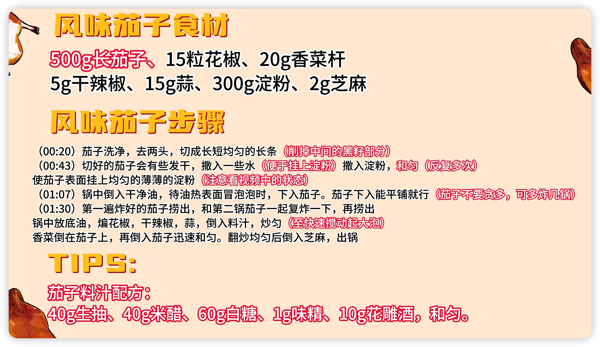

### 西红柿炒鸡蛋 

#### 一、 食材清单（供2\-3人份） 

#### 二、 详细步骤（核心：分炒、合炒、出汁、收汁） 

**第一部分：食材预处理（决定口感和风味）**

1. **处理西红柿**：西红柿洗净，在顶部划十字刀口，放入沸水中烫约30秒至表皮卷起，捞出过凉水，轻松撕去外皮。去皮后切滚刀块或小瓣。**去皮能获得更细腻顺滑的口感，且更易出汁**。

2. **准备鸡蛋液**：鸡蛋打入碗中，加入**半茶匙盐、少许白胡椒粉、1汤匙清水或料酒**。用筷子**朝一个方向**充分搅打均匀，直至蛋液表面出现一层细密泡沫。**加水淀粉能使炒出的鸡蛋更蓬松滑嫩，并去腥**。

3. **准备配料**：小葱切末，葱白和葱绿分开放。大蒜切片（如用）。

**第二部分：分炒鸡蛋（成就蓬松滑嫩）**

1. **热锅热油**：锅烧热，倒入**比平时炒菜稍多的油**（约2\-3汤匙），油温烧至**七成热**（油面有轻微波纹，插入筷子周围有密集小气泡）。

2. **滑炒定型**：将蛋液一次性倒入锅中，蛋液会迅速膨胀。**不要立刻翻炒**，待底部定型、边缘微微翘起时，用锅铲快速划散成大小适中的块状。

3. **盛出备用**：待鸡蛋约**八成熟**（内部还有些湿润）时，立即盛出。**炒得嫩一些**，因为后续还要回锅。

**第三部分：炒制西红柿与合炒（融合酸甜汤汁）**

1. **炒香底料**：锅中补少许油，放入葱白末和蒜片（如用），小火煸炒出香味。

2. **炒软出汁**：转中大火，倒入西红柿块，快速翻炒。加入**剩余半茶匙盐**，盐能帮助西红柿更快析出水分。

3. **焖煮出沙**：翻炒约1\-2分钟至西红柿变软后，加入**白糖**和约50ml清水。盖上锅盖，转中小火焖煮**2\-3分钟**，直到西红柿完全软烂，汤汁变得红润浓稠。

4. **合炒入味**：打开锅盖，转回大火。将炒好的鸡蛋倒回锅中，与西红柿汤汁快速翻炒均匀，让每一块鸡蛋都裹上浓郁的汤汁。

5. **勾芡增稠（可选）**：如果喜欢汤汁浓稠能挂在鸡蛋上，可淋入调好的水淀粉，快速翻炒至汤汁明亮浓稠。

6. **出锅点睛**：撒上葱绿末，淋上几滴香油（可选），翻炒两下即可出锅装盘。

#### 三、 成功关键与风味解析 

1. **“鸡蛋加液”与“热油快炒”的嫩滑秘诀**：

    - **蛋液加“水”**：在蛋液中加入少量清水或料酒，搅拌时会产生更多气泡。下锅后，水分迅速汽化，能使鸡蛋体积更蓬松，口感更水嫩。料酒还能有效去除蛋腥味。

    - **热油快炒**：油温要够热（七成热），蛋液倒入后能迅速膨胀定型。**炒至八成熟即出锅**，利用余热让鸡蛋内部达到刚好的熟度，保持滑嫩，避免炒老变硬。

2. **“西红柿去皮”与“加糖焖煮”的酸甜平衡法**：

    - **去皮口感佳**：西红柿外皮在烹饪后口感不佳，影响整体体验。去皮后，果肉能更快融化成汁，口感更细腻。

    - **糖盐协作**：**盐**能加速西红柿细胞破裂，促进汁水渗出。**白糖**则能完美中和西红柿天然的酸味，并激发出其深层次的鲜甜风味，使汤汁酸甜适口，回味悠长。焖煮过程让西红柿的“沙”感完全释放，与汤汁融为一体。

3. **“分步炒制”与“汤汁融合”的经典逻辑**：

    - **先分后合**：鸡蛋和西红柿分开炒制，是保证各自达到最佳状态的关键。鸡蛋追求嫩滑，需要高温快炒；西红柿追求软烂出汁，需要中火焖煮。分炒后再合，才能兼顾两者。

    - **汤汁是灵魂**：这道菜的精华在于那红亮酸甜的汤汁。足够的焖煮时间、适量的水分以及糖盐的恰当比例，共同造就了能完美包裹鸡蛋、拌饭一绝的浓郁汤汁。

**风味解析**：一勺舀起，金黄的**鸡蛋块蓬松滑嫩，吸饱了红亮浓稠的西红柿汤汁**。入口是**鲜明的酸甜咸鲜复合味**，瞬间打开味蕾。西红柿的果酸被白糖温柔地驯服，转化为醇厚的鲜甜，与炒蛋的油脂香完美融合。葱花的清香点缀其间，让整体风味层次更加丰富。它是一道看似简单，却能将最普通的食材转化为极致温暖慰藉的家常至味。

#### 四、 营养价值分析与健康食用建议 

- **主要营养构成（估算，每份约300克）**：

    - **热量**：约 200\-250千卡。热量主要来自烹饪用油和鸡蛋。

    - **蛋白质**：约 12\-15克。**优质蛋白质的重要来源**（主要来自鸡蛋）。

    - **脂肪**：约 15\-20克。主要来自鸡蛋黄和烹饪用油，包含必需脂肪酸。

    - **碳水化合物**：约 10\-15克。主要来自西红柿和少量添加的糖。

    - **维生素C**：较丰富。来自西红柿，加热后部分损失，但番茄红素吸收率提高。

    - **番茄红素**：**丰富**。一种强抗氧化剂，加热和与油脂结合后，生物利用率大幅提高。

    - **钠含量**：**中等**。主要来自添加的盐。

- **健康风险提示**：

    1. **用油量**：传统做法为追求鸡蛋蓬松和香气，用油量可能偏多。

    2. **糖添加**：为平衡酸味添加的糖，增加了游离糖的摄入。

    3. **营养流失**：西红柿中的维生素C对热敏感，长时间加热会部分损失。

- **健康改良与食用建议**：

    1. **家庭制作优化**：

        - **减油策略**：使用不粘锅，可减少一半的用油量。炒鸡蛋时，蛋液中加少许牛奶或水，同样能使鸡蛋嫩滑，减少用油需求。

        - **减糖/代糖**：使用熟透的沙瓤西红柿，其天然甜度高，可减少或不加糖。或使用赤藓糖醇等代糖。

        - **保留营养**：西红柿可不去皮（需彻底清洗），皮中膳食纤维和营养素更丰富。采用“快炒\+短时焖煮”的方式，减少维生素C的损失。

        - **增加食材多样性**：可加入木耳、青椒、洋葱等蔬菜同炒，增加膳食纤维和维生素。

    2. **科学搭配食用**：

        - **作为优质蛋白来源**：非常适合儿童、学生及需要补充优质蛋白的人群。

        - **提升番茄红素吸收**：与鸡蛋中的脂肪一同烹饪，能极大促进脂溶性抗氧化剂番茄红素的吸收，营养价值更高。

        - **搭配主食**：是米饭、面条、馒头的绝佳搭档，但需注意控制主食量。

    3. **特殊人群**：

        - **需控制体重者**：注意优化用油和用糖量，并搭配足量的蔬菜和适量主食。

        - **糖尿病患者**：建议使用代糖或不加糖，并搭配粗粮主食，注意监测血糖。

        - **一般人群**：是一道营养均衡、快手美味的家常菜，注意整体饮食搭配即可。

### 炝大头菜

用料：大头菜、蒜、干辣椒、花椒、生抽、醋、盐、白糖、食用油、蚝油

1. 大头菜洗净，手撕成大块备用。蒜切末，干辣椒剪成段。

2. 锅中倒油，油热后放入花椒、干辣椒段和蒜末爆香。

3. 放入大头菜大火快速翻炒至断生。

4. 加入适量生抽、醋、盐和白糖调味，继续翻炒均匀即可出锅。

这道炝大头菜口感爽脆，麻辣开胃，是餐桌上的一道快手好菜。

### 炒洋葱

用料：洋葱、鸡蛋、盐、生抽、食用油

1. 洋葱切成丝备用，将鸡蛋打入碗中搅散。

2. 锅中倒油，油热后倒入鸡蛋液，炒熟盛出。

3. 锅中再加入少许油，放入洋葱丝煸炒至变软。

4. 加入炒好的鸡蛋，放入适量盐和生抽，翻炒均匀即可出锅。

这道炒洋葱简单易做，营养丰富，是一道家常美味。

### 炒蒜苔

准备食材：蒜苔、蒜、姜、干辣椒、生抽、盐、鸡精、食用油。

1. 蒜苔洗净切段，蒜、姜切末，干辣椒切段备用。

2. 热锅凉油，放入姜蒜末和干辣椒段煸炒出香味。

3. 加入蒜苔翻炒至断生。

4. 调入生抽、盐、鸡精，继续翻炒均匀即可出锅。

### 擂椒皮蛋​​

以下是根据湘菜传统做法总结的​**​擂椒皮蛋​**​（又名擂椒锤皮蛋）制作指南，融合多来源核心技巧与创新改良点，帮助在家轻松复刻地道风味：

#### 🥗 ​**​核心食材清单​**​（2人份）

|​**​食材​**​|​**​用量​**​|​**​处理要点​**​|
|---|---|---|
|皮蛋|2\-3个|选择松花皮蛋，外壳完整无裂纹为佳|
|辣椒|8\-10根（约200g）|推荐线椒、螺丝椒或二荆条（辣度足）|
|大蒜|4\-6瓣|压扁或切末，生蒜提味更鲜明|
|​**​调味料​**​|生抽2勺、香醋1勺、香油1勺|基础配比（咸鲜酸平衡）|
|增香辅料|白糖半勺、盐适量、蚝油（可选）1勺|白糖中和辣味，蚝油提升层次|

#### 🔥 ​**​关键步骤详解​**​

​**​1\. 辣椒处理：虎皮是灵魂！​**​

- ​**​🔥 干煸法（传统）​**​：锅烧热不放油，中火放入擦干水分的辣椒，用锅铲按压至表皮起皱、出现焦斑（虎皮状），约需5\-8分钟 。

- ​**​🍳 懒人法​**​：辣椒刷薄油，空气炸锅180℃烤15分钟（中途翻面），同样达到虎皮效果 。

💡 辣椒籽去留：保留部分增香，但过多易发苦；去籽可降低辣度 。

​**​2\. 皮蛋预处理：去腥增弹​**​

- 剥壳后用温水冲洗，减少石灰味。

- ​**​㊙️ 升级口感​**​：干锅烧热，放入皮蛋小火炙烤30秒，皮蛋更Q弹且去涩味 。

​**​3\. 捶打融合：核心技法​**​

1. ​**​顺序​**​：辣椒\+大蒜 → 皮蛋 → 调味料 。

2. ​**​工具​**​：

- 传统擂钵\+木杵：最佳选择，便于捣碎融合。

- 替代方案：深碗\+擀面杖（包保鲜膜防粘）。

1. ​**​力道​**​：匀速捶打至辣椒成绵密丝状，皮蛋保留小块（忌过度成泥）。

#### ​**​4\. 调味关键​**​

- 先加生抽、盐、糖，最后淋香醋（避免挥发）。

- 香油最后淋入增香，芝麻油风味更佳 。

#### 🌶️ ​**​风味升级技巧​**​

1. ​**​层次提升​**​：

- 加1/4勺辣椒粉（增辣）或花椒油（麻香）。

- 撒花生碎/香菜末增添口感 。

1. ​**​减辣方案​**​：

- 用青椒替换1/3辣椒，或加1勺糖/半勺醋中和 。

1. ​**​健康改良​**​：

- 免油炸，全程少油操作（空气炸锅版热量更低）。

#### ⚠️ ​**​注意事项​**​

- ​**​防护​**​：操作辣椒戴手套，避免辣手（若刺激皮肤，用醋浸泡缓解）。

- ​**​现做现吃​**​：放置过久易出水，风味流失 。

- ​**​搭配推荐​**​：拌米饭、夹馒头或卷饼，配清淡汤羹解辣 。

### 蒜苔腊肉

### 西红柿炒土豆

#### 🥗 ​**​基础食材清单​**​（2人份）

|​**​食材​**​|​**​用量​**​|​**​处理方式​**​|
|---|---|---|
|土豆|2个（约300克）|去皮切2\-3毫米薄片，冷水浸泡10分钟去淀粉|
|西红柿|1个（约200克）|切厚片或块状（去皮口感更佳）|
|大葱/小葱|1根|切葱花|
|蒜|2瓣（可选）|切片或末|
|​**​调味料​**​|盐、白糖、鸡精/味精|适量|
|油|适量|推荐花生油或菜籽油|

#### 🍳 ​**​基础版做法（免油炸）​**​

1. ​**​预处理土豆片​**​：

浸泡后的土豆片沥干，沸水中焯烫1分钟至半透明（保留脆感）或3分钟至软糯，捞出备用。

1. ​**​爆香辅料​**​：

热锅冷油，中火下葱白段和蒜片爆香（约10秒）。

1. ​**​炒西红柿​**​：

加入西红柿块，中火翻炒2\-3分钟至软烂出红汁，可加1勺白糖提鲜。

1. ​**​混合翻炒​**​：

倒入土豆片，快速翻炒均匀，加盐、少许鸡精调味。若汤汁少，可加2勺热水焖1分钟使味道融合。

1. ​**​出锅​**​：

撒剩余葱花，关火装盘。

#### 🔥 ​**​酥香版做法（油炸土豆片）​**​

1. ​**​炸土豆片​**​：

土豆片沥干后，中火炸至微黄捞出（约2分钟），转大火复炸10秒至金黄酥脆，控油备用。

1. ​**​炒西红柿汁​**​：

留底油爆香葱花，下西红柿炒出红油，可加半勺白醋或番茄酱增酸。

1. ​**​混合调味​**​：

倒入炸好的土豆片，加盐、糖、鸡精快速翻炒，撒葱花即可。

#### 🌟 ​**​口感调节与专业贴士​**​

1. ​**​酸甜平衡​**​：

- 喜酸：用未熟西红柿或加半勺白醋。

- 喜甜：增加白糖（1\-2勺）或少量番茄酱。

1. ​**​土豆软硬度​**​：

- 脆口：焯水/油炸时间缩短，最后入锅快炒。

- 软糯：延长翻炒时间或加盖焖2分钟。

1. ​**​风味升级​**​：

- 加蚝油/生抽提鲜（出锅前淋半勺）。

- 添加牛至叶（西式香料）或十三香增加层次。

1. ​**​健康改良​**​：

- 免油炸版热量更低（约200千卡/份）。

- 土豆浸泡去淀粉后更爽口，且减少吸油量。

💡 ​**​温馨提示​**​：西红柿的茄红素经加热后更易吸收，搭配土豆的膳食纤维，有助消化和胃。建议搭配米饭食用，汤汁拌饭风味更佳！

### 炒芹菜

准备食材：芹菜、猪肉、葱、姜、蒜、生抽、盐、料酒、淀粉、食用油。

1. 芹菜洗净切段，猪肉切丝，用料酒、生抽、淀粉腌制片刻。

2. 葱、姜、蒜切末备用。

3. 热锅凉油，放入肉丝煸炒至变色。

4. 加入葱、姜、蒜末炒香。

5. 放入芹菜翻炒均匀，加入适量盐调味。

6. 继续翻炒至芹菜熟透即可。

### 炒豆皮

食材准备：豆皮、青椒、红椒、葱姜蒜、生抽、盐、鸡精、食用油。

1. 豆皮切成条，用开水焯一下，捞出沥干水分。

2. 青红椒切丝，葱姜蒜切末备用。

3. 热锅凉油，放入葱姜蒜末爆香。

4. 加入青红椒丝煸炒片刻。

5. 放入豆皮，翻炒均匀。

6. 加入适量生抽、盐、鸡精调味。

7. 继续翻炒至食材入味即可出锅。

### **炒土豆丝**

准备食材：土豆、蒜、葱、盐、醋、生抽、食用油。

1. 土豆切丝，用清水冲洗掉表面淀粉，浸泡在水中备用。

2. 蒜切末，葱切成葱花。

3. 锅中倒油，油热后放入蒜末爆香。

4. 捞出土豆丝沥干水分，放入锅中翻炒。

5. 加入适量盐、生抽调味，出锅前淋入少许醋，撒上葱花即可。

### 韭菜炒鸡蛋

1. 韭菜洗净切段，鸡蛋打入碗中搅散。

2. 锅中倒油，油热后倒入鸡蛋液，炒熟盛出。

3. 锅中再倒少许油，放入韭菜快速翻炒。

4. 韭菜稍软后加入炒好的鸡蛋，加盐调味，翻炒均匀即可出锅。

### 咖喱土豆饭

1. 凉油加入咖喱粉煸炒后加入切块的胡萝卜、洋葱、土豆

2. 加入一块黄油，继续煸炒

3. 加入热水，焖15min

### 手锤茄子卷饼 

#### 一、食材清单（2人份，卷饼标准） 

💡 进阶路子：蒜臼里可以加一颗**青花椒**同锤，麻香更野；花生碎里掺点**熟芝麻**同捣，香气翻倍；卷饼前铺一片**生菜叶**解腻。

---

#### 二、详细步骤（核心：整茄蒸 → 手锤烂 → 焙虾皮 → 调汁拌匀 → 卷饼） 

**第一部分：蒸茄子（整根蒸是关键）**

1. 紫长茄洗净，**蒂留着**（防蒸时水从蒂口进），**整根**放蒸屉，水开后中火蒸**12–15分钟**——时间看茄粗：筷子能轻松扎透、皮发皱就熟了。

2. 蒸好稍晾，**手撕成条**或**直接进蒜臼**（带皮蒸的皮一撕就掉，怕皮影响口感可以撕了再锤，不怕的就带皮锤，花青素更多）。

> ⚠️ 茄子别切了蒸：切面进水，蒸完水汪汪，锤出来成"茄汤"不是"茄泥"。整根蒸锁水，出来是绵的。
> 
> 

**第二部分：手锤（全菜灵魂动作）**

1. 蒜瓣拍扁丢蒜臼底，加¼茶匙盐（利用盐的研磨力助蒜出泥），先**把蒜捣成粗泥**（别太细，要有蒜粒感）。

2. 撕好的茄条丢进蒜臼，**蒜臼槌（或擀杖头、或大勺背）"锤\+压\+转"**——不是搅是锤，让茄肉在槌压下**成丝成缕但不成细腻泥**，保留粗纤维感。这步就是"手锤茄子"和"蒜泥茄子"的区别：后者是拌，前者是锤，口感更野。

3. 锤到约70%烂、还看得到茄肉丝缕就停（别锤成婴儿辅食那种泥）。

**第三部分：焙虾皮 \+ 调汁**

1. 小锅不放油或刷**极薄一层油**，虾皮下锅小火焙**30秒–1分钟**，听到"噼啪"声、虾皮微黄出香立刻关火（焙过头腥变苦）。放凉备用。

2. 小碗调汁：生抽2 \+ 香醋1 \+ 白糖¼茶匙 \+ 香油1茶匙 \+ 辣椒油（如用），搅匀。

**第四部分：合料 \+ 卷饼**

1. 锤好的茄泥挪到大碗里，倒调汁，撒**焙虾皮 \+ 花生碎（大部分）**，轻拌几下让茄丝裹上汁、虾皮花生分布匀。

2. 尝一口咸淡，不够补盐或生抽。

3. 卷饼蒸热/烙热铺开，中间舀一勺手锤茄子，顶上再撒**剩下的花生碎**（这半份后撒保脆），加葱花/香菜/黄瓜条如用，卷紧。

> 💡 花生碎分两次：一半拌进去入味，一半后撒保脆——全拌进去最后全皮了。
> 
> 

---

#### 三、成功关键与风味解析 

1. **"整根蒸 \+ 手锤不搅"是这道菜的两个身份证**

2. 切了蒸=水茄；搅成泥=蒜泥茄子。手锤茄子要的是"蒸完水分被茄肉锁住、锤完丝缕还看得见"，口感是"绵里带丝、丝里挂汁"，比纯泥多一层嚼感。蒜臼最好用，没有就用深碗\+勺背"压\+转"也能模拟七八成。

3. **虾皮必须焙，不能洗完直接丢**

4. 淡干虾皮有水腥气，直接拌进热茄子里会"腥\+闷"；小火焙30秒，水分跑掉、鲜味物质浓缩，和茄子的绵、花生的脆才搭。焙完放凉再用，热焙虾皮拌进去会让茄泥出水。

5. **花生碎"现捣 \+ 分两次撒"**

6. 买的花生碎放久了皮且不香，自家炸/烤一小把花生米（或买酒鬼花生去衣）现捣，留米粒大颗粒。分两次：拌时撒一半入味、上桌前撒一半保脆——这招和凉拌菜里花生后撒是一个逻辑。

7. **卷饼要"热软"不是"冷韧"**

8. 单饼/春饼蒸热或烙热10秒，软了才好卷不破；冷的直接卷会裂，茄泥还会漏。卷的时候茄泥别铺太满，留边，卷紧手法：底折→两边收→往前卷。

**风味解析**：第一口咬下去，卷饼的麦香软韧先顶住，手锤茄泥绵中带丝，蒜的辛在舌尖先铺，生抽香醋的咸酸跟着渗，焙虾皮在齿间"咔嗤"一下鲜爆，花生碎的脆和茄子的绵撞成两层——整体是"绵—辛—咸酸—脆—鲜"五层，配瓣生蒜是北方路子，配粥是夏天晚饭路子，单吃这卷配冰啤酒是巷口摊头的路子。茄子本身无味，但这堆料一锤，它就变成了"吸味海绵\+口感骨架"的双面担当。

---

#### 四、营养价值分析 

- **主要营养成分**（2人份）：

    - **紫长茄**：500g≈ 100kcal，膳食纤维3g\+，花青素（皮里）、钾、维生素P（芦丁，护血管），低脂低卡代表。

    - **虾皮**：20g≈ 40kcal，钙≈ 400mg（20g虾皮钙密度极高）、蛋白≈4g，但钠也不低（淡干也约600–800mg/100g）。

    - **花生碎**：50g≈ 285kcal，脂肪≈24g（不饱和为主），蛋白≈13g。

    - **卷饼**：4张≈ 300–350kcal。

    - **整份估算**：约750–800kcal（2人分），人均375–400kcal，蛋白\~18g，钙突出（茄皮花青\+虾皮钙双线）。

- **核心健康益处**：

    1. **紫茄皮的花青素\+芦丁**：抗氧化\+护血管，整根蒸带皮锤保留最多。

    2. **虾皮补钙**：20g虾皮钙≈400mg，是牛奶的4倍量级（但吸收率不如奶，胜在密度）。

    3. **低脂菜\+碳水卷饼**：整体脂肪来自花生和香油，可控；茄子本身是减脂友好食材。

- **食用建议与注意**：

    1. **适宜人群**：一般人群，尤其适合夏季开胃、补钙需求、老人孩子（茄子软、虾皮碎小心点）。

    2. **注意事项**：

        - **虾皮钠高**：淡干虾皮100g钠≈3000mg，20g≈600mg，高血压人群可减到10g或用"低盐虾皮"。

        - **茄子吸油属性**：这道菜茄子是蒸的不是油的，比"油焖茄子""地三鲜"健康三档，但花生碎\+香油别手抖多加。

        - **花生过敏**：换成炸黄豆碎或省略，口感稍逊但结构还在。

    3. **搭配建议**：单吃这卷配小米粥/绿豆汤是北方夏日晚饭标配；配蒜/生葱是男人们啤酒局；想更饱加个煮蛋同卷。

---

Mr\.Wang，这道手锤茄子卷饼的要诀四句给您收住：

> **紫茄整根蒸熟透，蒜臼加盐蒜先捣；**
> 
> **茄条入臼锤压转，绵中带丝是魂道；**
> 
> **虾皮小火焙去腥，花生现捣分两遭；**
> 
> \*\*热饼一卷蒜香冲，巷口摊味自家找。"
> 
> 

第一次做建议茄子选细紫长茄（肉糯皮薄）、蒸12分钟试筷、锤到"丝缕还看得见"就停——摸准了这手感，您家厨房就是那个路灯底下支摊手锤茄子的老头那味儿。祝您卷出那口绵茄脆花生、饼香裹蒜的快乐！🍆🥜🫓

### 东北大饭包

准备食材：米饭、土豆、茄子、鸡蛋、大葱、香菜、生菜、黄豆酱、花生米、咸鸭蛋

1. 土豆去皮蒸熟，压成泥状，茄子蒸熟，锤去水分，冲凉水放凉。

2. 锅中再放少许油，放入搅拌好的鸡蛋，快速搅拌，然后放入香其酱（加生抽、水，已搅拌好）

3. 大葱、香菜切碎，与土豆泥、米饭、炒好的鸡蛋酱、花生米、咸鸭蛋混合。

4. 用生菜叶包起混合好的食材即可食用。

#### 🥬 主要食材准备

在开始制作前，准备好以下核心食材是成功的第一步：

|类别|必备食材|可选增香/搭配|
|---|---|---|
|​**​“包裹皮”​**​|大白菜叶或大叶生菜（叶片大而完整）|\-|
|​**​主食基底​**​|米饭（推荐大米和小米混合的“二米饭”）|蒸熟的土豆泥、蒸熟的茄子条|
|​**​灵魂酱料​**​|鸡蛋、香其酱或豆瓣酱、咸鸭蛋|花生米|
|​**​清香配菜​**​|香菜、小葱（或香葱）|青椒、黄瓜、胡萝卜|

#### 🍳 详细制作步骤

1. ​**​处理食材​**​

- ​**​菜叶​**​：将白菜叶或生菜叶清洗干净，放在通风处​**​控干水分​**​，这样包的时候才不容易破。

- ​**​米饭​**​：焖一锅米饭，水可以比平时略少一点，让米饭口感偏硬、松散一些，更适合做饭包。

- ​**​土豆泥/茄子（可选但推荐）​**​：将土豆和茄子去皮后蒸熟（约15\-20分钟，用筷子能轻松穿透即可）。然后将土豆压成泥，茄子撕成条。

- ​**​花生米​**​：如果是生花生米，可以用热锅凉油小火炒熟，放凉后会更加酥脆。

1. ​**​制作灵魂鸡蛋酱​**​

这是整个饭包的味觉核心。

- 将鸡蛋打散。锅中放适量油（可以稍多一点），油热后倒入蛋液，快速划炒成小块。

- 加入稀释好的东北大酱（或豆瓣酱），按照一个鸡蛋配一勺酱的比例，再加入约两勺水，中小火翻炒均匀，让酱汁和鸡蛋充分融合，炒至浓稠冒泡即可出锅。如果酱本身比较咸，可以加半勺糖来平衡味道。

1. ​**​准备清香配菜​**​

将香菜、小葱、青椒等洗净，分别切碎或切段备用。

1. ​**​组合与包裹​**​

有两种常见的方式，可以根据喜好选择：

- ​**​方式一：分别码放​**​。取一片大的菜叶，依次铺上米饭、土豆泥、茄子条、花生碎、各种切好的青菜，最后淋上鸡蛋酱。

- ​**​方式二：预先拌匀​**​。在一个大碗里，放入米饭、土豆泥、茄子、捏碎的熟花生米、香菜碎、葱碎等所有食材，再浇上鸡蛋酱，​**​戴上一次性手套​**​将所有材料充分抓拌均匀。然后将拌好的饭放在菜叶上。

- ​**​包裹​**​：像卷春饼一样，用菜叶将内部的饭料小心地包起来，底部折上来防止漏出，就可以享用了。

#### 💡 成功关键与风味升级贴士

|关键环节|核心技巧与建议|
|---|---|
|​**​菜叶选择与处理​**​|选择柔软且韧性强的大白菜叶或大叶生菜。务必控干水分，以免包裹时叶片破裂。|
|​**​米饭的口感​**​|米饭不宜过软过黏，松散的二米饭（大米\+小米）是经典选择，能更好地吸收酱料风味。|
|​**​鸡蛋酱的炒制​**​|这是风味的灵魂。炒酱时加少量水可以防止酱汁过干，并让酱香味更好地释放。根据酱的咸度，用糖来调和味道是关键。|
|​**​丰富的配料​**​|加入​**​土豆泥​**​能使内馅口感绵密，​**​花生碎​**​增添酥香，​**​茄子​**​能吸收汤汁，让风味更有层次。|
|​**​包和吃的技巧​**​|不要贪心放太多料，以免包不住。拿稳后从底部开始吃，享受每一口复合的美味。|

### 酸甜炒蛋

#### 🥚 一、基础版酸甜炒蛋（番茄酱风味）

​**​食材（2人份）​**​：

- ​**​鸡蛋​**​：3\-4个

- ​**​青红椒​**​：各半个（切丁，可选）

- ​**​葱蒜末​**​：少许

- ​**​番茄酱​**​：20克

- ​**​生抽​**​：5克

- ​**​香醋/陈醋​**​：15克

- ​**​白糖​**​：15克

- ​**​淀粉​**​：10克 \+ 清水15克（调水淀粉）

- ​**​料酒​**​：15克（去腥）

- ​**​盐​**​：1克（可选）

- ​**​食用油​**​：30毫升

​**​步骤​**​：

1. ​**​处理鸡蛋​**​：

- 鸡蛋打散，加入料酒、淀粉和清水搅匀（淀粉水使鸡蛋更嫩滑）。

1. ​**​煎蛋​**​：

- 热锅倒油（油稍多），烧至七成热（油微冒烟），倒入蛋液煎至两面金黄，划块盛出备用。

1. ​**​调制酱汁​**​：

- 小碗混合番茄酱、生抽、香醋、白糖，搅匀至糖融化。

1. ​**​炒制​**​：

- 锅留底油，爆香葱蒜末，加青红椒炒至断生。

- 倒入酱汁煮沸，加水淀粉勾芡至浓稠。

- 放入鸡蛋快速翻炒裹汁，10秒内出锅（避免鸡蛋变老）。

#### 🦀 二、升级版赛螃蟹风味（无蟹胜蟹）

​**​食材调整​**​：

- ​**​虾皮​**​：10克（增鲜，模拟蟹味）

- ​**​姜末​**​：15克（关键！模拟蟹黄腥香）

- ​**​老抽​**​：10克（代替生抽，增色）

- ​**​去番茄酱​**​：改用纯醋糖比例

​**​步骤变化​**​：

1. ​**​蛋液处理​**​：

- 鸡蛋打散后加入虾皮、姜末搅匀。

1. ​**​炒蛋​**​：

- 大火热油快速滑炒鸡蛋，刚凝固即盛出（保持嫩滑）。

1. ​**​酱汁调整​**​：

- 混合老抽、陈醋15克、白糖12克、料酒5克，姜末加倍。

1. ​**​融合​**​：

- 酱汁入锅烧沸，直接倒入鸡蛋快速翻匀，撒葱花出锅（不勾芡）。

#### 💡 关键技巧总结

1. ​**​鸡蛋嫩滑秘诀​**​：

- 蛋液加 ​**​淀粉水或料酒​**​（比例：1个蛋\+5克淀粉\+5克水），增加蓬松度。

- ​**​大火热油快炒​**​：油温七成热（180°C），缩短加热时间锁住水分。

1. ​**​酸甜平衡​**​：

- 基础版：番茄酱:糖:醋 ≈ 2:1:1（柔和酸甜）。

- 赛螃蟹版：醋:糖 ≈ 1:1，姜末提鲜是关键。

1. ​**​避免过咸​**​：

- 酱油已含盐，通常不需额外加盐（鸡蛋吸盐性强）。

1. ​**​升级口感​**​：

- 加木耳丝、胡萝卜丝等配菜，丰富层次。

- 勾芡汁需沸腾后倒入，避免结块。

#### 🍽️ 风味对比与适用场景

|​**​版本​**​|风味特点|适用场景|
|---|---|---|
|​**​番茄酱版​**​|酸甜浓郁，色泽红亮|家常下饭、儿童喜爱|
|​**​赛螃蟹版​**​|姜醋鲜香，仿蟹肉风味|宴客特色菜、低脂选择|

### 拔丝地瓜

以下是制作拔丝地瓜的详细步骤，综合多篇资料整理而成：

**一、食材准备** • 主料：红薯（地瓜）500克

• 辅料：白糖150\-200克，清水100克，食用油适量（用于炸制），淀粉2\-3勺（玉米淀粉或红薯淀粉）。

**二、制作步骤**

1. **处理红薯** • 去皮切块：红薯洗净去皮，切成滚刀块或3厘米大小的不规则块状。

• 浸泡清洗：切好的红薯块用清水浸泡5分钟，去除表面淀粉防止氧化变黑，捞出沥干水分。

• 裹淀粉：将红薯块均匀裹上一层干淀粉，可锁住水分并形成酥脆外壳。

1. **炸制红薯** • 油温控制：锅中倒入足量油，烧至6成热（约160\-180℃），放入红薯块中火炸至表面微黄，捞出沥油。

• 复炸提脆：待油温升至8成热（约200℃），将红薯复炸30秒至金黄酥脆，捞出控油备用。

1. **熬糖浆** • 糖水比例：锅中留少量底油（或直接放清水），加入白糖和清水（比例1:1），开小火慢熬。

• 观察糖色：糖浆从大泡转为密集小泡，颜色由白变浅黄再至琥珀色（约需5\-8分钟），期间需不停搅拌避免糊锅。

• 技巧：可加少量白醋（约1茶匙）延长拉丝效果。

1. **裹糖拔丝** • 快速翻炒：将炸好的红薯倒入糖浆中，快速颠锅或翻炒，使糖浆均匀包裹红薯块。

• 装盘技巧：将裹好糖浆的红薯盛入抹了香油的盘子，防止粘连，并配一碗凉水用于蘸食。

**三、关键技巧与注意事项**

1. 油温控制：首次炸用中火，复炸用高火，确保外脆内软。

2. 熬糖火候：糖浆熬至琥珀色立即关火，过火会发苦。

3. 防粘处理：装盘前盘子抹油或垫生菜叶，方便清洗。

4. 变式创新：可用苹果、香蕉替代红薯，但需裹蛋白糊或生粉。

**四、地域特色与食用文化** 拔丝地瓜是东北菜和鲁菜的代表，尤其在辽宁、山东等地广受欢迎。食用时蘸凉水可让糖衣快速凝固，形成脆壳，同时避免烫嘴。其甜香酥脆的口感，常作为宴席压轴菜或家庭聚会的趣味甜品。

如需更具体的操作演示或变式菜谱（如拔丝苹果、拔丝香蕉），可供参考

### 菜花合集

菜花（花椰菜）做法多样，关键在于保留其脆嫩口感和充分入味。结合不同烹饪方式与风味搭配，以下是几种经典又美味的做法及技巧：

#### 🌶️ ​**​一、干煸/干锅类（香辣浓郁）​**​

1. ​**​干锅菜花​**​

- ​**​核心技巧​**​：

- 菜花焯水至​**​五分熟​**​（水沸后煮1分钟），捞出沥干。

- 用​**​腊肉或五花肉​**​煸炒出油，加豆豉、豆瓣酱、花椒小火炒香。

- 大火快炒菜花，避免出水，最后加生抽、糖调味，转入烧热的砂锅保温上桌。

- ​**​升级版​**​：垫洋葱丝在锅底，加热时吸收汤汁更鲜美。

1. ​**​干煸腊味菜花​**​

- 腊肠切片煸炒至微焦，加入蒜末、黑胡椒粉提香，与焯水的菜花同炒，盐和生抽调味即可。

#### 🥗 ​**​二、清淡爽口类（保留原味）​**​

1. ​**​凉拌花菜​**​

- 菜花、木耳、胡萝卜焯水后冷水降温，加蒜末、盐、鸡精、香油拌匀，最后淋​**​花椒油​**​增香。

- ​**​小贴士​**​：用淡盐水浸泡菜花10分钟，杀菌去农残。

1. ​**​蒜蓉蒸西兰花（少油低脂）​**​

- 西兰花切小朵，加蒜末、蚝油、橄榄油拌匀，蒸锅上汽后蒸​**​7\~8分钟​**​，出锅淋香油。

- 蒸制保留更多维生素C，适合健身人群。

#### 🍅 ​**​三、酸甜开胃类​**​

1. ​**​番茄菜花​**​

- 番茄去皮切丁炒成酱汁，加糖中和酸味，放入焯水的菜花焖煮入味。

- 升级做法：用炸香的金蒜蓉调汁，浇在菜花上再蒸，风味更融合。

1. ​**​菜花番茄炒鸡蛋​**​

- 鸡蛋先炒成块备用，番茄炒软后加菜花、木耳，调味时加少许糖提鲜，最后混入鸡蛋。

#### 🍖 ​**​四、荤素搭配类（营养均衡）​**​

1. ​**​肉片烧菜花​**​

- 肉片用淀粉、料酒腌制后滑炒，加入焯水的菜花和胡萝卜片，生抽、胡椒粉调味，勾薄芡出锅。

- 挂浆肉片使汤汁包裹更均匀。

1. ​**​海米烧菜花​**​

- 泡发的海米与葱段煸香，加菜花翻炒，淋料酒、高汤烧透，盐和鸡粉调味。

#### 🔥 ​**​关键处理技巧（通用）​**​

1. ​**​清洗去农残​**​：

- 用淡盐水或​**​淀粉水​**​浸泡10分钟，去除虫卵和农药。

1. ​**​焯水与保脆​**​：

- 沸水焯1分钟断生，捞出​**​立即冷水降温​**​，锁住脆感。

- 替代方案：用空气炸锅200℃烘烤5分钟，再炒更香脆。

1. ​**​避免软烂​**​：

- 炒制时​**​少加水​**​，大火快炒；蒸制时间不超过8分钟。

1. ​**​增香法宝​**​：

- 花椒油、蒜末、豆豉、蚝油可显著提升风味层次。

#### 💎 ​**​推荐选择​**​

- ​**​追求香辣​**​：干锅菜花（腊肉\+豆瓣酱）

- ​**​低脂健康​**​：蒜蓉蒸西兰花

- ​**​家常下饭​**​：番茄菜花或肉片烧菜花

菜花本身吸味强，调味宜稍重，但需注意豆瓣酱、生抽含盐量高，后期加盐前先尝味。根据口味调整辣度（加干辣椒）或酸甜比（糖醋比例），灵活适配全家喜好！

### 炸货

|炸货种类|主要特点（口感/风味）|预估制作难度（1\-5级）|预估准备和制作时间|
|---|---|---|---|
|​**​茄盒​**​|外酥里嫩，肉香与茄香融合，饱满多汁|中级 \(3\)|约50分钟|
|​**​萝卜丸子​**​|外焦里嫩，口感Q弹，萝卜清香爽口|初级 \(2\)|约40分钟|
|​**​藕盒​**​|藕片清脆，肉馅鲜香，整体酥脆可口|中级 \(3\)|约50分钟|
|​**​炸蘑菇​**​|口感酥脆，咸香可口，有类似肉类的嚼感|初级 \(2\)|约30分钟|

下面是它们的详细做法：

#### 🍆 一、茄盒制作步骤

茄盒外酥里嫩，肉馅鲜香，是卷饼的扎实搭档。

1. ​**​准备肉馅​**​：猪肉馅中加入​**​葱花、姜末、盐、胡椒粉、生抽、料酒、蚝油​**​等调味料，​**​顺着一个方向​**​搅拌均匀，腌制15分钟使其入味。

2. ​**​处理茄子​**​：茄子洗净后切成​**​薄片​**​（约0\.5厘米厚），每两片之间不切断，形成一个个“茄夹”。切好的茄子可放入​**​盐水​**​中浸泡片刻，以防氧化变黑。

3. ​**​夹入肉馅​**​：将腌制好的肉馅​**​均匀地​**​夹入茄子片中，用手轻轻压紧，确保肉馅不会掉出。

4. ​**​调制面糊​**​：碗中打入​**​鸡蛋​**​，加入​**​面粉​**​和​**​清水​**​（或啤酒），搅拌成​**​无颗粒的均匀面糊​**​。面糊的稠度以能挂在茄盒上为宜。有些配方会加入淀粉（如玉米淀粉），比例通常是面粉和淀粉2:1。

5. ​**​裹糊炸制​**​：

- 将夹好肉馅的茄盒​**​均匀裹上​**​面糊。

- 锅中油烧至​**​六七成热​**​（约160\-180°C），下入茄盒，用​**​中小火慢炸​**​。

- 炸至​**​表面金黄酥脆​**​后即可捞出​**​控油​**​。

​**​💡 小技巧​**​：想要茄盒更酥脆，可以​**​复炸一次​**​：第一遍炸熟后捞出，升高油温再快速炸约20\-30秒。炸好的茄盒可以直接吃，也可以蘸番茄酱、椒盐等调料食用。

#### 🥕 二、萝卜丸子制作步骤

萝卜丸子外焦里嫩，带着清甜，能给卷饼增添丰富的口感。

1. ​**​处理萝卜丝​**​：青萝卜或白萝卜​**​洗净去皮​**​，刨成或切成​**​细丝​**​。在萝卜丝中加入​**​适量盐​**​拌匀，腌制10\-15分钟，​**​杀出水分​**​。

2. ​**​挤水调味​**​：用手或纱布​**​挤干萝卜丝的水分​**​（但不要挤得太干，保留少许水分丸子更松软）。加入​**​鸡蛋、十三香（或五香粉）、白胡椒粉、葱末、姜末​**​等调料，搅拌均匀。

3. ​**​添加面粉​**​：​**​分次​**​加入​**​面粉​**​，边加边搅拌，直到萝卜丝和粉类混合成​**​黏稠的糊状​**​，可以用手轻松团成丸子的程度即可。

4. ​**​炸制丸子​**​：

- 锅中油烧至​**​五成热​**​（约150°C）。

- 用虎口挤出丸子或用勺子团成丸子，​**​小火​**​下入油锅。

- 下入所有丸子后转​**​中小火​**​，待丸子浮起，表面炸至​**​金黄​**​即可捞出控油。

​**​💡 小技巧​**​：萝卜丝尽量切细一些，这样炸出来的丸子口感更细腻。炸制时保持中小火，避免外焦里生。

#### 🪷 三、藕盒制作步骤

藕盒结合了莲藕的清脆和肉馅的鲜香，口感层次丰富。

1. ​**​准备肉馅​**​：与茄盒的肉馅调配方法类似，将猪肉末加入​**​葱姜末、料酒、生抽、盐、五香粉​**​等调料搅拌均匀备用。

2. ​**​处理莲藕​**​：莲藕​**​洗净去皮​**​，切成​**​薄片​**​（约0\.3\-0\.5厘米厚）。

3. ​**​夹入肉馅​**​：在两片藕片之间​**​夹入适量肉馅​**​，轻轻压紧。

4. ​**​挂糊与炸制​**​：

- 将夹好肉馅的藕盒​**​均匀裹上​**​一层干面粉，或放入面糊中挂糊（面糊做法可参考茄盒）。

- 油温六成热时下锅，用​**​中小火炸至两面金黄​**​，捞出​**​沥油​**​即可。

​**​💡 小技巧​**​：炸藕盒时保持中小火，避免油温过高导致外表焦糊而内部未熟。

#### 🍄 四、炸蘑菇制作步骤

炸蘑菇口感酥脆，咸香可口，是卷饼的绝佳素食选择。

1. ​**​处理蘑菇​**​：平菇撕成小条，​**​清洗干净​**​，并​**​用力攥干水分​**​（水分越少越容易炸脆）。

2. ​**​调制面糊​**​：碗中加入​**​面粉​**​、​**​鸡蛋​**​、​**​盐​**​、​**​麻椒粉​**​（或花椒粉、五香粉等）以及​**​适量清水​（****冰镇啤酒更酥脆****）**​，搅拌成​**​均匀无颗粒的面糊​**​（面糊稠度以能挂在蘑菇上为宜）。面粉划 z 字型，不起筋

3. ​**​挂糊炸制​**​：

- 将攥干水分的蘑菇条放入面糊中，​**​均匀裹上面糊​**​。

- 油温六七成热时下入蘑菇，炸至​**​表面金黄​**​即可捞出控油。六成热下入筷子，有密集小气泡，另一锅记得要除渣升温。

​**​💡 小技巧​**​：蘑菇​**​一定要充分攥干水分​**​，这是酥脆的关键。同样，想要更酥脆的口感，可以进行​**​复炸​**​。

#### 🍳 万能炸货小贴士

掌握了具体做法，这些通用技巧能让你的炸货更成功：

- ​**​油温判断​**​：通常五六成热（约150\-180°C）适合下锅。可用筷子测试，插入油中周围起小泡即可。

- ​**​复炸更酥脆​**​：第一遍炸熟定型后捞出，升高油温（七八成热）再快速复炸一次（约20\-30秒），能逼出多余油脂，口感更酥脆且不易回软。

- ​**​控油减腻​**​：炸好的食物捞出后，可放在​**​厨房纸巾​**​或​**​吸油纸​**​上，吸除多余油分。

- ​**​安全第一​**​：下锅时沿锅边轻轻放入，防止热油溅出。不要一次下入太多，以免油温骤降。

### 炸货卷饼

|类别|具体项目|关键特点/推荐选择|
|---|---|---|
|​**​炸货选择​**​|鸡肉类|鸡胸肉（切条或块）、鸡柳|
||其他肉类|牛肉、羊肉、火腿肠|
||素食类|金针菇（需用豆腐皮卷起）、土豆片、豆腐卷|
|​**​饼皮选择​**​|市售饼皮|原味、全麦、菠菜味等，使用前可加热软化|
||自制饼皮（烫面）|中筋面粉加开水和少量冷水，柔软有嚼劲|
||其他选择|杂粮煎饼、春饼|
|​**​搭配辅料​**​|蔬菜类|生菜、黄瓜丝、胡萝卜丝|
||酱料类|甜面酱、番茄酱、芝麻酱、蒜蓉辣酱、自制复合酱|
|​**​炸货风味​**​|原味|突出肉类本身腌制后的香味|
||香辣|通过添加辣椒酱或腌制时加入辣椒粉等实现|
||孜然|腌制时或酱料中添加孜然粉|

#### 🔪 炸货制作要点

制作美味的炸货，需注重​**​腌制​**​和​**​炸制​**​。

1. ​**​鸡肉处理与腌制​**​：鸡胸肉切成1\.5\-2厘米宽的条或块。用刀背稍拍松，更易入味。腌制时，每300克鸡肉加入​**​蒜粉（2克）​**​、​**​黑胡椒粉（1克）​**​、​**​盐（3克）​**​、​**​生抽（5克）​**​、​**​蚝油（5克）​**​、​**​鸡蛋清（1个）​**​、​**​玉米淀粉（10克）​**​ 和​**​牛奶（20克）​**​。抓匀后密封冷藏​**​至少1小时​**​，若能腌制过夜更佳。牛奶使鸡肉更嫩，淀粉形成保护层锁住水分。

2. ​**​挂糊与炸制​**​：

- ​**​挂糊​**​：腌好的鸡肉可均匀裹上一层干淀粉，或蘸蛋液后再裹面包糠，以获得不同口感的酥脆外皮。

- ​**​油温控制​**​：油温升至​**​六成热（约180°C）​**​ 下锅。筷子插入油锅周围起小泡即表示油温合适。

- ​**​炸制与复炸​**​：中小火炸至表面金黄捞出。为使其更酥脆且减少油腻，可待油温升高后​**​复炸20\-30秒​**​。炸好后用​**​漏勺沥油​**​，并用厨房纸吸除多余油分。

1. ​**​其他炸货处理​**​：

- ​**​土豆片​**​：切好后​**​泡水去除表面淀粉​**​，擦干后再炸更脆。也可撒少许玉米淀粉抓匀再炸。

- ​**​金针菇卷​**​：用干豆腐皮包裹金针菇，并用香菜梗捆紧，防止散开。

#### 🫓 卷饼制作技巧

卷饼皮可选择市售或自制。

- ​**​使用市售饼皮​**​：市售卷饼皮（原味、全麦、菠菜味等）使用方便。使用前用平底锅或蒸锅加热软化，更柔软且不易破损。

- ​**​自制饼皮（以烫面饼为例）​**​：

- ​**​和面​**​：200克中筋面粉中加入1克盐拌匀，缓缓倒入120克开水搅拌成絮状，再加入30克冷水揉成光滑面团。盖湿布或保鲜膜​**​醒面15\-30分钟​**​。

- ​**​擀饼​**​：将醒好的面团搓条、分剂（每个约30克）。取两个剂子，中间刷一层油后叠合，擀成薄饼。此法烙出的饼易分层。

- ​**​烙饼​**​：平底锅烧热，​**​无需放油​**​，放入饼坯中小火烙至两面微黄、饼皮鼓起即可。烙好的饼用干净毛巾包好保温保湿。

#### 🥙 组合与食用

1. ​**​涂抹酱料​**​：在饼皮上均匀涂抹一层酱料（如甜面酱、番茄酱，或芝麻酱、甜面酱、蒜蓉辣酱混合的复合酱）。

2. ​**​放置配菜​**​：先铺生菜叶，再放黄瓜丝、胡萝卜丝等。生菜可隔开饼皮和炸货，防止饼皮被油炸物浸软。

3. ​**​放入炸货​**​：放入炸好的鸡柳等，可先去竹签。

4. ​**​卷饼​**​：将饼皮底部向上折，左右两边向中间折，再向上卷起。料多时，可像“襁褓”一样包裹。

#### ✨ 让卷饼更美味的小技巧

- ​**​酱料是灵魂​**​：尝试混合酱料，如芝麻酱\+甜面酱\+蒜蓉辣酱\+孜然粉\+白糖，或甜面酱\+番茄酱。用温水调至适宜稠度。

- ​**​丰富配菜​**​：除常见蔬菜，尝试​**​酸萝卜丝​**​解腻、​**​牛蒡丝​**​增香，甚至​**​苹果片​**​带来清新甜味。

- ​**​保持饼皮韧性​**​：和面时用开水烫面，使饼皮更柔软筋道，放凉后也不易变硬。

- ​**​减油方案​**​：可用​**​空气炸锅​**​制作炸货，同样香脆但用油更少。

### 炸串卷饼（家庭复刻版） 

##### 一：食材清单 

- **【单饼部分】**（可做6\-8张）

    - 中筋面粉：300克

    - 热水（约80℃）：180克（用于烫面）

    - 凉水：30克（用于调节）

    - 食盐：3克

    - 食用油：15克（和面用）

    - **油酥**：面粉15克 \+ 热油20克（混合成糊状）

- **【炸串部分】**（根据喜好选择，以下为常见组合）

    - **蔬菜类**：茄子（切厚片或条）、蘑菇（撕条）、金针菇（去根）、大头菜/包菜（撕片）、青椒（切块）、韭菜（捆扎）、土豆（切片）。

    - **豆制品/面筋类**：干豆皮（泡软切条）、腐竹（泡软切段）、面筋（切块）。

    - **肉类/加工品**：淀粉肠（切花刀）、大脸鸡排（切条）、鸡翅中（划刀）、里脊肉片（腌制）、骨肉相连、各种火锅丸子。

    - **其他**：油炸花生米（最后撒入增香）。

    - **炸制辅料**：食用油足量、竹签若干。

- **【五香酱部分】**（约200ml成品，可刷大量串）

    - **基底酱料**：甜面酱40克、黄豆酱10克、蒜蓉辣酱10克、海鲜酱10克（可省）、蚝油20克。

    - **干香料**：五香粉5克、孜然粉5克、熟白芝麻10克。

    - **调味**：白糖10\-15克、鸡精/味精3克（可选）。

    - **增香油**：食用油50克、蒜末20克、洋葱末30克。

    - **稀释**：清水约80\-100克。

##### 二：详细步骤 

**第一步：制作单饼（烫面法）**

1. **和面**：面粉中加入盐，先倒入热水，用筷子搅拌成絮状，再酌情加入凉水，揉成光滑面团。加入15克食用油，继续揉匀，盖湿布醒发30分钟。

2. **制酥与擀制**：醒好的面团分成剂子。取一个剂子擀成牛舌状，均匀抹上一层薄薄的**油酥**，然后从长边卷起，卷成条状后盘成圆形，压扁。

3. **烙饼**：将面团擀成直径约20厘米的薄饼。平底锅或电饼铛预热，刷薄油，放入饼胚，中小火烙至两面出现金黄色斑点，饼身鼓起即可。烙好的饼用湿布盖住保温，保持柔软。

**第二步：准备与炸制串串**

1. **预处理**：所有食材洗净、改刀、控干水分。茄子、蘑菇等易吸油的蔬菜，可以拍上薄薄一层干淀粉。肉类可提前用料酒、生抽、胡椒粉腌制。

2. **穿串**：用竹签将食材串好。蔬菜类如金针菇、韭菜可以用豆皮卷起来再穿串。

3. **炸制**：锅中倒入足量油，烧至六、七成热（约180℃，筷子插入周围冒密集气泡）。先下肉类、丸子等不易熟的食材，炸至金黄熟透捞出；再下蔬菜类，快速炸至断生、边缘微焦即捞出。**关键**：油温要高，使食材快速脱水，外酥里嫩不油腻。

**第三步：熬制灵魂五香酱**

1. **炸香料油**：锅中放50克油，小火下入蒜末、洋葱末，炸至金黄出香后捞出弃用，留底油。

2. **炒酱**：转最小火，倒入甜面酱、黄豆酱、蒜蓉辣酱、海鲜酱、蚝油，慢慢翻炒均匀，炒出酱香味。

3. **熬煮**：加入白糖、五香粉、孜然粉，翻炒均匀。倒入清水，转中火，边煮边搅拌，熬至酱汁冒泡、变得浓稠顺滑。

4. **增香**：关火，撒入熟白芝麻，搅拌均匀即可。晾凉后使用，风味更融合。

**第四步：组合成卷饼**

1. **拌串**：将炸好的串从签子上取下（或直接剪碎），放入大碗中。根据口味刷上或倒入适量五香酱，充分拌匀。

2. **卷制**：取一张单饼，铺上生菜叶（可选），将拌好的炸串菜码放在饼中央，可以再撒上一把油炸花生米增加口感。

3. **包裹**：将饼的下部向上折，左右两边向中间折，再整体向上卷起，形成一个“口袋”或长卷。用食品纸或保鲜膜包住底部，即可享用。

##### 三：成功关键与风味解析 

- **饼皮柔软是关键**：采用**烫面法**，破坏了面粉的筋性，使饼皮即使放凉也不会变硬，口感柔软且略带韧性，能很好地包裹住多汁的馅料。

- **炸串酥脆不油腻的秘诀**：**高油温快炸**。油温足够高（180℃以上）能使食材表面迅速定型、脱水，形成酥脆外壳，同时锁住内部水分，避免吸入过多油脂。蔬菜类需**彻底控干水分**再下锅，防止油溅。

- **五香酱的风味核心**：这款酱料的灵魂在于**复合酱香与五香风味的平衡**。甜面酱和黄豆酱提供咸甜底味，蚝油和海鲜酱（可省）提升鲜味，蒜蓉辣酱带来一丝蒜香和辣度。**五香粉**是点睛之笔，其复合香料味能有效解腻增香，是区别于普通甜辣酱的标志。熬制过程能激发所有酱料的香气，并让味道融合。

- **组合的智慧**：**先炸后拌**，让每一块食材都均匀裹上酱汁。用单饼卷起，饼的麦香与柔韧，中和了炸物的油腻与酱料的浓重，达到口感与味觉的完美平衡。花生米的加入提供了最后的香脆惊喜。

##### 四：营养价值分析与健康建议 

- **营养构成**：这是一道**高热量、高脂肪、高碳水化合物**的“满足型”食物。炸串部分提供了蛋白质（肉类、豆制品）和少量维生素、膳食纤维（蔬菜），但经过高温油炸，维生素损失较大，且脂肪含量剧增。单饼主要提供碳水化合物。酱料则含有较高的盐、糖和钠。

- **健康食用建议**：

    1. **控制频率与分量**：作为偶尔解馋的享受，不宜频繁食用。

    2. **优化食材选择**：多选择**蘑菇、茄子、青椒、豆制品**等食材，少选淀粉肠、鸡排等深加工肉类。肉类优先选择**里脊、鸡胸**等低脂部位。

    3. **改进烹饪方式**：可使用**空气炸锅**来制作“炸串”，能大幅减少用油量。蔬菜也可采用焯水或烤制的方式。

    4. **自制酱料控盐糖**：自制五香酱时，可酌情减少白糖、蚝油、甜面酱的用量，以控制整体糖分和钠的摄入。

    5. **搭配清爽饮品**：搭配大麦茶、柠檬水或无糖茶水，有助于解腻。

### 干煸四季豆

干煸四季豆是川菜经典家常菜，以​**​干香辣爽、外焦里嫩​**​为特色，核心在于通过高温煸炒去除四季豆水分，搭配肉末和香料激发复合风味。以下是综合多份食谱的专业做法及关键技巧：

#### 🛒 ​**​食材准备（2\-3人份）​**​

|​**​类别​**​|​**​推荐食材与用量​**​|​**​作用说明​**​|
|---|---|---|
|​**​主料​**​|四季豆 300\-500克|选细长鲜嫩品种，易熟入味|
|​**​肉类辅料​**​|猪肉末/五花肉粒 80\-100克|肥瘦相间（3:7），增香不柴|
|​**​干料香料​**​|干辣椒 5\-10克、花椒 3\-5克|提供麻辣底味，剪段更易出香|
|​**​调味料​**​|蒜末 10克、姜末 5克|去腥提鲜|
||生抽 10ml、盐 3\-5克|基础咸鲜|
||白糖 3克、鸡精/味精 2克（可选）|调和辣味，平衡口感|
|​**​其他​**​|食用油 适量|炸制用油需足量（约300ml）|
||芽菜/冬菜/外婆菜 20克（可选）|提升咸鲜层次，替代盐分|

​**​选材关键​**​：四季豆需摘去两端筋络，掰成​**​5\-6厘米段​**​，确保受热均匀。

#### 🔪 ​**​制作步骤（传统油炸法）​**​

1. ​**​预处理四季豆​**​

- 四季豆洗净后彻底沥干（或用厨房纸吸干），防止炸制溅油。

- ​**​油温控制​**​：锅中倒油烧至​**​160\-180°C（六成热）​**​，分批下四季豆，中火炸至​**​表皮起皱、边缘微焦​**​（约3分钟），捞出沥油。​**​复炸更酥脆​**​：升高油温至190°C（七成热），复炸20秒。

1. ​**​炒香配料​**​

- 留底油（约15ml），小火煸香花椒、干辣椒至棕红，加姜蒜末、肉末炒至酥香吐油。

- 加入芽菜/冬菜碎炒出咸香（若用豆瓣酱，此步需煸出红油）。

1. ​**​融合调味​**​

- 倒入炸好的四季豆，转大火快速翻炒。

- 调味：加生抽、盐、白糖，沿锅边烹入几滴醋增香（可选）。

- 撒白芝麻、葱花翻匀，立即出锅。

#### 🍳 ​**​专业技巧与避坑指南​**​

1. ​**​火候关键​**​：

- ​**​炸四季豆​**​：油温不足易吸油软榻，过高则外糊内生。复炸逼出多余油脂，保持酥脆。

- ​**​煸炒香料​**​：花椒干辣椒需小火慢煸，避免焦苦；肉末炒至金黄酥脆再混合。

1. ​**​入味秘诀​**​：

- ​**​先关火再调味​**​：关火后撒盐，利用余温使盐分附着四季豆表面，解决“不易入味”问题（盐量比炒菜多1倍）。

- ​**​替代方案​**​：少油版可将炸改为​**​干煸​**​：热锅少油，直接煸炒四季豆至皱皮（需10分钟以上），但耗时较长。

1. ​**​安全要点​**​：

- ​**​四季豆必须熟透​**​：生豆含皂苷易中毒，炸至皱皮或煸至无青涩味才安全。

1. ​**​风味升级​**​：

- 加少许​**​宜宾芽菜​**​或​**​梅干菜​**​，咸香突出川味精髓。

- 起锅前淋​**​花椒油/香油​**​，香气更浓郁。

#### 🌶️ ​**​口味调整建议​**​

- ​**​减辣增鲜​**​：减少干辣椒，加泡发的​**​虾米或干贝碎​**​提鲜。

- ​**​素食版​**​：省略肉末，用​**​香菇丁\+酱油​**​模拟肉香。

- ​**​宴客版​**​：搭配​**​炸花生米​**​增加口感层次。

#### 🍽️ ​**​经典搭配与营养价值​**​

|​**​搭配​**​|​**​推荐理由​**​|
|---|---|
|​**​白米饭​**​|吸附油脂，平衡麻辣|
|​**​冰镇啤酒​**​|解辣解腻，适合夏季|
|​**​营养价值​**​|四季豆富含膳食纤维与维生素C；猪肉提供优质蛋白，但油炸版热量较高（约350大卡/份），建议控制食用频率。|

### 蘑菇炒肉

#### 🍳 详细制作步骤 

**1\. 食材预处理** 

- **蘑菇处理**​：将蘑菇撕成小块或切成厚片（约3\-4毫米厚，太薄易碎）。然后进行关键一步——​**焯水**​：锅中烧水，水开后放入蘑菇，焯烫约1\-2分钟后捞出沥干。此举能有效去除蘑菇的土腥味并避免烹饪时出水过多。

- **肉片准备**​：猪肉（梅花肉）**逆着纹理**切成薄片（将肉稍冷冻至定型会更好切）。放入碗中，加入酱油、料酒、淀粉和少许胡椒粉，抓匀腌制**10\-15分钟**。淀粉和料酒能锁住水分、去腥增嫩。

**2\. 滑炒肉片** 

锅烧热后倒油，油温五成热时放入腌好的肉片，快速滑炒至肉片变色、约八成熟后盛出备用。**热锅温油**下肉片能有效防粘。

**3\. 合炒成菜** 

1. 用锅内底油（或酌情添加少许油），放入葱、姜、蒜爆香。

2. 倒入焯好水并充分沥干的蘑菇，用**中大火**快速翻炒，直至蘑菇变软。

3. 将之前炒好的肉片倒回锅中，与蘑菇一同翻炒均匀。

4. 依次加入适量生抽、蚝油（可选）调味，可根据口味加入少许糖提鲜。**盐一定要最后放**​，或在酱油、蚝油之后尝过咸淡再决定加多少，以免蘑菇过早出水。

5. 如果喜欢汤汁浓郁的口感，可在出锅前淋入少许水淀粉勾薄芡。

#### 💡 成功小贴士 

- **蘑菇选择与处理**​：不同蘑菇风味各异，平菇软滑，口蘑肥厚，都可按此法操作。焯水后**一定要挤干水分**​，这是成品干香的关键。

- **肉片嫩滑的秘诀**​：​**逆纹切肉**是保证肉片口感不柴的首要关键。腌制时加入淀粉和油，以及**滑炒时控制好油温和时间**​（变色即捞出），都能有效保持肉片嫩滑。

- **火候把控**​：蘑菇下锅后需保持**中大火快炒**​，迅速蒸发掉部分水汽，能激发蘑菇的香气。

- **风味变化**​：可以根据口味偏好，在爆香时加入干辣椒或花椒增香，或者在起锅前撒上香菜段。

### 

### 木须肉

#### 🥗 准备食材 

木须肉的传统搭配非常丰富，以下是一份常见的食材清单

#### 🍳 详细步骤 

1. **处理食材**

    - **猪肉切片/切丝**​：将猪肉逆着纹理切成薄片或细丝，这样吃起来口感更嫩 。

    - **腌制肉片**​：在肉片中加入1勺料酒、1勺淀粉、少许盐和胡椒粉，抓匀腌制10\-15分钟。加入淀粉和蛋清（可选）可以使肉片在炒制后更加滑嫩 。

    - **准备配菜**​：将干木耳和黄花菜分别用冷水泡发，洗净后木耳撕成小朵，黄花菜切去硬根。黄瓜、胡萝卜（如果用的话）切成菱形片或普通片。葱姜蒜切末或丝 。

    - **打散鸡蛋**​：将鸡蛋打入碗中，加少许盐和几滴料酒（有助于去腥增嫩），搅打均匀备用 。

2. **滑炒鸡蛋**热锅凉油，油温升高后倒入蛋液，用筷子快速划散，炒至鸡蛋块成型、色泽金黄后立即盛出。注意不要炒得过老，以保持嫩滑口感 。

3. **炒制肉片和配菜**

    - 锅中再加适量油，烧热后放入腌好的肉片，快速滑炒至肉片变色、散开，大约八成熟时盛出备用 。

    - 用锅里剩余的底油（可酌情添加），爆香葱姜蒜 。先放入胡萝卜片（如果使用）和木耳，用大火翻炒约1分钟，将其炒软 。

    - 之后加入黄瓜片和之前炒好的肉片，继续快速翻炒均匀。

4. **混合调味**将之前炒好的鸡蛋倒回锅中，与所有食材混合。沿着锅边淋入适量生抽和盐进行调味（由于腌肉和炒蛋时已放盐，请留意总量），快速翻炒均匀。可根据个人喜好，在出锅前淋上少许香油增香 。

#### 💡 成功关键技巧 

- **火候是灵魂**​：这道菜讲究**大火快炒**​，从肉片下锅到最终出锅，全程应保持较高油温，快速操作，以锁住食材水分，保持黄瓜的脆爽和肉片的嫩滑。老北京做法甚至强调整个炒制过程约2分钟完成 。

- **下锅顺序很重要**​：遵循“先炒鸡蛋盛出”→“再炒肉片盛出”→“最后合炒”的顺序，可以保证每种食材都达到最佳熟度，避免猪肉过老或黄瓜过于软烂。

- **鸡蛋要嫩**​：炒鸡蛋时，油温不宜过低，倒入蛋液后快速划散，一旦凝固立即盛出，利用余热使其完全成熟，这样炒出的鸡蛋才蓬松嫩滑 。

- **变化的魅力**​：木须肉是一道包容性很强的菜。除了传统配料，你也可以加入笋片、油菜等自己喜欢的蔬菜 。如果喜欢勾芡，可以在出锅前淋入少量水淀粉，让汤汁更浓稠地包裹在食材上 。

### 醋溜豆芽

醋溜豆芽这道菜，要做得好吃，关键在于**酸香开胃、脆嫩爽口**。

#### 🍳 详细制作步骤 

1. **准备食材**

    - 将约300克新鲜绿豆芽冲洗干净，并彻底**沥干水分**。这一步非常重要，能确保豆芽下锅时锅温不会骤降。

    - 准备适量蒜末、姜丝、干辣椒段，喜欢的话还可以准备几粒花椒。

2. **炝锅与翻炒**

    - 锅烧热后倒入适量食用油，油热后转为小火，放入干辣椒、花椒、姜丝和一部分蒜末，慢慢煸炒出浓郁的香气。

    - 转大火，立即倒入沥干水的豆芽，快速翻炒，大约30秒到1分钟，看到豆芽略微变软但仍保持挺括即可。

3. **调味出锅**

    - 将**2\-3汤匙的香醋（或白醋）沿着滚烫的锅边一圈淋入**​，瞬间会升起一股浓郁的酸香气。接着快速翻炒均匀。

    - 依次加入**1汤匙生抽、少许白糖（约半勺，用于中和酸味并提鲜）、适量的盐和鸡精**。继续大火快速翻炒，使调味料均匀裹在豆芽上。

    - 在关火前后，可以撒上剩余的生蒜末和葱花，快速翻炒两下即可出锅。这一步能为菜品增添一股生蒜的辛香，使风味更有层次。

#### 💡 美味升级小贴士 

- **预处理技巧**​：如果希望豆芽口感更脆且不易出水，可以在炒制前先进行**焯水**。锅中水烧开，加入少许盐和油，放入豆芽焯烫**5\-10秒**后立刻捞出，并迅速浸入凉水或冰水中过凉，然后彻底沥干。这样处理的豆芽细胞壁紧实，口感格外脆爽。

- **丰富配菜**​：为了让成菜色泽和营养更丰富，可以搭配一些其他食材。例如，加入胡萝卜丝、青椒丝一起下锅翻炒，出锅前还可以放入一些香菜段增香。

- **醋的选择**​：​**陈醋**风味最浓郁传统；​**米醋或白醋**味道相对清爽，酸味直接，能更好地保持豆芽的本色；

#### 💎 总结与温馨提示 

总的来说，炒好醋溜豆芽的秘诀就是“​**选料新鲜、控干水分、大火快炒、巧烹香醋**​”

### 东北黏糊茄子

#### **一、 食材准备 \(2\-3人份\)**

- **主料**：

    - 紫皮长茄子： 3\-4根（约500克）

    - 青椒/尖椒： 2\-3个（喜欢辣可选更辣的品种）

- **辅料**：

    - 大蒜： 4\-5瓣（多多益善）

    - 大葱： 1小段

    - 生姜： 2片

- **调料**：

    - 黄豆酱（或香其酱）： 1\.5汤匙（灵魂所在）

    - 生抽： 1汤匙

    - 老抽： 半茶匙（主要用于调色）

    - 蚝油： 1汤匙（提鲜）

    - 白糖： 1茶匙（平衡咸度，提鲜关键）

    - 盐： 酌情添加（因酱料有咸度）

    - 食用油： 适量

    - 淀粉： 1茶匙（可选，用于勾芡让汤汁更黏稠）

#### **二、 制作步骤**

1. **处理食材（“粗犷”是灵魂）**

    - **茄子**： 不要去皮的，直接用手**撕**成不规则的小块。手撕的断面比刀切的更容易吸收汤汁，这是达成“黏糊”口感的第一步。

    - **辣椒**： 用刀拍松，然后用手掰成大小适中的块。

    - **小料**： 葱切花，姜切末。大蒜**最重要**，分成两份：一份在炖煮时用，另一份在出锅前撒入。

2. **煸炒食材（激发香味）**

    - 锅烧热后倒入比平时炒菜多一点的油。

    - 先下入茄子，中火煸炒，直到茄子变软，表面微微发黄，盛出备用。这一步能去除茄子的“生涩味”并防止它吸入过多的油。

    - 用锅里底油（可酌情添加），放入掰好的辣椒，小火煸炒到表面出现轻微的“虎皮”状，盛出备用。

3. **酱料炒制（风味基石）**

    - 锅里留底油，放入葱花、姜末和第一份蒜末，小火爆香。

    - 香味出来后，转**小火**，放入黄豆酱，快速翻炒出酱香味（约20秒），注意别炒糊。

4. **混合炖煮（达成“黏糊”）**

    - 将炒好的茄子倒回锅中，与酱料翻炒均匀。

    - 加入生抽、老抽、蚝油、白糖，继续翻炒使茄子均匀上色。

    - 倒入一小碗热水，水量约到茄子的一半即可（不要太多）。

    - 盖上锅盖，转中小火焖炖**5\-8分钟**，让茄子彻底软烂入味。

5. **收汁出锅（画龙点睛）**

    - 打开锅盖，倒入之前煸好的辣椒，轻轻翻炒均匀。

    - 如果汤汁还比较多，可以开大火收一下汁。如果喜欢更黏稠的效果，可以用1茶匙淀粉加2汤匙水调成水淀粉，淋入锅中勾个薄芡。

    - **关键一步**： 关火后，立刻撒入剩下的一份生蒜末，快速翻炒几下，利用菜的余温激发出蒜香味。这道菜的“灵魂香气”就在于此！

#### **三、 管家小贴士 \& 营养速览**

- **“黏糊”的秘诀**：

    1. **手撕茄子**： 创造更大表面积吸附汤汁。

    2. **中小火焖炖**： 让茄子中的果胶充分析出，自然使汤汁变稠。

    3. **可选勾芡**： 水淀粉是让汤汁快速浓稠的“法宝”。

- **减脂技巧**： 如果介意油量，茄子可以不煸炒，改为上锅蒸5\-8分钟至软烂，再进行后续炒制步骤，能大幅减少油脂摄入。

- **口味变化**：

    - **加肉版**： 可以先用油煸炒一些五花肉片，用煸出的猪油来炒酱，香味会提升一个层次。

    - **加土豆版**： 加入一些滚刀块的土豆一起炖煮，就是经典的东北“地三鲜”家常炖法。

- **营养提示**：

    - 茄子富含维生素P，对心血管健康有益。辣椒的维生素C含量高。这是一道非常好的下饭菜，但钠含量（来自酱料和酱油）可能稍高，搭配的米饭建议用杂粮饭，并注意均衡膳食，搭配清淡的汤品和蔬菜。

### 酸辣土豆丝

#### 🍳 制作步骤 

1. **处理土豆丝（最关键的一步）**

    - **切丝**：土豆去皮后，先切成均匀的薄片，再切成细丝。刀工不熟练的话，用擦丝器也能事半功倍，但注意不要擦得太细，否则口感不佳。

    - **浸泡冲洗**：切好的土豆丝**立即放入冷水中**，用手轻轻抓洗，反复换水3\-4次，直到水变得清澈。这一步是为了最大限度地洗去表面淀粉，这是保证土豆丝爽脆、炒制时不粘锅的关键。

2. **焯水（可选，但强烈推荐）**

    - 锅中烧水，水沸腾后加入**一汤匙白醋**（分量外），然后放入沥干水分的土豆丝。

    - 焯烫时间一定要短，**大约15\-40秒**，看到土豆丝变得略微透明或打卷即刻捞出。捞出后可以过一下凉水，使其口感更脆，然后彻底沥干水分。

3. **准备配料**

    - 将干辣椒剪成小段，大蒜切片，青红椒切丝，葱切段备用。

    - 一个小技巧：干辣椒可以提前用清水稍微浸泡一下，下锅时不容易炸糊。

4. **爆香与快炒**

    - 热锅烧油，油温升高后，先放入花椒，小火炸出香味后捞出丢弃（只取其味）。

    - 转中火，放入干辣椒段、蒜片煸炒出浓郁的香辣味。

    - 开**大火**，立刻倒入土豆丝和青红椒丝，快速颠锅翻炒，让热量均匀分布。

5. **调味出锅**

    - 翻炒约30\-40秒后，沿着锅边淋入**白醋**，醋遇热锅壁，酸香味会瞬间激发出来。

    - 迅速加入盐、白糖、鸡精等剩余调料，继续大火快速翻炒均匀，整个过程建议在1\-2分钟内完成。

    - 临出锅前可以滴几滴香油或花椒油增香，装盘后可以撒上葱花点缀。

#### 💡 成功关键点 

- **淀粉洗净是爽脆的基础**：这是最重要的前提，淀粉残留越多，土豆丝越软糯，也容易粘锅。

- **焯水时间宁短勿长**：焯水只是为了缩短翻炒时间，过长会导致土豆丝软烂，失去脆感。

- **大火快炒，保持锅气**：全程保持最高火力，缩短加热时间，才能做出饭店般的爽脆口感。

- **后放醋，保酸香**：醋一定要在土豆丝下锅后沿锅边淋入，过早加入酸味会挥发。

### **豆豉鲮鱼炒油麦菜**

#### **一、 食材清单（2\-3人份）**

#### **二、 详细步骤**

**第一部分：食材预处理**

1. **处理油麦菜**：油麦菜洗净，切成约8\-10厘米长的段，**将菜叶和菜梗分开放置**（因为成熟时间不同）。

2. **处理罐头**：打开豆豉鲮鱼罐头，将鱼肉小心取出，**用手或筷子拆成适口的小块**。保留罐头内的**所有豆豉和油脂**。

3. **准备料头**：大蒜、生姜、干辣椒切好备用。

**第二部分：猛火快炒（关键步骤）**

1. **煸香料头与鲮鱼**：热锅后，**直接倒入罐头里的油脂**（通常足够，若不够可补少许食用油）。油热后，先下入蒜片、姜丝、干辣椒段和罐头里的**豆豉**，中小火煸炒出浓郁香气。

2. **炒香鲮鱼**：将拆好的鲮鱼肉块倒入锅中，转中大火快速翻炒约30秒，炒至鱼肉边缘微焦，香气四溢。

3. **先炒菜梗**：转大火，将**油麦菜梗**先倒入锅中，快速翻炒约30秒至断生、颜色变深。

4. **再下菜叶**：将**油麦菜叶**全部倒入，继续大火猛炒。

5. **调味出锅**：沿着锅边淋入**料酒**，快速翻炒。加入**白糖**（平衡豆豉咸味），根据罐头咸度和个人口味，**一般无需再加盐或生抽**。翻炒至菜叶全部变软（约1\-2分钟）即可。若喜欢汤汁浓稠，可淋入少许水淀粉勾薄芡，迅速炒匀后立即出锅。

#### **三、 成功关键与风味解析**

1. **分次下菜**：油麦菜**梗和叶分开下锅**，能保证两者同时达到最佳的脆嫩熟度，避免菜叶软烂、菜梗还生。

2. **善用罐头原材**：罐头里的**油脂和豆豉**是风味的核心，先用它们爆香料头，能将豉香彻底激发。

3. **糖的妙用**：豆豉和鲮鱼咸度较高，加入**少许白糖**并非为了甜味，而是为了**中和咸味、提鲜、使味道更柔和圆润**，这是平衡这道菜口味的关键。

4. **火候要足**：全程需要**大火快炒**，缩短蔬菜在锅中的时间，才能保持油麦菜的翠绿和爽脆口感，并充满“镬气”。

#### **四、 创意变化与搭配建议**

- **食材变通**：

    - **蔬菜替换**：此法同样适用于**生菜、芥蓝、空心菜**等叶菜。

    - **升级豪华版**：可加入少许**五花肉片**一同煸炒，增加动物油脂的香气。

- **口味调整**：

    - **减咸版**：如果觉得罐头过咸，可以提前用热水冲洗一下鲮鱼块和豆豉，并减少罐头油脂的用量。

    - **增香版**：起锅前可撒少许**白胡椒粉**或淋几滴**香油**。

- **食用场景**：这道菜咸香下饭，是解决“不知道吃什么”时的救星。搭配一碗**白粥或米饭**，就是完美一餐。剩余的汤汁拌饭，更是精华所在。

### **虾米炒油菜**

#### **一、 食材清单（供2\-3人享用）**

#### **二、 详细步骤（核心：泡、爆、炒）**

1. **准备工作（关键预处理）**：

    - **泡发虾米**：虾米用**温水**加少许料酒浸泡**10\-15分钟**，泡至微软即可捞出，**泡发的水保留备用**（这是天然的鲜味高汤）。

    - **处理油菜**：油菜洗净，将菜帮与菜叶**分开**。大棵的可在菜帮根部划个十字刀，便于入味和快熟。**彻底沥干水分**，这是炒制不出水的关键。

    - **准备料头**：大蒜切片，生姜切丝。

2. **爆香虾米（激发鲜味）**：

    - 热锅下油，油温五成热时，放入**沥干的虾米和姜丝**，**小火煸炒**至虾米颜色金黄、体积膨胀、香气四溢。

3. **急火快炒（锁住镬气）**：

    - 转**大火**，放入蒜片爆香，随即倒入**菜帮**部分，快速翻炒约30秒至颜色变深。

    - 倒入**菜叶**，继续大火快速翻炒。

    - 沿锅边淋入约**2大勺泡虾米的水**，迅速盖上锅盖焖**约20秒**，利用蒸汽使菜叶快速变软。

    - 开盖，保持大火，加入**白糖、白胡椒粉**快速翻炒均匀。

4. **调味与出锅**：

    - 尝一下味道，由于虾米有咸味，**根据情况决定是否加盐以及加多少**。

    - 淋入几滴**芝麻香油**，翻炒均匀即可立刻出锅装盘，确保油菜依然保持翠绿和脆嫩口感。

    - 淀粉水勾芡

#### **三、 成功关键与风味解析**

1. **“虾米处理”的鲜味密码**：

    - **温水泡发**：用温水（可加料酒）短时间泡发，既能软化虾米、去除部分腥气，又能**最大程度保留其鲜味物质**。**泡发的水富含氨基酸和呈味核苷酸**，是天然的“味精水”，务必保留。

    - **小火煸香**：将泡发的虾米用小火煸炒至干香，这个过程能**挥发出虾米深层次的浓郁香气（美拉德反应）**，并将这种脂溶性香味融入油中，为整道菜奠定鲜香基底。

2. **“油菜不出水”的火候与顺序**：

    - **菜叶菜帮分开**：因成熟时间不同，分开下锅能保证两者口感一致，菜帮脆甜，菜叶软嫩。

    - **大火快炒，蒸汽辅助**：全程保持**最大火力**，快速翻炒缩短加热时间。淋入泡虾米水后短暂焖制，是利用高温蒸汽在极短时间内将菜叶“蒸”熟，比单纯翻炒更能**锁住水分和维生素**，避免油菜因长时间翻炒而出水变黄。

    - **沥干水分**：下锅前油菜必须充分沥干，这是防止“水煮菜”的前提。

3. **“咸鲜平衡”的调味哲学**：

    - **盐后放**：虾米本身咸度足够，**必须先尝后加盐**，这是避免过咸的关键。

    - **糖的妙用**：一小撮白糖是点睛之笔，它能**中和油菜的微涩味**，并**调和虾米的咸鲜**，使整体味道更柔和、鲜甜味更突出，达到“咸中带甜，鲜而不齁”的平衡。

#### **四、 营养价值分析与健康食用建议**

- **主要营养构成**：

    - **维生素与矿物质**：油菜富含**维生素C、维生素K、叶酸、β\-胡萝卜素**以及**钙、钾**等矿物质，尤其是钙含量在绿叶蔬菜中名列前茅。

    - **优质蛋白与微量元素**：虾米是**优质蛋白质、钙、铁、锌、硒**的浓缩来源，其**钙含量尤其突出**。

    - **膳食纤维**：油菜提供丰富的膳食纤维，有助于促进肠道健康。

- **健康风险提示**：

    1. **高钠风险**：虾米（海米）在制作过程中使用了大量盐，属于**高钠食品**。即使经过浸泡，其钠含量依然很高，是这道菜主要的钠来源。

    2. **嘌呤含量**：虾米属于中高嘌呤食物，**痛风急性发作期患者应避免食用**。

- **健康改良与食用建议**：

    1. **优化食材与烹饪**：

        - **减盐处理**：虾米可先用温水**冲洗2\-3遍**再浸泡，以去除表面盐分。泡发时间可延长至20分钟。

        - **控制用量**：减少虾米的用量至10\-15克，依靠其提鲜即可。

        - **无盐调味**：利用**泡虾米的水**和**白糖**提鲜，完全可以做到**不额外加盐**。

    2. **科学搭配与食用**：

        - **作为配菜**：这道菜适合作为一餐中的**蔬菜补充**，而非主菜。

        - **搭配主食**：因其咸鲜下饭，搭配**杂粮饭、全麦馒头**等主食，可均衡营养。

        - **多喝水**：食用后适当多喝水，帮助代谢钠离子。

    3. **特殊人群**：

        - **高血压、肾病及需控钠者**：建议将虾米替换为**鲜虾仁**或**干贝（同样需控量）**，或直接清炒油菜。

        - **补钙需求者**：这是一道“高钙组合”，油菜中的维生素K和虾米中的钙、镁、维生素D（晒制过程中产生）协同，有利于钙质吸收。

        - **痛风患者**：非急性期可少量食用，但建议只吃油菜，不食用虾米。

### 麻汁油麦菜 

#### 一、 食材清单（供2\-3人份） 

#### 二、 详细步骤（核心：洗、泄、调、拌） 

**第一部分：处理油麦菜（确保极致脆嫩）**

1. **拆洗浸泡**：将油麦菜从根部拆散成单片，用流动水冲洗掉泥沙。然后放入清水中，加入一小勺盐，浸泡10分钟，进一步清洁并使其更挺括。

2. **彻底沥干**：捞出油麦菜，用蔬菜脱水器甩干，或置于沥水篮中充分晾干/用厨房纸仔细吸干表面水分。**这是保证酱汁不澥、口感清爽的关键**。

3. **改刀装盘**：将油麦菜切成8\-10厘米长的段，整齐地码入深盘或大碗中备用。如果喜欢，可以保留几根完整的用于装饰。

**第二部分：调制麻汁酱（成就丝滑灵魂）**

1. **稀释麻酱**：取一个稍大的碗，放入芝麻酱。先加入**1汤匙温开水**，用筷子或小打蛋器朝一个方向搅拌。此时麻酱会变得非常粘稠成团，这是正常现象。

2. **逐步泄开**：继续少量多次地加入温开水，每次加1汤匙，并充分搅拌至水被完全吸收，再加下一次。重复此过程，直到麻酱变成如酸奶般顺滑、可流动的糊状。**这个过程需要耐心，是酱汁丝滑无颗粒的秘诀**。

3. **调味融合**：向顺滑的麻酱中加入**生抽、香醋、香油、蒜末、盐、糖**（及可选鸡精）。充分搅拌均匀，尝一下味道，应是咸鲜为主，略带酸香，回味微甜，整体平衡。如果过于浓稠，可再加少许温开水调整。

**第三部分：组合成菜（瞬间融合享用）**

1. **淋酱**：将调好的麻汁酱均匀地淋在码好的油麦菜上。

2. **点缀**：撒上熟白芝麻，喜辣者可淋上少许辣椒油。

3. **上桌与食用**：最好立即上桌，由食客自行拌匀。拌匀后，每一片油麦菜都应裹上薄而均匀的酱汁。

#### 三、 成功关键与风味解析 

1. **“菜叶干爽”与“麻酱稀稠”的物理平衡术**：

    - **菜必干爽**：油麦菜表面的任何游离水分都会稀释麻汁酱，导致酱汁澥掉、风味变淡、卖相不佳。彻底沥干或擦干是第一步，也是最重要的一步。

    - **酱需顺滑**：直接用浓稠的芝麻酱无法拌匀。必须通过“少量多次加水”的方式，耐心地将其泄成顺滑的流线型酱汁。理想的稠度是能顺畅淋下，又能挂在菜叶上。

2. **“蒜醋提味”与“糖盐平衡”的化学调和法**：

    - **蒜与醋的妙用**：生蒜末的辛辣香气是麻汁酱风味的骨架，能解腻增香。醋的酸味则能巧妙地化解芝麻酱的滞重感，让整体风味变得轻盈活泼。

    - **糖盐的平衡**：少许白糖是“和事佬”，它能柔和咸味、提升鲜味、圆润酸味，让各种味道融合得更自然，而不是各自为政。

3. **“即拌即食”与“主料本味”的品尝时机论**：

    - **把握时机**：这道菜的最佳赏味期是上桌拌匀后的几分钟内。过早拌匀，油麦菜会因盐分而出水，影响脆度；过晚上桌，则失去了凉菜鲜灵的口感。

    - **尊重本味**：所有调味的最终目的，都是为了衬托油麦菜本身的清甜爽脆。酱汁是锦上添花，而非喧宾夺主。

**风味解析**：一筷入口，首先感受到的是麻汁酱那**浓郁、醇厚、带着烘烤坚果香气**的包裹感。紧接着，**油麦菜惊人的脆嫩和多汁**迸发出来，瞬间打破了酱汁的厚重，带来清爽。蒜香、醋香、淡淡的咸鲜和回甘在咀嚼中次第呈现，形成一种“浓而不腻、清而不寡”的完美平衡。它是夏日餐桌上的“定海神针”，能化解一切油腻，唤醒味蕾。

#### 四、 营养价值分析与健康食用建议 

- **主要营养构成（估算，每份约200克拌好成品）**：

    - **热量**：约 150\-200千卡。主要来自芝麻酱中的健康脂肪。

    - **膳食纤维**：丰富。油麦菜是优秀的纤维来源，有助于促进肠道蠕动。

    - **维生素**：富含维生素A（β\-胡萝卜素）、维生素C、维生素K及叶酸（主要来自油麦菜）。

    - **矿物质**：富含钙（来自芝麻酱和油麦菜）、钾、镁。

    - **健康脂肪**：芝麻酱提供丰富的不饱和脂肪酸，特别是亚油酸。

    - **蛋白质**：中等。来自芝麻酱。

    - **钠含量**：**中等**。主要来自生抽和添加的盐，可控。

- **健康风险提示**：

    1. **热量密度**：芝麻酱虽营养丰富，但热量较高，需注意摄入量。

    2. **过敏风险**：对芝麻过敏者需避免。

    3. **草酸含量**：油麦菜属于绿叶蔬菜，含有一定量草酸，肾功能不全者需适量。

- **健康改良与食用建议**：

    1. **家庭制作优化**：

        - **减脂版本**：减少芝麻酱用量至2汤匙，用等量无糖酸奶或少许花生酱混合替代部分芝麻酱，既能保持浓稠口感，又可降低热量。

        - **减盐版本**：使用低钠生抽，并先尝味再决定是否加盐。

        - **增加蛋白质**：在拌好的菜上撒一把烤香的坚果碎（如花生、杏仁）或煮熟的鸡胸肉丝，升级为一道主菜沙拉。

    2. **科学搭配食用**：

        - **作为开胃凉菜**：非常适合在宴席开始时清口开胃，或搭配油腻的主食（如红烧肉、炸货）以解腻。

        - **控制酱汁比例**：建议将酱汁放在小碟中，蘸食而非全部淋入，便于控制摄入量。

        - **多样化蔬菜基底**：可将油麦菜与生菜、紫甘蓝、黄瓜丝等混合，增加营养多样性。

    3. **特殊人群**：

        - **控制体重者**：注意芝麻酱的用量，可采用蘸食法。

        - **痛风或肾病患者**：需注意适量食用，因芝麻嘌呤含量中等，且蔬菜含钾较高。

        - **一般人群**：这是一道非常健康的凉菜，富含纤维、维生素和矿物质，是日常饮食的优秀补充。

### 香辣孜然豆皮 

#### 一、 食材清单（供2\-3人份） 

#### 二、 详细步骤（核心：泡、炒、爆、裹） 

**第一部分：豆皮预处理（决定口感韧劲）**

1. **泡发豆皮**：干豆皮用**温水（约30\-40°C）** 浸泡5\-10分钟，泡软即可捞出。**切勿久泡**，否则会失去韧性，炒时易烂。

2. **挤干切配**：将泡软的豆皮用力挤干水分（这是入味和保持口感的关键），然后切成宽条或撕成不规则块状。青红椒、洋葱切丝，大蒜切末备用。

3. **（可选去腥）**：如果担心豆腥味，可将泡好的豆皮放入沸水中焯烫30秒，捞出过凉水后再挤干。

**第二部分：调制碗汁与爆香香料（高效入味）**

1. **调制碗汁**：取一小碗，将生抽、蚝油、白糖混合均匀，备用。此步可防止炒制时手忙脚乱。

2. **爆香底料**：锅烧热，倒入比平时炒菜稍多的油。油温五成热时，转小火，放入蒜末、干辣椒段，煸炒至蒜末金黄、辣椒出香味。

3. **激发香料**：保持小火，倒入**孜然粉、辣椒粉、花椒粉（如用）**，快速翻炒5\-10秒，炒出浓郁扑鼻的香气（注意火候，避免炒糊）。

**第三部分：合炒与裹汁（成就浓郁风味）**

1. **翻炒豆皮**：转大火，立即倒入挤干水分的豆皮和青红椒丝、洋葱丝（如有），快速翻炒约1分钟，让豆皮均匀裹上香料和热油。

2. **淋汁入味**：沿锅边淋入调好的碗汁，继续大火快速翻炒30秒至1分钟，让每一片豆皮都均匀裹上酱汁。

3. **（可选增香）**：喜欢更浓郁烧烤风味的，可在此时撒入一小把**孜然粒**。

**第四部分：出锅与点睛（锁住香气）**

1. **撒芝麻关火**：撒入熟白芝麻，快速翻炒均匀后即可关火。

2. **淋醋增香（可选）**：关火后，沿锅边淋入少许香醋（约半茶匙），利用余温激发醋香，能解腻并提升风味层次。

3. **葱花点缀**：撒上葱花或香菜段，利用余温翻拌两下，即可出锅装盘。

#### 三、 成功关键与风味解析 

1. **“挤干水分”与“大火快炒”的口感保卫战**：

    - **干身是入味前提**：豆皮泡发后必须**用力挤干水分**。多余的水分不仅会稀释味道，更会在炒制时导致豆皮软烂，失去应有的柔韧嚼劲。

    - **火候即灵魂**：从下豆皮开始，需全程保持**大火快炒**。高温能迅速蒸发豆皮表面水分，使其收紧，更好地吸附油脂和香料，形成外微焦、内弹韧的“锅气”口感。

2. **“香料油爆”与“碗汁预调”的风味激发术**：

    - **低温爆香香料**：孜然粉、辣椒粉等粉末香料极易炒糊发苦。必须在蒜末、干辣椒炒香后，用**小火或余温**快速翻炒激发出香气，这是香味浓郁不苦的关键。

    - **碗汁效率法**：提前将液态调味料（生抽、蚝油、糖）混合成碗汁，炒制时一次性沿锅边淋入。高温能瞬间激发酱香，并使味道均匀包裹豆皮，避免因逐一下料导致炒制时间过长，豆皮变软。

3. **“孜然主导”与“糖醋平衡”的味觉调和法**：

    - **孜然的灵魂地位**：孜然粉（或粒）是这道菜的绝对主角，其独特的辛香是构建“烧烤风味”的基石。用量要足，且分两次加入（炒制时和出锅前）风味更佳。

    - **糖与醋的微妙作用**：白糖绝非为了甜味，而是为了**中和辣椒的燥辣与酱油的咸鲜**，使味道更圆润、有回甘。出锅前锅边淋入的少许香醋，能产生“锅边醋”效应，酸味挥发后留下醇香，进一步解腻提鲜，是味道层次的点睛之笔。

**风味解析**：一筷子入口，首先袭来的是**高温爆炒激发的、混合着孜然焦香和干辣椒辛烈的复合香气**，瞬间唤醒味蕾。豆皮**柔韧有嚼劲，完美吸附了咸鲜微甜的酱汁和红亮的辣油**，口感扎实满足。咀嚼间，**孜然的异域风情与辣椒的热烈奔放**在口中交织，芝麻的坚果香偶尔点缀其间。若加了醋，则有一丝若有若无的酸香收尾，解腻生津。它像一道素食版的“烧烤”，香辣过瘾，是十足的下饭神器和解馋零嘴。

#### 四、 营养价值分析与健康食用建议 

- **主要营养构成（估算，每份约150克）**：

    - **热量**：约 200\-300千卡。热量主要来自烹饪用油和豆皮本身的脂肪、蛋白质。

    - **蛋白质**：约 15\-20克。**优质植物蛋白的重要来源**（主要来自豆皮），对素食者友好。

    - **脂肪**：约 10\-20克。因烹饪用油较多，脂肪含量不低。

    - **碳水化合物**：约 10\-15克。主要来自豆皮和少量添加的糖。

    - **膳食纤维**：中等。若加入青椒、洋葱等蔬菜，含量会提升。

    - **钠含量**：**中等偏高**。主要来自生抽、蚝油等调味料。

- **健康风险提示**：

    1. **高油高钠**：为了达到香浓的“夜市”风味，通常用油较多，且酱油、蚝油等含钠调味料用量大。

    2. **潜在有害物**：高温爆炒香料（尤其是辣椒粉、孜然粉）若火候控制不当，可能产生焦糊物。

    3. **膳食纤维可能不足**：若只炒豆皮，缺乏蔬菜搭配，膳食纤维摄入可能不够。

- **健康改良与食用建议**：

    1. **家庭制作优化**：

        - **减油策略**：使用不粘锅，可减少一半的用油量。或采用“少油煎炒”法：用少量油将豆皮煎至两面微黄，再下料翻炒。

        - **减盐策略**：使用减盐生抽，并减少蚝油用量。充分利用孜然、辣椒等香料本身的风味来弥补咸味的减少。

        - **增加蔬菜**：务必加入大量青椒、红椒、洋葱、胡萝卜丝等蔬菜同炒，实现荤素搭配，增加维生素和膳食纤维。

        - **改变烹饪方式**：追求低脂口感，可将泡发挤干的豆皮用空气炸锅180°C烤8\-10分钟至表面微干，再与炒香的调料拌匀，能大幅减少油脂摄入。

    2. **科学搭配食用**：

        - **作为优质蛋白补充**：非常适合作为素食者或轻食者的蛋白质来源。

        - **控制份量**：因其重油重味，建议作为配菜而非主菜，每人每次食用量控制在80\-100克为宜。

        - **搭配主食与汤品**：搭配杂粮饭、全麦馒头等主食，并佐以清淡的蔬菜汤（如青菜豆腐汤），有助于平衡营养和咸度。

    3. **特殊人群**：

        - **高血压、需控盐者**：务必采用低盐版本，调味料减半，并多搭配高钾蔬菜（如炒个西兰花）。

        - **易上火或肠胃敏感者**：减少辣椒和孜然的用量，避免过度刺激。

        - **一般人群**：享受美味时，注意当餐其他菜肴尽量清淡，多喝水。

### 青椒炒豆皮 

#### 一、 食材清单（供2\-3人份） 

#### 二、 详细步骤（核心：煸、煎、烧、收） 

**第一部分：食材预处理（决定口感和入味）**

1. **处理豆皮**：豆皮切成长约5厘米、宽约1厘米的条。烧一锅开水，放入豆皮条焯烫30秒，捞出沥干水分。**此步可有效去除豆腥味，并使豆皮在炒制时不易变干发硬**。

2. **处理青椒**：青椒去蒂去籽，洗净后切成与豆皮宽度相仿的条或滚刀块。

3. **准备配料**：大蒜、生姜切片；五花肉切薄片（如用）。

**第二部分：煸炒与煎香（激发复合香气）**

1. **煸炒五花肉（如用）**：锅烧热，加少许底油，放入五花肉片，中小火煸炒至出油、表面金黄微焦，盛出肉片，锅中留**猪油**。

2. **煸炒青椒**：利用锅中底油（如未用五花肉，则直接放足量食用油），油热后放入青椒，中大火快速煸炒至表面起“虎皮”（出现焦斑），散发出辛辣香气，盛出备用。**煸出虎皮是青椒香气释放的关键**。

3. **煎香豆皮**：锅中补充少许油，放入焯好沥干的豆皮，中火煎炒约1\-2分钟，至豆皮表面微微发黄、收紧。**煎一下能去除多余水汽，产生焦香，并让豆皮在后续烧制时更易吸收汤汁**。

**第三部分：合炒与烧制（让味道融合）**

1. **爆香底料**：将煎好的豆皮拨到一边，在锅中央放入蒜片、姜丝，利用余油小火爆香。

2. **调味合炒**：将豆皮与蒜姜炒匀，沿锅边淋入生抽、蚝油，快速翻炒出酱香味。加入煸好的五花肉（如用）和青椒，翻炒均匀。

3. **加水烧制**：加入约50ml清水或高汤，水量以刚好能润湿所有食材底部为宜。加入老抽上色、白糖提鲜、白胡椒粉增香。翻炒均匀后，盖上锅盖，转中小火焖烧**2\-3分钟**，让豆皮充分吸收汤汁和味道。

**第四部分：大火收汁与出锅（成就干香口感）**

打开锅盖，转大火，快速翻炒将剩余汤汁收至浓稠，紧紧包裹在食材上。尝一下咸淡，根据情况决定是否补少许盐。翻炒均匀后即可出锅装盘。

#### 三、 成功关键与风味解析 

1. **“素菜荤油”与“分步煸炒”的香气叠加术**：

    - **猪油定基调**：即使只用少量五花肉煸油，其动物油脂特有的香气也能极大地提升豆皮和青椒的风味层次，让整道菜拥有“锅气”和“荤香”，这是纯素炒无法比拟的。

    - **分步处理保口感**：青椒先煸出虎皮，能激发其鲜辣本味；豆皮先煎炒，能去除豆腥、增加焦香并定型。分步处理确保了每种食材都能达到最佳口感状态，最后再合烧入味。

2. **“豆皮焯水”与“短时烧制”的入味平衡法**：

    - **焯水去腥软身**：豆皮直接炒容易发干、有豆腥味。开水焯烫能瞬间去除异味，并让豆皮组织软化，为后续吸收汤汁做好准备。

    - **烧制时间精准**：加入少量水短时间烧制（2\-3分钟）是关键。时间太短，豆皮不入味；时间太长，青椒会变得软烂失去脆感，豆皮也会过于软塌。这个时间窗口能让豆皮吸饱咸鲜的汤汁，同时保持青椒的爽脆。

3. **“生抽蚝油”的复合咸鲜与“锅气收汁”的味觉锁定**：

    - **酱料复合味**：单纯用盐调味会显得单调。生抽提供基础咸鲜和酱香，蚝油则带来醇厚的鲜甜和黏稠感，两者结合构成了层次丰富的底味。

    - **收汁聚风味**：最后阶段的大火收汁，不仅让菜品呈现干爽利落的状态，更重要的是让浓缩的酱汁紧紧包裹在每一根豆皮和青椒上，入口时味道集中爆发，成就了“下饭”的根本。

**风味解析**：一筷子夹起，豆皮**软韧有嚼劲，饱吸了咸鲜微甜的酱汁和猪油的荤香**，口感扎实。青椒**脆嫩鲜辣，表面带着焦香的“虎皮”**，提供了清新的刺激感。蒜香和酱香在猛火的催化下融为一体，形成一股强烈的“锅气”，吃起来咸香开胃，辣度适中，是那种让人忍不住一口接一口，直到碗底朝天的家常至味。

#### 四、 营养价值分析与健康食用建议 

- **主要营养构成（估算，每份约200克）**：

    - **热量**：约 180\-250千卡。热量主要来自烹饪用油和豆皮本身的脂肪、蛋白质。

    - **蛋白质**：约 15\-20克。**优质植物蛋白的重要来源**（主要来自豆皮）。

    - **脂肪**：约 10\-15克。若使用五花肉或猪油，饱和脂肪比例较高。

    - **碳水化合物**：约 10\-15克。主要来自豆皮和少量酱料中的糖。

    - **膳食纤维**：中等。主要来自青椒。

    - **维生素C**：较丰富。来自青椒。

    - **钠含量**：**中等偏高**。主要来自生抽、蚝油等调味料。

- **健康风险提示**：

    1. **钠摄入**：重口味调味可能导致钠摄入量接近或超过单餐建议值。

    2. **脂肪质量**：若使用动物油且量较大，饱和脂肪摄入会增多。

    3. **嘌呤**：豆制品属于中嘌呤食物，但含量远低于动物内脏。

- **健康改良与食用建议**：

    1. **家庭制作优化**：

        - **减盐策略**：使用减盐生抽，并减少蚝油用量（或选用减盐蚝油）。充分利用食材本味，出锅前尝味再决定是否加盐。

        - **优化用油**：完全不用五花肉，改用植物油（如菜籽油、山茶油）煸炒。若想提香，可加几颗香菇丁或少许豆豉替代。

        - **增加蔬菜多样性**：可加入胡萝卜片、木耳、洋葱等一起炒，增加维生素和膳食纤维。

        - **选择全麦豆皮**：如能买到，使用全麦制作的豆皮，膳食纤维含量更高。

    2. **科学搭配食用**：

        - **作为优质蛋白来源**：非常适合素食者或需要补充植物蛋白的人群。

        - **搭配主食**：是米饭、馒头、烙饼的绝佳搭档，但需注意控制主食量，避免碳水摄入过多。

        - **搭配汤品**：建议搭配一份清淡的蔬菜汤（如番茄蛋花汤），有助于平衡咸度，增加饱腹感。

    3. **特殊人群**：

        - **高血压、需控盐者**：务必采用低盐版本，调味料减半，并多搭配高钾蔬菜（如炒个菠菜）。

        - **痛风患者**：在非急性发作期可适量食用，但不宜频繁，且避免饮用汤汁。

        - **一般人群**：是一道营养均衡、制作快捷的家常好菜，注意整体饮食清淡搭配即可。

### 炒合菜 

#### 一、 食材清单（供3\-4人份，可卷春饼） 

#### 二、 详细步骤（核心：备、顺、快、合） 

**第一部分：食材预处理（决定成败）**

1. **泡发与切配**：

    - 黑木耳和粉丝分别用温水泡发（粉丝可剪短）。木耳洗净撕小朵。

    - 胡萝卜去皮切细丝；韭菜洗净切寸段，**梗和叶分开放置**；豆芽洗净沥干。

    - 大蒜、生姜切末。

    - （如用肉）猪里脊切细丝，用少许料酒、生抽、白胡椒粉、淀粉抓匀，封油腌制10分钟。

2. **滑炒鸡蛋**：鸡蛋打散，加少许盐和料酒。热锅温油，倒入蛋液，快速滑炒成嫩嫩的蛋块，盛出备用。

3. **焯烫粉丝与木耳**：烧一锅开水，将泡软的粉丝和木耳分别快速焯烫10\-15秒，捞出沥干。此步骤可去除豆腥味（木耳）并让粉丝更易熟。

**第二部分：顺序合炒（掌控火候）**

1. **滑炒肉丝**（如用）：热锅凉油，下入腌好的肉丝，快速滑炒至变色，盛出备用。

2. **爆香底料**：锅中补适量油，油热后下入姜蒜末爆香。

3. **下耐炒食材**：先下胡萝卜丝，中火翻炒约1分钟至稍软。

4. **下主体食材**：转**大火**，倒入豆芽和木耳，快速翻炒约30秒至豆芽断生。

5. **调味与融合**：沿锅边淋入生抽、蚝油，快速炒匀。加入粉丝、炒好的肉丝和鸡蛋，倒入老抽调色，加白糖、盐（酌情）翻炒均匀。

6. **最后下韭菜**：放入**韭菜梗**部分先炒几下，再放入**韭菜叶**，快速翻炒几下。

7. **锅边醋与香油**：沿锅边淋入香醋，瞬间激发出浓郁香气。快速翻炒均匀后，关火。淋入香油，利用余温拌匀。

**第三部分：出锅装盘**

立即将炒好的合菜盛入盘中，保持热气腾腾的状态上桌，口感最佳。

#### 三、 成功关键与风味解析 

1. **“分门别类”与“顺序下锅”的食材处理学**：

    - **预处理是关键**：鸡蛋、肉丝提前滑炒，粉丝木耳焯水，都是为了在最后合炒时能快速成熟，保持嫩度，避免出水。

    - **顺序决定口感**：必须遵循“耐炒的先下，易熟的后下”原则。胡萝卜需油炒才香软；豆芽、韭菜必须大火快炒才能保住爽脆；韭菜叶最后下，颜色翠绿，香气最足。

2. **“大火快炒”与“锅边醋”的镬气生成术**：

    - **火候是灵魂**：从下豆芽开始，必须保持**最大火力**，在短时间内让食材表面发生美拉德反应，产生“锅气”，这是家常小炒风味的精髓。

    - **醋的妙用**：**沿锅边淋入**的香醋，遇到高温锅壁瞬间汽化，酸味挥发只留醋香，能极大提升菜肴的复合香气（锅气），同时解腻，是点睛之笔。

3. **“色彩纷呈”与“口感交响”的和谐之美**：

    - **视觉与味觉的合奏**：金黄的鸡蛋、橙红的胡萝卜、黑亮的木耳、翠绿的韭菜、银白的豆芽和粉丝，构成一幅春日画卷。

    - **口感的层次**：豆芽的**爽脆**、韭菜的**鲜嫩**、木耳的**柔韧**、粉丝的**滑弹**、鸡蛋的**软嫩**、肉丝的**香滑**，在口中交织，每一口都充满变化。

**风味解析**：一筷子夹起，各种食材交织。入口是浓郁的**锅气**和**醋香**打开味蕾。咀嚼时，**豆芽的清脆多汁**和**韭菜的辛香**率先迸发，接着是**吸饱了汤汁的粉丝**的咸鲜滑润，**鸡蛋的软嫩**和**胡萝卜的清甜**穿插其中。整体咸鲜适口，略带醋香回甘，口感丰富至极，是名副其实的“合”菜——合材、合味、合口感。无论是空口吃，还是用一张薄饼卷起，都是满满的幸福感。

#### 四、 营养价值分析与健康食用建议 

- **主要营养构成（估算，整体菜肴）**：

    - **热量**：中等。主要来自鸡蛋、食用油和少量肉类，整体可控。

    - **蛋白质**：良好。来自鸡蛋、肉类（如添加）和豆类（绿豆芽）。

    - **膳食纤维**：**非常丰富**。来自豆芽、韭菜、木耳、胡萝卜等多种蔬菜，有助于促进肠道蠕动。

    - **维生素与矿物质**：**种类全面**。富含维生素A（胡萝卜）、维生素C（豆芽、韭菜）、B族维生素、钾、铁（木耳、韭菜）等。

    - **脂肪**：适中。主要来自炒制用油和鸡蛋。

    - **钠含量**：中等偏高。主要来自生抽、蚝油等调味料。

- **健康优势**：

    1. **食材多样，营养均衡**：一道菜包含了蔬菜、蛋白质（蛋/肉）、主食（粉丝），符合食物多样化的原则。

    2. **高膳食纤维**：有助于维持肠道健康，增加饱腹感。

    3. **烹饪方式相对健康**：以快炒为主，能较好保留蔬菜中的水溶性维生素。

- **健康改良与食用建议**：

    1. **家庭制作优化**：

        - **控油**：使用不粘锅，减少初始用油量。滑炒鸡蛋和肉丝后，可用厨房纸吸去多余油分。

        - **减盐**：使用**低钠生抽和蚝油**，并减少用量。出锅前尝味再决定是否加盐。

        - **优化粉丝**：可选用**魔芋丝**或**蒟蒻面**替代部分粉丝，进一步降低热量和升糖指数。

        - **增加蛋白质**：可加入**豆腐丝**或**煮熟的鸡胸肉丝**，增加优质蛋白。

    2. **科学搭配食用**：

        - **作为主菜**：搭配一碗**杂粮饭**或**小米粥**，就是营养均衡的一餐。

        - **卷饼食用**：与**全麦春饼（****盒马春饼****）**或**生菜叶**一起卷食，增加主食和膳食纤维，风味更佳。

        - **控制份量**：虽然蔬菜多，但调味料和油的使用需注意，建议作为一餐中的主菜，合理分配。

    3. **特殊人群**：

        - **减重人群**：可减少粉丝用量，增加豆芽、木耳等低热量高纤维蔬菜的比例，严格控制用油。

        - **高血压患者**：务必采用低盐版本，减少酱油和蚝油用量。

        - **糖尿病患者**：注意粉丝（碳水化合物）的摄入量，可替换为魔芋丝，并注意整体主食的搭配。

### 粉丝家常菜

**关于您提到的“蒜蓉粉丝”**：这确实是最经典、最百搭的吃法之一。其核心公式是：**蒜蓉酱 \+ 粉丝 \+ 主料（海鲜/蔬菜/肉类） \+ 蒸/烤**。您可以举一反三：

- **蒜蓉粉丝蒸扇贝/虾/金针菇/娃娃菜**：做法与蒸生蚝完全同理，只需调整蒸制时间（蔬菜时间更短）。

- **蒜蓉粉丝烤茄子**：将蒜蓉粉丝铺在烤软的茄子上，再烤几分钟即可。

**选择与处理粉丝的通用技巧**：

1. **选材**：龙口粉丝（绿豆淀粉）口感最爽滑，耐煮不易烂。

2. **泡发**：用**温水**（约40\-50℃）浸泡15\-20分钟至变软即可，切勿用开水久泡，否则易碎。

3. **剪短**：泡软后剪成适口长度，便于翻炒和食用。

4. **入味**：粉丝本身无味，需依靠浓郁的汤汁或酱料。在炒制或焖煮时，可让粉丝充分吸收汤汁。

Mr\.Wang，为您呈现这道**“猪肉炖粉条”**。它是一道把“东北农家灶台 \+ 浓油赤酱的肉香 \+ 吸饱汤汁的滑溜粉条”揉在一起的冬日暖身硬菜——灵魂在于五花肉煸出的油脂被粉条和白菜彻底吸收，每一口都挂着黏嘴的胶原蛋白和酱香，冷天里连汤带菜扒进碗里，从头暖到脚。它不考验刀工，只讲究耐心慢炖，是那种“下班回家、一锅搞定、全家满足”的终极comfort food。

---

### 猪肉炖粉条 

#### 一、食材清单（2–3人份，家庭标准） 

💡 **进阶变化**：加一把泡发的木耳/香菇增加口感；用酸菜代替白菜即成“酸菜猪肉炖粉条”；粉条可换成土豆粉或粉丝（注意缩短炖煮时间）。

---

#### 二、详细步骤（核心：煸肉出油 → 炒香调料 → 慢炖入味 → 最后下粉条） 

**第一部分：准备工作**

1. 五花肉切成约2–3厘米见方的块（不要太小，炖后会缩）。冷水下锅，加2片姜、1汤匙料酒，大火煮沸后撇去浮沫，捞出肉块用温水冲净沥干。

2. 粉条提前用冷水浸泡30分钟（不要用热水泡，否则炖时易烂；若时间紧可用温水泡15分钟）。

3. 白菜洗净，将菜帮斜切成大片，菜叶手撕成大块（分开处理，菜帮先下锅）。

4. 备好所有调料：姜片、葱段、蒜瓣、八角、桂皮、干辣椒。

**第二部分：煸炒上色（决定香气底子）**

1. 锅烧热，倒1汤匙油，放入五花肉块，中火煸炒至表面微黄、肥肉部分出油（约3–4分钟）。这一步逼出多余油脂，成品才不腻。

2. 加入姜片、葱段、蒜瓣、八角、桂皮、干辣椒，翻炒出香味（约1分钟）。

3. （可选炒糖色）将肉拨到一边，锅底留油，放入冰糖，小火炒至融化并呈琥珀色（注意别炒焦），立即与肉翻炒均匀。如果不炒糖色，直接加老抽上色即可。

4. 沿锅边烹入料酒，再加生抽、老抽，翻炒至每块肉都裹上酱色。

**第三部分：炖煮入味（耐心是关键）**

1. 倒入足量热水（一定要热水！冷水会让肉质收缩变柴），水量要没过肉块约2–3厘米。大火烧开后转最小火，盖上盖子炖40分钟。

2. 40分钟后，打开锅盖，挑出葱段、八角、桂皮（避免味道过重）。此时肉已软糯，汤汁还剩一半左右。

3. 先下白菜帮（较硬的部位），翻炒几下，继续炖5分钟；再下白菜叶，翻匀。

4. 将泡软的粉条铺在菜上（不要翻动，以免粘锅底），用勺子舀些汤汁浇在粉条上，盖盖再炖8–10分钟（具体看粉条粗细，宽粉需10–12分钟）。

5. 打开锅盖，尝一下粉条是否透明无硬芯，汤汁是否收至浓稠（不要太干，留一些汤汁拌饭绝佳）。最后加盐调味（因为生抽老抽已有咸度，盐要少放）。

**第四部分：出锅装盘**

1. 关火，撒上一把葱花或香菜（可选）。整锅端上桌，趁热吃——粉条会继续吸汤，所以别等太久。

⚠️ **关键变量**：粉条的耐煮性差异很大——手工红薯宽粉可能需15分钟，而机制细粉丝只需5分钟。第一次建议在步骤12的第8分钟时尝一根，根据情况调整时间。

---

#### 三、成功关键与风味解析 

1. **五花肉的煸炒是“去腻增香”的核心**

2. 很多人直接把生肉下锅炖，结果肥肉油腻、瘦肉干柴。正确做法是先煸至表面金黄、油脂渗出（大约逼出1/3的肥油），这样炖出来的肉肥而不腻、入口即化。如果肉太瘦，可额外加一勺猪油。

3. **热水炖肉，冷水炖汤**

4. 炖肉类菜肴时，加开水能让蛋白质迅速凝固锁住肉汁，肉质更嫩；加冷水则会使蛋白质缓慢析出，汤更鲜美但肉容易柴。这里我们要的是肉软烂，所以全程用热水。

5. **粉条不能早下，也不能晚下**

6. 早下→炖成糊；晚下→夹生不吸味。最佳时机是肉炖了40分钟、白菜下了之后，粉条铺在表面利用蒸汽和汤汁焖熟，既入味又不烂。另外，粉条在锅里不要频繁翻动，否则易粘底。

7. **最后的收汁是“浓稠挂汁”的关键**

8. 关火前如果汤汁太多，可以开大火收一下，让汤汁变得黏稠、能挂在肉和粉条上。但别收太干，留一些拌饭是精华。

**风味解析**：第一筷子夹起一块五花肉，颤巍巍的，肥肉部分已经透明，入口即化，瘦肉丝丝分明却不塞牙；粉条吸饱了肉汤和白菜的清甜，滑溜溜地裹着酱色，咬下去先是Q弹，然后是浓郁的酱香和肉香在嘴里炸开；白菜帮脆中带软，菜叶则吸足了汤汁，比肉还好吃。整体是咸鲜酱香为主调，八角桂皮的暖香打底，微辣解腻，冬天吃完浑身发热。

---

#### 四、营养价值分析 

- **主要营养成分**：

    - **优质蛋白\+胶原蛋白**：五花肉提供完全蛋白、B族维生素（尤其是B1/B12）、铁、锌；猪皮富含胶原蛋白（炖后转化为明胶，对关节和皮肤有益）。

    - **碳水化合物**：红薯粉条提供缓释碳水，升糖指数低于精白米面（但注意量，100g干粉条约含350kcal）。

    - **膳食纤维\+维生素**：大白菜富含维生素C、K、钾、膳食纤维，有助于肠道蠕动。

    - **香料**：八角/桂皮含抗氧化物质，生姜抗炎。

- **核心健康益处**：

    1. **能量密集型暖身餐**：适合体力消耗大或寒冷天气，快速补充热量和蛋白质。

    2. **胶原蛋白的天然来源**：长期炖煮使猪皮中的胶原蛋白部分水解，更易吸收。

    3. **蔬菜平衡**：白菜提供了足够的膳食纤维，避免纯肉菜的油腻感。

- **食用建议与注意**：

    1. **适宜人群**：一般人群，尤其适合冬季进补、体力劳动者、学生长身体阶段。

    2. **注意事项**：

        - **高血脂/肥胖人群**：建议减少五花肉用量（或用瘦肉\+少量肥肉），并撇去炖出的浮油；粉条减半，多吃白菜。

        - **高血压人群**：严格控制盐和老抽用量（可用薄盐生抽），最后加盐时尝味再定。

        - **糖尿病患者**：粉条属于高GI食物，建议搭配大量蔬菜和蛋白质，并减少主食摄入。

        - **痛风患者**：五花肉嘌呤含量中等（约75mg/100g），急性期避免，缓解期可少量食用，不喝汤。

    3. **搭配建议**：配一碗白米饭或馒头，再配一盘凉拌黄瓜/萝卜丝解腻；如果想更清爽，可以加一把豆腐泡同炖。

---

Mr\.Wang，这道猪肉炖粉条的要诀四句给您收住：

> **五花煸透油不腻，热水慢炖四十分；**
> 
> **粉条后下勿翻动，白菜分次添清甜；**
> 
> **酱香浓郁收汁亮，寒冬一锅暖全身。**
> 
> 

第一次做建议严格按时间操作，尤其注意粉条的品牌差异——有的粉条10分钟就软烂，有的需要15分钟。一旦摸清自家粉条的脾气，这道菜就能成为您家冬季餐桌的“暖心王牌”。祝您炖出一锅肉烂粉滑、连汤都要舔干净的快乐！

## 凉菜

### 东北大拌菜

以下是综合多份东北大拌菜食谱总结的家庭制作方法，兼顾传统风味与操作便利性，涵盖食材选择、调味核心、制作流程及避坑要点：

#### 🥬 ​**​食材准备（4人份）​**​

​**​基础蔬菜​**​（必选）

- 黄瓜1根：切粗丝（保留脆感）

- 干豆腐/千张1张：切细丝（开水焯10秒去豆腥）

- 白菜芯/娃娃菜150g：取嫩叶切丝

- 胡萝卜半根：切细丝（盐腌5分钟挤去水分更脆）

​**​蛋白质 \& 辅料​**​（可选增香）

- 绿豆芽100g：焯水30秒后冰镇

- 粉丝1小把：温水泡软剪短

- 熟肉丝/肉末50g（里脊肉用酱油\+淀粉腌后炒熟）

#### 🧂 ​**​灵魂调味汁配方​**​

​**​基础料汁​**​（酸辣甜平衡）

|调料|经典咸酸口|芝麻香辣口|清爽果香口|
|---|---|---|---|
|生抽|3大勺|2大勺|1大勺|
|香醋/苹果醋|2大勺|1大勺|3大勺|
|白糖|1大勺|1\.5大勺|2大勺|
|蒜水（蒜泥\+水）|2大勺|\-|\-|
|芝麻酱\+香油|\-|1大勺|\-|
|辣椒油/花椒油|1大勺|2大勺|几滴|
|苹果醋\+柠檬汁|\-|\-|各1大勺|

💡 ​**​万能公式​**​：​**​生抽:醋:糖 = 3:2:1​**​，再根据口味加辣/麻/香

#### 🔪 ​**​制作流程​**​

#### 1️⃣ ​**​食材预处理​**​

- ​**​蔬菜处理​**​：所有蔬菜切​**​均匀细丝​**​（胡萝卜丝需盐腌去水防软）

- ​**​豆制品处理​**​：干豆腐焯水后过冷水，挤干防碎

- ​**​摆盘技巧​**​：盘中央倒扣小碗，沿碗边​**​放射状摆蔬菜丝​**​，撤碗后成花型

#### 2️⃣ ​**​调制料汁​**​

- ​**​激发香味​**​：辣椒粉\+蒜末\+白芝麻放碗中，淋​**​烧至冒烟的热油​**​（油温180℃）

- ​**​调和滋味​**​：趁热加入生抽、醋、糖快速搅匀，避免糖沉淀

#### 3️⃣ ​**​拌制关键​**​

- ​**​分次混合​**​：先浇一半料汁轻拌蔬菜，再放肉丝/粉丝，浇剩余料汁

- ​**​现拌现吃​**​：上桌前撒香菜/熟花生，拌匀后​**​10分钟内食用​**​防出水

#### ⚠️ ​**​成败关键细节​**​

- ​**​防出水技巧​**​：

- 白菜丝用盐腌5分钟挤干

- 黄瓜去瓤再切丝

- ​**​脆度保持​**​：

- 绿豆芽焯水后​**​冰水急冷​**​

- 粉丝泡软后剪短，拌前滴香油防粘

- ​**​健康提示​**​：

- 胃酸过多者减少醋量，改用苹果醋

- 高血压患者用低钠生抽

#### 🌟 ​**​创意变化与搭配​**​

|​**​风格​**​|​**​特色添加​**​|​**​适配场景​**​|
|---|---|---|
|东北传统版|加炒肉丝\+蒜水\+芝麻酱|配米饭/粥|
|低卡素食版|用魔芋结替代粉丝|健身轻食|
|宴客升级版|顶部淋油炸花生\+脆哨|节日聚餐佐酒|

📌 ​**​操作口诀​**​：​**​菜丝匀、料汁旺、分次拌、及时吃​**​ —— 按此法操作，爽脆酸辣一秒穿越东北菜馆！✨

### 凉拌猪耳

凉拌猪耳朵是一道兼具脆爽口感和浓郁风味的经典中式凉菜，尤其适合夏季佐餐或作为下酒菜。以下综合多个可靠食谱和技巧，整理出家庭制作的详细方案，兼顾传统风味与操作便利性：

#### 🥩 ​**​一、猪耳朵预处理（脆爽基础）​or 成品烧肉\-猪耳朵**​

1. ​**​去腥焯水​**​

- 新鲜猪耳用火燎或刮刀清除杂毛，冷水下锅，加姜片3片、料酒1汤匙，大火煮沸后撇去浮沫，转中火煮15分钟（时间过长会导致软塌）。

- 捞出后​**​立即浸冰水​**​（或冷水冲淋），收缩胶质提升脆度，冷藏30分钟更佳。

1. ​**​改刀技巧​**​

- 斜刀切薄片（厚度≤2mm），或切火柴棍粗细的丝，确保入味均匀且保留软骨的脆韧感。

#### 🌶️ ​**​二、灵魂料汁配方（3种风味可选）​**​

|​**​风味类型​**​|​**​调料组合（以2个猪耳量计）​**​|​**​适用场景​**​|
|---|---|---|
|​**​经典川味​**​|生抽3勺 \+ 陈醋2勺 \+ 辣椒油1勺 \+ 花椒油1勺 \+ 蒜末1勺 \+ 白糖1茶匙 \+ 豆豉辣酱半勺|嗜辣爱好者，搭配啤酒|
|​**​清爽果香​**​|苹果醋3勺 \+ 柠檬汁1勺 \+ 蜂蜜1勺 \+ 香油1勺 \+ 白芝麻1勺 \+ 盐少许|儿童/怕辣人群|
|​**​麻酱浓香​**​|芝麻酱2勺（温水调开）\+ 生抽2勺 \+ 香醋1勺 \+ 蒜水1勺 \+ 辣椒油半勺|北方口味，配面食|

💡 ​**​万能公式​**​：​**​咸（生抽）:酸（醋）:甜（糖）:辣（油）≈ 3:2:1:1​**​，根据喜好微调。

#### 🥒 ​**​三、拌制技巧与搭配​**​

1. ​**​蔬菜增脆解腻​**​

- 必选：黄瓜丝（去瓤防出水）or 拍黄瓜、焯水绿豆芽（冰镇后更脆）。

- 可选：胡萝卜丝（盐腌挤干）、香菜段、炸花生碎。

1. ​**​分层拌合法​**​

- 猪耳片\+70%料汁抓匀 → 静置10分钟入味 → 加蔬菜\+剩余料汁轻拌 → 撒芝麻/葱花。

- ​**​关键​**​：现拌现吃，避免久置出水影响口感。

#### ⚠️ ​**​四、避坑指南与健康提示​**​

- ​**​防腥秘诀​**​：

- 二次焯水时加白酒（非料酒）去腥更彻底；

- 卤制用香料包（八角\+香叶\+桂皮）提升风味层次。

- ​**​脆度保持​**​：

- 煮后冰水急冷锁住胶质；切前冷藏定型。

- ​**​健康建议​**​：

- 高血压患者选用​**​低钠生抽​**​，胃酸过多者减少醋量或用苹果醋替代；

- 焦黑部分含致癌物，控制火候至金黄即可。

#### 🍽️ ​**​五、创意升级与场景搭配​**​

1. ​**​宴客冰爽版​**​：卤好的猪耳切片后冷冻1小时，搭配薄荷叶、柠檬片摆盘，淋冰镇料汁。

2. ​**​低卡素食版​**​：用魔芋丝替代粉丝，减少油脂摄入。

3. ​**​佐餐组合​**​：

- 配啤酒/白酒：经典川味\+花生碎；

- 配粥/米饭：麻酱版\+黄瓜丝。

📌 ​**​操作口诀​**​：​**​冷处理、薄切片、料汁旺、分层拌​**​——按此法操作，10分钟搞定一道宴客级凉菜！✨胶原蛋白与脆爽口感并存，唤醒夏日萎靡味蕾～

### 老醋花生

以下是综合多份食谱总结的「老醋花生」家庭做法，兼顾传统风味与操作便利性，涵盖​**​酥脆处理、醋汁调配、健康要点​**​三大核心模块，并附多种风味适配方案：

#### 🥜 ​**​一、花生酥脆处理（成败关键）​**​

1. ​**​冷油慢炸法​**​（最常用）

- ​**​步骤​**​：花生米洗净沥干（或浸泡5分钟防糊）→ 冷锅冷油下花生米→ ​**​中小火​**​炸至密集噼啪声减弱（约5\-8分钟）→ 捞出摊开晾凉

- ​**​升级技巧​**​：

- 捞出后喷​**​少许高度白酒​**​，冷却更快且更脆

- 复炸提香：油温升至八成热，回炸10秒

1. ​**​低油替代法​**​

- ​**​微波版​**​：花生米\+1小勺油拌匀→ 中高火微波3分钟→ 加盐/芝麻→ 再微波1\.5分钟晾凉

- ​**​电饼铛版​**​：刷薄油铺花生→ 盖盖煎至噼啪声变大→ 开盖翻炒防焦

#### 🧂 ​**​二、灵魂老醋汁配方（3种风味）​**​

|​**​类型​**​|​**​基础比例（以200g花生计）​**​|​**​适用场景​**​|
|---|---|---|
|​**​经典山西版​**​|陈醋60g \+ 白糖30g \+ 生抽15g \+ 盐2g|传统酸咸口，配白酒|
|​**​浓香蚝油版​**​|陈醋50g \+ 蚝油20g \+ 白糖25g \+ 番茄沙司10g|层次丰富，佐啤酒|
|​**​果香清爽版​**​|苹果醋40g \+ 蜂蜜15g \+ 柠檬汁10g \+ 盐1g|儿童/怕酸人群|

💡 ​**​万能公式​**​：​**​醋:糖:咸味剂（生抽/蚝油）≈ 4:2:1​**​，煮沸冷却更入味

#### 🥒 ​**​三、配菜搭配与拌制技巧​**​

1. ​**​解腻三剑客​**​：

- ​**​必选​**​：洋葱丁（去辛辣）、黄瓜丁（去瓤防出水）、香菜段

- ​**​可选​**​：青红椒丁、炸花生碎、熟芝麻

1. ​**​分层混合法​**​：

- 凉透的花生米 \+ 70%醋汁抓匀 → 静置10分钟 → 加配菜 \+ 剩余醋汁轻拌

- ​**​关键​**​：现拌现吃，避免久置回软！

#### ⚠️ ​**​四、成败细节与健康提示​**​

- ​**​防潮关键​**​：

- 醋汁需彻底晾凉再拌花生（热汁导致软塌）

- 密封冷藏≤2小时，超时花生吸汁变韧

- ​**​健康调整​**​：

- 减盐版：用低钠生抽，免加盐

- 低糖版：代糖替代白糖，醋汁煮沸挥发酸呛味

- ​**​禁忌​**​：胃酸过多者减少醋量，改用苹果醋；糖尿病患者免加糖

#### 🌟 ​**​五、创意吃法与场景搭配​**​

|​**​风味​**​|​**​特色添加​**​|​**​适配场景​**​|
|---|---|---|
|蒜香麻辣|醋汁\+蒜末15g\+花椒油5g|重口味下酒菜|
|话梅陈皮|醋汁\+话梅3颗\+陈皮丝|解腻佐粥小菜|
|芥末冰爽|醋汁\+青芥辣3g\+薄荷叶|夏季开胃前菜|

📌 ​**​操作口诀​**​：​**​冷油炸、醋汁旺、分层拌、及时吃​**​——按此法操作，十分钟解锁山西馆子级下酒神器！✨

​**​附​**​：若需商用级醋汁配方（如添加海鲜酱、酸梅酱等），可参考专业比例。

### 凉拌娃娃菜 

娃娃菜\-龙口粉丝\-蒜末\-香菜\-生抽\-香油\-味精\-盐\-白醋\-白糖\-辣椒油

#### 🍳 两种基础做法详解 

**做法一：焯水法（温和爽脆）​** 

这种方法通过短暂的加热，使娃娃菜口感变得柔嫩，同时又能保持脆感。

1. **预处理**​：将娃娃菜一片片剥下，洗净。如果叶片较大，可以顺着长度切成条或对半切开。

2. **焯水过凉**​：锅中烧水，水沸后放入娃娃菜，煮至断生（通常几十秒到一分钟即可，时间过长会失去脆感）。捞出后立即浸入凉开水或冰水中，这样能迅速降温，保持爽脆口感，然后沥干水分。

3. **调味拌匀**​：沥干水的娃娃菜码入盘中。将生抽、香醋、少许糖、盐、香油（和蒜蓉辣酱，如果使用）等调味料混合成酱汁，淋在娃娃菜上拌匀即可。

**做法二：生腌法（极致脆爽）​** 

这种方法不经过加热，能最大程度保留娃娃菜的原始鲜甜和脆嫩。

1. **切条杀水**​：将洗净的娃娃菜切成细条或小段，放入大碗中，撒上适量食盐（盐的量要足够让娃娃菜出水），抓匀后腌制1\-2小时。

2. **挤干水分**​：腌制后的娃娃菜会变软并析出很多水分。用清水冲洗一下以去除多余盐分，然后**用力攥干水分**。这一步是关键，能让成品口感更爽脆，也更容易吸收调料的风味。

3. **激发香味**​：在攥干水分的娃娃菜上放好蒜末、小米辣圈、辣椒面、白芝麻等配料。锅中烧热油（可以放几粒花椒增香），将热油**刺啦一声淋在配料上**​，瞬间激发出香味。再加入生抽、醋、蚝油、糖等调味料，充分抓拌均匀。

#### 💡 风味升级与实用小贴士 

无论选择哪种方法，下面这些小技巧能让凉拌娃娃菜更出彩：

- **口味变化**​：可以根据喜好灵活调整风味。

    - **酸辣味**​：增加醋和小米辣的用量。

    - **蒜香味**​：增加蒜末的用量，喜好蒜香的朋友可以多放些蒜。

    - **糖醋味**​：增加糖和醋的比例，做成酸甜开胃的口味。

- **辣度控制**​：如果不能吃辣，可以省略小米辣和辣椒面，用热油淋在蒜末和葱花上，同样非常香。

- **冷藏风味更佳**​：拌好的娃娃菜如果放入冰箱冷藏半小时再食用，味道会更融合，口感也更冰爽开胃。

- **选择真正的娃娃菜**​：购买时注意区分娃娃菜和白菜心。娃娃菜的叶片更嫩黄，口感比白菜心更细腻润滑。

### 酸辣凉拌豆芽 

#### 一：食材清单 

（成品约2\-3人份）

#### 二：详细步骤 

**第一部分：处理豆芽（锁定爽脆口感）**

1. **准备与清洗**：摘去豆芽的根部（如果介意），用清水冲洗干净，沥干水分。

2. **焯水（最关键步骤）**：锅中烧足量水，水沸腾后，加入一小勺盐和几滴食用油。倒入豆芽，用筷子迅速拨散。

3. **精准计时**：保持大火，从豆芽全部入锅开始计时，**精确焯烫15\-20秒**，待豆芽略微透明但仍保持挺直时立即捞出。

4. **过凉与控干**：迅速将捞出的豆芽放入准备好的冰水或大量冷开水中浸泡降温。彻底凉透后捞出，用手或纱布用力挤干多余水分。**关键**：挤得越干，越能吸收料汁，口感也越脆。

**第二部分：调制料汁（赋予酸辣灵魂）**

在一个小碗中，将蒜蓉、香醋、生抽、白糖、香油、辣椒油混合，充分搅拌至白糖完全融化。

**第三部分：混合与激发（融合风味）**

1. **混合**：将挤干水分的豆芽放入大碗中，淋上调配好的酸辣料汁。

2. **拌匀**：撒上葱花、香菜段、熟白芝麻和油炸花生米（如有），从底部向上充分翻拌均匀。

3. **静置**：拌匀后，可封上保鲜膜，放入冰箱冷藏**15\-30分钟**，让豆芽更好地吸收味道，风味更佳。

#### 三：成功关键与风味解析 

- **成功关键**：

    1. **“沸水快焯，冰水急冷”**：这是豆芽爽脆的**唯一秘诀**。必须在**滚沸**的水中，以**秒**为单位计时（不超过30秒），捞出后立即投入冰水。热胀冷缩的原理能瞬间锁住脆度，任何犹豫都会导致软塌。

    2. **“挤干水分”是入味前提**：豆芽本身含水量极高，焯水后必须**彻底挤干**。只有这样，后续的料汁才能附着上去，而不是被稀释，味道才能浓郁。

    3. **“糖醋平衡”的黄金法则**：料汁中**白糖**的角色至关重要。它并非为了甜味，而是为了**中和**醋的尖酸和辣椒的刺激，让酸味变得柔和明亮，辣味变得香而不燥，形成复合的“酸辣鲜香”味型。

    4. **“蒜蓉与热油”的香气加成**：蒜蓉是风味的骨架。如果喜欢更浓烈的香气，可以在拌好料汁后，烧一小勺热油浇在蒜蓉和辣椒面上激香，再与豆芽混合。

- **风味解析**：一筷成功的酸辣凉拌豆芽，是夏日里最清脆的唤醒。入口是百分百的爽脆，伴随着“咔嚓”声。紧接着，明亮而不刺喉的酸味率先打开味蕾，随后是辣椒油的香辣感缓缓跟上，两者在白糖的调和下达到完美平衡。蒜蓉的辛香、香油的醇厚、芝麻和花生的坚果香层层铺开。香菜的加入（如果喜欢）则带来一丝清新的草本气息。它解腻、开胃、零负担，是餐桌上最快被清盘的角色。

#### 四：营养价值分析与健康建议 

- **主要营养构成**：

    - **热量**：**极低**。豆芽本身热量很低，主要热量来自调味汁中的油脂和糖。

    - **维生素与酶**：富含维生素C、维生素B族和多种活性酶，但焯水会损失部分维生素C。

    - **膳食纤维**：**丰富**。有助于促进肠道蠕动。

    - **水分**：含量极高，有利补水。

    - **钠含量**：**中等**，主要来自生抽和食盐。

- **健康风险提示**：

    1. **微生物风险**：豆芽生长环境湿润，易滋生细菌，务必彻底清洗并快速焯烫，以杀灭大部分微生物。

    2. **高钠风险**：调味汁中酱油和辣椒油含钠量不低，需注意控制总体摄入。

    3. **辛辣刺激**：蒜和辣椒对胃肠道有一定刺激性，脾胃虚寒者不宜过量。

- **健康改良与食用建议**：

    1. **家庭制作优化**：

        - **选择可靠豆芽**：尽量购买新鲜、有根须的豆芽，避免过于白净肥大的（可能使用添加剂）。

        - **减少钠和脂肪**：使用低钠生抽，减少辣椒油和香油的用量，或用花椒油替代部分辣椒油增添麻香。

        - **丰富配料**：可加入焯水后的胡萝卜丝、黑木耳丝、黄瓜丝等，增加颜色和营养。

    2. **科学搭配食用**：

        - **作为优质配菜**：非常适合搭配油腻的肉类主菜或作为清粥小菜的配菜，能有效解腻、平衡膳食。

        - **现做现吃**：虽然冷藏后更入味，但最好在24小时内吃完，以保证最佳口感和食品安全。

        - **脾胃虚寒者注意**：可减少蒜和辣椒的用量，或搭配温性食物一同食用。

### 腌小黄瓜

#### 🍳 精确配方与步骤 

#### 💡 操作小贴士 

1. **脆爽的终极秘诀**​：在盐腌1小时并挤干水分后，可以增加一个“压重物”的步骤。用纱布包好黄瓜条，盖上盘子并压上重物（如一碗水），再压1\-2小时，可以去除更多水分，口感会更上一层楼。

2. **延长保存期**​：制作过程中所有容器和工具务必**无油无水**。在混合料汁时，加入约15克**高度白酒**​，既能增香，也有很好的防腐效果。

3. **风味微调**​：料汁比例酸甜口很经典。若喜欢更醇厚的酱色和风味，可在料汁中加入约20克**老抽**。辣度完全可以通过小米辣的去留和用量来灵活调整。

### 解腻盐渍水果：万能公式\+经典做法大全

盐渍水果是绝佳的解腻神器，利用**盐的渗透压**去除水果涩味、激发果香，搭配糖/蜂蜜/醋/话梅等调味，酸甜咸香，清爽开胃。核心原则是**少盐提味**，突出水果本味。

---

#### 一、万能基础公式（5分钟上手）

|步骤|操作要点|目的|
|---|---|---|
|1\. 选果备料|选硬挺、偏酸的水果（青芒、菠萝、李子、柠檬、小番茄等），洗净切好；准备少量盐（每500g水果用**1/4\-1/2小勺**）、糖/蜂蜜、可选配料（柠檬、话梅、小米辣）|硬果耐腌，偏酸水果解腻效果更佳；盐少放只提味|
|2\. 盐渍去涩|水果\+盐拌匀，静置**15\-30分钟**（硬果30分钟，软果15分钟），杀出水分|去除涩味、软化纤维、让后续调味更易渗透|
|3\. 冲洗控干|用清水冲洗**2\-3遍**，挤干水分|避免过咸，保留淡淡盐味|
|4\. 调味腌制|加入糖/蜂蜜（盐量的**2\-3倍**），可选加柠檬汁、话梅、雪碧等，拌匀后密封冷藏**1\-4小时**（越久越入味）|酸甜平衡，冷藏后口感更清爽|
|5\. 享用|取出即食，冰镇后解腻效果翻倍|饭后1\-2片，瞬间清爽|

---

#### 二、5款经典解腻盐渍水果做法

##### 1\. 青柠盐渍菠萝（最受欢迎）

**食材**：菠萝500g、香水柠檬1个、白糖1勺、盐1/4小勺、柠檬皮屑少许  

**做法**：

1. 菠萝切块，用盐水浸泡15分钟去涩

2. 柠檬用盐搓洗，刮下绿皮屑（勿刮白瓤，会苦），挤汁去籽

3. 菠萝沥干\+糖\+盐\+柠檬汁\+皮屑拌匀，密封冷藏1小时即可

##### 2\. 盐渍青芒果（开胃神器）

**食材**：青芒果1个、盐1/2小勺、白糖2勺、酸梅粉1小勺（可选）  

**做法**：

1. 青芒果去皮切条，加盐抓匀腌1\-2小时，杀出大量水分

2. 清水冲洗3\-4遍至无咸味，挤干

3. 加白糖拌匀，冷藏2小时，吃前撒酸梅粉更开胃

3\. 话梅盐渍李子（三月李最佳）

**食材**：李子500g、盐1/2小勺、白砂糖2\-3勺、咸话梅4\-6颗  

**做法**：

1. 李子洗净拍扁（易入味），加盐腌半小时去涩

2. 清水洗2遍，加入白糖和话梅，抓匀

3. 密封冷藏4小时，酸甜咸香，解腻一流

##### 4\. 话梅小番茄（颜值担当）

**食材**：小番茄250g、话梅6颗、冰糖30g、盐少许  

**做法**：

1. 小番茄顶部划十字，沸水烫10秒去皮，冰水过凉

2. 话梅\+冰糖\+少许盐\+200ml水，煮至冰糖融化，放凉

3. 番茄放入密封罐，倒入话梅汁，冷藏4小时入味

##### 5\. 百香果盐渍苹果（果香浓郁）

**食材**：苹果1个、百香果2\-3个、蜂蜜1勺、盐1/4小勺、橙子1片（可选）  

**做法**：

1. 苹果去皮切薄片，淡盐水浸泡5分钟防氧化

2. 苹果沥干\+百香果果肉\+蜂蜜\+盐\+橙子片拌匀

3. 密封冷藏2小时，苹果吸饱百香果汁，酸甜解腻

---

#### 三、关键技巧与注意事项

1. **盐的选择**：用**粗盐**或**海盐**更提味，避免用加碘盐影响风味

2. **水果搭配**：

    - 硬果类（菠萝、芒果、李子）：适合盐渍去涩，口感脆爽

    - 软果类（草莓、山竹、小番茄）：盐渍时间缩短，避免软烂

    - 柑橘类（柠檬、金桔）：适合长期盐渍，制成咸柠檬/咸金桔，泡水解腻

3. **调味变化**：

    - 加**小米辣**（1\-2个）：酸辣解腻，适合重口味

    - 加**白醋**（50ml/500g水果）：更酸更清爽

    - 加**雪碧**：气泡感十足，解腻效果翻倍

4. **保存方法**：密封冷藏可保存**3\-5天**，每次食用用干净勺子取，避免污染

5. **最佳食用时机**：饭后半小时食用，解腻效果最佳；冰镇后口感更清爽

---

#### 四、解腻原理

盐能**降低水果中鞣酸的涩味**，同时通过渗透压让水果释放水分，使糖分和其他调味料更容易渗透，形成**酸甜咸平衡**的复合风味，刺激唾液分泌，达到解腻开胃的效果。

### 凉拌菜核心心法：万能公式与基础调味汁 

#### 一、 凉拌菜万能公式 

**新鲜/爽脆食材 \+ 针对性预处理 \+ 黄金调味汁 \+ 点睛增香料 = 完美凉拌菜**

1. **食材选择**：追求**新鲜**（如黄瓜、西红柿）或**独特口感**（如木耳的脆、腐竹的韧、粉丝的滑）。

2. **预处理**：根据食材特性，进行**清洗、改刀、焯水、过凉、控干**，这是口感成败的关键。

3. **调味汁**：是风味骨架，需提前在碗中调和均匀，让味道充分融合。

4. **增香与点缀**：最后一步的蒜末、葱花、辣椒面、热油、花生碎、香菜等，是激发复合香气的“引爆器”。

#### 二、 三大基础调味汁（以一小碗为例，可拌约400克食材） 

**黄金法则**：**“先调汁，再拌菜”**。所有固体调料（盐、糖等）务必在汁中完全融化后再与食材混合。

---

#### 三、经典凉拌菜实例 

##### 凉拌拍黄瓜 

###### 一、 食材清单 

- **主料**：黄瓜2根。

- **调味**：蒜3\-4瓣（切末），小米辣1\-2个（切圈，可选）。

- **调味汁**：生抽2勺、香醋1\.5勺、白糖1小勺、盐半小勺、香油半勺。

- **增香**：油炸花生米1小把，香菜少许。

###### 二、 详细步骤 

1. **处理黄瓜**：黄瓜洗净，用刀背拍散，切成小块。加半小勺盐拌匀，腌制5分钟后，**挤掉多余水分**（关键！口感更脆）。

2. **调制碗汁**：将蒜末、小米辣圈、生抽、香醋、白糖、香油混合均匀。

3. **混合**：将调好的碗汁倒入处理好的黄瓜中，充分拌匀。

4. **点缀**：撒上油炸花生米和香菜段，拌匀即可。

###### 三、 成功关键与风味解析 

- **关键**：**拍**比切更容易入味；**盐腌后挤水**是保持爽脆、防止出汤的秘诀。

- **风味**：入口是**爽脆到极致的口感**，紧接着是**酸、甜、咸、鲜、微辣**的复合味道在口中炸开，蒜香和香油的尾韵悠长，花生米提供了最后的香脆惊喜。简单，却最考验基本功。

##### 凉拌木耳 

###### 一、 食材清单 

- **主料**：干黑木耳1小把（泡发后约一碗）。

- **辅料**：洋葱1/4个（切丝），香菜2根（切段），油炸花生米少许。

- **调味汁**：采用上述 **“万能酸辣汁”**。

###### 二、 详细步骤 

1. **泡发木耳**：干木耳用冷水泡发2\-3小时（或温水1小时），去根，撕成小朵。

2. **焯水过凉**：锅中烧开水，下入木耳焯烫2\-3分钟至完全熟透。捞出立即放入**冰水或凉白开中彻底过凉**（关键！保持脆感）。

3. **控干水分**：将过凉后的木耳彻底沥干水分。

4. **混合**：将木耳、洋葱丝、香菜段放入大碗，倒入提前调好的万能酸辣汁，拌匀。

5. **点缀**：上桌前撒上油炸花生米。

###### 三、 成功关键与风味解析 

- **关键**：**冷水泡发**口感更佳；**焯水后必须彻底过凉并沥干**，这是木耳脆爽不软烂的灵魂。

- **风味**：木耳如同黑色的“小耳朵”，吸饱了酸辣鲜香的汁水，**口感极致脆爽**。洋葱的微辛和香菜的清香提供了风味层次，花生米增加咀嚼乐趣。是一道完美的开胃前菜。

##### 凉拌鸡丝 

###### 一、 食材清单 

- **主料**：鸡胸肉1块（或鸡腿2个）。

- **辅料**：黄瓜半根（切丝），胡萝卜半根（切丝，可选）。

- **调味汁**：采用上述 **“万能酸辣汁”**，可额外加半勺花椒油。

- **煮肉料**：姜2片，葱1段，料酒1勺。

###### 二、 详细步骤 

1. **煮制鸡肉**：鸡胸肉冷水下锅，加入姜片、葱段、料酒。水开后撇去浮沫，转中小火煮10\-15分钟（用筷子能轻松扎透且无血水）。关火焖5分钟。

2. **冷却撕丝**：捞出鸡肉，放入冰水中迅速冷却。冷却后顺着纹理撕成细丝。

3. **处理辅料**：黄瓜、胡萝卜切细丝。

4. **混合**：将鸡丝、黄瓜丝、胡萝卜丝放入大碗，倒入调好的万能酸辣汁（可加花椒油），充分抓拌均匀。

###### 三、 成功关键与风味解析 

- **关键**：**冷水下锅、小火焖熟**是保证鸡胸肉不柴的秘诀；**冰水冷却**能让肉质更紧实；**顺纹理手撕**比刀切口感好。

- **风味**：鸡丝**入味且不柴**，吸收了酸辣汁的精华，口感扎实。黄瓜丝的清爽完美平衡了肉类的厚重感。是一道高蛋白、低脂肪的优质凉菜。

##### 凉拌皮蛋豆腐（免泼油版） 

###### 一、 食材清单 

- **主料**：内酯豆腐1盒，皮蛋2\-3个。

- **调味汁**：生抽2勺、香醋1勺、香油1勺、白糖半小勺、盐少许。

- **增香**：蒜末1勺，葱花1勺，小米辣圈少许（可选）。

###### 二、 详细步骤 

1. **处理豆腐**：将内酯豆腐盒底部四角剪开小口，倒扣在盘中，完整脱出。用刀在盘中划成厚片或方块。

2. **处理皮蛋**：皮蛋去壳，用细线或沾水的刀切成瓣，围在豆腐周围。

3. **淋汁**：将蒜末、葱花、小米辣撒在豆腐和皮蛋上。将生抽、香醋、香油、糖、盐混合成汁，均匀淋在表面即可。

###### 三、 成功关键与风味解析 

- **关键**：**内酯豆腐无需焯水**，保持其嫩滑口感；用**线切皮蛋**不粘刀，切口整齐。

- **风味**：豆腐的**冰凉嫩滑**与皮蛋独特的**Q弹醇香**形成对比。调味汁咸鲜微酸，蒜香和香油提升了整体风味层次。口感清爽，是夏日绝佳凉品。

#### 四、凉拌菜食材全典与处理指南

素鸡、海带、香菜、木耳、生菜、菠菜、土豆丝、金针菇、面藕、牛筋面、黄瓜丝

---

### 糖拌番茄 

#### 一、 食材清单 

#### 二、 详细步骤（核心：选、切、撒、等） 

**第一部分：番茄预处理（决定口感基底）**

1. **清洗**：将番茄用流水冲洗干净，去除蒂部。

2. **去皮（可选，推荐）**：在番茄顶部用刀划一个十字，放入碗中，浇上刚烧开的沸水，浸泡约30秒至1分钟。取出后，十字刀口处的皮会卷起，可轻松撕去全部外皮。去皮后口感更细腻，更易入味。

3. **切片/切块**：

    - **切片**：将去皮的番茄横切成约0\.5厘米厚的均匀圆片，摆入盘中。此造型经典美观。

    - **切块**：将番茄先切瓣，再切成适口大小的滚刀块或楔形块，放入碗中。此形态更易拌匀，汁水融合更充分。

**第二部分：加糖与静置（风味融合的关键）**

1. **撒糖**：将白砂糖均匀地撒在番茄片或番茄块上。如果切块并装在碗中，可以轻轻颠晃碗身，使糖分布更均匀。

2. **冷藏**：这是**最关键的一步**。将处理好的番茄盖上保鲜膜或盖子，放入**冰箱冷藏室**静置至少**30分钟**，理想时间为**1\-2小时**。

3. **等待奇迹**：在冷藏静置的过程中，糖会慢慢融化，并利用渗透压将番茄内部的汁水“逼”出来，最终形成一碗清亮、酸甜可口的番茄糖水。

**第三部分：出品与享用**

1. **取出**：从冰箱取出，此时的番茄会微微变软，周身包裹着晶莹的糖浆。

2. **点缀（可选）**：可撒上少许撕碎的薄荷叶增香。

3. **享用**：直接食用。先吃浸满糖水的番茄，再喝掉碗底冰爽沁甜的汤汁，是最高享受。

#### 三、 成功关键与风味解析 

1. **“番茄品种”与“成熟度”的风味基石**：

    - **沙瓤番茄为王**：必须选择自然成熟、捏起来稍软、闻起来有浓郁番茄香的沙瓤品种。沙瓤番茄汁水丰沛，酸甜比均衡，是这道菜美味的绝对前提。催熟或硬芯的番茄风味不足，汁水也少。

    - **去皮提升体验**：去皮虽是多一步，但能彻底去除番茄皮可能带来的细微涩感，让口感完全专注于果肉的绵沙与糖水的清甜，融合度更高。

2. **“糖的渗透”与“时间魔法”的味觉科学**：

    - **渗透析汁**：撒上的白糖并非简单调味。它会形成高渗环境，将番茄细胞内的水分“抽取”出来。这个过程不仅融化了糖，更稀释了番茄的酸，并融合了番茄的鲜，形成了独一无二的“番茄风味糖水”。

    - **冷藏与时间**：**冷藏**不仅是为了冰镇口感，低温能减缓微生物活动，让静置更安全。**足够的时间**（至少30分钟）是风味融合的保证。时间越久，析出的汁水越多，番茄肉被糖水浸润得越透彻，味道越醇和。

3. **“极简主义”与“本味呈现”的烹饪哲学**：

    - **减法艺术**：这道菜没有任何复杂的烹饪技巧和多余的调料，其精髓在于做“减法”。它完全依靠食材自身的品质和简单的物理变化，最大程度地呈现了番茄最原始、最美好的味道。

    - **冰镇升华**：最后的冰镇步骤，让甜味变得清冽，酸味变得柔和，整体口感获得质的飞跃，从一道普通小菜升华为消暑圣品。

#### 四、 营养价值分析与健康食用建议 

- **主要营养构成（基于2个中型番茄\+30克白糖估算）**：

    - **热量**：约 **150\-180千卡** 。主要来自添加的白糖。

    - **维生素C**：**丰富**。番茄是维生素C的良好来源，有助于抗氧化、增强免疫力。**注意**：维生素C在长时间静置中会有部分流失到糖水里，建议连糖水一起喝掉。

    - **番茄红素**：**丰富**。一种强效抗氧化剂，尤其对前列腺健康有益。番茄红素是脂溶性的，但在此类生食中同样可被吸收。

    - **膳食纤维**：**中等**。主要来自番茄果肉。

    - **糖分**：**高**。主要来自添加的精制糖。

- **健康风险提示**：

    1. **添加糖含量高**：为了形成美味糖水，白糖添加量通常不低，是主要的健康顾虑，提供“空热量”。

    2. **血糖反应**：白糖属于高升糖指数（GI）碳水化合物，与番茄本身的糖分叠加，可能导致餐后血糖快速上升。

    3. **维生素C流失**：静置时间过长，维生素C会随汁水析出并部分氧化损失。

- **健康改良与食用建议**：

    1. **优化家庭制作**：

        - **控糖**：可逐步减少白糖用量，尝试用一半白糖一半代糖（如赤藓糖醇），或全部用代糖。也可尝试只用蜂蜜，但其含糖量也高。

        - **保留营养**：静置时间不宜过长（不超过2小时），以减少维生素C流失。制作后尽快食用。

        - **丰富风味**：可加入少量柠檬汁，既能提升酸甜层次，柠檬酸还能帮助保护部分维生素C。

    2. **科学搭配与食用**：

        - **作为餐前开胃菜或餐后甜品**：因其糖分高，不建议作为主要蔬菜大量食用。

        - **控制份量**：建议每人每次食用不超过1个中等番茄制成的分量。

        - **搭配均衡**：若作为一餐的一部分，需搭配足量的蛋白质（如肉类、豆制品）和复合碳水化合物（如糙米、全麦面包），以平衡血糖。

    3. **特殊人群**：

        - **糖尿病患者及血糖控制人士**：**慎食**。如需食用，必须严格使用代糖，并大幅减少用量，同时注意监测血糖。

        - **减肥人士**：需严格控制白糖用量，并将其计入每日总热量和碳水摄入中。

### 凉拌包菜 

#### 一：食材清单 

*（供2\-3人份）*

#### 二：详细步骤 

**第一部分：处理食材（决定口感）**

1. **处理包菜**：包菜对半切开，去掉硬芯。将叶片撕成或切成均匀的细丝（约3\-5毫米宽）。用清水冲洗干净，沥干水分。

2. **关键抉择（二选一）**：

    - **方法A****（焯烫版\-更爽脆）**：锅中烧开水，加入几滴油和一小撮盐。水沸后放入包菜丝，焯烫**30秒至1分钟**，待叶片变软、颜色更翠绿时立即捞出，迅速放入**冰水或冷开水**中彻底过凉。捞出后**用力挤干水分**。此方法口感更脆，且能去除部分生涩味。

    - **方法B（生拌版\-更原味）**：将切好的包菜丝放入大碗中，撒入1\-2茶匙盐，抓匀后静置**15\-20分钟**，杀出水分。然后用清水冲洗掉多余盐分，并**用力挤干水分**。此方法保留更多蔬菜原味和维生素，口感同样爽脆。

3. **处理辅料**：胡萝卜切细丝，可一同焯水或生拌。干木耳泡发后焯熟切丝。大蒜切末，干辣椒剪段，小葱/香菜切末。

**第二部分：调制万能凉拌汁（风味核心）**

在一个小碗中，放入蒜末和干辣椒段。锅中烧热2汤匙食用油，油热后（微微冒烟）**淋在蒜末和辣椒上**，激发出香味。然后，向碗中依次加入**生抽、香醋、白糖、盐、花椒油（如用）**，搅拌均匀至糖盐融化。最后淋入**香油**，搅匀即成。蒜末油：蒜末\+油，微波炉高火五分钟

**第三部分：混合与拌匀（融合入味）**

1. 将处理好的包菜丝、胡萝卜丝、木耳丝放入一个足够大的拌菜盆中。

2. 将调好的凉拌汁均匀淋在食材上。

3. 撒上熟白芝麻和葱花/香菜末。

4. 用筷子或戴手套的手，从底部向上**快速、彻底**地翻拌均匀，确保每一根菜丝都裹上料汁。

**第四部分：静置与装盘（风味融合）**

拌好后，可盖上保鲜膜，放入冰箱冷藏**腌制10\-15分钟**，让味道更好地渗透。取出后略微拌匀即可装盘。

#### 三：成功关键与风味解析 

- **成功关键**：

    1. **去除水分的“绝对”法则**：无论是焯水还是盐腌，**挤干水分**是凉拌包菜爽脆不水塌的灵魂步骤。多余的水分会稀释料汁，导致味道寡淡、口感软烂。

    2. **“炝油”激香的魔法**：用热油淋在蒜末和辣椒上（炝油），能瞬间激发并锁定蒜香和辣香，其风味远胜于直接生拌。这是让凉拌菜香气层次跃升的关键技巧。

    3. **调味汁的“黄金比例”**：其风味核心在于 **“咸、酸、甜、辣”的平衡**。生抽定底味，醋提酸香，**白糖**在此扮演至关重要的角色——它能完美柔和酸味的尖锐与咸味的单调，让整体味道变得圆润、复合、有回味。比例需根据个人口味微调。

    4. **食材的“多样性”与“统一性”**：加入胡萝卜丝（增色增甜）、木耳丝（增韧增营养）等辅料，能丰富口感与营养。但所有食材的切割形状（丝状）应尽量统一，确保入味均匀和美观。

- **风味解析**：一道成功的凉拌包菜，是**口感与味觉的清爽二重奏**。经过恰当处理的包菜丝，口感极致爽脆，带着蔬菜本身的清甜。被热油激发的蒜香与辣味，强势而开胃。随后，生抽的咸鲜与醋的酸爽在口中展开，而那一丝若有若无的甜味（来自糖和胡萝卜）则在回味中悄然浮现，将所有味道温柔地包裹在一起。香油的醇厚与芝麻的坚果香点缀其间，形成“入口脆、咀嚼香、回味鲜”的完整体验，极其开胃下饭。

#### 四：营养价值分析与健康建议 

- **主要营养构成（以一份约150克估算）**：

    - **热量**：极低（约30\-50千卡），主要来自调味汁中的少量糖和油。

    - **膳食纤维**：丰富，包菜是优秀的膳食纤维来源，有助于促进肠道蠕动、增加饱腹感。

    - **维生素**：非常丰富，尤其是**维生素C**和**维生素K**。包菜富含维生素C，且生拌或短时间焯烫能最大程度保留它。

    - **矿物质**：含有一定量的钾、钙等矿物质。

    - **植物化学物**：包菜富含硫代葡萄糖苷等有益健康的植物化合物。

    - **钠含量**：需注意，主要来自生抽和盐。

- **健康风险提示**：

    1. **“隐形”盐分**：凉拌菜依赖酱油、盐调味，容易导致钠摄入超标。

    2. **卫生安全**：生食或短时间焯烫，需确保食材清洗干净，防止微生物污染。

    3. **碘缺乏地区注意**：包菜等十字花科蔬菜含有硫氰酸盐，大量生食可能影响甲状腺对碘的利用，但对一般人正常食用无碍。

- **健康改良与食用建议**：

    1. **家庭制作优化**：

        - **减盐增鲜**：使用**低钠生抽**或减盐酱油。可利用蘑菇粉、虾皮粉等天然鲜味剂替代部分盐。

        - **优化用油**：减少淋入的炝油用量，或使用更健康的**山茶油、橄榄油**。香油少量提香即可。

        - **巧用天然甜**：可减少白糖用量，依靠**胡萝卜丝、苹果丝**的自然甜味来调和味道。

        - **彻底清洗**：包菜建议逐片撕下清洗，或先用小苏打水浸泡再冲洗，去除可能残留的污物。

    2. **科学搭配食用**：

        - **作为开胃先锋**：非常适合作为正餐的第一道菜，丰富的膳食纤维能提前产生饱腹感，有助于控制后续主食和高热量菜肴的摄入。

        - **搭配蛋白质**：可加入**煮熟的鸡胸肉丝、豆腐丝、焯水的虾仁**等，升级为一道营养均衡的凉拌主菜。

        - **现做现吃**：最好当餐吃完，避免隔夜，以最大程度保留脆爽口感和维生素C。

    3. **特殊人群**：

        - **甲状腺功能异常者**：若需控制碘摄入或患有甲状腺疾病，应避免长期大量生食包菜，可选择充分焯烫后再凉拌。

        - **肠胃敏感者**：生包菜可能引起胀气，建议采用**焯烫版**，使其更易消化。

        - **高血压患者**：务必采用低盐版本，严格控制酱油和盐的用量。

Mr\.Wang，为您呈现这道**"黄瓜拌油条"**。它是一道把"早点剩货"翻成"下酒开胃小菜"的民间智慧菜——灵魂在**拍黄瓜的脆嫩多汁**撞上**油条复脆后吸满蒜醋汁**的那层反差：油条外皮被汁浸得柔韧微糯、内里还留一点蓬松孔隙，黄瓜的清凉辛香从缝隙里钻出来，蒜醋糖把咸鲜一提，是那种"随便凑一起但意外上头"的爽口菜，夏天配粥、下酒、当饭前小碟都合适。

---

### 黄瓜拌油条 （将军菜）

#### 一、食材清单（供 2–3 人份） 

> 💡 这道菜的"隐藏变量"是**油条的处理方式**——下面步骤里会给您三种流派，按手边条件选。
> 
> 

---

#### 二、详细步骤（核心：拍瓜杀水 → 油条复脆 → 调汁 → 临吃前合拌） 

##### 第一部分：处理黄瓜（拍，不要切） 

1. **洗净不去皮**（皮是脆感的来源），用刀面**平拍**下去，让黄瓜开裂→再斜切**3–4cm 段**。

    - 拍出来的粗糙断面比切丝/切条**更挂汁**，这是灵魂手法。

2. 瓜段入盆，撒 **¼ 小勺盐** 抓匀，**静置 10 分钟**杀出部分水（这一步让黄瓜更脆、且拌时不会出太多水稀释汁）。

3. 杀完水**倒掉渗出的水**，瓜段轻挤一下（别挤太干，留点汁气），备用。

##### 第二部分：油条的处理（三种流派，任选） 

> 关键点：油条不能直接拿软塌塌的去拌——它会把汁吸成一坨面糊，自己还没口感。得先让它**回到"有支撑力"的状态**。
> 
> 

- **A 派·复烤复脆（最推荐，家里有空气炸锅/烤箱）**：油条切 **3–4cm 段**，空气炸锅 **180℃ 3–4 分钟** 或烤箱 **200℃ 5 分钟**，到表面重新酥脆、内里还蓬。这是"外吸汁内仍有点空"的最佳状态。

- **B 派·平底锅烙（无烤箱版）**：平底锅**不放油**，油条段放进去中小火烙 2–3 分钟，翻动到各面微焦脆（油条自己会出一点油）。比 A 略韧，但也够香。

- **C 派·直接切段生拌（最懒版）**：油条是当天偏硬那种，直接切段拌——口感会偏"软吸汁"，没有脆感，但胜在快。适合当早点摊那种"粥铺小菜"感。

1. 按您选的派处理完油条段，放凉（热油条遇冷汁会软得快，稍微凉到不烫再拌更好）。

##### 第三部分：调汁 

1. 大蒜**拍扁剁粗末**（别太细成泥，保留颗粒感），放入小碗。

2. 加入：生抽 1\.5–2 汤匙 \+ 香醋/陈醋 1–1\.5 汤匙 \+ 白糖 ½–1 茶匙 \+ 香油 ½ 茶匙 \+ 辣椒油（用则加）。搅匀到糖盐化开。

3. 尝一滴：应该**酸鲜 \> 咸 \> 微甜回口**，不够酸补醋，不够咸补生抽。

##### 第四部分：合拌（重要：临吃前再拌，别早拌） 

1. 瓜段、油条段同入大盆，把调味汁淋上。

2. 戴手套或筷勺**从底往上翻拌 8–10 下**就行，别死命搅——油条段怕碎。

3. 装盘，撒熟芝麻/香菜/花生碎（用则加）。

> ⚠️ **这道菜的铁律：拌完 10–20 分钟内吃完**。油条再脆也扛不住汁泡，久了会变"面糊感"。如果要做分量多的，汁和料分开，吃时再拌。
> 
> 

---

#### 三、成功关键与风味解析 

1. **"拍瓜不切瓜"是挂汁的物理基础**

2. 拍裂的黄瓜断面粗糙、有多孔裂隙，汁能钻进去；切丝切条的表面太光，汁只能挂在外面——一口下去"瓜是瓜、汁是汁"。拍瓜\+杀水这两步，是这道菜从"随便拌"升级到"馆子味"的分水岭。

3. **油条必须"先回一口劲"再拌**

4. 软油条直接拌 = 吸汁成面糊，口感全军覆没。哪怕懒到用 C 派，也得选**隔夜偏硬**的油条；有条件的走 A/B 派，让油条表面重新形成"脆壳\+孔隙"结构，拌完汁之后是**"外柔内仍有点空、咬下去汁从孔里爆出来"**——这才是这道菜让人上头的点。

5. **蒜醋糖的比例决定开胃度**

6. 黄瓜本身清淡，油条本身偏油香，这菜的中间桥梁就是**蒜醋汁**。蒜要给够（3–4 瓣/2 根瓜），醋的酸要"先跳出来"，糖只要到"把棱角收圆"的程度（½ 茶匙起，最多 1 茶匙），别做成糖醋口。生抽负责咸鲜底，香油负责提亮——这条链清楚了，汁就不会偏。

7. **"临吃现拌"是保质期也是口感期**

8. 这菜不是"腌菜"，是"现拌现吃"的小菜。汁泡油条超过半小时就开始塌，黄瓜也会继续出水稀释汁。所以：**人多就分两次拌，人少就按量调汁**。

**风味解析**：入口先是黄瓜的清凉脆辛冲一下，紧接着油条段外皮已经被汁浸成"柔韧带糯"，咬开内里还有一点蓬松孔隙在往外渗蒜醋香，蒜的冲、醋的酸、生抽的鲜、糖的回甘在油条的油香底子上铺开——是个"素的壳、荤的香、凉的热烈"混在一起的怪趣味小菜，配白粥能从早吃到晚，配冰啤是夏夜绝杀。

---

#### 四、营养价值分析 

- **主要营养成分**：

    - 黄瓜：水分 \~95%，低热，含维生素 K、少量维 C、钾，以及黄瓜特有的**丙醇二酸**（传统说法里被认为有助抑制糖类转脂肪，量级有限但聊胜于无）。

    - 油条：小麦粉\+油炸，碳水\+脂肪为主，热量偏高（一根常规油条约 200–270 kcal，视大小），钠也不低（明矾/小苏打\+炸制）。

    - 蒜醋汁：蒜素、醋酸促进食欲、助消化。

- **核心健康益处**：

    1. **开胃解腻**：蒜醋的酸香\+黄瓜的清凉，能把油条的"油感"压住大半，比单吃油条舒服。

    2. **剩食转化**：把隔夜油条从"扔或不扔"的尴尬里捞出来，变成一道独立小菜，是民间智慧。

    3. **低负担版可操作**：油条切小段、复烤后吸汁量可控，比直接啃整根油条油量摄入低。

- **食用建议与注意**：

    1. 适宜人群：一般人群，尤其适合**早餐剩余油条利用、夏日开胃小菜、下粥下酒**。

    2. 注意事项：

        - 油条毕竟是**油炸\+含铝膨松剂（传统）**的食品，不建议天天当菜吃，偶尔解馋就好；现在市面上也有"无铝油条"，相对好一点。

        - 胃酸过多/胃炎活动期：蒜醋双重刺激，减量或暂缓。

        - 控制体重/血脂者：油条段量减半，汁里醋蒜比例提上去，当"调味载体"用而非主吃。

    3. 搭配建议：配**白粥/小米粥/绿豆粥**是经典早点组合；当凉菜端上桌的话，旁边配个**清炒蛋/蒸蛋**就能成一顿轻晚餐。

Mr\.Wang，为您呈现这道**"麻汁豇豆"**。它是鲁菜凉菜柜里的"素雅担当"——把"嫩豇豆焯到翠绿断生 \+ 温水澥开的麻酱裹汁 \+ 蒜末的辛香"揉在一起，是那种北方夏天院子里、饭馆凉菜柜玻璃后面永远占一席之地的经典。灵魂在那口麻酱的醇厚裹着豇豆的脆嫩，蒜末在齿间爆一下，有的馆子还会滴两滴芥末油——那一下冲劲儿从鼻腔窜上去，配碗粥或配顿酒都能打。它不考刀工不考火候（除了焯水那两分钟要盯），是冰箱有豇豆、嘴馋凉菜、五分钟能从"热"到"爽"的素菜王牌。

---

### 麻汁豇豆 

#### 一、食材清单（2人份，凉菜标准） 

💡 进阶变奏：麻酱里加一勺**花生酱**（二八酱路子）更圆润；焯豇豆时加一撮**小苏打**保绿更狠但会损失一点口感，家常不推荐；有的馆子会撒**炸香的蒜末**（一半生一半炸）双层蒜香。

---

#### 二、详细步骤（核心：焯水保绿 → 过冰 → 澥麻酱 → 拌） 

**第一部分：处理豇豆（决定翠绿和脆嫩）**

1. 豇豆**去两头尖**，洗净，**整根焯**别切段（整根焯受热均匀，切了再焯容易进太多水变软），如果太长可以对折。

2. 锅水足量烧开，加**1茶匙盐 \+ 几滴油**（这步是保绿关键，盐固色、油封水），下豇豆。

3. 大火焯**2–3分钟**——时间点：豇豆颜色变成**深翠绿、用筷子能扎透但还有脆感**就捞（别等全软，凉了会更软一档）。掐一节尝，无生豆腥味、脆嫩即可。

4. 捞进**冰水\+冰块**里，镇2–3分钟至完全凉透，捞出**沥干**（这步锁翠\+锁脆，余热能继续熟，不过冰会黄会软）。

5. 把豇豆**切成长段（约5–6cm）**，或用手掐成段（手掐断面更毛糙挂汁），铺盘。

> ⚠️ 焯豇豆三忌：①水不开下豆→浑浊发黄；②焯太久→软烂失脆；③不过冰→余热继续熟，颜色黄、口感糯。2–3分钟是细嫩豇豆的甜区，粗老豇豆\+30秒。
> 
> 

**第二部分：澥麻酱调汁**

1. 芝麻酱挖碗里，分3–4次加**温水**（约3–4汤匙），顺一个方向搅到**提起勺子酱呈宽带状流下、能挂住豇豆**的状态（比凉面麻酱稍稠，因为豇豆不吸水，太稀挂不住）。

2. 麻酱里加入：生抽1–1\.5 \+ 香醋½–1 \+ 盐¼茶匙 \+ 白糖½茶匙 \+ 香油½茶匙 \+ 芥末油（如用，2–3滴！），搅匀。尝一口：应是"麻香—咸鲜—微酸—回甘"，芥末油若有若无那一下最妙。

**第三部分：组装**

1. 调好的麻酱汁**淋在豇豆上**（不要预拌，预拌豇豆会出水变蔫），吃前再拌。

2. 顶上堆蒜末（生蒜！），撒白芝麻，辣椒油如用。

3. 上桌——吃前拌匀，让每段豇豆都裹上麻酱。

> 💡 为什么要"吃前再拌"：豇豆焯完过冰，表面干爽时挂汁最好；提前拌了，豇豆会出水把麻酱稀释，越放越难看越没味。馆子做法是"麻酱淋顶、蒜末堆丘、上桌客自拌"。
> 
> 

---

#### 三、成功关键与风味解析 

1. **"整根焯 \+ 加盐加油 \+ 过冰"是翠绿三连**

2. 豇豆的叶绿素在酸性/高温久煮下会脱镁变黄，所以：整根下锅减少断面进水、加盐固色、加油封水、过冰止熟——这四下齐了，出来是深翠绿，放半小时都不黄。家里最容易翻车的是"焯太久\+不过冰"，出来黄软，卖相先输一半。

3. **麻酱的稠度要"挂得住豇豆"**

4. 麻汁豇豆的麻酱比凉面麻酱**稍稠**——凉面麻酱要能流动裹面，豇豆不吸水，麻酱太稀会"流到盘底、豆上没多少"。判断标准：勺子提起来酱呈宽带状流下、在表面停留2–3秒才消失，挂得住豆身不滴答，就是对的。

5. **生蒜末 \+ 可选芥末油 = 鲁式暗招**

6. 蒜末必须用**生的**，切细堆顶，吃前拌——生蒜那股辛香是凉菜的魂，炸蒜香但没那股"冲"。芥末油是济南/山东馆子的隐藏项，2–3滴足够，多一滴整盘变"冲菜"，少一滴没那感觉。没有芥末油纯蒜版也成立，是家常路子；有芥末油是馆子路子。

7. **豇豆选材比做法更重要**

8. 细嫩深绿、豆荚紧、掐梗脆断的，焯2分钟就翠绿脆嫩；粗老发白、豆粒鼓胀的，焯3分钟还塞牙。买的时候折一下尖，脆断=嫩，有筋=老，这步比焯水还重要。

**风味解析**：第一筷挑起一段豇豆，麻酱挂成浅褐色，蒜末粘在缝隙里——入口先是麻酱的坚果醇厚裹住舌尖，紧接着豇豆"咔"一声脆断，豆腥全无只剩清甜，生蒜的辛在舌根顶一下，若有芥末油那一下从鼻腔"嗖"地上来的冲劲儿让人眼睛一眯，香醋的酸在后面收尾解腻。整体是"醇—脆—辛—微冲—酸"五层，配碗大米粥是夏天晚饭的标配，配冰啤酒是下酒小菜的清爽担当。

---

#### 四、营养价值分析 

- **主要营养成分**：

    - **豇豆**：每100g约33kcal，膳食纤维2\.3g（不错），维生素C 18mg，钾200mg\+，叶酸、维生素K，属于低卡高纤蔬菜。

    - **芝麻酱**：钙（2\.5汤匙≈300mg钙）、不饱和脂肪酸、维E、植物蛋白。

    - **蒜**：大蒜素（抗菌、心血管保护）。

- **核心健康益处**：

    1. **低卡高纤**：整盘（不计麻酱）约100kcal出头，豇豆膳食纤维促肠道蠕动，夏天开胃又不涨。

    2. **补钙小能手**：麻酱\+豇豆，钙密度比纯肉菜高，对不吃奶制品的人是补钙路径。

    3. **蒜的抗菌**：夏天凉菜容易有菌群顾虑，蒜末\+醋\+麻酱的弱酸环境能抑制部分细菌（当然生食豇豆必须焯熟，避免豆类凝集素）。

- **食用建议与注意**：

    1. **适宜人群**：一般人群，尤其适合夏季开胃、减脂餐（麻酱减半）、下酒。

    2. **注意事项**：

        - **豇豆必须焯熟**：生/半生豇豆含皂苷和植物凝集素，会引起恶心腹泻，焯到无豆腥味、颜色翠绿软脆才是安全线。

        - **麻酱热量**：2\.5汤匙麻酱≈250kcal，减脂人群可减到1\.5汤匙\+加一勺温水稀释，或改用"低脂麻酱"（但香气打折）。

        - **芥末油慎用**：胃不好/鼻炎敏感的人跳过芥末油，纯蒜版足够。

        - **隔夜问题**：凉菜最好当顿吃完，隔夜麻酱容易酸败\+豇豆出水变黄，别留。

    3. **搭配建议**：配大米粥/小米粥是经典晚饭；配馒头\+拍黄瓜是北方夏日三件套；想升级可加一把焯水腐竹同拌，变"麻汁豇豆腐竹"。

## 厨房小技巧

### 常用淀粉与面粉

#### **一、炸制食品中三种淀粉的核心区别与作用**

**小结**：追求**厚硬脆壳**用红薯淀粉；追求**轻薄蓬松脆壳**用土豆淀粉；**家常通用**用玉米淀粉。混合使用（如土豆淀粉\+面粉）效果更佳。

---

#### **二、低筋、中筋、高筋面粉的核心区别与作用**

**小结**：**蛋白质含量决定筋度**，进而决定口感是**酥松（低筋）→ 柔软（中筋）→ 筋道（高筋）**。家庭常备中筋面粉即可应对多数场景。

---

#### **三、综合应用建议**

在制作炸物面糊时，常将**面粉与淀粉混合**，以结合两者优点：

- **经典脆皮糊**：**低筋面粉 \+ 土豆淀粉**（约1:1），可使外壳达到**金黄、酥脆、蓬松且放凉不易软**的最佳平衡。

- **厚重酥脆壳**：以**红薯淀粉为主**，掺入少量面粉，让硬壳带些酥松感。

- **家常简易版**：直接用**中筋面粉**或**玉米淀粉**，操作简单。

**选择心法**：

1. **定口感**：想清楚要**厚硬脆**、**轻薄酥**还是**家常酥脆**。

2. **选主料**：根据口感选择主导的淀粉或面粉。

3. **善混合**：通过混合（如面粉\+土豆淀粉）来优化口感和色泽。

### **肉馅对比**

无论选择哪种肉，请遵循以下原则：

1. **亲自选肉，现场绞制**：最好购买整块鲜肉，亲眼观察色泽（鲜红有光泽）、触感（微干不粘手）、气味（新鲜肉味，无酸败异臭），再请商家用干净的机器现场绞成馅。这比购买预包装的肉馅安全、优质得多。

2. **注重肥瘦比例**：

    - **猪肉**：**三肥七瘦**是通用金标准，平衡汁水与醇香。

    - **牛肉**：选择**牛腩、上脑**等带适量脂肪的部位，或按 **8瘦2肥** 的比例加入牛肥肉或猪肥膘。

    - **羊肉**：**前腿肉**较嫩，搭配一些**羊尾油**（根据对膻味的接受度调整）。

3. **“打水”是嫩滑的灵魂**：无论哪种肉馅，**分次加入葱姜水、花椒水或高汤\(浓汤宝\)**，并顺着一个方向搅拌至完全吸收，是让馅料“嫩、滑、多汁”最核心的步骤。

4. **封油锁水**：调味搅拌完成后，最后淋上**香油或食用油**拌匀，在表面形成保护膜，锁住水分和风味，冷藏 30min 味更佳。

5. 肉馅和盐比例：1000 g牛肉，不加盐，8汤匙生抽（ 1匙 1\.35g 盐），2 汤匙老抽（1 汤匙老抽含盐量 2g）

### 厨房常见酱料作用

#### 💡 调料使用小贴士 

要让这些调料发挥最佳效果，这里有几点实用建议：

- **巧用“隐形盐”**：许多调味品如**生抽、蚝油、豆瓣酱**都含有较高的盐分。使用这些调料时，要有意识地**减少食盐的添加量**，以免菜肴过咸 。

- **香料的预处理**：像**花椒、八角、干辣椒**这类干制香料，在使用前用清水快速冲洗并沥干，然后放入温油中慢慢煸炒，能最大程度地激发它们的香气。

- **鲜香料的保存**：**葱、姜、蒜、小米辣**这类新鲜香料，一次用不完可以用保鲜盒或密封袋装好放入冰箱冷藏。姜、蒜也可冷冻保存，使用时直接取出，无需解冻。

- **醋的投放时机**：醋的香气遇热容易挥发。如果希望醋味突出，应在菜肴**即将出锅时**沿锅边淋入，这样能更好地保留酸香风味。

- 按食材搭配：牛羊肉去腥可搭配白芷\+小茴香；禽类适合用肉蔻\+丁香；海鲜提鲜则可使用山柰\+生姜

- 预处理激发香味：使用前可对香料进行干炒或微波加热，能更好地激发其内在香气

- 控制用量与时间：像丁香、桂皮等气味强烈的香料应遵循“宁少勿多”的原则，过量容易发苦挥发性强的香料（如薄荷）应在出锅前加入，而根茎类（如姜黄）则需要久煮才能入味

### 辣椒油制作

#### 🌶️ 辣椒油的黄金配方 

要做出色、香、味俱全的辣椒油，食材的搭配是基础。可以根据想要的风味侧重点，参考下表进行组合：

#### 🍳 核心制作步骤：三步定风味 

无论配方如何变化，成功的辣椒油都离不开三个关键步骤：​**炼香料油 → 混合辣椒粉 → 分次泼油**。

1. **第一步：炼制香料油（奠定风味基底）​**

    - 将**菜籽油**倒入锅中（其他如花生油、玉米油也可），冷油时即可放入准备好的香料（如葱段、姜片、蒜瓣、洋葱丝、香菜、八角、桂皮、香叶等）。

    - 开**小火**慢炸，让香料的味道缓慢融入油中。炸至香料变得焦黄干枯（注意不要炸糊），捞出所有料渣。这一步能得到一锅香气浓郁的复合油。

2. **第二步：准备辣椒混合粉（层次感的关键）​**

    - 在一个**耐热且足够大**的容器里（防止泼油时溢出），混合辣椒粉和其他干性配料，如白芝麻、花生碎、盐等。

    - 一个让风味更有层次的小技巧：​**可以将辣椒粉分成2\-3份**​，一份粗颗粒负责酥香，一份细粉末负责红亮和辣度。

    - **重要技巧**​：在泼热油前，可以先在混合好的辣椒粉中淋入一勺**凉油或少量高度白酒**​，并搅拌均匀。这样做可以使辣椒粉微微湿润，有效防止被紧接着的高温热油瞬间炸糊，从而保留更佳的色泽和风味。

3. **第三步：分次泼油与激发香味（成败在此一举）​**

    - 将炼制好的香料油加热到约180\-200摄氏度（油面有轻微滚动，开始冒烟），关火。

    - **第一次泼油（高温出香）​**​：先用汤勺舀入约**三分之一**的热油，迅速倒入辣椒粉中并快速搅拌。此时会看到剧烈的沸腾，散发出浓郁的焦香。

    - **第二次泼油（中温出辣出色）​**​：等待约30\-60秒，让油温自然下降至约120\-140摄氏度，再倒入**另外三分之一**的热油，并搅拌。这次主要是激发辣椒的辣味和红亮的颜色。

    - **第三次泼油（低温提色）​**​：待油温进一步降低后，倒入剩余的所有油，搅拌均匀。有经验者会在此时加入一勺醋或少量清水“激”一下，这样会使辣椒油更加红亮。

#### 💡 美味升级与实用贴士 

为了辣椒油更完美，这里有一些关键要点总结：

### 食材处理技巧

- **切洋葱不流泪**：切洋葱前把洋葱放在冰箱里冷藏一会儿，或者在切的时候旁边放一碗水，让洋葱的刺激性气体溶解在水中，这样可以减少切洋葱时产生的辛辣气体对眼睛的刺激，防止流泪。

- **土豆防氧化**：土豆、山药等去皮后容易氧化变黑，将它们浸泡在加了几滴白醋的清水中，既能防止氧化，又不会影响口感。

- **快速泡发木耳**：把木耳放入密封容器中，加入适量温水和一勺淀粉，摇晃几分钟，木耳就能快速泡发，且泡发得比较干净。

- **巧切肉丝**：切肉丝时，将肉放在冰箱里冷冻至稍微变硬，这样切起来更容易，切出的肉丝也更均匀。切猪肉丝时，顺着肉的纹理切；切牛肉丝时，要逆着纹理切，这样炒出来的肉口感更嫩。

### 烹饪技巧

- **煎鱼不破皮**：煎鱼前先将鱼用厨房纸巾擦干水分，在鱼身上划几刀，抹上少许盐和料酒腌制一会儿。锅烧热后用姜片擦一遍锅底，再倒入油，油热后放入鱼，先不要翻动，待鱼皮煎至金黄后再翻面，这样鱼皮不容易破。

- **炒青菜保持翠绿**：炒青菜时，要大火快炒，在出锅前可以沿着锅边淋入少许白醋或料酒，既能保持青菜的翠绿，又能减少青菜的涩味。

- **煮面条不粘连**：煮面条时，在水中加入少许盐和几滴油，这样煮出的面条不容易粘连，而且口感更爽滑。

- **蒸蛋嫩滑**：蒸蛋时，蛋液中加入 1\.5\-2 倍的温水，搅拌均匀后过筛 2\-3 次，去掉表面的浮沫，然后盖上保鲜膜，用牙签扎几个小孔，冷水上锅蒸，大火烧开后转小火蒸 8\-10 分钟，这样蒸出的鸡蛋羹口感嫩滑。

### 调味技巧

- **巧用葱姜蒜**：葱姜蒜是常用的调味料，炒菜时先将葱姜蒜爆香，可以提升菜肴的香味。炖肉、煲汤时加入葱姜蒜，可以去腥增香。

- **掌握放盐时机**：炒菜时，盐一般在菜快出锅时放，这样可以减少盐的使用量，又能让菜更入味。炖菜、煲汤时，盐要在食材炖煮得差不多时再放，过早放盐会使肉中的蛋白质凝固，不易煮烂，也会影响汤的鲜味。

- **用糖提鲜**：在炒菜、炖菜、红烧时，加入少许糖可以提鲜，让菜品的味道更加丰富。但要注意糖的用量，不要让甜味太明显。

- **善用醋和料酒**：炒肉类、海鲜时，加入适量料酒可以去腥；炒土豆丝、白菜等素菜时，加入几滴醋可以使菜品口感更脆爽。在红烧类菜肴中，醋和料酒按一定比例混合使用，能起到独特的去腥增香作用。

- 冷藏处理肉馅，葱花不要提前放和搅拌，现放

### 其他技巧

- **防止溢锅**：煮粥或煮豆浆时容易溢锅，在锅边放一根筷子，利用筷子改变液体的表面张力，就可以有效防止溢锅。

- **去除鱼腥味**：鱼肚子里的黑膜和鱼鳃是腥味的主要来源，处理鱼时要将它们彻底清除。此外，在炖鱼时加入几片柠檬或少许牛奶，也能很好地去除鱼腥味。

- **保持米饭松软**：煮米饭时，在水中加入几滴橄榄油或玉米油，煮出的米饭更加松软可口，而且不容易粘锅。

- 热锅凉油需先润锅（刷油热锅至冒烟，再加凉油）；葱姜蒜形态决定风味（蒜末爆香提味、葱姜大片去腥）；炒菜加糖可提鲜中和口味；炖汤需“小火吃肉、大火喝汤”（先少水加盐煨肉，再加水调汤）；熬白汤靠“煎\+大火\+开水”乳化蛋白质；炒糖色要凉油下糖、小火熬至琥珀色；调味顺序为“先调色、再调味、最后提鲜”；焯水分“叶菜热烫（水开下、加盐油）、肉类冷焯（凉水下、加葱姜料酒）”；油炸需“低温定形\+高温复炸”保证外酥里嫩。

### 刷蜂蜜

​**​一、蜂蜜水的核心作用​**​

1. 焦糖化上色 • 蜂蜜中的糖分在150℃以上会发生焦糖化反应，形成红棕色的焦糖层，让鸡翅呈现诱人的琥珀色光泽，视觉上更有食欲。

2. 风味层次提升 • 蜂蜜的天然花果香能中和烤制肉类的油腻感，与鸡翅的油脂结合后，产生微妙的甜咸交融风味（类似叉烧的“回甜感”）。

3. 表皮酥脆锁汁 • 蜂蜜的粘稠质地能在鸡翅表面形成一层薄膜，高温下快速脱水，形成薄脆外壳，同时锁住内部肉汁，避免干柴。

​**​二、操作关键步骤​**​

1. 时机选择 • 首次涂抹：鸡翅烤至半熟（约烤制15分钟后），表面微干时刷第一层蜂蜜水，避免过早刷导致糖分碳化发苦。

• 二次补刷：出炉前5分钟再刷一次，增强光泽和脆度。

1. 蜂蜜水比例 • 推荐 蜂蜜:温水=1:1（温水更易混合均匀），可加少许柠檬汁或白醋（1小勺）平衡甜腻感。

2. 温度控制 • 烤箱温度不宜超过200℃，避免焦糖过度碳化。可用“上下火\+热风循环”模式，确保上色均匀。

​**​三、替代方案与升级技巧​**​ • 无蜂蜜时：可用麦芽糖\+酱油调配（麦芽糖粘性更强），或枫糖浆\+蚝油增加咸鲜味。

• 风味升级：蜂蜜水中加入蒜粉、烟熏辣椒粉或少许威士忌，增添复合香气。

• 防粘技巧：鸡翅腌制时加少量油，或在烤盘垫洋葱/柠檬片，避免蜂蜜黏连烤架。

​**​四、常见问题解答​**​ • Q：为什么烤完表皮发黑？

A：烤箱温度过高或蜂蜜水过浓，建议调低温度至180℃，并稀释蜂蜜比例。 • Q：能否用白糖代替蜂蜜？

A：可以，但白糖仅提供甜味，缺乏蜂蜜的香气和保湿性，建议混合少量酱油或料酒使用。

试试这个配方：将鸡翅用生抽、蚝油、黑胡椒腌制2小时，烤制中途刷蜂蜜水，出炉前撒白芝麻和迷迭香，外脆里嫩的效果会非常惊艳！如果有其他细节问题，随时告诉我\~ 🍗🔥

### 裹糊

#### 1\. ​**​脆炸糊（持久版）​**​

- ​**​配方​**​: 中筋面粉70g \+ 玉米淀粉100g \+ 水160g

- ​**​特点​**​: 这个配方以玉米淀粉为主，中筋面粉为辅，水分比例较高（约160g水对170g粉类）。玉米淀粉能提供更细腻的酥脆感，且不易回软，适合需要长时间保持脆度的炸物。整体稠度适中，易于挂糊。

- ​**​适用食物​**​: 老式脆炸鸡——这种炸鸡需要外皮酥脆且能维持较久，适合家庭聚餐或外卖场景。

- ​**​专业提示​**​: 炸制时，建议油温控制在160\-180°C，先中火炸熟，再高温复炸10\-20秒以增强脆度。玉米淀粉的吸油性较好，但注意不要炸过头，以免变硬。

#### 2\. ​**​脆炸糊（蓬松版）​**​

- ​**​配方​**​: 中筋面粉100g \+ 土豆淀粉50g \+ 泡打粉3g \+ 水150g

- ​**​特点​**​: 添加了泡打粉（一种膨松剂），在炸制过程中会产生气体，使外皮更加蓬松轻盈。中筋面粉提供结构，土豆淀粉增加脆度，水分比例略低（150g水对150g粉类），糊体较稠，适合包裹较厚的食物。

- ​**​适用食物​**​: 西式炸鸡、藕盒、茄盒——这些食物需要外皮蓬松且内部多汁，泡打粉的帮助能创造出类似快餐炸鸡的效果。

- ​**​专业提示​**​: 泡打粉要均匀混合，避免结块。炸制时油温不宜过高（170°C左右），以防止泡打粉过早反应导致外皮破裂。复炸可提升蓬松感。

#### 3\. ​**​软炸糊​**​

- ​**​配方​**​: 低筋面粉60g \+ 玉米淀粉30g \+ 鸡蛋1个 \+ 水120g

- ​**​特点​**​: 使用低筋面粉和鸡蛋，鸡蛋的加入使糊体更柔软、有弹性，适合保护 delicate 食材不被炸干。水分比例较高（120g水对90g粉类加鸡蛋），糊体较稀，炸后外皮薄而软脆。

- ​**​适用食物​**​: 炸蔬菜、炸菇、炸鱼——这些食材容易出水或质地柔软，软炸糊能形成一层保护膜，保持内部鲜嫩。

- ​**​专业提示​**​: 鸡蛋可以增加风味和颜色，但要注意炸制时间短（油温180°C，快速炸1\-2分钟），避免外皮过焦。适合搭配轻调味，如盐和胡椒。

#### 4\. ​**​硬炸糊​**​

- ​**​配方​**​: 土豆淀粉100g \+ 水80g \+ 油20g

- ​**​特点​**​: 纯土豆淀粉 base，添加了油，使糊体更顺滑且炸后外皮硬脆。水分比例低（80g水对100g淀粉），油分帮助形成光滑表面，适合需要尖锐脆感的菜肴。

- ​**​适用食物​**​: 锅包肉——这道菜要求外皮硬脆、能挂住酱汁，土豆淀粉的特性正好满足，炸后不易吸油。

- ​**​专业提示​**​: 炸制时油温要高（180\-190°C），快速炸至金黄。油在糊中能防止粘连，但需确保均匀混合。适合复炸一次以增强硬度。

#### 5\. ​**​气泡糊​**​

- ​**​配方​**​: 面粉20g \+ 土豆淀粉100g \+ 泡打粉2g \+ 鸡蛋清3个 \+ 水25g \+ 油100g

- ​**​特点​**​: 这是一个特殊配方，使用大量鸡蛋清和油，泡打粉辅助，糊体非常轻且富含空气，炸后会产生气泡状酥皮。水分极少（25g水对120g粉类加蛋清），油分高，使外皮极脆且轻盈。

- ​**​适用食物​**​: 气泡虾——这种炸虾需要外皮有夸张的气泡效果，视觉和口感都突出，适合宴客或创意菜。

- ​**​专业提示​**​: 鸡蛋清要打发至稍起泡，再与其他成分混合。炸制油温要精确（170°C），时间短（约30秒），以免气泡塌陷。这是一个高级技巧，需要练习掌握。

### 📝 总结与通用建议

基于这些配方，我来总结一些关键点和实用建议：

- ​**​炸糊选择原则​**​:

- ​**​追求持久酥脆​**​: 选用玉米淀粉为主的配方（如脆炸糊持久版），适合炸鸡或需要保温的食物。

- ​**​需要蓬松感​**​: 添加泡打粉（如脆炸糊蓬松版或气泡糊），适合西式炸物或创意菜。

- ​**​保护柔软食材​**​: 使用含鸡蛋的软炸糊，适合蔬菜或鱼类。

- ​**​硬脆效果​**​: 土豆淀粉基的硬炸糊，适合挂酱菜肴如锅包肉。

- ​**​常见注意事项​**​:

- ​**​油温控制​**​: 大多数炸糊建议油温在160\-190°C之间。使用温度计或通过丢入一小块糊测试（如果立即浮起并冒小泡，则油温合适）。

- ​**​复炸技巧​**​: 对于需要 extra 脆度的食物，先中火炸熟，再高温复炸10\-30秒。这能逼出多余油脂，提升口感。

- ​**​糊体稠度调整​**​: 根据食材湿度微调水量——如果食材较湿，减少水；如果较干，增加水。理想稠度是糊能均匀包裹食材，不滴落。

- ​**​健康考虑​**​: 炸物虽美味，但不宜多食。可以选择空气炸锅或少油煎制作为替代，但效果可能略有不同。

- ​**​创新应用​**​: 这些配方可以灵活调整——例如，在脆炸糊中添加香料（如五香粉或辣椒粉）来增加风味，或者用啤酒代替水 for a lighter batter（啤酒炸糊常见于西式烹饪）。

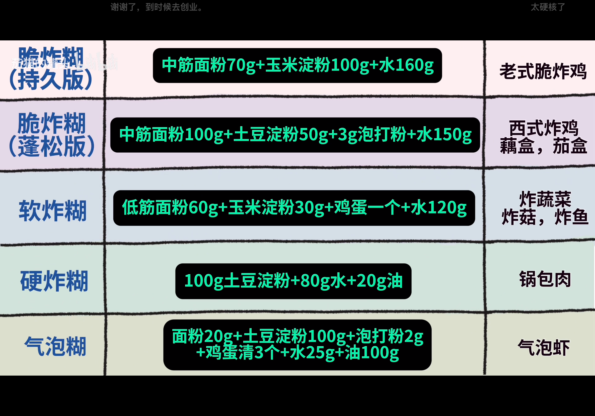

### 料酒和黄酒的区别

#### 根据菜品风味特点

- **传统中式风味浓郁的菜品**：像东坡肉、花雕鸡等经典中式菜肴，讲究醇厚、浓郁的风味和独特的酒香，使用黄酒能更好地体现菜品的传统韵味，为菜肴增添独特的风味和醇厚口感。

- **清淡鲜美的菜品**：对于清蒸鱼、清炒时蔬等追求清淡鲜美的菜品，如果需要去腥增香，料酒更为合适。料酒的味道相对较淡，不会掩盖食材本身的鲜美味道，还能恰到好处地去除腥味，增加一些香气。

#### 根据烹饪方式

- **煎、炒类菜品**：一般来说，料酒是比较常用的选择。如炒肉丝、煎鸡蛋等，烹饪时间较短，需要快速去腥增香，料酒中的酒精能快速挥发带走腥味，香辛料成分也能迅速融入食材，提升香味。

- **炖、煮、烧类菜品**：在制作红烧肉、炖排骨、红烧鱼等菜品时，由于烹饪时间较长，黄酒和料酒都可以使用。但如果想要菜品具有更浓郁的酒香和醇厚的风味，黄酒是更好的选择。黄酒在长时间的炖煮过程中，能更好地与食材相互融合，使肉质更加鲜嫩，味道更加醇厚。

#### 根据食材的腥味程度

- **腥味较重的食材**：对于如羊肉、鱼虾、内脏等腥味较重的食材，黄酒和料酒都有去腥的作用，但黄酒的去腥效果可能更好一些。黄酒的酒精含量相对较高，能够更好地溶解和挥发腥味物质，同时其醇厚的味道还能在一定程度上掩盖腥味，赋予食材独特的香味。

- **腥味较轻的食材**：对于鸡肉、猪肉等本身腥味较轻的食材，使用料酒即可满足去腥需求。料酒中的香辛料能在去腥的同时，为食材增添一些香味，使菜品味道更加丰富。

## 24款万能酱汁

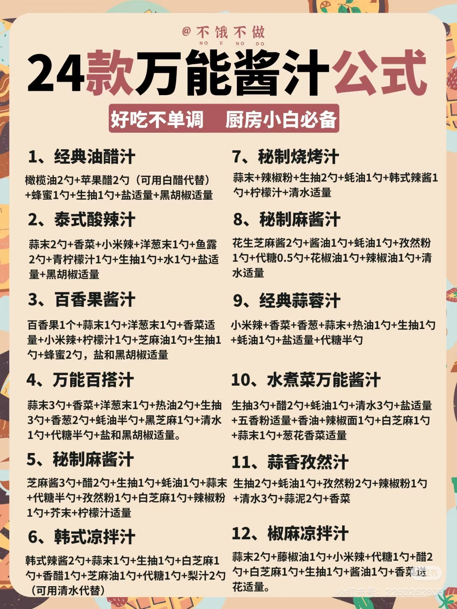

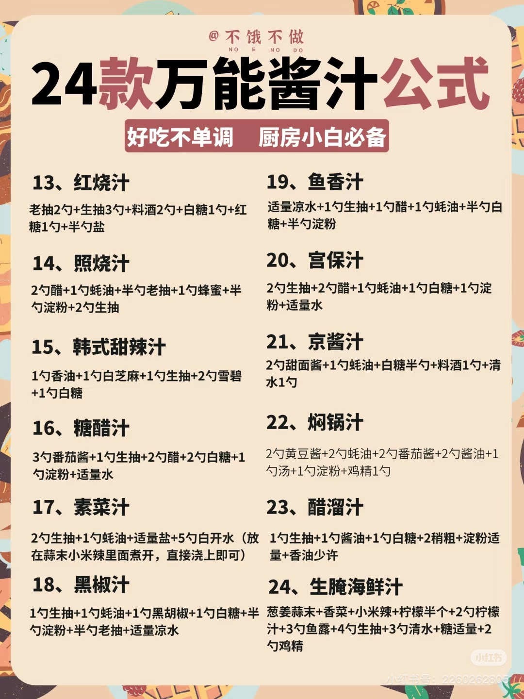

#### 照烧汁：1111

“**照烧照烧，闭眼照着，都能烧**”，小白必备，记住“**1111**”调制比例：**1勺料酒\+1勺生抽\+1勺老抽\+1勺蜂蜜**。

煎鸡腿，焖大骨，来一勺，皮脆肉嫩，比日料店还诱人。 推荐做法：**照烧鸡腿、照烧肥牛、照烧鸡翅**，全是孩子爱吃的。

#### 凉拌汁：42221

号称“**拌鞋底都香**”，按“**42221**”调：**4勺生抽\+2勺醋\+2勺蚝油\+2勺香油\+1勺糖**，最后加**蒜末、小米椒、白芝麻**增香。

**拍黄瓜**来点、**拌鸡丝**，又脆又入味，但要注意，这汁最好**现调现用**，**隔夜**蒜末会发苦。 推荐做法：**凉拌菜、凉拌面、凉拌粉、捞汁海鲜**

#### 黑椒汁：222111

“**黑椒配肉，西餐平替**”，“222111”指的是：**2勺生抽\+2勺‬蚝油\+2勺黑椒酱\+1勺老抽\+1勺黑胡椒\+1勺淀粉**，炒菜来点，肉嫩汁浓，西餐厅同款在家就能搞定。

#### 宫保汁：22111

“**盐是骨头，醋是魂**”，记住“**22111**”黄金配公式：**2勺生抽\+2勺醋\+1勺蚝油\+1勺糖\+1勺淀粉**\+4勺清水。

用它做**宫保鸡丁、宫保虾球、宫保豆腐、宫保茄子**和**宫保杏鲍菇**，外酥里嫩挂浆，下饭绝绝子。温馨提示：用不完要**密封好**冷藏，**3天内用完**，用之前记得**摇一摇**，防止沉淀。

#### 鱼香汁：22211

俗话说“**鱼香不见鱼，全凭一手汁**”，记下这个万能鱼香汁比例：“**22211**”，即**2勺生抽\+2勺醋\+2勺蚝油\+1勺糖\+1勺淀粉**，如果一人餐，量减半。

酸甜鲜嫩直冲天灵盖，**炒肉丝、拌面条**都是一绝！平时能用的菜也很多，像鱼**香肉丝、鱼香金针菇、鱼香肘子、鱼香鸡蛋**等等。

#### 糖醋汁：32211

“**糖醋糖醋，糖要当哥醋做弟**”，记住“**32211**”这个比例，**3勺番茄酱\+2勺醋\+2勺糖\+1勺生抽\+1勺淀粉**，蕃茄酱上色效果更好。

**煎荷包蛋**时，浇上一勺，汤汁拌饭能扒三碗，像**脆皮豆腐、糖醋里脊、糖醋藕片、糖醋大虾**，用的都是这个料汁，调完**24小时内最好用完**，放久了会泛酸。

**【温馨提示】** 1\.用不完的料汁，**用冰格冻成块**，煮面、炒菜丢2块，味道不输现调； 2\.蚝油开封后冷藏超**1个月**易长霉，结块应赶紧扔； 3\.烧菜味道**补救妙招：** 太咸 ➜ 加**糖或土豆片**吸盐； 太酸 ➜ 挤**蜂蜜或加牛奶**； 太稀 ➜ **微波炉叮30秒**收汁。

### 东北酸甜酱

根据多个东北菜谱的酸甜口做法总结，东北酸甜口的精髓在于糖醋比例的平衡与食材的自然酸甜融合，以下为具体做法及要点：

**一、基础酸甜汁调配** 东北酸甜口的灵魂在于料汁调配，核心比例为 糖:醋=1:1（可根据口味微调）： • 经典配方：白糖3勺 \+ 陈醋3勺 \+ 生抽1\-2勺 \+ 蚝油1勺 \+ 清水2勺（增稠可加淀粉）。

• 升级版：加入番茄酱1勺提鲜，或西红柿炒出汁替代部分醋，增加自然酸甜感。

• 适用菜式：炒方便面、锅包肉、溜肉段、地三鲜等。

**二、经典东北酸甜口菜肴做法** **1\. 东北酸甜炒方便面（烧烤店同款）** • 食材：方便面2包、鸡蛋2个、西红柿1个（带皮更香）、火腿肠1根、洋葱/卷心菜/豆芽等配菜。

• 步骤：

1. 方便面煮至松散（1分钟）后过凉水沥干，拌油防粘。

2. 热油煎蛋至焦边盛出，爆香蒜末、干辣椒，下西红柿炒出红汁。

3. 加入蔬菜（洋葱、豆芽等）炒软，倒入调好的酸甜汁煮沸。

4. 放入方便面快速翻炒裹汁，最后加煎蛋和火腿肠翻匀。

**2\. 锅包肉（外酥里嫩酸甜口）** • 食材：猪里脊300g、淀粉100g、白醋3勺、白糖3勺、胡萝卜丝/姜丝点缀。

• 关键步骤：

1. 肉片腌渍（盐\+料酒\+蛋清）后裹淀粉糊，七成油温炸至定型，复炸至酥脆。

2. 另起锅炒香姜蒜，倒入糖醋汁（糖醋\+番茄酱）熬至粘稠，快速裹肉片。

3. 出锅前淋一勺明油提亮，撒香菜增香。

**三、关键技巧**

1. 酸甜平衡：东北酸甜口讲究“入口先酸后甜”，醋优先选陈醋或白醋，白糖可部分替换为冰糖提亮。

2. 食材处理：

• 西红柿不去皮直接炒，保留果酸香气。

• 煎蛋需焦边，增加油脂香气。

1. 火候控制：炒汁用中大火收汁，保持汤汁裹面不干（湿炒特色）；炸物需二次复炸保酥脆。

**四、风味延伸** • 溜肉段：肉块炸脆后裹酸甜汁，加青椒、胡萝卜配色。

• 地三鲜：茄子、土豆过油后，用糖醋汁焖炒至入味。

• 凉拌菜：糖醋汁\+辣椒油拌黄瓜、豆芽等，酸甜微辣开胃。

### 酸奶薄荷酱

**材料**：

- 原味酸奶 150 克、沙拉酱50g、蛋黄酱\(美奶滋\)20g、马斯卡彭50g

- 薄荷叶适量（约 10 片左右）

- 蜂蜜 10 毫升

- 柠檬汁10g

- 半根黄瓜切片

**步骤**：

1. 先将薄荷叶洗净，沥干水分，切碎备用。

2. 加入酸奶、蜂蜜、柠檬汁、半根黄瓜切片和切碎的薄荷叶。

3. 启动搅拌机，将所有材料搅打均匀，打成细腻的糊状。

4. 把打好的酸奶薄荷酱倒入干净的容器中，盖上盖子，放入冰箱冷藏，使其口感更佳，冷藏后即可搭配凤尾虾等食物享用。

### 万能凉拌汁

碗中加入蒜末、葱花、小米辣、白芝麻，淋上热油激发出香味，再加入生抽2勺、香醋2勺、蚝油1勺、白糖1勺、盐和鸡精适量、香油1勺搅拌均匀。

### 东北烤肉\-酸甜水料

以下是一份烤肉秘制蘸料水料配方：

材料：生抽两勺、蚝油一勺、鱼露一勺、白糖半勺、柠檬汁少许、凉白开三勺、蒜末适量、小米辣碎适量、葱花适量、洋葱

做法：将生抽、蚝油、鱼露、白糖放入碗中，加入凉白开搅拌均匀。再挤入少许柠檬汁增添清新口感，接着放入蒜木、小米辣碎和葱花。

- 韩式烤肉吃法，通常会用新鲜的生菜叶或苏子叶包裹着蘸好酱料的烤肉，同时搭配一些辣椒圈和泡菜一起食用

- 山葱叶、烤肉、山葵酱、蒜片、泡菜

### 日式酱油

清酒、味淋、酱油，1:2:3一起煮，煮开了泡上昆布和木鱼花，泡一夜== 酱油都是加葱姜料酒冰糖，有酒有糖煮酱油

### 家庭版味淋

​**​配方：清酒50ml \+ 薄盐酱油15ml \+ 冰糖20g \+ 清水30ml​**​ ​**​步骤​**​：

1. 清酒、酱油、冰糖、水混合，小火煮至糖完全溶解；

2. 关火后​**​可选择性加入1小片陈皮​**​煮沸10秒（提香不抢味），立即捞出陈皮；

3. 晾凉后使用，用量约为原味淋的80%（避免过咸）。

​**​🌟优势​**​：

- 冰糖弥补甜度，薄盐酱油控制咸度；

- 陈皮短暂加热仅保留清香，避免药味过重。

#### ✅ ​**​更推荐的三种高效替代法​**​（适合不同场景）

1. ​**​经典米酒糖水​**​（通用性强）：

- ​**​配方​**​：米酒/料酒100ml \+ 冰糖30g \+ 清水50ml，煮至糖融。

- ​**​适用​**​：照烧鸡、寿喜烧等需甜咸平衡的料理。

1. ​**​蜂蜜果醋调和​**​（清爽果香）：

- ​**​配方​**​：蜂蜜40g \+ 苹果醋20ml \+ 温水20ml，直接混合。

- ​**​适用​**​：凉拌菜、海鲜类，中和油腻感。

1. ​**​梨汁自然甜​**​（无酒精版）：

- ​**​配方​**​：梨汁80ml \+ 生抽10ml，梨汁需先熬煮浓缩。

- ​**​适用​**​：儿童餐、忌酒人群。

#### ⚠️ ​**​关键注意事项​**​

1. ​**​避免直接使用料酒​**​：中式料酒含辛香料，可能产生苦味（优先选米酒/日式清酒）。

2. ​**​控制煮沸时间​**​：酒精挥发过度会损失风味，煮至微沸即可关火。

3. ​**​酱油选择​**​：用薄盐生抽或日式淡口酱油，普通酱油需减量30%。

尝试石锅肥牛拌饭，推荐用​**​优化版清酒糖水方案​**​（清酒\+冰糖\+酱油），甜咸比最接近原版味淋。若需进一步简化，可用1勺蜂蜜\+1勺米酒直接混合（免煮）。

### 酸辣汁

酸辣汁的魅力在于它能瞬间激活味蕾。下面我为你整理了几款风味各异的酸辣汁配方、详细的制作要领以及一些创意应用，希望能给你的餐桌带来更多惊喜。

#### 🌶️ 几款经典的酸辣汁配方 

你可以根据手边的食材和想要搭配的菜肴来选择：

**中式经典酸辣汁**的调制方法如下：

- **食材**​：蒜末、葱花、辣椒粉（或小米椒圈）、花椒、白芝麻、食用油、生抽、陈醋、白糖、盐。

- **做法**​：锅中放油烧热，放入花椒炸出香味后捞出。将热油淋入放有辣椒粉（或小米椒）、蒜末、葱花的碗中激发出香味。然后加入适量生抽、陈醋、少许白糖和盐调味，最后撒上白芝麻搅拌均匀即可。醋和糖的比例大致在3:2会比较平衡。

**麻酱酸辣汁**的调制方法如下：

- **食材**​：芝麻酱、辣椒红油、香醋、生抽、姜末、蒜末、白糖、盐。

- **做法**​：先用少许芝麻油或水将芝麻酱调开呈顺滑状态。然后加入辣椒红油、香醋、生抽、姜蒜末、白糖和盐等所有调料，充分搅拌均匀即可。

**泰式清新酸辣汁**的调制方法如下：

- **食材**​：青金桔或柠檬、鱼露、洋葱、小米辣、线椒、蒜蓉、香菜and香菜根、白糖（或椰糖）、少量凉开水。

- **做法**​：挤出青金桔或柠檬汁。将白洋葱、小米辣、线椒、蒜蓉、香菜切碎，与鱼露、白糖、凉开水以及挤好的柠檬汁混合均匀即可（破壁机打5s）

#### 💡 制作要点与风味调整 

- **激发香味**​：制作中式酸辣汁时，用热油**炝香**花椒、辣椒粉、蒜末等香料是关键步骤，能极大提升复合香味。

- **平衡酸辣**​：​**酸**和**辣**是基础，但**咸**和**甜**​（通常用糖或蜂蜜）的加入对于平衡风味、使口感柔和醇厚至关重要。你可以根据口味调整比例，例如喜酸则多放醋，喜甜则稍多加糖。

- **选用新鲜食材**​：特别是泰式酸辣汁，使用新鲜的柠檬汁、小米辣和香菜，风味会好很多。

- **静置融合**​：调好的酸辣汁可以静置10\-15分钟，让各种调味料的味道充分融合，风味更佳。

【泰式火锅酱】

小米椒2条、蒜头5个、芝麻油3勺、辣椒面1勺、白醋3勺、酱油3勺、番茄酱3勺、蚝油1勺、是拉差辣椒酱3勺、白芝麻

【泰式烤肉酱】

是拉差辣椒酱3勺、椰糖2勺、酱油2勺、白醋3勺、白芝麻1勺、蒜末1勺、小米辣1勺

【泰式红椒海鲜酱】

指天椒5个、大蒜5个、青柠檬汁3勺、鱼露3勺、椰糖2勺、少少纯净水、香菜头2个

【泰式绿椒海鲜酱】

绿指天椒5个、青柠檬汁3勺、鱼露3勺、椰糖2勺、少少纯净水、香菜头2个、大蒜5个

【泰式香茅柠檬汁】

蒜末5个、香茅碎2勺、鱼露3勺、椰糖1勺、柠檬汁2勺

【泰式酸辣汁】

香菜2个、小米辣1勺、蒜5个、椰糖1勺、柠檬汁2勺 、线椒1个、鱼露2勺、水2勺

#### 🍽️ 酸辣汁的创意应用 

除了常规的凉拌和蘸食，酸辣汁还可以有更多有趣的用法：

- **蒸海鲜**​：在清蒸鱼或虾即将出锅时，淋上泰式酸辣汁，再焖一分钟，去腥增香。

- **拌饭/拌面**​：作为汤面的汤底，或者直接拌饭、拌粉，非常开胃。

- **腌制小菜**​：用来腌制黄瓜、萝卜等蔬菜，快速制成开胃小菜。

- **提味酱料**​：炒菜或做汤时，可以加一勺酸辣汁，增加复合风味。

### **泰式风味烤肉酱料汇总**

### **粤菜/港式风味烤肉酱料汇总**

**总结建议**：

- **泰式酱料**：擅长用**酸、辣、香草**带来清爽刺激的体验，适合搭配海鲜、鸡肉及猪肉。

- **粤港式酱料**：擅长用**咸、甜、醇厚**的酱汁衬托肉香，尤其适合搭配油脂丰富的烧味、鸭鹅及猪肉。

### 卤牛肉蘸汁

蒜末\+小米辣\+盐\+糖\+生抽\+醋\+卤牛肉汤底\+香油\+葱花\+香菜

### 拌面酱料

---

#### 核心自制酱料“三步法” 

1. **葱油酱 \(可储存\)**

- **心法**：**小火慢熬，葱香入油，酱油后下。**

- **步骤**：

- a\.  **熬葱**：小葱切长段。冷油下锅，中小火将葱白炸至微黄，下葱绿，全程慢炸至葱段焦黄酥脆（勿黑），捞出葱段。

- b\.  **激酱**：关火，待油温略降（约5成热），倒入混合好的酱汁（生抽:老抽:糖 ≈ 3:1:1），小心溅油。

- c\.  **融合**：开最小火，搅拌至糖融化、微沸即关火。晾凉后，可将炸干的葱段放回，密封冷藏。

2. **家常炸酱 \(可储存\)**

- **心法**：**肥瘦肉末煸酥，酱料炒香，水油融合。**

- **步骤**：

- a\.  **煸肉**：锅热倒油，下肥瘦相间的猪肉末，中火煸炒至出油、肉粒酥香。

- b\.  **炒酱**：下葱姜末爆香，倒入稀释的干黄酱（或黄豆酱混合甜面酱），小火慢炒至酱香浓郁、油酱分离。

- c\.  **炖煮**：加少许热水，小火咕嘟5\-10分钟至酱汁浓稠，根据口味补糖或盐。出锅可撒葱末。

3. **鲜辣线椒酱 \(可储存\)**

- **心法**：**食材无水，热油激香，白酒防腐。**

- **步骤**：

- a\.  **备料**：鲜线椒（或小米辣）、大蒜、少许姜，洗净后**彻底擦干**，分别切碎或搅碎。

- b\.  **调味**：将辣椒碎、蒜末、姜末混合，加盐、糖、少许高度白酒拌匀。

- c\.  **激香**：烧热食用油（可加花椒增香），淋在混合物上，迅速拌匀。晾凉后密封冷藏。

---

#### 使用心法 

- **一酱多吃**：自制葱油、炸酱、线椒酱，一次多做，密封冷藏，是厨房高效的“战略储备”。

- **风味叠加**：遵循 **“基础咸鲜（酱油/酱）\+ 特色风味（葱油/辣油/麻酱）\+ 口感层次（花生碎/蒜末/蔬菜丝）”** 的公式，任意组合皆可成美味。

- **懒人优选**：沙茶酱、意面酱、蛋黄酱等，市售品质稳定，是“5分钟拯救一碗面”的终极法宝。

好的，Mr\.Wang。这份“无敌蘸水”合辑是拯救清淡饮食的利器。我已将视频中的精华为您系统化总结，并生成您所要求的专业模板。它将成为您厨房中灵活调味的“风味武器库”。

### 《6款无敌蘸水：点亮水煮菜的灵魂》 

本篇指南为您整合六款风格迥异的经典蘸水，其通用精髓在于 **“因地制宜，灵活变幻”**——利用手边易得的调味料与香料，通过不同的组合与预处理（如烤、捶、打碎），在几分钟内创造出层次丰富的复合味型，将简单的水煮菜、白灼肉或凉面瞬间点化成风味大餐。其核心逻辑是 **“基础咸鲜定调，特色香料点睛，液体平衡质地”**。

**通用技巧（如视频开头提示）：**

- **减辣方案**：将辣味元素（辣椒、辣酱）替换为香气浓郁的香草（如香菜、葱、薄荷）或不辣的酱料（如黄豆酱、香菇酱）。

- **计量参考**：下文“勺”如无特别说明，指标准中式瓷汤匙（约15毫升），茶匙约5毫升。请根据个人口味调整。

---

#### 一、茶香冷萃蘸汁 

##### 食材清单 

*（约制作2\-3人份蘸汁）*

##### 调配步骤 

1. **冲泡茶汤**：用热水冲泡乌龙茶，放凉至室温或冷藏备用。

2. **混合调料**：在大碗中，先加入**白糖、盐、味精**，倒入**生抽和米醋**，搅拌至糖盐基本融化。

3. **加入风味**：倒入冷却的**乌龙茶汤**，挤入**小青柠汁**。

4. **冰镇完成**：加入满杯的**冰块**，撒上**熟白芝麻**，轻轻搅匀即可。

##### 成功关键与风味解析 

- **成功关键**：

    1. **茶汤选择**：使用**冷泡或充分冷却的茶汤**，避免热茶破坏其他风味并产生涩味。乌龙茶独特的焙火香与果香是首选。

    2. **冰镇**：**必须加足量冰块**。低温能使酸甜咸鲜各种味道更清晰、柔和，产生独特的“冷萃”感，是这道蘸汁的灵魂。

    3. **酸甜平衡**：白糖需充分搅拌融化，与米醋、青柠汁形成明亮的酸甜底，是开胃的关键。

- **风味解析**：入口首先是**冰爽刺激**，随后是**乌龙茶的醇厚回甘**与**酱油的咸鲜**在口中化开，米醋与青柠带来清新的果酸，尾调是芝麻的坚果香。整体风味复杂而和谐，极其清爽。

##### 应用场景与健康提示 

- **最佳搭配**：**过水面条、冰镇秋葵、白灼虾、盐水鸡胸肉**。堪称“夏日救星”。

- **健康提示**：含糖量较高，可酌情减糖。味精可选。整体为冷食，肠胃虚弱者慎用。

---

#### 二、贵州糊辣椒蘸水 

##### 食材清单 

*（约制作2\-3人份蘸料基础）*

##### 调配步骤 

1. **制作糊辣椒**：干辣椒放入空气炸锅**180℃烤3\-5分钟**，或干锅小火焙烤至**深褐色、微焦出香**。与盐、味精一同放入结实的食品袋，用擀面杖捶打碾碎成粗颗粒状。

2. **组合碗汁**：碗中放入**3汤匙糊辣椒面**、**1汤匙蒜泥**、**2汤匙生抽**。

3. **兑汤完成**：浇入**3\-4汤匙热的面汤或煮蔬菜的水**，搅拌均匀即可。

##### 成功关键与风味解析 

- **成功关键**：

    1. **辣椒火候**：辣椒需烤到**焦香但未发黑**（微糊），这是产生独特“糊辣香”的关键，过火会苦。

    2. **手工捶打**：用食品袋和擀面杖捶打，能获得颗粒粗细不均的辣椒碎，比机器打粉的香气更复合，口感更好。

    3. **原汤化原食**：务必加入**煮食材的原汤**，这是贵州蘸水的精髓，让蘸水与食物风味融为一体。

- **风味解析**：扑鼻而来的是**霸道而温暖的糊辣椒焦香**，入口是**生蒜的辛辣**与**酱油的咸鲜**，辣味直接而醇厚，不刺激喉咙。原汤的加入让所有味道柔和地融合在一起，非常质朴、开胃，极具江湖气。

##### 应用场景与健康提示 

- **最佳搭配**：**水煮青菜、白切肉、豆花、火锅蘸料**，万能基础蘸水。

- **健康提示**：辣椒烤制后燥性降低。钠含量来自酱油和盐，注意总量。蒜泥生食，刺激性较强。

---

#### 三、傣味喃咪（烤番茄酱） 

##### 食材清单 

*（约制作1小碗）*

##### 调配步骤 

1. **烤制食材**：无油平底锅，放入**整个小番茄、带皮大蒜、辣椒**，中火慢烤，不时翻动，直至**表皮均匀地焦黑、变软**。

2. **打碎**：将烤好的食材（可去皮）放入石臼或搅拌机，捣碎/打碎成带有颗粒感的酱状。

3. **调味**：加入**白糖、盐、生抽、味精**，搅拌均匀即可。

##### 成功关键与风味解析 

- **成功关键**：

    1. **充分烤焦**：食材必须烤到**表皮发黑、起皱**，这样才能产生独特的烟熏炭火风味，是“喃咪”的灵魂。

    2. **保留颗粒感**：不要打成完全顺滑的酱，保留一些番茄和辣椒的颗粒，口感更丰富。

- **风味解析**：口感浓稠，味道**浓郁复杂**。融合了**烤番茄的浓缩酸甜**、**烤蒜的焦香**、**烤辣椒的糊辣**，以及酱油和糖带来的咸甜底味。是一种原始、野性而迷人的味道。

##### 应用场景与健康提示 

- **最佳搭配**：**烤罗非鱼、包烧菜、生食黄瓜/野菜蘸酱、搭配糯米饭**。

- **健康提示**：烤焦部分含有丙烯酰胺，不宜大量频繁食用。糖盐用量较高，注意控制。

---

#### 四、泰式酸辣汁 

##### 食材清单 

*（约制作1碗）*

##### 调配步骤 

1. **打碎香料**：将**大蒜、洋葱、香菜、辣椒**放入搅拌机，打碎成细末（也可用石臼舂）。

2. **混合调味**：将打碎的香料倒入碗中，加入**鱼露、柠檬汁、凉开水、白糖、盐、味精**。

3. **调和完成**：充分搅拌至白糖融化，尝味调整即可。

##### 成功关键与风味解析 

- **成功关键**：

    1. **舂打香料**：舂打或搅打能让香菜、辣椒的香气物质充分释放，比单纯切碎风味强数倍。

    2. **鱼露与柠檬的平衡**：鱼露的咸鲜与柠檬的酸爽是两大支柱，白糖是让它们和谐共处的关键桥梁，务必达到“酸辣咸鲜甜”五味平衡。

- **风味解析**：**极具冲击力**的复合味道。入口是**柠檬的明亮酸爽**和**香菜的异域清香**，随后**鱼露的咸鲜**和**辣椒的鲜辣**在口中爆开，白糖的回味让一切变得圆润可口，非常开胃解腻。

##### 应用场景与健康提示 

- **最佳搭配**：**海鲜刺身、白灼虾、泰式沙拉、烤鸡、春卷**。

- **健康提示**：鱼露钠含量极高，高血压人群需慎用或少用。生蒜、生辣椒对肠胃有刺激。

---

#### 五、潮汕沙茶捞汁 

##### 食材清单 

*（约制作1\-2人份蘸料）*

##### 调配步骤 

1. **澥开酱料**：碗中放入**沙茶酱和花生酱**，少量多次加入**热开水**，朝一个方向耐心搅拌，直至变成顺滑、可流动的酱汁。

2. **调味**：加入**生抽、鱼露、白糖**，搅拌均匀。

3. **增香**：最后撒上**蒜泥和葱花**即可。

##### 成功关键与风味解析 

- **成功关键**：

    1. **热水澥酱**：必须用**热水**，才能让沙茶酱和花生酱彻底化开，融合均匀，形成醇厚不腻的汁状。冷水会导致酱料分离、结块。

    2. **耐心搅拌**：需朝一个方向持续搅拌，使其乳化均匀。

- **风味解析**：口感**浓稠顺滑**，味道**醇厚鲜美**。沙茶酱复杂的辛香、虾米鲜味与花生酱的坚果油脂香完美结合，咸中带甜，香味持久，能牢牢包裹住食材。

##### 应用场景与健康提示 

- **最佳搭配**：**潮汕牛肉火锅、白灼牛百叶/猪杂、捞面、拌粿条**。

- **健康提示**：**热量较高**，因含花生酱和油脂。钠含量也高。适量食用。

---

#### 六、辣肉豆乳浓汤（低卡版） 

#### 食材清单 

*（约制作1\-2人份汤蘸）*

##### 调配步骤 

1. **煸炒肉末**：不粘锅不放油，直接下**肉末**，中小火煸炒至松散、出油、变色。

2. **炒香酱料**：加入**蒜泥、辣豆瓣酱、生抽**，与肉末一同炒出红油和香味。

3. **加豆浆煮制**：倒入**浓豆浆**，煮沸后转小火再煮1\-2分钟，根据豆浆浓稠度和口味，酌情加盐调整，即可。

##### 成功关键与风味解析 

- **成功关键**：

    1. **无油起锅**：利用肉末自身的脂肪煸炒，达到“低卡”目的。

    2. **炒香豆瓣酱**：豆瓣酱一定要在油中炒出红油和香味，去除生酱味。

    3. **使用浓豆浆**：豆浆越浓，汤底越醇厚，不易被煮散。

- **风味解析**：看似清淡，实则味道**醇厚微辣**。豆浆的豆香和醇厚感打底，融合了肉末的荤香和豆瓣酱的咸鲜微辣，口感顺滑，饱腹感强，风味独特。

##### 应用场景与健康提示 

- **最佳搭配**：**直接作为低卡汤品、涮煮蔬菜、豆腐、魔芋丝，或作为面条汤底**。

- **健康提示**：相对低脂低卡，蛋白质含量不错。注意豆瓣酱和生抽的钠含量。

### 六款万能蘸水详细步骤表 

---

### 万能水煮菜清单（适配以上所有蘸水） 

您可以将以下食材进行简单水煮（水中可加少许盐和油保持色泽/底味），煮熟后捞出，搭配上表任意蘸水食用（蘸水密封冷藏可存放 2\-3 天）。

### 厨房酱料完整汇总表

|类别|酱料名称|主要风味|常用用途|
|---|---|---|---|
|香油/葱油类|葱油|葱香、清香|拌面、凉拌、汤面、蘸料|
||香油（芝麻油）|浓香、醇厚|增香、凉拌、汤、火锅|
||花椒油|麻香|凉拌、川菜、拌面|
||藤椒油|鲜麻清香|凉拌、米线、麻辣烫|
|酱油类|生抽|咸鲜、淡色|炒菜、凉拌、提鲜|
||老抽|咸香、深色|上色、红烧、卤味|
||味极鲜|鲜浓|凉拌、蘸食、快炒|
||蒸鱼豉油|鲜咸清甜|蒸鱼、海鲜、白灼|
||红烧酱油|甜咸厚重|红烧肉类|
|醋类|陈醋|酸香醇厚|凉拌、饺子、面食|
||香醋|柔和酸香|凉拌、蘸料|
||米醋|清淡酸味|炒菜、腌制、凉拌|
||白醋|纯酸无色|泡制、去腥、调色|
||黑醋|酸甜浓郁|蘸食、沙拉、中式西餐|
|盐糖鲜类|盐|咸味|基础调味|
||白糖|甜味|提鲜、中和、红烧|
||冰糖|清甜|炖肉、卤味、上色|
||蚝油|鲜咸、蚝香|炒菜、勾芡、凉拌|
||鸡精/味精|鲜味|提鲜|
|豆瓣酱/辣酱|郫县豆瓣|咸辣、酱香|川菜、回锅肉、麻婆豆腐|
||线椒酱（鲜椒酱）|鲜辣、清香|拌面、蘸馍、凉拌、炒菜|
||蒜蓉辣椒酱|蒜香\+辣|蘸食、拌面、烧烤|
||剁椒|鲜辣、咸香|剁椒鱼头、蒸菜|
||野山椒（泡椒）|酸辣|泡椒凤爪、川菜|
||老干妈（油辣椒）|香辣油润|拌面、下饭、炒菜|
||小米辣辣酱|劲辣|重辣菜、蘸水|
||韩式辣酱|韩国风味|韩式烤肉、拌饭|
|腐乳/豆豉类|白腐乳|咸香、微甜|蘸粥、红烧、焖肉|
||红腐乳|咸香、酒香|南乳肉、红烧、火锅蘸料|
||豆豉|咸香、发酵|蒸鱼、炒菜、回锅肉|
|西式/沙拉类|番茄酱|酸甜|炒菜、薯条、茄汁类|
||番茄沙司|更甜|蘸食、西餐|
||沙拉酱（香甜）|甜香|水果、沙拉、汉堡|
||千岛酱|酸甜微咸|沙拉、海鲜|
||黑胡椒酱|黑椒咸香|牛排、意面、烤肉|
|芝麻酱/花生酱|芝麻酱|浓香|热干面、凉拌、火锅蘸料|
||花生酱|香甜|拌面、蘸食、甜品|
|特色调味|甜面酱|甜咸酱香|京酱肉丝、烤鸭蘸酱|
||黄豆酱|咸香豆味|蘸葱、炒菜、炖菜|
||柱侯酱|浓甜咸香|焖牛腩、煲仔菜|
||沙茶酱|咸甜鲜香|火锅、牛肉、拌面|
||XO酱|鲜咸干贝香|炒饭、拌面、蒸蛋|

